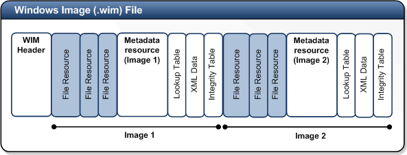

- [**WIM -- Základní stavební kámen instalace** \[1\]](#wim----základní-stavební-kámen-instalace-1)
  - [**Struktura WIM souboru**](#struktura-wim-souboru)
  - [**Fáze instalace operačního systému**](#fáze-instalace-operačního-systému)
    - [**Fáze 1 -- Down-level**](#fáze-1----down-level)
      - [**Prováděné akce:**](#prováděné-akce)
    - [**Fáze 2 -- WinPE**](#fáze-2----winpe)
      - [**Prováděné akce:**](#prováděné-akce-1)
    - [**Fáze 3 -- FirstBoot**](#fáze-3----firstboot)
      - [**Prováděné akce:**](#prováděné-akce-2)
  - [**Konfigurační fáze instalace**](#konfigurační-fáze-instalace)
  - [**Sysprep** \[2\]](#sysprep-2)
    - [**Omezení použití nástroje sysprep**](#omezení-použití-nástroje-sysprep)
    - [**Popis práce sysprep**](#popis-práce-sysprep)
    - [**Parametry nástroje sysprep**](#parametry-nástroje-sysprep)
  - [**Windows ADK**](#windows-adk)
- [AutomatedLab](#automatedlab)
  - [Lab L00 -- konfigurace virtuálních stanic](#lab-l00----konfigurace-virtuálních-stanic)
- [**Společné úkoly**](#společné-úkoly)
  - [**Lab L00 -- Instalace Windows ADK**](#lab-l00----instalace-windows-adk)
  - [**Lab LS01 -- Vytvoření WinPE**](#lab-ls01----vytvoření-winpe)
  - [**Lab LS02 -- Úprava instalačního obrazu**](#lab-ls02----úprava-instalačního-obrazu)
  - [**Lab LS03 -- Příprava vzorové stanice (Master PC) a vytvoření obrazu**](#lab-ls03----příprava-vzorové-stanice-master-pc-a-vytvoření-obrazu)
  - [**Lab LS04 -- Příprava cílového PC a nasazení vlastního obrazu**](#lab-ls04----příprava-cílového-pc-a-nasazení-vlastního-obrazu)
- [**Bodované úkoly**](#bodované-úkoly)

# **WIM -- Základní stavební kámen instalace** \[1\]

V případě, že jste u předchozích verzí operačních systémů (Windows XP a
níže) připravovali automatizovanou instalaci, mohla tato instalace být
dvojího druhu. První možností byl tzv. *unattended setup*, čili klasická
instalace, modifikovaná několika soubory s odpověďmi. Druhou možností
pak bylo klonování nebo duplikování disků. Tuto možnost využívali
především OEM výrobci a velké organizace, přičemž příprava takového
obrazu disku nebyla zrovna nejjednodušší. Pokud již takový obraz disku
byl připraven a nasazen do produktivního provozu, bylo nezbytně nutné
dodržovat standard v hardware, který byl provozován. Pokud se v dnešní
době podíváme do jakékoliv firmy, nalezneme několik druhů hardware,
který je provozován a o který se IT správci musí starat -- příkladem
mohou být notebooky, stolní počítače, jejich různí výrobci atd. V
ideálním případě existují 2 obrazy disků: stolní počítač a notebook.
Realita však ukazuje, že organizace běžně mají (a musí udržovat) i 5-10
různých obrazů disků pro instalaci, či instalace jako takové. Jak nám
tedy v tomto pomůže Windows 10, resp. instalační technologie, které jsou
její součástí? Jak zajistíme menší počet potřebných instalací, či obrazů
disků pro jednotlivé instalace?

Odpovědí na předchozí dotazy je WIM (*Windows Imaging*). Jedná se o
technologii pro instalaci operačních systémů Windows od verze Windows
Vista a Windows Server 2008. Všechny instalace Windows jsou tzv. *Image
Based Setup* (IBS). Pokud se podíváte na instalační DVD Windows,
naleznete 2 soubory WIM. První nese název **boot.wim** a obsahuje
Windows PE. Druhý soubor se jmenuje **install.wim** a obsahuje
*klonovou* instalaci Windows. Ano, i na DVD médiu, které je prodáváno
v obchodech koncovým uživatelům, je instalace prováděna z obrazu disku.

Další novinkou a výhodou instalace Windows -- ať se jedná o upravenou
instalaci z originálního DVD média anebo vytvořený vlastní obraz disku
-- je nezávislost na hardware. Právě díky této vlastnosti je možné
připravit instalace Windows z jediného počítače pro jakékoliv další, i
pokud obsahují kompletně jiný hardware. Při využití takové instalace je
možné omezit počet instalačních zdrojů na dva. Jeden image pro platformu
x86 a druhý pro x64, kde však oba typy instalací mohou být v rámci
jednoho souboru.

Obdobně, jako jsou Windows nezávislá na hardware, jsou také nezávislá i
jazykově -- to znamená, že je možné do jediného image připravit
instalaci pro více jazyků a velikost výsledného WIM souboru bude
zvětšena pouze o velikost jazyka jako takového (cca 150MB v rozbaleném
stavu). Jazyk ve Windows je vlastně jakousi komponentou a lze říci, že i
základní angličtina je přidaný jazyk nad operační systém. Je tedy možné
(což opět u Windows XP nebylo) nainstalovat například českou verzi
Windows a následně doinstalovat anglický jazyk, původní jazyk odebrat.
Obdobná situace je u hotfixů -- opravných balíčků, které se netýkají
jazyka jako takového -- jsou jazykově nezávislé a nezáleží tedy, jakou
jazykovou verzi aktualizace instalujete, respektive aktualizace nejsou
dostupné v jazykových verzích.

V rámci ukládání dat ve WIM souboru je využito technologie
*single-instancing*, která zajišťuje, že každý soubor ve WIM bude
obsažen pouze jednou. Jinými slovy, pokud existuje v rámci WIM image
více instalací Windows, budou soubory uložené ve WIM souboru pouze
jednou a takto uložené soubory jsou sdíleny mezi jednotlivými
instalacemi. Právě díky této technologii je dosaženo dramatického
snížení nároků na diskový prostor. Jednotlivé soubory jsou také
komprimovány pomocí algoritmů LZX, XPress anebo jsou uloženy v
nekomprimované podobě. Zvolený druh komprese má přímý vliv na dobu
vytváření (nikoliv však aplikaci) image. Standardní nastavení je XPress.

## **Struktura WIM souboru**

-   **WIM Header** -- Hlavička definuje obsah WIM souboru jako paměťové
      umístění klíčových zdrojů a různých souborových atributů (verze,
      velikost, typ komprese).

-   **File Resources** -- Obsahuje seznam balíčků se zachycenými daty,
      soubory instalace.

-   **Metadata** -- Obsahuje informace o zachytávaných souborech,
      například umístění v adresářové struktuře a souborové atributy.
      Každý WIM soubor obsahuje právě jeden soubor s metadaty pro každý
      obraz instalace.

-   **Lookup Table** -- Obsahuje umístění souborů v rámci WIM souboru.

-   **XML Data** -- Dodatečné informace o obrazu.

-   **Integrity Table** -- Tabulka s bezpečnostními údaji (*hash*) k
      možnosti ověření integrity souborů.



Struktura souboru WIM také umožňuje rozdělení na více médií, která jsou
při následné aplikaci resp. instalaci WIM souboru opět složena do
jediného velkého WIM souboru.

## **Fáze instalace operačního systému**

Instalace Windows je možné rozdělit na několik po sobě jdoucích fází,
které se liší podle typu instalace -- *clean install*, tedy instalace
počítače, kde se nebude provádět upgrade stávajícího operačního systému.
Druhým typem instalace je *upgrade install*, tedy taková instalace,
která je spuštěna ze stávajícího operačního systému. Základní fáze
instalace Windows jsou rozděleny na:

1.  **Down-level** -- první fáze, která je využita pouze při upgrade
    nebo pokud je setup spuštěn z  existujícího operačního systému.

2.  **WinPE** -- první fáze při instalaci operačního systému z
    originálního DVD či připraveného WIM souboru. Pokud jde o upgrade
    instalaci, jedná se o druhou fázi.

3.  **FirstBoot** -- finální fáze instalace operačního systému, ve které
    je prováděna personifikace systému (nastavení uživatelského
    prostředí a počítače) a spouštěna část OOBE ze souboru
    **unattend.xml**.

### **Fáze 1 -- Down-level**

Down-level fáze je spuštěna pouze v případě, kdy je instalace Windows
nastartována ze stávajícího běžícího operačního systému nebo se jedná o
upgrade instalaci. Pokud se jedná o upgrade instalaci, pak se down-level
fází rozumí získání informací o systému a uživatelském nastavení.

#### **Prováděné akce:**

1.  Ověření produktového klíče (PID). Pokud není PID zadán, je operační
    systém instalován jako trial. Následné zadání klíče je pak možné v
    nainstalovaném operačním systému.

2.  Vytvoření dočasné adresářové struktury **\$Windows\~BT** a
    **\$Windows\~LS**.

3.  Extrahování souboru **Boot.wim** do adresáře **Windows\~BTWindows**.

4.  Editace úložiště boot konfigurace (BCD store) tak, aby ukazovala do
    adresáře **Windows\~BTWindows**.

5.  Načtení informací o disku a to včetně umístění adresářů pro
    uživatelská data.

6.  Zakázání System restore.

### **Fáze 2 -- WinPE**

Ve fázi WinPE se definuje umístění WIM souboru (image), který se bude
aplikovat a zdrojové adresáře. Podle toho, jak je spuštěn setup, je
definováno, která fáze je WinPE -- první nebo druhá. To záleží na tom,
zda provádíme upgrade nebo čistou instalaci.

#### **Prováděné akce:**

1.  Získání informací o pevných discích a detekce kompatibilních
    diskových zařízení vhodných pro instalaci.

2.  Zjištění a potvrzení edice Windows pro instalaci.

3.  Provedení SMART kontrol na diskových jednotkách.

4.  Záloha starých souborů pro boot (**NTLDR**, **NTDetect.com**,
    **Boot.ini**).

5.  Vytvoření \"rollback checkpoints\" pro případ výskytu chyb při
    instalaci a následnému návratu instalace.

6.  Přejmenování a přesun existujících adresářů **Windows** a
    **Documents and Settings** do adresáře **Windows.old**

7.  Aplikace image Windows na diskovou jednotku.

8.  Vytvoření permanentních záznamů v úložišti BCD, které ukazují do
    adresáře Windows.

9.  Potvrzení úvodního nastavení pro ovladače a služby.

### **Fáze 3 -- FirstBoot**

Finální fáze instalace Windows je FirstBoot. V této fázi je provedeno
nastavení OOBE (*Out Of Box Experience*). Také probíhají úkoly, které
odstraňují z počítače dočasné adresáře **\~BT** a **\~LS**, dokončuje se
nastavení uživatelského rozhraní tak, aby mohlo být nastavení přesunuto
do nových složek na disku.

#### **Prováděné akce:**

1.  Kontrola BCD úložiště

2.  Vytvoření souboru **BootStat.dat**

3.  Ukončení online konfigurace -- specialit

4.  Vytvoření jména počítače

5.  Vytvoření uživatelského účtu a hesla

6.  Spuštění příkazů **AutoLogon** a **RunOnce**

7.  Dokončení setupu a boot do Windows

## **Konfigurační fáze instalace**

V předchozí části byly popsány fáze instalace spíše z technického
pohledu. Konfigurační fáze, tak jak se s nimi budete setkávat častěji,
jsou děleny do celkem sedmi fází a jejich pochopení je velice důležité
pro správnou přípravu a automatizaci instalace například pomocí nástroje
Windows System Image Manager (WSIM, Windows SIM). Jednotlivé
konfigurační fáze jsou následující (pořadí zvoleno tak, aby odpovídalo
WSIM):

1.  **WindowsPE** -- jsou náhradou za bootloader, který znáte z Windows
    XP. WindowsPE jsou víceméně plnohodnotná Windows, která podporují
    vícejazyčnost, skriptování, WMI, ADO atd. V této fázi je možné
    nastavit např.:

    a.  Rozlišení obrazovky při instalaci

    b.  Umístění ukládání log souborů

    c.  Rozdělení a formátování disků

    d.  Volbu instalačního image pro instalaci na počítač

    e.  Volba cílové oddílu pro instalaci

    f.  Spouštění různých konfiguračních skriptů

2.  **OfflineServicing** -- Tato fáze se používá pro integraci ovladačů,
    aktualizací,... před započetím instalace operačního systému.
    **OfflineServicing** může být takto použitý kompletně mimo setup
    proces, kde se využívá také pro integrace aktualizaci ovladačů a
    dalších balíčků jako jsou aktualizace, ovladače, jazyky,... ve
    spolupráci s nástrojem **DISM**. V této fázi je také aplikován
    odpovědní soubor do instalačního image při spuštění instalace.

3.  **Generalize** -- Fáze generalize je použita při přípravě počítače,
    před sejmutím image do WIM souboru. Tato fáze je iniciována
    spuštěním nástroje **sysprep /generalize** a je možné automatizovat
    chod **sysprep**. Popis nástroje **sysprep** je níže v samostatném
    článku **Sysprep**.

4.  **Specialize** -- fáze je spouštěna po rozbalení instalačního image
    a je pravým opakem fáze **generalize**. V této fázi jsou prováděna
    nastavení, která jsou specifická pro instalovaný počítač - nastavení
    sítě, mezinárodní nastavení, připojení do domény. Pokud je počítač
    nastartovaný do audit módu, pak setup pokračuje na **auditSystem** a
    **auditUser**, pokud jde o standardní instalaci, pak setup pokračuje
    na **oobeSystem**.

5.  **AuditSystem** -- Fáze, která umožňuje OEM výrobcům a
    administrátorům přidávat další ovladače, aplikace do master image,
    stejně tak je možné provést testování master image před jeho
    produktivním využitím. Při tvorbě image je možné vytvořit čistý
    image a teprve v audit módu přidávat ovladače, aplikace,... Tato
    fáze je spuštěna pouze v případě, kdy je spuštěný **sysprep** s
    parametry **generalize** a **audit**.

6.  **AuditUser** -- tato fáze je automaticky spouštěna po fázi
    **auditSystem**, kde jsou aplikována nastavení pro audit, která se
    týkají uživatele.

7.  **oobeSystem** -- jedná se o poslední fázi instalačního procesu -
    *Out of Box Experience* - a je spouštěna při prvním nastartování
    počítače po instalaci. V této fázi se provádí konfigurace prvního
    uživatele, název počítače, zpracovávají se uvítací obrazovky, ale
    také spouští různé skripty, které mohou provést další konfiguraci
    počítače.

Jak jsem zmínil výše, tyto fáze jsou důležité pro modifikaci souboru
odpovědí pomocí Windows SIM. Při standardním setupu nejsou využívány
všechny fáze, ale obvykle pouze **WindowsPE**, **offlineServicing**,
**Specialize** a **oobeSystem**.

## **Sysprep** \[2\]

Pokud se chystáte připravovat nebo již připravujete nebo jste někdy
připravovali instalační obrazy Windows, je nutné zajistit, aby
jednotlivé image Windows operačních systémů měly unikátní SID.
V předchozích letech bylo možné používat například nástroj **NewSID** s
dílny Marka Rusinoviche - tento nástroj již ve Windows 7 a novějších
není možné použít.

Jedinou možnou, podporovanou a také správnou cestou je nástroj
**sysprep**, který zařídí kromě vynulování SID počítače také spoustu
dalších akcí:

-   Odstraní unikátní název počítače. V případě, že stejné SID nejsou v
    některých prostředích problémem, pak název počítače nesmí být
    shodný.

-   Odebere počítač z domény. Tato akce je velice důležitá, při následné
    instalaci počítače je počítač přidávaný do domény již pod novým
    názvem.

-   Odinstaluje PnP (*Plug and Play*) ovladače, což snižuje riziko
    nekompatibility. Potřebné ovladače budou nainstalovány v průběhu
    spuštění následné instalace.

-   Může odstranit event logy (parametr reseal), což je užitečné v
    případě řešení problémů s nově instalovaným systémem, ale také v
    případě, kdy se připravený systém ocitne mimo organizaci u koncových
    uživatelů.

-   Odstraní jednotlivé body obnovy (*restore points*). Pokud byste
    použili body obnovy ze vzorového počítače, mohly by nastat problémy
    s provedenou obnovou na jiném počítači.

-   Odstraňuje účet místního administrátora, zakazuje jej a odstraňuje
    jeho profil. Tím je zajištěno větší zabezpečení, kdy účet
    **Administrator** nezůstane povolený a nemůže být zneužitý.

-   Zajišťuje, že počítač bude restartován do tzv. \"Audit módu", kde je
    možné instalovat ovladače a aplikace třetích stran.

-   Zajišťuje, že po prvním startu počítače bude spuštěn *mini setup*,
    kde je provedeno specifické nastavení počítače, vygenerován nový
    SID, nastavení jména počítače atd.

-   Umožňuje vynulovat tzv. *grace period* - časový interval, po který
    může být počítač použitý bez nutnosti aktivace. Také nazývané jako
    *rearm*.

Toto je výčet pravděpodobně těch nejdůležitějších akcí, které sysprep
provádí. Obecně se dá říci, že sysprep připravuje počítač pro *imaging*,
respektive je možné uložit instalaci do image - WIM souboru, případně
auditing, kde je možné instalovat další aplikace a ovladače. Při
přípravě instalace, tedy spouštění nástroje sysprep je nutné mít na
paměti, že tento nástroj můžete spouštět, kolikrát chcete, ale *rearm* -
tedy vynulování aktivace může být spuštěno pouze třikrát. Pokud
připravujete počítač pro *imaging*, můžete v labu použít **SkipRearm** v
XML souboru odpovědí, který použijete společně s nástrojem **sysprep**.

Pokud výsledný image má být rozbalen - instalován na jiném počítači, je
nutné sysprep spustit s parametrem **/generalize** a to i v případě, kdy
počítače mají identickou konfiguraci hardware. Parametr **generalize**
odstraňuje specifické informace z počítače, jako SID, název počítače
atd. Pokud bude výsledná instalace prováděna na identickém hardware, je
možné použít v souboru odpovědí volbu **PersistAllDeviceInstalls**, kde
při dalším spuštění instalace bude přeskočena detekce HW zařízení a
budou použity ovladače ze stávající master instalace. Pomocí této volby
lze ušetřit několik minut při instalaci.

### **Omezení použití nástroje sysprep**

-   Je možné použít verzi sysprep, která je dodána přímo s operačním
    systémem v adresáři **%WINDIR%\\system32\\sysprep**. Každá instalace
    Windows Vista a novějších obsahuje nainstalovaný nástroj sysprep.

-   Sysprep nemůže být použitý na instalace typu upgrade. Může se použít
    pouze u čistých instalací.

-   Pokud počítáte s tím, že budete image aplikovat na počítače pomocí
    **DISM /apply-image** nebo **imagex /apply** (neplatí pro setup,
    MDT, SCCM apod.), rozložení diskových oddílů musí být na master
    (zdrojovém) počítači shodné s cílovým počítačem. Pokud je tedy
    systém Windows nainstalovaný do diskového oddílu (*partition*)
    **D:** pak na cílovém počítači musí být také rozbalený na disk
    **D**. Omezení pro použití s DISM a ImageX jsou následující:

    -   Typ diskového oddílu (*partition*) musí být identický, tedy na
        zdrojovém a cílovém počítači musí souhlasit typ (**primary**,
        **extended**, **logical**)

    -   Pokud je *partition* na referenčním počítači nastavena jako
          aktivní, pak na cílovém počítači musí být *partition* také
          aktivní

-   Pokud je image kopírován / aplikován na různé počítače, pak
    referenční a cílový počítač nemusí mít kompatibilní vrstvu HAL
    (*Hardware Abstraction Layer*). Parametr **/detecthal** v Boot
    Configuration Data (BCD) umožní při staru počítače nainstalovat
    správnou verzi HAL.

-   Ovladače pro Plug and Play zařízení (modemy, zvukové karty, síťové
    adaptéry, grafické adaptéry) na referenčním a cílovém počítači
    nemusí být od stejného výrobce, nicméně ovladače musí být obsaženy v
    instalačním image.

-   Odpočítávání pro aktivaci operačního systému začíná ihned po prvním
    spuštění nainstalovaného operačního systému. Toto odpočítávání
    můžete resetovat nejvýš třikrát (*rearm*). Po třetím resetu již není
    odpočítáván čas a např. není možné aktivovat Windows systém vůči
    KMS[^1] serveru.

-   Sysprep je možné spustit pouze v případě, kdy počítač není členem
    domény. Pokud je počítač členem domény, pak je automaticky odebrán.

-   Pokud spustíte sysprep na diskovém oddílu NTFS, který obsahuje
    šifrovaná data technologií EFS, pak tato data po ukončení sysprep
    budou nečitelná a nebude žádná možnost jak je obnovit (*computer
    encryption key* je odstraněn, doménové šifrovací klíče není možné
    použít, počítač je automaticky odebírán z domény).

-   Pokud je počítač připojený do domény a doménová politika vynucuje
    komplexitu hesla, pak i po spuštění sysprep a odebráním počítače z
    domény zůstane toto nastavení platné. Při prvním přihlášení bude
    tedy po uživateli vyžadováno heslo, které splňuje dané parametry
    uvedené ve skupinové politice.

### **Popis práce sysprep**

**sysprep.exe** je hlavní spustitelný program, který volá další
programy. **Sysprep** jako takový je umístěný v adresáři
**%WINDIR%\\system32\\sysprep** a použití musí odpovídat nainstalované
verzi operačního systému - týká se především bitové verze Windows (x86 /
x64).

Po spuštění nástroje sysprep prochází následujícími kroky:

1.  Kontroluje, je-li možné sysprep spustit, je-li uživatel
    administrátorem (pouze administrátor může spouštět **sysprep**),
    zdali je spuštěna pouze jediná instance **sysprep**, ...

2.  Inicializuje logování.

3.  Zpracuje zadané parametry příkazové řádky, pokud nejsou zadány žádné
    parametry, je zobrazeno okno nástroje **sysprep**, načítá informace
    z XML souboru odpovědí.

4.  Zpracovává jednotlivé akce, volá odpovídající **.dll** knihovny a
    spustitelné soubory, zapisuje informace do log souboru.

5.  Kontroluje zdali byly zpracovány všechny odpovídající **.dll**
    knihovny a všechny úkoly popsané v těchto knihovnách, vypíná a
    restartuje operační systém.

Log soubory nástroje **sysprep** jsou ukládány v následujících
umístěních:

-   fáze **generalize** - **%WINDIR%\\System32\\SysprepPanther**

-   fáze **specialize** - **%WINDIR%\\Panther**

-   Bezodpovědní setup - **%WINDIR%\\Panther\\Unattendgc**

**Umístění souboru odpovědí přímo do instalace**

Při spouštění nástroje **sysprep** je možné umístit soubor odpovědí
přímo do instalace operačního systému. Tento odpovědní soubor bude
automaticky použit a setup nebude vyhledávat žádné další odpovědní
soubory. Umístění souboru odpovědí do instalační bitové kopie lze
provést pomocí parametru **/unattend:*\<název-xml-souboru-odpovědí\>***

### **Parametry nástroje sysprep**

**Syntaxe**

    sysprep.exe [/oobe | /audit] [/generalize] [/reboot |/shutdown | /quit] [/quiet] [/unattend:answerfile]

**Parametry**

- **/generalize**

    - připravuje operační systém pro *imaging*. Zadáním tohoto parametru
 budou z operačního systému odebrány všechny specifické informace (SID,
 system restore point, event log,...). Při dalším spuštění instalace
 operačního systému bude vytvořený nový SID ve fázi **specialize**, kde
 také proběhne reset počítadla počtu aktivací.

- **/audit**

    - Restartuje počítač do audit módu. Audit mód umožňuje instalaci dalších
 ovladačů a aplikací do instalovaného operačního systému. Také je možné
 provést kontroly, je-li instalace v pořádku. Pokud je specifikován
 soubor odpovědí, pak jsou v rámci puštění operačního systému spuštěny
 fáze **auditSystem** a **auditUser**.

- **/oobe**

    - Restartuje počítač do Windows Welcome mode. Tento mód umožňuje
 uživateli provést úpravu operačního systému, tak aby odpovídal jeho
 požadavkům. Pokud specifikujete odpovědní soubor, pak bude použito
 nastavení z fáze **oobeSystem**.

- **/reboot**

    - Restartuje počítač. Pomocí této volby je možné ověřit, že první
 spuštění počítače probíhá přesně dle očekávání.

- **/shutdown**

    - Po ukončení nástroje **sysprep** vypíná počítač a tím je počítač
 připravený pro zachycení **image**.

- **/quiet**

    - Spouští nástroj **sysprep** bez zobrazení informací na obrazovce.
 Tímto parametrem lze automa-tizovat chod nástroje **sysprep**.

- **/quit**

    - Ukončuje chod nástroje **sysprep** po dokončení specifikovaného
 příkazu.

- **/unattend:*\<název-xml-souboru-odpovědí\>***

    - Specifikuje XML soubor odpovědí, který má být integrován do instalace
 operačního systému pro automatizaci instalace.

## **Windows ADK**

Windows Automated Installation Toolkit (ADK) se skládá z dokumentace a
sady nástrojů určených k nasazení systémů Windows. Tyto nástroje
dovolují nakonfigurovat velké množství různých nastavení. Proto je tato
sada Windows ADK vhodná především pro vysoce přizpůsobené prostředí.

<table>
<colgroup>
<col style="width: 33%" />
<col style="width: 66%" />
</colgroup>
<thead>
<tr class="header">
<th>Nástroj</th>
<th>Popis</th>
</tr>
</thead>
<tbody>
<tr class="odd">
<td><blockquote>
<p>Windows System Image Manager</p>
<p>(Windows SIM)</p>
</blockquote></td>
<td><blockquote>
<p>Nástroj určený k vytváření souborů s odpověďmi pro bezobslužnou
instalaci, správě distribučních míst a jejich nastavení.</p>
</blockquote></td>
</tr>
<tr class="even">
<td><blockquote>
<p>ImageX</p>
</blockquote></td>
<td><blockquote>
<p>Nástroj používaný k zachycení, vytváření, úpravám a aplikování obrazů
systémů Windows. Nahrazen nástrojem dism.</p>
</blockquote></td>
</tr>
<tr class="odd">
<td><blockquote>
<p>Deployment Image Servicing and Management</p>
<p>(DISM)</p>
</blockquote></td>
<td><blockquote>
<p>Nástroj slouží k zachycení, vytváření, úpravám a aplikování obrazů
systémů Windows, dále pak k přidávání/odebírání balíčků s aktualizacemi,
ovladači nebo jazykovou podporou přímo do/z obrazů Windows. Je přítomen
i ve všech instalacích od Windows 7 a Windows Server 2008 R2.</p>
</blockquote></td>
</tr>
<tr class="even">
<td><blockquote>
<p>Windows Preinstallation Environment</p>
<p>(Windows PE)</p>
</blockquote></td>
<td><blockquote>
<p>Minimalistický operační systém založený na jádru systému Windows
určený k nasazení jiných operačních systému nebo opravě. Slouží jako
náhrada starých nástrojů z prostředí MS-DOS.</p>
</blockquote></td>
</tr>
<tr class="odd">
<td><blockquote>
<p>User State Migration Tool</p>
<p>(USMT)</p>
</blockquote></td>
<td><blockquote>
<p>Nástroj určený k migraci uživatelských dat z předchozích instalací
Windows do nové instalace systému Windows.</p>
</blockquote></td>
</tr>
</tbody>
</table>

---

# AutomatedLab

```pwsh
$labName = 'E02'
$adminPass = 'root4Lab'

New-LabDefinition -Name $labName -DefaultVirtualizationEngine HyperV -VmPath "E:\AutomatedLab-VMs"
Set-LabinstallationCredential -username root -password $adminPass

# Set up the defaults
# These will be used for all machines within your lab, unless you specifically overwrite them
$PSDefaultParameterValues = @{
    'Add-LabMachineDefinition:Processors' = 8
    'Add-LabMachineDefinition:Memory' = 16GB
    'Add-LabMachineDefinition:OperatingSystem' = 'Windows 11 Pro'
}

Add-LabVirtualNetworkDefinition -Name 'Default Switch' -HyperVProperties @{SwitchType = 'Internal'; AdapterName = 'Default Switch'}
Add-LabVirtualNetworkDefinition -Name 'Private1' -AddressSpace 10.1.0.0/16

$w11_network = @(
    New-LabNetworkAdapterDefinition -InterfaceName LAN0 -VirtualSwitch 'Default Switch' -UseDhcp 
    New-LabNetworkAdapterDefinition -InterfaceName LAN1 -VirtualSwitch Private1 -Ipv4Address 10.1.0.10/24 
)
Add-LabDiskDefinition -Name W11_DataDrive -DiskSizeInGb 50 -Label Data -DriveLetter D
Add-LabMachineDefinition -Name W11 -NetworkAdapter $w11_network -Disk W11_DataDrive

$w11_source_network = @(
    New-LabNetworkAdapterDefinition -InterfaceName LAN0 -VirtualSwitch 'Default Switch' -UseDhcp 
    New-LabNetworkAdapterDefinition -InterfaceName LAN1 -VirtualSwitch Private1 -Ipv4Address 10.1.0.11/24 
)
Add-LabDiskDefinition -Name W11-SOURCE_DataDrive -DiskSizeInGb 50 -Label Data -DriveLetter D
Add-LabMachineDefinition -Name W11-SOURCE -NetworkAdapter $w11_source_network -Disk W11-SOURCE_DataDrive

Install-Lab

Invoke-LabCommand -ActivityName 'Create Users' -ScriptBlock {
    $username = 'student'
    $password = 'root4Lab' | ConvertTo-SecureString -AsPlainText -Force
  
    New-LocalUser -Name "$username" -Password $password -FullName "$username"
    Add-LocalGroupMember  -Member "$username" -Group users
    Add-LocalGroupMember  -Member "$username" -Group administrators 
} -ComputerName W11 

Show-LabDeploymentSummary
```

## Lab L00 -- konfigurace virtuálních stanic

| **Adaptér (MAC suffix)** | **LAN**  |
| ------------------------ | -------- |
| **W11**                  | Internal |

-   V případech, kdy je potřeba přistupovat na externí síť, připojte
    adaptér **LAN0** k přepínači *Default switch* nebo *External*.

---

# **Společné úkoly**

## **Lab L00 -- Instalace Windows ADK**

> **Cíl cvičení**
>
> Ukázat studentům instalaci balíku Windows Assessment and Deployment
> Kitu (WADK)
>
> **Potřebné virtuální stroje**
>
> **W11**

1.  Nalezněte na stránkách MS Windows ADK, stáhněte a spusťte **adksetup.exe** - [hint](https://learn.microsoft.com/en-us/windows-hardware/get-started/adk-install).

2.  Proklikejte se ke kroku **Select the features you want to install**.

    - Vyberte:
      - Deployment Tools
      - Image and Configuration Designer
      - Configuration Designer
      - User State Migration Tool (USMT)

3.  Dokončete instalaci.
4.  V sekci [Other ADK downloads](https://learn.microsoft.com/en-us/windows-hardware/get-started/adk-install#other-adk-downloads) stáhněte a nainstalujte [Windows PE add-on for the ADK for Windows 11, version 22H2](https://go.microsoft.com/fwlink/?linkid=2196224)

## **Lab LS01 -- Vytvoření WinPE**

> **Cíl cvičení**
>
> Vytvoření bootovatelného CD s Windows Preinstallation Environment
> (WinPE), jenž je potřeba pro nasazování vlastních instalačních
> bitových kopií, a integrace nástroje **ImageX**.
>
> **Potřebné virtuální stroje**
>
> **W11**
>
> **Další prerekvizity**
>
> Nainstalovaný WADK na **W11**.

1.  Přihlaste se na **W11** pod účtem **root** (heslo **root4Lab**).

2.  Z nabídky **Start** \\ **Windows Kits** spusťte **Deployment And
      Imaging Tools Environment** (jako administrator).

3.  Vytvořte vlastní WinPE ISO obraz s integrovaným nástrojem **ImageX**
      spuštěním následujících příkazů:

    a.  `copype.cmd amd64 D:\winpe`

    b.  `dism /Mount-Image /ImageFile:"D:\winpe\media\sources\boot.wim" /Index:1 /MountDir:"D:\winpe\mount"`

    c.  `copy \"C:\\Program Files (x86)\\Windows Kits\\10\\Assessment and Deployment Kit\\Deployment Tools\\x86\\DISM\\imagex.exe\" D:\winpe\\mount\\Windows\\System32\\`

    d.  `dism /Unmount-Wim /MountDir:D:\winpe\\mount /Commit`

    e.  `makewinpemedia /iso D:\winpe D:\winpe\\winpe-w10-amd64.iso`

4.  Nasdílejte složku `D:\LabSources\ISOs` na hostovském počítači jako `ISOs` s právy `Full Control` pro `Everyone`.
5.  Opopírujte `D:\winpe\winpe-w10-amd64.iso` do `\\hXY\ISOs` (XY je číslo Vašeho PC).


## **Lab LS02 -- Úprava instalačního obrazu**

> **Cíl cvičení**
>
> Vyzkoušet si integraci aktualizací, novějších či chybějících ovladačů
> a jazykových balíků přímo do instalační bitové kopie (tzv. *offline
> servicing*). Zkopírujeme instalační bitovou kopii systému Windows z
> originálního DVD a podle potřeb ji upravíme.
>
> **Potřebné virtuální stroje**
>
> **W11**
>
> **Další prerekvizity**
>
> Nainstalovaný WADK na **W11**.


1.  V Hyper-V Manager přidejte `DVD Drive` do `W11` s obrazem `D:\LabSources\ISOs\Win11_22H2_English_x64v2.iso`.
2.  Zkopírujte `E:\sources\install.wim` do `D:\sources` 

3.  Přihlaste se na **W11** pod účtem **root** (heslo **root4Lab**).

4.  Z nabídky **Start** \\ **Windows Kits** spusťte **Deployment And
    Imaging Tools Environment** (jako administrator).

    a.  `dism /Get-ImageInfo /ImageFile:"D:\sources\install.wim"`

5.  Nyní bitovou kopii `Windows 11 Pro` z WIM souboru připojte do
      prázdného adresáře **D:\Deployment\\mount** příkazem:
    a. Vytvořte adresář `D:\Deployment\mount`

    a.  `dism /Mount-Image /ImageFile:"D:\sources\install.wim" /index:6 /MountDir:"D:\Deployment\mount" /ScratchDir:"D:\scratch"` (ručně vytvořte `D:\scratch`)

6.  Nyní provedeme integraci ovladačů a pak aktualizací (včetně
      automatické kontroly, zdali jsou balíčky platné pro daný operační
      systém) do bitové kopie a uložíme změny:

    a. Pro jednoduchost použijeme balíčky z existujícího systému

    d.  `dism /Image:"D:\Deployment\mount" /Add-Driver /Driver:"C:\Windows\INF\3ware.inf"`

    e.  `dism /Image:"D:\Deployment\mount" /Add-Driver /Driver:"C:\Windows\INF\1394.inf"`

    d.  `dism /image:"D:\Deployment\mount" /Add-Package /PackagePath:"E:\sources\sxs\Microsoft-Windows-InternetExplorer-Optional-Package~31bf3856ad364e35~amd64~en-US~.cab"`

    e.  `dism /Commit-image /MountDir:"D:\Deployment\mount"`

7.  Před přidáním nového jazyka musí být provedeny všechny ostatní
    úpravy. Samotné přidání se prakticky neliší od přidávání jiných
    balíčků.

8.  Nyní nasdílejte `D:\Deployment` jako `\\W11\Deployment`s oprávněním zápisu pro účet **Everyone**.

## **Lab LS03 -- Příprava vzorové stanice (Master PC) a vytvoření obrazu**

> **Cíl cvičení**
>
> Vyzkoušet si odlišný způsob modifikace instalačních bitových kopií,
> kdy k úpravě potřebujeme nainstalovaný a spuštěný cílový operační
> systém (tzv. *online servicing*). Upravíme podle našich představ
> stanici **W11-SOURCE** a připravíme k zachycení bitové kopie. Poté
> zachytíme bitovou kopii této stanice a zkopírujeme ji na server.
>
> **Potřebné virtuální stroje**
>
> **W11**
>
> **W11-SOURCE**
>
> **Další prerekvizity**
> Sdílená složka **\\\\W11\\Deployment** na **W11** (z úkolu LS02).
> 
> Připravené iso s Windows PE (viz LS01) `D:\LabSources\ISOs\winpe-w10-amd64.iso`

1.  Přihlaste se na **W11-SOURCE** pod účtem **W11-SOURCE\\root** (heslo
    **root4Lab**).

2.  Proveďte úpravy stanice (instalace aktualizací a programů) -- stáhněte a nainstalujte Váš oblíbený "malý" program, např. [7-zip](https://www.7-zip.org/download.html).

3.  Otevřete složku **C:\\Windows\\System32\\sysprep** a spusťte
      **sysprep.exe**. Následně nastavte **OOBE**, zatrhněte
      **Generalize** a **shutdown**.

4.  Připojte vytvořené ISO s Windows PE
      (`D:\LabSources\ISOs\winpe-w10-amd64.iso`) k **W11-SOURCE** a zvolte start
      tohoto disku.

**Pozor:**

 - v nastavení VM v sekci Firmware: přesuňte položku \"Jednotka DVD\"
na první místo

- dotaz na boot z DVD zmizí velice rychle, proto se nejprve k VM
 připojte, z okna VM zvolte Spustit a okamžitě klikněte do okna a
 stiskněte libovolnou klávesu (i opakovaně). Pokud se nepovede,
 stiskněte Obnovit a zopakujte. V případě nezobecněné VM můžete vyčkat
 na přihlašovací obrazovku (přepněte okno do Základní relace), zvolte
 nabídku Power, stiskněte (podržte) **Shift** a zvolte **Restart**, což
 vám zpřístupní pokročilé možnosti bootování. Z nabídky vybrete **Use a
 device** -- **EFI SCSI Device** (pozn. DVD by měla být první tlačítko,
 pokud ne, zopakujte a zvolte druhé). Nyní by již dotaz na boot z DVD
 měl být viditelný déle.

1.  Pro zachycení bitové kopie stanice spusťte následující příkaz
      (**C:** zde představuje systémový disk, aktuálně přidělen):

    a.  `dism /Capture-Image /ImageFile:"D:\MyNewInstall.wim" /CaptureDir:"C:" /Name:"My Windows 11" /ScratchDir:"D:\scratch" /Compress:fast /Verify /Bootable /CheckIntegrity`

2.  Po dokončení zachycování připojte sdílenou složku
      **\\\\W11\\Deployment** jako síťový disk **Z:** a zkopírujte
      na něj vytvořenou bitovou kopii:

    a.  `net use Z: \\W11\Deployment`

    -   Při dotazu na uživatelské jméno použijte **W11\root** a heslo **root4Lab**

    b.  `copy D:\MyNewInstall.wim Z:\`


## **Lab LS04 -- Příprava cílového PC a nasazení vlastního obrazu**

> **Cíl cvičení**
>
> Nabootovat cílové PC pomocí WinPE, upravit jeho konfiguraci diskových
> oddílů a aplikovat na něj upravenou bitovou kopii z druhého úkolu.
>
> **Potřebné virtuální stroje**
>
> **W11**
>
> **W11-SOURCE**
>
> **Další prerekvizity**
>
> Dokončený úkol **Lab LS02**.
>
> Na **W11-SOURCE** nastaveno bootování z DVD a pak SCSI.
>
> Připravené iso s Windows PE (viz LS01)
> `D:\LabSources\ISOs\winpe-w10-amd64.iso`

1.  Nabootujte **W11-SOURCE** pomocí Windows PE (viz Lab LS03)

2.  Pomocí interaktivního režimu nástroje **diskpart** vytvoříme oddíly
      na disku a naformátujeme je:

    a.  Pro disk s MBR a BIOS[^2]
    1.  Spusťte `diskpart`
    2.  V prostředí nástroje diskpart zadejte následující příkaz
        -  `select disk 0` vybere první disk
        -  `clean` smaže rozložení oddílů
        -  `convert mbr` převede disk na formát MBR
        -  `create partition primary size=512`

            - vytvoření systémového oddílu o velikosti 512MB (pro zavaděč,
             doporučené minimum je 100MB, resp. 260MB u disků s Advanced Format
             (4KB sektory))

        -  `select partition 1` vybere vytvořený oddíl
        -  `format fs=NTFS Quick label=\"Boot\"` naformátujeme oddíl
        -  `create partition primary`
           - vytvoříme oddíl pro Windows za použití zbývajícího místa
        -  `select partition 2`
        -  `format fs=NTFS Quick label=\"Windows\"`
        -  `assign letter=C`
           - oddílu pro Windows přiřadíme písmeno C
        -  `select partition 1` vybere systémový oddíl
        -  `active`
           - a označíme jej jako aktivní (**jen u MBR**)
        -  `list volume` vypíšeme oddíly
        -  `exit`


    b.  pro disk s GPT a UEFI[^3], s přípravou oddílu pro obnovu [^4]

    1.  Spusťte `diskpart`

    2.  V prostředí nástroje diskpart zadejte následující příkazy
        -  `select disk 0`
        -  `clean`
        -  `convert gpt`
        -  `create partition efi size=512`
            - vytvoření EFI oddílu o velikosti 512MB (pro UEFI, doporučené minimum
             je 100MB, resp. 260MB u disků s Advanced Format (4KB sektory))
        -  `select partition 1`
        -  `format quick fs=fat32 label=\"System\"` naformátujeme oddíl, UEFI vyžaduje FAT32
        -  `create partition msr size =16`
            - vytvoříme oddíl Microsoft Reserved o velikosti 16MB
        -  `create partition primary`
            - vytvoříme oddíl pro Windows za použití zbývajícího místa
        -  `select partition 3`
        -  `shrink minimum=512` zmenšíme oddíl o 512MB
        -  `format fs=NTFS Quick label=\"Windows\"`
        -  `assign letter=C`
            - oddílu pro Windows přiřadíme písmeno C
        -  `create partition primary`
            - vytvoříme oddíl pro Obnovu (winre.wim) za použití zbývajícího místa
             (512MB, o které jsme zmenšili předchozí oddíl). Je vhodné mít tento
             oddíl hned za oddílem s Windows.
        -  `select partition 4`
        -  `format fs=NTFS Quick label=\"Recovery tools\"`
        -  `set id=\"de94bba4-06d1-4d40-a16a-bfd50179d6ac\"`
            - nastavíme specifické GPT id a atributy, aby UEFI tento oddíl
             rozpoznalo jako oddíl pro obnovu Windows
        -  `gpt attributes=0x8000000000000001`
        -  `list volume`
        -  `exit`
            -   Pozn.: uvedené příkazy lze vložit do souboru (skriptu) a spustit
            `diskpart /s <cestaKSouboru>`
            
             (tip: k zakomentování řádku ve skriptu můžete použít klíčové slovo
             REM, stejně jako ve skriptech BAT)

3.  Připojte síťový disk a aplikujte **MyNewInstall.wim**:

    a.  `net use Z: \\W11\Deployment`

         -   Při dotazu na uživatelské jméno použijte **W11\root** a heslo **root4Lab**

    b.  `dism /Apply-Image /ImageFile:"Z:\MyNewInstall.wim" /index:1 /ApplyDir:"C:" /Verify /CheckIntegrity`

4.  Zobrazte databázi zavaděče (*nebude k dispozici žádná položka*):

    a.  `bcdedit /enum`

5.  Opravte chybu v zavaděči a následně znova zobrazte databázi zavaděče:

    a.  `bcdboot C:\Windows`

6.  Ověřte změnu zobrazením databáze zavaděče:

    a.  `bcdedit /enum`

# **Bodované úkoly**

**Úkol 1**

-   Vytvořte skript, který automatizuje úpravu bitových kopií (WIM
      souborů) tak, aby se do nich automaticky integrovaly všechny nově
      přidané aktualizace a ovladače. Předpokládejte, že máte
      automatický způsob stahování nových aktualizací a ovladačů do
      podadresářů **drivers** a **updates** umístěných v adresáři
      **D:\Deployment**.

<!--**Řešení**

 -   Studenti musí přijít na to, že:

    -   Existuje přepínač **/recurse** v případě přidávání ovladačů
          pomocí **dism**.

    -   Při přidávání balíčků a nezadání konkrétního se jim přidají
          všechny v dané cestě.

    -   Po integraci by je asi měli smazat.

    -   Zbytek je pouze kopie příkazů.

-   Ověřit, že skript obsahuje výše uvedený parametr a odpovídající
      adresáře. -->

**Zdroje**

1.  **Výšek, Ondřej**. Projekt nasazení Windows 7 díl třetí instalace
    operačního systému. *optimalizovane IT.* \[Online\] 11. 4. 2010
    \[Citace: 7. 10. 2010\]
    http://www.optimalizovane-it.cz/windows-7/projekt-nasazeni-windows-7-dil-treti-instalace-operacniho-systemu.html.

2.  **Výšek, Ondřej**. Sysprep - základní stavební kámen tvorby
    instalačního image Windows 7. *optimalizovane IT.* \[Online\] 16. 3.
    2010 \[Citace: 7. 10. 2010\]
    http://www.optimalizovane-it.cz/windows-7/sysprep-zakladni-stavebni-kamen-tvorby-instalacniho-image-windows-7.html.
