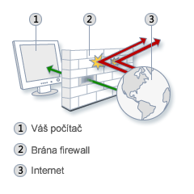

- [Síťování ve Windows](#síťování-ve-windows)
  - [**IP adresa**](#ip-adresa)
    - [**Příklady IP adresy verze 4**](#příklady-ip-adresy-verze-4)
    - [**Dělení adresy IPv4**](#dělení-adresy-ipv4)
    - [**Třídy IPv4 adres**](#třídy-ipv4-adres)
    - [**Vyhrazené adresy**](#vyhrazené-adresy)
    - [**APIPA**](#apipa)
  - [**Základy Windows Firewall**](#základy-windows-firewall)
    - [**Nastavení Windows Firewall**](#nastavení-windows-firewall)
  - [**Profily a Network Location Awareness (NLA)**](#profily-a-network-location-awareness-nla)
  - [**Nástroje pro diagnostiku síťového připojení**](#nástroje-pro-diagnostiku-síťového-připojení)
    - [**Ipconfig**](#ipconfig)
      - [**Syntaxe**](#syntaxe)
      - [**Parametry**](#parametry)
      - [**Příklady**](#příklady)
    - [**Ping**](#ping)
      - [**Syntaxe**](#syntaxe-1)
      - [**Parametry**](#parametry-1)
    - [**Tracert**](#tracert)
      - [**Syntaxe**](#syntaxe-2)
      - [**Parametry**](#parametry-2)
    - [**Pathping**](#pathping)
      - [**Syntaxe**](#syntaxe-3)
      - [**Parametry**](#parametry-3)
      - [**Příklady**](#příklady-1)
  - [**Remote Assistance**](#remote-assistance)
    - [**Zabudovaná ochrana**](#zabudovaná-ochrana)
    - [**Postup**](#postup)
  - [**Remote Desktop**](#remote-desktop)
- [AutomatedLab](#automatedlab)
- [**Lektorské úkoly**](#lektorské-úkoly)
  - [Lab L00 -- konfigurace virtuálních stanic](#lab-l00----konfigurace-virtuálních-stanic)
- [**Studentské úkoly**](#studentské-úkoly)
  - [**Lab S01 -- Firewall**](#lab-s01----firewall)
  - [**Lab S02 -- Firewall (ICMP, ping)**](#lab-s02----firewall-icmp-ping)
  - [**Lab S03 -- Remote Desktop**](#lab-s03----remote-desktop)
  - [**Lab S04 -- Remote Assistance**](#lab-s04----remote-assistance)
- [**Bodované úkoly**](#bodované-úkoly)
  - [**Úkol 1**](#úkol-1)
  - [**Úkol 2**](#úkol-2)


# Síťování ve Windows

## **IP adresa**

IP adresa je jednoznačná identifikace konkrétního zařízení (typicky
počítače) v prostředí Internetu. Veškerá data, která jsou z/na dané
zařízení přes počítačovou síť posílána, obsahují IP adresu odesilatele i
příjemce.

Zkratka IP znamená Internet Protocol, což je protokol, pomocí kterého
spolu komunikují všechna zařízení v Internetu. Dnes nejčastěji používaná
je jeho čtvrtá verze (označovaná jako IPv4), postupně se však bude
přecházet na novější verzi 6 (IPv6). V jiných protokolech se adresování
jednotlivých zařízení může provádět jinak (viz např. MAC adresa).

### **Příklady IP adresy verze 4**

V IPv4 je adresou 32-bitové číslo, zapisované po jednotlivých bajtech
(tzv. oktetech), oddělených tečkami. Hodnoty jednotlivých bajtů se
zapisují v desítkové soustavě (např. **192.168.48.39**).

### **Dělení adresy IPv4**

|                 |                    |                     |
|-----------------|--------------------|---------------------|
| **adresa sítě** | **adresa podsítě** | **adresa počítače** |

Koncepce internetu jako sítě složené ze sítí a tomu odpovídající
struktura adres patří mezi novinky zavedené IP. Má velký význam pro
směrování -- mimo cílovou síť se směruje podle adresy sítě, a až když je
IP datagram doručen do ní, začíná se brát ohled i na detailnější části
adresy.

Původní koncept adresace nepočítal s podsítěmi, definoval jen adresu
sítě a počítače. Později se však toto členění ukázalo jako příliš hrubé
a lokální část adresy se rozdělila na **podsíť** a **počítač**. Obecně
platí, že mezi adresami ve stejné podsíti (mají totožnou adresu sítě a
podsítě) lze data dopravovat přímo -- dotyční účastníci jsou všichni
propojeni jedním Ethernetem či jinou lokální sítí. Jakmile se adresa
cíle nachází v jiné síti, bude potřeba datagram předat příslušnému
směrovači, aby jej dopravil dál -- viz směrování.

**Adresu sítě** pro danou koncovou síť přiděluje poskytovatel připojení
(oficiálně ji přiděluje lokální registrátor, ale tím bývá právě
poskytovatel). Je třeba o ni požádat prostřednictvím standardních
formulářů. Strukturu lokální části adresy -- zda bude rozdělena na
podsítě a jaká její část bude případně věnována adrese podsítě a jaká
adrese počítače -- určuje správce dotyčné sítě. Ten také přiděluje
adresy.

Hranici mezi adresou podsítě a počítače určuje **maska podsítě**
(*subnet mask*). Jedná se o 32bitovou hodnotu zapisovanou stejně jako IP
adresa. V binárním tvaru obsahuje jedničky tam, kde se v adrese nachází
síť a podsíť, a nuly tam, kde je počítač. Maska podsítě je společně s IP
adresou součástí základní konfigurace síťového rozhraní, často se
předává protokolem DHCP.

### **Třídy IPv4 adres**

| Třída | Začátek (binárně) | 1\. bajt  | Standardní maska               | Bitů sítě | Bitů stanice | Počet sítí | Stanic v každé síti |
|-------|----------|---------|-------------|--------|--------|----------|----------|
| A     | 0                 | 0 - 127   | 255.0.0.0                      | 7         | 24           | 126        | 16 777 214          |
| B     | 10                | 128 - 191 | 255.255.0.0                    | 14        | 16           | 16 384     | 65 534              |
| C     | 110               | 192 - 223 | 255.255.255.0                  | 21        | 8            | 2 097 152  | 254                 |
| D     | 1110              | 224 - 239 | skupinové (*multicast*) adresy |           |              |            |                     |
| E     | 1111              | 240 - 255 | vyhrazeno jako rezerva         |           |              |            |                     |

### **Vyhrazené adresy**

Nejnižší adresa v síti (s nulovou adresou stanice) slouží jako označení
celé sítě (např. „síť 192.168.24.0"). Adresa sítě se z dané IP adresy
určí jako logický součin (AND) IP adresy a masky. Nejvyšší adresa v síti
(adresa stanice obsahuje samé binární jedničky) slouží jako adresa pro
všesměrové vysílání (*broadcast*), takové adresy tedy nelze použít pro
normální účely.

Adresy **127.x.x.x** (tzv. **localhost**, nejčastěji se používá adresa
**127.0.0.1**) jsou rezervovány pro tzv. *loopback*, logickou smyčku
umožňující posílat pakety sám sobě.

Dále jsou vyčleněny rozsahy tzv. interních (neveřejných) IP adres, které
se používají pouze pro adresování vnitřních sítí (např. lokálních), na
Internetu se nikdy nemohou objevit. Jako neveřejné jsou určeny adresy:

-   Ve třídě A: **10.0.0.0** až **10.255.255.255** (celkem 16 777 214
    > adres)

-   Ve třídě B: **172.16.0.0** až **172.31.255.255** (celkem 16 krát 65
    > 534 adres (tj. celkem 1 048 544))

-   Ve třídě C: **192.168.x.0** až **192.168.x.255** (celkem 256 krát
    > 254 adres)

### **APIPA**

Adresy IP můžete zadat do počítačů v síti nakonfigurováním jednoho nebo
více serverů DHCP, které adresy IP dynamicky poskytují dalším počítačům.
Jestliže síť neobsahuje server DHCP, použije se omezená možnost
přidělení adresy IP označovanou jako automatické přidělování soukromých
adres IP (APIPA). Po dobu, po kterou počítač používá funkci APIPA, může
komunikovat pouze s počítači, které tuto funkci používají ve stejném
síťovém segmentu. Počítač využívající funkci APIPA nemůže navázat
připojení k síti Internet. APIPA (*Automatic Private IP Addressing*) k
vytvoření automatické konfigurace využívá rozsahu adres IP od
**169.254.0.1** do **169.254.255.254** a masky podsítě **255.255.0.0**.

{width="2.29375in" height="2.5in"}**Windows
Firewall**

Brána firewall může být software nebo hardwarové zařízení, které
kontroluje informace přicházející z Internetu nebo ze sítě, a v
závislosti na svém nastavení je buď zablokuje, nebo jim umožní projít do
počítače.

Brána firewall se tedy snaží předcházet počítačovým podvodníkům nebo
škodlivému softwaru (například červům) získání přístupu k počítači
prostřednictvím sítě nebo Internetu. Brána firewall může rovněž zabránit
tomu, aby počítač odesílal škodlivý software do jiných počítačů.

Obrázek vpravo znázorňuje, princip funkcionality brány firewall.

## **Základy Windows Firewall**

Firewall omezuje síťovou komunikaci podle několika základních
konfigurovatelných pravidel. Windows Firewall v základním nastavení
kontroluje všechny síťové adaptéry. Firewall funguje následujícím
způsobem: jakmile komunikace dosáhne rozhraní v počítači, dojde
k vyhodnocení paketů a ty jsou buď propuštěny dál, nebo zahozeny,
v závislosti na základních pravidlech. Firewall ve Windows obsahuje jak
základní *Bránu firewall systému Windows* tak také podrobnější *Bránu
firewall systému Windows s pokročilým zabezpečením*[^1]. Základní rozdíl
je v komplexnosti pravidel a jejich nastaveni v závislosti na různých
rozhraních.

Ve Windows XP se nacházel také firewall, avšak na rozdíl od firewallu ve
Windows Vista a novějších, nedokázal obstarávat obousměrnou komunikaci a
umožňoval jen nastavení pravidel pro příchozí provoz.

Jak již bylo řečeno, Windows Firewall od Windows Vista dokáže nastavovat
pravidla pro příchozí i odchozí komunikaci. Filosofie firewallu by se
dala shrnout jako: Co není povoleno, je zakázáno, což znamená především
použití příkazu Povolit, nežli Zakázat.

Windows Firewall obsahuje také skrytou funkcionalitu, jež není možné
vypnout, a tou je znemožnění útočníkovi zjistil na jakou verzi OS a na
jaký firewall zaútočit.

Další vlastností je znemožnění útoku na OS během procesu spouštění
systému. Jelikož firewall, ať již Windows Firewall nebo produkt třetí
strany, se spouští až po startu systému, vzniká zde prostor pro možný
útok. A právě proti tomuto útoku je postaven prostředek *Boot time
filtering*, který chrání počítač při spouštění systému.

Pro lepší pochopení nastavení jednotlivých parametrů pravidel se
potřebujeme seznámit se základními pojmy z oblastí sítí[^2]:

-   **Protokol**. Pro potřeby konfigurace firewallu jsou pro nás
    > důležité 2 protokoly ‒ *Transmission Control Protocol* (TCP) a
    > *User Datagram Protocol* (UDP). TCP je dnes používaný jako hlavní
    > protokol Internetu, kdežto UDP se používá především pro
    > *broadcast* a *multicast*[^3], a často se s ním setkáme také ve
    > spojení s hrami.

-   **Port**. Port je důležité číslo které lokalizuje hlavičku TCP nebo
    > UDP datagramu. Port se používá pro mapování sítového provozu
    > k příslušným službám a programů. Např. port 80 je rezervován pro
    > WWW komunikaci a port 25 pro přenos e-mailu přes Internet.

-   **IPSec (*Internet Protocol Security*)**. Metoda zabezpečení
    > Internetového provozu používající šifrování a digitální podpisy.
    > Jestliže je IPSec datagram zachycen, jeho obsah nemůže být
    > přečten, ale IPSec poskytne ověření odesílatele, které dává
    > příjemci záruku s pravostí datagramu.

-   **Síťová adresa**. Každý počítač v síti má síťovou adresu. Brána
    > firewall umožňuje odlišné vyhodnocování provozu pro různé síťové
    > adresy nebo jejich rozsahy.

-   **Příchozí provoz**. Jedná se o část síťového provozu směřujícího
    > z externího počítače do našeho počítače.

-   **Odchozí provoz**. Tímto termínem je označen provoz směřující
    > z našeho počítače do Internetu nebo jiných míst v síti.

-   **Síťové rozhraní**. To může být Lokální síť (LAN), bezdrátová síť
    > (Wi-Fi), modemové připojení, VPN nebo FireWire připojení.

### **Nastavení Windows Firewall**

Windows Firewall se dělí do dvou částí ‒ Brána Windows Firewall a Brána
Windows Firewall s pokročilým zabezpečením:

-   **Brána Windows Firewall**. Základní konfigurace firewallu
    > spustitelná přes Ovládací panely, zapněte klasické zobrazení,
    > Windows Firewall, umožňuje jednoduché zapnutí a základní
    > konfiguraci firewallu.

-   **Brána Windows Firewall s pokročilým nastavením**. Windows Firewall
    > od Windows Vista obsahuje Windows Firewall s pokročilým
    > zabezpečením, ve kterém je možno blíže specifikovat jak odchozí
    > tak příchozí pravidla, ale také například přesně definovat pro
    > kterou sít nebo který adaptér se mají aplikovat.

## **Profily a Network Location Awareness (NLA)**

Network Location Awareness (NLA), neboli povědomí o tom v jaké síti se
nacházíme, je proces, kterým Windows (Vista a novější) přiřazují síťový
profil na základě aktuálního síťového prostředí. Jsou možné 3 síťové
profily Soukromý (*Private*), Veřejný (*Public*), Doména (*Domain*).
Jednotlivé profily se aktivují pro jednotlivá síťová rozhraní podle
následujících pravidel:

-   **Soukromý profil**. Soukromý profil se aktivuje, pokud **dané**
    > aktivní (připojené) síťové rozhraní (LAN, Wi-Fi, VPN, Modem,
    > Firewire) je v Soukromé kategorii podle NLA rozdělení. **Princip
    > kategorizování:** Když se počítač připojí do nové sítě, Windows se
    > zeptá, zda daná síť se nachází ve *Veřejné síti*, *Domácí síti*
    > nebo v *Síti v zaměstnání*. Pokud uživatel odpoví, že v *Domácí
    > síti* nebo v *Síti v zaměstnání*, bude síť kategorizována jako
    > *Soukromá*. Je třeba si však uvědomit, že pokud je síť špatně
    > navržena, bude to mít vliv na funkčnost NLA.

-   **Veřejný profil**. Windows aktivuje tento profil, v každé situaci
    > pokud nebude aktivní Soukromý ani Doménový profil. Ve výchozím
    > nastavení, pokud je Veřejný profil aktivní, budou pravidla
    > firewallu nejpřísnější.

```{=html}
<!-- -->
```
-   **Doménový profil**. Doménový profil se stane aktivním, pokud na
    > daném aktivním sítovém zařízení bude počítač ověřen doménovým
    > řadičem[^4].

## **Nástroje pro diagnostiku síťového připojení**

Všechny níže uvedené nástroje pracují jak s protokolem IPv4, tak
protokolem IPv6. U starších verzí systému Windows mohou existovat
nástroje pro každý protokol zvlášť (např. **ping** a **ping6**).

### **Ipconfig**

Zobrazí všechny aktuální hodnoty konfigurace sítě TCP/IP a aktualizuje
nastavení protokolu DHCP (*Dynamic Host Configuration Protocol*) a
služby DNS (*Domain Name System*). Při použití bez parametrů zobrazí
příkaz **ipconfig** adresy IPv6 nebo adresu IPv4, masku podsítě
a výchozí bránu pro všechny adaptéry.

#### **Syntaxe**

> **ipconfig** \[**/all**\] \[**/renew **\[*Adaptér*\]\]
> \[**/release** \[*Adaptér*\]\] \[**/flushdns**\] \[**/displaydns**\]
> \[**/registerdns**\] \[**/showclassid** *Adaptér*\] \[**/setclassid**
> *Adaptér* \[*ID_třídy*\]\]

#### **Parametry**

> **/all**
>
> Zobrazí úplnou konfiguraci protokolu TCP/IP u všech adaptérů.
> Bez tohoto parametru zobrazí příkaz **ipconfig** pro každý adaptér
> pouze adresy IPv6 nebo adresu IPv4, masku podsítě a výchozí bránu.
> Adaptéry mohou reprezentovat fyzická rozhraní, například instalované
> síťové karty, nebo logická rozhraní, například telefonická připojení.
>
> **/renew** \[*Adaptér*\]
>
> Obnoví konfiguraci DHCP u všech adaptérů (není-li určen adaptér) nebo
> u konkrétního adaptéru, je-li uveden parametr *Adaptér*. Tento
> parametr je k dispozici pouze v počítačích s adaptéry
> nakonfigurovanými pro automatické přidělování adres IP. Chcete-li
> určit název adaptéru, zadejte název adaptéru, který se zobrazí
> při použití příkazu **ipconfig** bez parametrů.
>
> **/release** \[*Adaptér*\]
>
> Odešle serveru DHCP zprávu **DHCPRELEASE**, která uvolní aktuální
> konfiguraci DHCP a vymaže konfiguraci adresy IP u všech adaptérů
> (není-li určen adaptér) nebo u konkrétního adaptéru, je-li uveden
> parametr *Adaptér*. Tento parametr zakáže protokol TCP/IP u adaptérů
> konfigurovaných pro automatické získání adresy IP. Chcete-li určit
> název adaptéru, zadejte název adaptéru, který se zobrazí při použití
> příkazu **ipconfig** bez parametrů.
>
> **/flushdns**
>
> Vyprázdní a vynuluje obsah vyrovnávací paměti přeložených adres
> klienta DNS. Během řešení potíží se službou DNS můžete v případě
> nutnosti použít tento postup k odstranění negativních položek
> vyrovnávací paměti stejně jako kterýchkoli jiných položek, které byly
> přidány dynamicky.
>
> **/displaydns**
>
> Zobrazí obsah vyrovnávací paměti přeložených adres klienta DNS. Do
> zobrazení budou zahrnuty jak položky načtené předem z místního souboru
> **hosts**, tak i záznamy získané později řešením dotazů na názvy. Tyto
> informace využívá klientská služba DNS k rychlému překladu často
> zjišťovaných názvů před odesláním dotazu na konfigurované servery DNS.
>
> **/registerdns**
>
> Spouští ruční dynamickou registraci názvů DNS a adres IP
> konfigurovaných v počítači. Tento parametr lze použít při řešení
> potíží s nezdařenou registrací názvu DNS nebo při řešení problému
> dynamické aktualizace mezi klientem a serverem DNS bez nutnosti
> restartování počítače klienta. Názvy registrované službou jsou určeny
> nastavením služby DNS v rozšířených vlastnostech protokolu TCP/IP.
>
> **/showclassid** *Adaptér*
>
> Zobrazí identifikátor třídy DHCP pro určený adaptér. Chcete-li
> zobrazit ID třídy DHCP pro všechny adaptéry, použijte místo parametru
> *Adaptér* zástupný znak **\*** (hvězdička). Tento parametr je k
> dispozici pouze v počítačích s adaptéry, které jsou konfigurovány pro
> automatické přidělování adres IP.
>
> **/setclassid** *Adaptér* \[*ID_třídy*\]
>
> Nastaví identifikátor třídy DHCP pro určený adaptér. Chcete-li
> nastavit ID třídy DHCP pro všechny adaptéry, použijte místo parametru
> *Adaptér* zástupný znak **\*** (hvězdička). Tento parametr je k
> dispozici pouze v počítačích s adaptéry, které jsou konfigurovány pro
> automatické přidělování adres IP. Není-li určeno ID třídy DHCP, dojde
> k odebrání aktuálního ID třídy.

#### **Příklady**

| **ipconfig**                       | Zobrazení informací                                                                                     |
|----------------------------|--------------------------------------------|
| **ipconfig /all**                  | Zobrazení podrobných informací                                                                          |
| **ipconfig /renew**                | Obnovení všech adaptérů                                                                                 |
| **ipconfig /renew EL\***           | Obnovení všech připojení s názvem začínajícím na EL                                                     |
| **ipconfig /release \*Přip\***     | Uvolnění všech odpovídajících připojení, např. Připojení k místní síti 1 nebo Připojení k místní síti 2 |
| **ipconfig /allcompartments**      | Zobrazí informace o všech oddílech                                                                      |
| **ipconfig /allcompartments /all** | Zobrazí podrobné informace o všech oddílech                                                             |

### **Ping**

Ověřuje dostupnost připojení na úrovni protokolu IP k jinému počítači s
protokolem TCP/IP odesíláním zpráv požadavku odezvy ICMP (*Internet
Control Message Protocol*). Zobrazí odpovídající přijaté zprávy Odpověď
echa spolu s údaji o době přenosu. Příkaz **ping** je základním příkazem
protokolu TCP/IP využívaným k odstraňování potíží se spojením,
dosažitelností a rozlišením názvů. Při použití bez parametrů příkaz
**ping** zobrazí nápovědu.

#### **Syntaxe**

> **ping** \[**-t** \] \[**-a** \] \[**-n** *Počet*\] \[**-l**
> *Velikost*\] \[**-f** \] \[**-i** *Doba_života*\] \[**-v**
> *Typ_služby*\] \[**-r** *Počet*\] \[**-s** *Počet*\]\
> \[{**-j** *Seznam_hostitelů* \| **-k** *Seznam_hostitelů*}\] \[**-w**
> *Časový_limit*\] \[**-R** \] \[**-S** *Zdrojová_adresa*\]\
> \[**-4**\] \[**-6**\] *Název_cíle*

#### **Parametry**

> **-t**
>
> Určuje, že příkaz **ping** má pokračovat v odesílání zpráv požadavku
> odezvy, dokud nebude přerušen. Chcete-li odesílání zpráv přerušit a
> zobrazit statistické údaje, stiskněte kombinaci kláves **CTRL+BREAK**.
> Chcete-li přerušit odesílání zpráv a ukončit práci příkazu **ping**,
> stiskněte kombinaci kláves **CTRL+C**.
>
> **-a**
>
> Určuje, že pro cílovou adresu IP má být prováděn zpětný překlad názvů.
> V případě úspěšného provedení příkaz ping zobrazí odpovídající název
> hostitele.
>
> **-n** *Počet*
>
> Určuje počet odeslaných zpráv požadavku odezvy. Výchozí hodnota je 4.
>
> **-l** *Velikost*
>
> Určuje počet bajtů datového pole v odeslaných zprávách požadavku
> odezvy. Výchozí hodnota je 32. Maximální hodnota parametru *Velikost*
> je 65527.
>
> **-f**
>
> Určuje, že zprávy s požadavkem na odezvu jsou odesílány s příznakem
> **nefragmentovat** v hlavičce nastaveným na hodnotu 1 (k dispozici
> pouze v protokolu IPv4). Zprávu s požadavkem na odezvu nemohou
> směrovače na cestě k cíli fragmentovat. Tento parametr vám může pomoci
> při odstraňování potíží s jednotkami PMTU (*Path Maximum Transmission
> Unit*).
>
> **-i** *Doba_života*
>
> Určuje hodnotu pole TTL v záhlaví IP odeslaných zpráv požadavku
> odezvy. Výchozí hodnotu pole TTL určuje hostitel. Maximální hodnota
> parametru *Doba_života* je 255.
>
> **-v** *Typ_služby*
>
> Určuje hodnotu pole TOS (*Type of Service*) v hlavičce protokolu IP
> odeslaných zpráv s požadavkem na odezvu (k dispozici pouze v protokolu
> IPv4). Výchozí hodnota je 0. Parametr *Typ služby* může nabývat
> desítkových hodnot od 0 do 255.
>
> **-r** *Počet*
>
> Určuje, že má být použita možnost Záznam trasy v záhlaví IP, která
> zaznamená trasu zprávy požadavku odezvy a odpovídající zprávy Odpověď
> echa (k dispozici pouze v protokolu IPv4). Každému směrování na trase
> odpovídá jedna položka možnosti Záznam trasy. Pokud je to možné,
> použijte hodnotu parametru *Počet* větší nebo rovnou počtu směrování
> na trase mezi zdrojem a cílem. Minimální hodnota parametru *Počet* je
> 1, maximální 9.
>
> **-s** *Počet*
>
> Určuje, že má být použita možnost Časové razítko Internetu v záhlaví
> IP, která zaznamená okamžik přijetí požadavku odezvy a odpovídající
> zprávy Odpověď echa jednotlivými směrovači. Minimální hodnota
> parametru *Počet* je 1, maximální 4. Tento parametr je povinný pro
> cílové místní adresy v rámci propojení.
>
> **-j** *Seznam_hostitelů*
>
> Určuje, že zprávy požadavku odezvy použijí možnost Volného režimu v
> hlavičce protokolu IP s množinou mezilehlých cílových umístění
> uvedených v *Seznamu_hostitelů* (k dispozici pouze v protokolu IPv4).
> U směrování ve volném režimu lze následné prostřední cíle oddělit
> jedním nebo více směrovači. Maximální počet adres nebo názvů v seznamu
> hostitelů je 9. Seznam hostitelů je sada adres IP (pomocí čísel v
> desítkové soustavě oddělených tečkami) oddělených mezerami.
>
> **-k** *Seznam_hostitelů*
>
> Určuje, že zprávy požadavku odezvy použijí možnost Striktního režimu v
> hlavičce protokolu IP s množinou mezilehlých cílových umístění
> uvedených v *Seznamu_hostitelů* (k dispozici pouze v protokolu IPv4).
> V případě pevného režimu směrování musí být následující postupný cíl
> vždy přímo dosažitelný (musí se jednat o sousední směrovač rozhraní
> aktuálního směrovače). Maximální počet adres nebo názvů v seznamu
> hostitelů je 9. Seznam hostitelů je sada adres IP (pomocí čísel v
> desítkové soustavě oddělených tečkami) oddělených mezerami.
>
> **-w** *Časový_limit*
>
> Určuje dobu čekání v milisekundách na zprávu Echo Response,
> odpovídající dané zprávě požadavku odezvy. Není-li tato zpráva přijata
> v daném časovém intervalu, zobrazí se chybová zpráva „Vypršel časový
> limit žádosti". Výchozí interval je 4 000 (4 sekundy).
>
> **-R**
>
> Určuje, že je sledována cesta přenosu paketů (k dispozici pouze v
> protokolu IPv6).
>
> **-S** *Zdrojová_adresa*
>
> Určuje, zdrojovou adresu, která má být použita (k dispozici pouze v
> protokolu IPv6).
>
> **-4**
>
> Určuje, že pro příkaz **ping** je použit protokol IPv4. Tento parametr
> není nutný k označení cílového hostitele s adresou protokolu IPv4.
> Nutný je pouze k identifikaci cílového hostitele podle názvu.
>
> **-6**
>
> Určuje, že pro příkaz **ping** je použit protokol IPv6. Tento parametr
> není nutný k označení cílového hostitele s adresou protokolu IPv6.
> Nutný je pouze k identifikaci cílového hostitele podle názvu.
>
> *Název_cíle*
>
> Určuje název hostitele nebo adresu IP cíle.

### **Tracert**

Určuje trasu k cíli tím, že do cíle odesílá zprávy protokolu ICMP
(*Internet Control Message Protocol*) nebo protokolu ICMPv6 s požadavkem
na odezvu se zvyšujícími se hodnotami polí TTL (*Time-To-Live*).
Zobrazenou cestu představuje seznam bližších rozhraní směrovačů na trase
mezi zdrojovým hostitelem a cílem. Bližší rozhraní je rozhraní
směrovače, které je k odesílajícímu hostiteli z hlediska cesty nejblíže.
Samotný příkaz **tracert** bez parametrů zobrazí nápovědu.

#### **Syntaxe**

> **tracert** \[**-d** \] \[**-h** *Maximální_počet_směrování*\]
> \[**-j** *Seznam_hostitelů*\] \[**-w** *Časový_limit*\] \[**-R** \]\
> \[**-S ***Zdrojová_adresa*\] \[**-4**\] \[**-6**\] *Cílový_název*

#### **Parametry**

> **-d**
>
> Způsobí, že příkaz **tracert** nebude překládat adresy IP
> zprostředkujících směrovačů na jejich názvy. Tímto lze zobrazení
> výstupu příkazu **tracert** urychlit.
>
> **-h** *Maximální_počet_směrování*
>
> Určuje maximální počet směrování v cestě pro vyhledání cíle. Výchozí
> počet je 30 směrování.
>
> **-j** *Seznam_hostitelů*
>
> Určuje, zda má být ve zprávách s požadavkem na odezvu použita možnost
> volného režimu v hlavičce IP se sadou zprostředkujících cílů určených
> parametrem *Seznam_hostitelů*. U směrování ve volném režimu lze
> následné prostřední cíle oddělit jedním nebo více směrovači. Maximální
> počet adres nebo názvů v seznamu hostitelů je 9. Parametr
> *Seznam_hostitelů* je sada adres IP (v desítkovém zápisu s tečkami)
> oddělených mezerami. Tento parametr použijte pouze v případě trasování
> adres protokolu IPv4.
>
> **-w** *Časový_limit*
>
> Určuje dobu v milisekundách, po kterou bude očekáváno přijetí zprávy
> protokolu ICMP o překročení času nebo zprávy s odpovědí echa
> odpovídající odeslané zprávě s požadavkem na odezvu. Není-li v daném
> časovém limitu žádná zpráva přijata, zobrazí se hvězdička (\*).
> Výchozí časový limit je 4 000 (4 sekundy).
>
> **-R**
>
> Určuje, že má být při odeslání zprávy s požadavkem na odezvu do
> místního počítače použita rozšířená hlavička směrování IPv6 a že jako
> cíl má být použit zprostředkující cíl spolu s testováním zpáteční
> trasy.
>
> **-S**
>
> Určuje zdrojovou adresu ve zprávách s požadavkem na odezvu. Tento
> parametr použijte pouze v případě trasování adres protokolu IPv6.
>
> **-4**
>
> Určuje, že program **tracert** použije k trasování pouze protokol
> IPv4.
>
> **-6**
>
> Určuje, že program **tracert** použije k trasování pouze protokol
> IPv6.
>
> *Název_cíle*
>
> Určuje cíl určený adresou IP nebo názvem hostitele.

### **Pathping**

Poskytuje informace o zpoždění a ztrátách v síti u jednotlivých
směrovačů na trase mezi zdrojem a cílem. Příkaz **pathping** po určitou
dobu opakovaně zasílá všem směrovačům mezi zdrojem a cílem zprávy s
požadavkem na odezvu a na základě paketů vrácených od jednotlivých
směrovačů pak vypočte výsledky. Protože příkaz **pathping** zobrazuje
úroveň ztráty paketů na všech zadaných směrovačích nebo propojeních,
můžete určit, u kterých směrovačů nebo podsítí pravděpodobně vznikají
problémy. Příkaz **pathping** provede ekvivalent příkazu **tracert**
pomocí identifikace jednotlivých směrovačů v cestě. Všem směrovačům pak
po stanovenou dobu zasílá testovací pakety a na základě počtu
navrácených paketů vypočte statistiku. Při použití bez parametrů zobrazí
příkaz **pathping** nápovědu.

#### **Syntaxe**

> **pathping** \[**-n**\] \[**-h ***Maximální_počet_směrování*\]
> \[**-g ***Seznam_hostitelů*\] \[**-p ***Perioda*\]\
> \[**-q ***Počet_dotazů*\] \[**-w** *Časový_limit*\] \[**-i**
> *Adresa_IP*\] \[**-4**\] \[**-6**\] \[*Název_cíle*\]

#### **Parametry**

> **-n**
>
> Zabrání příkazu **pathping** v pokusu o převedení adres IP směrovačů
> na trase na názvy. Tímto způsobem lze někdy urychlit zobrazení
> výsledků příkazu **pathping**.
>
> **-h** *Maximální_počet_směrování*
>
> Určuje maximální počet směrování v cestě pro vyhledání cíle. Výchozí
> počet je 30 směrování.
>
> **-g** *Seznam_hostitelů*
>
> Určuje, zda má být ve zprávách s požadavky na odezvu použita možnost
> volné trasy zdroje v hlavičce protokolu IP se sadou dočasných cílů
> určených parametrem *Seznam_hostitelů*. U směrování ve volném režimu
> lze následné prostřední cíle oddělit jedním nebo více směrovači.
> Maximální počet adres nebo názvů v seznamu hostitelů je 9. Parametr
> *Seznam_hostitelů* je sada adres IP (v desítkovém zápisu s tečkami)
> oddělených mezerami.
>
> **-p** *Perioda*
>
> Určuje počet milisekund mezi jednotlivými po sobě jdoucími testovacími
> pakety. Výchozí doba je 250 milisekund (1/4 sekundy).
>
> **-q** *Počet_dotazů*
>
> Určuje počet zpráv požadavku odezvy odeslaných jednotlivým směrovačům
> na trase. Výchozí hodnota je 100 dotazů.
>
> **-w** *Časový_limit*
>
> Určuje počet milisekund doby čekání na odpověď. Výchozí doba je 3 000
> milisekund (3 s).
>
> **-i** *Adresa_IP*
>
> Určuje zdrojovou adresu.
>
> **-4**
>
> Určuje, že příkaz **pathping** použije pouze protokol IPv4.
>
> **-6**
>
> Určuje, že příkaz **pathping** použije pouze protokol IPv6.
>
> *Název_cíle*
>
> Určuje cíl zadaný jako adresa IP nebo jako název hostitele.

#### **Příklady**

| **pathping -n corp1** | Vypíše informace o zpožděních a ztrátách u jednotlivých směrovačů na cestě k počítači **corp1** |
|----------------------------|--------------------------------------------|

## **Remote Assistance**

Funkce Vzdálená pomoc je technologie v systémech MS Windows, která
uživatelům systému umožňuje vzájemně si pomáhat přes Internet. Pomocí
tohoto nástroje jeden uživatel, označený jako Poradce, vidí pracovní
plochu jiného uživatele, označeného jako Začínající uživatel. Poradce
může na základě oprávnění Začínajícího uživatele také ovládat počítač
Začínajícího uživatele, aby mu vzdáleně pomohl řešit potíže.

### **Zabudovaná ochrana**

-   Vzdálená pomoc používá protokol RDP (*Remote Desktop Protocol*) pro
    koncové spojení.

-   Osoba žádající o pomoc musí povolit počáteční připojení Poradce
    předtím, než může Poradce vidět plochu Začínajícího uživatele.

-   Osoba žádající pomoc musí zaslat pozvánku, která je chráněná
    12místným heslem, které musí Poradce zadat během připojování.

-   Osoba žádající pomoc může omezit životnost pozvánky.

-   Osoba žádající pomoc má plnou kontrolu nad relací po celou dobu,
    může ji kdykoli ukončit nebo odebrat kontrolu Poradci nad touto
    relací.

### **Postup**

Uživatel žádající pomoc (*host*) vystaví *pozvánku* a zašle ji osobě, od
níž žádá pomoc (*poradce*). Ten se pak může připojit k počítači hosta.
Uživatel, jenž vytvořil pozvánku, má plnou kontrolu nad relací. Tudíž ji
může kdykoliv ukončit. V doménovém prostředí lze pomocí zásad skupiny
(*group policy*) určit účty, jež budou moci asistenci nabízet členům
domény. Tudíž odpadá nutnost vystavovat a zasílat pozvánku. Stále platí,
že nad relací má plnou kontrolu host.

Pozvánka ve formátu XML musí být předána Poradci a to je možno několika
způsoby:

-   **E-mail**. Windows spustí defaultní emailový program, vytvoří
    > email, jenž bude v příloze obsahovat pozvánku a uživatel pouze
    > doplní emailovou adresu poradce.

-   **Uložení pozvánky do souboru**. Pozvánku po uložení musí host sám
    > „bezpečně" dopravit k poradci.

-   **Easy Connect**. Ve skutečnosti nepotřebuje pozvánku, umožňuje
    > vytvoření spojení pouze se zadáním hesla.

Po vytvoření relace se objeví poradci okno vzdálené pomoci, kde vidí
plochu hosta. Nemůže ji ovládat. Může však zažádat o převzetí kontroly.
Uživatel, který žádal o pomoc, musí tuto akci nejprve schválit. Má
dokonce možnost povolit poradci spouštění programů, které vyžadují
zvýšení oprávnění. Pokud mu to neumožní, v případě potřeby
administrátorských oprávnění poradci obrazovka ztmavne do té doby, než
uživatel potvrdí zvýšení oprávnění. Uživatel má stále kontrolu nad
relací a může kdykoli odebrat poradci kontrolu.

## **Remote Desktop**

Na rozdíl od RA se RD relace nesdílí. K počítači se lze připojit, i když
nikdo jiný na něm není přihlášen. U klientských Windows je k dispozici
jedno RD spojení. Ve výchozím nastavení je RD zakázaná.

**Remote Settings: Allow connections only from computer running Remote
Desktop with Network Level Authentication**. Toto nastavení umožňuje
vyšší bezpečnost díky silnějšímu šifrování, avšak počítač, jenž bude na
počítač, na němž povoluji RD, musí mít operační systém Windows XP SP2
nebo novější.

Pokud se bude připojovat počítač s jiným OS (Linux, Mac, Windows Server
2003), musí být zatrženo nastavení **Allow connections from computers
running any version of Remote Desktop**.

Aby se uživatel mohl připojit k RD, musí mít příslušná práva. Členové
skupiny **Administrators** mají právo k RD automaticky. Ostatní účty,
které mají mít právo přístupu přes RD, musí být přidáni přes tlačítko
**Select Users** nebo lépe tak, že bude jejich účet zařazen do skupiny
**Remote Desktop Users**.

Při připojování k RD může dojít k několika situacím:

-   Lokálně je nalogován uživatel a přes RD se hlásí stejný uživatel.
    > Pak bude uživatel, jenž se hlásí přes RD, připojen k právě
    > probíhající relaci. (Platí i na opak probíhá relace přes RD
    > a lokálně se přihlásí stejný uživatel, tak se přihlásí k již
    > běžící RD relaci.)

-   Lokálně je přihlášen uživatel a přes RD se hlásí jiný uživatel. Pak
    > lokálně přihlášený uživatel je upozorněn na žádost o přístup přes
    > RD. Pokud lokálně přihlášený uživatel do 30 sekund nezamítne
    > přístup přes RD, bude jeho relace odhlášena a bude vytvořena nová
    > relace pro uživatele, jenž se hlásí přes RD. (Platí i na opak --
    > probíhá relace přes RD a jiný uživatel se hlásí lokálně. Uživatel
    > využívající RD má 30 sekund na zamítnutí lokální relace, pokud tak
    > neučiní, bude jeho relace odhlášena.)

Vylepšení RD ve Windows 7:

-   Podpora Aera

-   Podpora aplikací využívajících Direct 2D a Direct 3D 10.1

-   Podpora více monitorů

-   Vylepšení výkonu RDP

-   Podpora Media Foundation

-   Podpora DirectShow

-   Low Latency audio playback

-   Bi-directional audio

-   Podpora RemoteFX (přenos HW akcelerované grafiky, přesměrování USB)
    > v SP1

Některá vylepšení RD ve Windows 8:

-   Adaptivní grafika

-   Podpora přenosu dotyků a gest (multitouch)

-   Intelligent Transports

-   Optimalizace streamování multimédií

-   Single sign-on

-   Modern UI Remote desktop klient

Některá vylepšení RD ve Windows 10:

-   Vylepšení RemoteFX včetně podpory OpenGL 4.4, 4K rozlišení

-   Podpora kodeku H.264/AVC 444

-   Vylepšená podpora dotyku a gest

-   Podpora pera

Při nefunkčním RD připojení:

-   Mám RD povolenu?

-   Mám právo přístupu přes RD? Jsem členem **Administrators** nebo
    > **Remote Desktop Users**?

-   Mám výjimku pro RD na firewall?


---

# AutomatedLab

```pwsh
$labName = 'E03'
$adminPass = 'root4Lab'

New-LabDefinition -Name $labName -DefaultVirtualizationEngine HyperV -VmPath "E:\AutomatedLab-VMs"
Set-LabinstallationCredential -username root -password $adminPass

# Set up the defaults
# These will be used for all machines within your lab, unless you specifically overwrite them
$PSDefaultParameterValues = @{
    'Add-LabMachineDefinition:Processors' = 8
    'Add-LabMachineDefinition:Memory' = 16GB
    'Add-LabMachineDefinition:OperatingSystem' = 'Windows 11 Pro'
}

Add-LabVirtualNetworkDefinition -Name 'Default Switch' -HyperVProperties @{SwitchType = 'Internal'; AdapterName = 'Default Switch'}
Add-LabVirtualNetworkDefinition -Name 'Private1' -AddressSpace 192.168.0.0/24

$w11_1_network = @(
    New-LabNetworkAdapterDefinition -InterfaceName LAN0 -VirtualSwitch 'Default Switch' -UseDhcp 
    New-LabNetworkAdapterDefinition -InterfaceName LAN1 -VirtualSwitch Private1 -Ipv4Address 192.168.0.10/24 
)
Add-LabMachineDefinition -Name W11-1 -NetworkAdapter $w11_1_network

$w11_2_network = @(
    New-LabNetworkAdapterDefinition -InterfaceName LAN0 -VirtualSwitch 'Default Switch' -UseDhcp 
    New-LabNetworkAdapterDefinition -InterfaceName LAN1 -VirtualSwitch Private1 -Ipv4Address 192.168.0.11/24 -Ipv4Gateway 192.168.0.10
)
Add-LabMachineDefinition -Name W11-2 -NetworkAdapter $w11_2_network 

$w11_3_network = @(
    New-LabNetworkAdapterDefinition -InterfaceName LAN0 -VirtualSwitch 'Default Switch' -UseDhcp 
    New-LabNetworkAdapterDefinition -InterfaceName LAN1 -VirtualSwitch Private1 -Ipv4Address 192.168.0.12/24 -Ipv4Gateway 192.168.0.10
)
Add-LabMachineDefinition -Name W11-3 -NetworkAdapter $w11_3_network 

Install-Lab
```

---

# **Lektorské úkoly**

## Lab L00 -- konfigurace virtuálních stanic

| **Adaptér (MAC suffix)** | **LAN**  |
| ------------------------ | -------- |
| **W11**                  | Internal |

-   V případech, kdy je potřeba přistupovat na externí síť, připojte
    adaptér **LAN0** k přepínači *Default switch* nebo *External*.

**Lab L01 -- Firewall a nastavení sítě**

> **Potřebné virtuální stroje**
>
> **W11-1** (W11-1)
>
> **W11-2** (W11-2)
>
> **W11-3** (W11-3)

Firewall:

-   Ukázat jak vypnout a zapnout firewall a projít Windows Firewall Basic.
-   Upozornit, případně zkusit, že síť je ve Windows 10 (resp. od Windows Vista) během startu opravdu vypnutá, kdežto v XP ne.

Síť:

-   Ukázat použití **ping**, **tracert, ipconfig**. (z W11-1)

-   Ukázat nastavení Sítě, kde zjistím IP adresu.

-   Ukažte, jak se dostanou do **Network and Sharing Center** -- přes
    > **Control Panels** nebo pravým na ikonku sítě dole na liště Start.

-   V **Network and Sharing Center** ukažte možnosti nastavení síťových
    > adaptérů. Na adaptéru LAN1 ukažte, jak se nastavuje statická IP
    > adresa, jak se nastaví, aby počítač získával IP z DHCP a když není
    > DHCP k dispozici, tak jak se nastaví APIPA nebo alternativní
    > konfigurace (případně **netsh**).

-   Ze startu spusťte **ncpa.cpl**.

-   Na obou stanicích **W11-1**, **W11-2**, **W11-3**
    > nastavte na adaptérech s Private1 (LAN1) sítí statické IP adresy
    > z rozsahu **192.168.0.0/24**. Jako výchozí bránu u W11-2
    > a W11-3 použijte IP adresu nastavenou W11-1. Přidělené IP
    > adresy si poznačte.

-   Vytvořte se studenty sdílený adresář **C:\\Share** na **W11-1** pro úkol S04.

---


# **Studentské úkoly**

## **Lab S01 -- Firewall**

> **Cíl cvičení**
>
> Vyzkoušet si základní práci s konzolí **Windows Firewall with Advanced
> Security** a následné uplatnění vytvořených pravidel s profily
> **Network Location Awareness**.
>
> **Potřebné virtuální stroje**
>
> **W11-1** (W11-1)

1.  Přihlaste se na **W11-1** pod účtem **root** (heslo **root4Lab**).

2.  Zapněte **Firewall** (pokud je vypnutý).

3.  Spusťte **Windows Firewall with Advanced Security**.

4.  Spusťte **Microsoft Edge** a vyzkoušejte přístup na internet.

5.  V **Outbound Rules** vytvořte pravidlo pro blokaci odchozí
    komunikace -- **New Rule...**

6.  Zvolte **Custom** Next \> **All programs** Next \> Protocol type:
    **TCP** a nastavte **Remote port** na **Specific Ports** a napište
    **80, 443** Next \>

7.  Zvolte **Any IP address** pro **local IP** i **remote IP** Next \>

8.  Nastavte **Block the Connection** Next \>

9.  Vyberte pouze **Public** Next \> a zadejte jméno **A - Blokace
    Public Internetu** a kliknete na Finish.

10. Podívejte se na nastavení v **Network and Sharing Center** a
    následně nastavte profil u adaptéru LAN0 na **Private**.

    -   Varianta 1

        i.  Přejděte do **Settings** \\ **Network & Internet** \\
            **Ethernet**

        ii. Klikněte na síťové rozhraní s připojenou sítí (místo názvu
            adaptéru LAN0 bude zobrazeno jméno sítě)

        iii. Přepněte přepínač u **Make this PC discoverable** na **On**

    -   Varianta 2

        i.  Spusťte powershell jako administrátor

        ii. **Set-NetConnectionProfile -interfacealias LAN0
            -NetworkCategory Private**

        > nebo\
        > **Set-NetConnectionProfile -name \"jménosítě\" -NetworkCategory Private**

        iii. Ověřte změnu v **Network and Sharing Center**

11. Zkuste spustit **Microsoft Edge** a zadat např.
    [http://www.seznam.cz](http://www.seznam.cz/)

12. Nastavte profil u adaptéru LAN0 na **Public**.

    -   Varianta 1

        i.  Přejděte do **Settings** \\ **Network & Internet** \\
            **Ethernet**

        ii. Klikněte na síťové rozhraní s připojenou sítí (místo názvu
            adaptéru LAN0 bude zobrazen název sítě)

        iii. Přepněte přepínač u **Make this PC discoverable** na
             **Off**

    -   Varianta 2

        i.  Spusťte powershell jako administrátor

        ii. **Set-NetConnectionProfile -interfacealias** LAN0
            **-NetworkCategory Public**

        > nebo\
        > **Set-NetConnectionProfile -name \"jménosítě\" -NetworkCategory
        > Public**

        iii. Ověřte změnu v **Network and Sharing Center**

13. Zkuste spustit **Microsoft Edge** a zadat např.
    [http://www.seznam.cz](http://www.seznam.cz/)

14. Deaktivujte pravidlo **A - Blokace Public Internetu**.

## **Lab S02 -- Firewall (ICMP, ping)**

> **Cíl cvičení**
>
> Vyzkoušet si možnosti filtrování síťového provozu na základě protokolu
> nebo IP adresy.
>
> **Potřebné virtuální stroje**
>
> **W11-1** (W11-1)
>
> **W11-2** (W11-2)

1.  Přihlaste se na **W11-2** pod účtem **W11-2\root**.

2.  Spusťte příkazový řádek. Zjistěte IP adresu počítače **W11-1** na
    LAN1 adaptéru.

3.  Spusťte příkaz ping na stanici **W11-1**, neměla by být vidět (ve výchozí konfiguraci, AutomatedLab povoluje pravidlo (File and Printer Sharing (Echo Request - ICMPv4-In)) příchozí ICMP pro Public profil. Můžete jej ručně zakázat a ověřit, že ping přestane procházet):

    -   **ping -t *\<W11-1_IP\>***

4.  Přesuňte se na **W11-1**.

5.  Otevřete **Network and Sharing Center** a nastavte odpovídající
    adaptér (který má IP adresu, kterou se pokoušíte pingnout) na
    **Public** (viz Lab S01, pokud nemá adaptér nastavenou výchozí
    bránu, bude nutné použít powershell). Zkusme tedy vytvořit pravidlo,
    které nám dokáže povolit komunikaci přes **ICMP** na **Public**
    síti.

6.  Spusťte **Windows Firewall with Advanced Security**.

7.  V **Inbound Rules** vytvořte pravidlo pro blokaci příchozí
    komunikace -- **New Rule**...

8.  Zvolte **Custom** Next \> **All programs** Next \> **ICMPv4**
    (podívejte se na možnosti tlačítka **Customize**) Next \>.

9.  V části **local IP** zvolte **These IP addresses**, klikněte na
    **Add** a napište **192.168.0.0/24**.

10. V části **remote IP** nastavte **Any IP** Next \>

11. Nastavte **Allow the Connection** Next \>

12. Vyberte jen **Public** a zadejte jméno **A - povolení ICMP protokolu
    pro Public** a klikněte na Finish.

13. Přesuňte se na **W11-2** a podívejte se, jestli došlo ke změně.

14. Zkuste deaktivovat pravidlo **A - povolení ICMP protokolu pro
    Public**. Co se změnilo na **W11-2** ?

15. Ukončete příkaz ping pomocí Ctrl+C.

## **Lab S03 -- Remote Desktop**

> **Cíl cvičení**
>
> Povolení, nastavení a vyzkoušení služby **Remote Desktop**.
>
> **Potřebné virtuální stroje**
>
> **W11-1** (W11-1)
>
> **W11-2** (W11-2)

1.  Přihlaste se na **W11-1**.

2.  Ve **Windows Firewall with Advanced Security** povolte příchozí RDP
    spojení (**Inbound Rules** -- pravidla skupiny **Remote Desktop**)

    > (*alternativně*: vypněte firewall)

3.  V průzkumníku klikněte pravým tlačítkem myši na **This PC** a zvolte
    **Properties**. Klikněte na **Remote Settings**.

    > (*alternativně*: v nabídce start dejte vyhledat „remote" v  settings a zvolte **Allow remote access to your computer**)

4.  V části Remote Desktop zvolte možnost **Allow remote connections to
    this computer**.

5.  Zaškrtněte **Allow connections only from computers running Remote
    Desktop with Network Level Authentication**.

6.  Kliknutím na tlačítko **Select Users** byste mohli přidat uživatele,
    kteří by měli právo využívat vzdálenou plochu. Uživatel student by
    již měl mít právo se připojit.

7.  Na počítači **W11-2** spusťte klienta vzdálené plochy
    **mstsc.exe**.

8.  Prozkoumejte možná nastavení klienta před samotným připojením
    kliknutím na **Options**. Například záložky **Local Resources**,
    **Experience** nebo **Display**.

9.  Připojte se k počítači **W11-1** pomocí IP adresy nebo jména
    počítače. Použijte účet student (W11-1\root) a heslo **root4Lab**.

10. Prozkoumejte chybu certifikátu a informace o certifikátu (**View
    certificate**) a potvrďte **Yes**.

11. Všiměte si, že došlo k přerušení sezení na stanici W11-1 a systém
    je nyní ovlánán ze stanice W11-2.

12. Ukončete připojení klienta vzdálené plochy.

## **Lab S04 -- Remote Assistance**

> **Cíl cvičení**
>
> Povolení, nastavení a vyzkoušení služby **Remote Assistance**.
>
> **Potřebné virtuální stroje**
>
> **W11-1** (W11-1)
>
> **W11-2** (W11-2)

1.  Přihlaste se na **W11-1**.

Nyní povolte Vzdálenou pomoc:

2.  Ve **Windows Firewall with Advanced Security** ověřte povolení
    příchozích RA spojení (Inbound Rules -- pravidla skupiny Remote
    Assistance)

    > (*alternativně*: vypněte firewall)

3.  V průzkumníku klikněte pravým tlačítkem myši na **This PC** a zvolte
    **Properties**. Klikněte na **Remote Settings**.

    > (*alternativně*: v nabídce start dejte vyhledat „remote" v  settings a
    > zvolte **Allow Remote Assistance invitations to be sent from this
    > computer**)

4.  Zatrhněte **Allow Remote Assistance Connections To This Computer**.
    Klikněte na **Advanced** a zatrhněte **Allow this computer to be
    controlled remotely**.

5.  V nabídce **Start** dejte vyhledat „remote assistance" v settings a
    zvolte **Invite someone to connect to your PC and help you, or offer
    to help someone**

6.  V průvodci volte následující možnosti:

    -   **Invite someone you trust to help you**.

    -   **Save the invitation as a file** a vyberte uložení pozvánky do sdíleného adresáře **C:\\share**.

    -   Pozvánka je xml soubor s koncovkou .msrcIncident a můžete si ji
        prohlédnout pomocí textového editoru, např. poznmkového bloku.

7.  Nyní se Vám objeví okno s heslem. Nezavírat, pozvánka by již nebyla
    platná.

8.  Na **W11-2** otevřete pozvánku ze sdíleného adresáře
    **\\\\W11-1\\Share** a zadejte heslo z předchozího bodu.

9.  Na **W11-1** akceptujte připojení.

10. Na **W11-2** se přesvědčte, že nemůžete ovládat vzdálený
    počítač (*read-only* režim). Zažádejte o předání kontroly (tlačítkem
    **Request control**).

11. Na **W11-1** povolte převzetí kontroly, ale nedovolte odpovídat
    na UAC.

12. Na **W11-2** ověřte, že můžete ovládat počítač, ale nemůžete
    provádět operace vyžadující zvýšení práv. Pokuste se spustit
    příkazovou řádku jako **Administrator**. Výzva UAC se zobrazí jen na
    W11-1.

13. Pokud byste použili jiný účet, než je účet `root`, na **W11-1** by se zobrazila UAC výzva.
    
    - Pokud chcete vyzkoušet, vytvořte si lokálně na **W11-1** jiného uživatele a otestujte.

14. Pokuste se z **W11-2** spustit příkazovou řádku jako
    **Administrator**. Nyní se výzva zobarzí oběma a i uživatel, který
    „pomáhá" na ni může reagovat.

# **Bodované úkoly**

## **Úkol 1**

-   Na **W11-1** vytvořte BAT skript, který použije **ping**
    > následujícím způsobem:

    -   Adresa: **192.168.250.2**

    -   Počet odeslaných paketů: **8**

    -   Doba čekání na odpověď: **3 sekundy**

    -   Provede překlad IP na jméno

<!-- **Řešení**

-   **ping -n 8 -w 3000 -a 192.168.250.2** -->


## **Úkol 2**

-   Nastavte bránu firewall na **W11-1** tak, aby stanice povolila
    odpověď pouze na PING (**echo request**) a to výhradně **W11-3**.

-   Předveďte lektorovi s využitím stanic **W11-1**, **W11-3** a
    **W11-2**.

-   Na začátku je potřeba (vhodné):

    -   Vypnout **VM**, ideálně vrátit snímek, aby studentům
        > nekolidovala dříve vytvořená pravidla s novými a ověřit
        > připojení jednotlivých adaptérů podle Lab L01.

    -   Deaktivovat pravidla

        -   **File and Printer Sharing (Echo Request -- ICMPv4-In)**

        -   **File and Printer Sharing (Echo Request -- ICMPv6-In)**

<!-- **Řešení**

-   Přidat pravidlo do **Inbound** **Firewall Rules**, které povolí
    pouze IP adresu **W11-3** jako **Remote**.

-   Otestovat funkčnost pravidla

    a.  Příkazem **ping -4 IP_adresa_W11-1**

        -   **W11-3**

        -   **W11-2**

-   Ověřit výše uvedené pravidlo, zda mají **Scope** (**Remote**),
    **Protocol** (**ICMPv4** -- **Echo Request**) a nejlépe nastaveno
    pro všechny profily. -->

[^1]: Ve Windows 10 verze 1809 přejmenovány na *Firewall v programu
    Windows Defender* a *Firewall v programu Windows Defender
    s pokročilým zabezpečením*

[^2]: Podrobnosti k TCP/IP protokolu, Portům a nastavení sítě naleznete
    dále.

[^3]: TCP ověřuje, zda pakety opravdu došly, kdežto UDP tuto kontrolu
    neprovádí. ICMP protokol využívá příkaz ping pro diagnostiku
    dostupnosti síťové lokace.

[^4]: Jelikož kurz IW1 a ani zkouška 70-697 nebo 70-698 se nezabývají
    doménovým prostředím, bližší informace se dozvíte v některém s
    následujících kurzů IW zabývajících se problematikou práce v doméně.
