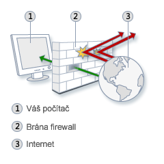

- [Síťování ve Windows](#síťování-ve-windows)
  - [**IP adresa**](#ip-adresa)
    - [**Příklady IP adresy verze 4**](#příklady-ip-adresy-verze-4)
    - [**Dělení adresy IPv4**](#dělení-adresy-ipv4)
    - [**Třídy IPv4 adres**](#třídy-ipv4-adres)
    - [**Vyhrazené adresy**](#vyhrazené-adresy)
    - [**APIPA**](#apipa)
    - [**IPv6 ve Windows**](#ipv6-ve-windows)
  - [**Windows Firewall**](#windows-firewall)
    - [**Základy Windows Firewall**](#základy-windows-firewall)
    - [**Nastavení Windows Firewall**](#nastavení-windows-firewall)
  - [**Profily a Network Location Awareness (NLA)**](#profily-a-network-location-awareness-nla)
  - [**Nástroje pro diagnostiku síťového připojení**](#nástroje-pro-diagnostiku-síťového-připojení)
    - [**Ipconfig**](#ipconfig)
      - [**Syntaxe**](#syntaxe)
      - [**Parametry**](#parametry)
      - [**Příklady**](#příklady)
    - [**Ping**](#ping)
      - [**Syntaxe**](#syntaxe-1)
      - [**Parametry**](#parametry-1)
    - [**Tracert**](#tracert)
      - [**Syntaxe**](#syntaxe-2)
      - [**Parametry**](#parametry-2)
    - [**Pathping**](#pathping)
      - [**Syntaxe**](#syntaxe-3)
      - [**Parametry**](#parametry-3)
      - [**Příklad**](#příklad)
    - [**PowerShell a netsh**](#powershell-a-netsh)
  - [**Remote Assistance**](#remote-assistance)
    - [**Zabudovaná ochrana**](#zabudovaná-ochrana)
    - [**Postup**](#postup)
  - [**Remote Desktop**](#remote-desktop)
- [AutomatedLab](#automatedlab)
  - [Lab 00 -- konfigurace virtuálních stanic](#lab-00----konfigurace-virtuálních-stanic)
- [**Úkoly**](#úkoly)
  - [**Lab 01 -- Firewall a nastavení sítě**](#lab-01----firewall-a-nastavení-sítě)
  - [**Lab 02 -- Firewall**](#lab-02----firewall)
  - [**Lab 03 -- Firewall (ICMP, ping)**](#lab-03----firewall-icmp-ping)
  - [**Lab 04 -- Remote Desktop**](#lab-04----remote-desktop)
  - [**Lab 05 -- Remote Assistance**](#lab-05----remote-assistance)
- [**Bodované úkoly**](#bodované-úkoly)
  - [**Úkol 1**](#úkol-1)
  - [**Úkol 2**](#úkol-2)


# Síťování ve Windows

## **IP adresa**

IP adresa je jednoznačná identifikace konkrétního zařízení (typicky
počítače) v prostředí Internetu. Veškerá data, která jsou z/na dané
zařízení přes počítačovou síť posílána, obsahují IP adresu odesilatele i
příjemce.

Zkratka IP znamená Internet Protocol, což je protokol, pomocí kterého
spolu komunikují všechna zařízení v Internetu. Používají se dvě verze:
čtvrtá (IPv4, 32bitové adresy) a šestá (IPv6, 128bitové adresy). Windows
od verze Vista pracují s oběma zároveň (*dual stack*) -- IPv6 je povinnou
součástí systému, ve výchozím stavu je zapnuté na každém rozhraní a při
překladu jména, které má obě adresy, Windows **upřednostní IPv6**[^12].
Většina tohoto cvičení pracuje s IPv4 (laboratorní síť Private1 je čistě
IPv4), IPv6 ve Windows shrnuje samostatná podkapitola níže. V jiných
protokolech se adresování jednotlivých zařízení může provádět jinak (viz
např. MAC adresa).

### **Příklady IP adresy verze 4**

V IPv4 je adresou 32-bitové číslo, zapisované po jednotlivých bajtech
(tzv. oktetech), oddělených tečkami. Hodnoty jednotlivých bajtů se
zapisují v desítkové soustavě (např. **192.168.48.39**).

### **Dělení adresy IPv4**

| **adresa sítě** | **adresa podsítě** | **adresa počítače** |
|-----------------|--------------------|---------------------|

Koncepce internetu jako sítě složené ze sítí a tomu odpovídající
struktura adres patří mezi novinky zavedené IP. Má velký význam pro
směrování -- mimo cílovou síť se směruje podle adresy sítě, a až když je
IP datagram doručen do ní, začíná se brát ohled i na detailnější části
adresy.

Původní koncept adresace nepočítal s podsítěmi, definoval jen adresu
sítě a počítače. Později se však toto členění ukázalo jako příliš hrubé
a lokální část adresy se rozdělila na **podsíť** a **počítač**. Obecně
platí, že mezi adresami ve stejné podsíti (mají totožnou adresu sítě a
podsítě) lze data dopravovat přímo -- dotyční účastníci jsou všichni
propojeni jedním Ethernetem či jinou lokální sítí. Jakmile se adresa
cíle nachází v jiné síti, bude potřeba datagram předat příslušnému
směrovači, aby jej dopravil dál -- viz směrování.

**Adresu sítě** pro danou koncovou síť přiděluje poskytovatel připojení
(oficiálně ji přiděluje lokální registrátor, ale tím bývá právě
poskytovatel). Je třeba o ni požádat prostřednictvím standardních
formulářů. Strukturu lokální části adresy -- zda bude rozdělena na
podsítě a jaká její část bude případně věnována adrese podsítě a jaká
adrese počítače -- určuje správce dotyčné sítě. Ten také přiděluje
adresy.

Hranici mezi adresou podsítě a počítače určuje **maska podsítě**
(*subnet mask*). Jedná se o 32bitovou hodnotu zapisovanou stejně jako IP
adresa. V binárním tvaru obsahuje jedničky tam, kde se v adrese nachází
síť a podsíť, a nuly tam, kde je počítač. Maska podsítě je společně s IP
adresou součástí základní konfigurace síťového rozhraní, často se
předává protokolem DHCP.

### **Třídy IPv4 adres**

| Třída | Začátek (binárně) | 1\. bajt  | Standardní maska               | Bitů sítě | Bitů stanice | Počet sítí | Stanic v každé síti |
|-------|----------|---------|-------------|--------|--------|----------|----------|
| A     | 0                 | 0 - 127   | 255.0.0.0                      | 7         | 24           | 126        | 16 777 214          |
| B     | 10                | 128 - 191 | 255.255.0.0                    | 14        | 16           | 16 384     | 65 534              |
| C     | 110               | 192 - 223 | 255.255.255.0                  | 21        | 8            | 2 097 152  | 254                 |
| D     | 1110              | 224 - 239 | skupinové (*multicast*) adresy |           |              |            |                     |
| E     | 1111              | 240 - 255 | vyhrazeno jako rezerva         |           |              |            |                     |

### **Vyhrazené adresy**

Nejnižší adresa v síti (s nulovou adresou stanice) slouží jako označení
celé sítě (např. „síť 192.168.24.0"). Adresa sítě se z dané IP adresy
určí jako logický součin (AND) IP adresy a masky. Nejvyšší adresa v síti
(adresa stanice obsahuje samé binární jedničky) slouží jako adresa pro
všesměrové vysílání (*broadcast*), takové adresy tedy nelze použít pro
normální účely.

Adresy **127.x.x.x** (tzv. **localhost**, nejčastěji se používá adresa
**127.0.0.1**) jsou rezervovány pro tzv. *loopback*, logickou smyčku
umožňující posílat pakety sám sobě.

Dále jsou vyčleněny rozsahy tzv. interních (neveřejných) IP adres, které
se používají pouze pro adresování vnitřních sítí (např. lokálních), na
Internetu se nikdy nemohou objevit. Jako neveřejné jsou určeny adresy:

-   Ve třídě A: **10.0.0.0** až **10.255.255.255** (10.0.0.0/8, tj. 2^24 =
    16 777 216 adres; jedna síť třídy A)

-   Ve třídě B: **172.16.0.0** až **172.31.255.255** (172.16.0.0/12, tj. 2^20 =
    1 048 576 adres; 16 sítí třídy B)

-   Ve třídě C: **192.168.0.0** až **192.168.255.255** (192.168.0.0/16, tj. 2^16 =
    65 536 adres; 256 sítí třídy C)

Uvedené počty zahrnují i adresu sítě a všesměrovou adresu každé sítě; počet
použitelných stanic v jedné síti je o 2 nižší (viz tabulka tříd výše).

### **APIPA**

Adresy IP můžete zadat do počítačů v síti nakonfigurováním jednoho nebo
více serverů DHCP, které adresy IP dynamicky poskytují dalším počítačům.
Jestliže síť neobsahuje server DHCP, použije se omezená možnost
přidělení adresy IP označovanou jako automatické přidělování soukromých
adres IP (APIPA). Po dobu, po kterou počítač používá funkci APIPA, může
komunikovat pouze s počítači, které tuto funkci používají ve stejném
síťovém segmentu. Počítač využívající funkci APIPA nemůže navázat
připojení k síti Internet. APIPA (*Automatic Private IP Addressing*) k
vytvoření automatické konfigurace využívá rozsahu adres IP od
**169.254.0.1** do **169.254.255.254** a masky podsítě **255.255.0.0**.
V PowerShellu poznáte adresu APIPA podle *PrefixOrigin* = **WellKnown**
(`Get-NetIPAddress -AddressFamily IPv4`); v Nastavení a v Centru síťových
připojení Windows takovou síť hlásí jako *Neidentifikovanou síť*.

### **IPv6 ve Windows**

Adresa IPv6 má 128 bitů a zapisuje se jako osm skupin po čtyřech
šestnáctkových číslicích oddělených dvojtečkou; úvodní nuly ve skupině lze
vynechat a jednu souvislou řadu nulových skupin nahradit `::` (např.
`2001:db8:0:0:0:0:0:1` = `2001:db8::1`). Délka prefixu se zapisuje jako
`/64` -- podsíť má v IPv6 prakticky vždy 64 bitů, zbývajících 64 bitů je
identifikátor rozhraní. Masky podsítě, třídy ani všesměrové adresy IPv6
nemá (broadcast nahrazuje multicast, např. `ff02::1` = všechny uzly na
segmentu). Na každém rozhraní Windows uvidíte několik adres najednou[^22]:

-   **Link-local** `fe80::/10` -- vytvoří se automaticky vždy, i bez
    směrovače a DHCP (obdoba APIPA), platí jen v rámci jednoho segmentu.
    Windows za ni připisují index rozhraní, tzv. *zone ID* (`fe80::1%12`);
    při `ping` na link-local adresu sousedního počítače jej uveďte, bez něj
    je adresa na počítači s více rozhraními nejednoznačná.

-   **Globální** `2000::/3` -- veřejná adresa přidělená poskytovatelem;
    počítač si ji nejčastěji vytvoří sám z prefixu, který ohlašuje směrovač
    (*SLAAC*, zprávy Router Advertisement), případně ji dostane od serveru
    DHCPv6. Windows ve výchozím stavu **negenerují identifikátor rozhraní
    z MAC adresy** (EUI-64), ale náhodně (`RandomizeIdentifiers`), a k
    trvalé adrese přidávají ještě **dočasné adresy** (*temporary*, RFC 4941),
    které se pravidelně mění a používají se pro odchozí spojení; ve výpisu
    `ipconfig` jsou označené *Temporary IPv6 Address*
    (`Get-NetIPv6Protocol`, změna `Set-NetIPv6Protocol -UseTemporaryAddresses
    Disabled`)[^14].

-   **Unique local** `fc00::/7` (v praxi `fd00::/8`) -- obdoba privátních
    rozsahů IPv4 pro vnitřní sítě; **loopback** `::1` (obdoba 127.0.0.1).

Zobrazení: `ipconfig` (u každého adaptéru řádky *IPv6 Address*, *Temporary
IPv6 Address*, *Link-local IPv6 Address*), `Get-NetIPAddress -AddressFamily
IPv6`, `Get-NetPrefixPolicy` (pořadí, v němž Windows volí mezi IPv6 a IPv4
podle RFC 3484/6724), historicky `netsh interface ipv6 show addresses`.
Diagnostické nástroje (`ping -6`, `tracert -6`, `Test-NetConnection`)
pracují s IPv6 přímo.

**Nevypínejte IPv6.** Microsoft vypnutí protokolu ani jeho odpojení od
adaptéru nedoporučuje -- IPv6 je povinná součást Windows a některé
komponenty bez ní nefungují správně. Pokud IPv6 v síti dělá problémy,
podporovaná úprava je **upřednostnit IPv4** v prefix policy (hodnota
`DisabledComponents` = `0x20` v klíči
`HKLM\SYSTEM\CurrentControlSet\Services\Tcpip6\Parameters`; po restartu
ověříte příkazem `netsh interface ipv6 show prefixpolicies`), nikoli
odškrtnout *Protokol IP verze 6 (TCP/IPv6)* ve vlastnostech adaptéru[^12].

**Přechodové technologie** (*6to4*, *ISATAP*, *Teredo*), které tunelovaly
IPv6 přes sítě IPv4, Microsoft prohlásil za zastaralé (*deprecated*) už ve
Windows 10 1803: ISATAP a Teredo jsou vypnuté, 6to4 se aktivuje jen na
rozhraní s veřejnou IPv4 adresou; doporučením je nativní IPv6[^13]. Rozhraní
*Teredo Tunneling Pseudo-Interface* ve Windows 11 24H2/25H2 stále existuje
(používají jej síťové služby Xbox), ale je ve výchozím stavu neaktivní --
stav ukáže `netsh interface teredo show state`, trvale se vypíná zásadou
skupiny *Computer Configuration \> Administrative Templates \> Network \>
TCPIP Settings \> IPv6 Transition Technologies* nebo hodnotou
`DisabledComponents` = `0x01`[^12]. Související protokol PNRP (*Peer Name
Resolution Protocol*, základ *Snadného připojení* Vzdálené pomoci) byl z
Windows 11 24H2 odebrán úplně[^13].

## **Windows Firewall**

Brána firewall může být software nebo hardwarové zařízení, které
kontroluje informace přicházející z Internetu nebo ze sítě, a v
závislosti na svém nastavení je buď zablokuje, nebo jim umožní projít do
počítače.

Brána firewall se tedy snaží předcházet počítačovým podvodníkům nebo
škodlivému softwaru (například červům) získání přístupu k počítači
prostřednictvím sítě nebo Internetu. Brána firewall může rovněž zabránit
tomu, aby počítač odesílal škodlivý software do jiných počítačů.

Obrázek níže znázorňuje princip funkcionality brány firewall.



### **Základy Windows Firewall**

Windows Firewall je hostitelský (*host-based*) stavový firewall zabudovaný
do všech edic Windows a zapnutý ve výchozím stavu; běží jako služba
*MpsSvc* nad platformou *Windows Filtering Platform* (WFP) a kontroluje
všechna síťová rozhraní. Jakmile paket dorazí na rozhraní, firewall ho
porovná s pravidly a buď propustí, nebo zahodí. Výchozí chování je[^5]:

-   **příchozí** (*inbound*) provoz je **blokován**, pokud nejde o odpověď
    na spojení, které počítač sám navázal, nebo pokud jej nepovoluje
    pravidlo;

-   **odchozí** (*outbound*) provoz je **povolen**, pokud ho nějaké
    pravidlo neblokuje.

Filosofie tedy zní: co není povoleno, je (směrem dovnitř) zakázáno.
Pravidla identifikují provoz podle programu nebo služby, protokolu (TCP,
UDP, ICMPv4/ICMPv6 včetně typu a kódu zprávy, libovolné číslo protokolu
IP), místního a vzdáleného portu, místní a vzdálené adresy (včetně
dynamických klíčových slov *Local subnet*, *Default gateway*, *DNS servers*
apod.), typu rozhraní a síťového profilu. Pořadí pravidel nelze určit
ručně; platí pevná přednost: **explicitní blokující pravidlo přebíjí
povolující**, povolující pravidlo přebíjí výchozí blokování příchozího
provozu a specifičtější pravidlo (např. jedna adresa) přebíjí obecnější
(rozsah)[^8]. Právě na to spoléhá Úkol 2 -- povolit ping jen jednomu
počítači znamená napsat jediné úzké povolující pravidlo, nikoli blokovat
všechny ostatní.

**Název.** Firewall se ve Windows Vista až Windows 10 1703 jmenoval *Brána
firewall systému Windows* (Windows Firewall), od Windows 10 1709 *Firewall
v programu Windows Defender* (Windows Defender Firewall)[^1]. Dokumentace
Microsoftu se od roku 2024 vrátila k názvu **Windows Firewall**, ale v
samotném systému Windows 11 24H2/25H2 se stále potkáte se všemi variantami:
applet Ovládacích panelů i konzola `wf.msc` se jmenují *Windows Defender
Firewall (with Advanced Security)*, přepínač v aplikaci Zabezpečení Windows
*Microsoft Defender Firewall* a služba má zobrazovaný název *Windows
Defender Firewall* (`MpsSvc`)[^6][^21]. Jde o jeden a týž produkt s jednou
databází pravidel.

Ve Windows XP firewall filtroval jen příchozí provoz; od Windows Vista umí
pravidla pro oba směry, pravidla zabezpečení připojení (IPsec) a síťové
profily. Dvě vlastnosti nelze vypnout ani pravidly: **skrytý režim**
(*stealth mode*) -- na porty, na nichž nic nenaslouchá, počítač neodpovídá,
takže útočník nezjistí, jaký OS a firewall má před sebou -- a **filtrování
při startu** (*boot time filtering*): WFP filtruje provoz už od okamžiku
aktivace síťového zásobníku, tedy dřív, než se spustí služba firewallu,
aby v této mezeře nešlo na systém zaútočit[^5].

**Hyper-V firewall.** Od Windows 11 22H2 má firewall druhou větev pro
provoz kontejnerů běžících nad Hyper-V na tomto počítači -- především
*Windows Subsystem for Linux* (WSL). Jejich provoz neprochází běžnými
pravidly hostitele, ale pravidly *Hyper-V firewallu*, která se spravují jen
PowerShellem (`Get-NetFirewallHyperVVMCreator`,
`Get-/Set-NetFirewallHyperVVMSetting`, `Get-/New-NetFirewallHyperVRule`,
`Get-NetFirewallHyperVProfile`) nebo přes Intune (CSP); v konzoli `wf.msc`
je neuvidíte. Pro virtuální stroje Hyper-V (naše W11-1 až W11-3) to
neplatí -- ty jsou z pohledu hostitele samostatné počítače s vlastním
firewallem[^9].

Pro lepší pochopení nastavení jednotlivých parametrů pravidel se
potřebujeme seznámit se základními pojmy z oblastí sítí[^2]:

-   **Protokol**. Pro potřeby konfigurace firewallu jsou pro nás
     důležité 2 protokoly ‒ *Transmission Control Protocol* (TCP) a
     *User Datagram Protocol* (UDP). TCP je dnes používaný jako hlavní
     protokol Internetu, kdežto UDP se používá především pro
     *broadcast* a *multicast*[^3], a často se s ním setkáme také ve
     spojení s hrami.

-   **Port**. Port je důležité číslo které lokalizuje hlavičku TCP nebo
     UDP datagramu. Port se používá pro mapování sítového provozu
     k příslušným službám a programů. Např. port 80 je rezervován pro
     WWW komunikaci a port 25 pro přenos e-mailu přes Internet.

-   **IPSec (*Internet Protocol Security*)**. Metoda zabezpečení
     Internetového provozu používající šifrování a digitální podpisy.
     Jestliže je IPSec datagram zachycen, jeho obsah nemůže být
     přečten, ale IPSec poskytne ověření odesílatele, které dává
     příjemci záruku s pravostí datagramu.

-   **Síťová adresa**. Každý počítač v síti má síťovou adresu. Brána
     firewall umožňuje odlišné vyhodnocování provozu pro různé síťové
     adresy nebo jejich rozsahy.

-   **Příchozí provoz**. Jedná se o část síťového provozu směřujícího
     z externího počítače do našeho počítače.

-   **Odchozí provoz**. Tímto termínem je označen provoz směřující
     z našeho počítače do Internetu nebo jiných míst v síti.

-   **Síťové rozhraní**. To může být Lokální síť (LAN), bezdrátová síť
     (Wi-Fi), modemové připojení, VPN nebo FireWire připojení.

### **Nastavení Windows Firewall**

Firewall je ve Windows jediná služba (*MpsSvc*) s jedinou databází pravidel;
liší se jen rozhraní, kterými se spravuje:

-   **Zabezpečení Windows (Windows Security) \> Firewall a ochrana sítě
    (Firewall & network protection)**. Hlavní rozhraní ve Windows 11:
    stav firewallu pro profily Doména, Privátní a Veřejná, zapnutí a
    vypnutí firewallu pro jednotlivé profily, *Povolit aplikaci v bráně
    firewall*, *Obnovit výchozí nastavení*, odkaz *Upřesnit nastavení*
    (otevře konzolu s pokročilým zabezpečením).

-   **Firewall v programu Windows Defender (Windows Defender Firewall)**.
    Klasický applet Ovládacích panelů (`firewall.cpl`) se stejnými
    jednoduchými volbami -- povolení programu nebo funkce, zapnutí a
    vypnutí firewallu, oznámení, obnovení výchozího nastavení. Klasické
    zobrazení Ovládacích panelů (Windows XP) už neexistuje, applet najdete
    v kategorii *Systém a zabezpečení* nebo v zobrazení ikon.

-   **Firewall v programu Windows Defender s pokročilým zabezpečením
    (Windows Defender Firewall with Advanced Security, WFAS)**. Konzola
    `wf.msc`, od Windows Vista. Umožňuje definovat komplexní příchozí i
    odchozí pravidla (program, služba, protokol a port, IP adresy, profil,
    typ rozhraní), pravidla zabezpečení připojení (IPsec) a sledovat aktivní
    pravidla.

-   **Příkazová řádka**. PowerShell modul *NetSecurity*
    (`Get-/Set-NetFirewallProfile`,
    `Get-/New-/Set-/Enable-/Disable-/Remove-NetFirewallRule`,
    `Get-NetFirewallPortFilter` atd.) je dnes doporučený nástroj; starší
    `netsh advfirewall` funguje dál, ale Microsoft výslovně doporučuje pro
    správu sítě PowerShell[^15]. Centrálně se firewall řídí zásadami skupiny
    (*Computer Configuration \> Windows Settings \> Security Settings \>
    Windows Defender Firewall with Advanced Security*, viz E05) nebo přes
    Intune (Firewall CSP)[^6].

Nejčastější úkony vedle sebe (příkazy z tohoto cvičení; PowerShell i
`netsh` spouštějte jako správce)[^7]:

| Úkon | PowerShell (NetSecurity) | netsh |
|------|--------------------------|-------|
| stav profilů | `Get-NetFirewallProfile \| Format-Table Name, Enabled` | `netsh advfirewall show allprofiles` |
| zapnout firewall ve všech profilech | `Set-NetFirewallProfile -All -Enabled True` | `netsh advfirewall set allprofiles state on` |
| vypnout jen profil Public | `Set-NetFirewallProfile -Name Public -Enabled False` | `netsh advfirewall set publicprofile state off` |
| výchozí akce profilu | `Set-NetFirewallProfile -DefaultInboundAction Block -DefaultOutboundAction Allow` | `netsh advfirewall set allprofiles firewallpolicy blockinbound,allowoutbound` |
| povolit skupinu pravidel | `Enable-NetFirewallRule -DisplayGroup 'Remote Desktop'` | `netsh advfirewall firewall set rule group="Remote Desktop" new enable=yes` |
| nové pravidlo (ICMP echo, jen Public) | `New-NetFirewallRule -DisplayName 'ICMP Public' -Direction Inbound -Protocol ICMPv4 -IcmpType 8 -Action Allow -Profile Public` | `netsh advfirewall firewall add rule name="ICMP Public" dir=in protocol=icmpv4:8,any action=allow profile=public` |
| blokovat odchozí TCP 80/443 | `New-NetFirewallRule -DisplayName 'Block Web' -Direction Outbound -Protocol TCP -RemotePort 80,443 -Action Block` | `netsh advfirewall firewall add rule name="Block Web" dir=out protocol=tcp remoteport=80,443 action=block` |
| zakázat / smazat pravidlo | `Disable-NetFirewallRule -DisplayName 'Block Web'`, `Remove-NetFirewallRule -DisplayName 'Block Web'` | `netsh advfirewall firewall set rule name="Block Web" new enable=no`, `netsh advfirewall firewall delete rule name="Block Web"` |
| porty a adresy pravidla | `Get-NetFirewallRule -DisplayName X \| Get-NetFirewallPortFilter` (resp. `Get-NetFirewallAddressFilter`) | `netsh advfirewall firewall show rule name=X verbose` |
| obnovit výchozí nastavení | -- (Zabezpečení Windows \> *Obnovit výchozí nastavení brány firewall*) | `netsh advfirewall reset` |

Rozdíl v modelu: `Get-NetFirewallRule` vrací jen hlavičku pravidla (název,
směr, akce, profil, stav); podmínky -- porty, adresy, program, služba --
jsou samostatné *filtry*, které získáte navazujícím cmdletem
(`Get-NetFirewallPortFilter`, `Get-NetFirewallAddressFilter`,
`Get-NetFirewallApplicationFilter`), případně celé pravidlo rozbalí
`Show-NetFirewallRule`. Pravidlo má dva názvy: *Name* (identifikátor, u
vestavěných pravidel např. `FPS-ICMP4-ERQ-In`) a *DisplayName*
(lokalizovaný text, který vidíte v konzoli)[^7].

**Sdílení souborů a tiskáren ve 24H2.** Když ve Windows 11 24H2 nebo
Windows Server 2025 vytvoříte sdílenou složku, Windows už nezapínají celou
skupinu *File and Printer Sharing*, ale novou užší skupinu **File and
Printer Sharing (Restrictive)**, která neobsahuje pravidla pro porty
NetBIOS 137--139 (ty používá jen SMB1); v konzoli `wf.msc` tak vedle sebe
uvidíte obě skupiny[^10]. Přepínač *Sdílení souborů a tiskáren* v
Nastavení \> Síť a internet \> Upřesnit nastavení sítě \> Upřesnit
nastavení sdílení zapíná pravidla sdílení pro daný profil; odpověď na
`ping` povolují právě pravidla *Echo Request -- ICMPv4-In* / *ICMPv6-In*
ze skupiny sdílení -- proto Windows 11 ve výchozím stavu na ping
**neodpovídají** (Lab 03).

Microsoft firewall nedoporučuje vypínat (ani při použití firewallu třetí
strany -- ten si sám vypne jen kategorie pravidel, které potřebuje); pokud
je to nutné, vypíná se profil
(`Set-NetFirewallProfile -Name Public -Enabled False`), nikdy zastavením
služby *MpsSvc* -- to není podporováno a rozbíjí nabídku Start, instalaci
a aktualizace aplikací z Microsoft Store i aktivaci Windows (viz L05)[^5].
Pro dočasné zpřísnění při útoku slouží naopak režim *shields up* --
zaškrtávátko **Blokovat všechna příchozí připojení včetně připojení v
seznamu povolených aplikací (Block all incoming connections, including
those in the list of allowed apps)** v Zabezpečení Windows u daného
profilu nebo v appletu Ovládacích panelů; přebije všechny povolující
výjimky včetně Vzdálené plochy, pravidla ale zůstanou zachována[^6].

## **Profily a Network Location Awareness (NLA)**

Network Location Awareness (NLA, služba *NlaSvc*), neboli povědomí o tom,
v jaké síti se nacházíme, je proces, kterým Windows přiřazují každému
síťovému rozhraní **síťový profil** (v PowerShellu *NetworkCategory*)
podle sítě, do níž je připojeno. Síť je identifikována mj. výchozí bránou
(její MAC adresou), DNS příponou a dostupností řadiče domény; Windows si
ji zapamatují v seznamu známých sítí, takže při dalším připojení ke stejné
síti se profil obnoví. Podle profilu se pak aplikují pravidla brány
firewall a zjišťování sítě (*Network Discovery*). Od Windows 7 má každé
rozhraní vlastní profil (notebook připojený kabelem do domény a zároveň k
veřejné Wi-Fi má na každém rozhraní jiný profil). Jsou možné 3 profily[^5]:

-   **Privátní síť (*Private network*)**. Důvěryhodná síť (doma, v
     zaměstnání) -- počítač je v ní zjistitelný, sdílení souborů a
     tiskáren je povoleno. Nastavuje ji uživatel (správce) ručně. Ve
     Windows 11 se při prvním připojení k nové síti zobrazí dotaz *Chcete
     povolit, aby byl počítač zjistitelný ostatními počítači a zařízeními
     v této síti?* (*Do you want to allow your PC to be discoverable by
     other PCs and devices on this network?*) -- odpověď *Ano* znamená
     Privátní síť. Kdykoli později lze profil změnit v **Nastavení
     (Settings) \> Síť a internet (Network & internet) \> Ethernet** (u
     Wi-Fi ve vlastnostech připojené sítě) volbou **Typ síťového profilu
     (Network profile type)**: *Veřejná síť (doporučeno)* / *Privátní síť*
     (*Public network (Recommended)* / *Private network*)[^11], nebo v
     PowerShellu jako správce: `Get-NetConnectionProfile`,
     `Set-NetConnectionProfile -InterfaceAlias LAN0 -NetworkCategory Private`
     (změna platí ihned, přepínat lze jen mezi *Private* a *Public*)[^5].

-   **Veřejná síť (*Public network*)**. Výchozí profil pro každou síť,
     kterou Windows neidentifikují jako Privátní ani Doménovou (hotspot,
     hotel, letiště). Počítač je skrytý, sdílení blokováno, pravidla
     firewallu jsou nejpřísnější. Pozor: síť **bez výchozí brány** (např.
     izolovaná laboratorní síť Private1 v tomto cvičení) Windows často
     neidentifikují vůbec (*Neidentifikovaná síť*, *Unidentified network*),
     zůstává ve Veřejném profilu a v Nastavení nemusí jít přepnout -- pak je
     nutný `Set-NetConnectionProfile`. Do Veřejného profilu spadá i adaptér
     bez připojeného kabelu[^8].

-   **Doménová síť (*Domain network*)**. Nastaví se automaticky, jakmile
     se počítač na daném rozhraní ověří vůči řadiči domény (v PowerShellu
     *DomainAuthenticated*); ručně ji nastavit nelze[^4]. U zařízení
     připojených jen do Microsoft Entra ID lze doménovou síť definovat
     zásadou *NetworkListManager* (CSP)[^5].

Historie: Windows 7 a 8 se při připojení ptaly, zda jde o *Domácí síť*,
*Síť v zaměstnání* nebo *Veřejnou síť* (první dvě = Soukromý profil);
Windows 10 měla přepínač *Nastavit tento počítač jako zjistitelný*. Windows
11 má přímo přepínač typu profilu. Klasické *Centrum síťových připojení a
sdílení* (Ovládací panely, `control.exe /name Microsoft.NetworkAndSharingCenter`)
ve Windows 11 zůstává a profil aktivní sítě zobrazuje, změnit ho z něj ale
nelze -- změna se dělá v Nastavení nebo PowerShellem.

## **Nástroje pro diagnostiku síťového připojení**

Všechny níže uvedené nástroje pracují jak s protokolem IPv4, tak
protokolem IPv6 (přepínače `-4` / `-6` vynutí verzi; samostatný `ping6`
z Windows XP už neexistuje). Jde o klasické konzolové programy, které se
za posledních 20 let prakticky nezměnily a fungují stejně ve Windows 11
24H2/25H2 i na Windows Serveru; jejich objektové ekvivalenty v PowerShellu
shrnuje podkapitola *PowerShell a netsh* na konci. Pamatujte, že `ping` a
`tracert` pracují s ICMP -- cílový Windows 11 na ně ve výchozím stavu
**neodpovídá**, dokud v jeho firewallu není povoleno pravidlo *Echo
Request* (Lab 03); „Request timed out" tedy nemusí znamenat, že cíl neběží.

### `Ipconfig`

Zobrazí všechny aktuální hodnoty konfigurace sítě TCP/IP a aktualizuje
nastavení protokolu DHCP (*Dynamic Host Configuration Protocol*) a
služby DNS (*Domain Name System*). Při použití bez parametrů zobrazí
příkaz **ipconfig** adresy IPv6 nebo adresu IPv4, masku podsítě
a výchozí bránu pro všechny adaptéry.

#### **Syntaxe**

 - `ipconfig [/all] [/renew [Adaptér]] [/release [Adaptér]] [/flushdns] [/displaydns] [/registerdns] [/showclassid Adaptér] [/setclassid Adaptér [ID_třídy]]`

#### **Parametry**

- **/all**

    - Zobrazí úplnou konfiguraci protokolu TCP/IP u všech adaptérů.
 Bez tohoto parametru zobrazí příkaz `ipconfig` pro každý adaptér
 pouze adresy IPv6 nebo adresu IPv4, masku podsítě a výchozí bránu.
 Adaptéry mohou reprezentovat fyzická rozhraní, například instalované
 síťové karty, nebo logická rozhraní, například telefonická připojení.

- **/renew** \[*Adaptér*\]

    - Obnoví konfiguraci DHCP u všech adaptérů (není-li určen adaptér) nebo
 u konkrétního adaptéru, je-li uveden parametr *Adaptér*. Tento
 parametr je k dispozici pouze v počítačích s adaptéry
 nakonfigurovanými pro automatické přidělování adres IP. Chcete-li
 určit název adaptéru, zadejte název adaptéru, který se zobrazí
 při použití příkazu **ipconfig** bez parametrů.

- **/release** \[*Adaptér*\]

    - Odešle serveru DHCP zprávu **DHCPRELEASE**, která uvolní aktuální
 konfiguraci DHCP a vymaže konfiguraci adresy IP u všech adaptérů
 (není-li určen adaptér) nebo u konkrétního adaptéru, je-li uveden
 parametr *Adaptér*. Tento parametr zakáže protokol TCP/IP u adaptérů
 konfigurovaných pro automatické získání adresy IP. Chcete-li určit
 název adaptéru, zadejte název adaptéru, který se zobrazí při použití
 příkazu `ipconfig` bez parametrů.

- **/flushdns**

    - Vyprázdní a vynuluje obsah vyrovnávací paměti přeložených adres
 klienta DNS. Během řešení potíží se službou DNS můžete v případě
 nutnosti použít tento postup k odstranění negativních položek
 vyrovnávací paměti stejně jako kterýchkoli jiných položek, které byly
 přidány dynamicky.

- **/displaydns**

    - Zobrazí obsah vyrovnávací paměti přeložených adres klienta DNS. Do
 zobrazení budou zahrnuty jak položky načtené předem z místního souboru
 `hosts`, tak i záznamy získané později řešením dotazů na názvy. Tyto
 informace využívá klientská služba DNS k rychlému překladu často
 zjišťovaných názvů před odesláním dotazu na konfigurované servery DNS.

- **/registerdns**

    - Spouští ruční dynamickou registraci názvů DNS a adres IP
 konfigurovaných v počítači. Tento parametr lze použít při řešení
 potíží s nezdařenou registrací názvu DNS nebo při řešení problému
 dynamické aktualizace mezi klientem a serverem DNS bez nutnosti
 restartování počítače klienta. Názvy registrované službou jsou určeny
 nastavením služby DNS v rozšířených vlastnostech protokolu TCP/IP.

- **/showclassid** *Adaptér*

    - Zobrazí identifikátor třídy DHCP pro určený adaptér. Chcete-li
 zobrazit ID třídy DHCP pro všechny adaptéry, použijte místo parametru
 *Adaptér* zástupný znak **\*** (hvězdička). Tento parametr je k
 dispozici pouze v počítačích s adaptéry, které jsou konfigurovány pro
 automatické přidělování adres IP.

- **/setclassid** *Adaptér* \[*ID_třídy*\]

    - Nastaví identifikátor třídy DHCP pro určený adaptér. Chcete-li
 nastavit ID třídy DHCP pro všechny adaptéry, použijte místo parametru
 *Adaptér* zástupný znak **\*** (hvězdička). Tento parametr je k
 dispozici pouze v počítačích s adaptéry, které jsou konfigurovány pro
 automatické přidělování adres IP. Není-li určeno ID třídy DHCP, dojde
 k odebrání aktuálního ID třídy.

#### **Příklady**

| **ipconfig**                       | Zobrazení informací                                                                                     |
|----------------------------|--------------------------------------------|
| **ipconfig /all**                  | Zobrazení podrobných informací                                                                          |
| **ipconfig /renew**                | Obnovení všech adaptérů                                                                                 |
| **ipconfig /renew EL\***           | Obnovení všech připojení s názvem začínajícím na EL                                                     |
| **ipconfig /release \*Přip\***     | Uvolnění všech odpovídajících připojení, např. Připojení k místní síti 1 nebo Připojení k místní síti 2 |
| **ipconfig /allcompartments**      | Zobrazí informace o všech oddílech                                                                      |
| **ipconfig /allcompartments /all** | Zobrazí podrobné informace o všech oddílech                                                             |

### `Ping`

Ověřuje dostupnost připojení na úrovni protokolu IP k jinému počítači s
protokolem TCP/IP odesíláním zpráv požadavku odezvy ICMP (*Internet
Control Message Protocol*). Zobrazí odpovídající přijaté zprávy Odpověď
echa spolu s údaji o době přenosu. Příkaz **ping** je základním příkazem
protokolu TCP/IP využívaným k odstraňování potíží se spojením,
dosažitelností a rozlišením názvů. Při použití bez parametrů příkaz
**ping** zobrazí nápovědu.

#### **Syntaxe**

- `ping [-t] [-a] [-n Počet] [-l Velikost] [-f] [-i Doba_života] [-v Typ_služby] [-r Počet] [-s Počet] [{-j Seznam_hostitelů | -k Seznam_hostitelů}] [-w Časový_limit] [-R] [-S Zdrojová_adresa] [-4] [-6] Název_cíle`

#### **Parametry**

- **-t**

    - Určuje, že příkaz `ping` má pokračovat v odesílání zpráv požadavku
 odezvy, dokud nebude přerušen. Chcete-li odesílání zpráv přerušit a
 zobrazit statistické údaje, stiskněte kombinaci kláves <kbd>Ctrl</kbd>+<kbd>Break</kbd>.
 Chcete-li přerušit odesílání zpráv a ukončit práci příkazu `ping`,
 stiskněte kombinaci kláves <kbd>Ctrl</kbd>+<kbd>C</kbd>.

- **-a**

    - Určuje, že pro cílovou adresu IP má být prováděn zpětný překlad názvů.
 V případě úspěšného provedení příkaz ping zobrazí odpovídající název
 hostitele.

- **-n** *Počet*

    - Určuje počet odeslaných zpráv požadavku odezvy. Výchozí hodnota je 4.

- **-l** *Velikost*

    - Určuje počet bajtů datového pole v odeslaných zprávách požadavku
 odezvy. Výchozí hodnota je 32. Maximální hodnota parametru *Velikost*
 je 65527.

- **-f**

    - Určuje, že zprávy s požadavkem na odezvu jsou odesílány s příznakem
 **nefragmentovat** v hlavičce nastaveným na hodnotu 1 (k dispozici
 pouze v protokolu IPv4). Zprávu s požadavkem na odezvu nemohou
 směrovače na cestě k cíli fragmentovat. Tento parametr vám může pomoci
 při odstraňování potíží s jednotkami PMTU (*Path Maximum Transmission
 Unit*).

- **-i** *Doba_života*

    - Určuje hodnotu pole TTL v záhlaví IP odeslaných zpráv požadavku
 odezvy. Výchozí hodnotu pole TTL určuje hostitel. Maximální hodnota
 parametru *Doba_života* je 255.

- **-v** *Typ_služby*

    - Určuje hodnotu pole TOS (*Type of Service*) v hlavičce protokolu IP
 odeslaných zpráv s požadavkem na odezvu (k dispozici pouze v protokolu
 IPv4). Výchozí hodnota je 0. Parametr *Typ služby* může nabývat
 desítkových hodnot od 0 do 255.

- **-r** *Počet*

    - Určuje, že má být použita možnost Záznam trasy v záhlaví IP, která
 zaznamená trasu zprávy požadavku odezvy a odpovídající zprávy Odpověď
 echa (k dispozici pouze v protokolu IPv4). Každému směrování na trase
 odpovídá jedna položka možnosti Záznam trasy. Pokud je to možné,
 použijte hodnotu parametru *Počet* větší nebo rovnou počtu směrování
 na trase mezi zdrojem a cílem. Minimální hodnota parametru *Počet* je
 1, maximální 9.

- **-s** *Počet*

    - Určuje, že má být použita možnost Časové razítko Internetu v záhlaví
 IP, která zaznamená okamžik přijetí požadavku odezvy a odpovídající
 zprávy Odpověď echa jednotlivými směrovači. Minimální hodnota
 parametru *Počet* je 1, maximální 4. Tento parametr je povinný pro
 cílové místní adresy v rámci propojení.

- **-j** *Seznam_hostitelů*

    - Určuje, že zprávy požadavku odezvy použijí možnost Volného režimu v
 hlavičce protokolu IP s množinou mezilehlých cílových umístění
 uvedených v *Seznamu_hostitelů* (k dispozici pouze v protokolu IPv4).
 U směrování ve volném režimu lze následné prostřední cíle oddělit
 jedním nebo více směrovači. Maximální počet adres nebo názvů v seznamu
 hostitelů je 9. Seznam hostitelů je sada adres IP (pomocí čísel v
 desítkové soustavě oddělených tečkami) oddělených mezerami.

- **-k** *Seznam_hostitelů*

    - Určuje, že zprávy požadavku odezvy použijí možnost Striktního režimu v
 hlavičce protokolu IP s množinou mezilehlých cílových umístění
 uvedených v *Seznamu_hostitelů* (k dispozici pouze v protokolu IPv4).
 V případě pevného režimu směrování musí být následující postupný cíl
 vždy přímo dosažitelný (musí se jednat o sousední směrovač rozhraní
 aktuálního směrovače). Maximální počet adres nebo názvů v seznamu
 hostitelů je 9. Seznam hostitelů je sada adres IP (pomocí čísel v
 desítkové soustavě oddělených tečkami) oddělených mezerami.

- **-w** *Časový_limit*

    - Určuje dobu čekání v milisekundách na zprávu Echo Response,
 odpovídající dané zprávě požadavku odezvy. Není-li tato zpráva přijata
 v daném časovém intervalu, zobrazí se chybová zpráva „Vypršel časový
 limit žádosti". Výchozí interval je 4 000 (4 sekundy).

- **-R**

    - Určuje, že je sledována cesta přenosu paketů (k dispozici pouze v
 protokolu IPv6).

- **-S** *Zdrojová_adresa*

    - Určuje, zdrojovou adresu, která má být použita (k dispozici pouze v
 protokolu IPv6).

- **-4**

    - Určuje, že pro příkaz `ping` je použit protokol IPv4. Tento parametr
 není nutný k označení cílového hostitele s adresou protokolu IPv4.
 Nutný je pouze k identifikaci cílového hostitele podle názvu.

- **-6**

    - Určuje, že pro příkaz `ping` je použit protokol IPv6. Tento parametr
 není nutný k označení cílového hostitele s adresou protokolu IPv6.
 Nutný je pouze k identifikaci cílového hostitele podle názvu.

- **Název_cíle**

    - Určuje název hostitele nebo adresu IP cíle.

### `Tracert`

Určuje trasu k cíli tím, že do cíle odesílá zprávy protokolu ICMP
(*Internet Control Message Protocol*) nebo protokolu ICMPv6 s požadavkem
na odezvu se zvyšujícími se hodnotami polí TTL (*Time-To-Live*).
Zobrazenou cestu představuje seznam bližších rozhraní směrovačů na trase
mezi zdrojovým hostitelem a cílem. Bližší rozhraní je rozhraní
směrovače, které je k odesílajícímu hostiteli z hlediska cesty nejblíže.
Samotný příkaz `tracert` bez parametrů zobrazí nápovědu.

#### **Syntaxe**

- `tracert [-d] [-h Maximální_počet_směrování] [-j Seznam_hostitelů] [-w Časový_limit] [-R] [-S Zdrojová_adresa] [-4] [-6] Cílový_název`

#### **Parametry**

- **-d**

    - Způsobí, že příkaz `tracert` nebude překládat adresy IP
 zprostředkujících směrovačů na jejich názvy. Tímto lze zobrazení
 výstupu příkazu `tracert` urychlit.

- **-h** *Maximální_počet_směrování*

    - Určuje maximální počet směrování v cestě pro vyhledání cíle. Výchozí
 počet je 30 směrování.

- **-j** *Seznam_hostitelů*

    - Určuje, zda má být ve zprávách s požadavkem na odezvu použita možnost
 volného režimu v hlavičce IP se sadou zprostředkujících cílů určených
 parametrem *Seznam_hostitelů*. U směrování ve volném režimu lze
 následné prostřední cíle oddělit jedním nebo více směrovači. Maximální
 počet adres nebo názvů v seznamu hostitelů je 9. Parametr
 *Seznam_hostitelů* je sada adres IP (v desítkovém zápisu s tečkami)
 oddělených mezerami. Tento parametr použijte pouze v případě trasování
 adres protokolu IPv4.

- **-w** *Časový_limit*

    - Určuje dobu v milisekundách, po kterou bude očekáváno přijetí zprávy
 protokolu ICMP o překročení času nebo zprávy s odpovědí echa
 odpovídající odeslané zprávě s požadavkem na odezvu. Není-li v daném
 časovém limitu žádná zpráva přijata, zobrazí se hvězdička (\*).
 Výchozí časový limit je 4 000 (4 sekundy).

- **-R**

    - Určuje, že má být při odeslání zprávy s požadavkem na odezvu do
 místního počítače použita rozšířená hlavička směrování IPv6 a že jako
 cíl má být použit zprostředkující cíl spolu s testováním zpáteční
 trasy.

- **-S**

    - Určuje zdrojovou adresu ve zprávách s požadavkem na odezvu. Tento
 parametr použijte pouze v případě trasování adres protokolu IPv6.

- **-4**

    - Určuje, že program `tracert` použije k trasování pouze protokol
 IPv4.

- **-6**

    - Určuje, že program `tracert` použije k trasování pouze protokol
 IPv6.

- **Název_cíle**

    - Určuje cíl určený adresou IP nebo názvem hostitele.

### `Pathping`

Poskytuje informace o zpoždění a ztrátách v síti u jednotlivých
směrovačů na trase mezi zdrojem a cílem. Příkaz `pathping` po určitou
dobu opakovaně zasílá všem směrovačům mezi zdrojem a cílem zprávy s
požadavkem na odezvu a na základě paketů vrácených od jednotlivých
směrovačů pak vypočte výsledky. Protože příkaz `pathping` zobrazuje
úroveň ztráty paketů na všech zadaných směrovačích nebo propojeních,
můžete určit, u kterých směrovačů nebo podsítí pravděpodobně vznikají
problémy. Příkaz `pathping` provede ekvivalent příkazu `tracert`
pomocí identifikace jednotlivých směrovačů v cestě. Všem směrovačům pak
po stanovenou dobu zasílá testovací pakety a na základě počtu
navrácených paketů vypočte statistiku. Při použití bez parametrů zobrazí
příkaz `pathping` nápovědu.

#### **Syntaxe**

- `pathping [-n] [-h Maximální_počet_směrování] [-g Seznam_hostitelů] [-p Perioda] [-q Počet_dotazů] [-w Časový_limit] [-i Adresa_IP] [-4] [-6] Název_cíle`

#### **Parametry**

- **-n**

    - Zabrání příkazu `pathping` v pokusu o převedení adres IP směrovačů
 na trase na názvy. Tímto způsobem lze někdy urychlit zobrazení
 výsledků příkazu `pathping`.

- **-h** *Maximální_počet_směrování*

    - Určuje maximální počet směrování v cestě pro vyhledání cíle. Výchozí
 počet je 30 směrování.

- **-g** *Seznam_hostitelů*

    - Určuje, zda má být ve zprávách s požadavky na odezvu použita možnost
 volné trasy zdroje v hlavičce protokolu IP se sadou dočasných cílů
 určených parametrem *Seznam_hostitelů*. U směrování ve volném režimu
 lze následné prostřední cíle oddělit jedním nebo více směrovači.
 Maximální počet adres nebo názvů v seznamu hostitelů je 9. Parametr
 *Seznam_hostitelů* je sada adres IP (v desítkovém zápisu s tečkami)
 oddělených mezerami.

- **-p** *Perioda*

    - Určuje počet milisekund mezi jednotlivými po sobě jdoucími testovacími
 pakety. Výchozí doba je 250 milisekund (1/4 sekundy).

- **-q** *Počet_dotazů*

    - Určuje počet zpráv požadavku odezvy odeslaných jednotlivým směrovačům
 na trase. Výchozí hodnota je 100 dotazů.

- **-w** *Časový_limit*

    - Určuje počet milisekund doby čekání na odpověď. Výchozí doba je 3 000
 milisekund (3 s).

- **-i** *Adresa_IP*

    - Určuje zdrojovou adresu.

- **-4**

    - Určuje, že příkaz `pathping` použije pouze protokol IPv4.

- **-6**

    - Určuje, že příkaz `pathping` použije pouze protokol IPv6.

- **Název_cíle**

    - Určuje cíl zadaný jako adresa IP nebo jako název hostitele.

#### **Příklad**

| `pathping -n corp1` | Vypíše informace o zpožděních a ztrátách u jednotlivých směrovačů na cestě k počítači **corp1** |
|----------------------------|--------------------------------------------|

### **PowerShell a netsh**

Od Windows 8 / Server 2012 mají konzolové nástroje objektové ekvivalenty v
modulech **NetTCPIP**, **NetAdapter** a **DnsClient**; Microsoft dnes pro
správu sítě doporučuje PowerShell a `netsh` označuje za starší nástroj,
který ale v systému zůstává a některé jeho kontexty (např. `netsh wlan`,
`netsh trace`, `netsh interface portproxy`) PowerShellový ekvivalent
nemají[^14][^15]. Výhoda cmdletů: vracejí objekty, které lze filtrovat
(`Where-Object`), řadit a dál zpracovávat ve skriptech, místo parsování
textu. Přehled (příkazy měnící konfiguraci vyžadují PowerShell spuštěný
jako správce):

| Klasický nástroj | PowerShell | Poznámka |
|------------------|------------|----------|
| `ipconfig`, `ipconfig /all` | `Get-NetIPConfiguration` (`-Detailed`), `Get-NetIPAddress`, `Get-NetAdapter` | adresy, brána, DNS, stav adaptéru |
| `ipconfig /release`, `/renew` | -- (`ipconfig` zůstává), popř. `Restart-NetAdapter LAN1` | klient DHCP vlastní cmdlet nemá |
| `ipconfig /flushdns`, `/displaydns`, `/registerdns` | `Clear-DnsClientCache`, `Get-DnsClientCache`, `Register-DnsClient` | modul DnsClient |
| `nslookup` | `Resolve-DnsName www.seznam.cz -Type A` (`-Server 8.8.8.8`) | |
| `ping` | `Test-Connection 192.168.0.10 -Count 8` (`-Quiet` vrací True/False), `Test-NetConnection 192.168.0.10` | `Test-NetConnection` ukáže i zdrojovou adresu a rozhraní |
| `tracert` | `Test-NetConnection www.seznam.cz -TraceRoute` (`-Hops 15`); v PowerShellu 7 také `Test-Connection -Traceroute` | |
| `pathping` | -- (bez ekvivalentu) | |
| `telnet host port` (test portu) | `Test-NetConnection 192.168.0.10 -Port 3389` (`-CommonTCPPort RDP`, výsledek *TcpTestSucceeded*); PowerShell 7: `Test-Connection -TcpPort 3389` | klient Telnet není nainstalován |
| `route print` | `Get-NetRoute` (`-AddressFamily IPv4`), `New-NetRoute`, `Remove-NetRoute`, `Find-NetRoute` | |
| `netstat -ano` | `Get-NetTCPConnection` (`-State Listen -LocalPort 3389`), `Get-NetUDPEndpoint` | vlastník: *OwningProcess* |
| `arp -a` | `Get-NetNeighbor` | tabulka sousedů IPv4 i IPv6 |
| `netsh interface ipv4 set address "LAN1" static 192.168.0.11 255.255.255.0` | `New-NetIPAddress -InterfaceAlias LAN1 -IPAddress 192.168.0.11 -PrefixLength 24` | bez brány: parametr `-DefaultGateway` vynechat |
| `netsh interface ipv4 set address "LAN1" dhcp` | `Remove-NetIPAddress -InterfaceAlias LAN1 -AddressFamily IPv4 -Confirm:$false` a `Set-NetIPInterface -InterfaceAlias LAN1 -Dhcp Enabled` | |
| `netsh interface ipv4 set dnsservers "LAN1" static 192.168.0.20` | `Set-DnsClientServerAddress -InterfaceAlias LAN1 -ServerAddresses 192.168.0.20` (`-ResetServerAddresses` = zpět z DHCP) | |
| `netsh interface ipv6 show addresses` | `Get-NetIPAddress -AddressFamily IPv6` | |
| `netsh advfirewall ...` | modul NetSecurity | viz kapitola Windows Firewall |

Windows PowerShell 5.1 (předinstalovaný) umí u `Test-Connection` jen ping
(`-Count`, `-Quiet`, `-Source`); `-Traceroute`, `-TcpPort` a
`-TimeoutSeconds` přibyly až v PowerShellu 6/7, který se instaluje
zvlášť -- v 5.1 proto na trasování a test portu použijte
`Test-NetConnection`[^16]. `netsh` se hodí znát i proto, že jeho příkazy
najdete ve starších návodech a dávkových souborech (`.bat`) -- Úkol 1
tohoto cvičení je právě takový skript.
|----------------------------|--------------------------------------------|

## **Remote Assistance**

Funkce Vzdálená pomoc systému Windows (*Windows Remote Assistance*,
`msra.exe`) je technologie v systémech MS Windows, která uživatelům
umožňuje vzájemně si pomáhat přes síť. Pomocí tohoto nástroje jeden
uživatel, označený jako Poradce (*helper*, *expert*), vidí pracovní plochu
jiného uživatele, označeného jako Začínající uživatel (*novice*). Poradce
může na základě oprávnění Začínajícího uživatele také ovládat počítač
Začínajícího uživatele, aby mu vzdáleně pomohl řešit potíže. Nástroj je
součástí všech klientských edic Windows včetně Home (edice omezuje jen
*hostitele* Vzdálené plochy, viz níže); pouze nabízená pomoc bez pozvánky
(*Offer Remote Assistance*) se řídí zásadami skupiny, tedy edicemi
Pro/Enterprise/Education v doméně.

**Stav v roce 2026.** Vzdálená pomoc je starší (*legacy*) nástroj: ve
Windows 11 24H2/25H2 je stále přítomna a funkční a **není** na oficiálním
seznamu zastaralých (*deprecated*) ani odebraných funkcí Windows[^13], ale
od Windows 10 nemá vlastní zástupce v nabídce Start ani stránku v Nastavení
a nové funkce nedostává (spouští se příkazem `msra.exe`; přepínače
`/novice` = žádost o pomoc, `/expert` = pomáhající, `/offerRA <počítač>` =
nabídnutá pomoc v doméně)[^18]. Podpůrné články Microsoftu ji uvádějí jen
jako alternativu k **Rychlé pomoci (*Quick Assist*)**, kterou Microsoft
doporučuje pro běžnou pomoc přes internet[^17]: pomáhající (*helper*)
spustí Rychlou pomoc (hledání ve Startu nebo
<kbd>Ctrl</kbd>+<kbd>Win</kbd>+<kbd>Q</kbd>), přihlásí se účtem Microsoft
nebo Microsoft Entra ID a získá časově omezený šestimístný bezpečnostní
kód; uživatel (*sharer*) kód zadá -- **účet nepotřebuje** --, odsouhlasí
sdílení obrazovky, převzetí kontroly schvaluje zvlášť a výzvy UAC musí
nadále potvrzovat sám. Spojení jde přes službu Microsoftu
(`remoteassistance.support.services.microsoft.com`, HTTPS/TCP 443, obraz a
vstup se přenášejí protokolem RDP přes relay), takže funguje i přes NAT a
bez otevřených portů, vyžaduje však připojení k internetu na obou stranách.
Rychlá pomoc se od roku 2022 distribuuje jako aplikace z Microsoft Store
(`MicrosoftCorporationII.QuickAssist`, ve Windows 11 předinstalovaná);
ve firmě se zakazuje blokováním uvedeného koncového bodu nebo odinstalací
(`Get-AppxPackage -Name MicrosoftCorporationII.QuickAssist | Remove-AppxPackage -AllUsers`).
Firemní obdobou s auditem relací, RBAC a podmíněným přístupem je *Remote
Help* (Microsoft Intune)[^17]. V tomto cvičení se pracuje s `msra.exe`,
protože laboratorní síť Private1 nemá internet a postup názorně ukazuje
pozvánku, převzetí kontroly i chování UAC (viz L05).

### **Zabudovaná ochrana**

-   Vzdálená pomoc používá protokol RDP (*Remote Desktop Protocol*) pro
    koncové spojení. Od Windows Vista naslouchá na dynamicky přiděleném
    portu (nikoli na 3389 jako Vzdálená plocha) -- port je uveden v
    pozvánce (atribut `RCTICKET`), v bráně firewall ji proto povoluje
    skupina pravidel *Vzdálená pomoc (Remote Assistance)*, ve výchozím
    stavu jen pro Doménový a Privátní profil.

-   Osoba žádající o pomoc musí povolit počáteční připojení Poradce
    předtím, než může Poradce vidět plochu Začínajícího uživatele.

-   Osoba žádající pomoc musí zaslat pozvánku, která je chráněná
    12 místným heslem, které musí Poradce zadat během připojování.

-   Osoba žádající pomoc může omezit životnost pozvánky.

-   Osoba žádající pomoc má plnou kontrolu nad relací po celou dobu,
    může ji kdykoli ukončit nebo odebrat kontrolu Poradci nad touto
    relací.

### **Postup**

Uživatel žádající pomoc (*host*) vystaví *pozvánku* a zašle ji osobě, od
níž žádá pomoc (*poradce*). Ten se pak může připojit k počítači hosta.
Uživatel, jenž vytvořil pozvánku, má plnou kontrolu nad relací. Tudíž ji
může kdykoliv ukončit. V doménovém prostředí lze pomocí zásad skupiny
(*group policy*) určit účty, jež budou moci asistenci nabízet členům
domény. Tudíž odpadá nutnost vystavovat a zasílat pozvánku. Stále platí,
že nad relací má plnou kontrolu host.

Pozvánka ve formátu XML musí být předána Poradci a to je možno několika
způsoby:

-   **E-mail**. Windows spustí defaultní emailový program, vytvoří
     email, jenž bude v příloze obsahovat pozvánku a uživatel pouze
     doplní emailovou adresu poradce.

-   **Uložení pozvánky do souboru**. Pozvánku po uložení musí host sám
     „bezpečně" dopravit k poradci.

-   **Snadné připojení (*Easy Connect*)** -- historie (Windows 7 až
     Windows 10 1803). Nepotřebovalo soubor pozvánky, druhý počítač našlo
     podle hesla pomocí protokolu PNRP (*Peer Name Resolution Protocol*).
     Služba PNRP byla vypnuta ve Windows 10 1809 a její API odstraněno ve
     Windows 11 24H2[^13] -- volba v průvodci **nefunguje** (chybí nebo hlásí
     nedostupnost), viz L05.

Po vytvoření relace se objeví poradci okno vzdálené pomoci, kde vidí
plochu hosta. Nemůže ji ovládat. Může však zažádat o převzetí kontroly.
Uživatel, který žádal o pomoc, musí tuto akci nejprve schválit. Má
dokonce možnost povolit poradci spouštění programů, které vyžadují
zvýšení oprávnění. Pokud mu to neumožní, v případě potřeby
administrátorských oprávnění poradci obrazovka ztmavne do té doby, než
uživatel potvrdí zvýšení oprávnění. Uživatel má stále kontrolu nad
relací a může kdykoli odebrat poradci kontrolu.

## **Remote Desktop**

Na rozdíl od RA se RD relace nesdílí. K počítači se lze připojit, i když
nikdo jiný na něm není přihlášen (připojíte se k odpojené nebo nově
vytvořené relaci). U klientských Windows může být v jednom okamžiku
přihlášen (lokálně nebo vzdáleně) jen jeden uživatel; více souběžných
relací umí jen Windows Server (RDS) a Windows 11 Enterprise multi-session.
Ve výchozím nastavení je RD zakázaná. Hostitelem Vzdálené plochy může být
jen edice Pro, Pro Education, Education a Enterprise (a Windows Server);
Windows 11 Home může být pouze klientem[^19]. Protokol RDP naslouchá na portu
3389 (TCP, od RDP 8 i UDP); po zapnutí Vzdálené plochy Windows samy
aktivují skupinu pravidel firewallu *Vzdálená plocha (Remote Desktop)*.

**Ověřování na úrovni sítě (*Network Level Authentication*, NLA)**.
Uživatel je ověřen protokolem CredSSP (*Credential Security Support
Provider*: přihlašovací údaje putují tunelem TLS a hostitel je ověří
přes Kerberos nebo NTLM) ještě **před** vytvořením vzdálené relace --
klient se ptá na přihlašovací údaje dříve, než se vůbec zobrazí
přihlašovací obrazovka hostitele. Nejde tedy o silnější šifrování, ale o
ochranu hostitele před plýtváním prostředky a útoky (DoS, útoky na
přihlašovací obrazovku) ze strany neověřených klientů[^19]. Ve Windows 11 je
NLA ve výchozím stavu vyžadováno: v **Nastavení \> Systém \> Vzdálená
plocha** volba *Vyžadovat, aby zařízení k připojení používala ověřování na
úrovni sítě (doporučeno)*, v klasickém dialogu `SystemPropertiesRemote.exe`
zaškrtávátko *Allow connections only from computers running Remote Desktop
with Network Level Authentication*; v registru jde o hodnotu
`UserAuthentication` = 1 v klíči
`HKLM\SYSTEM\CurrentControlSet\Control\Terminal Server\WinStations\RDP-Tcp`
(samotné zapnutí Vzdálené plochy = `fDenyTSConnections` = 0 v klíči
`HKLM\SYSTEM\CurrentControlSet\Control\Terminal Server`, viz skript Lab 00).
Dřívější přepínač *Allow connections
from computers running any version of Remote Desktop* už neexistuje --
NLA podporují všichni dnes podporovaní klienti (Windows od Vista, Windows
XP SP3 jen po ruční konfiguraci CredSSP, klienti pro macOS, Linux,
Android, iOS) a vypnout je má smysl jen kvůli velmi starým klientům třetích
stran.

Aby se uživatel mohl připojit k RD, musí mít příslušná práva. Členové
skupiny **Administrators** mají právo k RD automaticky. Ostatní účty,
které mají mít právo přístupu přes RD, musí být přidáni přes tlačítko
**Select Users** nebo lépe tak, že bude jejich účet zařazen do skupiny
**Remote Desktop Users**.

Při připojování k RD může dojít k několika situacím:

-   Lokálně je nalogován uživatel a přes RD se hlásí stejný uživatel.
     Pak bude uživatel, jenž se hlásí přes RD, připojen k právě
     probíhající relaci. (Platí i na opak probíhá relace přes RD
     a lokálně se přihlásí stejný uživatel, tak se přihlásí k již
     běžící RD relaci.)

-   Lokálně je přihlášen uživatel a přes RD se hlásí jiný uživatel. Pak
     lokálně přihlášený uživatel je upozorněn na žádost o přístup přes
     RD. Pokud lokálně přihlášený uživatel do 30 sekund nezamítne
     přístup přes RD, bude jeho relace **odpojena** (*disconnected*) --
     uživatel zůstává přihlášen, jeho aplikace běží dál a po návratu se ke
     své relaci znovu připojí -- a bude vytvořena nová relace pro
     uživatele, jenž se hlásí přes RD. (Platí i naopak -- probíhá relace
     přes RD a jiný uživatel se hlásí lokálně. Uživatel využívající RD má
     30 sekund na zamítnutí lokálního přihlášení, pokud tak neučiní, bude
     jeho relace odpojena.) Povolení je vyžadováno i tehdy, když se hlásí
     správce a přihlášen je standardní uživatel.

**Klienti.** Součástí Windows je klient *Připojení ke vzdálené ploše*
(*Remote Desktop Connection*, `mstsc.exe`, soubory `.rdp`, přepínače
`/v:<počítač>`, `/admin`, `/restrictedAdmin`, `/remoteGuard`, `/multimon`)
-- pro přímé RDP připojení k počítači je to i v roce 2026 plně podporovaný
a Microsoftem doporučovaný nástroj (ve 24H2 dostal škálování textu podle
Nastavení a přiblížení až 500 %). Jednotným klientem Microsoftu pro
Windows 365, Azure Virtual Desktop, Microsoft Dev Box a Remote Desktop
Services je **Windows App** (Windows, macOS, iOS/iPadOS, Android,
prohlížeč, Meta Quest); pro cloudové služby vyžaduje pracovní nebo školní
účet, přímé připojení k PC (*Remote PC*) z něj je na Windows zatím ve verzi
preview a k Remote Desktop Services se z Windows přes Windows App připojit
nelze -- Microsoft pro tyto scénáře odkazuje zpět na `mstsc.exe`, resp.
starší klienta[^20]. Historie: protokol RDP postupně získal podporu více
monitorů, RemoteFX a přesměrování USB (Windows 7 SP1), dotyků a adaptivní
grafiky (Windows 8), kodeku H.264/AVC 444 a 4K (Windows 10); aplikace
*Vzdálená plocha (Remote Desktop)* z Microsoft Store skončila 27. 5. 2025 a
samostatný klient *Remote Desktop client for Windows* (MSI) 27. 3. 2026
(pro Azure Government a AVD Classic prodlouženo do 28. 9. 2026) -- obojí
nahrazuje Windows App[^20]. Podrobnosti viz L05.

Při nefunkčním RD připojení:

-   Mám RD povolenu?

-   Mám právo přístupu přes RD? Jsem členem **Administrators** nebo
     **Remote Desktop Users**?

-   Mám výjimku pro RD na firewall (skupina pravidel *Remote Desktop*,
     TCP 3389)? Je hostitel edice Pro nebo vyšší?

-   Poslouchá služba (`Get-NetTCPConnection -LocalPort 3389 -State Listen`,
     z klienta `Test-NetConnection <hostitel> -Port 3389`)?


[^5]: Microsoft Learn: *Windows Firewall overview* (výchozí chování,
    profily, `Get-/Set-NetConnectionProfile`, proč firewall nevypínat
    zastavením služby),
    <https://learn.microsoft.com/en-us/windows/security/operating-system-security/network-security/windows-firewall/>.

[^6]: Microsoft Learn: *Windows Firewall tools* (Zabezpečení Windows,
    `firewall.cpl`, `wf.msc`, CSP, NetSecurity a netsh, režim *shields
    up*),
    <https://learn.microsoft.com/en-us/windows/security/operating-system-security/network-security/windows-firewall/tools>.

[^7]: Microsoft Learn: *Manage Windows Firewall with the command line*
    (PowerShell a `netsh advfirewall` vedle sebe),
    <https://learn.microsoft.com/en-us/windows/security/operating-system-security/network-security/windows-firewall/configure-with-command-line>;
    přehled cmdletů modulu NetSecurity:
    <https://learn.microsoft.com/en-us/powershell/module/netsecurity/>.

[^8]: Microsoft Learn: *Windows Firewall rules* (přednost pravidel,
    podmínky, doporučení),
    <https://learn.microsoft.com/en-us/windows/security/operating-system-security/network-security/windows-firewall/rules>;
    postup vytvoření pravidla ICMP v konzoli a poznámka o odpojeném
    adaptéru ve Veřejném profilu:
    <https://learn.microsoft.com/en-us/windows/security/operating-system-security/network-security/windows-firewall/configure>.

[^9]: Microsoft Learn: *Hyper-V firewall*,
    <https://learn.microsoft.com/en-us/windows/security/operating-system-security/network-security/windows-firewall/hyper-v-firewall>.

[^10]: Microsoft Learn: *Secure SMB traffic in Windows Server -- Updated
    firewall rules*,
    <https://learn.microsoft.com/en-us/windows-server/storage/file-server/smb-secure-traffic#updated-firewall-rules>;
    *What's new in Windows 11, version 24H2 -- SMB firewall rule changes*,
    <https://learn.microsoft.com/en-us/windows/whats-new/whats-new-windows-11-version-24h2>.

[^11]: Podpora Microsoftu: *Make a Wi-Fi network public or private in
    Windows*,
    <https://support.microsoft.com/en-us/windows/make-a-wi-fi-network-public-or-private-in-windows-0460117d-8d3e-a7ac-f003-7a0da607448d>.

[^12]: Microsoft Learn: *Configure IPv6 for advanced users* (KB 929852:
    IPv6 je povinnou součástí Windows, upřednostnění IPv4 hodnotou
    `DisabledComponents` 0x20, přechodové technologie),
    <https://learn.microsoft.com/en-us/troubleshoot/windows-server/networking/configure-ipv6-in-windows>.

[^13]: Microsoft Learn: *Deprecated features in the Windows client*
    (položka *IPv4/6 Transition Technologies*, Windows 10 1803; dále WMIC,
    PowerShell 2.0),
    <https://learn.microsoft.com/en-us/windows/whats-new/deprecated-features>;
    *Features and functionality removed in Windows client* (PNRP APIs
    odebrána ve 24H2),
    <https://learn.microsoft.com/en-us/windows/whats-new/removed-features>.
    Vzdálená pomoc (`msra.exe`) ani `netsh` na žádném z obou seznamů nejsou
    (stav 9/2026).

[^14]: Microsoft Learn: modul *NetTCPIP*,
    <https://learn.microsoft.com/en-us/powershell/module/nettcpip/>;
    `Set-NetIPv6Protocol` (`-RandomizeIdentifiers`, `-UseTemporaryAddresses`),
    <https://learn.microsoft.com/en-us/powershell/module/nettcpip/set-netipv6protocol>.

[^15]: Microsoft Learn: *Network shell (netsh)* -- „It's recommended that
    you use Windows PowerShell to manage networking technologies in Windows
    and Windows Server rather than netsh.",
    <https://learn.microsoft.com/en-us/windows-server/administration/windows-commands/netsh>.

[^16]: Microsoft Learn: `Test-NetConnection`,
    <https://learn.microsoft.com/en-us/powershell/module/nettcpip/test-netconnection>;
    `Test-Connection` (PowerShell 7.x),
    <https://learn.microsoft.com/en-us/powershell/module/microsoft.powershell.management/test-connection>.

[^17]: Microsoft Learn: *Use Quick Assist to help users* (požadavky, porty
    a koncové body, princip relace, Remote Help),
    <https://learn.microsoft.com/en-us/windows/client-management/client-tools/quick-assist>;
    podpora Microsoftu: *Solve PC problems over a remote connection*
    (Ctrl+Win+Q, šestimístný kód, Vzdálená pomoc uvedena jako alternativa),
    <https://support.microsoft.com/en-us/windows/solve-pc-problems-over-a-remote-connection-b077e31a-16f4-2529-1a47-21f6a9040bf3>.

[^18]: TechNet Magazine (archiv): *Initiate Remote Assistance from a
    Command Line or a Script* (přepínače `msra.exe`),
    <https://learn.microsoft.com/en-us/previous-versions/technet-magazine/ff356868(v=msdn.10)>.

[^19]: Microsoft Learn: *Enable Remote Desktop on your PC* (edice,
    Nastavení \> Systém \> Vzdálená plocha, proč vyžadovat NLA),
    <https://learn.microsoft.com/en-us/windows-server/remote/remote-desktop-services/remotepc/remote-desktop-allow-access>;
    *Configure Network Level Authentication for Remote Desktop Services
    Connections* (CredSSP, výhody NLA),
    <https://learn.microsoft.com/en-us/previous-versions/windows/it-pro/windows-server-2008-r2-and-2008/cc732713(v=ws.11)>.

[^20]: Microsoft Learn: *What is Windows App?* (podporované služby a
    platformy, Remote PC na Windows v preview, doporučení `mstsc`),
    <https://learn.microsoft.com/en-us/windows-app/overview>;
    *What's new in the Remote Desktop client for Windows* (konec podpory
    aplikace ze Store 27. 5. 2025 a klienta MSI 27. 3. 2026),
    <https://learn.microsoft.com/en-us/previous-versions/remote-desktop-client/whats-new-windows>;
    *Connect to Remote Desktop Services in Windows Server*,
    <https://learn.microsoft.com/en-us/windows-server/remote/remote-desktop-services/connect-remote-desktop-services>.

[^21]: Podpora Microsoftu: *Turn Microsoft Defender Firewall on or off*
    (Zabezpečení Windows \> Firewall a ochrana sítě \> profil \> přepínač
    *Microsoft Defender Firewall*),
    <https://support.microsoft.com/en-us/windows/turn-microsoft-defender-firewall-on-or-off-ec0844f7-aebd-0583-67fe-601ecf5d774f>.

[^22]: Microsoft Learn: *IPv6 Link-local and Site-local Addresses*
    (`fe80::/10`, zone ID `%<index>`),
    <https://learn.microsoft.com/en-us/windows/win32/winsock/link-local-and-site-local-addresses-2>.

---

# AutomatedLab

```pwsh
# IW1 / E03 - AutomatedLab 5.61, stanice C304 (pravidla a společná část: exercises/README.md)
$labName = 'E03'
$vmNames = 'W11-1', 'W11-2', 'W11-3'

# --- Úklid: skript lze kdykoli spustit znovu od nuly (i po resetu stanice, kdy z C: zmizí metadata AutomatedLab) ---
foreach ($vmName in $vmNames) {
    $vm = Get-VM -Name $vmName -ErrorAction SilentlyContinue
    if ($vm) {
        if ($vm.State -eq 'Saved') { Remove-VMSavedState -VM $vm } elseif ($vm.State -ne 'Off') { Stop-VM -VM $vm -TurnOff -Force }
        Remove-VM -VM $vm -Force
    }
    Remove-Item -Path "E:\AutomatedLab-VMs\$vmName" -Recurse -Force -ErrorAction SilentlyContinue   # BASE_*.vhdx zůstávají
}
Remove-Item -Path "C:\ProgramData\AutomatedLab\Labs\$labName" -Recurse -Force -ErrorAction SilentlyContinue   # metadata předchozího běhu
if (-not (Get-VM | Get-VMNetworkAdapter | Where-Object SwitchName -eq 'Private1')) {
    Get-VMSwitch -Name Private1 -ErrorAction SilentlyContinue | Remove-VMSwitch -Force   # nepoužívaný přepínač z jiného labu
}

# --- Společná část (stejná ve všech cvičeních) ---
New-LabDefinition -Name $labName -DefaultVirtualizationEngine HyperV -VmPath 'E:\AutomatedLab-VMs'
Set-LabInstallationCredential -Username root -Password root4Lab

# výchozí hodnoty pro všechny stanice labu (lze přepsat u konkrétní stanice); limit hostitele: max. 3 VM po 8 GB / 4 vCPU
# generace 2 + Secure Boot (šablona Microsoft Windows) + vTPM = požadavky Windows 11 (stejné parametry dostane každá stanice)
$PSDefaultParameterValues = @{
    'Add-LabMachineDefinition:OperatingSystem'  = 'Windows 11 Pro'
    'Add-LabMachineDefinition:Memory'           = 8GB
    'Add-LabMachineDefinition:Processors'       = 4
    'Add-LabMachineDefinition:VmGeneration'     = 2
    'Add-LabMachineDefinition:HypervProperties' = @{ EnableTpm = 'true'; EnableSecureBoot = 'on'; SecureBootTemplate = 'MicrosoftWindows' }
}

# 'Default Switch' = vestavěný NAT přepínač Hyper-V (internet, DHCP), Private1 = izolovaná laboratorní síť
Add-LabVirtualNetworkDefinition -Name 'Default Switch' -HyperVProperties @{ SwitchType = 'Internal'; AdapterName = 'Default Switch' }
Add-LabVirtualNetworkDefinition -Name 'Private1' -AddressSpace 192.168.0.0/24

# --- Stanice labu ---
# LAN1 bez výchozí brány: Private1 je jediný segment bez směrovače, druhá výchozí brána by rozbila internet přes LAN0
Add-LabMachineDefinition -Name W11-1 -NetworkAdapter @(
    New-LabNetworkAdapterDefinition -InterfaceName LAN0 -VirtualSwitch 'Default Switch' -UseDhcp
    New-LabNetworkAdapterDefinition -InterfaceName LAN1 -VirtualSwitch Private1 -Ipv4Address 192.168.0.10/24
)
Add-LabMachineDefinition -Name W11-2 -NetworkAdapter @(
    New-LabNetworkAdapterDefinition -InterfaceName LAN0 -VirtualSwitch 'Default Switch' -UseDhcp
    New-LabNetworkAdapterDefinition -InterfaceName LAN1 -VirtualSwitch Private1 -Ipv4Address 192.168.0.11/24   # adresa se po instalaci odebere, viz níže
)
Add-LabMachineDefinition -Name W11-3 -NetworkAdapter @(
    New-LabNetworkAdapterDefinition -InterfaceName LAN0 -VirtualSwitch 'Default Switch' -UseDhcp
    New-LabNetworkAdapterDefinition -InterfaceName LAN1 -VirtualSwitch Private1 -Ipv4Address 192.168.0.12/24   # adresa se po instalaci odebere, viz níže
)

Install-Lab

# --- Nastavení po instalaci ---
# AutomatedLab instaluje stanice s VYPNUTOU bránou firewall (ve všech profilech), se ZAPNUTOU Vzdálenou plochou bez NLA
# a s vypnutým UAC. Cvičení potřebuje výchozí stav Windows 11, proto jej vrátíme; WinRM, kterým AutomatedLab stanice
# ovládá, zůstává povolen (pravidlo pro profil Public platí jen pro místní podsíť, tedy pro hostitele).
Invoke-LabCommand -ActivityName 'Windows 11 defaults: firewall on, Remote Desktop off' -ComputerName $vmNames -ScriptBlock {
    Enable-NetFirewallRule -DisplayGroup 'Windows Remote Management'
    Set-NetFirewallProfile -All -Enabled True
    Set-ItemProperty -Path 'HKLM:\SYSTEM\CurrentControlSet\Control\Terminal Server' -Name fDenyTSConnections -Value 1
    Set-ItemProperty -Path 'HKLM:\SYSTEM\CurrentControlSet\Control\Terminal Server\WinStations\RDP-Tcp' -Name UserAuthentication -Value 1
    Disable-NetFirewallRule -DisplayGroup 'Remote Desktop'
}

# Lab 05 (Remote Assistance) potřebuje výchozí chování UAC na W11-1
Set-LabVMUacStatus -ComputerName W11-1 -EnableLUA $true -ConsentPromptBehaviorAdmin 5 -ConsentPromptBehaviorUser 3
Restart-LabVM -ComputerName W11-1 -Wait

# LAN1 na W11-2 a W11-3 zůstává bez adresy (APIPA) - statické adresy 192.168.0.11/.12 si nastavíte sami v Lab 01.
# Statická adresa byla potřeba jen pro instalaci; odebírá se přes PowerShell Direct (vmbus), takže změna nepřeruší spojení.
$labCredential = New-Object System.Management.Automation.PSCredential ('root', (ConvertTo-SecureString 'root4Lab' -AsPlainText -Force))
Invoke-Command -VMName W11-2, W11-3 -Credential $labCredential -ScriptBlock {
    Remove-NetIPAddress -InterfaceAlias LAN1 -AddressFamily IPv4 -Confirm:$false
    Set-NetIPInterface -InterfaceAlias LAN1 -Dhcp Enabled
    Set-DnsClientServerAddress -InterfaceAlias LAN1 -ResetServerAddresses
}

# výchozí stav stanic pro Úkol 2 (obnova na hostiteli: Import-Lab -Name E03 -NoValidation; Restore-LabVMSnapshot -All -SnapshotName 'Lab00')
Checkpoint-LabVM -All -SnapshotName 'Lab00'

Show-LabDeploymentSummary
```

## Lab 00 -- Konfigurace virtuálních stanic

Stanice vytvoří skript výše (spusťte jej v PowerShellu s právy správce na
hostitelské stanici). Přihlášení do všech VM: **root** / **root4Lab**.

| **Stanice** | **LAN0** -- *Default Switch* (DHCP, internet přes NAT) | **LAN1** -- *Private1* (192.168.0.0/24, bez brány a DHCP)      |
| ----------- | ------------------------------------------------------ | ---------------------------------------------------------------- |
| **W11-1**   | DHCP                                                   | 192.168.0.10 (nastaví skript)                                    |
| **W11-2**   | DHCP                                                   | bez adresy (APIPA) -- **192.168.0.11** nastavíte v Lab 01        |
| **W11-3**   | DHCP                                                   | bez adresy (APIPA) -- **192.168.0.12** nastavíte v Lab 01        |

-   Přístup na internet zajišťuje adaptér **LAN0** připojený k vestavěnému
    přepínači Hyper-V *Default Switch*. Přepínač typu *External* se na
    stanicích v C304 nepoužívá (stanice má jedinou síťovou kartu).
-   Síť **Private1** je izolovaný segment bez DHCP serveru, bez směrovače a
    bez internetu; na LAN1 se proto **nenastavuje výchozí brána** (druhá
    výchozí brána vedle LAN0 by rozbila přístup na internet).
-   AutomatedLab instaluje stanice s vypnutou bránou firewall, zapnutou
    Vzdálenou plochou bez NLA a vypnutým UAC. Skript po instalaci vrací
    **výchozí stav Windows 11**: firewall zapnutý ve všech profilech,
    Vzdálená plocha vypnutá (zapnete ji v Lab 04), UAC zapnuté na W11-1
    (Lab 05 jeho výchozí chování potřebuje). Povolena zůstává jen skupina
    pravidel *Windows Remote Management*, přes kterou AutomatedLab stanice
    ovládá.
-   Skript nakonec vytvoří kontrolní bod (*checkpoint*) **Lab00** všech tří
    stanic. Kdykoli se k němu můžete vrátit na hostiteli:
    `Import-Lab -Name E03 -NoValidation; Restore-LabVMSnapshot -All -SnapshotName 'Lab00'`
    (po obnově zopakujte nastavení sítě z Lab 01).

---

# **Úkoly**

Všechny úkoly řešíte samostatně podle níže uvedených podrobných postupů;
teoretický úvod v první části cvičení slouží k pochopení tématu. Na lektora
se obracejte s dotazy k detailům. V případě absence lze cvičení vypracovat
i mimo učebnu (doma) a odevzdat e-mailem jako PDF -- krátký popis řešení
každého úkolu doplněný snímky obrazovky; podrobnosti viz
[exercises/README.md](../README.md).

## **Lab 01 -- Firewall a nastavení sítě**

> **Cíl cvičení**
>
> Projít si rozhraní brány firewall a nastavení sítě ve Windows 11, nastavit
> statické adresy v laboratorní síti Private1 a připravit sdílenou složku
> pro Lab 05.
>
> **Potřebné virtuální stroje**
>
> **W11-1** (W11-1)
>
> **W11-2** (W11-2)
>
> **W11-3** (W11-3)

Firewall (na **W11-1**, účet **root** / **root4Lab**):

-   Otevřete **Zabezpečení Windows (Windows Security) \> Firewall a ochrana
    sítě (Firewall & network protection)** a projděte si stav firewallu pro
    profily Doména, Privátní a Veřejná. Vyzkoušejte si, jak se firewall pro
    jeden profil vypíná a zapíná -- a **zapněte jej zase zpět**, všechny
    další úkoly předpokládají zapnutý firewall ve všech profilech. Totéž v
    PowerShellu (správce): `Get-NetFirewallProfile | Format-Table Name, Enabled`,
    `Set-NetFirewallProfile -Name Public -Enabled False`, `... -Enabled True`.
    Aplikace Zabezpečení Windows se na stanicích labu zobrazuje česky,
    ostatní nástroje anglicky (ověřeno v C304, 9/2026).

-   Otevřete klasický applet **Ovládací panely \> Firewall v programu
    Windows Defender** (`firewall.cpl`) a konzolu **Firewall v programu
    Windows Defender s pokročilým zabezpečením** (`wf.msc`); porovnejte, co
    která rozhraní umožňují (viz teorie).

-   Firewall běží už od aktivace síťových rozhraní během startu systému
    (*boot time filtering*) a vždy skrývá verzi OS (*stealth*); tyto funkce
    nelze vypnout -- viz L05, snímek 4.

Síť:

-   Vyzkoušejte si použití `ping`, `tracert` a `ipconfig` (z W11-1, např.
    `ipconfig /all`, `ping www.seznam.cz`, `tracert www.seznam.cz`); v
    PowerShellu `Get-NetIPConfiguration`, `Test-NetConnection www.seznam.cz`.

-   Podívejte se do **Nastavení (Settings) \> Síť a internet (Network &
    internet) \> Ethernet**, kde zjistíte IP adresu (klikněte na síť
    adaptéru LAN0).

-   Otevřete **Centrum síťových připojení a sdílení (Network and Sharing
    Center)** -- přes Ovládací panely (Síť a internet), případně příkazem
    `control.exe /name Microsoft.NetworkAndSharingCenter`. Kliknutí pravým
    tlačítkem na ikonu sítě v hlavním panelu otevře ve Windows 11 už jen
    **Nastavení \> Síť a internet**.

-   Spusťte **ncpa.cpl** (Síťová připojení). Ve vlastnostech adaptéru LAN1
    \> *Protokol IP verze 4 (TCP/IPv4)* si prohlédněte, jak se nastavuje
    statická IP adresa, jak se nastaví získávání adresy z DHCP a -- když
    DHCP není k dispozici -- záložka *Alternativní konfigurace (Alternate
    Configuration)*: APIPA nebo pevně zadaná náhradní adresa (záložka je
    vidět jen při zapnutém DHCP). Totéž nabízí Nastavení \> Síť a internet
    \> Ethernet \> *Přiřazení IP adresy (IP assignment)* \> Upravit \> Ručně.

-   Na **W11-2** a **W11-3** se přihlaste jako **root** a zjistěte, jakou
    adresu má adaptér **LAN1** (`ipconfig /all`,
    `Get-NetIPAddress -InterfaceAlias LAN1 -AddressFamily IPv4`). V síti
    Private1 není DHCP server, adaptér má proto adresu **APIPA**
    (169.254.x.x, ve výpisu `Get-NetIPAddress` s *PrefixOrigin* WellKnown) a
    Windows síť hlásí jako *Neidentifikovanou (Unidentified network)*.

-   Na **W11-2** a **W11-3** nastavte na adaptéru **LAN1** statickou IP
    adresu podle tabulky Lab 00: **W11-2 = 192.168.0.11**, **W11-3 =
    192.168.0.12**, maska **255.255.255.0** (/24). **Výchozí bránu ani DNS
    server nezadávejte**: Private1 je jediný segment bez směrovače (W11-1
    pakety nepřeposílá) a druhá výchozí brána vedle brány z LAN0 by
    způsobila dvě trasy 0.0.0.0/0 se stejnou metrikou -- část internetového
    provozu by skončila na LAN1 (viz L04, směrování).

    -   Varianta 1 (GUI): `ncpa.cpl` \> LAN1 \> Vlastnosti \> Protokol IP
        verze 4 (TCP/IPv4) \> *Použít následující IP adresu (Use the
        following IP address)*; nebo Nastavení \> Síť a internet \> Ethernet
        \> LAN1 \> Přiřazení IP adresy \> Upravit \> Ručně \> IPv4.

    -   Varianta 2 (PowerShell jako správce, viz L04):
        `New-NetIPAddress -InterfaceAlias LAN1 -IPAddress 192.168.0.11 -PrefixLength 24`
        (na W11-3 `-IPAddress 192.168.0.12`). Zpět na DHCP:
        `Remove-NetIPAddress -InterfaceAlias LAN1 -AddressFamily IPv4 -Confirm:$false`
        a `Set-NetIPInterface -InterfaceAlias LAN1 -Dhcp Enabled`. Historická
        varianta: `netsh interface ipv4 set address "LAN1" static 192.168.0.11 255.255.255.0`
        a `netsh interface ipv4 set address "LAN1" dhcp`.

    -   Ověřte `ipconfig`, `Get-NetIPAddress -InterfaceAlias LAN1` a
        `route print -4` (jediná trasa 0.0.0.0/0 vede přes LAN0).

-   Na **W11-1** vytvořte sdílenou složku **C:\Share** (název sdílení
    **Share**, čtení pro *Everyone*); budete ji potřebovat v Lab 05. Aby
    byla z ostatních stanic dostupná, musí být adaptér **LAN1** na W11-1 v
    **Privátním profilu** a musí být povolena skupina pravidel firewallu
    **Sdílení souborů a tiskáren (File and Printer Sharing)**:

    -   Složku vytvořte a nasdílejte: Průzkumník \> C:\Share \> Vlastnosti
        \> Sdílení \> *Rozšířené sdílení (Advanced Sharing)* \> *Sdílet tuto
        složku*, název **Share**; nebo v PowerShellu jako správce
        `New-Item C:\Share -ItemType Directory` a
        `New-SmbShare -Name Share -Path C:\Share -ReadAccess Everyone -FullAccess Administrators`.

    -   Vytvořením prvního sdílení Windows 11 24H2 samy zapnou skupinu
        pravidel **File and Printer Sharing (Restrictive)** -- kopie pravidel
        (SMB-In, Echo Request atd.) pojmenované GUIDem a platné pro profily,
        které byly v tu chvíli aktivní (na W11-1 tedy *Public*, dokud LAN1
        nepřepnete). Prohlédněte si je:
        `Get-NetFirewallRule -DisplayGroup 'File and Printer Sharing (Restrictive)' | Where-Object Enabled -eq True | Format-Table DisplayName, Profile`.
        Kvůli nim W11-1 odpovídá na ping i ve Veřejném profilu -- Lab 03 a
        Úkol 2 s tím počítají (ověřeno v C304, 9/2026).

    -   Profil LAN1 nastavte na Privátní. Síť bez výchozí brány je
        *Neidentifikovaná* a v Nastavení nemusí jít přepnout, použijte proto
        PowerShell (správce):
        `Set-NetConnectionProfile -InterfaceAlias LAN1 -NetworkCategory Private`;
        ověřte `Get-NetConnectionProfile`.

    -   Zapněte sdílení souborů a tiskáren pro privátní sítě: **Nastavení
        \> Síť a internet \> Upřesnit nastavení sítě (Advanced network
        settings) \> Upřesnit nastavení sdílení (Advanced sharing settings)
        \> Privátní sítě** -- *Zjišťování sítě (Network discovery)* i
        *Sdílení souborů a tiskáren (File and printer sharing)* zapnuto;
        nebo v PowerShellu
        `Get-NetFirewallRule -DisplayGroup 'File and Printer Sharing' | Where-Object Profile -match 'Private' | Enable-NetFirewallRule`.
        Výsledek zkontrolujte:
        `Get-NetFirewallRule -DisplayGroup 'File and Printer Sharing' | Format-Table DisplayName, Profile, Enabled`.

    -   Z **W11-2** ověřte `ping 192.168.0.10` (odpověď povoluje právě
        pravidlo *File and Printer Sharing (Echo Request - ICMPv4-In)*
        Privátního profilu) a v Průzkumníku otevřete `\\192.168.0.10\Share`
        (přihlaste se jako **root** / **root4Lab**). Adresy všech stanic si
        poznačte -- další úkoly se na ně odkazují.

## **Lab 02 -- Firewall**

> **Cíl cvičení**
>
> Vyzkoušet si základní práci s konzolí **Windows Firewall with Advanced
> Security** a následné uplatnění vytvořených pravidel s profily
> **Network Location Awareness**.
>
> **Potřebné virtuální stroje**
>
> **W11-1** (W11-1)

1.  Přihlaste se na **W11-1** pod účtem **root** (heslo **root4Lab**).

2.  Ověřte, že je firewall zapnutý ve všech profilech (**Zabezpečení
    Windows \> Firewall a ochrana sítě**, nebo
    `Get-NetFirewallProfile | Format-Table Name, Enabled`); pokud jste ho v
    Lab 01 vypnuli, zapněte jej.

3.  Spusťte **Firewall v programu Windows Defender s pokročilým zabezpečením
    (Windows Defender Firewall with Advanced Security)** -- `wf.msc`.

4.  Spusťte **Microsoft Edge** a vyzkoušejte přístup na internet.

5.  V **Outbound Rules** vytvořte pravidlo pro blokaci odchozí
    komunikace -- **New Rule...**

6.  Zvolte **Custom** Next \> **All programs** Next \> Protocol type:
    **TCP** a nastavte **Remote port** na **Specific Ports** a napište
    **80, 443** Next \>

7.  Zvolte **Any IP address** pro **local IP** i **remote IP** Next \>

8.  Nastavte **Block the Connection** Next \>

9.  Vyberte pouze **Public** Next \> a zadejte jméno **A - Blokace
    Public Internetu** a kliknete na Finish.

10. Podívejte se na nastavení v **Network and Sharing Center** (u aktivní
    sítě je uveden její profil) a následně nastavte profil u adaptéru LAN0
    na **Privátní síť (Private network)**.

    -   Varianta 1

        i.  Přejděte do **Settings** \\ **Network & Internet** \\
            **Ethernet**

        ii. Klikněte na síťové rozhraní s připojenou sítí (místo názvu
            adaptéru LAN0 bude zobrazeno jméno sítě)

        iii. U **Network profile type** zvolte **Private network**
             (Windows 10 zde mělo přepínač *Make this PC discoverable*)

    -   Varianta 2

        i.  Spusťte powershell jako administrátor

        ii. `Set-NetConnectionProfile -InterfaceAlias LAN0 -NetworkCategory Private`
         nebo
         `Set-NetConnectionProfile -Name "jménosítě" -NetworkCategory Private`

        iii. Ověřte změnu v **Network and Sharing Center** nebo
             `Get-NetConnectionProfile`

11. Zkuste spustit **Microsoft Edge** a zadat např.
    [http://www.seznam.cz](http://www.seznam.cz/)

12. Nastavte profil u adaptéru LAN0 na **Veřejná síť (Public network)**.

    -   Varianta 1

        i.  Přejděte do **Settings** \\ **Network & Internet** \\
            **Ethernet**

        ii. Klikněte na síťové rozhraní s připojenou sítí (místo názvu
            adaptéru LAN0 bude zobrazen název sítě)

        iii. U **Network profile type** zvolte **Public network**

    -   Varianta 2

        i.  Spusťte powershell jako administrátor

        ii. `Set-NetConnectionProfile -InterfaceAlias LAN0 -NetworkCategory Public`
         nebo
         `Set-NetConnectionProfile -Name "jménosítě" -NetworkCategory Public`

        iii. Ověřte změnu v **Network and Sharing Center** nebo
             `Get-NetConnectionProfile`

13. Zkuste spustit **Microsoft Edge** a zadat např.
    [http://www.seznam.cz](http://www.seznam.cz/)

14. Deaktivujte pravidlo **A - Blokace Public Internetu** (pravým
    tlačítkem \> *Disable Rule*, nebo
    `Disable-NetFirewallRule -DisplayName 'A - Blokace Public Internetu'`)
    a ověřte, že Edge funguje i ve Veřejném profilu.

    PowerShellový ekvivalent celého pravidla z kroků 5--9:
    `New-NetFirewallRule -DisplayName 'A - Blokace Public Internetu' -Direction Outbound -Protocol TCP -RemotePort 80,443 -Action Block -Profile Public`.

## **Lab 03 -- Firewall (ICMP, ping)**

> **Cíl cvičení**
>
> Vyzkoušet si možnosti filtrování síťového provozu na základě protokolu
> nebo IP adresy.
>
> **Potřebné virtuální stroje**
>
> **W11-1** (W11-1)
>
> **W11-2** (W11-2)

Windows 11 na příchozí `ping` (ICMP *Echo Request*) ve výchozím stavu
**neodpovídají**. Odpověď povolují jen pravidla *File and Printer Sharing
(Echo Request - ICMPv4-In)* / *(ICMPv6-In)*, která jsou zapnutá pouze v
profilu se zapnutým sdílením souborů a tiskáren (v Lab 01 jste je zapnuli
pro Privátní profil na W11-1), a jejich kopie ve skupině *File and Printer
Sharing (Restrictive)*, které Windows zapnuly při vytvoření sdílení v Lab 01
(na W11-1 pro profil Public). V tomto úkolu přepnete LAN1 na W11-1 do
Veřejného profilu a odpověď na ping povolíte vlastním pravidlem.

1.  Přihlaste se na **W11-1** pod účtem **root**. Spusťte PowerShell jako
    správce a nastavte adaptér LAN1 (adresa **192.168.0.10**) do profilu
    **Veřejná síť**:
    `Set-NetConnectionProfile -InterfaceAlias LAN1 -NetworkCategory Public`
    (síť bez výchozí brány je *Neidentifikovaná* a v Nastavení nemusí jít
    přepnout, proto PowerShell; viz Lab 02). Ověřte `Get-NetConnectionProfile`.

2.  Zakažte všechna pravidla, která by odpověď na ICMP echo v profilu
    *Public* povolila -- ve skupině *File and Printer Sharing* i *File and
    Printer Sharing (Restrictive)* (viz Lab 01):
    `Get-NetFirewallRule -DisplayGroup 'File and Printer Sharing','File and Printer Sharing (Restrictive)' | Where-Object { $_.DisplayName -like '*Echo Request - ICMPv4-In*' -and $_.Profile -match 'Public|Any' } | Disable-NetFirewallRule`.
    Zkontrolujte, že nezůstalo žádné zapnuté příchozí pravidlo pro ICMPv4:
    `Get-NetFirewallRule -Direction Inbound -Enabled True | Where-Object { ($_ | Get-NetFirewallPortFilter).Protocol -eq 'ICMPv4' } | Format-Table DisplayName, Profile`
    (zůstane jen *Core Networking - Destination Unreachable Fragmentation
    Needed*). Bez tohoto kroku W11-1 na ping odpovídá dál (ověřeno v C304,
    9/2026).

3.  Přihlaste se na **W11-2** pod účtem **W11-2\root** a spusťte
    příkazový řádek. Zjistěte adresu W11-1 na adaptéru LAN1 (Lab 01:
    192.168.0.10) a spusťte trvalý ping:

    -   `ping -t 192.168.0.10`

    Odpovědi nepřicházejí (*Request timed out*) -- W11-1 ping ve Veřejném
    profilu blokuje. Příkaz nechte běžet.

4.  Přesuňte se na **W11-1** a spusťte **Firewall v programu Windows
    Defender s pokročilým zabezpečením** (`wf.msc`). Vytvoříme pravidlo,
    které povolí komunikaci přes **ICMP** ve **Veřejném** profilu.

5.  V **Inbound Rules** vytvořte příchozí pravidlo **povolující** ICMP --
    **New Rule...**

6.  Zvolte **Custom** Next \> **All programs** Next \> Protocol type:
    **ICMPv4** (podívejte se na možnosti tlačítka **Customize** -- lze
    omezit jen na *Echo Request*) Next \>.

7.  V části **Which local IP addresses does this rule apply to?** zvolte
    **These IP addresses**, klikněte na **Add** a napište **192.168.0.0/24**.

8.  V části **remote IP** ponechte **Any IP address** Next \>

9.  Nastavte **Allow the connection** Next \>

10. Vyberte jen **Public** a zadejte jméno **A - povolení ICMP protokolu
    pro Public** a klikněte na Finish.

    PowerShellový ekvivalent:
    `New-NetFirewallRule -DisplayName 'A - povolení ICMP protokolu pro Public' -Direction Inbound -Protocol ICMPv4 -IcmpType 8 -LocalAddress 192.168.0.0/24 -RemoteAddress Any -Action Allow -Profile Public`

11. Přesuňte se na **W11-2** a podívejte se, jestli došlo ke změně --
    odpovědi (*Reply from 192.168.0.10*) začnou přicházet.

12. Na **W11-1** deaktivujte pravidlo **A - povolení ICMP protokolu pro
    Public** (*Disable Rule*). Co se změnilo na **W11-2**?

13. Ukončete příkaz ping pomocí <kbd>Ctrl</kbd>+<kbd>C</kbd>. Pravidlo
    ponechte deaktivované (Úkol 2 s ním počítá).

## **Lab 04 -- Remote Desktop**

> **Cíl cvičení**
>
> Povolení, nastavení a vyzkoušení služby **Vzdálená plocha (Remote
> Desktop)**.
>
> **Potřebné virtuální stroje**
>
> **W11-1** (W11-1)
>
> **W11-2** (W11-2)

1.  Přihlaste se na **W11-1** pod účtem **root**.

2.  Ve výchozím stavu je Vzdálená plocha vypnutá a skupina pravidel
    firewallu **Remote Desktop** zakázaná -- ověřte si to v **Firewall v
    programu Windows Defender s pokročilým zabezpečením** (**Inbound Rules**,
    sloupec *Group* = Remote Desktop, *Enabled* = No) nebo v PowerShellu:
    `Get-NetFirewallRule -DisplayGroup 'Remote Desktop' | Format-Table DisplayName, Profile, Enabled`.
    Pravidla **nezapínejte ručně** a firewall nevypínejte -- Windows skupinu
    aktivují samy při zapnutí Vzdálené plochy.

3.  Otevřete **Nastavení (Settings) \> Systém (System) \> Vzdálená plocha
    (Remote Desktop)** (ve Windows 11 už nastavení není ve vlastnostech
    počítače; klasický dialog *Vlastnosti systému \> Vzdálený přístup*
    spustíte příkazem `SystemPropertiesRemote.exe`).

4.  Zapněte přepínač **Remote Desktop** a potvrďte (**Confirm**).

5.  Rozbalte řádek **Remote Desktop** a ponechte zaškrtnuté **Require
    devices to use Network Level Authentication to connect (Recommended)**
    (v klasickém dialogu volba *Allow connections only from computers
    running Remote Desktop with Network Level Authentication*) -- viz NLA v
    teorii.

6.  Odkazem **Remote Desktop users** (v klasickém dialogu tlačítko **Select
    Users**) byste mohli přidat uživatele s právem vzdálené plochy.
    Uživatel **root** je členem skupiny Administrators, právo se připojit
    tedy již má.

7.  Zkontrolujte, co zapnutí provedlo: skupina pravidel *Remote Desktop* je
    nyní povolena (krok 2 zopakujte) a služba naslouchá na portu 3389:
    `Get-NetTCPConnection -LocalPort 3389 -State Listen`. PowerShellový
    ekvivalent kroků 4--5 (L05):
    `Set-ItemProperty 'HKLM:\SYSTEM\CurrentControlSet\Control\Terminal Server' -Name fDenyTSConnections -Value 0`
    a `Enable-NetFirewallRule -DisplayGroup 'Remote Desktop'`.

8.  Na počítači **W11-2** ověřte dostupnost portu:
    `Test-NetConnection 192.168.0.10 -Port 3389` (*TcpTestSucceeded : True*)
    a spusťte klienta vzdálené plochy `mstsc.exe` (**Připojení ke vzdálené
    ploše / Remote Desktop Connection**).

9.  Prozkoumejte možná nastavení klienta před samotným připojením
    kliknutím na **Show Options**. Například záložky **Local Resources**,
    **Experience** nebo **Display**.

10. Připojte se k počítači **W11-1** pomocí IP adresy **192.168.0.10** (nebo
    jména počítače). Použijte účet **root** (W11-1\root) a heslo
    **root4Lab** (dialog *Windows Security -- Enter your credentials*; pole
    *User name* je prázdné, stačí zadat `root`). Všimněte si, že klient se
    na přihlašovací údaje ptá ještě
    **před** navázáním relace -- to je ověřování na úrovni sítě (NLA).

11. Prozkoumejte varování o certifikátu (hostitel používá certifikát
    podepsaný sám sebou) a informace o certifikátu (**View certificate**)
    a potvrďte **Yes**.

12. Všimněte si, že relace uživatele root na stanici W11-1 byla
    **odpojena** (*disconnected*) -- konzole W11-1 zobrazuje zamčenou
    obrazovku, ale uživatel zůstal přihlášen a jeho programy běží dál;
    systém je nyní ovládán ze stanice W11-2 (stejný uživatel se připojil do
    existující relace, viz teorie).

13. Ukončete připojení klienta vzdálené plochy (zavřete okno = odpojení,
    relace na W11-1 zůstává; *Start \> Sign out* by ji ukončil) a na
    konzoli W11-1 se znovu přihlaste -- pokračujete v téže relaci.

## **Lab 05 -- Remote Assistance**

> **Cíl cvičení**
>
> Povolení, nastavení a vyzkoušení služby **Vzdálená pomoc systému Windows
> (Windows Remote Assistance, `msra.exe`)**.
>
> **Potřebné virtuální stroje**
>
> **W11-1** (W11-1) -- uživatel, který žádá o pomoc
>
> **W11-2** (W11-2) -- pomáhající

> **Poznámka.** Vzdálená pomoc je starší (*legacy*) nástroj; aktuálním
> nástrojem Microsoftu pro pomoc přes internet je **Rychlá pomoc (Quick
> Assist)**, která vyžaduje internet a účet Microsoft (viz teorie a L05).
> V laboratorní síti Private1 bez internetu se proto pracuje s `msra.exe`,
> na kterém je dobře vidět princip pozvánky, převzetí kontroly a chování UAC.

1.  Přihlaste se na **W11-1** pod účtem **root**.

2.  Pozvánku budete předávat přes sdílenou složku z Lab 01, adaptér LAN1 je
    ale po Lab 03 ve Veřejném profilu. V PowerShellu (správce) jej vraťte do
    Privátního: `Set-NetConnectionProfile -InterfaceAlias LAN1 -NetworkCategory Private`.
    Ověřte, že skupiny pravidel **Sdílení souborů a tiskáren** (Lab 01) a
    **Vzdálená pomoc (Remote Assistance)** jsou pro Privátní profil povolené
    -- v konzoli `wf.msc` (**Inbound Rules**, sloupec *Group*) nebo:
    `Get-NetFirewallRule -DisplayGroup 'Remote Assistance' | Format-Table DisplayName, Profile, Enabled`
    (ve výchozím stavu jsou pravidla Vzdálené pomoci zapnutá pro profily
    Doména a Privátní, pro Veřejný ne). Firewall **nevypínejte**.

3.  Z **W11-2** ověřte, že je sdílená složka dostupná: v Průzkumníku
    otevřete `\\192.168.0.10\Share` (přihlášení root / root4Lab).

4.  Na **W11-1** spusťte klasický dialog vzdáleného přístupu příkazem
    `SystemPropertiesRemote.exe` (ve Windows 11 už není dostupný z
    vlastností počítače) a v části **Remote Assistance** ověřte, že je
    zatrženo **Allow Remote Assistance connections to this computer**
    (výchozí stav). Klikněte na **Advanced...** a ověřte **Allow this
    computer to be controlled remotely**; všimněte si nastavitelné doby
    platnosti pozvánek.

5.  Spusťte Vzdálenou pomoc: <kbd>Win</kbd>+<kbd>R</kbd>, `msra.exe`
    (přímo žádost o pomoc: `msra /novice`). Nástroj není v nabídce Start;
    hledání „remote assistance" může na Windows 11 najít jen položku
    *Invite someone to connect to your PC and help you, or offer to help
    someone* -- ta spouští totéž -- nebo Rychlou pomoc.

6.  V průvodci volte následující možnosti:

    -   **Invite someone you trust to help you**.

    -   **Save this invitation as a file** a uložte pozvánku do sdílené
        složky **C:\Share** (např. `C:\Share\Invitation.msrcIncident`).
        Volba **Use Easy Connect** ve Windows 11 nefunguje (PNRP, viz
        teorie).

    -   Pozvánka je XML soubor s příponou `.msrcIncident`; prohlédněte si
        ji v Poznámkovém bloku -- v atributu `RCTICKET` najdete adresy a
        dynamický port, na kterém W11-1 čeká na připojení.

7.  Nyní se vám objeví okno s **heslem** (12 znaků). Okno nezavírejte,
    pozvánka by přestala platit.

8.  Na **W11-2** otevřete pozvánku ze sdílené složky
    `\\192.168.0.10\Share\Invitation.msrcIncident` (dvojklik; nebo
    `msra /expert` \> *Use an invitation file*) a zadejte heslo z
    předchozího bodu.

9.  Na **W11-1** akceptujte připojení (**Yes**).

10. Na **W11-2** se přesvědčte, že nemůžete ovládat vzdálený počítač
    (*read-only* režim, vidíte jen plochu; stavový řádek *Viewing the
    screen*). Zažádejte o předání kontroly tlačítkem **Request control** na
    liště okna (zkratka <kbd>Alt</kbd>+<kbd>R</kbd>).

11. Na **W11-1** povolte převzetí kontroly (**Yes**), ale zaškrtávátko
    **Allow root to respond to User Account Control prompts** ponechte
    **nezaškrtnuté**.

12. Na **W11-2** ověřte, že můžete ovládat počítač, ale nemůžete provádět
    operace vyžadující zvýšení práv: pokuste se spustit příkazovou řádku
    jako **Administrator** (Start \> `cmd` \> *Run as administrator*).
    Obraz plochy na W11-2 se zastaví (stavový řádek *The session is
    paused*) -- výzva UAC běží na
    zabezpečené ploše a zobrazí se **jen na W11-1**, kde ji uživatel root
    potvrdí (**Yes**); teprve pak se pomáhajícímu obraz obnoví.

13. Znovu nastavte relaci, tentokrát s právem odpovídat na UAC: na
    **W11-1** klikněte na **Stop sharing** (nebo pomáhající na W11-2
    uvolní kontrolu), na **W11-2** znovu **Request control**, na **W11-1**
    v dialogu zaškrtněte **Allow root to respond to User Account Control
    prompts** a potvrďte **Yes** (u účtu správce, jako je root, se při tom
    žádná další výzva UAC nezobrazí -- ověřeno v C304, 9/2026; u standardního
    uživatele by si Windows vyžádaly heslo správce).

14. Pokuste se z **W11-2** znovu spustit příkazovou řádku jako
    **Administrator**. Výzva UAC se nyní nezobrazí na zabezpečené ploše, ale
    na běžné ploše, takže ji vidí obě strany a odpovědět na ni může i
    pomáhající uživatel (ověřeno v C304, 9/2026).

15. Poznámka k UAC: účet **root** je správce, proto se zobrazuje pouze
    **dotaz na souhlas** (*ConsentPromptBehaviorAdmin = 5*, výchozí). Pro
    **standardního uživatele** by se místo souhlasu zobrazila výzva k zadání
    **hesla správce** (*ConsentPromptBehaviorUser = 3*), opět na zabezpečené
    ploše. Pokud chcete vyzkoušet, vytvořte si na **W11-1** standardního
    uživatele (`New-LocalUser`, člen jen skupiny *Users*), přihlaste se jím
    a Lab 05 zopakujte.

16. Ukončete relaci (na W11-1 **Stop sharing** a zavřete okno Vzdálené
    pomoci -- tím pozvánka přestává platit) a smažte soubor pozvánky ze
    sdílené složky.

# **Bodované úkoly**

## **Úkol 1**

-   Na **W11-1** vytvořte BAT skript, který použije **ping**
     následujícím způsobem:

    -   Adresa: **192.168.250.2**

    -   Počet odeslaných paketů: **8**

    -   Doba čekání na odpověď: **3 sekundy**

    -   Provede překlad IP na jméno

## **Úkol 2**

-   Nastavte bránu firewall na **W11-1** tak, aby stanice povolila
    odpověď pouze na PING (**echo request**) a to výhradně **W11-3**.

-   Předveďte lektorovi s využitím stanic **W11-1**, **W11-3** a
    **W11-2** (při vypracování offline doložte snímky obrazovky v PDF
    reportu).

-   Na začátku je potřeba (vhodné):

    -   Vrátit stanice do výchozího stavu, aby dříve vytvořená pravidla
        nekolidovala s novými: na **hostiteli** v PowerShellu (správce)
        `Import-Lab -Name E03 -NoValidation` a
        `Restore-LabVMSnapshot -All -SnapshotName 'Lab00'` (kontrolní bod
        vytvořil skript Lab 00; vrací se všechny tři stanice). Po obnově
        zopakujte nastavení sítě z Lab 01 (statické adresy LAN1 na W11-2 a
        W11-3; na W11-1 stačí profil LAN1 -- Privátní i Veřejný je pro úkol
        jedno, pravidlo nastavte pro všechny profily) a ověřte adresy
        adaptérů.

    -   Pokud kontrolní bod nevracíte, deaktivujte na **W11-1** všechna
        pravidla, která by odpověď na ping povolila nebo blokovala jinak,
        než požaduje úkol:

        -   **File and Printer Sharing (Echo Request -- ICMPv4-In)** (všechny
            profily; v Lab 01 zapnuto pro Privátní)

        -   **File and Printer Sharing (Echo Request -- ICMPv6-In)**

        -   **File and Printer Sharing (Restrictive) (Echo Request -- ICMPv4-In)**
            a **(ICMPv6-In)** -- GUID pravidla zapnutá při vytvoření sdílení
            v Lab 01; všechna echo pravidla obou skupin najednou:
            `Get-NetFirewallRule -DisplayGroup 'File and Printer Sharing','File and Printer Sharing (Restrictive)' | Where-Object DisplayName -like '*Echo Request*' | Disable-NetFirewallRule`

        -   **A - povolení ICMP protokolu pro Public** (Lab 03)

        -   a zkontrolujte, že je vypnuté i **A - Blokace Public Internetu**
            (Lab 02).

    -   Ověřte z **W11-3** i **W11-2** příkazem `ping -4 192.168.0.10`, že
        W11-1 před úpravou neodpovídá nikomu.

-   Řešení předveďte: `ping -4 192.168.0.10` z **W11-3** dostává odpovědi,
    z **W11-2** ne; ukažte lektorovi vytvořené pravidlo (záložky *Scope*,
    *Protocols and Ports*, *Advanced*).

[^1]: Ve Windows 10 verze 1709 (Fall Creators Update) přejmenovány na
    *Firewall v programu Windows Defender* (*Windows Defender Firewall*)
    a *Firewall v programu Windows Defender s pokročilým zabezpečením*;
    tyto názvy se ve Windows 11 zobrazují v Ovládacích panelech, konzole
    `wf.msc` i u služby. Dokumentace Microsoftu od roku 2024 používá
    opět název *Windows Firewall*.

[^2]: Podrobnosti k TCP/IP protokolu, Portům a nastavení sítě naleznete
    dále.

[^3]: TCP ověřuje, zda pakety opravdu došly, kdežto UDP tuto kontrolu
    neprovádí. ICMP protokol využívá příkaz ping pro diagnostiku
    dostupnosti síťové lokace.

[^4]: Doménové prostředí (Active Directory, zásady skupiny) je náplní
    cvičení E05 a E06; v tomto cvičení pracujete jen s Privátním a
    Veřejným profilem.
