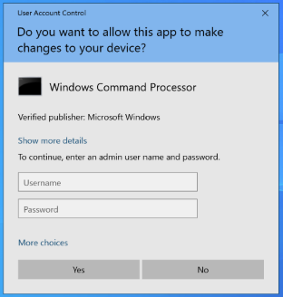

- [**Řízení uživatelských účtů (UAC, User Account Control)**](#řízení-uživatelských-účtů-uac-user-account-control)
  - [**Jak UAC funguje?**](#jak-uac-funguje)
  - [**Secure Desktop**](#secure-desktop)
  - [**Zpětná kompatibilita**](#zpětná-kompatibilita)
  - [**Uživatelské účty**](#uživatelské-účty)
    - [**Účet správce (*Administrator*)**](#účet-správce-administrator)
    - [**Běžný účet (*Standard Account*)**](#běžný-účet-standard-account)
    - [**Účet Hosta (*Guest*)**](#účet-hosta-guest)
    - [**Místní účet, účet Microsoft a doménový účet ve Windows 11**](#místní-účet-účet-microsoft-a-doménový-účet-ve-windows-11)
    - [**Windows Hello**](#windows-hello)
    - [**Administrator protection (Windows 11 24H2/25H2)**](#administrator-protection-windows-11-24h225h2)
  - [**Nastavení zásad zabezpečení**](#nastavení-zásad-zabezpečení)
    - [**Možnosti:**](#možnosti)
  - [**Zásady omezení softwaru**](#zásady-omezení-softwaru)
    - [**Zásady omezení softwaru umožňují:**](#zásady-omezení-softwaru-umožňují)
    - [**Pravidlo algoritmu hash**](#pravidlo-algoritmu-hash)
    - [**Pravidlo certifikátu**](#pravidlo-certifikátu)
    - [**Pravidlo cesty**](#pravidlo-cesty)
    - [**Pravidlo zóny Internetu**](#pravidlo-zóny-internetu)
  - [**AppLocker**](#applocker)
    - [**Výchozí pravidla**](#výchozí-pravidla)
      - [**Blokující pravidla**](#blokující-pravidla)
      - [**Pravidla pro spustitelné programy**](#pravidla-pro-spustitelné-programy)
      - [**Pravidla pro instalátory**](#pravidla-pro-instalátory)
      - [**Pravidla pro skripty**](#pravidla-pro-skripty)
      - [**DLL pravidla**](#dll-pravidla)
      - [**Pravidla pro zabalené aplikace (*Packaged app Rules*)**](#pravidla-pro-zabalené-aplikace-packaged-app-rules)
      - [**Pravidla vydavatele (*Publisher rules*)**](#pravidla-vydavatele-publisher-rules)
      - [**Pravidlo algoritmu hash a cesty**](#pravidlo-algoritmu-hash-a-cesty)
    - [**App Control for Business a Smart App Control**](#app-control-for-business-a-smart-app-control)
  - [**Správa disku**](#správa-disku)
    - [**Běžné disky a svazky**](#běžné-disky-a-svazky)
    - [**Dynamické disky a svazky**](#dynamické-disky-a-svazky)
      - [**Jednoduché svazky (*Simple Volumes*)**](#jednoduché-svazky-simple-volumes)
      - [**Rozložené svazky (*Spanned Volumes*)**](#rozložené-svazky-spanned-volumes)
      - [**Prokládané svazky (RAID-0, *Striped Volumes*)**](#prokládané-svazky-raid-0-striped-volumes)
      - [**Zrcadlené disky (RAID-1, *Mirrored Volumes*)**](#zrcadlené-disky-raid-1-mirrored-volumes)
      - [**Svazky typu RAID-5**](#svazky-typu-raid-5)
  - [**Storage spaces (Prostory úložišť)**](#storage-spaces-prostory-úložišť)
    - [**ReFS a Dev Drive**](#refs-a-dev-drive)
- [AutomatedLab](#automatedlab)
- [**Úkoly**](#úkoly)
  - [Lab 00 -- Konfigurace virtuálních stanic](#lab-00----konfigurace-virtuálních-stanic)
  - [**Lab 01 -- User Account Control**](#lab-01----user-account-control)
  - [**Lab 02 -- UAC ve Windows ala Linux**](#lab-02----uac-ve-windows-ala-linux)
  - [**Lab 03 -- Omezování aplikací pomocí Zásad omezení softwaru**](#lab-03----omezování-aplikací-pomocí-zásad-omezení-softwaru)
  - [**Lab 04 -- Omezování aplikací pomocí nástroje AppLocker**](#lab-04----omezování-aplikací-pomocí-nástroje-applocker)
  - [**Lab 05 -- Dynamické disky**](#lab-05----dynamické-disky)
  - [**Lab 06 -- Rozložený svazek (Spanned Volume)**](#lab-06----rozložený-svazek-spanned-volume)
  - [**Lab 07 -- Prokládaný svazek (Striped Volume)**](#lab-07----prokládaný-svazek-striped-volume)
  - [**Lab 08 -- Zrcadlený disk (Mirrored Volume)**](#lab-08----zrcadlený-disk-mirrored-volume)
  - [**Lab 09 -- Svazek typu RAID-5 (RAID-5)**](#lab-09----svazek-typu-raid-5-raid-5)
  - [**Lab 10 -- Storage spaces**](#lab-10----storage-spaces)
- [**Bodované úkoly**](#bodované-úkoly)


# **Řízení uživatelských účtů (UAC, User Account Control)**

UAC, neboli řízení uživatelských účtů, slouží pro rozdělení spuštěných
úloh do 2 skupin (úrovní): takové, které si vystačí s běžným
uživatelským účtem a takové, které ke svému běhu vyžadují oprávnění
správce. To umožňuje práci správce i pod běžným uživatelským účtem, a
jen v případě potřeby povýšení úlohy na správcovskou úroveň.

Tedy, jestliže máme aplikaci vyžadující správcovská práva, UAC zobrazí
výzvu k dočasnému povýšení dané úlohy do správcovské úrovně. V případě
práce pod účtem s administrátorskými právy stačí jen potvrdit tlačítko
**Ano** (*Yes*). Na druhou stranu v případě přihlášení
uživatele pod standardním účtem je se zobrazí výzva k přihlášení k účtu
s administrátorskými právy.

Toto základní chování se nazývá **Režim schválení správce** (*Admin
Approval Mode*), v tomto režimu aplikace spouštěné jako správcovské
vyžadují ke svému běhu specifické povolení.

UAC je podstatným prvkem ochrany před spouštěním nevyžádaných aplikací,
jelikož většinu práce je vykonáváno v režimu běžného uživatele a
povýšení do správcovského módu vyžaduje potvrzení uživatele.

## **Jak UAC funguje?**



Při běžné práci např. v Microsoft Word,
nebo při změnách vizuálního vzhledu se běžný uživatel nebo správce s UAC
příliš nesetká. Změna nastává v případě, kdy chcete vykonat úlohu
potřebující ke svému běhu práva správce, např. změna systémových hodin,
instalace aplikací apod. Tyto úkony Microsoft označil symbolem štítu.

Po kliknutí na symbol štítu je uživatel vyzván k potvrzení spuštění dané
úlohy v režimu správce, případně k přihlášení a získání
potřebného oprávnění ke spuštění dané úlohy. Od Windows 7 je navíc možno
ještě nastavit úroveň UAC, čímž dokážeme značně zredukovat počet hlášení
UAC.

Technicky UAC stojí na dvou přístupových tokenech[^uac-how]: při
přihlášení člena skupiny **Administrators** vytvoří Windows *standardní
token* (bez správcovských oprávnění a SID) a *správcovský token*. Plochu
(`explorer.exe`) i všechny z ní spuštěné programy dostane standardní
token; správcovský token získá proces až po potvrzení výzvy - buď
*souhlasem* (*consent prompt*, výchozí pro správce v Režimu schválení
správce), nebo *zadáním pověření* (*credential prompt*, výchozí pro
standardního uživatele, který druhý token nemá). Procesy potomků token
dědí od rodiče, proto např. `cmd` spuštěný jako správce spouští vše
další rovnou povýšené. Výzva je barevně odlišena podle vydavatele: šedé
pozadí mají součásti Windows a aplikace s ověřeným digitálním podpisem,
žluté pozadí nepodepsané nebo nedůvěryhodné aplikace. Aplikace se
správcovským tokenem spustí jen výslovně - volbou *Spustit jako správce*
(*Run as administrator*), manifestem s
`requestedExecutionLevel="requireAdministrator"`, nebo když Windows
rozpozná instalátor (zásada *Zjistit instalace aplikací a zobrazit výzvu
ke zvýšení oprávnění*).

## **Secure Desktop**

Výzvy UAC se ve výchozím nastavení zobrazují na *zabezpečené ploše*
(*secure desktop*): Windows přepne z interaktivní plochy uživatele na
oddělenou plochu, ztmaví snímek původní plochy a nad ním zobrazí výzvu;
dokud ji uživatel nepotvrdí nebo neodmítne, nelze dělat nic jiného. Na
zabezpečenou plochu mají přístup pouze procesy Windows, takže běžná
aplikace (ani malware běžící se standardním tokenem) nemůže výzvu
překrýt, odkliknout ani odečíst; od Windows Server 2019 a v aktuálních
klientských verzích do ní nelze ani vkládat ze schránky[^uac-how].
Stejný mechanismus používá přihlašovací obrazovka. Chování řídí zásada
*Řízení uživatelských účtů: Při zobrazení výzvy ke zvýšení oprávnění
přepnout na zabezpečenou plochu* (registr `PromptOnSecureDesktop`,
Lab 01, krok 10) - po jejím vypnutí se výzva zobrazí na běžné ploše a
malware ji může napodobit; u výzvy k souhlasu tím správcovský token
nezíská, u výzvy k zadání pověření ale může odchytit heslo.

## **Zpětná kompatibilita**

Ve Windows byl vytvořen systém zpětné kompatibility pro programy, které
byly naprogramovány, aby mohli zapisovat kamkoliv. Jelikož systémy
Windows od Windows Vista chrání Registry a Souborový systém, jsou pro
tyto případy důležité systémové soubory virtualizovány, což zápisy
směřované do chráněné zóny přesměruje do zóny uživatelské. Celý tento
proces je automatický a pro uživatele skrytý: zápisy do `%ProgramFiles%`,
`%Windir%` a `HKLM\Software` skončí v `%LocalAppData%\VirtualStore`,
resp. `HKCU\Software\Classes\VirtualStore`. Řídí ji zásada *Řízení
uživatelských účtů: Virtualizovat chyby zápisu do souboru a registru do
umístění jednotlivých uživatelů* (`EnableVirtualization`, výchozí
Povoleno)[^uac-settings]; netýká se 64bitových aplikací, aplikací s
manifestem `requestedExecutionLevel` ani služeb - ty při zápisu do
chráněného umístění dostanou *Access denied*.

## **Uživatelské účty**

Jak již bylo řečeno podle UAC je uživatel Windows rozdělen do 2
kategorii: Běžný uživatel a správce. Kvůli zvýšení bezpečnosti ve
výchozím nastavení všichni uživatelé (kromě vestavěného administrátora)
pracují jako běžní uživatelé a jen v případě potřeby dojde k povýšení
dané úlohy do správcovského režimu.

### **Účet správce (*Administrator*)**

Správcem se stane každý uživatel, jenž je součástí skupiny
**Administrators**. Člen skupiny **Administrators** má úplný a neomezený
přístup k příslušnému počítači nebo doméně. Avšak jen Vestavěný správce
(*Built-in Administrator*, SID končící na -500) není ve výchozím
nastavení podřízen UAC: zásada *Režim schválení správce pro integrovaný
účet správce* (`FilterAdministratorToken`) je výchozí *Zakázáno*, takže
tento účet dostává vždy plný token. Instalace Windows ho proto
**zakáže** a místo něj vytvoří první uživatelský účet, který je členem
skupiny Administrators (v labu účet **root**)[^local-accounts]. Účet
nelze smazat, jen přejmenovat nebo zakázat; v nouzovém režimu se zapne
automaticky, pokud není povolen žádný jiný správce. Místní účty
(včetně správců) přihlášené **po síti** dostávají jen standardní token
bez možnosti povýšení (`LocalAccountTokenFilterPolicy`), proto se
z jiného počítače místním účtem nedostanete na `C$` ani do vzdálené
správy - doménové účty toto omezení nemají.

### **Běžný účet (*Standard Account*)**

Běžným účtem se myslí účet náležící do skupiny **Users** a nemůže
provádět nechtěné ani úmyslné změny systému, avšak může spouštět většinu
aplikací.

### **Účet Hosta (*Guest*)**

Je jediným výchozím členem skupiny **Guests** (SID -501), má prázdné
heslo a je **ve výchozím nastavení zakázán**; protože umožňuje anonymní
přístup, Microsoft doporučuje ho nechat zakázaný[^local-accounts].
Ve Windows 10/11 ho Nastavení vůbec nenabízí - potřebujete-li účet pro
návštěvy, založte běžný místní účet s jiným jménem a přidejte ho pouze
do skupiny Guests. Kromě těchto účtů systém vytváří i skryté účty
**DefaultAccount** (DSMA, -503), **WDAGUtilityAccount** (-504,
Application Guard) a ve Windows 11 **WSIAccount** (-1001, webové
přihlášení ze zamykací obrazovky) - v `lusrmgr.msc` je uvidíte
zakázané, nemažte je.

### **Místní účet, účet Microsoft a doménový účet ve Windows 11**

Nezávisle na rozdělení správce/běžný uživatel se účty liší tím, **kdo
ověřuje identitu**:

-   **Místní účet** (*local account*) existuje jen v databázi SAM daného
    počítače, k přihlášení nepotřebuje internet a nic nesynchronizuje
    (v labu všechny účty na **W11-1**: root, homer, bart...).

-   **Účet Microsoft** (MSA) je osobní cloudová identita (e-mail
    Outlook.com, Xbox, OneDrive...); Windows s ním synchronizuje
    nastavení a hesla a ukládá k němu obnovovací klíč BitLockeru.
    Microsoft ho pro přihlašování do Windows doporučuje a od Windows 11
    24H2 ho v edicích Home a Pro při instalaci (OOBE) **vyžaduje** spolu
    s připojením k internetu: skript `oobe\bypassnro` zmizel v březnu
    2025 (Insider build 26200.5516) a v říjnu 2025 Microsoft odstranil i
    zbývající známé cesty k místnímu účtu v OOBE (build
    26220.6772)[^msa-local][^insider-oobe]. Místní účet lze přidat až po
    instalaci (Nastavení \\ Účty \\ Další uživatelé) a mezi oběma typy
    lze přepínat: Nastavení \\ Účty \\ Vaše informace \\ *Přihlásit se
    raději místním účtem* (*Sign in with a local account instead*), resp.
    *Přihlásit se raději účtem Microsoft*. Edice Education a Enterprise
    nabízejí v OOBE cestu *Pro práci nebo školu* s připojením do domény
    nebo místním účtem a instalace odpovědním souborem (E02, E04) OOBE
    přeskočí úplně - proto všechny lab VM vytváří AutomatedLab s místním
    účtem root.

-   **Doménový účet** (Active Directory - **testing\\root**, **testing\\Bart**
    na **W11-domain** v Lab 04) nebo účet **Microsoft Entra ID** (dříve
    Azure AD, stanice *Entra joined*) ověřuje řadič domény, resp. cloud;
    kdo je na stanici členem místní skupiny Administrators, řídí správce
    domény (výchozí: Domain Admins). UAC se k doménovému správci chová
    stejně jako k místnímu - dostane dva tokeny a výzvu.

### **Windows Hello**

**Windows Hello** nahrazuje heslo při přihlášení gestem: PIN, otisk prstu
nebo rozpoznání obličeje (infračervená kamera); nastavuje se v Nastavení
\\ Účty \\ Možnosti přihlášení (*Settings \\ Accounts \\ Sign-in
options*). PIN je vázán na konkrétní zařízení a nikdy ho neopouští - u
účtu Microsoft a Entra ID odemyká asymetrický klíč chráněný čipem TPM,
takže ho nelze ukrást ze serveru ani vylákat phishingem. U **místního
účtu** Windows Hello funguje také, ale jen jako pohodlnější náhrada hesla
bez klíčové dvojice, tedy bez tohoto bezpečnostního přínosu. Firemní
varianta **Windows Hello for Business** (Pro, Enterprise, Education)
přidává ověření vůči Entra ID / Active Directory, certifikáty a
podmíněný přístup[^hello]. Lab VM mají vTPM, PIN si tedy můžete
vyzkoušet; AutomatedLab nastavuje jen heslo.

### **Administrator protection (Windows 11 24H2/25H2)**

**Administrator protection** je nová vrstva nad UAC, kterou Microsoft
dodal do Windows 11 24H2 a 25H2 aktualizací **KB5120998** (srpen 2026;
předtím od podzimu 2024 jen v Insider Preview). Je **ve výchozím
nastavení vypnutá** a podporují ji edice Home, Pro, Enterprise i
Education[^admin-prot]. Řeší slabinu Režimu schválení správce: správce
má oba tokeny stále připravené v jedné relaci a malware, který ho
přesvědčí kliknout na *Ano*, získá správcovská práva v jeho profilu. Po
zapnutí:

-   správce se přihlašuje jen se standardním tokenem; při každém povýšení
    Windows vyžaduje ověření **Windows Hello** (PIN/biometrie) nebo heslo,
    žádné automatické povýšení (*auto-elevation*) neexistuje,

-   správcovský token vytvoří skrytý, systémem spravovaný účet (*System
    Managed Administrator Account*) s **odděleným profilem**; token
    dostane jen daný proces a po jeho skončení zaniká (*just-in-time*),

-   povýšený proces proto nevidí data uživatelského profilu (mapované
    síťové jednotky, přihlášení SSO, nastavení aplikací), což některé
    instalátory a naplánované úlohy "s nejvyššími oprávněními" rozbije.

Zapíná se zásadou *User Account Control: Configure type of Admin Approval
Mode* = *Admin Approval Mode with Administrator protection* ve stejné
větvi zásad jako ostatní nastavení UAC (níže), chování výzvy určuje
*Behavior of the elevation prompt for administrators running with
Administrator protection*; ve správě přes Intune CSP
`UserAccountControl_TypeOfAdminApprovalMode`, pro domácí uživatele
přepínačem v aplikaci Zabezpečení Windows \\ Ochrana účtu (zatím Insider
Preview). Změna vyžaduje restart. Microsoft ji **nedoporučuje** na
stanicích s Hyper-V nebo WSL, na Windows 365 / Azure Virtual Desktop a
zatím ji nenabízí pro Windows Server[^admin-prot] - na hostiteli C304
ji proto nezapínejte. Lab VM jsou instalované z obrazu 24H2 z roku 2024
bez této aktualizace a nemají internet, zásada se v nich tedy nenabízí.

## **Nastavení zásad zabezpečení**

Často bylo zmíněno, jak fungují dané vlastnosti Windows ve výchozím
nastavení a nyní se podíváme na podrobnější nastavení a jejich změny v
konzole Editor místních zásad skupiny (*Local Group Policy Editor*).
Tuto konzoli spustíme přes nabídku Start zapsáním **gpedit.msc** (stejná
nastavení nabízí i konzole Místní zásady zabezpečení, *Local Security
Policy*, **secpol.msc**; v edici Home není k dispozici ani jedna).
Rozbalíme nabídku Konfigurace počítače (*Computer Configuration*) -\>
Nastavení systému Windows (*Windows Settings*) -\> Nastavení zabezpečení
(*Security Settings*) -\> Místní zásady (*Local Policies*) -\> Možnosti
zabezpečení (*Security Options*).

Zde se nachází následující podrobné nastavení pro UAC:

-   **Řízení uživatelských účtů: Chování výzvy ke zvýšení oprávnění pro správce v Režimu schválení správce** -- Toto nastavení zásad řídí
    chování výzvy ke zvýšení oprávnění pro správce. Oproti Windows Vista
    byla od Windows 7 tato možnost značně rozšířena a umožňuje
    podrobnější nastavení.

### **Možnosti:**

-   **Zvýšit bez zobrazení výzvy** (*Elevate without prompting*,
    `ConsentPromptBehaviorAdmin` = 0)**:** Umožňuje privilegovaným účtům
    provést operaci vyžadující zvýšení oprávnění bez zadání souhlasu
    nebo pověření[^1].

-   **Vyzvat k zadání pověření na zabezpečené ploše** (*Prompt for
    credentials on the secure desktop*, 1)**:** Pokud operace
    vyžaduje zvýšení oprávnění, zobrazí na zabezpečené ploše výzvu pro
    uživatele k zadání jména a hesla privilegovaného uživatele.
    Zadá-li uživatel platná pověření, bude operace pokračovat
    s nejvyššími oprávněními uživatele.

-   **Vyzvat k zadání souhlasu na zabezpečené ploše** (*Prompt for
    consent on the secure desktop*, 2)**:** Pokud operace
    vyžaduje zvýšení oprávnění, zobrazí na zabezpečené ploše výzvu pro
    uživatele k výběru možnosti **Povolit** nebo **Zakázat**.
    Vybere-li uživatel možnost **Povolit**, bude operace pokračovat s
    nejvyššími možnými oprávněními daného uživatele.

-   **Vyzvat k zadání pověření** (*Prompt for credentials*, 3)**:**
    Pokud operace vyžaduje zvýšení
    oprávnění, zobrazí výzvu pro uživatele k zadání uživatelského
    jména a hesla pro správu. Zadá-li uživatel platná pověření, bude
    operace pokračovat s příslušnými oprávněními.

-   **Vyzvat k zadání souhlasu** (*Prompt for consent*, 4)**:** Pokud
    operace vyžaduje zvýšení
    oprávnění, zobrazí výzvu pro uživatele k výběru možnosti
    **Povolit** nebo **Zakázat**. Vybere-li uživatel možnost
    **Povolit**, bude operace pokračovat s nejvyššími možnými
    oprávněními daného uživatele.

-   **Vyzvat k zadání souhlasu pro binární soubory nepocházející z Windows**
    (*Prompt for consent for non-Windows binaries*, 5)**:**
    (Výchozí; tuto hodnotu nastavuje i skript Lab 00 pomocí
    `Set-LabVMUacStatus`) Pokud operace jiné aplikace než společnosti
    Microsoft vyžaduje zvýšení oprávnění, zobrazí na zabezpečené ploše
    výzvu pro uživatele k výběru možnosti Povolit nebo Zakázat.
    Vybere-li uživatel možnost Povolit, bude operace pokračovat s
    nejvyššími možnými oprávněními daného uživatele.

UAC je možno také nastavit přes Ovládací panely \\ Uživatelské účty \\
Změnit nastavení nástroje Řízení uživatelských účtů (*Control Panel \\
User Accounts \\ Change User Account Control settings*, přímo příkazem
`UserAccountControlSettings.exe`; Centrum akcí, kde dialog býval, ve
Windows 11 neexistuje). Posuvník mění hodnoty **ConsentPromptBehaviorAdmin**
a **PromptOnSecureDesktop** v klíči registru
`HKLM\\SOFTWARE\\Microsoft\\Windows\\CurrentVersion\\Policies\\System`
(přehled všech zásad UAC s výchozími hodnotami, názvy CSP pro Intune a
hodnotami registru udržuje Microsoft v jedné tabulce[^uac-settings]).
Zde je možno nastavit 4 úrovně UAC (v závorce hodnoty
ConsentPromptBehaviorAdmin / PromptOnSecureDesktop):

1.  **Vždy mne upozornit v těchto případech** (2 / 1)**:**

    a.  Pokud se programy pokusí nainstalovat software nebo provést
          změny v počítači.

    b.  Pokud provedu změnu v nastavení Windows.

2.  **Pouze pokud se programy pokusí provést změny v počítači**
      (výchozí; 5 / 1)

    a.  Neupozorňovat, pokud změním nastavení systému Windows.

3.  **Pouze pokud se programy pokusí provést změny v počítači (nestmívat
      plochu)** (5 / 0)

    a.  Neupozorňovat, pokud změním nastavení systému Windows.

4.  **Nikdy mne neupozorňovat v těchto případech** (0 / 0; UAC zůstává
      zapnuté - `EnableLUA` = 1 - jen správci nedostávají výzvu; skutečné
      vypnutí UAC, které dělá AutomatedLab při instalaci VM, je až
      `EnableLUA` = 0 a vyžaduje restart)**:**

    a.  Pokud se programy pokusí nainstalovat software nebo provést
          změny v počítači.

    b.  Pokud provedu změny v nastavení systému Windows.

-   **Řízení uživatelských účtů: Chování výzvy ke zvýšení oprávnění pro standardní uživatele** (*Behavior of the elevation prompt for
    standard users*, `ConsentPromptBehaviorUser`) -- Tato zásada nastavuje, zda se má běžnému
    uživateli zobrazit výzva nebo zda má být automaticky *zamítnuta*:
    **Vyzvat k zadání pověření** (*Prompt for credentials*, 3, výchozí;
    Lab 01, krok 4), **Vyzvat k zadání pověření na zabezpečené ploše**
    (1) a **Automaticky zamítnout žádosti o zvýšení oprávnění**
    (*Automatically deny elevation requests*, 0; Lab 01, krok 13 -
    uživatel dostane jen chybu o odepřeném přístupu, běžné ve firmách,
    kde nikdo nemá pracovat jako správce)[^uac-settings].

-   **Řízení uživatelských účtů: Povolit aplikacím UIAccess zobrazit výzvu ke zvýšení oprávnění bez použití zabezpečené plochy --** Toto
    nastavení určuje, zda mohou aplikace UIAccess (*User Interface
    Accessibility* neboli UIA) automaticky zakázat u zabezpečené plochy
    výzvy ke zvýšení oprávnění používané standardním uživatelem.

-   **Řízení uživatelských účtů: Při zobrazení výzvy ke zvýšení oprávnění přepnout na zabezpečenou plochu --** toto nastavení vypne
    zabezpečenou plochu.

-   **Řízení uživatelských účtů: Režim schválení správce pro integrovaný účet správce** -- Toto nastavení určuje, zda se budou vestavěnému
    účtu správce zobrazovat výzvy UAC.

-   **Řízení uživatelských účtů: Spustit všechny správce v Režimu schválení správce** -- Toto nastavení zabezpečení určuje chování
    všech zásad UAC pro celý systém.

-   **Řízení uživatelských účtů: Virtualizovat chyby zápisu do souboru a registru do umístění jednotlivých uživatelů** -- Toto nastavení
    zabezpečení umožňuje přesměrování zastaralých chyb zápisu aplikací
    do definovaných umístění v registru i v systému souborů. Tato funkce
    zabraňuje spuštění aplikací, které byly v minulosti spuštěny v
    režimu správce a zapsaly data spuštění aplikace do adresářů
    **%ProgramFiles%**, **%Windir%**, **%Windir%\\system32** nebo
    **HKLM\\Software**.

-   **Řízení uživatelských účtů: Zjistit instalace aplikací a zobrazit výzvu ke zvýšení oprávnění** -- Toto nastavení zabezpečení určuje
    chování zjišťování instalací aplikací v celém systému, tedy zda se
    má zobrazit výzva při instalaci aplikací.

-   **Řízení uživatelských účtů: Zvýšit oprávnění pouze u aplikací UIAccess, které jsou nainstalovány v zabezpečených umístěních** --
    Toto nastavení zabezpečení vynutí požadavek, že aplikace vyžadující
    spuštění s úrovní integrity **UIAccess** (označením parametru
    **UIAccess=true** v manifestu aplikace) musí být v systému souborů
    uloženy v zabezpečeném umístění.

-   **Řízení uživatelských účtů: Zvýšit oprávnění pouze u podepsaných a ověřených spustitelných souborů** -- Toto nastavení zabezpečení
    vynutí kontrolu podpisu PKI (*Public Key Infrastructure*) u všech
    interaktivních aplikací vyžadujících zvýšení oprávnění.

## **Zásady omezení softwaru**

> :warning: **Zastaralá technologie.** Zásady omezení softwaru (*Software
> Restriction Policies*, SRP; Windows XP / Server 2003) Microsoft označil
> za zastaralé (*deprecated*) od **Windows 10 verze 1803** (2018) a
> **Windows Server 2019**; v seznamu zastaralých funkcí Windows je vede
> dodnes a jako náhradu uvádí **AppLocker** a **App Control for Business**
> (dříve Windows Defender Application Control, WDAC)[^deprecated][^srp].
> Zastaralé neznamená odstraněné: uzel *Zásady omezení softwaru* v
> `gpedit.msc`/`secpol.msc` na Windows 11 25H2 i Windows Server 2022
> zůstává a pravidla lze vytvořit, ale na čisté instalaci Windows 11 22H2
> a novější se **nevynucují** (ověřeno v C304, 9/2026, Lab 03; Microsoft
> tento stav nedokumentuje, jde o pozorování správců). Kapitolu čtěte
> jako kontext pro AppLocker, který stejné typy pravidel převzal a rozšířil.

Zásady omezení softwaru řeší nutnost regulovat spouštění neznámého a
nedůvěryhodného softwaru. S rostoucím využitím sítí, Internetu a e-mailu
pro obchodní účely se uživatelé setkávají s novým softwarem v mnoha
různých podobách. Uživatelé se musí neustále rozhodovat, zda mohou
neznámý software spustit. Viry a trojské koně se často snaží uživatele
záměrně obelstít, aby došlo k jejich spuštění. Pro uživatele je obtížné
se správně rozhodnout, který software mohou spustit, aniž by došlo k
ohrožení zabezpečení systému.

Pomocí zásad omezení softwaru je možné identifikovat a určit software,
který je možné v počítači spustit, a ochránit tak pracovní prostředí
před nedůvěryhodným softwarem. Pro objekt zásad skupiny (GPO) je možné
definovat výchozí úroveň zabezpečení **Bez omezení** nebo
**Nepovoleno**, tak aby bylo spuštění softwaru při výchozím nastavení
povoleno nebo zakázáno. Vytvořením pravidel zásad omezení softwaru lze
pro určitý software určit výjimky z této výchozí úrovně zabezpečení.
Pokud je například výchozí úroveň zabezpečení nastavena na hodnotu
**Nepovoleno**, můžete vytvořit pravidla, která povolují spuštění
určitého softwaru. Existují tyto typy pravidel:

-   **Pravidla algoritmu hash**

-   **Pravidla certifikátu**

-   **Pravidla cesty (včetně pravidel cesty registru)**

-   **Pravidla zóny Internetu**

Zásady omezení softwaru jsou tvořeny výchozí úrovní zabezpečení a všemi
pravidly platícími pro objekt zásad skupiny. Zásady omezení softwaru se
mohou vztahovat na celou doménu, na místní počítače nebo na jednotlivé
uživatele. Zásady omezení softwaru umožňují identifikaci softwaru mnoha
způsoby. Díky infrastruktuře založené na zásadách lze rozhodnout, zda
může být identifikovaný software spuštěn. Pokud jsou používány zásady
omezení softwaru, musí uživatelé při spouštění softwarových programů
dodržovat pravidla vytvořená správci.

### **Zásady omezení softwaru umožňují:**

-   Řídit možnosti spouštění softwaru v systému. Pokud máte například
    obavy, že by uživatelé mohli přijmout pomocí e-mailu viry, můžete
    použít nastavení zásad, které nedovolí spuštění určitých typů
    souborů z adresáře příloh e-mailů používaného e-mailového programu.

-   Povolit uživatelům, kteří se střídají při práci na jednom počítači,
    spouštět pouze určité soubory. Pokud počítače používá více
    uživatelů, můžete například nastavit takové zásady omezení softwaru,
    které zajistí, aby uživatelé neměli přístup k jinému softwaru, než
    který potřebují k práci.

-   Určit, kdo může do počítače přidávat důvěryhodné vydavatele.

-   Řídit, zda se budou zásady omezení softwaru vztahovat na všechny
    uživatele nebo jen na některé uživatele počítače.

-   Zabránit spuštění jakýchkoli souborů v místním počítači, organizační
    jednotce, síti nebo doméně. Pokud je například ve vašem systému
    známý virus, můžete pomocí zásad omezení softwaru zabránit otevření
    souboru, který daný virus obsahuje.

### **Pravidlo algoritmu hash**

Hodnota hash je série bajtů s pevně definovanou délkou, která jedinečným
způsobem identifikuje softwarový program či soubor. Výpočet této hodnoty
provádí algoritmus hash. Při vytvoření pravidla algoritmu hash pro
softwarový program vypočítá modul **Zásady omezení softwaru** hodnotu
hash daného programu. Pokusí-li se uživatel spustit softwarový program,
je algoritmus hash programu porovnán s existujícími pravidly algoritmu
hash pro zásady omezení softwaru. Algoritmus hash daného softwarového
programu je vždy stejný bez ohledu na umístění programu v počítači.
Pokud je však softwarový program jakkoli pozměněn, změní se i jeho
algoritmus hash a přestane se shodovat s algoritmem hash v pravidle pro
tento algoritmus vztahujícím se k **Zásadám omezení softwaru**.

Chcete-li například zabránit uživatelům ve spuštění určitého souboru,
můžete vytvořit pravidlo algoritmu hash a nastavit úroveň zabezpečení na
hodnotu **Nepovoleno**. Soubor lze přejmenovat nebo přemístit do jiné
složky, a přesto se jeho číslo hash nezmění. Pokud se však samotný
soubor jakkoli změní, změní se i jeho algoritmus hash a může dojít k
porušení omezení.

### **Pravidlo certifikátu**

**Zásady omezení softwaru** umožňují identifikovat software také podle
jeho podpisového certifikátu. Můžete vytvořit pravidlo certifikátu,
které slouží k identifikaci softwaru a k povolení nebo zákazu spuštění
softwaru (v závislosti na úrovni zabezpečení). Například můžete použít
pravidla certifikátu, která umožňují automatické spuštění softwaru
pocházejícího z důvěryhodného zdroje bez zobrazení výzvy k potvrzení
této akce uživatelem. Pravidla certifikátu také můžete použít pro
spuštění souborů v zakázaných oblastech operačního systému.

Ve výchozím nastavení nejsou pravidla certifikátu povolena.

### **Pravidlo cesty**

Pravidlo cesty identifikuje software podle cesty k souboru. Pokud je
například výchozí úroveň zabezpečení počítače nastavena na hodnotu
**Nepovoleno**, můžete přesto jednotlivým uživatelům poskytnout
neomezený přístup ke konkrétním složkám. Můžete také vytvořit pravidlo
cesty tak, že použijete cestu k souboru a nastavíte úroveň zabezpečení
tohoto pravidla na hodnotu **Bez omezení**. Jako obecné cesty lze pro
tento typ pravidla použít proměnné prostředí **%userprofile%,**
**%windir%**, **%appdata%,** **%programfiles%** a **%temp%**. Kromě toho
můžete vytvářet pravidla cesty registru. U těchto pravidel je jako cesta
použit klíč registru příslušného softwaru.

Tato pravidla jsou určena cestami. Pokud se změní umístění softwarového
programu, nebude příslušné pravidlo cesty nadále funkční.

### **Pravidlo zóny Internetu**

Pravidla zón mají vliv pouze na balíčky Instalační služby systému
Windows. Pravidlo zóny může identifikovat software ze zóny, kterou dodnes
definuje dialog **Vlastnosti internetu** (*Internet Properties*,
`inetcpl.cpl`), i když Internet Explorer byl vyřazen (2022, zbývá režim
IE v Edge). Jedná se o tyto zóny: **Internet**, **Místní intranet**,
**Servery s omezeným přístupem**, **Důvěryhodné servery** a **Místní
počítač**.

## **AppLocker**

**AppLocker** je funkce systému představená ve Windows 7 a Windows
Server 2008 R2. Původně byla dostupná pouze v edicích **Enterprise** a
**Education** (ve Windows 7 i Ultimate): zásady nasazené přes Group
Policy vynucovaly jen edice Enterprise/Education a Windows Server, přes
MDM (Intune) všechny edice. Od aktualizace **KB5024351** (2023) vynucují
zásady AppLockeru **všechny edice** Windows 10 2004+ a Windows 11, tedy i
**Pro**; Windows Server je vynucuje od 2012 R2 (ne na Server
Core)[^applocker-req]. Microsoft AppLocker označuje za „obranu do
hloubky" (*defense in depth*), nikoli za bezpečnostní funkci ve smyslu
kritérií MSRC; dostává už jen bezpečnostní opravy, žádné nové funkce, a
pro robustní ochranu Microsoft doporučuje **App Control for Business**
(dříve WDAC, viz níže)[^applocker]. Zásady jsou koncepčně podobné
**Zásadám omezení softwaru**,
nicméně mají několik výhod jako možnost uplatnění pouze na vybrané
uživatele nebo skupiny a taky možnost uplatnění zásad na všechny budoucí
verze daného SW produktu. V textu výše jste se dozvěděli, že pravidla
algoritmu hash se vážou k dané verzi programu a musejí být znovu
obnovena, kdykoli se program aktualizuje. Zásady **AppLockeru** se
nachází v části **Computer Configuration \\ Windows Settings \\
Security Settings \\ Application Control Policies** zásad skupiny
(lokálně `secpol.msc`/`gpedit.msc`; v doménovém GPO v Group Policy
Management Editoru je mezi Computer Configuration a Windows Settings
navíc uzel **Policies** - Lab 04). Pravidla lze číst a nasazovat i
z PowerShellu (modul AppLocker: `Get-AppLockerPolicy -Effective -Xml`,
`Set-AppLockerPolicy`, `Test-AppLockerPolicy`).

**AppLocker** závisí na službě **Identita aplikace** (*Application
Identity*, `appidsvc`). Ta po instalaci systému Windows není ve výchozím
nastavení spuštěna, je nastavena na ruční spouštění a je tedy potřeba
nastavit automatické spouštění. Jinak by nastavení, která provedete,
neměla efekt. Služba je chráněná: v konzoli `services.msc` nelze typ
spouštění změnit, nastavuje se zásadou skupiny *Systémové služby*
(Lab 04) nebo z příkazového řádku správce (`sc.exe config appidsvc
start= auto`, spuštění `sc.exe start appidsvc`); typ spouštění nastavený
zásadou se projeví až po restartu stanice. Po dobu testování je
doporučeno ponechat ruční spouštění - pokud byste nastavili nesprávné
hodnoty, mohli byste si kompletně uzamknout celý operační systém.

### **Výchozí pravidla**

Výchozí pravidla je množina základních povolujících pravidel, která
umožňují spouštění základních aplikací Windows. Jsou velmi důležitá,
jelikož **AppLocker** má zabudované výchozí pravidlo blokovat všechny
aplikace, které nejsou explicitně povoleny, tzn. po zapnutí
**AppLockeru** nebudete schopni spouštět žádné aplikace, skripty nebo
instalátory, pro které neexistuje žádné povolovací pravidlo. Existují
různá výchozí pravidla pro různé typy pravidel. Výchozí pravidla jsou
všeobecná pro a mohou být administrátory upravena pro jejich prostředí.
Například výchozí pravidlo pro .**exe** soubory je pravidlo cesty.
Administrátoři by s ohledem na bezpečnost mohli změnit toto chování na
přísnější pravidlo, např. hash.

#### **Blokující pravidla**

Pravidla v **AppLockeru** mohou být buď povolující, nebo odepírající.
Explicitní pravidlo **Odepřít** přepíše jakékoli povolující pravidlo,
jakkoli by toto pravidlo bylo definováno. Toto je jiné chování než to u
**Zásad omezení softwaru**, kde se pravidla mohou přepisovat. Výchozí
blokující pravidlo zmíněné výše nezakazuje všechny aplikace, pouze ty,
které nemají povolující pravidlo. Musíte tedy přidat blokující pravidlo
pouze tehdy, pokud již existuje povolující pravidlo pro danou aplikaci.
Pokud byste například chtěli povolit všem uživatelům spouštět
**Alpha.exe** kromě skupiny **Účetní**, vytvořili byste dvě pravidla.
Jedno povolující skupině **Everyone** a druhé blokující pro skupinu
**Účetní**.

#### **Pravidla pro spustitelné programy**

Tato pravidla se uplatňují na soubory s koncovkami **.exe** a **.com**.
Politiky AppLockeru se primárně soustředí na tato pravidla. Výchozím
pravidlem je pravidlo cesty. Ve výchozím nastavení je možno spouštět
všechny aplikace v adresářích **Windows**, **Program Files**,
administrátoři mohou spouštět všechny programy. Je důležité použít
výchozí pravidla nebo taková pravidla, která jsou podobná, aby mohl
operační systém správně fungovat.

#### **Pravidla pro instalátory**

Tato pravidla se uplatňují na soubory s koncovkami **.msi** a **.msp**,
můžete je tedy využít pro povolení nebo zakázání instalování programů.
Ve výchozím nastavení je umožněno skupině **Everyone** spouštět
digitálně podepsané balíčky, všechny instalátory v adresáři
**%Windir%\\Installer**. Administrátoři mohou instalovat cokoli. Dále je
povolena instalace programů pomocí GPO. Mějte však na paměti, že
přestože skupina **Everyone** má možnost spouštět instalátory, přesto
potřebuje odpovídající úroveň administrativních oprávnění k provedení
instalace.

#### **Pravidla pro skripty**

Uplatňují se na soubory s koncovkami **.ps1**, **.bat**, **.cmd**,
**.vbs** a **.js**. Ve výchozím nastavení je možno spouštět všechny
skripty v adresářích **Program Files** a **%Windir%**. Dále je umožněno
administrátorům spouštět skripty uložené kdekoli.

#### **DLL pravidla**

Uplatňují se na soubory s koncovkami **.dll** a **.ocx**. Nejsou při
povolení **AppLockeru** aktivní. Jejich využíváním dochází k určitému
výkonnostnímu propadu.

#### **Pravidla pro zabalené aplikace (*Packaged app Rules*)**

Zabalené aplikace (MSIX, dříve UWP / .appx) z Microsoft Store, `winget`
nebo sideloadingu mají vlastní kolekci pravidel - kolekce **Pravidla
spouštění** (*Executable Rules*) se na ně nevztahuje. Lze pro ně
definovat pouze pravidla vydavatele (název vydavatele, název balíčku,
verze balíčku), pravidlo omezuje běh i instalaci celé aplikace a výchozí
pravidlo povoluje všechny podepsané balíčky. Ve Windows 11 to platí i pro
řadu vestavěných aplikací: **Poznámkový blok**, **Kalkulačka** nebo
**Malování** spuštěné z nabídky Start jsou zabalené aplikace ze Store;
soubor `C:\\Windows\\System32\\notepad.exe` je jen malý zaváděcí program
(*stub*), který aplikaci ze Store spustí - a právě ten kontroluje kolekce
Pravidla spouštění (Lab 04). Události zabalených aplikací se zapisují do
protokolu *Packaged app-Execution*, ne *EXE and DLL*.

#### **Pravidla vydavatele (*Publisher rules*)**

Tato pravidla fungují na základě podepisování certifikátem, který byl
použit vydavatelem souboru. Na rozdíl od pravidla certifikátu u Zásad
omezování softwaru zde nemusíte získat certifikát vydavatele, údaje
budou načteny z referenční aplikace. Toto pravidlo nemůžete použít na
soubory, které nejsou podepsány. Tato pravidla nabízejí velkou
flexibilitu do budoucna, jednou povolíte daného vydavatele a i všechny
budoucí verze programu budete moci použít. Nicméně můžete upravit
pravidlo tak, aby povolovalo pouze určitou verzi produktu nebo vybraný
produkt ne všechny produkty vydavatele.

#### **Pravidlo algoritmu hash a cesty**

Tato pravidla fungují stejně jako u **Zásad omezení softwaru**.

### **App Control for Business a Smart App Control**

**App Control for Business** (dříve *Windows Defender Application
Control*, WDAC; původně součást Device Guard pod názvem *configurable
code integrity*) je nástupce AppLockeru navržený od začátku jako
bezpečnostní funkce podle kritérií MSRC: zásada platí pro celý počítač
(ne pro uživatele), vynucuje ji integrita kódu v jádře a kromě
spustitelných souborů, skriptů a MSI pokrývá i ovladače a přepíná
PowerShell do režimu *Constrained Language*. Pravidla se opírají o
podpisový certifikát, atributy podepsaných metadat (název, verze), hash,
cestu (od Windows 10 1903), reputaci z cloudové služby **Intelligent
Security Graph** (ISG) a o *spravovaný instalátor* (*managed installer*,
např. Intune) - sledování spravovaného instalátoru a ISG přitom interně
stále používá AppLocker. Zásady jsou XML soubory kompilované do binárních
`.cip`; nasazují se přes Intune/MDM, PowerShell nebo `CiTool.exe`, Group
Policy zvládne jen starý jednozásadový formát (Server 2016/2019).
Dostupné jsou ve všech edicích Windows 10/11 (Pro, Enterprise,
Education) a Windows Server 2016+[^appcontrol]. Kdy co použít podle
Microsoftu[^appcontrol-vs]: App Control vždy, když to jde; AppLocker
tam, kde potřebujete **různá pravidla pro různé uživatele či skupiny**
na sdíleném počítači (přesně případ Bodovaného úkolu 1) nebo společnou
zásadu i pro starší Windows - ideálně jako doplněk vynucené zásady App
Control.

**Smart App Control** (Windows 11 22H2 a novější, 2022) je spotřebitelská
varianta téže technologie: bez konfigurace blokuje nepodepsaný kód,
o kterém ISG nedokáže s jistotou říci, že je bezpečný. Po čisté instalaci
běží v *režimu vyhodnocování* (*evaluation*) a sám rozhodne, zda se
zapne, nebo vypne (na firemně spravovaných stanicích se do 48 hodin
vypne); stav je v aplikaci Zabezpečení Windows \\ Řízení aplikací a
prohlížeče (*App & browser control*) a v registru
`HKLM\\SYSTEM\\CurrentControlSet\\Control\\CI\\Policy\\VerifiedAndReputablePolicyState`
(0 vypnuto, 1 vynucení, 2 vyhodnocování). Původně platilo, že jednou
vypnutý Smart App Control se zapne jen přeinstalací systému; podle
aktuální dokumentace ho novější aktualizace umožňují zapnout znovu bez
čisté instalace[^sac]. Jeho zásada
`%windir%\\schemas\\CodeIntegrity\\ExamplePolicies\\SmartAppControl.xml`
je Microsoftem doporučený výchozí bod pro vlastní zásadu App
Control[^appcontrol]. Ve VM labu (instalace bez internetu) si jeho stav
můžete ověřit v Zabezpečení Windows; AppLocker z Lab 04 na něm nezávisí.

## **Správa disku**

### **Běžné disky a svazky**

Běžný disk je fyzický disk, který obsahuje primární oddíly, rozšířené
oddíly nebo logické jednotky. Oddíly a logické jednotky na běžných
discích se nazývají běžné svazky. Běžné svazky lze vytvářet pouze na
běžných discích.

Počet oddílů, které lze na běžných discích vytvořit, závisí na typu
oddílu na disku:

-   Na discích s hlavním spouštěcím záznamem (MBR) můžete vytvořit
    maximálně čtyři primární oddíly, nebo tři primární oddíly a jeden
    rozšířený oddíl. V rámci rozšířeného oddílu lze vytvořit neomezený
    počet logických jednotek.

-   Na discích s tabulkou oddílu GUID (GPT) můžete vytvořit až 128
    primárních oddílů. Protože disky typu GPT nejsou omezeny na čtyři
    oddíly, není třeba vytvářet rozšířené oddíly ani logické jednotky.

K existujícím primárním oddílům a logickým jednotkám lze přidat více
místa jejich rozšířením do sousedícího souvislého volného místa na
stejném disku. Chcete-li rozšířit běžný svazek, musí být tento svazek
formátován pomocí systému souborů NTFS. Logickou jednotku můžete
rozšířit v rámci souvislého volného místa v rozšířeném oddílu, jehož je
tato jednotka součástí. V případě, že logickou jednotku rozšíříte více,
než představuje volné místo v rozšířeném oddílu, zvětší se tento
rozšířený oddíl tak, aby mohl logickou jednotku obsáhnout, pokud za ním
následuje dostatek souvislého volného místa.

### **Dynamické disky a svazky**

Microsoft označil dynamické disky za **zastaralé** (*deprecated*): v
seznamu zastaralých funkcí Windows jsou od **Windows 10 verze 2004**
(2020) s tím, že „funkce se dále nevyvíjí a v budoucí verzi ji plně
nahradí Prostory úložišť", a dokumentace Win32 dodává, že jsou zastaralé
„pro všechna použití kromě zrcadleného spouštěcího svazku" (zrcadlení
systémového disku); pro data, která mají přežít výpadek disku, doporučuje
**Prostory úložišť** (viz níže a Lab 10)[^deprecated][^dyn-disks]. Ve
Windows 11 25H2 i Windows Server 2022 zůstávají dostupné - Správa disků
(`diskmgmt.msc`) je umí zobrazit a spravovat, položka *Převést na
dynamický disk...* v její kontextové nabídce ale může být nedostupná
(šedá); převod pak provedete v `diskpart` příkazem `convert dynamic`
(ověřeno v C304, 9/2026, Lab 05). Dynamické disky spravuje **Logical
Disk Manager** (LDM): databázi svazků drží v posledním 1 MB disku (MBR),
resp. ve skryté 1 MB partition (GPT), replikovanou na všech dynamických
discích počítače - proto převod vyžaduje alespoň 1 MB volného místa na
konci disku a proto disk odpojený z jiného počítače hlásí stav *Cizí*
(*Foreign*, Lab 08). Na systém lze mít až 2 000 dynamických svazků
(doporučeno nejvýše 32). Dynamické disky nejsou podporované na
výměnných a USB/IEEE 1394 discích, na dynamických discích nefungují
Prostory úložišť ani Dev Drive a zpět na základní disk lze převést jen
prázdný disk (všechny svazky musí být smazány)[^dyn-disks][^dyn-disks-2003].

Dynamické disky nabízejí funkce, které u běžných disků nejsou k
dispozici, například možnost vytvářet svazky uložené na více discích
(rozložené a prokládané svazky) a možnost vytvářet svazky odolné proti
chybám (zrcadlené svazky a svazky typu RAID-5). Všechny svazky na
dynamických discích se nazývají dynamické svazky. Existuje pět typů
dynamických svazků:

-   Jednoduché (*simple*)

-   Rozložené (*spanned*)

-   Prokládané (*striped*)

-   Zrcadlené (*mirrored*)

-   Svazky typu RAID-5

#### **Jednoduché svazky (*Simple Volumes*)**

Jednoduché svazky mohou obsahovat oddíly běžného disku a jednoduché
svazky dynamických svazků. Pokud nepotřebujete žádnou další
funkcionalitu z jiných typů dynamických disků, Microsoft doporučuje
používat běžné diskové oddíly.

#### **Rozložené svazky (*Spanned Volumes*)**

Rozložené svazky používají volné místo na více fyzických discích pro
vytvoření svazku. Množství volného místa pro vytvoření nemusí být na
všech discích stejné, může být libovolné a může obsahovat více než jeden
kus souvislého volného místa z jednoho fyzického disku. Rozložené svazky
zvyšují pravděpodobnost výskytu chyby a tudíž i ztráty dat. Porucha
kteréhokoli disku, který je součásti tohoto svazku, vede ke ztrátě
celého svazku. Tento typ disku nenabízí prakticky žádné výkonnostní
zlepšení, slouží hlavně pro vytvoření velkého svazku z více fyzických
disků.

#### **Prokládané svazky (RAID-0, *Striped Volumes*)**

Prokládaný svazek používá volného místa na více než jednom fyzickém
disku. Umožňuje systému zápis malých bloků dat (stripes) mezi všemi
disky, čímž distribuuje zátěž mezi disky svazku. Data jsou rozdělena do
bloků, první je zapsán na první disk, druhý blok na další atd., zápis
probíhá souběžně na všech discích. Tento typ svazku vyžaduje minimálně
dva fyzické disky.

Data jsou čtena souběžně ze všech disků svazku, čili prokládaný svazek
významně urychluje jak rychlosti čtení, tak i zápisu. Množství místa na
obou fyzických discích musí být stejné. Pokud by na jednom disku bylo
méně místa než na druhém, použije se menší množství. Svazek není odolný
vůči poruchám, pokud selže jeden z disků, přijdeme o celý svazek.

#### **Zrcadlené disky (RAID-1, *Mirrored Volumes*)**

Zrcadlené disky poskytují vyšší dostupnost a odolnost vůči poruchám, ale
teoreticky neposkytují vyšší výkonnost. K vytvoření svazku je potřeba
stejné množství místa na dvou fyzických discích. Všechny změny, které
jsou prováděny na jednom disku, jsou zrcadleny (promítány) také na druhý
disk. Pokud selže první disk, zrcadlení je porušeno a druhý z disků je
používán, dokud nedojde k opravě nebo výměně prvního disku. Zrcadlení
může být následně znovu vytvořeno a informace z jednoho disku se
duplikují na druhý. Nevýhodou je potřeba mít například dva 200 GB disky,
abyste mohli mít zrcadlený oddíl o velikosti 200 GB.

#### **Svazky typu RAID-5**

Tento typ svazků nabízí vyšší dostupnost, odolnost vůči poruchám a
současně vyšší výkonnost. Vyžaduje alespoň tři fyzické disky nebo stejně
velké množství volného místa na všech třech discích. Funguje podobně
jako prokládaný typ svazku, ale část kapacity slouží k uložení informace
o paritě daného bloku dat. Čili pokud jeden disk selže, data jsou
obsažena na zbylých discích, nicméně dojde k propadu výkonnosti, jelikož
se musí data vypočítávat z parity a části fyzických dat, kdykoli se
s daty pracuje. Vadný disk může být nahrazen a obsah obnoven. Rychlost
čtení ze svazku je rychlejší, jelikož jsou data čtena ze všech disků
současně. Rychlost zápisu není tak výrazná kvůli potřebě vytvářet
paritu. Paritní informace nejsou ukládány pokaždé na stejném disku, ale
jsou distribuovány mezi všemi disky. Parita zabere stejné místo, jaké
poskytuje jeden disk, čili pokud budete mít tři disky po 200 GB, budete
mít 400 GB svazek k dispozici (n-1). Svazky RAID-5 na dynamických discích
podporuje pouze **Windows Server** (dokumentace to uvádí od Windows 2000
Server / Server 2003 a platí to i pro Windows Server 2022: Správa disků
nabízí *Nový svazek typu RAID-5...*, v `diskpart` je to `create volume
raid size=<MB> disk=1,2,3` pro tři a více dynamických disků)[^dyn-disks-2003][^diskpart-raid].
Klientské edice Windows 10/11 RAID-5 nenabízejí - ve Správě disků položka
chybí a `diskpart` příkaz odmítne (proto Lab 09 probíhá na W2022-dc);
rozložené, prokládané a zrcadlené svazky klient umí (Lab 06-08 na
W11-1). Na klientu odolnost s paritou poskytují Prostory úložišť
(odolnost *Parita*, min. 3 disky; dvojitá parita min. 7 disků), které
Microsoft doporučuje jako náhradu i na serveru.

## **Storage spaces (Prostory úložišť)**

Jedná se o funkcionalitu, představenou ve Windows 8 a především ve
Windows Server 2012, která umožňuje virtualizovat diskový prostor
podobně jako je tomu u Storage Area Networks (SAN) s výrazně nižšími
náklady. Na rozdíl od výše uvedených dynamických disků však k fyzickým
diskům přistupujeme s vyšší úrovní abstrakce - a jde o technologii, kterou
Microsoft dále vyvíjí a uvádí jako náhradu dynamických disků[^deprecated].
Na Windows 11 se spravuje v Ovládacích panelech \\ Systém a zabezpečení
\\ Prostory úložišť (*Control Panel \\ System and Security \\ Storage
Spaces* - applet ve Windows 11 25H2 stále existuje, Lab 10) a nověji i v
Nastavení \\ Systém \\ Úložiště \\ Upřesňující nastavení úložiště \\
Prostory úložišť (*Settings \\ System \\ Storage \\ Advanced storage
settings \\ Storage Spaces*)[^ss-client]. Na Windows Server 2022 se
fondy a virtuální disky spravují ve Správci serveru (*File and Storage
Services \\ Volumes \\ Storage Pools*), ve Windows Admin Center nebo
PowerShellem (`New-StoragePool`, `New-VirtualDisk`, `New-Volume`), který
funguje stejně na klientu i serveru[^ss-server].

Prostor úložišť, někdy také označovaný jako Logical Unit Number (LUN),
se pro uživatele chová jako fyzický disk zpřístupňující přidělený
diskový prostor. Jednotlivé prostory úložišť jsou organizovány do tzv.
fondů (storage pool) složených z fyzických disků různých velikostí a
technologií (SATA, SAS, USB). Přidávání nových a nahrazování chybných
disků probíhá automatizovaně (a lze je ovládat z PowerShellu). Při
vytváření prostoru úložišť si můžeme zvolit úroveň odolnosti vůči
chybám. Do fondu lze přidat jen základní (*basic*) disky bez oddílů;
dynamické disky (LDM) do fondu přidat nelze - vhodné disky vypíše
`Get-PhysicalDisk -CanPool $true`. V Lab 10 se proto disky z Lab 05
nejprve vrátí příkazem `clean` na základní.

| Odolnost                        | Jednoduchý (*simple*) | Dvoucestný zrcadlový svazek (*Two-way mirror*) | Třícestný zrcadlový svazek (*Three-way mirror*) | Parita     (*Parity*) |
| ------------------------------- | --------------------- | ---------------------------------------------- | ----------------------------------------------- | --------------------- |
| Počet kopií souboru             | 1                     | 2                                              | 3                                               | 1 + parita            |
| Odolnost vůči výpadku disků     | Ne                    | 1                                              | 2                                               | 1                     |
| Minimální počet fyzických disků | 2 v Nastavení / Ovládacích panelech (PowerShell dovolí 1) | 2                   | 5                                               | 3 (dvojitá parita: 7, odolnost 2 disky) |

Jednoduchý prostor data pouze prokládá (výkon RAID-0, žádná odolnost),
zrcadlení stojí 50 % (dvoucestné), resp. asi 66 % (třícestné) kapacity a
má nejlepší výkon při čtení i zápisu, parita šetří kapacitu za cenu
pomalejšího zápisu (výpočet parity) a hodí se na archivy a zálohy. Windows
Server přidává **Storage Bus Cache** (SSD/NVMe jako mezipaměť před
HDD)[^ss-server][^ss-client]. Virtuální disk (prostor) může být *tenký*
(*thin provisioning*): jeho velikost může přesahovat aktuální kapacitu
fondu, fyzicky se místo odebírá až při zápisu a fond lze později rozšířit
přidáním disků - vyzkoušíte si to v Lab 10, kroky 6 a 14. Do fondu patří
interní disky (SATA, SAS, NVMe, HBA v režimu pass-through); u USB disků
to Windows 11 sice dovolí, ale mnoho USB krabiček a rozbočovačů se ve
výpisu `Get-PhysicalDisk -CanPool $true` neobjeví[^ss-client].

### **ReFS a Dev Drive**

Prostor úložiště lze naformátovat na **NTFS** i na **ReFS** (*Resilient
File System*, Windows Server 2012). ReFS ukládá kontrolní součty metadat
(volitelně i dat, *integrity streams*) a na zrcadleném nebo paritním
prostoru dokáže poškozený blok sám opravit z druhé kopie, za běhu a bez
`chkdsk`; navíc umí *block cloning* (okamžité kopie souborů) a svazky až
35 PB. Nemá ale diskové kvóty, kompresi NTFS ani EFS, nelze ho zmenšit,
není bootovatelný a nepodporuje výměnná média[^refs]. Vytvářet ReFS
svazky mohou od Windows 10 1709 jen edice **Enterprise** a **Pro for
Workstations**, ostatní edice (Home, Pro, Education) je pouze čtou a
zapisují[^removed]; Windows Server 2022 ho umí ve všech edicích. Výjimkou
na klientu je **Dev Drive** (Windows 11 22H2 od buildu 22621.2338, 2023;
všechny edice): svazek ReFS optimalizovaný pro zdrojové kódy, balíčky a
výstupy buildů, s Microsoft Defenderem v *režimu výkonu* (asynchronní
kontrola) a bez cizích filtrů souborového systému. Vytváří se v Nastavení
\\ Systém \\ Úložiště \\ Upřesňující nastavení úložiště \\ Disky a svazky
\\ *Vytvořit Dev Drive* (nebo `Format-Volume -DriveLetter D -DevDrive`,
`format D: /DevDrv /Q`), nejméně 50 GB, nikdy C:, a jen při formátování
(existující svazek nelze převést); od Windows 11 24H2 a Server 2025 na
něm funguje i block cloning. **Na dynamických discích Dev Drive
nefunguje** - Microsoft místo nich odkazuje právě na Prostory
úložišť[^devdrive].

[^uac-how]: Microsoft Learn: *How User Account Control works*, https://learn.microsoft.com/en-us/windows/security/application-security/application-control/user-account-control/how-it-works (04/2026).
[^uac-settings]: Microsoft Learn: *User Account Control settings and configuration* (zásady, CSP, hodnoty registru a výchozí hodnoty), https://learn.microsoft.com/en-us/windows/security/application-security/application-control/user-account-control/settings-and-configuration (05/2026).
[^local-accounts]: Microsoft Learn: *Local accounts*, https://learn.microsoft.com/en-us/windows/security/identity-protection/access-control/local-accounts (04/2026).
[^msa-local]: Microsoft Support: *Change from a local account to a Microsoft account in Windows*, https://support.microsoft.com/en-us/accounts-billing/manage/change-from-a-local-account-to-a-microsoft-account-in-windows.
[^insider-oobe]: Windows Insider Blog: build 26200.5516, 28. 3. 2025 (odstranění `bypassnro.cmd`), https://blogs.windows.com/windows-insider/2025/03/28/announcing-windows-11-insider-preview-build-26200-5516-dev-channel/; build 26220.6772, 6. 10. 2025 („removing known mechanisms for creating a local account in the Windows Setup experience (OOBE)"), https://blogs.windows.com/windows-insider/2025/10/06/announcing-windows-11-insider-preview-build-26220-6772-dev-channel/.
[^hello]: Microsoft Learn: *Windows Hello for Business overview* (srovnání Windows Hello a Hello for Business, poznámka k místním účtům), https://learn.microsoft.com/en-us/windows/security/identity-protection/hello-for-business/ (03/2026).
[^admin-prot]: Microsoft Learn: *Administrator protection*, https://learn.microsoft.com/en-us/windows/security/application-security/application-control/administrator-protection/ (08/2026; KB5120998).
[^deprecated]: Microsoft Learn: *Deprecated features in the Windows client* (Software Restriction Policies - 1803, Dynamic Disks - 2004), https://learn.microsoft.com/en-us/windows/whats-new/deprecated-features (08/2026).
[^srp]: Microsoft Learn: *Software Restriction Policies* („deprecated beginning with Windows 10 build 1803 and also applies to Windows Server 2019 and above"), https://learn.microsoft.com/en-us/windows-server/identity/software-restriction-policies/software-restriction-policies.
[^applocker-req]: Microsoft Learn: *Requirements to use AppLocker* (KB5024351), https://learn.microsoft.com/en-us/windows/security/application-security/application-control/app-control-for-business/applocker/requirements-to-use-applocker.
[^applocker]: Microsoft Learn: *AppLocker*, https://learn.microsoft.com/en-us/windows/security/application-security/application-control/app-control-for-business/applocker/applocker-overview (03/2026).
[^appcontrol-vs]: Microsoft Learn: *App Control and AppLocker Overview*, https://learn.microsoft.com/en-us/windows/security/application-security/application-control/app-control-for-business/appcontrol-and-applocker-overview (03/2026).
[^appcontrol]: Microsoft Learn: *Application Control for Windows* (App Control for Business, Smart App Control), https://learn.microsoft.com/en-us/windows/security/application-security/application-control/app-control-for-business/appcontrol (08/2026).
[^sac]: Microsoft Support: *What is Smart App Control?*, https://support.microsoft.com/en-us/topic/what-is-smart-app-control-285ea03d-fa88-4d56-882e-6698afdb7003.
[^dyn-disks]: Microsoft Learn: *Basic and Dynamic Disks* (Win32), https://learn.microsoft.com/en-us/windows/win32/fileio/basic-and-dynamic-disks (07/2025).
[^dyn-disks-2003]: Microsoft Learn (archiv Windows Server 2003): *Dynamic disks and volumes* - zrcadlené a RAID-5 svazky jen na serverových edicích, https://learn.microsoft.com/en-us/previous-versions/windows/it-pro/windows-server-2003/cc757696(v=ws.10).
[^diskpart-raid]: Microsoft Learn: *diskpart create volume raid*, https://learn.microsoft.com/en-us/windows-server/administration/windows-commands/create-volume-raid.
[^ss-client]: Microsoft Support: *Storage Spaces in Windows* (Windows 11/10: typy odolnosti, minimální počty disků, správa), https://support.microsoft.com/en-us/windows/storage-spaces-in-windows-b6c8b540-b8d8-fb8a-e7ab-4a75ba11f9f2.
[^ss-server]: Microsoft Learn: *Storage Spaces overview* (Windows Server), https://learn.microsoft.com/en-us/windows-server/storage/storage-spaces/overview (05/2025).
[^refs]: Microsoft Learn: *Resilient File System (ReFS) overview*, https://learn.microsoft.com/en-us/windows-server/storage/refs/refs-overview (07/2025).
[^removed]: Microsoft Learn: *Features and functionality removed in Windows client* (ReFS, 1709: vytváření svazků jen Enterprise a Pro for Workstations), https://learn.microsoft.com/en-us/windows/whats-new/removed-features.
[^devdrive]: Microsoft Learn: *Set up a Dev Drive on Windows 11*, https://learn.microsoft.com/en-us/windows/dev-drive/ (06/2026).

---

# AutomatedLab

```pwsh
# IW1 / E05 - AutomatedLab 5.61, stanice C304 (pravidla a společná část: exercises/README.md)
$labName = 'E05'
$vmNames = 'W11-1', 'W2022-dc', 'W11-domain'

# --- Úklid: skript lze kdykoli spustit znovu od nuly (i po resetu stanice, kdy z C: zmizí metadata AutomatedLab) ---
foreach ($vmName in $vmNames) {
    $vm = Get-VM -Name $vmName -ErrorAction SilentlyContinue
    if ($vm) {
        if ($vm.State -eq 'Saved') { Remove-VMSavedState -VM $vm } elseif ($vm.State -ne 'Off') { Stop-VM -VM $vm -TurnOff -Force }
        Remove-VM -VM $vm -Force
    }
    Remove-Item -Path "E:\AutomatedLab-VMs\$vmName" -Recurse -Force -ErrorAction SilentlyContinue   # BASE_*.vhdx zůstávají
}
Remove-Item -Path "C:\ProgramData\AutomatedLab\Labs\$labName" -Recurse -Force -ErrorAction SilentlyContinue   # metadata předchozího běhu
if (-not (Get-VM | Get-VMNetworkAdapter | Where-Object SwitchName -eq 'Private1')) {
    Get-VMSwitch -Name Private1 -ErrorAction SilentlyContinue | Remove-VMSwitch -Force   # nepoužívaný přepínač z jiného labu
}

# --- Společná část (stejná ve všech cvičeních) ---
New-LabDefinition -Name $labName -DefaultVirtualizationEngine HyperV -VmPath 'E:\AutomatedLab-VMs'
Set-LabInstallationCredential -Username root -Password root4Lab

# výchozí hodnoty pro všechny stanice labu (lze přepsat u konkrétní stanice); limit hostitele: max. 3 VM po 8 GB / 4 vCPU
# generace 2 + Secure Boot (šablona Microsoft Windows) + vTPM = požadavky Windows 11 (stejné parametry dostane každá stanice)
$PSDefaultParameterValues = @{
    'Add-LabMachineDefinition:OperatingSystem'  = 'Windows 11 Pro'
    'Add-LabMachineDefinition:Memory'           = 8GB
    'Add-LabMachineDefinition:Processors'       = 4
    'Add-LabMachineDefinition:VmGeneration'     = 2
    'Add-LabMachineDefinition:HypervProperties' = @{ EnableTpm = 'true'; EnableSecureBoot = 'on'; SecureBootTemplate = 'MicrosoftWindows' }
}

# 'Default Switch' = vestavěný NAT přepínač Hyper-V (internet, DHCP), Private1 = izolovaná laboratorní síť
Add-LabVirtualNetworkDefinition -Name 'Default Switch' -HyperVProperties @{ SwitchType = 'Internal'; AdapterName = 'Default Switch' }
Add-LabVirtualNetworkDefinition -Name 'Private1' -AddressSpace 192.168.0.0/24

# --- Stanice labu ---
Add-LabMachineDefinition -Name W11-1 -NetworkAdapter @(
    New-LabNetworkAdapterDefinition -InterfaceName LAN1 -VirtualSwitch Private1 -Ipv4Address 192.168.0.10/24
)

# POZOR: stanice v labu s rolí RootDC mají jen jeden adaptér (LAN1). AutomatedLab 5.61 havaruje
# (Wait-LWHypervVMRestart, 'Cannot index into a null array'), kdyz na RootDC ceka stanice s vice adaptery.
Add-LabDomainDefinition -Name testing.local -AdminUser root -AdminPassword root4Lab

Add-LabMachineDefinition -Name W2022-dc -OperatingSystem 'Windows Server 2022 Datacenter Evaluation (Desktop Experience)' -Roles RootDC -DomainName testing.local -NetworkAdapter @(
    New-LabNetworkAdapterDefinition -InterfaceName LAN1 -VirtualSwitch Private1 -Ipv4Address 192.168.0.20/24
)
# edice Education: Lab 04 (AppLocker) na ní byl živě ověřen; od KB5024351 (2023) vynucují AppLocker i ostatní edice vč. Pro (viz Lab 00)
Add-LabMachineDefinition -Name W11-domain -DomainName testing.local -OperatingSystem 'Windows 11 Education' -NetworkAdapter @(
    New-LabNetworkAdapterDefinition -InterfaceName LAN1 -VirtualSwitch Private1 -Ipv4Address 192.168.0.21/24 -Ipv4DNSServers 192.168.0.20
)

Install-Lab

# --- Nastavení po instalaci ---
Invoke-LabCommand -ActivityName 'Create Simpsons users' -ComputerName W11-1 -ScriptBlock {
    New-LocalGroup -Name simpsons
    $users = [ordered]@{ homer = 'root4Lab'; marge = 'user4Lab'; lisa = 'user4Lab'; bart = 'user4Lab' }
    foreach ($name in $users.Keys) {
        New-LocalUser -Name $name -FullName $name -Password (ConvertTo-SecureString $users[$name] -AsPlainText -Force)
        Add-LocalGroupMember -Group Users -Member $name
        Add-LocalGroupMember -Group simpsons -Member $name
    }
    Add-LocalGroupMember -Group Administrators -Member homer
}
Invoke-LabCommand -ActivityName 'Create AD users' -ComputerName W2022-dc -ScriptBlock {
    New-ADGroup -Name Simpsons -SamAccountName Simpsons -GroupCategory Security -GroupScope Global -DisplayName Simpsons -Description 'Members of this group are Simpsons'
    New-ADUser -Name Homer -AccountPassword (ConvertTo-SecureString 'root4Lab' -AsPlainText -Force) -Enabled $true
    New-ADUser -Name Bart  -AccountPassword (ConvertTo-SecureString 'user4Lab' -AsPlainText -Force) -Enabled $true
    Add-ADGroupMember -Identity Simpsons -Members Homer, Bart
}
# AutomatedLab na stanicích vypíná UAC; Lab 01 a Lab 02 potřebují UAC zapnuté s výchozími hodnotami zásad (změna vyžaduje restart):
# ConsentPromptBehaviorAdmin 5 = souhlas pro binární soubory mimo Windows (výchozí), ConsentPromptBehaviorUser 3 = výzva k zadání pověření (výchozí)
Set-LabVMUacStatus -ComputerName W11-1 -EnableLUA $true -ConsentPromptBehaviorAdmin 5 -ConsentPromptBehaviorUser 3
Restart-LabVM -ComputerName W11-1 -Wait

# Bodovaný úkol 1: Process Explorer (Sysinternals) -> C:\Tools\ProcessExplorer na W11-domain (stanice labu nemají internet).
# Zdroj je trvale na D: stanice; pokud tam chybí, stáhne se z webu Sysinternals (hostitel internet má).
$pkg = 'D:\LabSources\SoftwarePackages\IW1\E05\ProcessExplorer'
if (-not (Test-Path -Path "$pkg\procexp64.exe")) {
    New-Item -Path $pkg -ItemType Directory -Force | Out-Null
    Invoke-WebRequest -Uri 'https://download.sysinternals.com/files/ProcessExplorer.zip' -OutFile "$pkg\ProcessExplorer.zip" -UseBasicParsing
    Expand-Archive -Path "$pkg\ProcessExplorer.zip" -DestinationPath $pkg -Force
}
Invoke-LabCommand -ActivityName 'Create C:\Tools' -ComputerName W11-domain -ScriptBlock { New-Item -Path C:\Tools -ItemType Directory -Force | Out-Null }
$session = New-LabPSSession -ComputerName W11-domain
Send-Directory -SourceFolderPath $pkg -DestinationFolderPath 'C:\Tools' -Session $session

# Výchozí stav všech stanic pro případ, že si stanici rozbijete (AppLocker v Lab 04 / Bodovaném úkolu, práce s disky):
# obnova z PowerShellu správce na hostiteli = Import-Lab -Name E05 -NoValidation; Restore-LabVMSnapshot -All -SnapshotName Lab00
Checkpoint-LabVM -All -SnapshotName 'Lab00'

Show-LabDeploymentSummary
```

---

# **Úkoly**

Všechny úkoly řešíte samostatně podle podrobného postupu uvedeného u
každého labu; lektora se ptejte pouze na detaily, které z postupu nejsou
zřejmé. Pokud se cvičení nemůžete zúčastnit, lze jej vypracovat offline
(doma, v Hyper-V nebo jiném hypervizoru) a odevzdat e-mailem jako jeden
soubor PDF: stručný popis řešení každého úkolu doplněný snímky obrazovky,
které dokládají, že úkoly byly v rozumné míře splněny. Podrobnosti viz
exercises/README.md.

## Lab 00 -- Konfigurace virtuálních stanic

Stanice vytvoří skript výše (spusťte jej v PowerShellu s právy správce na
hostitelské stanici). Přihlášení do VM: lokální účet **root** / **root4Lab**,
v doméně **testing\root** / **root4Lab**.

| **Stanice**    | **LAN1** -- *Private1* (192.168.0.0/24) | **Poznámka**                                 |
| -------------- | ---------------------------------------- | ---------------------------------------------- |
| **W11-1**      | 192.168.0.10                             | pracovní skupina, znovu zapnuté UAC            |
| **W2022-dc**   | 192.168.0.20                             | řadič domény **testing.local**, DNS            |
| **W11-domain** | 192.168.0.21 (DNS 192.168.0.20)          | člen domény; edice **Education** (viz pozn.)   |

-   Stanice tohoto labu mají jediný adaptér (LAN1) a **nemají přístup na
    internet**: AutomatedLab 5.61 havaruje, pokud na instalaci řadiče domény
    čekají stanice s více adaptéry (chyba ve Wait-LWHypervVMRestart, ověřeno
    na stanicích C304). Cvičení E05 internet nepotřebují.

-   Na **W11-1** skript založí skupinu **simpsons** a účty **homer** (heslo
    root4Lab, člen Administrators), **marge**, **lisa** a **bart** (heslo
    user4Lab); AutomatedLab standardně vypíná UAC, skript ho na W11-1 znovu
    zapíná s výchozími hodnotami zásad (správce: souhlas pro binární soubory
    mimo Windows; standardní uživatel: výzva k zadání pověření) - Lab 01 a
    Lab 02.
-   V doméně **testing.local** vzniknou účty **Homer** (root4Lab) a **Bart**
    (user4Lab) ve skupině **Simpsons**; doménovým správcem je **testing\root**.
    Homer ani Bart nejsou v doméně správci.
-   **W11-domain** je edice *Windows 11 Education* - na ní byl Lab 04
    (AppLocker) živě ověřen. Nutné to není: od aktualizace KB5024351 (2023)
    vynucují zásady AppLockeru všechny edice Windows 10 2004+ a Windows 11
    včetně Pro; jen dříve byl AppLocker omezen na edice Enterprise a
    Education.
-   Skript nakopíruje **Process Explorer** (Sysinternals) do
    **C:\Tools\ProcessExplorer** na **W11-domain** (Bodovaný úkol 1; stanice
    labu nemají internet) a na závěr vytvoří kontrolní bod **Lab00** všech
    stanic. Pokud si stanici rozbijete (např. AppLockerem), vraťte ji na
    začátek z PowerShellu správce na hostiteli:
    `Import-Lab -Name E05 -NoValidation; Restore-LabVMSnapshot -All -SnapshotName Lab00`
    (přijdete o všechny změny ve VM).
-   Přepínač typu *External* se na stanicích v C304 nepoužívá (stanice má
    jedinou síťovou kartu).
-   Červené chyby na konci skriptu: *Lab deployment seems to have failed*
    (nekompatibilní Pester, viz exercises/README.md) a případně *The
    specified group/account already exists* u kroku *Create AD users*
    (AutomatedLab 5.61 spustí blok na řadiči domény dvakrát) jsou neškodné -
    rozhoduje `Get-LabVM` / `Get-VM` a existence účtů (ověřeno v C304,
    9/2026: nasazení s hotovými BASE disky trvalo 20 minut, první běh
    včetně výroby BASE disků Server 2022 a Education asi 45 minut).

## **Lab 01 -- User Account Control**

> **Cíl cvičení**
>
> Vyzkoušet si pokročilejší nastavení ovlivňující chování UAC.
>
> **Potřebné virtuální stroje**
>
> **W11-1**
>
> **Další prerekvizity**
>
> Uživatelský účet **root**, jenž je členem skupiny
> **Administrators**.
>
> Uživatelský účet **Bart**, jenž je členem skupiny **Users**.

1.  Přihlaste se k **W11-1** pod účtem **Bart**.

2.  Zkuste spustit Správu disků (Disk Management) - příkazem
      `diskmgmt.msc`, nebo z kontextové nabídky nad tlačítkem Start
      (<kbd>&#8862; Win</kbd>+ <kbd>X</kbd>).

    -   Správa disků oznámí, že uživatel nemá odpovídající práva:
        *You do not have access rights to Logical Disk Manager on W11-1*
        (ve stavovém řádku *Unable to connect to Virtual Disk Service*) -
        stejně z nabídky <kbd>&#8862; Win</kbd>+<kbd>X</kbd> → Disk
        Management (ověřeno v C304, 9/2026).

3.  Uzavřete okno Správy disků

4.  Zkuste spustit Správu disků (Disk Management), tentokrát však jako
    jiný uživatel - V nabídce Start napište `diskmgmt.msc`, klikněte
    pravým tlačítkem myši a zvolte Spustit jako správce (Run as
    Administrator)

    -   Zobrazí se výzva UAC k zadání pověření správce (*credential
        prompt*): Bart je standardní uživatel a nemá druhý (správcovský)
        token, Windows proto žádá jméno a heslo člena skupiny
        **Administrators**.

5.  Do výzvy UAC zadejte účet **root** a heslo **root4Lab** (zůstáváte
    přihlášeni jako Bart).

    -   Výzva má předvyplněný vestavěný účet **W11-1\\Administrator**
        (AutomatedLab ho nechává povolený, heslo je také root4Lab). Účet
        root vyberete přes **More choices** (Další možnosti) → **root**,
        nebo zadejte jen heslo a Správa disků poběží pod účtem
        Administrator - výsledek je stejný.

    -   Správa disků se otevře s právy správce (pod identitou zadaného
        účtu, nikoli Barta) a tedy bez varování.

6.  Zkuste otevřít vlastnosti síťového adaptéru LAN1 (spusťte
      **ncpa.cpl** -- vybrat LAN1 a z kontextové nabídky vyberte
      Vlastnosti (Properties))

    -   Rovnou se zobrazí výzva UAC k zadání pověření (na ztmaveném
        *secure desktopu*): Bart nemá právo nastavovat síť, průzkumník
        proto žádá pověření správce ještě před otevřením dialogu.

    -   Použijte účet **root** a jeho heslo (More choices → root); dialog
        *LAN1 Properties* se otevře.

7.  Odhlaste se od účtu **Bart** a přihlaste se jako **root**.

8.  Otevřete Editor místních zásad skupiny (Local Group Policy Editor)
      např. příkazem `gpedit.msc`

9.  Vyberte Konfigurace počítače -\> Nastavení systému Windows -\>
      Nastavení zabezpečení -\> Místní zásady -\> Možnosti
      zabezpečení (Computer Configuration -\> Windows Settings -\>
      Security Settings -\> Local Policies -\> Security Options).

10. Zakažte položku User Account Control: Switch to the secure desktop
      when prompting for elevation (nastavte **Disabled**; změny zásad
      UAC kromě *Run all administrators in Admin Approval Mode* platí
      ihned, bez restartu).

11. Přihlaste se zpět jako **Bart** a zkuste spustit vlastnosti síťového
      adaptéru LAN1.

    -   Výzva k zadání pověření se zobrazí jako běžné okno na
        neztmavené ploše (ostatní okna a hlavní panel zůstávají viditelné
        a ovladatelné) - bez secure desktopu ji může překrýt nebo
        napodobit jiný program.

12. V nabídce Start napište `gpedit.msc`, klikněte pravým tlačítkem
      myši a zvolte Spustit jako správce (Run as Administrator), do výzvy
      UAC zadejte pověření účtu **root**. Vraťte zpět předchozí nastavení
      (**Enabled**).

13. Změňte hodnotu User Account Control: Behavior of the elevation
      prompt for standard users na **Automatically deny elevation
      requests**.

14. Stále pod účtem **Bart** zkuste otevřít vlastnosti síťového adaptéru
      LAN1.

    -   Žádná výzva se nezobrazí, Průzkumník jen ohlásí *Network
        Connections: An unexpected error occurred.* Při pokusu o *Run as
        administrator* (např. `diskmgmt.msc`) Windows zobrazí modrý
        dialog *This app has been blocked by your system administrator*
        (ověřeno v C304, 9/2026).

## **Lab 02 -- UAC ve Windows ala Linux**

> **Cíl cvičení**
>
> Nastavit UAC tak, aby se s uživatelskými účty pracovalo jako v Linuxu,
> tzn. aby správci počítače běželi vždy pod oprávněními správce a
> standardní uživatele museli zadat pověření.
>
> **Potřebné virtuální stroje**
>
> **W11-1**
>
> **Další prerekvizity**
>
> Uživatelský účet **root**, jenž je členem skupiny
> **Administrators**.
>
> Uživatelský účet **Bart**, jenž je členem skupiny **Users**.

1.  Přihlaste se k **W11-1** pod účtem **root**.

2.  Otevřete Editor místních zásad skupiny pro editaci UAC nastavení.

3.  Vyzkoušejte měnit hodnoty v položce User Account Control: Behavior
      of the elevation prompt for administrators in Admin Approval Mode
      a pro každou změnu spusťte vlastnosti síťového adaptéru LAN1
      (Pokud bychom chtěli nasimulovat UAC podobně jako v Linuxu bylo by
      třeba nastavit hodnotu na **Elevate without prompting**). Skript
      Lab 00 ponechal výchozí hodnotu **Prompt for consent for non-Windows
      binaries**.

    -   Očekávané chování (ověřeno v C304, 9/2026): s výchozí hodnotou se
        vlastnosti LAN1 otevřou **bez výzvy** - *Network Connections* je
        binárka podepsaná Microsoftem, výchozí nastavení se ptá jen u
        cizích programů (vyzkoušejte třeba *Run as administrator* na
        libovolném programu mimo Windows). Hodnoty **Prompt for consent
        (on the secure desktop)** a **Prompt for consent** zobrazí dialog
        Ano/Ne i pro LAN1, **Prompt for credentials** chce heslo správce
        a **Elevate without prompting** neukáže nic.

4.  Zakažte položku User Account Control: Switch to the secure desktop
      when prompting for elevation a vyzkoušejte opět spustit vlastnosti
      síťového adaptéru LAN1 (s hodnotou *Prompt for consent*).

    -   Pozn.: dialog souhlasu správce (Ano/Ne) se na Windows 11 24H2 v
        C304 zobrazil i při zakázaném secure desktopu na ztmaveném pozadí;
        rozdíl je dobře vidět u výzvy k zadání pověření standardního
        uživatele (Lab 01, krok 11).

5.  Nastavte hodnotu User Account Control: Behavior of the elevation
      prompt for standard users zpět na **Prompt for credentials**
      (Lab 01, krok 13, ji změnil na Automatically deny elevation
      requests).

6.  Přihlaste se pod uživatelem **Bart** a zkuste spustit vlastnosti
      síťového adaptéru LAN1.

    -   Bart dostane výzvu k zadání pověření jako dřív - *Elevate without
        prompting* se týká jen členů skupiny Administrators; standardní
        uživatel žádný správcovský token nemá a musí pověření zadat
        (chování „jako v Linuxu": root bez dotazu, uživatel s heslem
        správce).

## **Lab 03 -- Omezování aplikací pomocí Zásad omezení softwaru**

> **Cíl cvičení**
>
> Zamezit spouštění konkrétní aplikace vytvořením hash pravidla zásad
> omezení softwaru.
>
> :warning: Zásady omezení softwaru (SRP) jsou od Windows 10 verze 1803 (a
> Windows Server 2019) **zastaralé** (*deprecated*), nikoli odstraněné: na
> Windows 10 se pravidla dál vynucují, na čisté instalaci Windows 11 22H2+
> se v praxi nevynucují (komunitní pozorování, Microsoft to nepotvrzuje).
> Návod si pouze přečtěte, nezkoušejte ho; náhradou je AppLocker (Lab 04)
> a App Control for Business.
>
> **Potřebné virtuální stroje**
>
> **W11-1**

1.  Přihlaste se na **W11-1** pod účtem **root**.

2.  Spusťte **Poznámkový blok** (Notepad) přes <kbd>&#8862; Win</kbd>+<kbd>R</kbd>
      → `notepad.exe` (proč ne z nabídky Start vysvětluje poznámka u
      Lab 04) a poté jej zavřete.

3.  Otevřete Editor místních zásad skupiny (Local Group Policy Editor)
      např. příkazem `gpedit.msc`

4.  Vyberte Konfigurace počítače -\> Nastavení systému Windows -\>
      Nastavení zabezpečení -\> Zásady omezení softwaru
      (Computer Configuration -\> Windows Settings -\> Security Settings
      -\> Software Restriction Policies), klikněte pravým tlačítkem myši
      a zvolte Nové zásady omezení softwaru (New Software Restriction
      Policies).

5.  Klikněte pravým tlačítkem myši na Další pravidla (Additional Rules)
      a zvolte Nové pravidlo algoritmu hash... (New Hash Rule...).

6.  Klikněte na tlačítko Procházet... (Browse...) a vyberte soubor
      **C:\\Windows\\System32\\notepad.exe**. Ujistěte se, že je
      zvoleno nastavení Nepovoleno (Disallowed) -\> OK.

7.  Zavřete Editor místních zásad skupiny a spusťte příkaz `gpupdate /force`. Odhlaste se a znova přihlaste a pokuste se spustit
      **Poznámkový blok**.
    - **Poznámkový blok** (`notepad.exe` přes Win+R) se na Windows 11
      spustí (ověřeno v C304, 9/2026: Windows 11 24H2 Pro, hash i
      cestové pravidlo *Disallowed*, po `gpupdate` a novém přihlášení
      Notepad běží, protokol Application neobsahuje žádnou událost SRP
      865/866): SRP jsou od Windows 10 1803 zastaralé a na čisté instalaci
      Windows 11 se jejich pravidla nevynucují (viz varování výše) -
      Microsoft odkazuje na AppLocker (Lab 04). Zásadu poté smažte (pravý
      klik na *Software Restriction Policies* → *Delete Software
      Restriction Policies*).


## **Lab 04 -- Omezování aplikací pomocí nástroje AppLocker**

> **Cíl cvičení**
>
> Zamezit spouštění konkrétní aplikace vytvořením pravidla vydavatele
> nástroje AppLocker.
>
> **Poznámka:** Ve Windows 11 je Poznámkový blok v nabídce Start
> **zabalená aplikace** (Microsoft.WindowsNotepad z Microsoft Store), na
> kterou se kolekce Pravidla spouštění (Executable Rules) nevztahuje -
> patří pod Pravidla pro zabalené aplikace (Packaged app Rules), kde tento
> lab žádné pravidlo nevytváří. Soubor `C:\Windows\System32\notepad.exe`
> je jen zaváděcí program (*stub*), který aplikaci ze Store spustí, a
> právě ten naše pravidlo kontroluje. **Poznámkový blok proto v tomto labu
> spouštějte vždy přes** <kbd>&#8862; Win</kbd>+<kbd>R</kbd> → `notepad.exe`
> (nebo z příkazového řádku), nikdy z dlaždice ve Startu. Dlaždici
> naopak postihne jiný efekt: jakmile se vynucují Pravidla spouštění a
> kolekce *Packaged app Rules* je prázdná, AppLocker **zablokuje všechny
> zabalené aplikace** (Notepad, Kalkulačka, Store...) - bez dialogu, jen
> s událostí 8027 *No packaged apps can be executed while Exe rules are
> being enforced and no Packaged app rules have been configured* v logu
> **Packaged app-Execution** (ověřeno v C304, 9/2026). Chcete-li je
> ponechat funkční, vytvořte v kolekci Pravidla pro zabalené aplikace
> výchozí pravidla (pravý klik → *Create Default Rules*).
>
> **Potřebné virtuální stroje**
>
> **W11-domain\
> W2022-dc**

1.  Přihlaste se na **W2022-dc** pod účtem **testing\\root** (heslo **root4Lab**).

2.  Otevřete Správu zásad skupin (Group Policy Management)

    -   Start → Windows Administrative Tools → **Group Policy Management** nebo příkazem `gpmc.msc`

-   Jedná se obdobu nástroje Editor místních zásad skupiny (Local Group
    Policy Editor, gpedit.msc) pro centrální konfiguraci počítačů v
    doméně.

3.  Vytvořte objekt zásady skupiny (GPO) **Applocker policy**

    -   Klikněte pravým na doménu **testing.local** a zvolte Create a
        GPO in this domain, and Link it here...

    -   Jako název (Name) zvolte **Applocker policy** a u Source Starter
        GPO ponechte (**none**)

    -   Potvrďte OK

4.  Z kontextové nabídky (pravý klik) objektu **Applocker policy**
    zvolte Upravit (Edit). Objeví se okno Editor správy zásad skupiny
    (Group Policy Management Editor)

5.  Vyberte Konfigurace počítače -\> Zásady -\>
    Nastavení systému Windows -\> Nastavení zabezpečení -\>
    Zásady řízení aplikací -\> AppLocker (Computer Configuration -\>
    Policies -\> Windows Settings -\> Security Settings -\> Application
    Control Policies -\> AppLocker).

6.  Klikněte pravým tlačítkem myši na Pravidla spouštění (Executable
    Rules) a vyberte Vytvořit nové pravidlo (Create New Rule).
    V průvodci si přečtěte úvodní informace a pokračujte.

7.  Na stránce Oprávnění (Permissions) vyberte **Odepřít** (Deny) a
    pokračujte pomocí Další (Next).

8.  Na stránce Podmínky (Conditions) vyberte **Vydavatel** (Publisher) a
    pokračujte pomocí Další (Next).

9.  Na stránce Vydavatel klikněte na tlačítko Procházet (Browse) a
    vyberte soubor **C:\\Windows\\System32\\notepad.exe** (na W2022-dc;
    pravidlo vydavatele vzniká z údajů digitálního podpisu - vydavatel
    Microsoft Windows, produkt a název souboru NOTEPAD.EXE - a vztahuje se
    tak i na stejně podepsaný soubor na W11-domain).

    -   Nyní můžete zvolit, které z údajů ze zvolené aplikace se použijí
        jako pravidlo

        i.  Při zaškrtnutí Zvolit vlastní hodnoty (Use custom values)
            lze jednotlivé hodnoty editovat - všimněte si změn u verze
            souboru (File version)

10. Nastavte posuvník definice pravidla na úroveň Název souboru (File
    name) a pokračujte pomocí Další (Next).

11. Na stránce Výjimky (Exceptions) můžete obdobným způsobem nadefinovat
    výjimky z nastavovaného pravidla. Pokračujte pomocí Další (Next).

12. Na stránce Name (Název) pojmenujte pravidlo (můžete ponechat výchozí
    název) a pokračujte Vytvořit (Create)

    -   Při dotazu na Vytvoření výchozích pravidel zvolte **Ano** (Yes).

13. Zvolte uzel **Applocker** a z kontextové nabídky (pravý klik) zvolte
    Vlastnosti (Properties). Vyberte kartu Vynucení (Enforcement)

14. U Pravidel spouštění (Executable rules) zaškrtněte Nakonfigurováno
    (Configured). Z nabídky vyberte Pouze audit (Audit only). Potvrďte
    tlačítkem Použít (Apply)

15. Nyní nastavíme spouštění služby Identita aplikací (Application
    Identity)

16. V Editoru správy zásad skupiny objektu **Applocker policy** (Group
    Policy Management Editor) vyberte Konfigurace počítače -\> Zásady
    -\> Nastavení systému Windows -\> Nastavení zabezpečení -\>
    Systémové služby (Computer Configuration -\> Policies -\>
    Windows Settings -\> Security Settings -\> System Services).

17. Mezi službami najděte službu Identita aplikace (Application
    Identity), z kontextové nabídky vyberte Vlastnosti (Properties),
    zaškrtněte Nastavit tuto zásadu (Define this policy settings)
    a vyberte Automaticky (Automatic). Potvrďte tlačítkem OK.

18. Zavřete Editor správy zásad skupiny (Group Policy Management Editor)

19. Přihlaste se na **W11-domain** pod účtem **testing\\Bart** (heslo
    **user4Lab**).

    -   Pouze pokud stanice není v doméně (skript Lab 00 ji připojuje
        automaticky): přihlaste se místním účtem `.\root` / root4Lab,
        zkontrolujte, že rozhraní **LAN1** má DNS server **192.168.0.20**
        (W2022-dc), a připojte PC do domény `testing.local` (Nastavení →
        Systém → O systému → Doména nebo pracovní skupina).

20. Spusťte **Poznámkový blok** přes <kbd>&#8862; Win</kbd>+<kbd>R</kbd> →
    `notepad.exe` (viz poznámka výše). Spustí se - zásada se na stanici
    ještě neuplatnila.

21. Spusťte příkaz `gpupdate /force` (stačí pod účtem Bart, aktualizuje se
    i konfigurace počítače).

22. Restartujte stanici **W11-domain** a přihlaste se znovu jako
    **testing\\Bart**. Zásada *Systémové služby* nastavila službě Identita
    aplikace jen typ spouštění *Automatic*; služba se spustí až při startu
    systému a bez ní AppLocker nic nekontroluje ani neaudituje. (Alternativa
    bez restartu: v příkazovém řádku spuštěném jako správce - pověření
    **testing\\root** - zadejte `sc.exe start appidsvc`.) Na Windows 11
    24H2 v C304 služba běžela už před nasazením zásady (výchozí typ
    spouštění *Manual (Trigger Start)*, AppLocker si ji spouští sám) a po
    `gpupdate` měla v `services.msc` stav *Running*, *Automatic (Trigger
    Start)*; restart je pak jen pojistka (ověřeno 9/2026).

23. Otevřete MMC konzolu Služby (Services) např. příkazem
      `services.msc`.

24. Vyhledejte službu Identita aplikace (Application Identity) a
      zkontrolujte její stav

    -   Očekávaný stav: Spuštěno (Running), typ spouštění Automaticky
        (Automatic).

25. Spusťte **Poznámkový blok** přes Win+R → `notepad.exe`.

    -   Povede se, protože jsme nastavili pouze audit.

26. Otevřete Prohlížeč událostí (Event Viewer) např. příkazem
      `eventvwr.msc`.

27. Přejděte do Protokoly aplikací a služeb -\> Microsoft -\> Windows
      -\> AppLocker (Applications and Services Logs -\> Microsoft -\>
      Windows -\> AppLocker) a prozkoumejte log **EXE and DLL**

    -   Naleznete zde Varování (Warning) s ID 8003: notepad.exe by bylo
        zablokováno, kdyby byla zásada vynucována.

28. Přihlaste se na **W2022-dc** pod účtem **testing\\root**.

29. Upravte zásadu **Applocker policy** a přepněte **AppLocker** do
      režimu vynucení pravidel (Enforce rules)

    -   Zopakujte body 2, 4, 5, 13, 14 (místo Pouze audit zvolte Vynutit
        pravidla / Enforce rules), 18

30. Přihlaste se na **W11-domain** pod účtem **testing\\Bart** a spusťte
    `gpupdate /force`.

31. Spusťte **Poznámkový blok** přes Win+R → `notepad.exe`.

    -   Nepovede se (modrý dialog *This app has been blocked by your system
        administrator*), protože jsme nastavili vynucení (ověřeno v C304,
        9/2026: události 8003 v auditu a 8004 při vynucení pro
        %SYSTEM32%\\NOTEPAD.EXE).

32. Zkontrolujte protokol událostí

    -   Zopakujte body 26, 27 - tentokrát Chyba (Error) s ID 8004.

33. Volitelně: spusťte Poznámkový blok z nabídky Start (napište *Notepad*,
    Enter). Nic se nestane - zabalená aplikace ze Store se v režimu
    vynucení bez pravidel pro zabalené aplikace nespustí (viz poznámka na
    začátku labu); v Prohlížeči událostí najdete v logu **Packaged
    app-Execution** událost 8027. V režimu *Pouze audit* (krok 25) se
    dlaždice spouštěla normálně. Chcete-li zabalené aplikace povolit a
    blokovat jen Notepad, vytvořte v kolekci Pravidla pro zabalené aplikace
    (Packaged app Rules) výchozí pravidla a k nim pravidlo vydavatele
    Odepřít pro balíček Microsoft.WindowsNotepad.

## **Lab 05 -- Dynamické disky**

> **Cíl cvičení**
>
> Vyzkoušet si základní práci s diskovými oddíly a dynamickými disky.
> Převést disk na dynamický disk a vytvořit na něm jednoduchý svazek.
>
> **Potřebné virtuální stroje**
>
> **W11-1**

1.  V Hyper-V manageru vytvořte tři virtuální pevné disky (VHDX) o
    velikosti 30 GB umístěné v `E:\AutomatedLab-VMs` a připojte je k
    **W11-1** (Nastavení VM → SCSI Controller → Hard Drive → Add → New;
    stanice je Generation 2, disky jsou tedy na sběrnici SCSI a lze je
    připojovat za běhu). Ekvivalent v PowerShellu správce na hostiteli:

    ```pwsh
    1..3 | ForEach-Object {
        $vhd = "E:\AutomatedLab-VMs\W11-1-data$_.vhdx"
        New-VHD -Path $vhd -SizeBytes 30GB -Dynamic | Out-Null
        Add-VMHardDiskDrive -VMName W11-1 -ControllerType SCSI -Path $vhd
    }
    ```

2.  Přihlaste se na **W11-1** účtem **root**.

3.  Otevřete konzoli Správa disků (Disk Management) např. příkazem
      `diskmgmt.msc`.

4.  Pokud jsou nově připojené disky Offline, klikněte na ně a
      z kontextové nabídky vyberte Online (na Windows 11 jsou nové disky
      Online rovnou; Offline přicházejí na Windows Serveru, viz Lab 09 -
      ověřeno v C304, 9/2026).

5.  Správa disků při otevření sama nabídne dialog Inicializace disku
      (Initialize Disk) pro všechny neinicializované disky - zvolte
      **MBR** a potvrďte OK. Pokud dialog zavřete, najdete stejnou volbu
      v kontextové nabídce disku (pravý klik na název *Disk 1*).
      - Pokud jsou disky již inicializované a obsahují oddíly, tak je odstraňte.

6.  Konvertujte disky 1 a 2 na dynamické. Klikněte pravým tlačítkem myši
      na příslušný disk a zvolte nabídku Převést na dynamický disk...
      (Convert to Dynamic Disk...).

    -   **Pozn.:** dynamické disky jsou od Windows 10 2004 zastaralé (Microsoft
        doporučuje místo nich **Prostory úložišť**, viz Lab 10), ve
        Windows 11 24H2 Pro je ale volba *Convert to Dynamic Disk...*
        v kontextové nabídce disku stále k dispozici (ověřeno v C304,
        9/2026; ve stejné nabídce je *New RAID-5 Volume...* šedé - RAID-5
        umí jen Windows Server, viz Lab 09). Kdyby na jiné edici chyběla,
        převeďte disky 1 a 2 stejně jako disk 3 v kroku 7 pomocí `diskpart`
        (`select disk 1` -> `convert dynamic`, poté `select disk 2` ->
        `convert dynamic`).

7.  Spusťte příkazový řádek `cmd`. Konvertujte třetí disk na dynamický
      pomocí nástroje `Diskpart`:

    :warning: Příkaz `clean` nevratně smaže veškerý obsah **vybraného**
    disku. Ve výpisu `list disk` si nejprve ověřte, že Disk 3 je jeden z
    nově přidaných 30 GB disků (Disk 0 je systémový disk W11-1 - ten nikdy
    nevybírejte), a po `select disk 3` zkontrolujte hvězdičku u správného
    disku (znovu `list disk`).

    a.  `diskpart`

    b.  `list disk`

    c.  `select disk 3`

    d.  `clean`

    e.  `convert dynamic`

    f.  `exit`

8.  Vraťte se zpět do konzole Disk Management. Klikněte pravým tlačítkem
      myši na volné místo disku 1 a vyberte Nový jednoduchý svazek...
      (New Simple Volume...). Pomocí průvodce vytvořte oddíl:

    -   Velikost: **20480 MB (20GB)**

    -   Jednotka: **P**

    -   Systém souborů: **NTFS**

    -   Rychlé formátování

9.  Vraťte se do **příkazového řádku**. Vytvoříme podobný svazek
      s využitím nástroje `diskpart`:

    a.  `diskpart`

    b.  `select disk 2`

    c.  `create volume simple size=20480`

    d.  `list volume`

    e.  `select volume <číslo-oddílu>`

    f.  `format FS=NTFS quick`

    g.  `assign letter=Q`

    h.  `exit`

10.  Vraťte se zpět do konzole Disk Management a vytvořené svazky
    odstraňte.

## **Lab 06 -- Rozložený svazek (Spanned Volume)**

> **Cíl cvičení**
>
> Vytvořit oddíl, jenž bude rozprostřen přes tři fyzické disky, tzn.
> rozložený svazek tvořený třemi oddíly, kdy každý z těchto oddílů bude
> ležet na jiném fyzickém disku, ale dohromady budou tvořit jediný
> svazek o velikosti dané součtem všech tří použitých oddílů.
>
> **Potřebné virtuální stroje**
>
> **W11-1**
>
> **Další prerekvizity**
>
> Splnění Lab 05 (tři připojené disky).

1.  Přihlaste se na **W11-1** účtem **root**.

2.  Otevřete konzolu Správa disků (Disk Management) např. příkazem
      `diskmgmt.msc`.

3.  Klikněte pravým tlačítkem na **Disk1** a vyberte Nový rozložený
      svazek... (New Spanned Volume...).

4.  V průvodci na stránce Vyberte jednotky (Select Disks) přidejte
      všechny tři disky a u každého disku zvolte jinou velikost, kterou
      přispěje daný disk k novému svazku např. 10000 MB, 20000 MB,
      30000 MB. Pokračujte dále a připojte nový svazek pod dalším
      dostupným písmenem a (rychle) naformátujte na NTFS. Pokud není
      některý vybraný disk označen jako dynamický, bude zobrazeno
      varování, že dojde ke konverzi.

5.  Klikněte pravým tlačítkem myši na **Disk3** a vyberte Offline.
      Všimněte si, že přijdeme o celý svazek (stav *Failed*, písmeno
      jednotky zmizí, ve výpisu přibude *Missing* disk).

6.  Uveďte **Disk3** do stavu Online. Svazek se vrátí do stavu *Healthy*
      i s daty (ověřeno v C304, 9/2026) - rozložený svazek nemá žádnou
      redundanci, výpadek jediného disku ho celý odstaví.

7.  Vraťte se zpět do konzole Disk Management a vytvořené svazky
      odstraňte.

## **Lab 07 -- Prokládaný svazek (Striped Volume)**

> **Cíl cvičení**
>
> Vytvořit oddíl, který bude představovat softwarový RAID-0, tzn.
> polovina dat bude uložena na jednom oddílu a druhá půlka na jiném. Oba
> použité oddíly musí být stejné velikosti a výsledná velikost
> vytvořeného svazku bude dána součtem velikostí obou oddílů.
>
> **Potřebné virtuální stroje**
>
> **W11-1**
>
> **Další prerekvizity**
>
> Splnění Lab 05 (tři připojené disky).

1.  Přihlaste se na **W11-1** účtem **root**.

2.  Otevřete konzolu Správa disků (Disk Management) např. příkazem
      **diskmgmt.msc**.

3.  Klikněte pravým tlačítkem na **Disk1** a vyberte Nový prokládaný
      svazek... (New Striped Volume...).

4.  V průvodci na stránce Vyberte jednotky (Select Disks) přidejte
      **Disk1** a **Disk2** a nastavte velikost odebraného místa
      z každého disku na 10240 MB (10 GB). Dokončete průvodce.

5.  Nasimulujte výpadek disku 2 (**Disk2** → Offline ve Správě disků,
      stejně jako v Lab 06). Svazek přejde do stavu Failed - u prokládaného
      svazku znamená výpadek jednoho disku ztrátu dat na obou.

6.  Uveďte **Disk2** do stavu Online (svazek případně Aktivovat svazek /
      Reactivate Volume).

7.  Pokud **Disk3** ještě není dynamický (po Lab 06 už zpravidla je),
      převeďte ho v `diskpart`: `select disk 3` → `convert dynamic` (bez
      `clean`).

8.  Spusťte **příkazový řádek**. Vytvoříme podobný svazek s využitím
      nástroje `diskpart`:

    a.  `diskpart`

    b.  `create volume stripe size=10240 Disk=2,3`

    c.  `list volume`

    d.  `select volume <číslo-oddílu>`

    e.  `format FS=NTFS Quick`

    f.  `assign letter=<písmeno-jednotky>`

    g.  `exit`

9.  Vraťte se zpět do konzole Disk Management a vytvořené svazky
    odstraňte.

## **Lab 08 -- Zrcadlený disk (Mirrored Volume)**

> **Cíl cvičení**
>
> Vytvořit oddíl, který bude představovat softwarový RAID-1, tzn. data
> budou uložena na dvou discích (oddílech) zároveň. Oba použité oddíly
> musí být stejné velikosti a výsledná velikost vytvořeného svazku bude
> dána velikostí jednoho z oddílů (druhý bude obsahovat kopii dat).
>
> **Potřebné virtuální stroje**
>
> **W11-1**
>
> **Další prerekvizity**
>
> Splnění Lab 05 (tři připojené disky).

1.  Přihlaste se na **W11-1** účtem **root**.

2.  Otevřete konzolu Správa disků (Disk Management) např. příkazem
      `diskmgmt.msc`.

3.  Klikněte pravým tlačítkem na **Disk1** a vyberte Nový zrcadlený
      svazek... (New Mirrored Volume...).

4.  V průvodci na stránce Vyberte jednotky (Select Disks) přidejte
      **Disk1** a **Disk2** a nastavte velikost odebraného místa
      z každého disku na 5120 MB (5 GB). Dokončete průvodce.

5.  Zkopírujte na nový svazek libovolná data.

6.  Opět nasimulujte výpadek, tentokrát disku 1.

7.  Zkopírujte další data na svazek.

8.  Uveďte **Disk1** do stavu Online. Všimněte si, že svazek hlásí chybu
      redundance (*Failed Redundancy*; po dobu výpadku byl přístupný jen z
      druhého disku). Klikněte na daný oddíl pravým tlačítkem myši a zvolte
      Aktivovat svazek (Reactivate Volume) - teprve pak se zrcadlo
      dosynchronizuje a stav se vrátí na *Healthy* (ověřeno v C304, 9/2026;
      samotné Online svazek neopraví).

    -  V případě, kdy **Disk1** je chybně rozpoznán a označen jako Cizí
        (Foreign) může skončit s chybou *The plex is missing.* Typicky v
        případě disků připojených jako SCSI. V takovém případě musíme
        ukončit zrcadlení, disk 1 smazat a následně jej znovu přidat.

        - Uveďte **Disk1** do stavu Offline.

        - Vyberte **Disk2** a z kontextové nabídky zvolte Odstranit
                zrcadlený svazek (Remove Mirror).

        - V dialogu označte **Missing**, pokračujte Odstranit svazek
                (Remove Mirror) a dotaz potvrďte Ano (Yes).

        - Uveďte **Disk1** do stavu Online.

        - Pomocí nástroje `diskpart` smažte obsah **disku 1**

            a. `diskpart`

            b. `select disk 1`

            c. `clean`

            d. `exit`

        - V konzoli Disk Management nainicializujte **Disk 1** na MBR
                (viz Lab 05 -- bod 5).

        - Vyberte svazek na Disku 2 a z kontextové nabídky zvolte
                Přidat zrcadlení... (Add Mirror...).

        - V nabídce vyberte **Disk 1** a pokračujte tlačítkem Add
                Mirror.

        - Dojde k synchronizaci dat z **Disku 2** na **Disk 1**.

9.  Pokud **Disk3** ještě není dynamický, převeďte ho v `diskpart`:
    `select disk 3` → `convert dynamic` (bez `clean`).

10. Spusťte příkazový řádek. Vytvoříme podobný disk s využitím nástroje
      `diskpart`:

    a.  `diskpart`

    b.  `create volume mirror size=10240 Disk=2,3`

    c.  `list volume`

    d.  `select volume <číslo-oddílu>`

    e.  `format FS=NTFS quick`

    f.  `assign letter=<písmeno-jednotky>`

    g.  `exit`

11. Vraťte se zpět do konzole Disk Management a vytvořené svazky
    odstraňte.

## **Lab 09 -- Svazek typu RAID-5 (RAID-5)**

> **Cíl cvičení**
>
> Vytvořit oddíl, který bude představovat softwarový RAID-5. Vytvořený
> svazek se bude skládat ze tří oddílů, kde všechny oddíly musí být
> stejné velikosti a výsledná velikost svazku bude dána součtem
> velikostí dvou použitých oddílů (zbylé místo bude sloužit k uložení
> parity).
>
> **Potřebné virtuální stroje**
>
> **W2022-dc**


1.  Přihlaste se na **W2022-dc** účtem **testing\\root**.

2.  V Hyper-V manageru vytvořte **čtyři** virtuální pevné disky (VHDX) o
    velikosti 10 GB umístěné v `E:\AutomatedLab-VMs` a připojte je k této
    VM (postup i PowerShell jako v Lab 05, krok 1, jen s názvem
    `W2022-dc-dataN.vhdx`, `-SizeBytes 10GB` a `-VMName W2022-dc`). Čtvrtý
    disk poslouží jako náhradní disk při opravě svazku.

3.  Otevřete konzolu Správa disků (Disk Management) např. příkazem
      `diskmgmt.msc`. Nové disky jsou na Windows Serveru po připojení
      **Offline** (zásada SAN *Offline Shared*) - uveďte je Online a
      inicializujte jako MBR (Lab 05, kroky 4-5). Ve výpisu si ověřte, že
      **Disk 0** je systémový disk řadiče domény (C:) a Disky 1-4 jsou nové
      10 GB disky.

4.  Vytvořte si na disku **C** adresář **C:\\RAID5**.

5.  Klikněte pravým tlačítkem na **Disk 1** a vyberte Nový svazek typu
      RAID-5... (New RAID-5 Volume...).

6.  V průvodci přidejte **Disk 2** a **Disk 3** a zvolte velikost 5120
      MB (5 GB) -\> Next. Na další stránce nepřidávejte oddílu další
      písmeno jednotky, ale Připojit do této prázdné složky NTFS: (Mount
      in the following empty NTFS folder:) a kliknutím na tlačítko
      Procházet... (Browse...) vyberte adresář **C:\\RAID5**. Dokončete
      průvodce (disky 1-3 se převedou na dynamické).

7.  Zkopírujte na nový svazek libovolná data.

8.  Převeďte **Disk 4** na dynamický (pravý klik → Převést na dynamický
      disk..., nebo v `diskpart`: `select disk 4` → `convert dynamic`).

    -   :warning: **Disk 0** (systémový disk řadiče domény) na dynamický
        **nepřevádějte** a nezmenšujte: převod systémového disku je bez
        smazání svazků nevratný, disk se může stát nebootovatelným a na
        W2022-dc závisí Lab 04 i Bodovaný úkol 1. Proto svazek opravujeme
        na samostatný čtvrtý disk.

9.  Nasimulujte výpadek třetího disku (**Disk 3** → Offline). Svazek bude
      stále dostupný (zkontrolujte obsah C:\\RAID5). Klikněte na svazek
      pravým tlačítkem myši, zvolte Opravit svazek... (Repair Volume...)
      a jako náhradní zvolte **Disk 4**. Sledujte resynchronizaci.

10. Uveďte **Disk 3** do stavu Online. Všimněte si, že již není součástí
      svazku (je to samostatný dynamický disk s volným místem; svazek
      RAID-5 leží na discích 1, 2 a 4 a je *Healthy* - ověřeno v C304,
      9/2026).

11. Vytvořený svazek odstraňte.

    -   Ekvivalent v `diskpart` (na serveru): disky nejdřív převeďte
        (`select disk N` → `convert dynamic`), pak `create volume raid
        size=5120 disk=1,2,3`, `format fs=ntfs quick`, `assign
        mount=C:\RAID5`; výpadek `select disk 3` → `offline disk`, oprava
        `select volume <č.>` → `repair disk=4`. Na **W11-1** (Windows 11
        Pro) tentýž `create volume raid` skončí hlášením *The command you
        selected is not available with this version of Windows* a ve Správě
        disků je *New RAID-5 Volume...* šedé - softwarový RAID-5 je jen na
        Windows Serveru (ověřeno v C304, 9/2026).

## **Lab 10 -- Storage spaces**

> **Cíl cvičení**
>
> Vyzkoušet si základní práci s prostory úložišť.
>
> **Potřebné virtuální stroje**
>
> **W11-1**
>
> **Další prerekvizity**
>
> Splnění Lab 05 (tři připojené disky), které jsou po Lab 05-08
> **dynamické**. Dynamický disk (LDM) nelze přidat do fondu Prostorů
> úložišť (`Get-PhysicalDisk` u něj hlásí *CanPool = False*), disky je
> proto nutné nejprve vrátit na základní (krok 2).

1.  Přihlaste se na **W11-1** účtem **.\\root**.

2.  Odstraňte zbylé svazky a vraťte disky 1-3 na základní disky bez
    oddílů: v příkazovém řádku spusťte `diskpart` a pro každý z disků
    1, 2 a 3 proveďte `select disk N` → `list disk` (hvězdička musí být u
    30 GB datového disku, **nikdy u systémového Disku 0**) → `clean`.

    -   :warning: `clean` nevratně smaže obsah vybraného disku.

    -   Kontrola v PowerShellu: `Get-PhysicalDisk -CanPool $true` musí
        vypsat tři disky.

3.  Otevřete Ovládací panely \\ Systém a zabezpečení \\ Prostory úložišť
      (Control Panel \\ System and Security \\ Storage Spaces).

    Alternativně: Nastavení \\ Systém \\ Úložiště \\ Upřesňující nastavení
 úložiště \\ Prostory úložišť (Settings \\ System \\ Storage \\ Advanced
 storage settings \\ Storage Spaces)

    Obě cesty existují i ve Windows 11 24H2/25H2 (ověřeno v C304,
    9/2026); Ovládací panely zobrazí stránku *Manage Storage Spaces*.

4.  Klikněte na Vytvořit nový fond a prostor úložiště (Create a new pool
      and storage space) a potvrďte výzvu UAC (*Storage Spaces Settings*).

5.  Vyberte všechny přidané disky a pokračujte tlačítkem Vytvořit fond
      (Create pool).

6.  Pojmenujte jednotku, zvolte písmeno a vyzkoušejte si změny typu
    odolnosti (resiliency). Všímejte si změn v části velikost.

7.  Zvolte typ odolnosti Dvoucestný zrcadlový svazek (Two-way mirror) a
    vytvořte prostor úložiště.

8.  Otevřete konzolu Správa disků (Disk Management), např. příkazem
      `diskmgmt.msc`, a prohlédněte si změny.

9.  Ve Správci technologie Hyper-V (Hyper-V Manager) v nastavení stanice
      **W11-1** odeberte jeden z dříve přidaných disků.

     Pozn. Používáme disky připojené pomocí sběrnice SCSI, která podporuje
 Hot Plug. V případě připojení přes sběrnici IDE nebo sběrnici SATA v
 režimu IDE (nebo SATA kdy chipset nedisponuje úplnou podporou
 nativního režimu AHCI) je nutné před připojením/odpojením disku
 počítač vypnout a následně zapnout.

10. Otevřete Ovládací panely \\ Systém a zabezpečení \\ Prostory úložišť
      (Control Panel \\ System and Security \\ Storage Spaces) a
      zkontrolujte stav: fond i prostor hlásí *Warning* - *Reduced
      resiliency; check the Physical drives section*, odpojený disk má v
      části *Physical drives* stav *Warning* (upozornění se zobrazí i v
      Oznámeních, Notifications). Dvoucestné zrcadlo zůstává přístupné.

11. V Hyper-V manageru vytvořte virtuální pevný disk o velikosti 10 GB
      umístěný v `E:\AutomatedLab-VMs` a připojte ho k této VM (postup
      jako v Lab 05, krok 1).

12. Otevřete Ovládací panely \\ Systém a zabezpečení \\ Prostory úložišť
      (Control Panel \\ System and Security \\ Storage Spaces).

13. Zvolte Změnit nastavení (Change settings)

14. Přidejte do fondu nově připojený disk (odkaz **Add drives** u fondu).

15. Odeberte fyzickou jednotku, kterou jste dříve odpojili (odkaz
      **Remove** u dané jednotky v části *Physical drives*). Prostor se
      během chvíle dosynchronizuje na zbývající disky a fond i prostor
      hlásí opět *OK* (ověřeno v C304, 9/2026).

# **Bodované úkoly**

**Úkol 1**

-   Aplikaci [**Process
      Explorer**](https://learn.microsoft.com/en-us/sysinternals/downloads/process-explorer)
      (Sysinternals) připravil skript Lab 00 do adresáře
      **C:\\Tools\\ProcessExplorer** na stanici **W11-domain** (stanice labu
      nemají internet). Úkol řešte v doméně: zásadu upravujte na
      **W2022-dc** (GPO **Applocker policy** z Lab 04 v režimu vynucení),
      ověřujte na **W11-domain**.
-   Zajistěte pomocí nástroje **AppLocker**, aby `procexp64.exe` z tohoto
      adresáře mohl spouštět pouze doménový uživatel **testing\\Bart**
      (správci smějí; jiný běžný uživatel, např. **testing\\Homer**, nikoli)
      a to jakoukoli verzi i po aktualizaci programu bez zásahu správce.
-   Ověřte spuštěním jako **testing\\Bart** (spustí se) i **testing\\Homer**
      (zablokováno) a odpovídajícími událostmi v protokolu AppLocker
      **EXE and DLL** (úkol je s laboratoří proveditelný - ověřeno v C304,
      9/2026: Bart událost 8002, Homer 8004; `Test-AppLockerPolicy` na
      W11-domain ukáže *Allowed* / *DeniedByDefault*).

<!--
**Řešení**

-   Adresář C:\Tools leží mimo cesty výchozích pravidel (Windows, Program
      Files), takže běžným uživatelům ho blokuje už integrované výchozí
      pravidlo; správce povoluje výchozí pravidlo "All files" pro
      BUILTIN\Administrators.
-   Vytvořit v kolekci Pravidla spouštění (Executable Rules) pravidlo
      **Povolit** (Allow) pro uživatele **testing\Bart** s podmínkou
      **Vydavatel** (Publisher) podle souboru procexp64.exe: vydavatel
      O=MICROSOFT CORPORATION, L=REDMOND, S=WASHINGTON, C=US, název produktu
      PROCESS EXPLORER; posuvník na úrovni názvu produktu (název souboru a
      verze = *), aby pravidlo pokrylo jakoukoli verzi i po aktualizaci.
-   NE pravidlo Odepřít pro Everyone s "výjimkou" Barta: výjimky AppLockeru
      jsou soubory, ne uživatelé, a Odepřít má vždy přednost - zablokovalo by
      i Barta.
-   Ověřit: gpupdate /force na W11-domain, služba Identita aplikace běží;
      Bart spustí (událost 8002), Homer nespustí (událost 8004). -->

[^1]: Tuto možnost použijte pouze ve velmi omezených prostředích.
