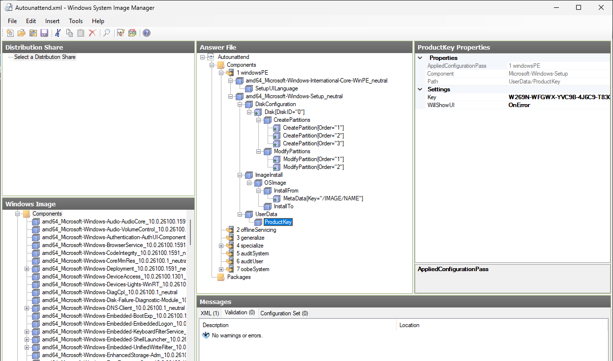
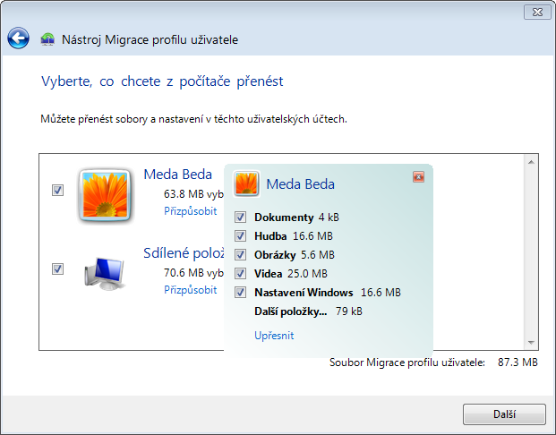

<!-- TODO-SCREENSHOT: snímky 16 – pořídit znovu z Windows 11 25H2 (Windows SIM z ADK 10.1.26100 s katalogem install.wim Windows 11 Pro; snímek 36 je historický nástroj Windows Easy Transfer z Windows 8, ten se znovu pořídit nedá) -->

<!-- _class: title -->
<!-- _header: '' -->

# Desktop systémy Microsoft Windows

## IW1

Jan Pluskal\
pluskal@vut.cz

Fakulta informačních technologií\
Vysoké učení technické v Brně\
Božetěchova 2, 612 66 Brno

---

<!-- _class: section -->

# Instalace

<!-- header: 'Desktop systémy Microsoft Windows <span>Instalace</span>' -->

---

# Edice Windows 11

- Baseline
  - Windows 11 Home
  - Windows 11 Pro
  - Windows 11 Pro for Workstations
- Organizational
  - Windows 11 Enterprise, Enterprise LTSC 2024
  - Windows 11 Education, Pro Education
    - Enterprise edice určená pro školy a univerzity
- Speciální
  - Windows 11 IoT Enterprise (LTSC 2024), Enterprise multi-session
  - Windows 11 SE – ukončeno, 24H2 je poslední verze
- Pouze 64-bit (x64 a ARM64), 32-bitová edice neexistuje

<!--
Windows 11 Education je funkčně shodná s Enterprise, jen je licencována pro vzdělávací instituce (Academic Volume Licensing). Na stanicích v C304 běží Windows 11 Education 25H2.
Enterprise multi-session je edice určená jen pro Azure Virtual Desktop / Windows 365 (více uživatelů současně na jednom virtuálním stroji).
Windows 11 SE byla odlehčená edice pro levná školní zařízení; Microsoft po verzi 24H2 nevydá žádnou další, podpora končí s 24H2 (13. 10. 2026).
Edice N (bez Media Playeru) existují ke každé desktopové edici.

Historie – ukončené edice Windows 10: Mobile / Mobile Enterprise (náhrada Windows RT a Windows Phone 8.1), IoT Mobile, Windows 10 S (jen aplikace z MS Store; nahrazena „S mode“, který je ve Windows 11 dostupný jen v edici Home), Windows 10X (zrušen, myšlenky převzaty do Windows 11). Windows 10 IoT Core (Raspberry Pi) nemá ve Windows 11 nástupce.

Zdroj: https://learn.microsoft.com/en-us/lifecycle/products/windows-11-home-and-pro
Zdroj: https://learn.microsoft.com/en-us/lifecycle/products/windows-11-enterprise-and-education
Zdroj: https://learn.microsoft.com/en-us/education/windows/windows-11-se-overview
Zdroj: https://www.microsoft.com/en-us/windows/windows-11-specifications (S mode jen Home)
-->

---

<!-- _class: dense -->

# Životní cyklus Windows 11

- Jeden feature update ročně (H2), Home/Pro/Pro Education/Pro for Workstations 24 měsíců, Enterprise/Education 36 měsíců podpory
- 25H2 je *enablement package* (eKB) nad platformou 24H2 – stejné systémové soubory, aktivace funkcí jedním restartem

| Verze | Vydání | Konec podpory Home/Pro | Konec podpory Enterprise/Education |
| ----- | ------ | :--------------------: | :--------------------------------: |
| 24H2 | 1. 10. 2024 | 13. 10. 2026 | 12. 10. 2027 |
| 25H2 (eKB) | 30. 9. 2025 | 12. 10. 2027 | 10. 10. 2028 |
| 26H1 (jen nová ARM64 zařízení) | 10. 2. 2026 | 14. 3. 2028 | 13. 3. 2029 |
| 26H2 (eKB, Release Preview 27. 8. 2026) | podzim 2026 | – | – |

- LTSC (Long-Term Servicing Channel) – žádné feature updaty, fixní životní cyklus
  - Windows 11 Enterprise LTSC 2024 – podpora do 9. 10. 2029
  - Windows 11 IoT Enterprise LTSC 2024 – podpora do 10. 10. 2034

<!--
Microsoft uvádí konce podpory v pacifickém čase jako „následující den 6:59:59 AM PT“; v tabulce je odpovídající úterý záplat (Patch Tuesday), které Microsoft používá ve zprávách.
Verze 26H1 vyšla 10. 2. 2026 jen pro nová zařízení se Snapdragon X2 (ARM64), staví na jiném jádře než 24H2/25H2 a stávajícím počítačům se nenabízí. Pro existující x64 i ARM64 zařízení je další verzí 26H2, opět jako enablement package nad 24H2/25H2; do Release Preview vyšla 27. 8. 2026, obecná dostupnost se očekává na podzim 2026 – při přednášce ověřit, zda už vyšla.
Enablement package 25H2 (KB5054156) vyžaduje 24H2 s kumulativní aktualizací z 29. 8. 2025 (build 26100.5074) nebo novější.
Pro 24H2 a novější platí „checkpoint cumulative updates“ – kumulativní aktualizace se počítají od posledního checkpointu, ne od RTM, a jsou menší (více v L12).

Zdroj: https://learn.microsoft.com/en-us/lifecycle/products/windows-11-home-and-pro
Zdroj: https://learn.microsoft.com/en-us/lifecycle/products/windows-11-enterprise-and-education
Zdroj: https://learn.microsoft.com/en-us/lifecycle/products/windows-11-enterprise-ltsc-2024
Zdroj: https://learn.microsoft.com/en-us/lifecycle/products/windows-11-iot-enterprise-ltsc-2024
Zdroj: https://support.microsoft.com/en-us/servicing/os/windows/docs/2025/02/kb5054156-feature-update-to-windows-11-version-25h2-by-using-an-enablement-package
Zdroj: https://blogs.windows.com/windows-insider/2026/08/27/releasing-windows-11-version-26h2-to-the-release-preview-channel/
Zdroj: https://www.windowscentral.com/microsoft/windows-11/microsoft-confirms-windows-11-version-26h1-support-lifecycle-dates-heres-how-long-your-new-snapdragon-x2-laptop-will-be-supported-on-26h1
-->

---

<!-- _class: dense -->

# Historie: Windows 10 a konec podpory

- Vydáno 29. 7. 2015, poslední verze 22H2; do 21H2 dva feature updaty ročně, pak jeden
- Konec podpory všech edic Home/Pro/Enterprise/Education **14. 10. 2025**
  - Bez ESU už žádné bezpečnostní aktualizace, systém dál funguje
- Extended Security Updates (ESU) – placené prodloužení jen o bezpečnostní opravy
  - Spotřebitelé: do 12. 10. 2027 (zdarma při synchronizaci nastavení přes Zálohování Windows, za 1 000 bodů Microsoft Rewards nebo 30 USD; až 10 zařízení na účet Microsoft)
  - Organizace: 61 USD/zařízení první rok, každý další rok dvojnásobek, max. 3 roky (do 10/2028); zdarma pro Windows 10 ve Windows 365 / Azure Virtual Desktop
  - Vyžaduje Windows 10 22H2
- Windows 10 Enterprise LTSC 2021 – podpora do 12. 1. 2027 (IoT Enterprise LTSC déle)
- Dnes je Windows 10 jen **zdrojem migrace** na Windows 11 (viz Upgrade a Migrace)

<!--
Spotřebitelské ESU původně končilo 13. 10. 2026; v červnu 2026 Microsoft program bez ohlášení prodloužil o rok do 12. 10. 2027 a licenci lze použít až na 10 zařízení pod stejným účtem Microsoft. Doménová, MDM spravovaná a kiosková zařízení do spotřebitelského ESU nespadají.
ESU neobsahuje nové funkce, opravy nesouvisející s bezpečností ani technickou podporu.
Historie edic Windows 10: Home, Pro, Pro for Workstations (od 1709), Enterprise, Enterprise LTSC (2015/2016/2019/2021), Education, Pro Education, IoT; 32-bitové (x86) i 64-bitové verze; limit 4 GB RAM u 32-bitové verze je dán architekturou (PAE Windows na klientu nevyužívají).

Zdroj: https://learn.microsoft.com/en-us/lifecycle/products/windows-10-home-and-pro
Zdroj: https://learn.microsoft.com/en-us/windows/whats-new/extended-security-updates
Zdroj: https://www.microsoft.com/en-us/windows/extended-security-updates
Zdroj: https://learn.microsoft.com/en-us/lifecycle/products/windows-10-enterprise-ltsc-2021
Zdroj: https://learn.microsoft.com/en-us/windows/win32/memory/memory-limits-for-windows-releases
-->

---

# Windows 11 Home

- Umí využít maximálně 128 GB paměti
- Nelze připojit do domény ani k Microsoft Entra ID (bez zásad skupiny)
- První spuštění (OOBE) vyžaduje připojení k internetu a účet Microsoft
- Jediná edice, která podporuje S mode (jen aplikace z Microsoft Store)
- Vícejazyčné uživatelské rozhraní, Prostory úložišť (Storage Spaces)
- Windows Hello (PIN, biometrie), passkeys
- Šifrování zařízení (Device Encryption) – automatický BitLocker
  - Od 24H2 zapnuto při čisté instalaci na většině zařízení, klíč pro obnovení se ukládá do účtu Microsoft

<!--
Limit paměti: Windows 11 Home 128 GB (x64 i ARM64). Počty procesorových patic Microsoft pro Windows 11 v dokumentaci neuvádí; u Windows 10 platilo Home 1 patice, Pro 2, Pro for Workstations 4 (libovolný počet jader) – pro Windows 11 se to podle dostupných zdrojů nezměnilo, ale aktuální oficiální tabulka není k dispozici.
Bez připojení k internetu a účtu Microsoft dnes OOBE u Home (a u Pro pro osobní použití) nejde dokončit; dříve známé obcházení (oobe\bypassnro) Microsoft od roku 2025 z instalátoru odstraňuje. Alternativou je Pro s připojením do domény / pracovním účtem nebo médium s předpřipraveným souborem odpovědí (např. Rufus).
Device Encryption je BitLocker s omezenou správou: šifruje jen systémový a pevné disky (ne USB), ochrana klíče jen TPM, klíč pro obnovení se zálohuje do účtu Microsoft (nebo do Entra ID / AD DS u připojených zařízení). Ve Windows 11 24H2 Microsoft zrušil podmínky HSTI / Modern Standby a DMA, takže se automatické šifrování zapíná na většině nových instalací. Dokud správce nepoužije účet Microsoft (nebo zařízení není v doméně), zůstává disk zašifrován „čistým klíčem“ (ekvivalent pozastaveného BitLockeru).
Prostory úložišť nahradily dynamické disky (ty jsou od verze 2004 označeny jako deprecated).

Zdroj: https://learn.microsoft.com/en-us/windows/win32/memory/memory-limits-for-windows-releases
Zdroj: https://learn.microsoft.com/en-us/windows/whats-new/windows-11-requirements
Zdroj: https://www.microsoft.com/en-us/windows/windows-11-specifications
Zdroj: https://learn.microsoft.com/en-us/windows/security/operating-system-security/data-protection/bitlocker/
Zdroj: https://learn.microsoft.com/en-us/windows/whats-new/deprecated-features (Dynamic Disks)
-->

---

# Windows 11 Pro

- Umí využít maximálně 2 TB paměti
- Lze připojit do domény Active Directory i k Microsoft Entra ID
  - Zásady skupiny, správa přes Intune (MDM), Windows Autopilot
- Klientské Hyper-V (vyžaduje procesor se SLAT) a Windows Sandbox
- BitLocker a BitLocker To Go, EFS
- Hostitel vzdálené plochy (Remote Desktop), Assigned Access (kiosk)
- Zásady Windows Update for Business (odklad aktualizací)
- Windows 11 Pro for Workstations
  - Až 6 TB paměti, vytváření ReFS, persistentní paměť (NVDIMM), SMB Direct

<!--
Second Level Address Translation (SLAT) je překlad adres pomocí vnořených tabulek stránek v MMU procesoru; vyžadují ho Hyper-V, Windows Sandbox i virtualizační zabezpečení (VBS).
Klient vzdálené plochy je k dispozici ve všech edicích, hostitel (příchozí RDP) jen v Pro a vyšších. Klasický klient „Připojení ke vzdálené ploše“ (mstsc) zůstává, aplikaci Vzdálená plocha ze Store nahradila v roce 2025 „Windows App“ (více v L05).
Windows Information Protection (WIP), dříve uváděná mezi funkcemi Pro, byla v roce 2022 označena za ukončenou a ve Windows 11 24H2 odstraněna; náhradou je Microsoft Purview Information Protection / DLP.
XP Mode / Windows Virtual PC neexistují od Windows 8; pro izolované spouštění aplikací slouží Windows Sandbox (Pro a vyšší), pro starší aplikace klientské Hyper-V (více v L11).
Pro for Workstations: čtyři patice, 6 TB RAM, ReFS lze vytvářet jen v Pro for Workstations a Enterprise (ostatní edice ReFS jen čtou a zapisují).

Zdroj: https://learn.microsoft.com/en-us/windows/win32/memory/memory-limits-for-windows-releases
Zdroj: https://learn.microsoft.com/en-us/windows/whats-new/windows-11-requirements (Hyper-V, BitLocker To Go: Pro a vyšší)
Zdroj: https://learn.microsoft.com/en-us/windows/whats-new/removed-features (ReFS, WIP)
Zdroj: https://learn.microsoft.com/en-us/windows/security/application-security/application-isolation/windows-sandbox/
-->

---

# Windows 11 Enterprise a Education

- Edice pro podnikové (školní) nasazení
  - Volume licencování, nebo **subscription activation** (Windows Enterprise E3/E5, A3/A5) – Pro se po přihlášení účtem Entra ID „povýší“ na Enterprise
- Podporují navíc řadu enterprise služeb
  - Credential Guard (od 22H2 zapnutý ve výchozím stavu), App Control for Business (dříve WDAC / Device Guard), AppLocker
  - BranchCache, DirectAccess (deprecated → Always On VPN)
  - Hotpatching – bezpečnostní aktualizace bez restartu (Enterprise/Education 24H2+, x64 i ARM64, Windows Autopatch)
  - Windows Autopatch, Universal Print, Azure Virtual Desktop / Windows 365
- Enterprise LTSC 2024 – bez Store aplikací a feature updatů, 5 let podpory

<!--
Subscription activation: zařízení připojené k Entra ID (nebo hybridně) s edicí Pro se po přihlášení uživatele s licencí Windows Enterprise E3/E5 (A3/A5 pro Education) automaticky a bez restartu přepne na Enterprise (Pro Education na Education); licence platí až pro 5 zařízení na uživatele, obnovuje se každých ~30 dní a po vypršení se zařízení vrátí na Pro. Odpadá KMS/MAK a GVLK klíče.
Credential Guard izoluje LSA tajemství (NTLM hashe, Kerberos TGT) pomocí virtualizačního zabezpečení (VBS). Od Windows 11 22H2 je zapnutý ve výchozím stavu na zařízeních Enterprise/Education splňujících požadavky (bez UEFI zámku).
Device Guard byl přejmenován na Windows Defender Application Control a v roce 2024 na App Control for Business – kód smí běžet jen podle zásad (podpis, vydavatel, cesta); ochrana je aktivní už při startu systému.
Hotpatch: v lednu, dubnu, červenci a říjnu se instaluje standardní kumulativní „baseline“ aktualizace s restartem, v ostatních měsících hotpatch bez restartu (4 restarty ročně místo 12). Vyžaduje Windows 11 verze 24H2 nebo novější s licencí Enterprise E3/E5, Education A3/A5, Microsoft 365 F3 / Business Premium nebo Windows 365 Enterprise, zapnuté VBS a správu přes Intune (Windows Autopatch, zásada kvalitních aktualizací s povoleným hotpatch). Na ARM64 je navíc nutné vypnout CHPE (kompilované x86 binárky); zařízení, které podmínky nesplní, dostane běžnou kumulativní aktualizaci (LCU) s restartem (více v L12).
DirectAccess je od června 2024 deprecated, náhradou je Always On VPN nebo Microsoft Entra Global Secure Access (více v L11).
Windows To Go, Application Sideload (bez omezení ve všech edicích) a Microsoft Defender Application Guard (odstraněn ve 24H2) už nejsou rozlišovacími znaky Enterprise.
Podpora Linuxu: SUA (Subsystem for UNIX-based Applications) neexistuje, Windows Subsystem for Linux (WSL 2) je ve všech edicích Windows 11.

Zdroj: https://learn.microsoft.com/en-us/windows/deployment/windows-subscription-activation
Zdroj: https://learn.microsoft.com/en-us/windows/security/identity-protection/credential-guard/
Zdroj: https://learn.microsoft.com/en-us/windows/deployment/windows-autopatch/manage/windows-autopatch-hotpatch-updates
Zdroj: https://learn.microsoft.com/en-us/windows/whats-new/deprecated-features (DirectAccess, Application Guard)
Zdroj: https://learn.microsoft.com/en-us/lifecycle/products/windows-11-enterprise-ltsc-2024
-->

---

<!-- _class: dense -->

# Hardwarové nároky

|                       | Windows 10 (historie)                               | Windows 11                                                              |
| --------------------- | --------------------------------------------------- | ----------------------------------------------------------------------- |
| Procesor              | 1 GHz (s PAE, NX a SSE2), 32-bit nebo 64-bit        | 1 GHz, **2 a více jader**, 64-bit (x64 nebo ARM64) ze seznamu podporovaných |
| Paměť                 | 1 GB (32-bit) / 2 GB (64-bit)                       | 4 GB                                                                    |
| Disk                  | 16 GB / 20 GB                                       | 64 GB                                                                   |
| Grafická karta        | DirectX 9, ovladač WDDM 1.0                         | DirectX 12, ovladač WDDM 2.0                                            |
| Firmware              | BIOS nebo UEFI, TPM volitelné                       | **UEFI se Secure Boot, TPM 2.0**                                        |
| Displej               | 800 × 600                                           | HD (720p), větší než 9", 8 bitů na kanál                                |
| Internet, účet        | –                                                   | Home a Pro (osobní použití): internet a účet Microsoft při OOBE         |

- Virtuální stroj: generace 2, vTPM a Secure Boot zapnuty, 2 vCPU, 4 GB RAM, 64 GB disk
- <https://learn.microsoft.com/en-us/windows/whats-new/windows-11-requirements>

<!--
No-eXecute (NX) umožňuje označit stránky paměti jako nespustitelné (ochrana proti malwaru), PAE (Physical Address Extension) je nutná, protože bez ní nefunguje NX bit; SSE2 je sada instrukcí z roku 2001. U Windows 11 už tyto požadavky nemá smysl uvádět – každý procesor ze seznamu podporovaných je splňuje.
TPM 2.0 je požadován pro BitLocker/Device Encryption, Windows Hello, měřený start a attestation; Secure Boot musí firmware podporovat (nemusí být zapnut pro upgrade, ale Windows Update ho vyžaduje pro nabídku upgradu).
Virtuální stroje: Windows 11 lze nainstalovat jen do VM generace 2 s virtuálním TPM a Secure Boot (v Hyper-V šablona „Microsoft Windows“). Upgrade existující VM generace 1 na Windows 11 není možný. Hostitelský procesor musí také splňovat požadavky Windows 11. Laboratorní stroje z AutomatedLab (E01) jsou proto generace 2 s vTPM.
Neověřeno v dokumentaci Microsoftu: od 24H2 vyžaduje jádro instrukce POPCNT a SSE4.2 (bez nich systém nenastartuje); Microsoft to oficiálně nezdokumentoval, jde o zjištění komunity.

Zdroj: https://learn.microsoft.com/en-us/windows/whats-new/windows-11-requirements
Zdroj: https://www.microsoft.com/en-us/windows/windows-11-specifications
Zdroj: https://www.microsoft.com/en-us/windows/windows-10-specifications (historie)
-->

---

# Podporované procesory

- Windows 11 běží oficiálně jen na procesorech ze seznamu Microsoftu
  - Intel: Core 8. generace (Coffee Lake, 2017) a novější, vybrané Celeron/Pentium/Xeon
  - AMD: Ryzen 2000 (desktop, Zen+), Ryzen 3000 a novější, Athlon 3000G, EPYC 7002+
  - ARM64: vybrané Qualcomm Snapdragon (samostatný seznam)
- Ověření: aplikace **PC Health Check** (Kontrola stavu počítače)
- Nepodporovaný hardware
  - Windows Update upgrade nenabídne, instalátor jej zablokuje
  - Po neoficiální instalaci: vodoznak „Nejsou splněny systémové požadavky“, bez záruky aktualizací; Microsoft doporučuje návrat na Windows 10

<!--
Seznamy jsou primárně určeny pro OEM výrobce nových zařízení, ale stejnou „spodní hranici“ používá Windows Update i PC Health Check při posuzování upgradu. Pozdější generace procesorů se považují za podporované, i když v seznamu ještě nejsou.
Z AMD Ryzen 2000 jsou v seznamu jen desktopové modely (Pinnacle Ridge, Zen+); mobilní Ryzen 2000 (Raven Ridge) podporovány nejsou. Stanice v C304 mají Ryzen 5 PRO 5650G – v seznamu je.
Neoficiální instalaci (Rufus, úprava registru, výměna appraiserres.dll) Microsoft nepodporuje; v článku „Ways to install Windows 11“ dřívější návod s klíčem registru AllowUpgradesWithUnsupportedTPMOrCPU odstranil. Systém pak zobrazuje vodoznak a v Nastavení upozornění, feature updaty nemusí být nabídnuty.

Zdroj: https://learn.microsoft.com/en-us/windows-hardware/design/minimum/supported/windows-11-supported-intel-processors
Zdroj: https://learn.microsoft.com/en-us/windows-hardware/design/minimum/supported/windows-11-supported-amd-processors
Zdroj: https://learn.microsoft.com/en-us/windows-hardware/design/minimum/windows-processor-requirements
Zdroj: https://support.microsoft.com/en-us/windows/ways-to-install-windows-11-e0edbbfb-cfc5-4011-868b-2ce77ac7c70e
Zdroj: https://support.microsoft.com/windows/how-to-use-the-pc-health-check-app-9c8abd9b-03ba-4e67-81ef-36f37caa7844
-->

---

# Instalační média (1)

- USB (Flash) disk – standardní médium
  - Pro UEFI musí být FAT32 (limit 4 GB na soubor)
    - `install.wim` větší než 4 GB rozdělit: `Dism /Split-Image /ImageFile:D:\sources\install.wim /SWMFile:E:\sources\install.swm /FileSize:3800`
    - nebo NTFS + zavaděč UEFI:NTFS (Rufus)
  - Pozor na schéma oddílů (GPT pro UEFI, MBR pro BIOS)
  - Možnost úpravy bitové kopie a přidání `Autounattend.xml`
- ISO soubor – připojení k virtuálnímu stroji (Hyper-V DVD)
  - Historie: DVD, dnešní ISO Windows 11 přesahuje kapacitu jednovrstvého DVD
- Sdílený adresář v síti
  - Spuštění `setup.exe` z Windows PE, zatěžuje síť

<!--
Firmware musí umět médium přečíst, aby z něj nabootoval: UEFI standardně čte jen FAT32 (FAT12/16), proto je zaváděcí médium FAT32. Média z Media Creation Tool problém obchází tím, že obsahují komprimovaný install.esd (menší než 4 GB); ISO ke stažení obsahuje install.wim přes 4 GB, proto se při ruční tvorbě média rozdělí na .swm soubory (instalátor je najde automaticky, když se jmenují install.swm).
Rufus vytvoří NTFS médium s malým FAT oddílem UEFI:NTFS, který načte NTFS ovladač – Secure Boot musí být pro tento zavaděč povolen výrobcem (je podepsán Microsoftem).
Windows Setup lze stále spustit ze sdíleného adresáře (nabootovat Windows PE, připojit share, spustit setup.exe) – tato cesta na rozdíl od WDS zablokována není.
Historie: Windows 7 USB/DVD Download Tool pro tvorbu média z ISO; vypalování DVD ze systému.

Zdroj: https://learn.microsoft.com/en-us/windows-hardware/manufacture/desktop/install-windows-from-a-usb-flash-drive
Zdroj: https://learn.microsoft.com/en-us/windows/deployment/wds-boot-support (setup ze síťové složky)
Zdroj: https://github.com/pbatard/rufus
-->

---

# Instalační média (2) – nástroje

- Stránka **Download Windows 11** (<https://www.microsoft.com/software-download/windows11>)
  - **Windows 11 Installation Assistant** – upgrade běžícího Windows 10
  - **Media Creation Tool** – vytvoří zaváděcí USB nebo ISO (multi-edition, `install.esd`)
  - **ISO** ke stažení (x64 i ARM64), pro organizace VLSC / Microsoft 365 admin center
- **Rufus** (třetí strana, GPL) – zaváděcí USB z ISO
  - UEFI:NTFS, Windows To Go, volitelně obejití TPM 2.0 / Secure Boot / RAM a předvyplnění OOBE (lokální účet, telemetrie)
  - Microsoftem nepodporováno
- Vlastní médium: úprava `install.wim` pomocí DISM, `Autounattend.xml`, ovladače (více v L02, L03)

<!--
Media Creation Tool stahuje aktuální verzi (25H2) a vytváří médium se všemi spotřebitelskými edicemi (Home, Pro, Education, …); edice se volí licenčním klíčem nebo souborem ei.cfg.
Laboratorní ISO win11.iso (D:\LabSources\ISOs) je multi-edition obraz 10.0.26100 s edicemi Home/Education/Pro; AutomatedLab používá „Windows 11 Pro“.
Rufus (https://rufus.ie, GitHub pbatard/rufus) je open-source nástroj (GPL v3); jeho dialog „Windows User Experience“ vloží do média vlastní soubor odpovědí (odstranění kontroly TPM/Secure Boot/RAM, lokální účet, vypnutí sběru dat, zákaz BitLockeru). Takto nainstalovaný systém na nepodporovaném hardwaru je z pohledu Microsoftu nepodporovaný.

Zdroj: https://www.microsoft.com/en-us/software-download/windows11
Zdroj: https://support.microsoft.com/en-us/windows/ways-to-install-windows-11-e0edbbfb-cfc5-4011-868b-2ce77ac7c70e
Zdroj: https://github.com/pbatard/rufus
-->

---

# Instalační zdroje (3) – síťové nasazení

- Windows Deployment Services (WDS) – role Windows Server
  - PXE boot, multicast, vyžaduje doménu
  - **Částečně deprecated**: `boot.wim` z média Windows 11 a Windows Setup v režimu WDS jsou **blokovány**; PXE s vlastním boot image (MDT, Configuration Manager) funguje dál
  - Od dubna 2026 je bezobslužné („hands-free“) nasazení přes WDS ve výchozím stavu vypnuto (CVE-2026-0386)
- Moderní náhrady
  - **Microsoft Configuration Manager** – OS deployment, task sequences
  - **Windows Autopilot + Intune** – OEM image, konfigurace v cloudu při OOBE
  - Provisioning packages (Windows Configuration Designer)
  - **Windows 365** Cloud PC / Azure Virtual Desktop – bez instalace na koncové zařízení

<!--
WDS je stále rolí Windows Server 2022/2025 a stále umí PXE boot; nefunguje jen scénář „PXE → boot.wim z instalačního média → Windows Setup v režimu WDS“ pro Windows 11 a Windows Server 2025 (blokováno), pro Windows Server 2022 se zobrazí varování. Microsoft doporučuje Configuration Manager nebo řešení třetích stran s vlastním boot.wim.
Microsoft Deployment Toolkit (MDT) není dále vyvíjen (poslední build 8456) a s aktuálním ADK pro Windows 11 24H2+ není podporován – více v L03.
Windows Autopilot: zařízení s předinstalovaným Windows 11 od OEM se při prvním spuštění přihlásí k Entra ID, zaregistruje do Intune a stáhne konfiguraci – bez vytváření vlastní bitové kopie.

Zdroj: https://learn.microsoft.com/en-us/windows/deployment/wds-boot-support
Zdroj: https://learn.microsoft.com/en-us/windows/whats-new/deprecated-features
-->

---

# Metody instalace

- Standardní (interaktivní) instalace
  - Informace potřebné pro konfiguraci systému jsou získány od uživatele během instalace
  - Windows 11 24H2 přinesl **nový instalátor** (vzhled podle Media Creation Tool, kroky zůstaly stejné)
  - Po instalaci následuje **OOBE** (Out-of-Box Experience) – region, klávesnice, síť, účet, soukromí
- Bezobslužná instalace
  - Informace potřebné pro konfiguraci systému jsou uloženy v souboru odpovědí (answer file)
  - Ve firmách místo souboru odpovědí často Autopilot (OOBE řídí cloud) nebo nasazení bitové kopie (L02, L03)

<!--
Nový instalátor 24H2 spouští vlastní instalaci přes SetupPrep.exe; na první obrazovce nabízí odkaz na „předchozí verzi instalátoru“ (podle komunitních zdrojů, v dokumentaci Microsoftu nepopsáno). Změna instalátoru ovlivnila zpracování souborů odpovědí – viz dále.
OOBE lze ovlivnit souborem odpovědí (průchod oobeSystem), Autopilotem, nebo úplně přeskočit v režimu auditu (sysprep /audit, více v L02).

Zdroj: https://www.windowscentral.com/software-apps/windows-11/whats-new-with-the-setup-experience-on-windows-11-version-24h2
Zdroj: https://learn.microsoft.com/en-us/windows-hardware/manufacture/desktop/windows-setup-automation-overview
-->

---

# Soubory odpovědí

- Soubory ve formátu XML, jedno nastavení na konfigurační průchod (windowsPE, offlineServicing, specialize, oobeSystem, …)
- **Autounattend.xml** v kořeni vyměnitelného média – instalátor ho hledá automaticky (průchody windowsPE a offlineServicing)
- **Unattend.xml** – pro pozdější průchody (`%WINDIR%\Panther\Unattend`, `Sysprep`) nebo explicitně `setup.exe /unattend:<soubor>`
- Pro vytváření a úpravy slouží **Windows SIM** (Windows System Image Manager)
  - Součást Windows ADK (Deployment Tools), ověřuje validitu souboru
  - Katalog (`.clg`) se generuje z `install.wim` – musí ležet na zapisovatelném disku
- Alternativy: ruční editace, webové generátory třetích stran

<!--
Pořadí hledání souboru odpovědí: registr (HKLM\System\Setup\UnattendFile), %WINDIR%\Panther\Unattend, %WINDIR%\Panther (cache), vyměnitelná média podle písmene jednotky (jen název Autounattend.xml v kořeni), \Sources instalačního média (Autounattend.xml) resp. %WINDIR%\System32\Sysprep (Unattend.xml), %SYSTEMDRIVE%, jednotka se setup.exe. Použije se soubor s nejvyšší prioritou, který obsahuje nastavení pro aktuální průchod; uloží se do cache ($Windows.~BT\Sources\Panther, později %WINDIR%\Panther) a citlivé údaje (hesla, klíče) se po průchodu mažou.
Pokud soubor odpovědí obsahuje chybu, instalace selže (nebo se – u 24H2 – část odpovědí ignoruje, viz další snímek).
Windows ADK: aktuální je ADK 10.1.26100.2454 (prosinec 2024) s opravným balíčkem (KB5079391 nebo novější – opravuje zranitelnost CVE-2026-25166 přímo ve Windows SIM); podporuje Windows 11 25H2/24H2 a Windows Server 2025/2022. ADK 10.1.28000.1 (listopad 2025) je jen pro Windows 11 26H1 ARM64. ADK se instaluje online instalátorem adksetup.exe (cca 4 GB dat), pro offline instalaci se stáhne „layout“; Windows PE je samostatný add-on. 32-bitové Windows PE už ADK od verze 22H2 neobsahuje.
V laboratoři (E01, L03) se instaluje Deployment Tools + USMT; Lab 04 vytváří Autounattend.xml pro Windows 11 Pro s generickým KMS klíčem VK7JG-NPHTM-C97JM-9MPGT-3V66T.
Dříve byly soubory odpovědí v INI formátu (unattend.txt).

Zdroj: https://learn.microsoft.com/en-us/windows-hardware/manufacture/desktop/windows-setup-automation-overview
Zdroj: https://learn.microsoft.com/en-us/windows-hardware/get-started/adk-install
Zdroj: https://learn.microsoft.com/en-us/windows-hardware/get-started/what-s-new-in-kits-and-tools
Zdroj: https://learn.microsoft.com/en-us/windows-server/get-started/kms-client-activation-keys
-->

---

# Windows System Image Manager



<!--
Sekce vlevo dole (Windows Image) obsahuje informace o komponentách a balíčcích, jenž lze přidat do souboru odpovědí. Jsou uloženy v katalogu (.clg), který instalační média od Windows 8 neobsahují – Windows SIM ho vytvoří při otevření WIM souboru, což nelze na médiu pouze pro čtení (ISO, DVD). WIM soubor je proto třeba zkopírovat na zapisovatelný disk (v Lab 04 do C:\sources).
Od ADK 10.1.25398 umí 32-bitová verze Windows SIM vytvářet katalogy pro obrazy všech architektur (x64 i ARM64); 64-bitová verze jen pro x64.
Snímek je z Windows 7 Enterprise x86 – uživatelské rozhraní Windows SIM se nezměnilo, ale pro Windows 11 se používají komponenty amd64_… a soubor pojmenovaný Autounattend.xml.

Zdroj: https://learn.microsoft.com/en-us/windows-hardware/customize/desktop/wsim/windows-system-image-manager-technical-reference
Zdroj: https://learn.microsoft.com/en-us/windows-hardware/get-started/what-s-new-in-kits-and-tools
-->

---

# Bezobslužná instalace ve Windows 11 24H2/25H2

- Přepracovaný instalátor změnil zpracování souboru odpovědí
  - `Autounattend.xml` je vyhodnocován přísněji
  - Části odpovědí mohou být ignorovány (typicky `DiskConfiguration/ModifyPartitions`, průchody *specialize* a *oobeSystem*) → objeví se dialogy instalátoru (např. *Select language settings*)
  - Ověřeno na stanicích C304 (Windows 11 25H2) – viz E01, Lab 04
- Co dělat
  - Soubor odpovědí validovat ve Windows SIM (na tvorbě se nic nemění)
  - Testovat na Hyper-V VM generace 2 s vTPM
  - Spustit instalaci z Windows PE s explicitním `setup.exe /unattend:<soubor>`
  - Nastavení průchodů *specialize*/*oobeSystem* řešit až po nasazení bitové kopie (`Sysprep /unattend`, L02)

<!--
Dokumentace Microsoftu k souborům odpovědí (Windows Setup Automation Overview) je z roku 2021 a změnu chování 24H2 nepopisuje; jde o známý problém diskutovaný komunitou (elevenforum.com, ntlite.com). Instalátor 24H2 volá SetupPrep.exe, a postupy vkládající skripty nebo soubory přes Autounattend.xml přestaly fungovat.
Cvičení Lab 04 v E01 tím není dotčeno (tvorba a validace souboru odpovědí), ale ukázka „instalace proběhne automaticky“ na 24H2/25H2 může skončit u interaktivního dialogu.

Zdroj: exercises/E01/E01.md (Lab 04, poznámka k 24H2/25H2, ověřeno 8/2026)
Zdroj: https://www.elevenforum.com/t/autounattend-not-working-for-new-windows-11-24h2.29237/
Zdroj: https://learn.microsoft.com/en-us/windows-hardware/manufacture/desktop/windows-setup-automation-overview
-->

---

# Průběh instalace

- Instalace dodatečných ovladačů
  - Načtení z USB (Flash) disku v instalátoru, nebo integrace do bitové kopie (DISM, L03)
- Volba edice
  - Multi-edition médium: podle licenčního klíče, klíče v UEFI (OEM) nebo výběrem v seznamu
  - Automatický výběr lze obejít souborem `ei.cfg` v adresáři `Sources` bitové kopie
- Účty
  - První přidaný uživatel je správce počítače, účet Administrator je zakázán
  - Home a Pro (osobní použití): OOBE vyžaduje internet a účet Microsoft
  - Pro: možnost „Nastavit pro práci nebo školu“ (Entra ID), doména se připojuje až po instalaci
  - Lokální účet lze vytvořit souborem odpovědí (`UserAccounts`)

<!--
Historie: dodatečné ovladače šlo dříve načíst jen z diskety (F6), Windows Vista+ z libovolného média.
Kromě ovladačů lze do bitové kopie integrovat aktualizace, jazykové balíčky a aplikace (L02, L03).
Účet Administrator lze povolit zásadami skupiny, ale nedoporučuje se to (známý název účtu s oprávněním správce). Lokální hesla správců ve firmě spravuje Windows LAPS (L07).
Obcházení požadavku na účet Microsoft (oobe\bypassnro, ms-cxh:localonly) Microsoft od Insider buildů 26200.5516 (2025) postupně odstraňuje; podporované cesty jsou účet Microsoft, pracovní/školní účet (Pro a vyšší), nebo soubor odpovědí s lokálním účtem. Lokální účet lze po instalaci vytvořit a účet Microsoft odpojit.
Volba edice: soubor ei.cfg (EditionID, Channel) nebo PID.txt s klíčem v adresáři Sources.

Zdroj: https://learn.microsoft.com/en-us/windows/whats-new/windows-11-requirements
Zdroj: https://www.microsoft.com/en-us/windows/windows-11-specifications
Zdroj: https://www.windowslatest.com/2025/10/07/microsoft-confirms-windows-11-to-require-microsoft-account-internet-during-oobe-tested/
-->

---

# Instalace na virtuální pevný disk

- Native VHD boot – systém běží z `.vhdx` souboru bez hypervizoru (jen VHDX, ne VHD)
- Instalátor Windows umí instalovat přímo do připojeného virtuálního disku
  - Vytvořit a připojit disk v příkazovém řádku instalátoru (Shift+F10, `diskpart`: `create vdisk`, `attach vdisk`)
  - Po dokončení instalace je nový systém přidán do bootovací nabídky
- Alternativa: `Dism /Apply-Image` na připojený VHDX a `bcdboot V:\Windows /s S: /f UEFI` (L02)
- Omezení: bez hibernace, BitLocker nelze na hostitelský svazek ani uvnitř VHDX, VHDX nesmí být na dynamickém disku ani na SMB sdílení, stránkovací soubor je mimo VHDX

<!--
Dnes se operační systémy na virtuální disky instalují často – stejný VHDX lze použít ve virtuálním stroji i nativně, což zjednodušuje správu bitových kopií.
Historie: u Windows 7 se musel záznam do BCD přidávat ručně bcdedit; bootovat z VHD uměly jen edice Enterprise/Ultimate, u Windows 8/10 Pro a Enterprise (Home hlásila „License error: Booting from a vhd is not supported on this system“). Aktuální dokumentace pro Windows 10/11 omezení edice neuvádí – při přednášce lze zmínit, že historicky vyžadovalo Pro/Enterprise.
V Hyper-V lze z virtuálního disku spustit jakoukoliv edici (tam nejde o native boot).
Od listopadu 2022 nelze nativně bootovat z VHDX, který má alternativní datový proud Zone.Identifier („mark of the web“ – soubor stažený z internetu); je třeba ho odstranit (Unblock-File).
Virtuální disk může být připraven dopředu (Správa disků, diskpart, New-VHD) nebo přímo v instalátoru; typy fixed / dynamically expanding / differencing.

Zdroj: https://learn.microsoft.com/en-us/windows-hardware/manufacture/desktop/deploy-windows-on-a-vhd--native-boot
Zdroj: https://learn.microsoft.com/en-us/windows-hardware/manufacture/desktop/boot-to-vhd--native-boot--add-a-virtual-hard-disk-to-the-boot-menu
-->

---

# Historie: Windows To Go

- Instalace Windows 8/10 Enterprise na certifikovaný USB disk (≥ 32 GB), spustitelná na libovolném počítači
  - Průvodce „Vytvořit pracovní prostor Windows To Go“ v Ovládacích panelech, vyžadoval instalační médium
  - Omezení: zakázán spánek a hibernace, interní disky offline, bez TPM (BitLocker jen s heslem), bez WinRE a resetu, ne na ARM
- Deprecated ve Windows 10 1903, **odstraněno ve verzi 2004**; ve Windows 11 neexistuje
- Dnešní náhrady
  - **Windows 365** Cloud PC / Azure Virtual Desktop – „přenosný“ desktop v cloudu
  - Rufus umí vytvořit „Windows To Go“ disk i z Windows 11 – neoficiální, nepodporováno
  - Native boot z VHDX na interním disku

<!--
Důvody ukončení: nepodporovalo feature updaty, vyžadovalo speciální certifikované USB disky, které výrobci přestali nabízet.
Druhou historickou možností byla přímá aplikace bitové kopie na USB disk pomocí DISM a ruční úprava BCD (bcdboot) – to technicky funguje dodnes, ale licenčně ani podporou to Microsoft nepokrývá.

Zdroj: https://learn.microsoft.com/en-us/windows/whats-new/removed-features (Windows To Go, 2004)
Zdroj: https://github.com/pbatard/rufus
-->

---

<!-- _class: dense -->

# Dual-Boot instalace

- Více verzí Windows
  - Instalovat nejnovější systém (Windows 11) jako poslední – jeho zavaděč umí spustit starší systémy
  - Alternativa bez dělení disku: native boot z VHDX
- Linux
  - Instalovat Windows před Linuxem (GRUB převezme zavádění, Secure Boot ponechat – distribuce používají podepsaný shim)
  - Před změnou zavaděče pozastavit BitLocker / šifrování zařízení (`manage-bde -protectors -disable C:`)
- Výchozí operační systém
  - Nastavení → Systém → O systému → Upřesnit nastavení systému → Spuštění a zotavení systému
  - `bcdedit /default <identifikátor>`, seznam `bcdedit /enum`

<!--
Windows 11 24H2 má na většině nových instalací zapnuté šifrování zařízení (BitLocker); změna zavaděče nebo firmwaru (Secure Boot) změní PCR hodnoty TPM a při dalším startu si Windows vyžádají klíč pro obnovení – proto BitLocker před zásahem pozastavit.
Volbu výchozího systému a timeout lze nastavit také v msconfig (záložka Spuštění).

Zdroj: https://learn.microsoft.com/en-us/windows-server/administration/windows-commands/bcdedit
Zdroj: https://learn.microsoft.com/en-us/windows/security/operating-system-security/data-protection/bitlocker/
-->

---

# Aktivace

- Ověření licence u Microsoftu: Nastavení → Systém → Aktivace (`ms-settings:activation`)
  - **Digitální licence** – vázaná na hardware, volitelně na účet Microsoft (bez zadávání klíče; OEM klíč je uložen v UEFI)
  - **Kód Product Key** – 25 znaků (retail, MAK, GVLK)
- Způsoby aktivace
  - Přes internet: automaticky po připojení, nebo `slmgr.vbs /ato`
  - Po telefonu (Aktivace po telefonu) – pro počítače bez internetu
- Neaktivovaný systém funguje bez časového omezení
  - Vodoznak „Aktivovat Windows“, zablokovaná personalizace, upozornění v Nastavení
- `slmgr.vbs /dlv` (stav), `/ipk <klíč>` (změna klíče), `/upk`, `/rearm`

<!--
Nástroj slmgr.vbs je skript VBScript – VBScript je od 2023 deprecated a ve Windows 11 24H2 je jako Feature on Demand; alternativou je PowerShell: Get-CimInstance SoftwareLicensingProduct | Where-Object PartialProductKey | Select Name, LicenseStatus. OEM klíč z UEFI (OA3): (Get-CimInstance SoftwareLicensingService).OA3xOriginalProductKey.
Historie: Windows 7/8 vyžadovaly aktivaci do 30 dnů od instalace (lhůtu šlo až 3× resetovat slmgr /rearm), pak systém přešel do omezeného režimu; periodická validace (WGA) blokovala nekritické aktualizace. Windows 10/11 místo toho jen připomínají a omezují personalizaci (tapeta, barvy, motivy).
Propojení digitální licence s účtem Microsoft je důležité pro reaktivaci po výměně hardwaru (další snímek).

Zdroj: https://support.microsoft.com/en-us/windows/activate-windows-c39005d4-95ee-b91e-b399-2820fda32227
Zdroj: https://learn.microsoft.com/en-us/windows/deployment/volume-activation/plan-for-volume-activation-client
Zdroj: https://learn.microsoft.com/en-us/windows/whats-new/deprecated-features (VBScript)
Zdroj: https://www.howtogeek.com/871189/you-can-install-and-use-windows-11-without-a-product-key/ (chování neaktivovaného systému)
-->

---

# Identifikace počítače při aktivaci

- Digitální licence je svázána s otiskem hardwaru (Hardware ID) a licencí (Product ID)
  - Hardware ID – vytvořen z identifikátorů komponent (základní deska, CPU, …), mění se při výměně hardwaru
  - Product ID – vygenerován z licenčního klíče / kanálu (retail, OEM, volume)
  - Aktivace = potvrzení tohoto otisku u Microsoftu
- Změna hardwaru (typicky základní deska) → systém není aktivován
  - Malé změny reaktivace proběhne automaticky
  - Poradce při potížích s aktivací: „Nedávno jsem na tomto zařízení změnil hardware“ – vyžaduje licenci propojenou s účtem Microsoft
  - OEM licence: klíč v UEFI se přenáší jen s deskou

<!--
Při větších změnách hardwaru bez propojení s účtem Microsoft je nutné kontaktovat podporu Microsoftu (aktivace po telefonu) nebo zadat klíč znovu.
Retail licenci lze přenést na jiný počítač (na původním odinstalovat slmgr /upk), OEM licence je vázána na zařízení.

Zdroj: https://support.microsoft.com/en-us/windows/activate-windows-c39005d4-95ee-b91e-b399-2820fda32227
-->

---

<!-- _class: dense -->

# Hromadná aktivace v organizaci

- **MAK** (Multiple Activation Key) – jeden klíč pro N aktivací u Microsoftu (online, telefon, proxy přes VAMT); pro izolované a malé sítě
- **KMS** (Key Management Service) – aktivace proti vlastnímu serveru v síti
  - Hostitel s klíčem CSVLK („KMS host key“), klienti s generickým klíčem **GVLK** (např. Windows 11 Pro `VK7JG-NPHTM-C97JM-9MPGT-3V66T`)
  - Práh 25 klientů (5 serverů), obnovení každých 180 dní (klient se hlásí po 7 dnech), TCP 1688, hledání přes DNS SRV `_vlmcs._tcp`
- **Active Directory-based activation** – aktivační objekt v doméně, počítač se ověří při kontaktu s doménou (min. 1× za 180 dní), bez KMS hostitele
- **Subscription activation** – Pro → Enterprise (Pro Education → Education) přes licenci E3/E5 (A3/A5) v Microsoft Entra ID, bez klíčů a restartu; až 5 zařízení na uživatele
- **VAMT** (Volume Activation Management Tool) – součást ADK, správa klíčů a aktivací
- Volume licence je jen upgrade – vyžaduje podkladovou OEM/retail licenci na každém PC

<!--
KMS hostitel může běžet na Windows Server (aktivuje klienty i servery) nebo na klientském Windows (aktivuje jen klienty); doporučují se dva pro redundanci. Počty klientů se sledují podle client ID (CMID), po restartu hostitele se počítají znovu; cache 30 dní.
Aktivační práh: klient dostane od KMS zpět počet dosud hlásících se počítačů, aktivuje se, když překročí 25 (Windows klient) / 5 (Windows Server).
Active Directory-based activation vyžaduje schéma Windows Server 2012+ a KMS host key; hodí se pro pobočky, kde není 25 počítačů.
Subscription activation vyžaduje Entra joined nebo hybrid joined zařízení; licence se obnovuje každých ~30 dní, po vypršení nebo při šestém zařízení se zařízení vrátí na Pro. Podkladová aktivace Pro (OEM klíč z UEFI) musí stále existovat.
Subscription activation nelze použít pro upgrade verze Windows ani z Windows 7/8.1.
V Lab 04 (E01) se používá GVLK klíč Windows 11 Pro – systém se bez KMS neaktivuje, ale nainstaluje se správná edice.
Token-based activation existuje pro izolovaná vysoce zabezpečená prostředí s PKI.

Zdroj: https://learn.microsoft.com/en-us/windows/deployment/volume-activation/plan-for-volume-activation-client
Zdroj: https://learn.microsoft.com/en-us/windows/deployment/windows-subscription-activation
Zdroj: https://learn.microsoft.com/en-us/windows-server/get-started/kms-client-activation-keys
Zdroj: https://learn.microsoft.com/en-us/windows/deployment/volume-activation/volume-activation-management-tool
-->

---

<!-- _class: section -->

# Upgrade

<!-- header: 'Desktop systémy Microsoft Windows <span>Upgrade</span>' -->

---

# Upgrade edice Windows

- Změna edice bez reinstalace zadáním klíče vyšší edice
  - Home → Pro: Nastavení → Systém → Aktivace → Změnit kód Product Key, nebo nákup v Microsoft Store
  - Pro → Enterprise: subscription activation, klíč MAK/KMS (`changepk.exe /ProductKey <klíč>`, `slmgr.vbs /ipk`), zásada MDM (WindowsLicensing CSP), provisioning package, Configuration Manager
  - Home → Pro Education/Education, Pro → Pro for Workstations/Pro Education/Education, Enterprise → Education
- Downgrade edice jen z Enterprise/Education (na Pro, Pro for Workstations, Pro Education); aplikace a nastavení se ztratí
- Nelze změnit architekturu (32-bit → 64-bit), ani se vrátit na starší verzi klíčem (Windows 11 Pro → Windows 10 Pro)

<!--
32-bitová a 64-bitová verze používají odlišné HAL vrstvy a jádro, proto nelze provést upgrade z jedné na druhou – u Windows 11 to už nehrozí (jen 64-bit), ale platí pro upgrade z 32-bitových Windows 10: jen čistá instalace + migrace dat (USMT).
Edice N/KN se upgradují na odpovídající N/KN edici; při změně typu (Pro N → Pro) se zachovají jen data.
Microsoft Store for Business měl být ukončen 31. 3. 2023 (Microsoft termín odložil bez náhrady, záložka Store for Business zmizela z aplikace Store v dubnu 2023) – upgrade edic se dnes řeší subscription activation nebo klíči, ne přes Store for Business.
Při vypršení volume licence / subscription se edice automaticky vrátí na původní (Pro).

Zdroj: https://learn.microsoft.com/en-us/windows/deployment/upgrade/windows-edition-upgrades
Zdroj: https://learn.microsoft.com/en-us/windows/deployment/upgrade/windows-upgrade-paths
Zdroj: https://learn.microsoft.com/en-us/lifecycle/announcements/microsoft-store-for-business-education-retiring
-->

---

<!-- _class: dense -->

# Upgrade Windows 10 → Windows 11

- In-place upgrade je **zdarma** (licence Windows 10 se stejnou edicí platí)
  - Vyžaduje Windows 10 verze 2004+ s aktualizací ze září 2021 a splnění hardwarových požadavků
- Způsoby
  - **Windows Update** – nabídka upgradu (Nastavení → Windows Update)
  - **Windows 11 Installation Assistant**
  - Instalační médium / ISO: `setup.exe` z běžícího systému, volba „Zachovat osobní soubory a aplikace“
  - Organizace: Windows Update for Business / Intune (feature update policy), Configuration Manager, Windows Autopatch
- Původní systém zůstává ve `Windows.old` (+ `$Windows.~BT`)
  - Návrat: Nastavení → Systém → Obnovení → **Zpět** – jen prvních **10 dní**, nebo WinRE → Odinstalovat aktualizace
  - Po 10 dnech jen reinstalace (čistá instalace Windows 10 + migrace dat)

<!--
Aplikace a nastavení se při in-place upgradu zachovají, pokud se nemění typ edice (Pro N → Pro zachová jen data). Bezobslužný upgrade: setup.exe /auto upgrade /quiet /eula accept (více v L12).
Lhůtu pro návrat lze prodloužit až na 60 dní před upgradem: DISM /Online /Set-OSUninstallWindow /Value:60. Návrat není možný po resetu počítače nebo smazání Windows.old (Smart úložiště / Vyčištění disku). Pro návrat musí být přítomny také adresáře $Windows.~BT a $Windows.~WS.
Upgrade z Windows 7/8.1 přímo na Windows 11 podporován není – buď čistá instalace s USMT, nebo dvoukrokový upgrade přes Windows 10 (jen pokud hardware splňuje požadavky Windows 11).
Windows 11 24H2 je „full OS swap“ (není enablement package), 25H2 a 26H2 jsou enablement packages nad 24H2.

Zdroj: https://learn.microsoft.com/en-us/windows/whats-new/windows-11-requirements (OS requirements)
Zdroj: https://support.microsoft.com/en-us/windows/ways-to-install-windows-11-e0edbbfb-cfc5-4011-868b-2ce77ac7c70e
Zdroj: https://learn.microsoft.com/en-us/windows/deployment/windows-subscription-activation (Windows 7/8.1 → jen přes Windows 10)
Zdroj: https://learn.microsoft.com/en-us/windows/whats-new/whats-new-windows-11-version-24h2
-->

---

<!-- _class: dense -->

# Cesty upgradu na Windows 11

| Výchozí systém                 | Cílový systém                          | Instalační médium | Windows Update |
| ------------------------------ | -------------------------------------- | :---------------: | :------------: |
| Windows 10 2004 a novější      | Windows 11 (stejná nebo vyšší edice)   |         ✔         |       ✔        |
| Windows 10 starší než 2004     | Windows 11                             |   ✔ (po aktualizaci Windows 10)   |       ✘        |
| Windows 10 Enterprise LTSC     | Windows 11 Enterprise (GA kanál)       |  ✔ (`setup.exe /pkey`)  |       ✘        |
| Windows 11 GA kanál            | Windows 11 Enterprise LTSC             |         ✘         |       ✘        |
| Windows 7, 8, 8.1              | Windows 11                             |  ✘ (jen čistá instalace)  |       ✘        |
| 32-bitová Windows 10           | Windows 11                             |  ✘ (jen čistá instalace)  |       ✘        |

| Výchozí edice          | Cílová edice Windows 11                                |
| ---------------------- | ------------------------------------------------------ |
| Home                   | Home, Pro, Pro Education, Education                    |
| Pro, Pro for Workstations | Pro, Pro for Workstations, Pro Education, Education, Enterprise |
| Enterprise             | Enterprise, Education                                  |
| Education, Pro Education | Education, Pro Education                             |

<!--
Verzi lze přeskočit (např. Windows 10 22H2 → Windows 11 25H2), podmínkou je podporovaná výchozí verze. Z LTSC do GA kanálu jen se stejným nebo novějším buildem a s přepínačem /pkey (jinak nelze zachovat aplikace); opačně (GA → LTSC) není in-place upgrade podporován.
Upgrade Home → Pro při přechodu na Windows 11 vyžaduje klíč Pro (zadá se před upgradem nebo v instalátoru).

Zdroj: https://learn.microsoft.com/en-us/windows/deployment/upgrade/windows-upgrade-paths
Zdroj: https://learn.microsoft.com/en-us/windows/deployment/upgrade/windows-edition-upgrades
-->

---

# Nepodporovaný hardware – co s ním

- Windows Update ani Installation Assistant upgrade nenabídnou, PC Health Check vypíše důvod (TPM 2.0, Secure Boot, CPU, RAM)
- Podporované možnosti
  - Zapnout TPM 2.0 (fTPM / PTT) a UEFI + Secure Boot ve firmwaru, převést disk MBR → GPT (`mbr2gpt.exe /convert /allowFullOS`)
  - Zůstat na Windows 10 s **ESU** (spotřebitelé do 12. 10. 2027, firmy max. do 10/2028)
  - Nový počítač, nebo **Windows 365** Cloud PC (Windows 11 běží v cloudu, staré PC je jen klient)
- Nepodporované možnosti
  - Obejití kontrol (Rufus, úprava registru, výměna `appraiserres.dll`)
  - Vodoznak „Nejsou splněny systémové požadavky“, bez záruky aktualizací a podpory; Microsoft doporučuje návrat na Windows 10

<!--
Většina počítačů z let 2016–2018 má TPM 2.0 ve firmwaru (Intel PTT, AMD fTPM) jen vypnuté; procesor starší než Intel 8. gen / AMD Zen+ ale z nepodporovaného na podporovaný nezměníme.
mbr2gpt.exe převede systémový disk z MBR na GPT bez ztráty dat (nejlépe z WinPE, z běžícího systému s /allowFullOS), pak je třeba ve firmwaru přepnout Legacy/CSM → UEFI.
Microsoft v prosinci 2024 odstranil ze svého článku návod s klíčem registru HKLM\SYSTEM\Setup\MoSetup\AllowUpgradesWithUnsupportedTPMOrCPU (TPM 1.2 a nepodporovaný CPU) – dnes článek jen varuje a doporučuje návrat.

Zdroj: https://support.microsoft.com/en-us/windows/ways-to-install-windows-11-e0edbbfb-cfc5-4011-868b-2ce77ac7c70e
Zdroj: https://learn.microsoft.com/en-us/windows/deployment/mbr-to-gpt
Zdroj: https://www.microsoft.com/en-us/windows/extended-security-updates
-->

---

<!-- _class: dense -->

# Historie: Upgrade na Windows 10

- Windows 10 byl první rok (2015–2016) zdarma z Windows 7 SP1 a 8.1 Update přes Windows Update (aplikace „Get Windows 10“); ostatní (7 RTM, 8, 8.1 RTM) jen z instalačního média; Windows RT a Windows Phone 8.0 bez cesty, Windows Phone 8.1 → Windows 10 Mobile
- Kontrola kompatibility: Windows 10 Upgrade Checker / Upgrade Assistant (součást instalátoru) a Windows 8 Upgrade Assistant zjišťovaly nekompatibilní aplikace a zařízení – dnešní obdobou je **PC Health Check**
- Původní systém do `Windows.old`, návrat 10 dní (dříve 30) přes Nastavení → Obnovení

| Výchozí edice pro upgrade                          | Cílová edice          |
| -------------------------------------------------- | --------------------- |
| Windows 7 Starter/Home Basic/Home Premium, 8, 8.1  | Windows 10 Home / Pro |
| Windows 7 Professional/Ultimate, 8/8.1 Pro         | Windows 10 Pro        |
| Windows 7/8/8.1 Enterprise                         | Windows 10 Enterprise |

<!--
Roll Back Upgrade (návrat k původnímu systému) z Windows 7 nebyl u Windows 8/10 k dispozici; Windows 10 zavedl místo toho návrat přes Nastavení → Obnovení (původně 30 dní, od 1607 10 dní). Pro návrat musely být přítomny také adresáře $Windows.~BT a $Windows.~WS.
Dnes jsou všechny tyto cesty jen historií – Windows 7/8.1 i Windows 10 jsou bez podpory; cvičení Lab 06/Lab 07 v E01 odkazují na dokumentaci těchto nástrojů pro srovnání s PC Health Check.

Zdroj: https://learn.microsoft.com/en-us/lifecycle/products/windows-10-home-and-pro
Zdroj: exercises/E01/E01.md (Lab 06, Lab 07)
-->

---

<!-- _class: section -->

# Migrace uživatelských dat

<!-- header: 'Desktop systémy Microsoft Windows <span>Migrace uživatelských dat</span>' -->

---

<!-- _class: dense -->

# Migrace uživatelských dat

- Přenos souborů a nastavení z jednoho systému na druhý
  - Oba systémy mohou být na stejném počítači
- Možné typy migrace
  - Side-by-Side
  - Wipe-and-Load
- Nástroje pro migraci
  - **User State Migration Tool (USMT)** – Windows ADK, skriptovatelný, pro organizace (E01)
  - **Zálohování Windows** (Windows Backup) – účet Microsoft + OneDrive, obnova při OOBE nového PC
  - OneDrive Known Folder Move + Intune / Entra ID – firemní obdoba
  - Laplink **PCmover** – placený nástroj třetí strany („doporučený Microsoftem“), dřívější bezplatná nabídka Express skončila
  - Historie: Windows Easy Transfer (Windows 7/8), kabel Easy Transfer

<!--
Přenos aplikací (instalací) žádný nástroj Microsoftu neřeší – USMT přenáší jen nastavení aplikací, které jsou na cílovém počítači už nainstalovány; Zálohování Windows si pamatuje seznam aplikací a nabídne jejich reinstalaci ze Store; PCmover jako jediný umí přenést i nainstalované aplikace (placená verze Professional).
Odkaz Microsoftu na bezplatný PCmover Express (go.microsoft.com/fwlink/?linkid=620915) dnes vede na firemní stránku Laplink Enterprise; bezplatná nabídka pro Windows 10 („první rok zdarma, pak 50 % sleva, později zdarma pro osobní použití mimo doménu“) už neplatí – ověřeno 9/2026.
Lokální přenos PC → PC po síti („PC-to-PC Migration“) v aplikaci Zálohování Windows Microsoft postupně uvolňoval od června 2025 (volitelná aktualizace KB5060829, Windows 11 24H2); v září 2026 ho v buildech 26100.9539 / 26200.9539 odstranil („PC-to-PC Migration is no longer available“) a odkazuje jen na zálohu přes OneDrive (viz snímek Zálohování Windows).

Zdroj: https://learn.microsoft.com/en-us/windows/deployment/usmt/usmt-technical-reference
Zdroj: https://support.microsoft.com/en-us/windows/experience/backup-recovery/back-up-and-restore-with-windows-backup
Zdroj: https://support.microsoft.com/en-us/windows/experience/backup-recovery/transfer-your-files-and-settings-to-a-new-windows-pc
Zdroj: https://www.neowin.net/news/windows-11s-long-tested-pc-migration-feature-is-being-pulled-by-microsoft/
Zdroj: https://enterprise.laplink.com/ (cíl přesměrování fwlink 620915)
-->

---

# Side-by-Side migrace

<div class="cols">
<div>

- Migrace dat mezi dvěma systémy (počítači)
- Může probíhat přes dočasné úložiště i přímo
- Data pořád zůstávají na zdrojovém počítači
- Lze použít v případě dual-boot instalace
- USMT umí jen variantu ①, přímou migraci ② dnes nabízí jen nástroje třetích stran (PCmover)

</div>
<div class="diagram">
<div class="row">
<figure><figcaption>Zdrojový počítač</figcaption></figure>
<span class="arrow">① ⟶</span>
<figure><figcaption>Dočasné úložiště</figcaption></figure>
<span class="arrow">① ⟶</span>
<figure><figcaption>Cílový počítač</figcaption></figure>
</div>
<div class="arrow long">② ⟶</div>
<p>① Migrace přes dočasné úložiště<br>② Přímá migrace ze zdrojového počítače na cílový počítač</p>
</div>
</div>

<style scoped>
.diagram { text-align: center; font-size: 0.7em; line-height: 1.25; }
.diagram .row { display: flex; justify-content: center; align-items: flex-start; gap: 8px; }
.diagram figure { margin: 0; width: 120px; }
.diagram figure img { height: 90px; width: auto; }
.diagram .arrow { align-self: center; color: var(--iw1-blue); font-weight: bold; white-space: nowrap; }
.diagram .arrow.long { margin: 0 60px; border-top: 2px solid var(--iw1-blue-light); }
.diagram p { margin-top: 1em; text-align: left; }
</style>

<!--
Dočasným úložištěm je u USMT sdílený adresář, USB disk nebo externí HDD; u Zálohování Windows je jím OneDrive (cloud).
Historie: přímou side-by-side migraci uměl Windows Easy Transfer (síť, Easy Transfer kabel) a v letech 2025–2026 krátce i přenos PC → PC v Zálohování Windows (odstraněn 9/2026).
-->

---

# Wipe-and-Load migrace

<div class="cols">
<div>

- Export dat do dočasného úložiště
- Čistá instalace systému
- Import dat do nového systému
- Data, která nebyla exportována, jsou ztracena
- Lze použít pro změnu verze i architektury systému Windows (32-bit → 64-bit, Windows 7/8.1 → 11)
- Varianta *PC refresh*: hard-link úložiště na stejném disku (USMT)

</div>
<div class="diagram">
<div class="row">
<figure><figcaption>Zdrojový a cílový počítač</figcaption><span class="arrow">②</span></figure>
<span class="arrow">① ⟶<br>⟵ ③</span>
<figure><figcaption>Dočasné úložiště</figcaption></figure>
</div>
</div>
</div>

<style scoped>
.diagram { text-align: center; font-size: 0.7em; line-height: 1.25; }
.diagram .row { display: flex; justify-content: center; align-items: flex-start; gap: 16px; }
.diagram figure { margin: 0; width: 150px; }
.diagram figure img { height: 90px; width: auto; }
.diagram .arrow { align-self: center; color: var(--iw1-blue); font-weight: bold; white-space: nowrap; }
.diagram p { margin-top: 1em; text-align: left; }
</style>

<!--
Wipe-and-load je jediná cesta z Windows 7/8.1 nebo z 32-bitových Windows 10 na Windows 11 (in-place upgrade není podporován).
Obnovit počítač do továrního nastavení (Zachovat moje soubory) je vestavěná obdoba wipe-and-load bez dočasného úložiště – více v L10.
-->

---

# Zálohování Windows (Windows Backup)

- Aplikace **Zálohování Windows** a Nastavení → Účty → Zálohování Windows
  - Složky (Plocha, Dokumenty, Obrázky, Videa, Hudba) → OneDrive (5 GB zdarma)
  - Seznam nainstalovaných aplikací a připnutí (reinstalace z Microsoft Store), nastavení, hesla Wi-Fi, předvolby
  - Vyžaduje **osobní účet Microsoft** – pracovní/školní účty nepodporuje
- Obnova při OOBE nového PC: přihlášení stejným účtem → „Obnovit z tohoto PC“
- Nepřenáší: instalace aplikací, uložená hesla a přihlašovací údaje, systémové soubory
- Přenos PC → PC po místní síti (párovací kód) – uvolňován od 6/2025, **v září 2026 odstraněn** – zůstává jen cesta přes OneDrive
- Historie: Zálohování a obnovení (Windows 7), Historie souborů – legacy (L10)

<!--
Zálohování Windows je spotřebitelský nástroj; ve firmách se stejná funkce řeší přesměrováním známých složek do OneDrive (Known Folder Move) zásadami Intune / GPO, Enterprise State Roaming a Windows Autopilot pro nastavení nového zařízení.
Přenos PC → PC: starý počítač s Windows 10/11 a nový s Windows 11 24H2+ na stejné síti, párování jednorázovým kódem, přenos souborů a nastavení (ne aplikací a hesel), BitLocker disky bylo nutné odemknout. Funkce se od června 2025 (volitelná aktualizace KB5060829) postupně objevovala u uživatelů 24H2; v Release Preview buildech 26100.9539 / 26200.9539 (září 2026) ji Microsoft odstranil s poznámkou „PC-to-PC Migration is no longer available“ a odkazuje na zálohu a obnovu přes Zálohování Windows (OneDrive). Při přednášce ověřit, zda se stav nezměnil.

Zdroj: https://support.microsoft.com/en-us/windows/experience/backup-recovery/back-up-and-restore-with-windows-backup
Zdroj: https://support.microsoft.com/en-us/windows/experience/backup-recovery/transfer-your-files-and-settings-to-a-new-windows-pc
Zdroj: https://www.neowin.net/news/windows-11s-long-tested-pc-migration-feature-is-being-pulled-by-microsoft/
Zdroj: https://www.windowslatest.com/2026/09/16/microsoft-built-a-local-pc-to-pc-transfer-tool-for-windows-11-now-its-killing-it-to-push-onedrive-based-solution/
-->

---

<!-- _class: dense -->

# Historie: Windows Easy Transfer

<div class="cols">
<div>

- Průvodce pro migraci uživatelských dat ve Windows 7 a 8 (i v instalátoru Windows 8)
  - Zdroj Windows XP a novější (na XP/Vista se doinstaloval)
  - Přímá side-by-side migrace: síť (párování heslem) nebo speciální **Easy Transfer kabel** (USB–USB s řadičem)
  - Wipe-and-load přes úložiště (HDD, Flash, sdílený adresář), volitelně s heslem
  - Mapování účtů a jednotek na cílovém počítači
- Ve Windows 10 **odstraněn** bez přímé náhrady od Microsoftu
  - Microsoft odkazoval na Laplink PCmover Express (zdarma první rok); dnes placený
  - Alternativy třetích stran: Zinstall, Bravura Easy Computer Sync …
- Dnes: Zálohování Windows (OneDrive) pro domácnosti, USMT pro organizace

</div>
<div>



</div>
</div>

<style scoped>
section .cols { grid-template-columns: 3fr 2fr; }
</style>

<!--
Easy Transfer kabel byl speciální USB–USB kabel s řadičem; běžný USB A–A kabel použít nešlo (cena kabelu 25–50 €, často se prodával spolu se softwarem).
Přítomnost Windows Easy Transfer v instalátoru Windows 8 umožňovala „upgrade“ z Windows XP – instalace Windows 8 proběhla společně s migrací dat, což vypadalo jako upgrade.
Ve Windows XP se nástroj jmenoval Files and Settings Transfer Wizard, v české lokalizaci Migrace profilu uživatele.
Snímek je z Windows 8; nástroj ve Windows 11 neexistuje, znovu pořídit ho nelze.

Zdroj: https://learn.microsoft.com/en-us/windows/whats-new/removed-features
Zdroj: exercises/E01/E01.md (kapitola Windows Easy Transfer)
-->

---

# User State Migration Tool (USMT)

- Nástroj pro automatizaci migrace uživatelských dat (příkazová řádka, XML)
- Součást Windows ADK (volba „User State Migration Tool“ při instalaci)
  - `C:\Program Files (x86)\Windows Kits\10\Assessment and Deployment Kit\User State Migration Tool\amd64`
  - Používat verzi USMT z ADK odpovídajícího cílovému systému
- Podporované systémy: zdroj (ScanState) Windows 7, 8, 10, 11; cíl (LoadState) **jen Windows 10 a 11**
  - 32-bit → 64-bit ano, opačně ne; ne Windows Server, ne zařízení připojená k Entra ID, ne nastavení Store aplikací
- Neumožňuje přímou side-by-side migraci, data jdou přes dočasné úložiště (sdílený adresář, USB, HDD)
- Tři nástroje: **ScanState** (export), **LoadState** (import), **UsmtUtils**

<!--
Windows ADK obsahuje kromě Deployment Tools (DISM, Windows SIM, Sysprep, OSCDIMG) a USMT také Windows Performance Toolkit (WPR/WPA), Windows Assessment Toolkit, Compatibility Administrator a Standard User Analyzer, VAMT a Windows Configuration Designer; Application Compatibility Toolkit (ACT) už neexistuje.
Migrace na verzi Windows bez podpory není podporována (ScanState ze systému bez podpory ano). Hybridně připojená zařízení (Entra hybrid join) mohou fungovat, ale nejsou testována – nepodporováno.
ScanState i LoadState je nutné spouštět z příkazového řádku se zvýšenými oprávněními (jinak se migruje jen přihlášený profil); účet potřebuje oprávnění SeBackup, SeRestore, SeDebug, SeSecurity, SeTakeOwnership.
Microsoft Configuration Manager integruje USMT do task sequences (PC refresh / replace); v Intune obdoba není – Microsoft tam počítá s OneDrive a Autopilotem.

Zdroj: https://learn.microsoft.com/en-us/windows/deployment/usmt/usmt-requirements
Zdroj: https://learn.microsoft.com/en-us/windows-hardware/get-started/adk-install
-->

---

# Přenos dat

- Přenáší se
  - Uživatelské účty (lokální i doménové)
  - Uživatelské soubory
  - Nastavení systému
  - Nastavení aplikací (klasických, ne Store/MSIX aplikací)
  - Vybrané soubory a složky
- Všechny soubory a adresáře si zachovávají svá přístupová oprávnění (migrace ACL seznamů)
  - Netýká se sdílení

<!--
Aplikace musí být na cílovém počítači již nainstalována, aby se přenesla její nastavení (LoadState spouštět až po instalaci aplikací).
Nastavení aplikací z Microsoft Store (MSIX) USMT nemigruje – ta si aplikace synchronizují přes účet Microsoft / roaming.

Zdroj: https://learn.microsoft.com/en-us/windows/deployment/usmt/usmt-requirements
-->

---

# Možnosti a konfigurace

- Migrace jen „vpřed“: cíl musí být podporovaná verze Windows stejná nebo novější než zdroj (Windows 7/8 → 10/11, Windows 10 → 11)
  - Zpětná migrace (např. Windows 11 → Windows 7) není podporována
- Konfigurace pomocí XML souborů
  - MigApp.xml
  - MigUser.xml
  - MigDocs.xml
  - Config.xml

<!--
Historie: USMT 4/5 uměly zpětnou migraci na Windows Vista/7/8 (ne XP); aktuální USMT podporuje jako cíl jen Windows 10 a 11.

Zdroj: https://learn.microsoft.com/en-us/windows/deployment/usmt/usmt-requirements
-->

---

# Základní konfigurační soubory (1)

- MigApp.xml
  - Obsahuje informace pro migraci nastavení aplikací
  - Zahrnuje nastavení řady služeb a aplikací systému
- MigUser.xml
  - Obsahuje informace pro migraci uživatelských účtů a uživatelských dat (informace která data migrovat)
  - Výběr uživatelských účtů, které mají být migrovány, se provádí pomocí přepínačů příkazů ScanState a LoadState (`/ui`, `/ue`, `/uel`)

<!--
/ui:<doména\uživatel> zahrne účet, /ue:* vyloučí všechny ostatní, /uel:30 migruje jen účty přihlášené v posledních 30 dnech.

Zdroj: https://learn.microsoft.com/en-us/windows/deployment/usmt/usmt-scanstate-syntax
-->

---

# Základní konfigurační soubory (2)

- MigDocs.xml
  - Obsahuje informace pro migraci všech dokumentů nalezených v kořenových adresářích všech diskových oddílů a v adresáři Users
  - Nedoporučuje se používat společně s MigUser.xml (duplicity)
- Config.xml
  - Lze využít pro vyloučení specifických komponent, aplikací a dokumentů uživatelů z migrace
  - Generování seznamu všech migrovaných komponent a aplikací pomocí `ScanState /genconfig:Config.xml /i:MigDocs.xml /i:MigApp.xml`
  - Sekce `<ErrorControl>` určuje, které chyby migraci zastaví (spolu s `/c`)

<!--
/genconfig vytvoří Config.xml se všemi komponentami nastavenými na migrate="yes"; komponenty, které se nemají migrovat, se přepnou na "no". Config.xml se pak předává ScanState i LoadState přepínačem /config:.

Zdroj: https://learn.microsoft.com/en-us/windows/deployment/usmt/usmt-configxml-file
-->

---

# Další možnosti

- Lze definovat vlastní konfigurační soubory (MigXML: `<component>`, `<include>`, `<exclude>`)
- Přesměrování umístění adresářů, typů souborů nebo konkrétních souborů na cílovém počítači (`<locationModify>`)
- Šifrování migrovaných dat (`/encrypt /key:<heslo>` nebo `/keyfile:`), AES 128–256
- Přepínač `/c` – pokračovat při chybách, `/l:` a `/v:` – protokol a jeho podrobnost
- Integrace do Microsoft Configuration Manager (task sequence *Capture / Restore User State*)

<!--
Většinou je lepší nevytvářet úplně nové konfigurační soubory, ale spíše upravit dodávané (nejčastěji MigUser.xml a MigApp.xml) nebo přidat vlastní malý XML s /i:.
Historie: neoficiální grafická nadstavba USMT GUI (usmtgui.ehler.dk) – web už není dostupný (9/2026), odkaz odstraněn.

Zdroj: https://learn.microsoft.com/en-us/windows/deployment/usmt/usmt-xml-elements-library
Zdroj: https://learn.microsoft.com/en-us/windows/deployment/usmt/usmt-scanstate-syntax
-->

---

# ScanState

- Sesbírání a uložení definovaných uživatelských dat do úložiště migrace
- Příklad migrace dat konkrétního uživatele do sdíleného adresáře (E01, Lab 09)

```
cd "C:\Program Files (x86)\Windows Kits\10\Assessment and Deployment Kit\User State Migration Tool\amd64"

scanstate \\W11-OLD\share\migration /i:MigDocs.xml /i:MigApp.xml /config:Config.xml
          /ui:W11-OLD\olduser /ue:* /o /c /encrypt /key:Heslo123 /l:scanstate.log /v:5
```

- `/o` přepíše existující úložiště, `/ui` a `/ue` vybírají účty, `/encrypt` chrání úložiště heslem
- Průběh: *Examining the system … Gathering data … Success.*

<!--
Příkaz je na dvou řádcích jen kvůli šířce snímku – zadává se jako jeden.
Historie: původní snímek ukazoval USMT 4.01 na Windows 7 (C:\Program Files\USMT401); dnes je USMT součástí ADK v adresáři Windows Kits\10\...\User State Migration Tool\amd64 (nebo arm64).
Před spuštěním je vhodné odhadnout velikost úložiště: scanstate /p:<soubor.xml> (jen odhad, bez vytvoření úložiště).

Zdroj: https://learn.microsoft.com/en-us/windows/deployment/usmt/usmt-scanstate-syntax
Zdroj: exercises/E01/E01.md (Lab 09)
-->

---

# LoadState

- Obnovení definovaných uživatelských dat z úložiště migrace (po instalaci aplikací)
- Příklad obnovení dat konkrétního uživatele

```
loadstate \\W11-OLD\share\migration /i:MigDocs.xml /i:MigApp.xml /config:Config.xml
          /ui:W11-OLD\olduser /ue:* /lac /lae /decrypt /key:Heslo123 /l:loadstate.log /v:5
```

- `/lac` vytvoří chybějící lokální účty, `/lae` je povolí, `/mu:` a `/md:` přemapují uživatele a doménu
- Lze použít také `UsmtUtils /extract <úložiště> <cíl> /decrypt /key:<heslo>` – vytažení souborů bez LoadState

<!--
UsmtUtils /extract se používá, když LoadState nedokáže data obnovit (poškozené úložiště, jiná verze) – soubory se jen zkopírují do zadaného adresáře bez nastavení.
Lokální účty vytvořené /lac mají prázdné heslo (lze zadat /lac:<heslo>) a bez /lae zůstanou zakázané.

Zdroj: https://learn.microsoft.com/en-us/windows/deployment/usmt/usmt-loadstate-syntax
Zdroj: https://learn.microsoft.com/en-us/windows/deployment/usmt/usmt-utilities
-->

---

# Typy úložišť dat (1)

- Nekomprimované úložiště (`/nocompress`)
  - Kopíruje adresářovou strukturu ukládaných dat
  - Lze jednoduše procházet pomocí Průzkumníka souborů
- Komprimované úložiště (výchozí)
  - Data jsou uložena v jediném souboru (`USMT.MIG`)
  - Úložiště může být šifrované
  - Ověření validity obsažených souborů a katalogu
    - `UsmtUtils /verify:{all|catalog|failureonly} <úložiště-dat>`

<!--
Zdroj: https://learn.microsoft.com/en-us/windows/deployment/usmt/usmt-choose-migration-store-type
-->

---

# Typy úložišť dat (2)

- Hard-link úložiště (`/hardlink /nocompress`)
  - Kopíruje adresářovou strukturu ukládaných dat, ale ve formě odkazů (hard-linků) na tato data
    - Existuje pouze jedna (původní) kopie dat
    - Data se nikde nepřesouvají – rychlé, bez nároků na místo
  - Lze použít jen u Wipe-and-Load migrace (*PC refresh*) v rámci stejného svazku disku
    - Nelze migrovat data na jiný svazek disku (např. z C: na D:)
    - Během reinstalace nesmí být úložiště odstraněno (zformátováním svazku); instalátor Windows při instalaci „bez formátování“ přesune starý systém do `Windows.old`

<!--
Migrace s využitím hard-link úložiště se používá u PC refresh (reinstalace Windows se zachováním uživatelských dat): data se nikam nepřesouvají, hard-linky jen říkají, která data se mají po reinstalaci obnovit. Tento scénář používá i Configuration Manager (refresh task sequence).

Zdroj: https://learn.microsoft.com/en-us/windows/deployment/usmt/usmt-hard-link-migration-store
-->

---

# Offline migrace

- Spuštění ScanState v prostředí **Windows PE** (aktuální WinPE add-on z ADK)
  - Offline Windows: `/offlineWinDir:C:\Windows`, nebo data z `Windows.old`: `/offlineWinOld:C:\Windows.old\Windows`
  - LoadState nelze v prostředí Windows PE spustit
- Disky chráněné BitLockerem nutno před migrací odemknout (`manage-bde -unlock`) nebo vypnout šifrování
- Nejsou potřeba oprávnění správce ve zdrojovém systému (ten neběží)
- Zdroj Windows 7 a novější (Windows XP už není podporován)

<!--
ScanState v offline režimu čte registr a profily přímo z disku – hodí se, když zdrojový systém nestartuje, nebo pro sesbírání dat z Windows.old po čisté instalaci (dokud je adresář nesmazán – Smart úložiště ho odstraní po 10 dnech).
Historie: USMT 4/5 uměly offline migraci i z Windows XP.

Zdroj: https://learn.microsoft.com/en-us/windows/deployment/usmt/offline-migration-reference
Zdroj: https://learn.microsoft.com/en-us/windows/deployment/usmt/usmt-requirements
-->
