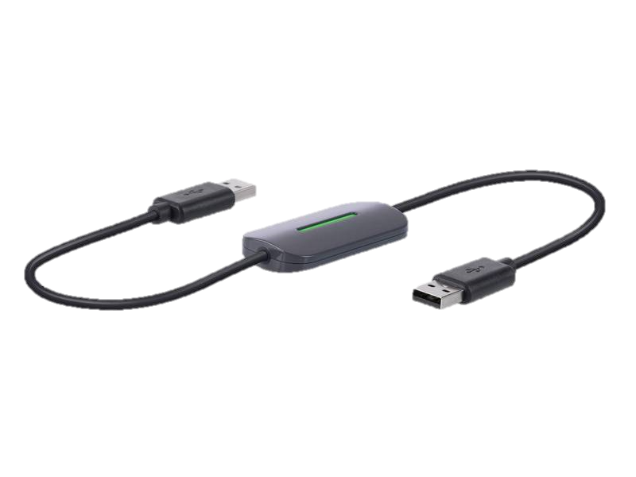
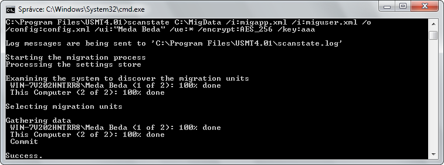
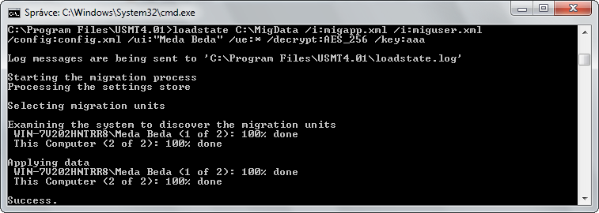

<!-- _class: title -->
<!-- _header: '' -->

# Desktop systémy Microsoft Windows

## IW1

Jan Pluskal\
pluskal@vut.cz

Fakulta informačních technologií\
Vysoké učení technické v Brně\
Božetěchova 2, 612 66 Brno

---

<!-- _class: section -->

# Instalace

<!-- header: 'Desktop systémy Microsoft Windows Instalace' -->

---

# Edice Windows 10

- Baseline
  - Windows 10 Home
  - Windows 10 Pro
  - Windows 10 Pro for Workstations
- Organizational
  - Windows 10 Enterprise, Enterprise LTSC
  - Windows 10 Education, Pro Education
    - Enterprise edice určená pro školy a univerzity
- Již ukončené
  - Windows 10 Mobile, Mobile Enterprise, IoT Mobile, S, 10x

<!--
Windows 10 Education
 - dříve shodná s Enterprise, nyní s drobnými omezeními (nelze vytvořit ReFS/Resilient File System)

Windows 10 Mobile (Enterprise) - ukončena
Náhrada Windows RT a Windows Phone 8.1

Windows RT byla edice určená pro 32-bitové ARM procesory.
Windows 10 IoT Core lze používat např. na Raspberry Pi nebo Microsoft HoloLens.

Window 10 S
Verze podporující instalaci aplikací pouze MS Store, ukončena, nahrazena možností zapnout „S mode“ v Home/Pro

Windows 10x
Zrušen a vydán později jako Windows 11.
-->

---

# Podpora Windows 10

<!-- REVIEW: podpora Windows 10 skončila 14. 10. 2025 (dál jen placené ESU) – rozhodnout,
     zda slide přepsat do minulého času / na ESU, nebo Windows 10 z přednášky vypustit. -->

- Do verze 21H2 byly 2 updaty za rok (semi-annual)
- Od 21H2 je plánován pouze 1 feature update za rok (annual update cadence)
- Podpora nejméně do Říjen 14, 2025
- <https://learn.microsoft.com/en-us/lifecycle/products/windows-10-home-and-pro>

---

# Windows 10 Home

- Podpora maximálně 1 procesoru
  - Libovolný počet jader
- Umí využít maximálně 4 GB paměti (32-bitová verze) nebo 128 GB paměti (64-bitová verze)
- Nelze připojit do domény
- Vícejazyčné uživatelské rozhraní
- Podpora prostorů úložišť (storage spaces)
- Podpora Windows Hello a Microsoft Passport
- Podpora Device Encryption

<!--
Limit 4 GB paměti je omezení dané 32-bitovou architekturou.
Prostory úložišť částečně nahrazují funkcionalitu dynamických disků.
Device Encryption je šifrování postavené na technologii BitLockeru, ale s omezenou funkcionalitou. Device Encryption například nepodporuje některé formy ochrany šifrovacího klíče (PIN, heslo, síť, …) nebo správu šifrovacích klíčů přes Active Directory. Klíč pro obnovu je zde uložen na OneDrive. Device Encryption neumožňuje šifrovat externí disky nebo SD karty.
Od Windows 8.1 je Device Encryption k dispozici ve všech edicích Windows a ve výchozím nastavení je povoleno, pokud počítač splňuje všechny požadavky (UEFI, 64-bit systém, TPM, Connected Stand-By).
Microsoft Passport je nová (preferovaná) forma (dvoufaktorové) autentizace, jejíž cílem je nahradit hesla. Tato autentizace svazuje konkrétní zařízení s Windows Hello (biometrie) nebo PINem.
-->

---

# Windows 10 Pro

- Podpora až 2 procesorů (libovolný počet jader)
- Umí využít maximálně 4 GB paměti (32-bitová verze) nebo 2 TB paměti (64-bitová verze)
- Lze připojit do domény (podpora zásad skupiny)
- Klientské Hyper-V (jen u 64-bitové verze se SLAT)
- Podporuje bootování z virtuálních disků a služby
  - Server vzdálené plochy (Remote Desktop Host)
  - Windows Information Protection
  - EFS, BitLocker a BitLocker To Go

<!--
Second Level Address Translation (SLAT) je systém překladu adres využívající vnořené tabulky stránek v procesoru, přesněji v Memory Management Unit (MMU).
Klient vzdálené plochy je k dispozici ve všech edicích Windows 10.
Windows Information Protection (dříve Enterprise Data Protection) je systém ochrany firemních dat. Tento systém monitoruje data, jenž byla označena za firemní. Firemní data jsou šifrována a i v případě, že jsou zkopírována na jiné zařízení. Firemní data lze nechat vzdáleně vymazat (např. při odchodu uživatele z firmy nebo při odcizení zařízení). Lze specifikovat aplikace, které budou mít přístup k firemním datům (lze například i zamezit kopírovaní dat přes schránku).
XP Mode již není u Windows 8/10 Pro k dispozici, jelikož Windows (Microsoft) Virtual PC, ve kterém XP Mode běžel, není k dispozici pro systém Windows 8/10. U Windows 8/10 byl nahrazen klientským Hyper-V.
-->

---

# Windows 10 Enterprise

- Edice Windows určená pro podnikové nasazení
  - Vyžaduje volume licencování
- Podporuje navíc řadu enterprise služeb
  - Windows To Go a AppLocker
  - DirectAccess a BranchCache
  - Credential Guard a Device Guard
  - Application Sideload
  - Virtual Desktop Infrastructure (VDI) vylepšení

<!--
Credential Guard izoluje pověření dříve ukládaná v Local Security Authority (LSA) procesu ve virtualizované části systému, kde běží jen LSA a několik základních služeb systému nutných pro zabezpečení ukládaných dat. Pouze LSA proces může komunikovat s izolovanou verzí LSA a přistupovat k uloženým pověřením, žádné další části systému (ani aplikace) nemají k těmto informacím přístup. Vyžaduje Hyper-V.
Device Guard izoluje Code Integrity službu (službu, které určuje jaký kód může běžet) od jádra systému. Zda kód může běžet se rozhoduje na základě jeho digitálního podpisu, pokud byl podepsán důvěryhodným certifikátem, pak může běžet, jinak nikoliv. Tato ochrana je aktivní už při startu počítače a znemožňuje tedy virům a malwaru infiltrovat systém před nebo během jeho startu.

Application Sideload umožňuje instalovat apps bez nutnosti jejich publikace a stažení z Windows Store. Umožňuje tedy nasazovat např. aplikace interně vyvíjené pro potřeby dané firmy. Tyto aplikace jsou ve formě .appx balíčků. Tuto službu šlo za poplatek aktivovat také ve Windows 8 Pro, od Windows 8.1 Pro je aktivována zdarma jakmile je počítač připojen do domény.
Virtual Desktop Infrastructure (VDI) umožňuje uživatelům připojit se vzdáleně k počítači nebo virtuálnímu stroji. VDI vylepšení přidávají podporu 3D grafiky, přesměrování USB zařízení a umožňují používat dotyková zařízení.

Podpora pro Linuxové aplikace (SUA, Services for Unix-based Applications) byla přesunuta do samostatného instalačního balíku, jenž lze stáhnout z webu MS a nainstalovat do Windows 8 Enterprise. Windows 10 Anniversary Update přišel s podporou Linuxu vestavěnou do systému Windows, přesněji obsahuje základní verzi Ubuntu ke kterému se přistupuje přes bash terminál (lze spouštět i grafické aplikace po dodatečné konfiguraci).

Windows To Go is removed in Windows 10, version 2004 and later operating systems.
-->

---

# Edice Windows 11

<!-- REVIEW: Windows 11 Enterprise LTSC 2024 už vyšla (verze 24H2) – „plan na 2024“ aktualizovat. -->

- Baseline
  - Windows 11 Home
  - Windows 11 Pro
  - Windows 11 Pro for Workstations
- Organizational
  - Windows 11 Enterprise, Enterprise LTSC (plan na 2024)
  - Windows 11 Education, Pro Education
    - Enterprise edice určená pro školy a univerzity

---

# Podpora Windows 11

- Plánován je pouze 1 feature update za rok (annual update cadence)
- Home, Pro, Pro for Workstations a Pro Education edice podpora 24 měsíců
- Enterprise a Education podpora 36 měsíců

---

# Hardwarové nároky – Windows 10

|                        | 32-bitová verze                                                                              | 64-bitová verze          |
| ---------------------- | -------------------------------------------------------------------------------------------- | ------------------------ |
| Procesor               | 1 GHz (s PAE, NX a SSE2)                                                                     | 1 GHz (s PAE, NX a SSE2) |
| Paměť                  | 2 GB (1 GB při upgradu)                                                                      | 2 GB                     |
| Disk                   | 16 GB                                                                                        | 20 GB                    |
| Grafická karta         | Podpora Direct X 9.0 Ovladač podporující WDDM 1.0/1.1/1.2 (Windows Display Driver Model) |                          |
| Zabezpečené spouštění  | Firmware s podporou technologie UEFI, TPM - Volitelné                                        |                          |

- <https://www.microsoft.com/en-us/windows/windows-10-specifications>

<!--
No-eXecute (NX) je technologie, která umožňuje procesoru označit stránky paměti jako nespustitelné (non-executable) a používá se hlavně k ochraně před útoky škodlivého softwaru. Funkce systému Windows pro ochranu proti malwaru (např. Windows Defender) vyžadují pro svou činnost procesor s podporou NX.
Physical Address Extension (PAE) umožňuje 32-bitovým procesorům zpřístupnit více než 4 GB RAM. Bohužel 32-bitová verze Windows nedovolí využít více než 4 GB paměti, ani když je k dispozici PAE. Tento limit je možné zrušit úpravou systémových souborů, což ovšem může ovlivnit stabilitu systému (některé starší nebo špatně napsané ovladače mohou přistupovat přímo do paměti a předpokládat, že se používá pro její adresaci 32 bitů, což při použití PAE neplatí) a také je to porušení podmínek používání systému Windows. Důvodem, proč je vyžadována podpora PAE i přesto, že nelze standardně využít více jak 4GB paměti je to, že bez PAE nefunguje NX (64. bit je NX bit).

Ovladač grafické karty by měl nejlépe podporovat WDDM 1.2 (podporován od Windows 8), ale jsou podporovány i všechny starší verze 1.1 (Windows 7) a 1.0 (Windows Vista).

Zabezpečené spouštění (Secure Boot, Trusted Boot) zabraňuje spouštění neautorizovaného (škodlivého) kódu během spouštění počítače a je k dispozici ve všech edicích Windows 10.
-->

---

# Hardwarové nároky – Windows 11

|                        | 64-bitová verze                                                                      |
| ---------------------- | ------------------------------------------------------------------------------------ |
| Procesor               | 1 GHz (s PAE, NX a SSE2), 2 nebo více jader                                          |
| Paměť                  | 4 GB                                                                                 |
| Disk                   | 64 GB                                                                                |
| Grafická karta         | Podpora Direct X 12 Ovladač podporující WDDM 2.0 (Windows Display Driver Model)   |
| Zabezpečené spouštění  | Firmware s podporou technologie UEFI, TPM 2.0 - vyžadováno                           |
| Připojení k internetu  | Home vyžaduje Microsoft Account pro první spuštění                                   |

- <https://learn.microsoft.com/en-us/windows/whats-new/windows-11-requirements>

---

# Instalační zdroje (1)

- DVD
  - Podpora bootování z externí USB DVD mechaniky
- USB (Flash) disk
  - Rychlejší čtení (oproti DVD)
  - Možnost úpravy bitové kopie operačního systému
  - Doporučuje se používat souborový systém FAT32
  - GPT / MBR pozor na typ
- Sdílený adresář v síti
  - Instalace pomocí Windows PE
  - Zatěžuje síťový provoz

<!--
Při použití USB (Flash) disku jako instalačního zdroje je lepší používat souborový systém FAT32, jelikož firmware počítače (BIOS nebo UEFI) musí být schopen tento disk přečíst, aby z něj mohl nabootovat a spustit instalaci. UEFI zatím podporuje pouze souborový systém FAT32, většina BIOSů sice podporuje i souborový systém NTFS, ale ani zde to není pravidlem. Při použití souborového systému NTFS by tedy nemusel být USB (Flash) disk pro řadu počítačů čitelný a nemohl by být tedy použit pro instalaci Windows 10/11!
Pro vytvoření instalačního DVD nebo USB (Flash) disku ze staženého Windows 10 ISO souboru lze použít nástroj Windows 7 USB/DVD Download Tool. Instalační DVD lze také vytvořit vypálením ISO souboru pomocí systému Windows (Windows 7, 8 i 10 obsahují podporu pro vypalování DVD).
-->

---

# Instalační zdroje (2)

- Windows Deployment Services (WDS)
  - Vyžaduje Windows Server a funkční doménu
  - Skupinové vysílání (multicast) pro přenos dat
  - Počítač musí být vybaven PXE-kompatibilní síťovou kartou (případně lze použít WDS Discover Image)

<!--
WDS je jedna z rolí Windows Server.
-->

---

# Metody instalace

- Standardní instalace
  - Informace potřebné pro konfiguraci systému jsou získány od uživatele během instalace
- Bezobslužná instalace
  - Informace potřebné pro konfiguraci systému jsou uloženy v souboru odpovědí (answer file)

---

# Soubory odpovědí

- Soubory ve formátu XML
- Standardně soubor s názvem Unattend.xml
  - Instalátor předpokládá umístění souboru s tímto názvem v kořenovém adresáři úložných zařízení USB
- Pro vytváření a úpravy lze použít Windows SIM (Windows System Image Manager)
  - Ověřuje validitu souborů odpovědí
  - Součást Windows ADK (Windows Assessment and Deployment Kit)
- Jsou dostupné i alternativy…

<!--
Dříve byly soubory odpovědí v INI formátu.
Windows ADK lze stáhnout jedině pomocí online instalátoru (k dispozici na stránkách MS). Tento instalátor má velikost pár MB, instalace všech částí Windows ADK ovšem vyžaduje stažení cca. 4 GB dat!
Windows ADK není k dispozici jako ISO soubor pro offline instalaci, offline instalace Windows ADK se provádí s využitím online instalátoru, který umožňuje stáhnout instalační soubory a uložit je na disk, instalační soubory lze pak jednoduše překopírovat na cílový počítač a spustit na něm offline instalaci.
Pokud soubor odpovědí obsahuje chybu, selže instalace.

https://www.windowsafg.com/win10x86_x64_uefi.html
-->

---

# Windows System Image Manager

<!--
Sekce vlevo dole (Windows Image) obsahuje informace o komponentách a balíčcích, jenž lze přidat do souborů odpovědí. Tyto informace jsou uloženy v tzv. katalogu (souboru s příponou .clg), jenž byl v dřívějších verzích Windows (Windows 7 a Vista) součástí instalačního média. U Windows 8 již katalog není součástí instalačního média a musí být vytvořen nástrojem WSIM při otevření WIM souboru, což nelze provést, pokud je WIM soubor umístěn na médiu určenému pouze pro čtění (např. ISO soubor nebo instalační DVD). V tomto případě je potřeba zkopírovat WIM soubor na médium, na které lze zapisovat (disk, flash disk, ...). 64-bitová verze WSIM umí vytvářet katalogy pouze pro WIM soubory s 64-bitovou verzí systému Windows, pro vytvoření katalogů pro WIM soubory s 32-bitovou verzí nebo verzí pro ARM (Windows RT) je potřeba použít 32-bitovou verzi WSIM (jež umí vytvářet katalogy i pro WIM soubory s 64-bitovou verzí systému Windows).
-->

---

# Instalace

- Instalace dodatečných ovladačů
  - Podpora instalace z USB (Flash) disků
  - Lze integrovat do bitové kopie systému
- Volba edice
  - Vybrána automaticky na základě předchozí instalace Windows nebo ručně v seznamu přítomných edicí
    - Automatický výběr lze obejít specifikací edice v souboru ei.cfg v adresáři Sources v bitové kopii
- První přidaný uživatel je výchozí správce počítače
  - Účet Administrator je ve výchozím nastavení zakázán

<!--
Dříve šlo instalovat dodatečné ovladače pouze z diskety.
Kromě ovladačů lze do bitové kopie systému také integrovat aktualizace systému, servisní balíky nebo aplikace.
Lokální účet je možné také svázat s účtem Microsoft. Výhodou je možnost synchronizace řady informací mezi účty stejného uživatele na různých počítačích (např. stolním PC, notebooku a tabletu).
Účet uživatele Administrator lze povolit přes zásady skupiny, ale nedoporučuje se to (známý název účtu s oprávněními správce, na který se často útočí).
-->

---

# Instalace na virtuální pevný disk

- Probíhá stejně jako standardní instalace
  - Po dokončení instalace je nový systém automaticky přidán do bootovací nabídky (boot menu)
    - Musí být edice Pro či Enterprise, jinak nepůjde nabootovat
- Před instalací je potřeba
  - Vytvořit virtuální pevný disk (.vhd/.vhdx soubor)
    - Lze využít nástroje Správa disků nebo diskpart
  - Zpřístupnit virtuální pevný disk instalátoru
    - Připojení .vhd/.vhdx souboru pomocí nástroje diskpart
    - Spuštění příkazové řádky v instalátoru zkratkou Shift+F10

<!--
Dnes se často instalují operační systémy na virtuální pevné disky.
U Windows 7 musely být informace o systému, nainstalovaném na virtuální pevný disk, přidány do bootovací nabídky manuálně pomocí nástroje bcdedit.
Bootovat z virtuálního pevného disku lze jen edice Pro a Enterprise, nelze takto nabootovat edici Home (pravděpodobně dojde k chybě "License error: Booting from a vhd is not supported on this system", jenž to hlásilo při pokusu o nabootovavání Windows 7 edicí, které nepodporují bootování z virtuálního pevného disku neboli Native VHD Boot).
V Hyper-V lze ale nabootovat jakoukoliv edici Windows z virtuálního pevného disku.
Virtuální pevný disk může být připraven buď dopředu (mimo instalátor) pomocí nástrojů Správa disků nebo diskpart nebo těsně před instalací (a připojením virtuálního pevného disku) v příkazové řádce instalátoru pomocí nástroje diskpart (jenž se pak stejně musí použít pro připojení virtuálního pevného disku).
Druhou možností instalace systému Windows na virtuální pevný disk je aplikace bitové kopie systému Windows na virtuální pevný disk pomocí nástroje dism nebo akcelerátoru MDT (více v pozdějších přednáškách).
-->

---

# Instalace Windows To Go

<!-- REVIEW: Windows To Go bylo odstraněno ve Windows 10 2004 a ve Windows 11 neexistuje –
     rozhodnout, zda oba slidy (Instalace / Omezení Windows To Go) nechat jako historii, nebo vypustit. -->

- Instalace Windows 10 na USB (Flash) disk
  - USB (Flash) disk musí mít velikost alespoň 32 GB
  - Při startu systému může být potřeba nainstalovat ovladače pro hardware použitého počítače
- Provádí se přes průvodce Vytvořit pracovní prostor Windows To Go
  - K dispozici pouze u edice Windows 10 Enterprise (pre 2004)
    - Lze spustit z Ovládacích panelů (položka Windows To Go)
  - Vyžaduje přítomnost instalačního média

<!--
Některé USB (Flash) disky nemusí být kompatibilní s Windows To Go i přesto, že mají velikost 32 GB nebo vyšší. Windows To Go totiž vyžaduje také například dostatečnou propustnost čtení a zápisů. Zda je USB (Flash) disk kompatibilní s Windows To Go lze dohledat v seznamu na webu MS (viz. odkaz na wiki). USB (Flash) disky, jenž nejsou v tomto seznamu uvedeny, mohou být stále kompatibilní, ale není to zaručeno.
Druhou možností instalace systému Windows 10 na USB (Flash) disk je přímá aplikace bitové kopie systému Windows na USB (Flash) disk pomocí nástroje dism (více v pozdějších přednáškách) a manuální úprava bootovací nabídky pomocí nástroje bcdedit.
-->

---

# Omezení Windows To Go

- Režimy spánku a hibernace jsou zakázány
  - Lze povolit přes zásady skupiny nebo registr
- Interní disky jsou nepřístupné (ve stavu offline)
- Nelze používat TPM čip (důležité pro BitLocker)
- Windows Recovery Environment není k dispozici
- Nelze obnovit do továrního nastavení (reset)
- Nelze spustit na ARM systémech

---

# Dual-Boot instalace

- Starší systémy Windows
  - Instalovat Windows 10/11 až jako poslední systém
- Windows 7, 8 a 10
  - Bootování systému z virtuálního pevného disku
- Linux
  - Instalovat Windows 10/11 před instalací systému Linux
- Výchozí operační systém
  - Lze změnit v části Spuštění a zotavení systému
  - Lze změnit příkazem `bcdedit /default <identifikátor>`

<!--
Seznam operačních systémů lze vypsat příkazem bcdedit /enum.
-->

---

# Aktivace

- Proces ověření licenčního klíče firmou Microsoft
  - Přes internet
    - Automaticky jakmile je detekováno připojení k síti internet
    - Manuálně pomocí grafického nástroje Aktivace Windows
    - Manuálně příkazem `slmgr.vbs /ato`
  - Přes telefon
    - Manuálně pomocí grafického nástroje Aktivace Windows
- Pokud nebyl při instalaci zadán licenční klíč
  - Nutno zadat do 30 dnů od data instalace a aktivovat
    - Lze až 3x resetovat (příkazem `slmgr.vbs /rearm`)

<!--
Nástroje Aktivace Windows je přístupný přes Ovládací panely\Systém (desktop) nebo Nastavení počítače.

Kromě prvotní aktivace se v periodických intervalech provádí také tzv. validace, neboli ověření pravosti Windows. Pokud nebude validace úspěšná, nelze stahovat aktualizace (s výjimkou kritických) a do 30 dnů dojde k zablokování počítače.
-->

---

# Identifikace počítače při aktivaci

- Generování jednoznačného otisku počítače (tzv. Installation ID) ze dvou identifikátorů:
  - Hardware ID ‒ vytvořen na základě unikátních čísel zařízení daného počítače (základní deska, CPU, …)
    - Může se změnit při výměně hardwaru počítače
  - Product ID ‒ vygenerován z licenčního klíče (product key) použitého pro instalaci systému Windows
    - Mění se při změně licenčního klíče (změnu licenčního klíče lze provést např. příkazem `slmgr.vbs /ipk <licenční-klíč>`)
  - Aktivace proběhne potvrzením tohoto otisku

<!--
Při změnách HW se musí provádět reaktivace (většinou proběhne automaticky), při větších změnách nemusí být možná a musí se volat na Microsoft.
-->

---

<!-- _class: section -->

# Upgrade

<!-- header: 'Desktop systémy Microsoft Windows Upgrade' -->

---

# Upgrade edice Windows

- Provádí se zadáním nového licenčního klíče
  - Upgrade Windows 10/11 Home na Windows 10/11 Pro
- Nelze provést upgrade na jinou verzi Windows (32-bitovou verzi na 64-bitovou a naopak)
  - Platí také pro upgrade ze starších systémů Windows

<!--
32-bitová a 64-bitová verze používají odlišné HAL vrstvy, proto nelze provádět upgrade z jedné verze na druhou.
-->

---

# Upgrade na Windows 10

<!-- REVIEW: upgrade Windows 7/8/8.1 → 10 je po EOL Windows 10 (10/2025) historie (platí i pro
     následující tabulku Možnosti upgradu) – rozhodnout, zda nechat, zkrátit, nebo nahradit upgradem 10 → 11. -->

- Upgrade lze provést z Windows 7, 8 nebo 8.1
  - Vždy pouze na stejné nebo vyšší edice
- Jakmile je upgrade dokončen
  - Původní systém přesunut do adresáře Windows.old
  - Návrat k původnímu systému přes Nastavení, sekce Obnova (prvních 10 dní po upgradu) nebo reinstalací
- Aplikace Windows 10 Upgrade Checker
  - Zjištění nekompatibilních aplikací
  - Zjištění problematických zařízení

<!--
Roll Back Upgrade, jenž šlo použít k návratu k původnímu systému u Windows 7, není u Windows 8 a 10 k dispozici.
U Windows 10 se lze přes sekci Obnova vrátit i k předchozímu buildu Windows 10.
Pro úspěšný návrat k původnímu systému musí být kromě Windows.old přítomny také adresáře $Windows.~BT a $Windows.~WS.
Windows 10 Upgrade Assistant je součástí instalátoru Windows 10.
-->

---

<!-- _class: dense -->

# Možnosti upgradu na Windows 10

| Výchozí OS         | Cílový OS         | Instalační médium | Windows Update |
| ------------------ | ----------------- | :---------------: | :------------: |
| Windows 7 RTM      | Windows 10        |         ✔         |       ✘        |
| Windows 7 SP1      | Windows 10        |         ✔         |       ✔        |
| Windows 8          | Windows 10        |         ✔         |       ✘        |
| Windows 8.1 RTM    | Windows 10        |         ✔         |       ✘        |
| Windows 8.1 Update | Windows 10        |         ✔         |       ✔        |
| Windows RT         | -                 |         ✘         |       ✘        |
| Windows Phone 8.0  | -                 |         ✘         |       ✘        |
| Windows Phone 8.1  | Windows 10 Mobile |         ✘         |       ✔        |

| Výchozí edice pro upgrade                          | Cílová edice          |
| -------------------------------------------------- | --------------------- |
| Windows 7 Starter/Home Basic/Home Premium, 8, 8.1  | Windows 10 Home / Pro |
| Windows 7 Professional/Ultimate, 8/8.1 Pro         | Windows 10 Pro        |
| Windows 7/8/8.1 Enterprise                         | Windows 10 Enterprise |

---

# Možnosti upgradu na Windows 11

- Pouze z aktuální verze Windows 10
- Update je zdarma
- Zařízení musí splňovat minimální požadavky!

---

<!-- _class: section -->

# Migrace uživatelských dat

<!-- header: 'Desktop systémy Microsoft Windows Migrace uživatelských dat' -->

---

# Migrace uživatelských dat

<!-- REVIEW: ověřit, zda je PCmover Express přes odkaz Microsoftu stále zdarma; Windows 11 má od
     2025 vestavěný přenos na nový PC (aplikace Windows Backup) – zvážit doplnění mezi nástroje. -->

- Přenos souborů z jednoho systému na druhý
  - Oba systémy mohou být na stejném počítači
- Možné typy migrace
  - Side-by-Side
  - Wipe-and-Load
- Nástroje pro migraci
  - (Windows Easy Transfer (WET)) před Windows 10
  - [PCmover Express](http://go.microsoft.com/fwlink/?linkid=620915) zdarma pro osobní použití
  - User State Migration Tool (USMT)

---

# Side-by-Side migrace

- Migrace dat mezi dvěma systémy (počítači)
- Může probíhat přes dočasné úložiště i přímo
- Data pořád zůstávají na zdrojovém počítači
- Lze použít v případě dual-boot instalace

<figure><figcaption>Zdrojový počítač</figcaption></figure>
① ⟶
<figure><figcaption>Dočasné úložiště</figcaption></figure>
① ⟶
<figure><figcaption>Cílový počítač</figcaption></figure>

② ⟶

① Migrace přes dočasné úložiště ② Přímá migrace ze zdrojového počítače na cílový počítač

---

# Wipe-and-Load migrace

- Export dat do dočasného úložiště
- Čistá instalace systému
- Import dat do nového systému
- Data, která nebyla exportována, jsou ztracena
- Lze použít pro změnu verze systému Windows

<figure><figcaption>Zdrojový a cílový počítač</figcaption>②</figure>
① ⟶ ⟵ ③
<figure><figcaption>Dočasné úložiště</figcaption></figure>

---

<!-- _class: dense -->

# Windows Easy Transfer

<!-- REVIEW: Windows Easy Transfer je nástroj z Windows 7/8, ve Windows 10/11 neexistuje – rozhodnout,
     zda tento a následující slide (screenshot) nechat jako historický kontext, nebo vypustit. -->

- Nástroj pro snadnou migraci uživatelských dat na počítače na kterých běží Windows 8
  - Součást Windows 7 a 8 a instalátoru Windows 8
- Umožňuje migraci z Windows XP a novějších
  - Přímá side-by-side migrace (síť, Easy Transfer kabel)
  - Wipe-and-load migrace přes datové úložiště
- Ve Windows 10 byl odstraněn, lze nahradit
  - Laplink PCmover Express (oficiální náhrada)
  - Zinstall Easy Transfer
  - Bravura Easy Computer Sync …

<!--
U Windows XP i Windows Vista je potřeba nejdříve nainstalovat Windows Easy Transfer.
Instalace Windows Easy Transfer může být provedena v rámci procesu migrace (výběr umístění v průvodci).
Přítomnost Windows Easy Transfer (WET) v instalátoru Windows 8 umožňuje provádět upgrade i z Windows XP, jelikož se může provést instalace Windows 8 zároveň s migrací uživatelských dat pomocí WET, což vypadá jako upgrade systému a dříve se muselo dělat zvlášť.
Spárování počítačů při migraci přes síť se provádí na základě sdíleného hesla.
Datové úložiště může být HDD, Flash disk nebo sdílený adresář. Data lze chránit heslem.
Na cílovém počítači lze nastavit mapování uživatelských účtů a diskových jednotek.
Laplink Pcmover Express šlo během prvního roku po vydání Windows 10 používat zdarma, pak Microsoft poskytoval 50% slevu na jeho nákup. Nyní je pro osobní použití zdarma (PC nesmí být v doméně).

Cenově 25-50€ za kabel, 25€ za SW, často společně
-->

---

# Nástroj Windows Easy Transfer

---

# User State Migration Tool (USMT)

- Nástroj pro automatizaci migrace uživatelských dat
- Součást Windows ADK
- Neumožňuje přímou Side-by-Side migraci, data musí jít přes dočasné úložiště (HDD, Flash disk, sdílený adresář)
- Dva základní příkazy
  - ScanState pro export dat
  - LoadState pro import dat

<!--
Windows ADK (Windows Assessment and Deployment Kit) obsahuje kromě Deployment Tools a USMT také např. Application Compatibility Toolkit (ACT) nebo Windows Performance Toolkit (WPT, PAL, XPERF).
-->

---

# Přenos dat

- Přenáší se
  - Uživatelské účty
  - Uživatelské soubory
  - Nastavení systému
  - Nastavení aplikací
  - Vybrané soubory a složky
- Všechny soubory a adresáře si zachovávají svá přístupová oprávnění (migrace ACL seznamů)
  - Netýká se sdílení

<!--
Aplikace musí být již nainstalována na cílovém počítači, aby se přenesla její nastavení.
-->

---

# Možnosti a konfigurace

- Umožňuje zpětnou migraci dat z Windows 10/11 na Windows Vista, 7, a 8 (na Windows XP nelze)
- Konfigurace pomocí XML souborů
  - MigApp.xml
  - MigUser.xml
  - MigDocs.xml
  - Config.xml

---

# Základní konfigurační soubory (1)

- MigApp.xml
  - Obsahuje informace pro migraci nastavení aplikací
  - Zahrnuje nastavení řady služeb a aplikací systému
- MigUser.xml
  - Obsahuje informace pro migraci uživatelských účtů a uživatelských dat (informace která data migrovat)
  - Výběr uživatelských účtů, které mají být migrovány, se provádí pomocí příkazů ScanState a LoadState

---

# Základní konfigurační soubory (2)

- MigDocs.xml
  - Obsahuje informace pro migraci všech dokumentů nalezených v kořenových adresářích všech diskových oddílů a v adresáři Users
  - Nedoporučuje se používat s MigUsers.xml
- Config.xml
  - Lze využít pro vyloučení specifických komponent, aplikací a dokumentů uživatelů z migrace
  - Generování seznamu všech migrovaných komponent a aplikací pomocí `ScanState /genconfig`

---

# Další možnosti

- Lze definovat vlastní konfigurační soubory
- Možnost přesměrování umístění jednotlivých adresářů, typů souborů nebo specifických souborů na cílovém počítači
- Podporuje šifrování migrovaných dat
  - Data chráněna heslem
- Existuje neoficiální nástroj USMT GUI
  - <http://usmtgui.ehler.dk>

<!--
Většinou je lepší nevytvářet úplně nové konfigurační soubory, ale spíše upravit konfigurační soubory dodávané s USMT (nejčastěji MigUser.xml a MigApp.xml).
-->

---

# ScanState

- Sesbírání a uložení definovaných uživatelských dat
- Příklad migrace dat konkrétního uživatele

---

# LoadState

- Obnovení definovaných uživatelských dat
- Příklad obnovení dat konkrétního uživatele
- Lze použít také `UsmtUtils /extract`

<!--
UsmtUtils /extract by se měl používat v případě, že se LoadState nepodaří data obnovit.
-->

---

# Typy úložišť dat (1)

- Nekomprimované úložiště
  - Kopíruje adresářovou strukturu ukládaných dat
  - Lze jednoduše procházet pomocí správce souborů
- Komprimované úložiště
  - Data jsou uložena v jediném souboru
  - Úložiště může být šifrované
  - Ověření validity obsažených souborů a katalogu
    - `UsmtUtils /verify:{all|catalog|failureonly} <úložiště-dat>`

---

# Typy úložišť dat (2)

- Hard-link úložiště
  - Kopíruje adresářovou strukturu ukládaných dat, ale ve formě odkazů (hard-linků) na tato data
    - Existuje pouze jedna (původní) kopie dat
    - Data se nikde nepřesouvají
  - Lze použít jen u Wipe-and-Load migrace při upgradu operačního systému v rámci stejného svazku disku
    - Nelze migrovat data na jiný svazek disku (např. z C: na D:)
    - Během upgradu nesmí být odstraněno úložiště dat (např. zformátováním svazku, jenž obsahuje úložiště dat)

<!--
Migrace s využitím hard-link úložiště se také používá u PC refresh (reinstalace Windows se zachováním uživatelských dat), kdy není potřeba uživatelská data nikam přesouvat, ale je potřeba pouze vědět, která data mají být migrována po reinstalaci Windows (tyto informace poskytují právě vytvořené hard-linky).
-->

---

# Offline migrace

- Spuštění ScanState v prostředí Windows PE
  - LoadState nelze v prostředí Windows PE spustit
- Nelze použít pro disky chráněné technologií BitLocker (během migrace potřeba vypnout)
- Nejsou potřeba oprávnění správce
- Lze použít u Windows XP a novějších

<!--
ScanState v offline režimu lze použít také pro sesbírání a uložení dat v adresáři Windows.old (přepínač /OfflineWinOld).
-->
