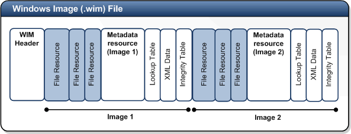
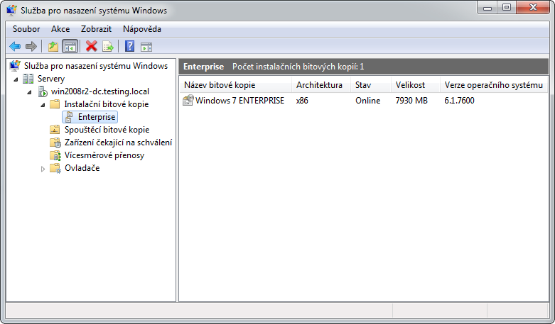
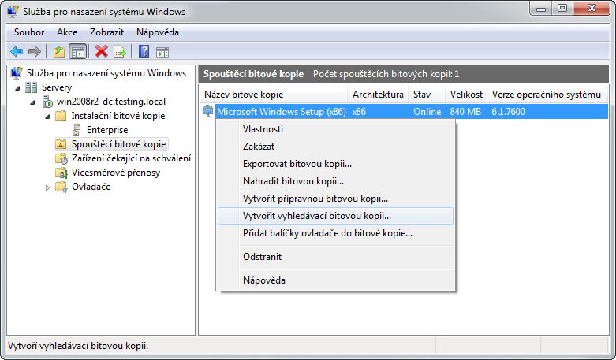
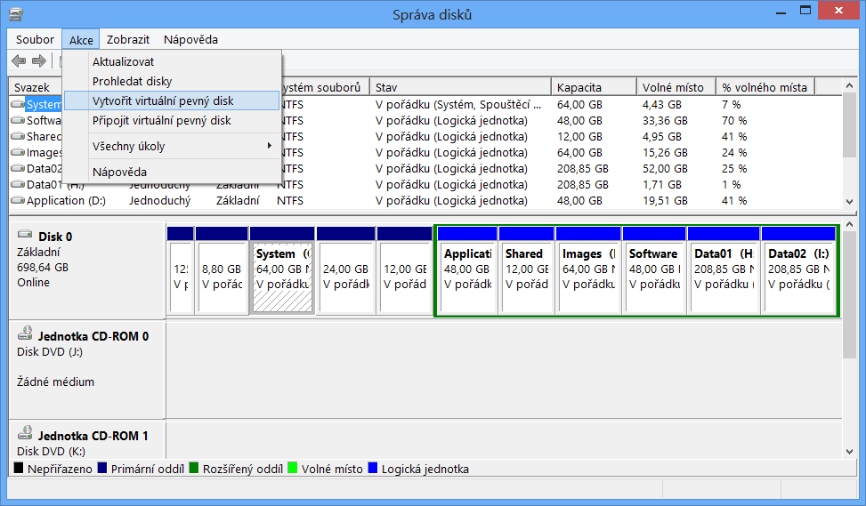
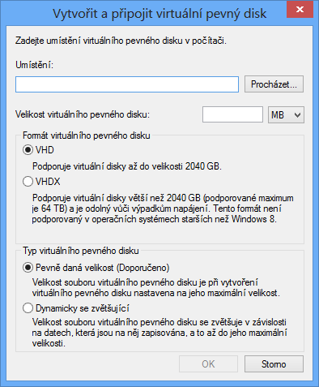
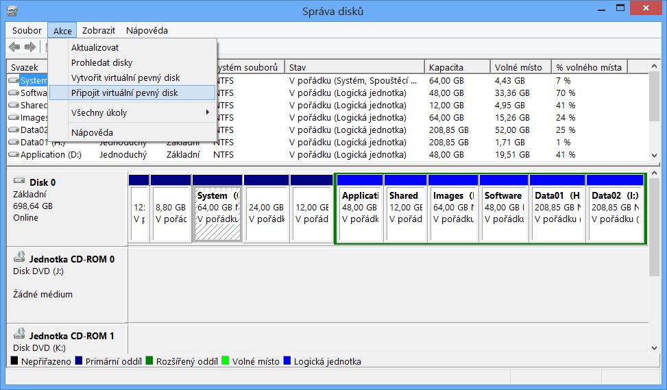
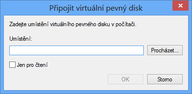

<!-- _class: title -->
<!-- _header: '' -->

# Desktop systémy Microsoft Windows

## IW1

Jan Pluskal\
pluskal@vut.cz

Fakulta informačních technologií\
Vysoké učení technické v Brně\
Božetěchova 2, 612 66 Brno

---

<!-- _class: section -->

# Vytváření bitových kopií systému

<!-- header: 'Desktop systémy Microsoft Windows Vytváření bitových kopií systému' -->

---

# Nástroje pro vytváření bitových kopií

- Všechny nástroje jsou součástí Windows ADK
- DISM (Deployment Image Servicing and Management)
  - Nástroj pro správu (vytváření, úpravu a nasazování) bitových kopií systému (Windows images)
- Sysprep (System Preparation)
  - Nástroj pro přípravu systému Windows pro zachycení (capture) do bitové kopie systému (Windows image)
- Copype a MakeWinPEMedia
  - Nástroje pro přípravu předinstalačního prostředí systému Windows (Windows PE)

<!-- Nástroje DISM, Sysprep a Copype byly dříve součástí WAIK (Windows Automated Installation Kit). S příchodem Windows 8 byl ovšem WAIK rozšířen o další nástroje a přejmenován na Windows ADK (Windows Assessment and Deployment Kit). -->

---

# Vytvoření referenční bitové kopie

- Příprava referenčního počítače
  - Instalace a konfigurace systému
  - Instalace ovladačů a aplikací
- Zobecnění počítače (generalization)
  - Odstranění údajů specifických pro daný počítač
- Spuštění Windows PE
- Zachycení referenční bitové kopie a její uložení

---

# Vytvoření referenční bitové kopie

- **Příprava referenčního počítače** *(obsah první přednášky)*
  - **Instalace a konfigurace systému**
  - **Instalace ovladačů a aplikací**
- Zobecnění počítače (generalization)
  - Odstranění údajů specifických pro daný počítač
- Spuštění Windows PE
- Zachycení referenční bitové kopie a její uložení

---

# Vytvoření referenční bitové kopie

- Příprava referenčního počítače
  - Instalace a konfigurace systému
  - Instalace ovladačů a aplikací
- **Zobecnění počítače (generalization)**
  - **Odstranění údajů specifických pro daný počítač**
- Spuštění Windows PE
- Zachycení referenční bitové kopie a její uložení

---

# Sysprep

- Nástroj pro přípravu instalace systému Windows na zachycení (capture) nebo doručení uživateli
- Odstraňuje informace unikátní pro každý počítač
- Pro spuštění jsou potřeba oprávnění správce
- Vždy může běžet pouze jediná instance Sysprep
- Vždy vázán na konkrétní verzi systému Windows
  - Nelze použít Sysprep z Windows 8 ve Windows 10
  - Umístěn v adresáři `<windows>\System32\Sysprep`

<!-- Sysprep není v Total Commanderu a jiných 32-bitových správcích souborů na 64-bitovém OS vidět ve <windows>\System32\Sysprep, jelikož nefunguje folder redirection, který automaticky přesměrovává do <windows>\Sysnative\Sysprep.

Příprava instalace systému Windows na doručení uživateli znamená dostat systém Windows do stavu, kdy je dokončena instalace i konfigurace systému Windows a zbývá pouze zadat posledních pár informací, jenž zná pouze uživatel (např. název počítače, názvy uživatelů, jenž budou daný systém používat, atd.). V tomto stavu se často nacházejí notebooky s předinstalovaným systémem. -->

---

<!-- _class: dense -->
<!-- header: 'Desktop systémy Microsoft Windows Sysprep' -->

# Přepínače

| Přepínač | Popis |
| --- | --- |
| `/generalize` | Připraví instalaci systému Windows na zachycení |
| `/oobe` | Restartuje počítač do Windows Welcome režimu |
| `/audit` | Restartuje počítač do Audit režimu |
| `/reboot` | Restartuje počítač |
| `/shutdown` | Vypne počítač |
| `/unattend:<soubor.xml>` | Aplikuje nastavení ze zadaného souboru odpovědí (název nesmí být Autounattend.xml) |

<!-- Sysprep /oobe /shutdown připraví počítač na doručení uživateli. -->

---

# Sysprep /generalize

- Před ukončením systému
  - Odstraní všechny unikátní informace v systému
  - Resetuje SID identifikátor počítače
  - Smaže body obnovení systému
  - Smaže protokoly událostí
- Při příštím startu systému
  - Vytvoří nový SID identifikátor
  - Resetuje dobu aktivace Windows (pouze pokud ještě nebyla 3x resetována, neplatí pro KMS klienty)

<!-- KMS (Key Management Services) klienti jsou klienti, kterým KMS poskytuje volume licence. -->

---

# Audit režim

- Umožňuje modifikaci systému před zachycením
  - Instalace ovladačů
  - Instalace aplikací
- Neprovádí se uživatelská konfigurace systému po dokončení instalace nebo úpravy systému
  - Přeskočení (ignorování) Windows Welcome
  - Přeskočení přípravy plochy, inicializace profilu apod.
- Vhodný pro ověření instalace před nasazením na klientské počítače

---

# Windows Welcome režim

- Poslední část instalace systému Windows
  - Přijmutí licenčních podmínek
  - Vytvoření uživatelských účtů
  - Pojmenování počítače
  - …
- Často označován jako Machine OOBE (out-of-box experience)
- Pomocí CTRL+SHIFT+F3 na úvodní obrazovce lze přepnout do Audit režimu

---

# Informace o činnosti nástroje Sysprep

- Podrobné informace o činnosti nástroje Sysprep (včetně chyb) uloženy v protokolech (log files)
- Uložení protokolů týkajících se
  - Zobecňování počítače (generalize)
    - V adresáři `<windows>\System32\Sysprep\Panther`
  - Specializace počítače (specialize)
    - V adresáři `<windows>\Panther`
  - Bezobslužné instalace Windows
    - V adresáři `<windows>\Panther\Unattendgc`

---

<!-- header: 'Desktop systémy Microsoft Windows Vytváření bitových kopií systému' -->

# Konfigurační průchody

- Fáze instalace systému Windows
- V každém průchodu aplikace nastavení z určitých sekcí souboru odpovědí
  - Řadu nastavení lze aplikovat pouze v určitých fázích
    - Možnost ověření pomocí Windows SIM
  - Řadu nastavení lze aplikovat v jedné nebo více fázích
- Celkem 7 konfiguračních průchodů
  - Instalace může procházet jen některými z nich

---

<!-- header: 'Desktop systémy Microsoft Windows Konfigurační průchody' -->

# Průchody a jejich obvyklé návaznosti

<svg class="passes" viewBox="0 0 1000 440" xmlns="http://www.w3.org/2000/svg" role="img" aria-label="Konfigurační průchody a jejich obvyklé návaznosti">
<defs><marker id="arrow" viewBox="0 0 10 10" refX="9" refY="5" markerWidth="8" markerHeight="8" orient="auto-start-reverse"><path d="M 0 0 L 10 5 L 0 10 z"/></marker></defs>
<text class="lbl" x="180" y="28" text-anchor="middle">Windows PE</text>
<text class="lbl" x="510" y="28" text-anchor="middle">Instalace</text>
<text class="lbl" x="835" y="28" text-anchor="middle">Sysprep</text>
<g class="box"><rect x="40" y="40" width="280" height="80" rx="12"/><text x="180.0" y="74" text-anchor="middle">windowsPE</text><text x="180.0" y="104" text-anchor="middle" class="sub">(nastavení Windows PE)</text></g>
<g class="box"><rect x="370" y="40" width="280" height="80" rx="12"/><text x="510.0" y="74" text-anchor="middle">windowsPE</text><text x="510.0" y="104" text-anchor="middle" class="sub">(nastavení instalace)</text></g>
<g class="box"><rect x="415" y="150" width="190" height="50" rx="12"/><text x="510.0" y="183.0" text-anchor="middle">offlineServicing</text></g>
<g class="box"><rect x="415" y="230" width="190" height="50" rx="12"/><text x="510.0" y="263.0" text-anchor="middle">specialize</text></g>
<g class="box"><rect x="415" y="380" width="190" height="50" rx="12"/><text x="510.0" y="413.0" text-anchor="middle">oobeSystem</text></g>
<g class="box"><rect x="740" y="40" width="190" height="80" rx="12"/><text x="835.0" y="88.0" text-anchor="middle">generalize</text></g>
<g class="box"><rect x="740" y="280" width="190" height="50" rx="12"/><text x="835.0" y="313.0" text-anchor="middle">auditSystem</text></g>
<g class="box"><rect x="740" y="332" width="190" height="50" rx="12"/><text x="835.0" y="365.0" text-anchor="middle">auditUser</text></g>
<line x1="320" y1="80" x2="368" y2="80" marker-end="url(#arrow)"/>
<line x1="510" y1="120" x2="510" y2="148" marker-end="url(#arrow)"/>
<line x1="510" y1="200" x2="510" y2="228" marker-end="url(#arrow)"/>
<line x1="510" y1="280" x2="510" y2="378" marker-end="url(#arrow)"/>
<line x1="835" y1="120" x2="608" y2="250" marker-end="url(#arrow)"/>
<line x1="605" y1="262" x2="835" y2="278" marker-end="url(#arrow)"/>
<line x1="740" y1="360" x2="608" y2="402" marker-end="url(#arrow)"/>
<g class="num"><circle cx="60" cy="165" r="15"/><text class="n" x="60" y="172" text-anchor="middle">1</text><text class="name" x="90" y="173">windowsPE</text></g>
<g class="num"><circle cx="60" cy="203" r="15"/><text class="n" x="60" y="210" text-anchor="middle">2</text><text class="name" x="90" y="211">offlineServicing</text></g>
<g class="num"><circle cx="60" cy="241" r="15"/><text class="n" x="60" y="248" text-anchor="middle">3</text><text class="name" x="90" y="249">specialize</text></g>
<g class="num"><circle cx="60" cy="279" r="15"/><text class="n" x="60" y="286" text-anchor="middle">4</text><text class="name" x="90" y="287">generalize</text></g>
<g class="num"><circle cx="60" cy="317" r="15"/><text class="n" x="60" y="324" text-anchor="middle">5</text><text class="name" x="90" y="325">auditSystem</text></g>
<g class="num"><circle cx="60" cy="355" r="15"/><text class="n" x="60" y="362" text-anchor="middle">6</text><text class="name" x="90" y="363">auditUser</text></g>
<g class="num"><circle cx="60" cy="393" r="15"/><text class="n" x="60" y="400" text-anchor="middle">7</text><text class="name" x="90" y="401">oobeSystem</text></g>
</svg>

---

# windowsPE

<svg class="passes" viewBox="0 0 1000 440" xmlns="http://www.w3.org/2000/svg" role="img" aria-label="Konfigurační průchody a jejich obvyklé návaznosti">
<defs><marker id="arrow" viewBox="0 0 10 10" refX="9" refY="5" markerWidth="8" markerHeight="8" orient="auto-start-reverse"><path d="M 0 0 L 10 5 L 0 10 z"/></marker></defs>
<text class="lbl" x="180" y="28" text-anchor="middle">Windows PE</text>
<text class="lbl" x="510" y="28" text-anchor="middle">Instalace</text>
<text class="lbl" x="835" y="28" text-anchor="middle">Sysprep</text>
<g class="box hl"><rect x="40" y="40" width="280" height="80" rx="12"/><text x="180.0" y="74" text-anchor="middle">windowsPE</text><text x="180.0" y="104" text-anchor="middle" class="sub">(nastavení Windows PE)</text></g>
<g class="box hl"><rect x="370" y="40" width="280" height="80" rx="12"/><text x="510.0" y="74" text-anchor="middle">windowsPE</text><text x="510.0" y="104" text-anchor="middle" class="sub">(nastavení instalace)</text></g>
<g class="box"><rect x="415" y="150" width="190" height="50" rx="12"/><text x="510.0" y="183.0" text-anchor="middle">offlineServicing</text></g>
<g class="box"><rect x="415" y="230" width="190" height="50" rx="12"/><text x="510.0" y="263.0" text-anchor="middle">specialize</text></g>
<g class="box"><rect x="415" y="380" width="190" height="50" rx="12"/><text x="510.0" y="413.0" text-anchor="middle">oobeSystem</text></g>
<g class="box"><rect x="740" y="40" width="190" height="80" rx="12"/><text x="835.0" y="88.0" text-anchor="middle">generalize</text></g>
<g class="box"><rect x="740" y="280" width="190" height="50" rx="12"/><text x="835.0" y="313.0" text-anchor="middle">auditSystem</text></g>
<g class="box"><rect x="740" y="332" width="190" height="50" rx="12"/><text x="835.0" y="365.0" text-anchor="middle">auditUser</text></g>
<line x1="320" y1="80" x2="368" y2="80" marker-end="url(#arrow)"/>
<line x1="510" y1="120" x2="510" y2="148" marker-end="url(#arrow)"/>
<line x1="510" y1="200" x2="510" y2="228" marker-end="url(#arrow)"/>
<line x1="510" y1="280" x2="510" y2="378" marker-end="url(#arrow)"/>
<line x1="835" y1="120" x2="608" y2="250" marker-end="url(#arrow)"/>
<line x1="605" y1="262" x2="835" y2="278" marker-end="url(#arrow)"/>
<line x1="740" y1="360" x2="608" y2="402" marker-end="url(#arrow)"/>
<g class="num hl"><circle cx="60" cy="165" r="15"/><text class="n" x="60" y="172" text-anchor="middle">1</text><text class="name" x="90" y="173">windowsPE</text></g>
<g class="num"><circle cx="60" cy="203" r="15"/><text class="n" x="60" y="210" text-anchor="middle">2</text><text class="name" x="90" y="211">offlineServicing</text></g>
<g class="num"><circle cx="60" cy="241" r="15"/><text class="n" x="60" y="248" text-anchor="middle">3</text><text class="name" x="90" y="249">specialize</text></g>
<g class="num"><circle cx="60" cy="279" r="15"/><text class="n" x="60" y="286" text-anchor="middle">4</text><text class="name" x="90" y="287">generalize</text></g>
<g class="num"><circle cx="60" cy="317" r="15"/><text class="n" x="60" y="324" text-anchor="middle">5</text><text class="name" x="90" y="325">auditSystem</text></g>
<g class="num"><circle cx="60" cy="355" r="15"/><text class="n" x="60" y="362" text-anchor="middle">6</text><text class="name" x="90" y="363">auditUser</text></g>
<g class="num"><circle cx="60" cy="393" r="15"/><text class="n" x="60" y="400" text-anchor="middle">7</text><text class="name" x="90" y="401">oobeSystem</text></g>
</svg>

---

<!-- header: 'Desktop systémy Microsoft Windows windowsPE' -->

# Doba běhu a prováděné akce

- Běží
  - Po nabootování instalace Windows z média
  - Po spuštění instalace Windows z předchozí instalace
- Během tohoto průchodu
  - Dochází ke zkopírování bitové kopie systému na cílový počítač
- Aplikují se nastavení ze souboru odpovědí
  - Sekce `<settings pass="windowsPE">`

---

# Možnosti konfigurace

- Lze provádět
  - Konfiguraci Windows PE nastavení
    - Pouze pokud je instalace spuštěna z Windows PE
    - Přidání ovladačů do skladu ovladačů Windows PE
    - Uložení souborů protokolů, povolení sítě, …
  - Konfiguraci nastavení instalace systému Windows
    - Výběr bitové kopie systému, příprava pevného disku, …
  - …

---

<!-- header: 'Desktop systémy Microsoft Windows Konfigurační průchody' -->

# offlineServicing

<svg class="passes" viewBox="0 0 1000 440" xmlns="http://www.w3.org/2000/svg" role="img" aria-label="Konfigurační průchody a jejich obvyklé návaznosti">
<defs><marker id="arrow" viewBox="0 0 10 10" refX="9" refY="5" markerWidth="8" markerHeight="8" orient="auto-start-reverse"><path d="M 0 0 L 10 5 L 0 10 z"/></marker></defs>
<text class="lbl" x="180" y="28" text-anchor="middle">Windows PE</text>
<text class="lbl" x="510" y="28" text-anchor="middle">Instalace</text>
<text class="lbl" x="835" y="28" text-anchor="middle">Sysprep</text>
<g class="box"><rect x="40" y="40" width="280" height="80" rx="12"/><text x="180.0" y="74" text-anchor="middle">windowsPE</text><text x="180.0" y="104" text-anchor="middle" class="sub">(nastavení Windows PE)</text></g>
<g class="box"><rect x="370" y="40" width="280" height="80" rx="12"/><text x="510.0" y="74" text-anchor="middle">windowsPE</text><text x="510.0" y="104" text-anchor="middle" class="sub">(nastavení instalace)</text></g>
<g class="box hl"><rect x="415" y="150" width="190" height="50" rx="12"/><text x="510.0" y="183.0" text-anchor="middle">offlineServicing</text></g>
<g class="box"><rect x="415" y="230" width="190" height="50" rx="12"/><text x="510.0" y="263.0" text-anchor="middle">specialize</text></g>
<g class="box"><rect x="415" y="380" width="190" height="50" rx="12"/><text x="510.0" y="413.0" text-anchor="middle">oobeSystem</text></g>
<g class="box"><rect x="740" y="40" width="190" height="80" rx="12"/><text x="835.0" y="88.0" text-anchor="middle">generalize</text></g>
<g class="box"><rect x="740" y="280" width="190" height="50" rx="12"/><text x="835.0" y="313.0" text-anchor="middle">auditSystem</text></g>
<g class="box"><rect x="740" y="332" width="190" height="50" rx="12"/><text x="835.0" y="365.0" text-anchor="middle">auditUser</text></g>
<line x1="320" y1="80" x2="368" y2="80" marker-end="url(#arrow)"/>
<line x1="510" y1="120" x2="510" y2="148" marker-end="url(#arrow)"/>
<line x1="510" y1="200" x2="510" y2="228" marker-end="url(#arrow)"/>
<line x1="510" y1="280" x2="510" y2="378" marker-end="url(#arrow)"/>
<line x1="835" y1="120" x2="608" y2="250" marker-end="url(#arrow)"/>
<line x1="605" y1="262" x2="835" y2="278" marker-end="url(#arrow)"/>
<line x1="740" y1="360" x2="608" y2="402" marker-end="url(#arrow)"/>
<g class="num"><circle cx="60" cy="165" r="15"/><text class="n" x="60" y="172" text-anchor="middle">1</text><text class="name" x="90" y="173">windowsPE</text></g>
<g class="num hl"><circle cx="60" cy="203" r="15"/><text class="n" x="60" y="210" text-anchor="middle">2</text><text class="name" x="90" y="211">offlineServicing</text></g>
<g class="num"><circle cx="60" cy="241" r="15"/><text class="n" x="60" y="248" text-anchor="middle">3</text><text class="name" x="90" y="249">specialize</text></g>
<g class="num"><circle cx="60" cy="279" r="15"/><text class="n" x="60" y="286" text-anchor="middle">4</text><text class="name" x="90" y="287">generalize</text></g>
<g class="num"><circle cx="60" cy="317" r="15"/><text class="n" x="60" y="324" text-anchor="middle">5</text><text class="name" x="90" y="325">auditSystem</text></g>
<g class="num"><circle cx="60" cy="355" r="15"/><text class="n" x="60" y="362" text-anchor="middle">6</text><text class="name" x="90" y="363">auditUser</text></g>
<g class="num"><circle cx="60" cy="393" r="15"/><text class="n" x="60" y="400" text-anchor="middle">7</text><text class="name" x="90" y="401">oobeSystem</text></g>
</svg>

---

<!-- header: 'Desktop systémy Microsoft Windows offlineServicing' -->

# Doba běhu a prováděné akce

- Běží
  - Automaticky po dokončení průchodu windowsPE než je proveden restart počítače
  - Po spuštění `dism /Apply-Unattend:<soubor.xml>`
- Během tohoto průchodu
  - Dochází k aplikaci bitové kopie systému na oddíl disku
- Aplikují se nastavení ze souboru odpovědí
  - Sekce `<settings pass="offlineServicing">`
  - Sekce `<servicing>`

---

# Možnosti konfigurace

- Lze provádět
  - Integraci aktualizací, balíků nebo jazykových balíků do bitové kopie systému
  - Přidávání ovladačů do bitové kopie systému
  - …

---

<!-- header: 'Desktop systémy Microsoft Windows Konfigurační průchody' -->

# specialize

<svg class="passes" viewBox="0 0 1000 440" xmlns="http://www.w3.org/2000/svg" role="img" aria-label="Konfigurační průchody a jejich obvyklé návaznosti">
<defs><marker id="arrow" viewBox="0 0 10 10" refX="9" refY="5" markerWidth="8" markerHeight="8" orient="auto-start-reverse"><path d="M 0 0 L 10 5 L 0 10 z"/></marker></defs>
<text class="lbl" x="180" y="28" text-anchor="middle">Windows PE</text>
<text class="lbl" x="510" y="28" text-anchor="middle">Instalace</text>
<text class="lbl" x="835" y="28" text-anchor="middle">Sysprep</text>
<g class="box"><rect x="40" y="40" width="280" height="80" rx="12"/><text x="180.0" y="74" text-anchor="middle">windowsPE</text><text x="180.0" y="104" text-anchor="middle" class="sub">(nastavení Windows PE)</text></g>
<g class="box"><rect x="370" y="40" width="280" height="80" rx="12"/><text x="510.0" y="74" text-anchor="middle">windowsPE</text><text x="510.0" y="104" text-anchor="middle" class="sub">(nastavení instalace)</text></g>
<g class="box"><rect x="415" y="150" width="190" height="50" rx="12"/><text x="510.0" y="183.0" text-anchor="middle">offlineServicing</text></g>
<g class="box hl"><rect x="415" y="230" width="190" height="50" rx="12"/><text x="510.0" y="263.0" text-anchor="middle">specialize</text></g>
<g class="box"><rect x="415" y="380" width="190" height="50" rx="12"/><text x="510.0" y="413.0" text-anchor="middle">oobeSystem</text></g>
<g class="box"><rect x="740" y="40" width="190" height="80" rx="12"/><text x="835.0" y="88.0" text-anchor="middle">generalize</text></g>
<g class="box"><rect x="740" y="280" width="190" height="50" rx="12"/><text x="835.0" y="313.0" text-anchor="middle">auditSystem</text></g>
<g class="box"><rect x="740" y="332" width="190" height="50" rx="12"/><text x="835.0" y="365.0" text-anchor="middle">auditUser</text></g>
<line x1="320" y1="80" x2="368" y2="80" marker-end="url(#arrow)"/>
<line x1="510" y1="120" x2="510" y2="148" marker-end="url(#arrow)"/>
<line x1="510" y1="200" x2="510" y2="228" marker-end="url(#arrow)"/>
<line x1="510" y1="280" x2="510" y2="378" marker-end="url(#arrow)"/>
<line x1="835" y1="120" x2="608" y2="250" marker-end="url(#arrow)"/>
<line x1="605" y1="262" x2="835" y2="278" marker-end="url(#arrow)"/>
<line x1="740" y1="360" x2="608" y2="402" marker-end="url(#arrow)"/>
<g class="num"><circle cx="60" cy="165" r="15"/><text class="n" x="60" y="172" text-anchor="middle">1</text><text class="name" x="90" y="173">windowsPE</text></g>
<g class="num"><circle cx="60" cy="203" r="15"/><text class="n" x="60" y="210" text-anchor="middle">2</text><text class="name" x="90" y="211">offlineServicing</text></g>
<g class="num hl"><circle cx="60" cy="241" r="15"/><text class="n" x="60" y="248" text-anchor="middle">3</text><text class="name" x="90" y="249">specialize</text></g>
<g class="num"><circle cx="60" cy="279" r="15"/><text class="n" x="60" y="286" text-anchor="middle">4</text><text class="name" x="90" y="287">generalize</text></g>
<g class="num"><circle cx="60" cy="317" r="15"/><text class="n" x="60" y="324" text-anchor="middle">5</text><text class="name" x="90" y="325">auditSystem</text></g>
<g class="num"><circle cx="60" cy="355" r="15"/><text class="n" x="60" y="362" text-anchor="middle">6</text><text class="name" x="90" y="363">auditUser</text></g>
<g class="num"><circle cx="60" cy="393" r="15"/><text class="n" x="60" y="400" text-anchor="middle">7</text><text class="name" x="90" y="401">oobeSystem</text></g>
</svg>

---

<!-- header: 'Desktop systémy Microsoft Windows specialize' -->

# Doba běhu a prováděné akce

- Běží
  - Automaticky při prvním nabootování systému
  - Při příštím nabootování po spuštění příkazu `sysprep /generalize`
- Během tohoto průchodu
  - Se vytváří a aplikují systémově-specifické informace
- Aplikují se nastavení ze souboru odpovědí
  - Sekce `<settings pass="specialize">`

---

# Možnosti konfigurace

<!-- REVIEW: Internet Explorer je od r. 2022 vyřazen (komponenta Microsoft-Windows-IE-InternetExplorer
     v souboru odpovědí ale stále existuje) – rozhodnout, zda položku ponechat nebo nahradit jiným příkladem. -->

- Lze provádět
  - Konfiguraci řady funkcí systému Windows
    - Nastavení sítě
    - Nastavení oblasti, jazyka apod.
    - Nastavení domény
    - Nastavení Windows Internet Explorer
    - …
  - Spouštění příkazů a skriptů (Microsoft-Windows-Deployment | RunSynchronous)
  - …

---

<!-- header: 'Desktop systémy Microsoft Windows Konfigurační průchody' -->

# generalize

<svg class="passes" viewBox="0 0 1000 440" xmlns="http://www.w3.org/2000/svg" role="img" aria-label="Konfigurační průchody a jejich obvyklé návaznosti">
<defs><marker id="arrow" viewBox="0 0 10 10" refX="9" refY="5" markerWidth="8" markerHeight="8" orient="auto-start-reverse"><path d="M 0 0 L 10 5 L 0 10 z"/></marker></defs>
<text class="lbl" x="180" y="28" text-anchor="middle">Windows PE</text>
<text class="lbl" x="510" y="28" text-anchor="middle">Instalace</text>
<text class="lbl" x="835" y="28" text-anchor="middle">Sysprep</text>
<g class="box"><rect x="40" y="40" width="280" height="80" rx="12"/><text x="180.0" y="74" text-anchor="middle">windowsPE</text><text x="180.0" y="104" text-anchor="middle" class="sub">(nastavení Windows PE)</text></g>
<g class="box"><rect x="370" y="40" width="280" height="80" rx="12"/><text x="510.0" y="74" text-anchor="middle">windowsPE</text><text x="510.0" y="104" text-anchor="middle" class="sub">(nastavení instalace)</text></g>
<g class="box"><rect x="415" y="150" width="190" height="50" rx="12"/><text x="510.0" y="183.0" text-anchor="middle">offlineServicing</text></g>
<g class="box"><rect x="415" y="230" width="190" height="50" rx="12"/><text x="510.0" y="263.0" text-anchor="middle">specialize</text></g>
<g class="box"><rect x="415" y="380" width="190" height="50" rx="12"/><text x="510.0" y="413.0" text-anchor="middle">oobeSystem</text></g>
<g class="box hl"><rect x="740" y="40" width="190" height="80" rx="12"/><text x="835.0" y="88.0" text-anchor="middle">generalize</text></g>
<g class="box"><rect x="740" y="280" width="190" height="50" rx="12"/><text x="835.0" y="313.0" text-anchor="middle">auditSystem</text></g>
<g class="box"><rect x="740" y="332" width="190" height="50" rx="12"/><text x="835.0" y="365.0" text-anchor="middle">auditUser</text></g>
<line x1="320" y1="80" x2="368" y2="80" marker-end="url(#arrow)"/>
<line x1="510" y1="120" x2="510" y2="148" marker-end="url(#arrow)"/>
<line x1="510" y1="200" x2="510" y2="228" marker-end="url(#arrow)"/>
<line x1="510" y1="280" x2="510" y2="378" marker-end="url(#arrow)"/>
<line x1="835" y1="120" x2="608" y2="250" marker-end="url(#arrow)"/>
<line x1="605" y1="262" x2="835" y2="278" marker-end="url(#arrow)"/>
<line x1="740" y1="360" x2="608" y2="402" marker-end="url(#arrow)"/>
<g class="num"><circle cx="60" cy="165" r="15"/><text class="n" x="60" y="172" text-anchor="middle">1</text><text class="name" x="90" y="173">windowsPE</text></g>
<g class="num"><circle cx="60" cy="203" r="15"/><text class="n" x="60" y="210" text-anchor="middle">2</text><text class="name" x="90" y="211">offlineServicing</text></g>
<g class="num"><circle cx="60" cy="241" r="15"/><text class="n" x="60" y="248" text-anchor="middle">3</text><text class="name" x="90" y="249">specialize</text></g>
<g class="num hl"><circle cx="60" cy="279" r="15"/><text class="n" x="60" y="286" text-anchor="middle">4</text><text class="name" x="90" y="287">generalize</text></g>
<g class="num"><circle cx="60" cy="317" r="15"/><text class="n" x="60" y="324" text-anchor="middle">5</text><text class="name" x="90" y="325">auditSystem</text></g>
<g class="num"><circle cx="60" cy="355" r="15"/><text class="n" x="60" y="362" text-anchor="middle">6</text><text class="name" x="90" y="363">auditUser</text></g>
<g class="num"><circle cx="60" cy="393" r="15"/><text class="n" x="60" y="400" text-anchor="middle">7</text><text class="name" x="90" y="401">oobeSystem</text></g>
</svg>

---

<!-- header: 'Desktop systémy Microsoft Windows generalize' -->

# Doba běhu a prováděné akce

- Běží
  - Při nastavení Microsoft-Windows-Deployment | Generalize v souboru odpovědí
  - Po spuštění `sysprep /generalize`
- Během tohoto průchodu
  - Se odstraňují systémově-specifické informace
- Aplikují se nastavení ze souboru odpovědí
  - Sekce `<settings pass="generalize">`

---

# Možnosti konfigurace

- Lze provádět
  - Konfiguraci nastavení systému Windows, jenž mají být ponechána v referenční bitové kopii systému
  - Ponechání ovladačů zařízení v referenční bitové kopii systému specifikací nastavení Microsoft-Windows-PnpSysprep | PersistAllDeviceInstalls
  - Přeskočení resetování doby aktivace Windows ve fázi specialize specifikací nastavení Microsoft-Windows-Security-Licensing-SLC | SkipRearm
  - …

---

<!-- header: 'Desktop systémy Microsoft Windows Konfigurační průchody' -->

# auditSystem

<svg class="passes" viewBox="0 0 1000 440" xmlns="http://www.w3.org/2000/svg" role="img" aria-label="Konfigurační průchody a jejich obvyklé návaznosti">
<defs><marker id="arrow" viewBox="0 0 10 10" refX="9" refY="5" markerWidth="8" markerHeight="8" orient="auto-start-reverse"><path d="M 0 0 L 10 5 L 0 10 z"/></marker></defs>
<text class="lbl" x="180" y="28" text-anchor="middle">Windows PE</text>
<text class="lbl" x="510" y="28" text-anchor="middle">Instalace</text>
<text class="lbl" x="835" y="28" text-anchor="middle">Sysprep</text>
<g class="box"><rect x="40" y="40" width="280" height="80" rx="12"/><text x="180.0" y="74" text-anchor="middle">windowsPE</text><text x="180.0" y="104" text-anchor="middle" class="sub">(nastavení Windows PE)</text></g>
<g class="box"><rect x="370" y="40" width="280" height="80" rx="12"/><text x="510.0" y="74" text-anchor="middle">windowsPE</text><text x="510.0" y="104" text-anchor="middle" class="sub">(nastavení instalace)</text></g>
<g class="box"><rect x="415" y="150" width="190" height="50" rx="12"/><text x="510.0" y="183.0" text-anchor="middle">offlineServicing</text></g>
<g class="box"><rect x="415" y="230" width="190" height="50" rx="12"/><text x="510.0" y="263.0" text-anchor="middle">specialize</text></g>
<g class="box"><rect x="415" y="380" width="190" height="50" rx="12"/><text x="510.0" y="413.0" text-anchor="middle">oobeSystem</text></g>
<g class="box"><rect x="740" y="40" width="190" height="80" rx="12"/><text x="835.0" y="88.0" text-anchor="middle">generalize</text></g>
<g class="box hl"><rect x="740" y="280" width="190" height="50" rx="12"/><text x="835.0" y="313.0" text-anchor="middle">auditSystem</text></g>
<g class="box"><rect x="740" y="332" width="190" height="50" rx="12"/><text x="835.0" y="365.0" text-anchor="middle">auditUser</text></g>
<line x1="320" y1="80" x2="368" y2="80" marker-end="url(#arrow)"/>
<line x1="510" y1="120" x2="510" y2="148" marker-end="url(#arrow)"/>
<line x1="510" y1="200" x2="510" y2="228" marker-end="url(#arrow)"/>
<line x1="510" y1="280" x2="510" y2="378" marker-end="url(#arrow)"/>
<line x1="835" y1="120" x2="608" y2="250" marker-end="url(#arrow)"/>
<line x1="605" y1="262" x2="835" y2="278" marker-end="url(#arrow)"/>
<line x1="740" y1="360" x2="608" y2="402" marker-end="url(#arrow)"/>
<g class="num"><circle cx="60" cy="165" r="15"/><text class="n" x="60" y="172" text-anchor="middle">1</text><text class="name" x="90" y="173">windowsPE</text></g>
<g class="num"><circle cx="60" cy="203" r="15"/><text class="n" x="60" y="210" text-anchor="middle">2</text><text class="name" x="90" y="211">offlineServicing</text></g>
<g class="num"><circle cx="60" cy="241" r="15"/><text class="n" x="60" y="248" text-anchor="middle">3</text><text class="name" x="90" y="249">specialize</text></g>
<g class="num"><circle cx="60" cy="279" r="15"/><text class="n" x="60" y="286" text-anchor="middle">4</text><text class="name" x="90" y="287">generalize</text></g>
<g class="num hl"><circle cx="60" cy="317" r="15"/><text class="n" x="60" y="324" text-anchor="middle">5</text><text class="name" x="90" y="325">auditSystem</text></g>
<g class="num"><circle cx="60" cy="355" r="15"/><text class="n" x="60" y="362" text-anchor="middle">6</text><text class="name" x="90" y="363">auditUser</text></g>
<g class="num"><circle cx="60" cy="393" r="15"/><text class="n" x="60" y="400" text-anchor="middle">7</text><text class="name" x="90" y="401">oobeSystem</text></g>
</svg>

---

<!-- header: 'Desktop systémy Microsoft Windows auditSystem' -->

# Doba běhu a prováděné akce

- Běží
  - Při nastavení Microsoft-Windows-Deployment | Reseal | Mode=Audit v souboru odpovědí
  - Po spuštění `sysprep /audit`
- Během tohoto průchodu
  - Dochází k aplikaci systémových nastavení na systém v Audit režimu před přihlášením prvního uživatele
- Aplikují se nastavení ze souboru odpovědí
  - Sekce `<settings pass="auditSystem">`

---

# Možnosti konfigurace

- Lze provádět
  - Dodatečnou konfiguraci nainstalovaného systému
  - Instalaci ovladačů
  - …

---

<!-- header: 'Desktop systémy Microsoft Windows Konfigurační průchody' -->

# auditUser

<svg class="passes" viewBox="0 0 1000 440" xmlns="http://www.w3.org/2000/svg" role="img" aria-label="Konfigurační průchody a jejich obvyklé návaznosti">
<defs><marker id="arrow" viewBox="0 0 10 10" refX="9" refY="5" markerWidth="8" markerHeight="8" orient="auto-start-reverse"><path d="M 0 0 L 10 5 L 0 10 z"/></marker></defs>
<text class="lbl" x="180" y="28" text-anchor="middle">Windows PE</text>
<text class="lbl" x="510" y="28" text-anchor="middle">Instalace</text>
<text class="lbl" x="835" y="28" text-anchor="middle">Sysprep</text>
<g class="box"><rect x="40" y="40" width="280" height="80" rx="12"/><text x="180.0" y="74" text-anchor="middle">windowsPE</text><text x="180.0" y="104" text-anchor="middle" class="sub">(nastavení Windows PE)</text></g>
<g class="box"><rect x="370" y="40" width="280" height="80" rx="12"/><text x="510.0" y="74" text-anchor="middle">windowsPE</text><text x="510.0" y="104" text-anchor="middle" class="sub">(nastavení instalace)</text></g>
<g class="box"><rect x="415" y="150" width="190" height="50" rx="12"/><text x="510.0" y="183.0" text-anchor="middle">offlineServicing</text></g>
<g class="box"><rect x="415" y="230" width="190" height="50" rx="12"/><text x="510.0" y="263.0" text-anchor="middle">specialize</text></g>
<g class="box"><rect x="415" y="380" width="190" height="50" rx="12"/><text x="510.0" y="413.0" text-anchor="middle">oobeSystem</text></g>
<g class="box"><rect x="740" y="40" width="190" height="80" rx="12"/><text x="835.0" y="88.0" text-anchor="middle">generalize</text></g>
<g class="box"><rect x="740" y="280" width="190" height="50" rx="12"/><text x="835.0" y="313.0" text-anchor="middle">auditSystem</text></g>
<g class="box hl"><rect x="740" y="332" width="190" height="50" rx="12"/><text x="835.0" y="365.0" text-anchor="middle">auditUser</text></g>
<line x1="320" y1="80" x2="368" y2="80" marker-end="url(#arrow)"/>
<line x1="510" y1="120" x2="510" y2="148" marker-end="url(#arrow)"/>
<line x1="510" y1="200" x2="510" y2="228" marker-end="url(#arrow)"/>
<line x1="510" y1="280" x2="510" y2="378" marker-end="url(#arrow)"/>
<line x1="835" y1="120" x2="608" y2="250" marker-end="url(#arrow)"/>
<line x1="605" y1="262" x2="835" y2="278" marker-end="url(#arrow)"/>
<line x1="740" y1="360" x2="608" y2="402" marker-end="url(#arrow)"/>
<g class="num"><circle cx="60" cy="165" r="15"/><text class="n" x="60" y="172" text-anchor="middle">1</text><text class="name" x="90" y="173">windowsPE</text></g>
<g class="num"><circle cx="60" cy="203" r="15"/><text class="n" x="60" y="210" text-anchor="middle">2</text><text class="name" x="90" y="211">offlineServicing</text></g>
<g class="num"><circle cx="60" cy="241" r="15"/><text class="n" x="60" y="248" text-anchor="middle">3</text><text class="name" x="90" y="249">specialize</text></g>
<g class="num"><circle cx="60" cy="279" r="15"/><text class="n" x="60" y="286" text-anchor="middle">4</text><text class="name" x="90" y="287">generalize</text></g>
<g class="num"><circle cx="60" cy="317" r="15"/><text class="n" x="60" y="324" text-anchor="middle">5</text><text class="name" x="90" y="325">auditSystem</text></g>
<g class="num hl"><circle cx="60" cy="355" r="15"/><text class="n" x="60" y="362" text-anchor="middle">6</text><text class="name" x="90" y="363">auditUser</text></g>
<g class="num"><circle cx="60" cy="393" r="15"/><text class="n" x="60" y="400" text-anchor="middle">7</text><text class="name" x="90" y="401">oobeSystem</text></g>
</svg>

---

<!-- header: 'Desktop systémy Microsoft Windows auditUser' -->

# Doba běhu a prováděné akce

- Běží
  - Při nastavení Microsoft-Windows-Deployment | Reseal | Mode=Audit v souboru odpovědí
  - Po spuštění `sysprep /audit`
- Během tohoto průchodu
  - Dochází k aplikaci uživatelských nastavení na systém v Audit režimu po přihlášení uživatele
- Aplikují se nastavení ze souboru odpovědí
  - Sekce `<settings pass="auditUser">`

---

# Možnosti konfigurace

- Lze provádět
  - Konfiguraci grafického prostředí
  - Konfiguraci uživatelských aplikací
  - Spouštění příkazů a skriptů (Microsoft-Windows-Deployment | RunSynchronous)
  - …

---

<!-- header: 'Desktop systémy Microsoft Windows Konfigurační průchody' -->

# oobeSystem

<svg class="passes" viewBox="0 0 1000 440" xmlns="http://www.w3.org/2000/svg" role="img" aria-label="Konfigurační průchody a jejich obvyklé návaznosti">
<defs><marker id="arrow" viewBox="0 0 10 10" refX="9" refY="5" markerWidth="8" markerHeight="8" orient="auto-start-reverse"><path d="M 0 0 L 10 5 L 0 10 z"/></marker></defs>
<text class="lbl" x="180" y="28" text-anchor="middle">Windows PE</text>
<text class="lbl" x="510" y="28" text-anchor="middle">Instalace</text>
<text class="lbl" x="835" y="28" text-anchor="middle">Sysprep</text>
<g class="box"><rect x="40" y="40" width="280" height="80" rx="12"/><text x="180.0" y="74" text-anchor="middle">windowsPE</text><text x="180.0" y="104" text-anchor="middle" class="sub">(nastavení Windows PE)</text></g>
<g class="box"><rect x="370" y="40" width="280" height="80" rx="12"/><text x="510.0" y="74" text-anchor="middle">windowsPE</text><text x="510.0" y="104" text-anchor="middle" class="sub">(nastavení instalace)</text></g>
<g class="box"><rect x="415" y="150" width="190" height="50" rx="12"/><text x="510.0" y="183.0" text-anchor="middle">offlineServicing</text></g>
<g class="box"><rect x="415" y="230" width="190" height="50" rx="12"/><text x="510.0" y="263.0" text-anchor="middle">specialize</text></g>
<g class="box hl"><rect x="415" y="380" width="190" height="50" rx="12"/><text x="510.0" y="413.0" text-anchor="middle">oobeSystem</text></g>
<g class="box"><rect x="740" y="40" width="190" height="80" rx="12"/><text x="835.0" y="88.0" text-anchor="middle">generalize</text></g>
<g class="box"><rect x="740" y="280" width="190" height="50" rx="12"/><text x="835.0" y="313.0" text-anchor="middle">auditSystem</text></g>
<g class="box"><rect x="740" y="332" width="190" height="50" rx="12"/><text x="835.0" y="365.0" text-anchor="middle">auditUser</text></g>
<line x1="320" y1="80" x2="368" y2="80" marker-end="url(#arrow)"/>
<line x1="510" y1="120" x2="510" y2="148" marker-end="url(#arrow)"/>
<line x1="510" y1="200" x2="510" y2="228" marker-end="url(#arrow)"/>
<line x1="510" y1="280" x2="510" y2="378" marker-end="url(#arrow)"/>
<line x1="835" y1="120" x2="608" y2="250" marker-end="url(#arrow)"/>
<line x1="605" y1="262" x2="835" y2="278" marker-end="url(#arrow)"/>
<line x1="740" y1="360" x2="608" y2="402" marker-end="url(#arrow)"/>
<g class="num"><circle cx="60" cy="165" r="15"/><text class="n" x="60" y="172" text-anchor="middle">1</text><text class="name" x="90" y="173">windowsPE</text></g>
<g class="num"><circle cx="60" cy="203" r="15"/><text class="n" x="60" y="210" text-anchor="middle">2</text><text class="name" x="90" y="211">offlineServicing</text></g>
<g class="num"><circle cx="60" cy="241" r="15"/><text class="n" x="60" y="248" text-anchor="middle">3</text><text class="name" x="90" y="249">specialize</text></g>
<g class="num"><circle cx="60" cy="279" r="15"/><text class="n" x="60" y="286" text-anchor="middle">4</text><text class="name" x="90" y="287">generalize</text></g>
<g class="num"><circle cx="60" cy="317" r="15"/><text class="n" x="60" y="324" text-anchor="middle">5</text><text class="name" x="90" y="325">auditSystem</text></g>
<g class="num"><circle cx="60" cy="355" r="15"/><text class="n" x="60" y="362" text-anchor="middle">6</text><text class="name" x="90" y="363">auditUser</text></g>
<g class="num hl"><circle cx="60" cy="393" r="15"/><text class="n" x="60" y="400" text-anchor="middle">7</text><text class="name" x="90" y="401">oobeSystem</text></g>
</svg>

---

<!-- header: 'Desktop systémy Microsoft Windows oobeSystem' -->

# Doba běhu a prováděné akce

- Běží
  - Při nastavení Microsoft-Windows-Deployment | Reseal | Mode=OOBE v souboru odpovědí
  - Po spuštění `sysprep /oobe`
- Během tohoto průchodu
  - Dochází k aplikaci nastavení na systém před jeho přechodem do Windows Welcome režimu
- Aplikují se nastavení ze souboru odpovědí
  - Sekce `<settings pass="oobeSystem">`

---

# Možnosti konfigurace

- Lze provádět
  - Konfiguraci grafického prostředí
  - Přidávání uživatelských účtů
  - Specifikaci jazyka
  - …

---

<!-- header: 'Desktop systémy Microsoft Windows Vytváření bitových kopií systému' -->

# Vytvoření referenční bitové kopie

- Příprava referenčního počítače
  - Instalace a konfigurace systému
  - Instalace ovladačů a aplikací
- Zobecnění počítače (generalization)
  - Odstranění údajů specifických pro daný počítač
- **Spuštění Windows PE**
- Zachycení referenční bitové kopie a její uložení

---

# Předinstalační prostředí (Windows PE)

<!-- REVIEW: poznámka „ARM verze jen pro Windows 8 (Windows PE 4.0)“ je zastaralá – Windows PE pro ARM64
     je součástí ADK pro Windows 10/11; rozhodnout, zda poznámku aktualizovat. -->

- Windows Preinstallation Environment
- Odlehčená verze systému Windows
  - Dostupná v 32-bitové, 64-bitové a ARM verzi
- Možnosti bootování
  - DVD-ROM nebo USB Flash Disk (nejčastější)
  - Pevný disk (interní, externí nebo virtuální)
  - Preboot Execution Environment (PXE)
- Zahrnuje nástroje pro obnovu systému Windows
  - Windows Recovery Environment (Windows RE)

<!-- ARM verze je k dispozici jen pro Windows 8 (Windows PE 4.0). -->

---

# Příprava Windows PE

<!-- REVIEW: copype v aktuálním ADK podporuje architektury amd64, x86 a arm64 (ne „arm“) –
     rozhodnout, zda výčet aktualizovat. -->

- Spuštění konzole Deployment and Imaging Tools Environment s oprávněními správce
- Vytvoření lokálního adresáře Windows PE
  - `copype <architektura> <adresář>`
    - Podpora architektur x86, amd64 a arm
- Vložení konfiguračního souboru WimScript.ini
  - Integrace do `<adresář>\media\sources\boot.wim`
- Vytvoření ISO obrazu / USB disku s Windows PE
  - `makewinpemedia { /iso | /ufd } <adresář> {<adresář>\winpe.iso | <jednotka-usb-disku>}`

<!-- Většina 64-bitových procesorů spadá pod architekturu amd64, ne jen AMD procesory.

Při vkládání WimScript.ini jeho integrací do boot.wim je dobré dát tento soubor do adresáře, kde je dism, tedy do Windows\System32, aby ho dism automaticky našel.

Druhou možností je vložit WimScript.ini do adresáře <adresář>\tools, obsah tohoto adresáře je automaticky přidán do ISO obrazu / na USB disk s Windows PE.

Pokud dism nenalezne WimScript.ini automaticky, lze použít přepínač /ConfigFile a vybrat ho ručně.

USB diskem je nejčastěji USB flash disk, ale lze použít i externí pevný disk připojený přes USB.

Nástroj MakeWinPEMedia z Windows ADK nahrazuje nástroj Oscdimg z WAIK a oproti Oscdimg umožňuje vytvářet i bootovatelné externí a flash disky s Windows PE a ne pouze ISO soubory pro vypálení na CD/DVD. -->

---

# Vytvoření referenční bitové kopie

- Příprava referenčního počítače
  - Instalace a konfigurace systému
  - Instalace ovladačů a aplikací
- Zobecnění počítače (generalization)
  - Odstranění údajů specifických pro daný počítač
- Spuštění Windows PE
- **Zachycení referenční bitové kopie a její uložení**

---

# Windows Imaging soubory

<!-- REVIEW: .esd z „dism /export-image /Compress:recovery“ je jen silněji komprimovaný, šifrované jsou
     pouze .esd distribuované přes Windows Update – rozhodnout, zda formulaci „šifrovány“ upřesnit. -->

- Soubory s příponou .wim obsahující jednu nebo více bitových kopií (kontejner pro bitové kopie)
  - Identifikace pomocí indexu nebo unikátního názvu
- Mohou být rozděleny do více částí
  - Soubory s příponou .swm (split/spanned .wim)
- Mohou být šifrovány .esd (`dism /export-image`)
- Mohou být připojeny jako nová jednotka
  - Vyžaduje ovladač WimFltr.sys
- Imaging API (Wimgapi.dll)
  - API rozhraní pro práci s .wim soubory

<!-- Kromě Imaging API (WIMGAPI), které je k dispozici již ve WAIK, existuje nyní také DISM API pro přístup k funkcionalitě DISM z C/C++, které je k dispozici ve Windows ADK. -->

---

<!-- _class: dense -->

# Windows Imaging formát

- File-based formát (vs. sector-based u ISO/FFU)
  - Nejmenší jednotka informací je soubor (vs. sektor)
    - Množina souborů s metadaty souborového systému
  - Tzv. single-instance úložiště
    - Neexistují duplikáty (vždy jeden soubor a zbytek odkazy)
  - Nezávislý na hardwaru

<small>WIM Header – základní informace o .wim souboru · File Resource – data souborů · Metadata resource – informace o souborech (adresář, atributy, ...) · Lookup Table – umístění souborů ve .wim souboru · Integrity Table – kontrolní součty</small>

<!-- Sector-based formát pro uložení (obdoby) bitových kopií používají například programy Norton Ghost, Acronis TrueImage nebo PowerQuest Drive Image.

Nezávislý na konkrétní HAL vrstvě (s výjimkou 32-bit a 64-bit HAL vrstvy, u Windows XP byly různé HAL vrstvy pro jedno a dvouprocesorové systémy apod. a pro každý byla potřeba jiná bitová kopie systému). -->

---

# Zachycení referenční bitové kopie

- Zachycení (uložení) bitové kopie oddílu disku do nového .wim souboru
  - `Dism /Capture-Image /ImageFile:<cesta-k-wim> /CaptureDir:<jednotka> /Name:<název>`
- Soubory lze vyloučit ze zachycení nebo komprese jejich specifikací v souboru WimScript.ini

| Další přepínače | Popis |
| --- | --- |
| `/Compress` | Nastaví úroveň komprese (none, fast, max) |
| `/Verify` | Ověří zachycené soubory (chyby, duplikáty, …) |
| `/CheckIntegrity` | Ověří poškození .wim souboru (pokud je poškozen, zachycení selže) |

<!-- Cesta k WIM souboru nesmí odkazovat do sdíleného adresáře, pouze na dostupné jednotky disků. Lze ale připojit sdílený adresář jako síťový disk (pomocí net use) a pak se na něj odkázat skrze jeho jednotku.

Pro zachycení bitové kopie lze také použít nástroj ImageX. Ve Windows ADK byla ovšem jeho funkcionalita integrována do nástroje DISM a i když je nástroj ImageX stále přítomen, není již dále podporován (tzn. v dalších verzích Windows ADK již nemusí být přítomen).

DISM umí pracovat kromě .wim souborů také s .vhd/.vhdx soubory (na rozdíl od ImageX), ty se ovšem využívají pro uložení referenčních bitových kopií (jenž jsou primárně určeny pro nasazování) minimálně.

Doporučuje se používat fast kompresi, je rychlá a dokáže značně zmenšit velikost výsledné bitové kopie (max je mnohem pomalejší a zmenší velikost jen o trochu více než fast, takže se většinou nevyplatí používat).

Rozdíl mezi /Verify a /CheckIntegrity spočívá v tom, že /Verify ověřuje, zda nedošlo k problémům při zachytávání souborů (soubor se nepodařilo přečíst, soubor již byl zachycen, atd.) zatímco /CheckIntegrity ověřuje, zda nedošlo k poškození dat nebo metadat .wim souboru (ověřují se kontrolní součty uložených dat). Ověřují se jak stávající, tak nově přidávaná data, proto má /CheckIntegrity smysl i při vytváření nového .wim souboru. -->

---

# Přidávání a odebírání bitových kopií

- Přidání bitové kopie oddílu disku do existujícího .wim souboru
  - `Dism /Append-Image /ImageFile:<cesta-k-wim> /CaptureDir:<jednotka> /Name:<název>`
- Odebrání bitové kopie z .wim souboru
  - `Dism /Delete-Image /ImageFile:<cesta-k-wim> {/Index:<index> | /Name:<název>}`

| Další přepínače | Popis |
| --- | --- |
| `/Verify` | Ověří zachycené soubory (chyby, duplikáty, …) |
| `/CheckIntegrity` | Ověří poškození .wim souboru (pokud je poškozen, přidávání selže) |

<!-- Odebrat bitovou kopii z .wim souboru je možné jen v případě, že .wim soubor obsahuje více než jednu bitovou kopii (pokud obsahuje pouze jednu, lze odebrání realizovat smazáním .wim souboru).

Při odebrání bitové kopie z .wim souboru se odstraní pouze metadata a XML záznamy spojené s danou bitovou kopií, neodstraní se (již nepotřebná) data souborů, které používala jen odebraná bitová kopie. -->

---

# Vytvoření referenční WDS bitové kopie

<!-- REVIEW: Windows Deployment Services jsou od Windows Server 2022 označeny jako deprecated (nasazení
     boot.wim z média Windows 11 přes WDS je blokováno) – rozhodnout, zda kapitolu WDS (snímky 44–53)
     ponechat, zkrátit nebo nahradit (MDT/Intune). -->

- Příprava referenčního počítače
  - Instalace a konfigurace systému
  - Instalace ovladačů a aplikací
- Zobecnění počítače (generalization)
  - Odstranění údajů specifických pro daný počítač
- **Spuštění přípravné bitové kopie**
  - **Speciální bitová kopie Windows PE pro zachytávání bitových kopií systémů na WDS server**
- Zachycení referenční bitové kopie a její uložení

---

# WDS bitové kopie

- Rozděleny do dvou částí
  - Minimální .wim soubor obsahující metadata (odkazy na soubory) bitové kopie (systému) v dané skupině
  - Komprimovaný Res.rwm soubor obsahující soubory všech bitových kopií v dané skupině bitových kopií
  - Při exportu se slučují do jediné bitové kopie
- Vytváření pomocí
  - MMC konzole Windows Deployment Services
  - Nástroje WDSUTIL

<!-- Bitové kopie na WDS serveru sdílejí data (soubory) v rámci skupiny. -->

---

<!-- header: 'Desktop systémy Microsoft Windows WDS bitové kopie' -->

# Typy WDS bitových kopií

- Instalační bitové kopie (install images)
- Spouštěcí bitové kopie (boot images)
  - Přípravné bitové kopie (capture images)
  - Vyhledávací bitové kopie (discover images)

---

# Instalační (install) bitová kopie

- Bitová kopie operačního systému Windows, jenž se nasazuje na klientské počítače
- Často označována jako referenční bitová kopie
- Vytváření
  - Obsažena na instalačním médiu (soubor Install.wim)
  - Pomocí nástroje DISM
  - Pomocí WDS Image Capture Wizard

---

# Spouštěcí (boot) bitová kopie

- Základní bitová kopie Windows PE, která slouží k vytváření instalačních bitových kopií systému a jejich nasazování na klientské počítače
- Vytváření
  - Obsažena na instalačním médiu (soubor Boot.wim)

---

# Instalační a spouštěcí bitové kopie

---

# Přípravná (capture) bitová kopie

- Spouštěcí bitová kopie, jenž slouží k vytváření instalačních bitových kopií systému Windows a jejich ukládání přímo na WDS server
- Obsahuje WDS Image Capture Wizard
- Vytváření
  - MMC konzole Windows Deployment Services
  - `wdsutil /New-CaptureImage /Image:<boot-image> /Architecture:{x86|ia64|x64} /DestinationImage /FilePath:<název-capture-image>`

---

# Vytvoření přípravné bitové kopie

---

# Vyhledávací (discover) bitová kopie

- Spouštěcí bitová kopie, jenž slouží k lokalizaci WDS serveru na počítačích bez síťové karty s podporou PXE
- Vytváření
  - MMC konzole Windows Deployment Services
  - `wdsutil /New-DiscoverImage /Image:<boot-image> /Architecture:{x86|x64|ia64} /DestinationImage /FilePath:<název-discover-image>`
    - Možnost explicitně specifikovat WDS server, ke kterému se klient připojí přepínačem `/WDSServer:<název-nebo-ip>`

---

# Vytvoření vyhledávací bitové kopie

---

<!-- _class: section -->

# Správa virtuálních disků

<!-- header: 'Desktop systémy Microsoft Windows Správa virtuálních disků' -->

---

# Virtuální disky

- Virtuální disky ve formátu VHD (.vhd soubory)
  - Použitelné u Hyper-V, Virtual Server a Virtual PC
  - Nativní podpora ve Windows 7 a novějších
    - Lze je vytvářet a upravovat bez instalace Hyper-V
  - Maximální velikost je 2040 GB
- Virtuální disky ve formátu VHDX (.vhdx soubory)
  - Použitelné u Hyper-V 3.0 (Windows 8 / Server 2012)
  - Nativní podpora ve Windows 8 a novějších
    - Lze je vytvářet a upravovat bez instalace Hyper-V 3.0
  - Maximální velikost je 64 TB

<!-- Virtuální disky ve formátu VHDX jsou také odolné vůči výpadkům napájení (power outages / failures) díky protokolování změn v metadatech (obdoba žurnálování u souborových systémů). -->

---

<!-- header: 'Desktop systémy Microsoft Windows Virtuální disky' -->

# Typy virtuálních disků

- Pevně daná velikost (fixed virtual disk)
- Dynamicky se zvětšující (dynamic virtual disk)
- Rozdílový (differencing virtual disk)

<!-- Pozor na rozdílné české překlady v různých nástrojích. Namísto pevně daná velikost se lze setkat s překladem pevná velikost, namísto dynamicky se zvětšující se lze setkat s překladem dynamicky se rozšiřující. -->

---

<!-- header: 'Desktop systémy Microsoft Windows Typy virtuálních disků' -->

# Pevně daná velikost (fixed)

- Neměnná velikost .vhd/.vhdx souboru
  - Alokace celé velikosti virtuálního disku při vytváření
- Dobrá propustnost
- Garantuje dostupnost veškerého volného místa

---

# Dynamicky se zvětšující (dynamic)

- Velikost .vhd/.vhdx souboru je dána velikostí dat zapsaných (uložených) v tomto souboru
  - Postupná alokace při zapisování na virtuální disk do dosažení maximální velikosti virtuálního disku
- Často označován Expandable
- Může dojít k selhání, pokud není na fyzickém disku dostatek místa pro dodatečné alokace

---

# Rozdílový (differencing)

- Dynamicky se zvětšující
- Synovský (child) virtuální disk
  - Obsahuje pouze změny oproti otcovskému disku
- Otcovský (parent) virtuální disk
  - Pouze pro čtení (nesmí být modifikován)
  - Může být fixed, dynamic nebo differencing
- Synovské a otcovské virtuální disky lze slučovat
  - Pomocí nástroje diskpart (přepínače `merge vdisk`)
  - Pomocí PowerShell příkazu `Merge-VHD`

---

<!-- header: 'Desktop systémy Microsoft Windows Virtuální disky' -->

# Vytvoření virtuálního disku

<!-- REVIEW: poznámka „rozdílové disky lze vytvářet pouze přes Správce technologie Hyper-V“ neplatí –
     umí to i „diskpart create vdisk … parent=<vhd>“ a PowerShell „New-VHD -Differencing“; zvážit opravu. -->

- Pomocí MMC konzole
  - Správa disků (diskmgmt.msc)
  - Správce technologie Hyper-V
- Pomocí nástroje diskpart
  - `create vdisk file=<cesta-k-vhd/vhdx> type=<typ> maximum=<velikost-v-mb>`
    - Typ virtuálního disku může být fixed nebo expandable
    - Velikost virtuálního disku se vždy udává v MB

<!-- Rozdílové virtuální disky lze vytvářet pouze přes Správce Technologie Hyper-V. -->

---

# Vytvoření virtuálního pevného disku

---

# Připojení virtuálního disku

- Připojení
  - Jen pro čtení
  - Pro čtení a zápis
- Pomocí MMC konzole
  - Správa disků (diskmgmt.msc)
- Pomocí nástroje diskpart
  - `select vdisk file=<cesta-k-vhd-souboru>`
  - `attach vdisk [readonly]`

<!-- Správce Technologie Hyper-V nelze použít pro připojení virtuálního disku do hostitelského systému (v našem případě Windows 10), pouze pro připojení virtuálního disku do virtuálního stroje. -->

---

# Připojení virtuálního pevného disku

---

# Bootování z virtuálního disku

- Nativní VHD bootování (Native VHD Boot)
  - Pouze u Pro a Enterprise edicí Windows 8 a 10, 11
  - Pouze u Enterprise a Ultimate edicí Windows 7
  - U všech edicí Windows Server 2008 a novějších
- Omezení
  - Nelze používat BitLocker
  - Nelze používat hibernaci (režim spánku ano)
  - Všechny .vhd/.vhdx soubory rozdílových disků musí být na stejném oddílu fyzického disku

<!-- BitLocker nelze použít ani na fyzickém disku, ani ve virtuálním disku.

Stránkovací soubor je uložen mimo virtuální disk (na rozdíl od spuštění ve virtuálním stroji, kde je uložen uvnitř virtuálního disku).

Nainstalovat systém na virtuální pevný disk lze buď skrz standardní instalaci, přímou aplikací bitové kopie na virtuální pevný disk pomocí nástroje dism, nebo příkazem pro Windows PowerShell Convert-WindowsImage.

Convert-WindowsImage převádí .wim soubory přímo na virtuální disky. Vytvořené virtuální disky startují do Windows Welcome režimu (lze automatizovat pomocí souboru odpovědí, sekce oobeSystem).

Convert-WindowsImage je wim2vhd přepsaný do Windows PowerShell. -->

---

<!-- header: 'Desktop systémy Microsoft Windows Bootování z virtuálního disku' -->

# Konfigurace zavaděče (bootloader)

- Vytvoření nového záznamu v bootovací nabídce
  - `bcdedit /copy {current} /d "<název>"`
  - Vrací unikátní GUID identifikátor položky zavaděče
- Nastavení cesty k .vhd/.vhdx souboru a k oddílu disku, na kterém je .vhd/.vhdx soubor uložen
  - `bcdedit /set <guid> device vhd=<cesta-k-vhd(x)>`
  - `bcdedit /set <guid> osdevice vhd=<cesta-k-vhd(x)>`
- Nastavení automatické detekce vrstvy HAL
  - `bcdedit /set <guid> detecthal on`
