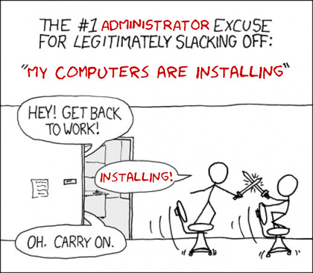

<!-- _class: title -->
<!-- _header: '' -->

# Desktop systémy Microsoft Windows

## IW1

Jan Pluskal\
pluskal@vut.cz

Fakulta informačních technologií\
Vysoké učení technické v Brně\
Božetěchova 2, 612 66 Brno

---

<!-- _class: section -->

# Správa bitových kopií systému

<!-- header: 'Desktop systémy Microsoft Windows Správa bitových kopií systému' -->

---

# Nástroje pro správu bitových kopií

- DISM (Deployment Image Servicing and Management)
  - Nástroj pro správu (vytváření, úpravu a nasazování) bitových kopií systému (Windows images)
    - Úprava Windows PE bitových kopií
    - Povolení / zakázání funkcí systému Windows
    - Přidání / odebrání / vypsání balíků / ovladačů
    - Konfigurace oblastních a jazykových nastavení
    - Upgrade edice systému Windows
  - Součást Windows ADK i systému Windows
    - Nezávislý na verzi systému (lze pracovat s bitovou kopií 32-bitového systému na 64-bitovém systému a opačně)

<!--
DISM je samozřejmě nezávislý také na edici systému, jinak by jen stěží mohl provádět upgrade edice systému Windows.

DISM se nachází v adresáři <windows>\System32 (je v PATH, dism lze tedy volat bez zadání celé cesty, pozor ale na kolize s verzemi z Windows ADK).

DISM neumí pracovat s bitovými kopiemi novějších verzí systému Windows, než pro které je určen (např. DISM určený pro Windows 8 neumí pracovat s bitovými kopiemi Windows 10).

DISM nemusí podporovat všechny operace u bitových kopií starších verzí systému Windows (např. DISM určený pro Windows 8.1 již neumí spravovat ovladače v bitových kopiích Windows Vista a Windows Server 2008).
-->

---

# Správa bitových kopií

- Online (online servicing, dism přepínač `/online`)
  - Správa nasazené bitové kopie (tzn. běžícího systému)
- Offline (offline servicing, dism přepínač `/image`)
  - Správa bitové kopie ve .wim/.vhd/.vhdx souborech
  - Umožňuje úpravu bitové kopie bez nutnosti jejího nasazení a opětovného zachycení (uložení)
    - Vyšší bezpečnost
      - Aplikace aktualizací před prvním startem systému
    - Není potřeba resetovat dobu aktivace Windows
    - Možnost výměny souborů odpovědí

---

# Základní informace o bitových kopiích

- Informace o bitových kopiích uložených ve .wim nebo .vhd/.vhdx souboru
  - `dism /Get-ImageInfo /ImageFile:<cesta-k-wim/vhd> [/Index:<index> | /Name:<název>]`
  - U .vhd/.vhdx souborů se musí vždy použít `/Index:1`, jelikož mohou obsahovat pouze jednu bitovou kopii
- Informace o všech připojených bitových kopiích
  - `dism /Get-MountedImageInfo`

<!--
Starší verze DISM (určené pro Windows 7 a Vista) uměly pracovat pouze s .wim soubory a jejich přepínače používaly Wim namísto Image (např. /Get-WimInfo, /WimFile apod.).

Základní informace o bitových kopiích ve .wim souboru lze získat také pomocí imagex /info <cesta-k-wim> [<index> | <název>], který vrací tyto informace (metadata) ve formátu XML.
-->

---

<!-- _class: dense -->

# Připojení bitové kopie

- Připojení bitové kopie do zadaného adresáře
  - `dism /Mount-Image /ImageFile:<cesta-k-wim/vhd> {/Index:<index> | /Name:<název>} /MountDir:<adresář>`
    - Adresář musí být prázdný a nesmí být symbolický odkaz

| Další přepínače | Popis |
| --- | --- |
| `/ReadOnly` | Připojí bitovou kopii pouze pro čtení (vyžadováno u bitových kopií ve .wim/.vhd/.vhdx souborech uložených například na CD nebo DVD) |
| `/Optimize` | Urychlí připojení bitové kopie (úkony prováděné při připojení budou provedeny při prvním přístupu k obsahu .wim/.vhd/.vhdx souboru) |
| `/CheckIntegrity` | Ověří poškození .wim souboru (pokud je poškozen, připojení selže a bitová kopie nebude připojena), nelze použít u .vhd/.vhdx souborů |

<!--
Bitovou kopii uloženou ve .wim souboru lze připojit také pomocí imagex /mount <cesta-k-wim> [<index> | <název>] <adresář> [/check].

Připojovaný .wim/.vhd/.vhdx soubor nesmí být uložen na oddílu disku se souborovým systémem FAT32. Neplatí pokud je připojován pouze pro čtení a jeho velikost tímto nemůže překročit 4GB (limit pro soubory u FAT32).

Při připojování bitové kopie se nekopírují její data do cílového adresáře, jen se vytvoří adresářová struktura se zástupnými soubory (asi na způsob sparse files). Fyzicky se data nakopírují teprve tehdy, když se s nimi začne něco dělat (zobrazení, modifikace, …).

Pozor na použití symbolického odkazu jako cílového adresáře, při zadání symbolického odkazu namísto standardního adresáře neoznámí dism chybu a začne připojovat bitovou kopii, ale později selže.

Dříve bylo možné mít připojených maximálně 20 bitových kopií současně, aktuálně se žádný limit neuvádí, takže buď neexistuje, nebo je tak vysoký, že se nepředpokládá, že by ho někdo někdy dosáhl.
-->

---

# Uložení bitové kopie

- Zapsání změn provedených v připojené bitové kopii zpět do jejího .wim/.vhd/.vhdx souboru
  - `dism /Commit-Image /MountDir:<adresář>`
  - Časově náročná operace
    - Není vhodné zapisovat změny při každé modifikaci bitové kopie, lepší je zapsat je až před odpojením bitové kopie

| Další přepínače | Popis |
| --- | --- |
| `/CheckIntegrity` | Ověří poškození .wim souboru (v případě poškození ho zkusí opravit a když neuspěje, uložení selže), nelze použít u .vhd/.vhdx souborů |
| `/Append` | Přidá bitovou kopii do existujícího .wim souboru jako novou (namísto přepsání původní bitové kopie), nelze použít u .vhd/.vhdx souborů |

---

# Odpojení bitové kopie

- Odpojení bitové kopie ze zadaného adresáře
  - `dism /Unmount-Image /MountDir:<adresář> {/Commit | /Discard}`
    - Přepínač `/Commit` vynutí uložení změn v bitové kopii před jejím odpojením (přepínač `/Discard` je zahodí)

| Další přepínače | Popis |
| --- | --- |
| `/CheckIntegrity` | Ověří poškození .wim souboru (v případě poškození ho zkusí opravit a když neuspěje, odpojení selže), nelze použít u .vhd/.vhdx souborů |
| `/Append` | Přidá bitovou kopii do existujícího .wim souboru jako novou (namísto přepsání původní bitové kopie), nelze použít u .vhd/.vhdx souborů |

<!--
Bitovou kopii lze odpojit také pomocí imagex /unmount <adresář> [/commit].
-->

---

# Údržba připojených bitových kopií

- Obnova připojení bitové kopie v daném adresáři
  - `dism /Remount-Image /MountDir:<adresář>`
- Odstranění poškozených souborů
  - `dism /Cleanup-Mountpoints`
  - Provádí se u všech připojených bitových kopií
  - Neodpojí ani nesmaže připojené bitové kopie

<!--
Obnova připojení (remount) je potřeba např. pokud se z jiného připojení (adresáře) aktualizuje stejná bitová kopie (.wim/.vhd/.vhdx soubor) nebo pokud jsme přesouvali adresář, ve kterém je bitová kopie připojena. Stav připojené bitové kopie (.wim/.vhd/.vhdx souboru) lze zjistit pomocí dism /Get-MountedImageInfo.
-->

---

<!-- _class: dense -->

# Přepínače pro získávání informací

| Přepínač | Popis |
| --- | --- |
| `/Get-CurrentEdition` | Zobrazí informace o edici systému Windows |
| `/Get-StagedEditions` | Zobrazí seznam edicí, jenž mohou být z bitové kopie odebrány |
| `/Get-TargetEditions` | Zobrazí seznam edicí, na které může být systém povýšen |
| `/Get-Intl` | Zobrazí nastavení oblasti a jazyka |
| `/Get-Drivers` | Zobrazí informace o všech out-of-box ovladačích |
| `/Get-DriverInfo` | Zobrazí informace o konkrétním ovladači |
| `/Get-Packages` | Zobrazí informace o všech balících |
| `/Get-PackageInfo` | Zobrazí informace o konkrétním balíku |
| `/Get-Features` | Zobrazí informace o všech funkcích (features) |
| `/Get-FeatureInfo` | Zobrazí informace o konkrétní funkci (feature) |

*Výše uvedené přepínače lze použít pro získávání informací o aktuálně běžícím systému (přepínač `/online`) i o systému uloženém v nějaké bitové kopii (přepínač `/image`)*

<!--
Nástroj dism je k dispozici ve standardní instalaci systému Windows, získávání informací tímto způsobem lze tedy s výhodou použít např. ve skriptech spouštěných po dokončení instalace systému Windows apod.
-->

---

# Správa edicí operačního systému

- Změna edice systému Windows v bitové kopii
  - `dism /Image:<adresář> /Set-Edition:<id-edice>`
  - Bitová kopie musí obsahovat soubory dané edice
  - Změna (zadání) licenčního klíče (po změně edice)
    - `dism /Image:<adresář> /Set-ProductKey:<licenční-klíč>`
    - Během instalace (přes soubor odpovědí nebo v OOBE)
- Změna edice běžícího systému Windows
  - `dism /Online /Set-Edition:<id-edice> /AcceptEula /ProductKey:<licenční-klíč>`
  - Podporováno pouze u Windows Server

<!--
Přepínač /Set-ProductKey má sice umožňovat zadání licenčního klíče jen po změně (upgradu) edice systému Windows (kdy klíč buď není vůbec zadán, nebo je nyní pro špatnou edici), ale funguje i v ostatních případech.
-->

---

<!-- _class: dense -->

# Správa jazyka operačního systému

| Přepínač | Popis |
| --- | --- |
| `/Set-UILang` | Nastaví jazyk uživatelského rozhraní (jen pokud je nainstalován) |
| `/Set-UILangFallback` | Nastaví záložní (fallback) jazyk uživatelského rozhraní (potřeba jen pokud je hlavní jazyk tzv. částečně lokalizovaným jazykem) |
| `/Set-SysLocale` | Nastaví jazyk pro programy nepodporující sadu Unicode |
| `/Set-UserLocale` | Nastaví jazyk uživatelské lokalizace systému (formát měny, času) |
| `/Set-InputLocale` | Nastaví vstupní jazyk a rozložení klávesnice |
| `/Set-LayeredDriver` | Nastaví ovladač klávesnice (Korea, Japonsko mají jiné klávesnice) |
| `/Set-TimeZone` | Nastaví časovou zónu |

*Výše uvedené přepínače lze použít pouze pro systémy uložené v nějaké bitové kopii (přepínač `/image`)*

<!--
Ukázat příklad částečně lokalizovaného jazyka na notebooku pomocí dism /online /get-intl.

Korejské resp. Japonské klávesnice mají 106/109 kláves a jiné rozložení, ostatní státy používají standardní klávesnice 101/102 kláves.
-->

---

# Správa ovladačů

- Jsou podporovány jen ovladače ve formátu .inf
  - Nelze použít ovladače uložené v .msi balících nebo jiných instalačních balících (např. v .exe souborech)
- Ovladače lze spravovat pouze v offline režimu, tedy jen v připojených bitových kopiích

<!--
MSI balík lze na rozdíl od EXE instalátoru rozbalit a většinou v něm lze dohledat instalovaný ovladač v .inf formátu.

V online režimu (v běžícím systému) stačí kliknout pravým tlačítkem myší na .inf soubor a zvolit instalovat.
-->

---

# Přidání ovladače do bitové kopie

- `dism /Add-Driver /Image:<adresář> /Driver:<adresář/cesta-k-inf> [/Recurse]`
- Pokud je zadán adresář s ovladači, jsou přidány všechny ovladače v tomto adresáři
  - `/Recurse` pro zpracování i ovladačů v podadresářích
- Na 64-bitových verzích systému Windows musí být všechny ovladače digitálně podepsány
  - Instalaci nepodepsaných ovladačů je možné provést přidáním přepínače `/ForceUnsigned`

---

# Odebrání ovladače z bitové kopie

- `dism /Remove-Driver /Image:<adresář> /Driver:<cesta-k-inf>`
- Nelze odebrat výchozí ovladače systému
- Soubory .inf přidaných ovladačů mají vždy název ve formátu `oem<číslo>.inf`
  - Pro vyhledání lze použít `dism /Get-Drivers`

<!--
Výchozí ovladače systému jsou uloženy v archívu drivers.cab.

Ukázat dism /Get-Drivers, aby viděli, že u každého ovladače jsou údaje Published Name a Original File Name, kde Published Name je aktuální název .inf souboru, jenž se musí zadat při odebírání, a Original File Name je původní název .inf souboru při přidávání ovladače.
-->

---

# Správa balíků operačního systému

- Jsou podporovány balíky ve formě .cab a .msu souborů (garantují bezobslužnou instalaci)
  - Lze definovat adresář pro rozbalení souborů během instalace (globální přepínač `/ScratchDir:<adresář>`)
    - Nedoporučuje se používat sdílené adresáře, jen lokální
    - Ve výchozím nastavení adresář `\<windows>\%Temp%`
    - Obsah tohoto adresáře je vymazán po každé operaci
- Balíky lze spravovat
  - V offline režimu (připojená bitová kopie)
  - V online režimu (aktuálně běžící systém)

<!--
Soubory .msu jsou obdobou .msi souborů, jen pro bezobslužnou (unattended) instalaci.

Neplést si adresář \<windows>\%Temp% s <windows>\%Temp%. Předpona \ znamená, že jde o relativní cestu. U bitových kopií jde o relativní cestu vzhledem k adresáři, do kterého jsou připojeny. V tomto případě tedy cesta \<windows>\%Temp% odkazuje do adresáře, jenž se nachází v bitové kopii a ne v hostitelském systému, kde běží dism.

Globální přepínač /ScratchDir lze používat i u jiných dism operací, jenž vytvářejí během své činnosti nějaké dočasné soubory, nejvíce má ale smysl při instalaci balíků, kde je často potřeba rozbalit instalační soubory.
-->

---

# Přidání balíku do bitové kopie

- `dism /Add-Package /Image:<adresář> /PackagePath:<cesta> [/IgnoreCheck]`
- Jako cestu lze zadat
  - Soubor .msu nebo .cab
  - Adresář s rozbaleným .cab archívem
  - Adresář obsahující jeden či více .msu a .cab souborů
- Balík musí být aplikovatelný na systém obsažený v cílové bitové kopii (musí být splněny závislosti)
  - Aplikaci balíku lze vynutit přepínačem `/IgnoreCheck`

<!--
Pokud je zadán adresář obsahující .msu a/nebo .cab soubory, budou automaticky prohledány také všechny podadresáře.

Balík je aplikovatelný, pokud jsou nainstalovány všechny balíky, na nichž závisí (které potřebuje pro svou instalaci nebo běh).
-->

---

# Průběh instalace balíků

- Přidané balíky jsou nainstalovány až při spuštění systému obsaženého v dané bitové kopii
- Pokud je instalace balíku závislá na přítomnosti jiných balíků, je lepší pro instalaci použít soubor odpovědí, kde lze definovat pořadí instalace
- Balíky jsou instalovány v pořadí v jakém jsou zadány na příkazové řádce

<!--
Balíky jsou instalovány během konfiguračního průchodu specialize (asi).

Výhodou použití souboru odpovědí pro definici pořadí instalace balíků je, že jsou v něm uvedeny všechny instalované balíky. Instalace balíků pomocí dism sice garantuje, že budou balíky nainstalovány v pořadí, v jakém byly zadány na příkazové řádce při přidávání do bitové kopie pomocí dism /Add-Package, ovšem při přidávání dalších balíků (dalším voláním dism /Add-Package) už nebude garantováno, zda tyto balíky budou nainstalovány před nebo až po dříve přidaných balících.
-->

---

# Odebrání balíku z bitové kopie

- `dism /Remove-Package /Image:<adresář> {/PackageName:<název> | /PackagePath:<cesta>}`
- Odebrat je možné jen balíky nainstalované z .cab souboru (balíky z .msu souboru nelze odebrat)
- Odebrané balíky jsou odinstalovány při spuštění dané bitové kopie

<!--
Soubory .cab jsou archívy, jenž se při instalaci prostě rozbalí, lze tedy jednoduše dohledat soubory, jenž se mají odebrat.

Soubory .msu provádějí bezobslužnou instalaci, při které se mohou vytvářet nebo generovat soubory, zapisovat hodnoty do registru a provádět další pro dism nenávratné akce (neví co se dělo, tak neví jak to zrušit). U MDT lze již specifikovat odinstalátor, jenž lze použít pro odebrání balíků nainstalovaných z .msu souborů.
-->

---

<!-- _class: dense -->

# Stavy ovladačů a balíků

<!-- REVIEW: v pptx byl stavový diagram (SmartArt/obrazce) – níže je jeho přepis do tabulky
     přechodů; zkontrolovat proti originálu, případně překreslit jako obrázek. -->

| Stav | Událost / akce | Následek | Nový stav |
| --- | --- | --- | --- |
| Nepřítomen (*not present*) | **Přidání** (akce) | Vložení souborů | Čeká na instalaci (*install pending*) |
| Čeká na instalaci (*install pending*) | **Odebrání** (akce) | Odebrání souborů | Nepřítomen (*not present*) |
| Čeká na instalaci (*install pending*) | Start systému (událost) | Instalace | Nainstalován (*installed*) – ovladač nebo balík |
| Čeká na instalaci (*install pending*) | Start systému (událost) | Umístění do skladu ovladačů | Ve skladu ovladačů (*staged*) – pouze ovladač |
| Ve skladu ovladačů (*staged*) | Připojení zařízení (událost) | Instalace | Nainstalován (*installed*) – pouze ovladač |
| Ve skladu ovladačů (*staged*) | **Odebrání** (akce) | Odebrání souborů | Nepřítomen (*not present*) – pouze ovladač |
| Nainstalován (*installed*) | **Odebrání** (akce) | – | Čeká na odinstalaci (*uninstall pending*) |
| Čeká na odinstalaci (*uninstall pending*) | Start systému (událost) | Odinstalace | Nepřítomen (*not present*) |

Legenda: **tučně** = akce (příkaz dism), ostatní = událost; „pouze ovladač“ vs. „ovladač nebo balík“.

---

<!-- _class: dense -->

# Správa funkcí operačního systému

- Povolení funkce (feature) operačního systému
  - `dism /Enable-Feature /FeatureName:<název>`
- Zakázání funkce (feature) operačního systému
  - `dism /Disable-Feature /FeatureName:<název>`
- Spravovat funkce lze v online i offline režimu

| Další přepínače (povolení) | Popis |
| --- | --- |
| `/PackageName:<název>` | Název balíku obsahujícího povolovanou funkci |
| `/Source:<adresář>` | Adresář obsahující soubory potřebné pro povolení funkce |

| Další přepínače (zakázání) | Popis |
| --- | --- |
| `/PackageName:<název>` | Název balíku obsahujícího zakazovanou funkci |
| `/Remove` | Odebere funkci (pouze její soubory, manifest zůstane) |

<!--
Název balíku obsahujícího povolovanou resp. zakazovanou funkci (přepínač /PackageName) je potřeba zadat jen v případě, že ho dism není schopen dohledat na základě jména dané funkce (většinou ho ale najde).

Přepínač /Source je primárně potřeba v případě, že nepovolujeme zakázanou, ale odebranou funkci (viz. přepínač /Remove).
-->

---

# Správa (desktop) aplikací

- Jsou podporovány pouze MSI aplikace (soubory .msi) a jejich záplaty (patches, soubory .msp)
- Aplikace nelze instalovat ani odinstalovat
  - Podporováno pouze získávání informací o aplikacích v připojených bitových kopiích (offline režim)

| Přepínač | Popis |
| --- | --- |
| `/Get-Apps` | Zobrazí základní informace o všech nainstalovaných MSI aplikacích |
| `/Get-AppInfo` | Zobrazí informace o konkrétní MSI aplikaci |
| `/Get-AppPatches` | Zobrazí základní informace o aplikovaných záplatách (patches) pro všechny nainstalované MSI aplikace |
| `/Get-AppPatchInfo` | Zobrazí informace o konkrétní záplatě (patch) |

---

# Správa apps (aplikací pro Modern UI)

<!-- REVIEW: terminologie z éry Windows 8 – „Modern UI“, „Windows Store“; dnes MSIX / Microsoft Store
     (dism přepínače /Add-ProvisionedAppxPackage stále platí). Rozhodnout, zda přejmenovat. -->

- Jsou podporovány .appx a .appxbundle balíky
  - Balíky lze spravovat v offline režimu i online režimu
  - Přítomné (nainstalované) aplikace lze zjistit pomocí `dism /Get-ProvisionedAppxPackages`
- Přidání (instalace) apps aplikace
  - `dism /Add-ProvisionedAppxPackage /PackagePath:<cesta-k-appx-souboru>`
- Odebrání (odinstalace) apps aplikace
  - `dism /Remove-ProvisionedAppxPackage /PackageName:<název-appx-balíku>`

<!--
Cílová edice systému Windows musí podporovat Application Sideloading, jinak mohou být aplikace pro Modern UI instalovány pouze přes Windows Store.
-->

---

# Aplikace souboru odpovědí

- `dism /Apply-Unattend:<soubor-odpovědí>`
- Spustí se offlineServicing konfigurační průchod
- Nekontroluje se aplikovatelnost balíků
- Lze aplikovat na bitové kopie
  - V offline režimu (připojená bitová kopie)
  - V online režimu (aktuálně běžící systém)
    - Lze provádět vše kromě aktualizace ovladačů

<!--
V souboru odpovědí by neměla být žádná nastavení z jiných sekcí než offlineServicing, jelikož dism může aplikovat (spustit) i nějaké nastavení z jiných fází (hlavně z fáze specialize).
-->

---

<!-- _class: section -->

# Nasazování bitových kopií systému

<!-- header: 'Desktop systémy Microsoft Windows Nasazování bitových kopií systému' -->

---

# Motivace k nasazování bitových kopií

## Programátor

## Správce systému

---

# Nástroje pro nasazování bitových kopií

<!-- REVIEW: MDT je od r. 2024 bez podpory (poslední build 8456) a SCCM se dnes jmenuje
     Microsoft Configuration Manager (součást Intune/MECM) – rozhodnout, zda doplnit poznámku. -->

- DISM (Deployment Image Servicing and Management)
  - Nástroj pro správu (vytváření, úpravu a nasazování) bitových kopií systému (Windows images)
  - Součást Windows ADK i systému Windows
- MDT (Microsoft Deployment Toolkit)
  - Sada nástrojů pro usnadnění nasazování systémů
  - Zdarma ke stažení se stránek společnosti Microsoft
- SCCM (System Center Configuration Manager)
  - Kompletní řešení pro správu systémů Windows

---

# Typy bitových kopií

- Tlustá bitová kopie (thick image)
- Tenká bitová kopie (thin image)
- Hybridní bitová kopie (hybrid image)

---

# Tlustá bitová kopie (thick image)

- Kromě operačního systému obsahuje základní aplikace, jazykové balíky a další soubory
- Jednoduché vytváření
  - Vyžaduje minimum skriptování (většinou žádné)
- Rychlé nasazení
- Pracná aktualizace
- Pro vytvoření lze použít MDT
- Často se používá jako forma zálohy
  - Bootovatelné virtuální disky

---

# Tenká bitová kopie (thin image)

- Obsahuje pouze operační systém (případně jen pár základních aplikací nebo jazykových balíků)
- Složitější vytváření
  - Aplikace a jazykové balíky instalovány až dodatečně
    - Potřeba mít infrastrukturu pro distribuci aplikací
    - Často vyžaduje velké množství skriptování
- Nemusí se aktualizovat
- Nižší bezpečnost
  - Aktualizace aplikovány až po nasazení (za běhu)

---

# Hybridní bitová kopie (hybrid image)

- Kombinace tlusté a tenké bitové kopie
  - Automatická instalace aplikací a jazykových balíků při prvním startu systému (instalace ze síťového zdroje)
  - Výhody tenké bitové kopie, ale jednodušší vytváření
- Vyšší bezpečnost
  - Instalace před prvním přihlášením uživatele
- Není nutná infrastruktura pro distribuci aplikací
- Delší čas instalace
- Někdy jako tlustá bitová kopie rozšiřující tenkou

<!--
Typ 1: automatická instalace aktualizací v např. offline servicing fázi, aplikací v např. specialize fázi apod.

Typ 2: vytvoření několika tlustých bitových kopií s různými aplikacemi, ovladači apod. z jedné základní tenké bitové kopie (inkrementální vytváření bitových kopií).
-->

---

# Nasazování bitových kopií

- Základní nasazování bitových kopií
  - Aplikace (rozbalení) bitové kopie
- Pokročilé nasazování bitových kopií
  - Light-Touch Instalace (LTI)
  - Zero-Touch Instalace (ZTI)
  - User-Driven Instalace (UDI)

---

# Aplikace bitové kopie

- Aplikace (rozbalení) bitové kopie uložené ve .wim souboru na vybraný oddíl disku
  - `Dism /Apply-Image /ImageFile:<cesta-k-wim> {/Index:<index> | /Name:<název>} /ApplyDir:<jednotka>`
  - Bitové kopie uložené ve .vhd/.vhdx souborech nelze aplikovat (rozbalit), lze je pouze připojit do adresáře

| Další přepínače | Popis |
| --- | --- |
| `/Verify` | Ověří zachycené soubory (chyby, duplikáty, …) |
| `/CheckIntegrity` | Ověří poškození .wim souboru (pokud je poškozen, aplikace selže) |

---

# Light-Touch Instalace (LTI)

- Umožňuje výběr stupně automatizace
  - Může vyžadovat interakci s uživatelem
    - Riziko zavlečení chyb, nutnost mít oprávnění správce
- Minimální nároky na infrastrukturu
- Podpora nasazování ze sdíleného adresáře nebo odnímatelných úložišť (CD, DVD, UFD, …)
- Nasazení může být zahájeno manuálně nebo automaticky pomocí WDS
- Rychlejší příprava procesu instalace

<!--
Převzato z Using the Microsoft Deployment Toolkit.docx strana 22-24.
-->

---

# Zero-Touch Instalace (ZTI)

- Podporuje pouze plně automatizovaná nasazení
  - Žádná interakce s uživatelem
    - Nižší riziko zavlečení chyb
    - Oprávnění jsou uložena v konfiguračních souborech
- Vyžaduje System Center Configuration Manager
- Nasazování pouze z distribučních bodů SCCM
- Nasazení lze zahájit jen pomocí SCCM nebo WDS
- Složitější příprava procesu instalace
- Vyžaduje RPC pro komunikaci s klienty

<!--
Konfigurační soubory s oprávněními uložené v distribučních sdíleních => bezpečnostní riziko, ale pro komunikaci lze využít např. HTTPS.

Převzato z Using the Microsoft Deployment Toolkit.docx strana 22-24.
-->

---

# User-Driven Instalace (UDI)

- Kombinace Zero-Touch a Light-Touch instalace
  - Prakticky „Zero-Touch s možností interakce uživatele“
- Vyžaduje System Center Configuration Manager
- Uživatel může zahájit i si přizpůsobit celý proces nasazování

<!--
LTI naportované pro SCCM (jenž primárně používá ZTI).

Převzato z Using the Microsoft Deployment Toolkit.docx strana 22-24.
-->

---

# Microsoft Deployment Toolkit (MDT)

- Sada nástrojů pro usnadnění nasazování systémů
  - Správa a distribuce bitových kopií (.wim souborů)
  - Správa ovladačů, aktualizací a aplikací
  - Řízení přístupu k distribučním sdílením
- Vyžaduje Windows ADK (starší verze WAIK)
- Výše uvedené úkony realizují (resp. automatizují) tzv. sekvence úloh (task sequences)

<!--
MDT lze nainstalovat i bez přítomnosti WAIKu (Windows ADK), ale při pokusu o vytvoření distribučního sdílení oznámí chybu, že nemá WAIK (Windows ADK).

Instalace MDT 2013 má cca. 23MB, ale WAIK má 1,7 GB (Windows ADK se nedá stáhnou jako ISO).

Windows ADK není k dispozici jako ISO soubor pro offline instalaci, offline instalace Windows ADK se provádí s využitím online instalátoru, který umožňuje stáhnout instalační soubory a uložit je na disk, instalační soubory lze pak jednoduše překopírovat na cílový počítač a spustit na něm offline instalaci.

MDT 2013 již podporuje pouze Windows ADK pro Windows 8.1, Update 1 pak Windows ADK pro Windows 10.
-->

---

# MDT 2013 Update 2 (a novější)

<!-- REVIEW: Windows 7/8/8.1 i Windows 10 jsou po konci podpory (W10 říjen 2025) a MDT
     je ukončený produkt – zvážit sloučení s následujícím slidem „MDT 8456“. -->

- Podpora
  - Windows 7, 8, 8.1 a 10
  - Windows Server 2008 R2, 2012 a 2012 R2, 2016
  - Windows PE 10
- Podpora USMT 10
  - Podpora hard-link migrace a stínových kopií
- Podpora instalace MS Office 2007 – 2016 a 365
- Podpora Light-Touch instalace (LTI)
  - S SCCM i Zero-Touch (ZTI) a User-Driven (UDI)

<!--
Windows PE bitové kopie jsou speciálně upravené pro LTI a může je používat WDS (standardně se spouštěcí bitová kopie WDS nahrazuje touto bitovou kopií).

USMT umožňuje během instalace provádět sběr (uložení) a obnovu uživatelských dat.

Hard-link migrace se u MDT nedoporučuje používat, v některých případech může způsobit i zhavarování instalace.

Nasazování Windows XP, Vista, Server 2003 (R2) a Server 2008 (R2) již není u MDT 2013 podporováno, lze ale použít starší MDT 2012 Update 1.

Uživatelské příručka MDT 2013 obsahuje řadu pasáží, které nejsou dosud aktualizovány a pocházejí z uživatelské příručky MDT 2012 Update 1 nebo dokonce MDT 2010 Update 1.

Update 2, podpora w2016, vyžaduje WADK pro W10

U dalších verzí změna v názvu na MDT + verzi buildu – aktuálně MDT build 8456
-->

---

# MDT 8456

<!-- REVIEW: MDT 8456 je poslední a již nepodporovaná verze (Windows 11 jen neoficiálně,
     nepodporuje ADK pro 24H2+); ověřit, že odkazy na 4sysops a MS Q&A stále fungují. -->

- Podpora
  - Windows 7, 8, 8.1 a 10 i 11 (dle komunity)
  - Windows Server 2008 R2, 2012 a 2012 R2, 2016
  - Windows PE 10
- <https://4sysops.com/archives/deploy-windows-11-with-microsoft-deployment-toolkit-mdt/>
- <https://learn.microsoft.com/en-us/answers/questions/595228/how-to-upgrade-mdt-and-adk-to-support-win-11-and-w.html>

<!--
https://learn.microsoft.com/en-us/mem/configmgr/mdt/release-notes

https://4sysops.com/archives/deploy-windows-11-with-microsoft-deployment-toolkit-mdt/
-->

---

# Deployment Workbench

- MMC konzole pro práci s MDT
  - Vytváření a správa distribučních sdílení a bodů nasazení
  - Vytváření Windows PE bitových kopií pro Light-Touch instalaci
  - Definice sekvencí úloh (task sequences)
- Měla by běžet pouze jedna instance
  - Při běhu více instancí nepředvídatelné chování

<!--
Neověřuje se, zda běží více instancí Deployment Workbench.

Information Center obsahuje dokumentaci k MDT (cca. 1000 stran).
-->

---

# Distribuční sdílení (Distribution Share)

- Adresář obsahující soubory potřebné k instalaci a konfiguraci systému na cílovém počítači
  - Nastavení MDT
  - Bitové kopie (.wim soubory)
  - Zdrojové soubory sekvencí úloh, balíků, aktualizací, jazykových balíků, ovladačů a aplikací
  - Metadata operačních systémů a všech jejich balíků, aplikací a ovladačů

---

<!-- _class: dense -->

# Obsah distribučního sdílení

| Adresář | Obsah |
| --- | --- |
| `$OEM$` | Potřeba pro zpětnou kompatibilitu s Windows XP a Server 2003 |
| `Applications` | Instalační soubory aplikací |
| `Backup` | Záloha konfiguračních souborů MDT |
| `Boot` | Spouštěcí Windows PE bitové kopie (ve WIM a ISO formátech) |
| `Captures` | Zachycené (instalační) bitové kopie |
| `Control` | Konfigurační soubory MDT |
| `Operating Systems` | Bitové kopie |
| `Out-of-Box Drivers` | Ovladače |
| `Packages` | Balíky operačního systému a jazykové balíky |
| `Scripts` | Skripty využívané sekvencemi úloh (task sequences) |
| `Tools` | Nástroje pro vytváření, obsluhu a nasazování bitových kopií |
| `USMT` | Obsahuje User State Migration Tool |

<!--
Operating Systems: při importu instalačního DVD (full set of source files) se zkopíruje celý obsah DVD, ne jen Install.wim bitová kopie.

Boot image od MDT pro LTI lze také vložit do WDS namísto capture image od WDS, WDS lze pak použít pro iniciaci LTI prováděnou MDT.

Pod Control jsou uloženy také vytvořené sekvence úloh.
-->

---

# Body nasazení (Deployment Points)

- Zajišťují distribuci souborů z distribučního sdílení
- Každý bod nasazení umožňuje přístup k určité části souborů z distribučního sdílení
  - Pomocí tzv. výběrových profilů (selection profiles) lze definovat, které bitové kopie, ovladače, aktualizace, aplikace a sekvence úloh mají být k dispozici
- Klientské počítače se připojují k bodům nasazení a vybírají si sekvenci úloh, kterou chtějí spustit

<!--
Při LTI lze specifikovat, ke kterému bodu nasazení se má LTI klient připojit a to ovlivňuje, co může nainstalovat (může vybírat jen z toho, co bod nasazení poskytuje).
-->

---

# Typy bodů nasazení

- Deployment Share (single-server, lab)
  - Vytvoří bod nasazení z distribučního sdílení
- Linked Deployment Share (separátní sdílení)
  - Vytvoří lokální nebo vzdálené sdílení obsahující část souborů z distribučního sdílení
  - Synchronizuje se s distribučním sdílením
- Media (odnímatelné úložiště)
  - Vytvoří adresáře (nebo ISO) obsahující část souborů z distribučního úložiště

<!--
od verze 2010 Update 1 se při vytvoření distribučního sdílení z něj automaticky udělá bod nasazení typu Deployment Share.

Bod nasazení typu Media se používá primárně pro offline LTI instalaci např. na stanice za bránou Firewall.
-->

---

# Sekvence úloh (Task Sequences)

- Sada úloh vykonávaných během nasazování
  - Řídí celý proces nasazování bitových kopií
  - Možnost slučování úloh do skupin
  - Úlohy lze vykonávat podmíněně
- Vytváří se z předdefinovaných šablon
- Vždy vázané na konkrétní bitovou kopii

<!--
Zatím nelze vytvářet vlastní šablony, ale jsou to XML soubory, takže je lze jednoduše upravovat i ručně.

Uživatel si nevybírá bitovou kopii, kterou chce nasadit, jako u WDS, ale sekvenci úloh, kterou chce spustit.
-->

---

<!-- _class: dense -->

# Šablony sekvencí úloh (1)

| Název | Popis |
| --- | --- |
| Sysprep and Capture | Zachycení zobecněného referenčního počítače |
| Standard Client Task Sequence | Výchozí sekvence úloh pro nasazování bitových kopií na klientské počítače / zachycení systému klientských počítačů do bitové kopie |
| Standard Client Replace Task Sequence | Zálohování systému a uživatelských dat a následné vymazání disku |
| Custom Task Sequence | Vlastní (uživatelem definovaná) sekvence úloh, která neinstaluje žádný operační systém |
| Standard Server Task Sequence | Výchozí sekvence úloh pro nasazování bitových kopií na serverové počítače |
| Litetouch OEM Task Sequence | Nasazení bitových kopií na počítače v přípravném prostředí před jejich nasazením do produkčního prostředí (příprava OEM images) |
| Post OS Installation Task Sequence | Konfigurace systému po jeho nasazení (instalace aplikací, povolení technologie BitLocker, obnova uživatelských dat, …) |

<!--
Šablony sekvencí úloh nejsou zatím příliš zdokumentované, takže je dobré vědět k čemu která šablona zhruba slouží.

U Standard Client Task Sequence se při zachycování předpokládá, že před sysprep a zachycením se provede kompletní konfigurace (příprava) počítače.

Standard Server Task Sequence se od Standard Client Task Sequence liší např. možností instalace rolí apod.

Sysprep and Capture a Post OS Installation Task Sequence jsou k dispozici od MDT 2010 Update 1.
-->

---

# Šablony sekvencí úloh (2)

<!-- REVIEW: šablona Standard Client Upgrade popisuje upgrade W7/8/8.1 na Windows 10 – po konci
     podpory Windows 10 (10/2025) zvážit poznámku o upgradu na Windows 11. -->

| Název | Popis |
| --- | --- |
| Deploy to VHD Client Task Sequence | Nasazení bitové kopie klientského systému na virtuální pevný disk (do VHD souboru) na cílovém počítači |
| Deploy to VHD Server Task Sequence | Nasazení bitové kopie serverového systému na virtuální pevný disk (do VHD souboru) na cílovém počítači |
| Standard Client Upgrade Task Sequence | Upgrade Windows 7, Windows 8 nebo Windows 8.1 na Windows 10 se zachováním uživatelských dat, nastavení, aplikací i ovladačů |
| Standard Server Upgrade Task Sequence | Upgrade Windows Server (příprava pro Windows Server 2016) |

<!--
Deploy to VHD Client Task Sequence a Deploy to VHD Server Task Sequence jsou k dispozici od MDT 2012 Update 1.

Standard Client Upgrade Task Sequence a Standard Server Upgrade Task Sequence jsou k dispozici od MDT 2013 Update 1.
-->

---

<!-- _class: dense -->

# Základní úlohy

| Úloha | Popis |
| --- | --- |
| Run Command Line | Vykoná zadaný příkaz |
| Run PowerShell Script | Spustí zadaný PowerShell skript |
| Set Task Sequence Variable | Nastaví proměnnou sekvence úloh, hodnoty proměnných ukládány v objektu `Microsoft.SMS.TSEnvironment` (přístupný ve skriptech) |
| Restart Computer | Restartuje počítač |
| Gather | Zpracuje nastavení obsažená v souboru `ZTIGather.xml`, případně v zadaném INI souboru (`CustomSettings.ini`, pokud není zadán) |
| Install Updates Offline | Nainstaluje vybrané balíky operačního systému a/nebo jazykové balíky, instalace v konfiguračním průchodu offlineServicing |
| Validate | Ověří, zda počítač splňuje podmínky pro nasazení systému |
| Install Application | Nainstaluje vybrané aplikace |
| Inject Drivers | Nainstaluje vybrané ovladače |

<!--
Řadu předpřipravených skriptů lze ovlivňovat nastavením nějaké Task Sequence Variable.

V ZTIGather.xml a CustomSettings.ini lze nastavit např. Task Sequence Variables.

Validate ověřuje např. dostatek místa, požadavky na výkon procesoru, velikost paměti RAM apod.

Úloha Run PowerShell Script je k dispozici od MDT 2012 Update 1.

Úloha Install Updates Offline nelze použít u Windows XP a Server 2003 (neznají offlineServicing), pokud není k dispozici SCCM. Bez SCCM je jediná možnost jak nainstalovat aktualizace do Windows XP a Server 2003 provést slipstreaming (integraci aktualizací do instalačních souborů).

Aktualizace lze také instalovat online (po nasazení bitové kopie) pomocí WSUS nebo SCCM (úloha Install Software Updates, dříve Install Updates Online).

Bootovatelné VHD disky lze aktualizovat pomocí VMST (Virtual Machine Servicing Tool).
-->

---

# Instalace aplikací

- Možnosti instalace aplikací
  - Instalace z distribučního sdílení
  - Instalace z externího zdroje
- Potřeba specifikovat příkaz pro instalaci aplikace
- Instalace více aplikací v jediném kroku
  - Vyžadované aplikace (nainstalovány automaticky)
    - Nastavení `MandatoryApplications` v `CustomSettings.ini`
  - Volitelné aplikace (uživatel určí, zda nainstalovat)
    - Nastavení `Applications` v `CustomSettings.ini`
    - Vložením informací do MDT databáze

<!--
Lze nainstalovat i aplikaci, jenž neobsahuje žádné zdrojové soubory.

Instalátor nikdy nesmí provést při instalaci aplikace restart počítače, pokud ho provede, může způsobit kolaps vykonávané sekvence úloh.

Zmínit, že existuje ještě SCCM (System Center Configuration Manager), jenž umožňuje spravovat všechny systémy Windows (XP, Embedded, CE, Mobile, …) a umožňuje kromě nasazování systémů, aplikací a aktualizací také inventarizaci HW a SW, vzdálenou administraci nebo měření používání SW. Dále, že využívá sekvence úloh, jenž jsou kompatibilní s MDT a že MDT může používat namísto své databáze databází SCCM.
-->
