<!-- TODO-SCREENSHOT: snímky 20, 23, 24, 26, 28, 36, 51, 52, 53, 55, 56, 57, 64, 65, 66, 67, 70, 71, 73 – pořídit znovu z Windows 11 25H2 (snímek 74 je historický dialog Location Aware Printing z Windows 8, ten se znovu pořídit nedá; snímek 20 je Centrum síťových připojení a sdílení – ve Windows 11 stále existuje, pořídit bez položky Domácí skupina) -->

<!-- _class: title -->
<!-- _header: '' -->

# Desktop systémy Microsoft Windows

## IW1

Jan Pluskal\
pluskal@vut.cz

Fakulta informačních technologií\
Vysoké učení technické v Brně\
Božetěchova 2, 612 66 Brno

---

<!-- _class: section -->

# Nastavení sítě

<!-- header: 'Desktop systémy Microsoft Windows Nastavení sítě' -->

---

# TCP/IP model

---

# Porovnání ISO/OSI a TCP/IP modelu

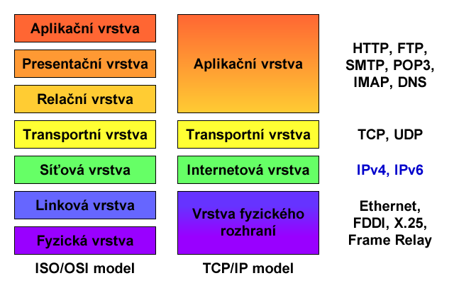

---

# Internet Protocol verze 4 (IPv4)

- Protokol **internetové (resp. síťové) vrstvy**, L3
- Zajišťuje **směrování IPv4 datagramů** (paketů)
  - Přenos dat z jednoho síťového rozhraní na druhé
- **Dvě IPv4 adresy** v každém IPv4 datagramu
  - IPv4 adresu **zdroje** (rozhraní, jenž datagram odeslalo)
  - IPv4 adresu **cíle** (rozhraní, kterému se má doručit)
- **IPv4 adresa**
  - Jednoznačná identifikace síťového rozhraní (zařízení) v rámci dané (pod)sítě

<!--
Podle RFC 791 (specifikace IP protokolu, https://www.rfc-editor.org/rfc/rfc791) se datům přenášeným pomocí IP protokolu říká datagramy.

Podle RFC 1594 (odpovědi na FAQ, https://www.rfc-editor.org/rfc/rfc1594) jsou datagramy data, jenž obsahují všechny potřebné informace pro jejich směrování od zdroje k cíli bez nutnosti spoléhat se předchozí přenosy dat nebo transportní síť.
-->

---

# Formát IPv4 adres

- Délka **32 bitů**
- Zápis v tzv. **tečkové notaci** (v dekadickém tvaru)
  - X.X.X.X kde X je číslo od 0 do 255 (8 bitů, tzv. oktet)
- Skládá se z **adresy (pod)sítě** a **adresy rozhraní**
  - Určeny maskou podsítě

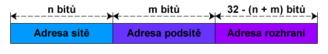

---

# Maska podsítě (Subnet Mask)

- Délka **32 bitů**
- **Stejný zápis** jako u IPv4 adres
- **Jedničkové bity** určují, které bity IPv4 adresy jsou bity adresy (pod)sítě
- **Nulové bity** určují, které bity IPv4 adresy jsou bity adresy rozhraní

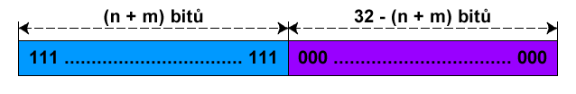

---

# Zjištění adres (pod)sítě a rozhraní

|                  | Dekadicky       | Binárně                             |
| ---------------- | --------------- | ----------------------------------- |
| IPv4 adresa      | 147.229.178.134 | 10010011.11100101.10110010.10000110 |
| Maska podsítě    | 255.255.254.0   | 11111111.11111111.11111110.00000000 |
|                  |                 |                                     |
| Adresa (pod)sítě | 147.229.178.0   | 10010011.11100101.10110010.00000000 |
| Adresa rozhraní  | 0.0.0.134       | 00000000.00000000.00000000.10000110 |

---

# Výchozí brána (Default Gateway)

- IP adresa síťového rozhraní **směrovače** (*router*)
- Všechny datagramy směřující do **jiné (pod)sítě** jsou zasílány na adresu výchozí brány

---

# Classless Inter-Domain Routing (CIDR)

- IPv4 adresy dříve děleny do **5 tříd** (třídy A – E)
  - Každá třída měla určenou masku podsítě
- **CIDR** umožňuje explicitně specifikovat masku podsítě pro každou IPv4 adresu
  - Maska podsítě jako počet jedničkových bitů
  - Zápis ve formátu X.X.X.X/Y kde Y je číslo od 0 do 32
- Nutnost uchovávat **informace o masce podsítě**
  - Potřeba pro směrování datagramů
    - Každá IPv4 adresa náleží do sítě identifikované adresou (pod)sítě (adresa rozhraní obsahuje samé nuly)

<!--
Tabulka tříd z cvičení (E03, kapitola Třídy IPv4 adres).
-->

---

<!-- _class: dense -->

# Přepis IPv4 adres do CIDR formátu

|                           | Dekadicky          | Binárně                                |
| ------------------------- | ------------------ | -------------------------------------- |
| IPv4 adresa               | 147.229.178.134    | 10010011.11100101.10110010.10000110    |
| Maska podsítě             | 255.255.254.0      | 11111111.11111111.11111110.00000000    |
|                           |                    |                                        |
| Adresa (pod)sítě          | 147.229.178.0/23   | 10010011.11100101.10110010.00000000    |
| Adresa rozhraní           | 0.0.0.134/23       | 00000000.00000000.00000000.10000110    |
|                           |                    |                                        |
| IPv4 adresa (CIDR formát) | 147.229.178.134/23 | 10010011.11100101.10110010.10000110/23 |

---

# Typy IPv4 adres

- **Individuální** (*unicast*)
  - Identifikují právě jedno síťové rozhraní (zařízení)
  - Data se doručují tomuto rozhraní
- **Všesměrové** (*broadcast*)
  - Data se doručují všem síťovým rozhraním (zařízením)
  - Adresa rozhraní obsahuje samé jedničky
- **Skupinové** (*multicast*)
  - Identifikují celou skupinu síťových rozhraní (zařízení)
  - Data se doručují všem členům skupiny

---

<!-- _class: dense -->

# Zjištění adresy pro všesměrové vysílání

|                               | Dekadicky          | Binárně                                |
| ----------------------------- | ------------------ | -------------------------------------- |
| IPv4 adresa                   | 147.229.178.134    | 10010011.11100101.10110010.10000110    |
| Maska podsítě                 | 255.255.254.0      | 11111111.11111111.11111110.00000000    |
|                               |                    |                                        |
| Adresa (pod)sítě              | 147.229.178.0/23   | 10010011.11100101.10110010.00000000    |
| Adresa rozhraní               | 0.0.0.134/23       | 00000000.00000000.00000000.10000110    |
|                               |                    |                                        |
| IPv4 adresa (CIDR formát)     | 147.229.178.134/23 | 10010011.11100101.10110010.10000110/23 |
|                               |                    |                                        |
| Adresa všesměrového vysílání  | 147.229.179.255/23 | 10010011.11100101.10110011.11111111    |

---

# Speciální IPv4 adresy

- **Neplatná** IPv4 adresa
  - 0.0.0.0
- **Loopback** IPv4 adresa
  - 127.0.0.1 (DNS název localhost)
- **Privátní** IPv4 adresy
  - Adresy náležící do rozsahů privátních sítí
  - Nesměrovatelné v síti internet

---

<!-- _class: dense -->

# Speciální rozsahy IPv4 adres

| CIDR adresový blok | Popis                                                          |
| ------------------ | -------------------------------------------------------------- |
| 0.0.0.0/8          | Aktuální síť (pouze pro zdrojové adresy)                       |
| 10.0.0.0/8         | Privátní síť                                                   |
| 100.64.0.0/10      | Sdílený adresní prostor pro NAT poskytovatelů (CGN, RFC 6598)  |
| 127.0.0.0/8        | Loopback                                                       |
| 169.254.0.0/16     | Místní adresy v rámci propojení (APIPA)                        |
| 172.16.0.0/12      | Privátní síť                                                   |
| 192.88.99.0/24     | Historie: 6to4 relay anycast (zrušeno RFC 7526, 2015)          |
| 192.168.0.0/16     | Privátní síť                                                   |
| 224.0.0.0/4        | Multicast (skupinové vysílání, předchozí třída D)              |
| 240.0.0.0/4        | Rezervováno (předchozí třída E)                                |
| 255.255.255.255    | Broadcast (všesměrové vysílání)                                |

<!--
100.64.0.0/10 (RFC 6598) používají poskytovatelé pro Carrier-Grade NAT mezi zákazníkem a veřejným internetem – zákazník tak dostane adresu, která není ani privátní, ani veřejná; typicky u mobilních operátorů.

192.88.99.0/24 byl anycast prefix pro 6to4 relay (RFC 3068); RFC 7526 (2015) ho vrátil IANA, protože 6to4 se přestalo používat.

Zdroj: https://www.rfc-editor.org/rfc/rfc6598
Zdroj: https://www.rfc-editor.org/rfc/rfc7526
-->

---

# APIPA

- **Automatic Private IP Addressing**
- **Automatické přiřazení** IPv4 adresy v případě, že ji nebylo možné získat od DHCP serveru
  - Generují se IPv4 adresy ze sítě 169.254.0.0/16
  - Výchozí brána se nenastavuje (nesměrovatelné)
  - Lze přiřadit i vlastní (statickou) IPv4 adresu
    - Záložní konfigurace (*Alternativní konfigurace*) v klasickém dialogu TCP/IPv4
- **Ověření konfliktů** IPv4 adres na dané síti
  - Po 10 konfliktech se nastaví neplatná adresa 0.0.0.0

<!--
V TG se chybně uvádí, že APIPA má masku podsítě 255.255.255.0 (24 bitů).

Ve výstupu Get-NetIPAddress mají APIPA adresy PrefixOrigin/SuffixOrigin = WellKnown/Link a často AddressState = Tentative (viz snímek s výpisem Get-NetIPAddress).
-->

---

# Subnetting

- **Rozdělení sítě** do více menších podsítí
  - Zvýšení propustnosti, definice hranic
- **Příklad**

| Adresy (pod)sítě | Binárně                             |
| ---------------- | ----------------------------------- |
| 147.229.0.0/16   | 10010011.11100101.00000000.00000000 |
| 147.229.0.0/18   | 10010011.11100101.00000000.00000000 |
| 147.229.64.0/18  | 10010011.11100101.01000000.00000000 |
| 147.229.128.0/18 | 10010011.11100101.10000000.00000000 |
| 147.229.192.0/18 | 10010011.11100101.11000000.00000000 |

---

# Supernetting

- **Sloučení souvislého bloku sítí** do jedné větší sítě
  - Zjednodušení směrování
- **Příklad**

| Adresy (pod)sítě | Binárně                             |
| ---------------- | ----------------------------------- |
| 147.229.0.0/24   | 10010011.11100101.00000000.00000000 |
| 147.229.1.0/24   | 10010011.11100101.00000001.00000000 |
| 147.229.2.0/24   | 10010011.11100101.00000010.00000000 |
| 147.229.3.0/24   | 10010011.11100101.00000011.00000000 |
| 147.229.0.0/22   | 10010011.11100101.00000000.00000000 |

---

<!-- _class: dense -->

# Kde se síť ve Windows 11 nastavuje

- **Nastavení \ Síť a internet** – primární rozhraní
  - Ethernet, Wi-Fi, VPN, Mobilní hotspot, Proxy, Telefonické připojení
  - *Upřesnit nastavení sítě* – všechny adaptéry, *Resetování sítě*
  - Otevře se i pravým tlačítkem na ikonu sítě v hlavním panelu
- **PowerShell** – primární nástroj příkazového řádku
  - Moduly NetTCPIP, NetAdapter, DnsClient, NetConnection
- **Klasické nástroje** (stále funkční, dále se nevyvíjejí)
  - Ovládací panely \ *Centrum síťových připojení a sdílení*
  - Síťová připojení (`ncpa.cpl`), dialogy vlastností protokolů
  - `netsh`, `ipconfig`, `route`, `netstat`

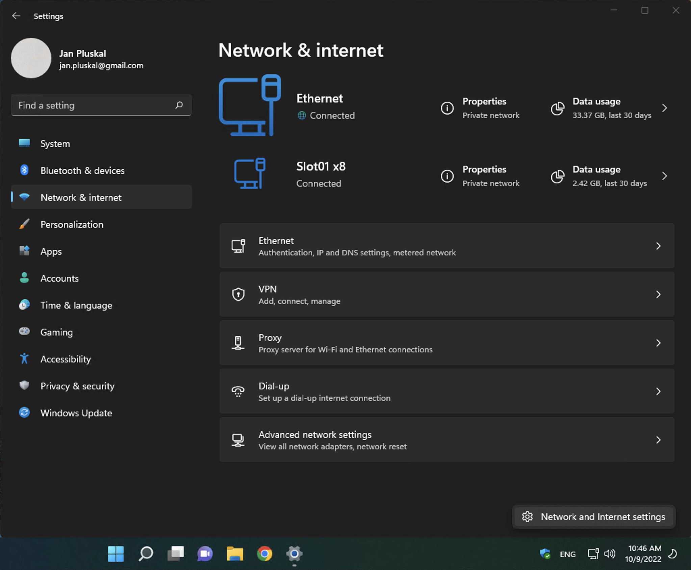

<!--
Ve Windows 11 už pravé tlačítko na ikoně sítě v hlavním panelu neotevře Centrum síťových připojení a sdílení, ale rovnou Nastavení \ Síť a internet. Centrum lze spustit z Ovládacích panelů nebo příkazem control.exe /name Microsoft.NetworkAndSharingCenter (viz E03, Lab 01).

Klasické Ovládací panely Microsoft postupně přesouvá do Nastavení, nic z nich ale zatím oficiálně neodstranil – na cvičení používáme obě cesty, protože dialog Vlastnosti protokolu TCP/IPv4 je pořád nejrychlejší způsob, jak nastavit statickou adresu i alternativní konfiguraci.

Snímek je z Windows 11 22H2 s anglickým rozhraním; české názvy stránek: Ethernet, Wi-Fi, VPN, Mobilní hotspot, Proxy server, Telefonické připojení, Upřesnit nastavení sítě.
-->

---

<!-- _class: dense -->

# Centrum síťových připojení a sdílení (klasické)

- **Ovládací panely** \ Síť a internet
  - Přehled aktivních sítí a jejich profilu (veřejná / privátní / doména)
  - *Změnit nastavení adaptéru* → Síťová připojení (`ncpa.cpl`)
  - *Změnit pokročilé nastavení sdílení*
    - Ve Windows 11 přesunuto do Nastavení \ Síť a internet \ Upřesnit nastavení sítě \ *Upřesnit nastavení sdílení*
  - *Nastavit nové připojení nebo síť* (VPN, telefonické, ruční Wi-Fi profil)
- Historie: **Domácí skupina** (*HomeGroup*) odstraněna ve Windows 10 1803
  - Náhrada: běžné sdílení složek a tiskáren (SMB), Sdílení v okolí, OneDrive

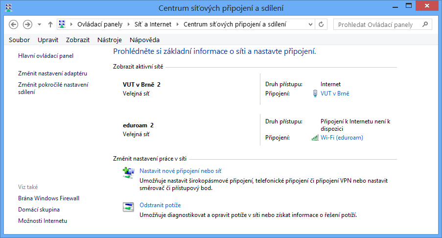

<!--
Snímek je z Windows 8 – v levém panelu je ještě položka Domácí skupina. Ve Windows 10 1803 byla HomeGroup odstraněna; sdílení souborů a tiskáren funguje dál přes standardní SMB sdílení (Průzkumník souborů \ Udělit přístup), pro jednorázový přenos mezi zařízeními slouží Sdílení v okolí (Nearby sharing), pro synchronizaci OneDrive.

Zdroj: https://learn.microsoft.com/en-us/windows/whats-new/removed-features (HomeGroup, 1803)
-->

---

<!-- _class: dense -->

# Nastavení protokolu IPv4 – Nastavení

- Nastavení \ Síť a internet \ **Ethernet** (nebo Wi-Fi \ vlastnosti sítě)
  - Přiřazení IP adresy: Automaticky (DHCP) / Ručně → **Upravit**
  - Přiřazení serveru DNS → *Upravit*
  - Přehled: IPv4/IPv6 adresy, DNS servery, přípona DNS, rychlost linky, MAC adresa
  - Typ síťového profilu, Připojení účtované podle objemu dat
- **Jeden dialog** pro IPv4 i IPv6 (přepínače)
- Nelze nastavit **alternativní (záložní) konfiguraci** ani více adres – na to klasický dialog nebo PowerShell

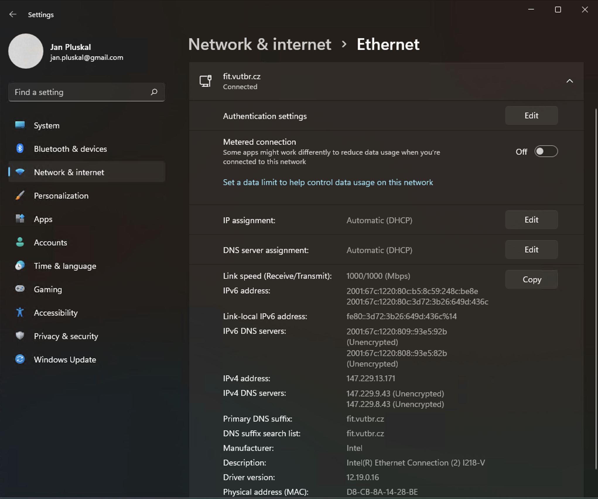

---

# Nastavení protokolu IPv4 – Upravit nastavení IP

- Upravit nastavení IP → **Ručně**
  - Zapnout IPv4 a/nebo IPv6
  - IP adresa, Maska podsítě, Brána
  - Upřednostňovaný / Alternativní DNS
  - Preferované šifrování DNS (DNS over HTTPS – viz dále)
- **Uložit** → změna se projeví okamžitě
- Totéž pro **Wi-Fi**: Nastavení \ Síť a internet \ Wi-Fi \ vlastnosti sítě

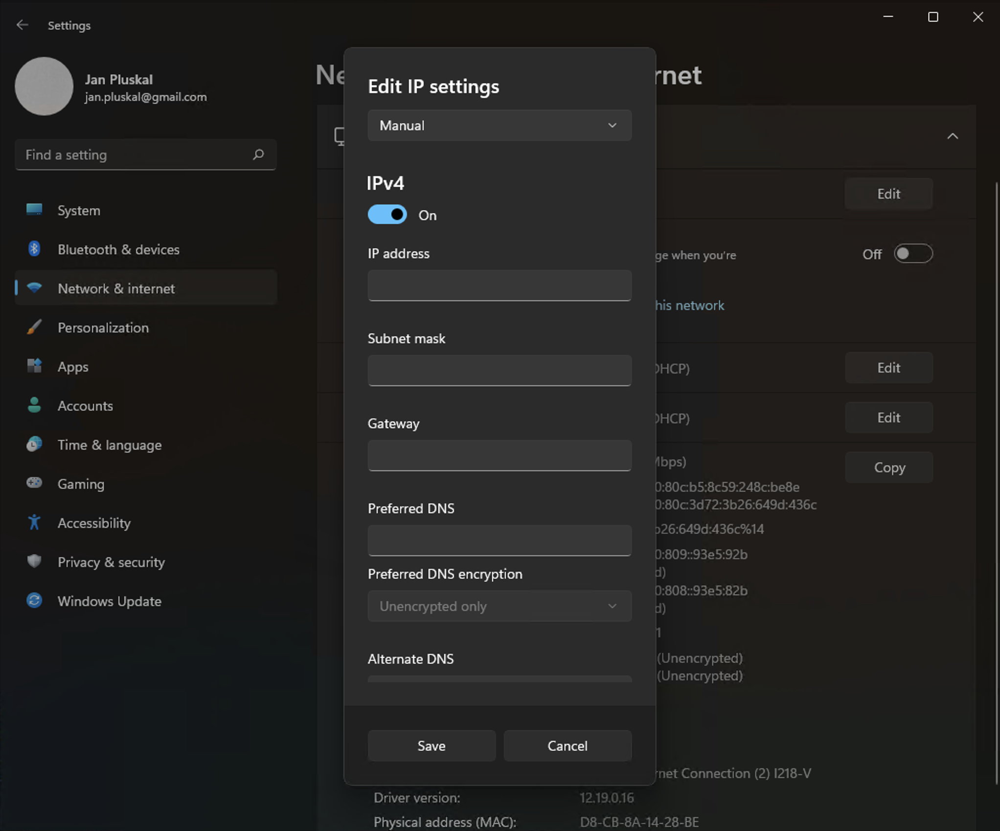

<!--
Dialog přibyl ve Windows 10 a už tam po volbě Ručně nabízí přepínače IPv4 i IPv6 (ruční konfigurace IPv6 tedy není novinkou Windows 11). Zdroj: https://support.microsoft.com/en-us/windows/change-tcp-ip-settings-bd0a07af-15f5-cd6a-363f-ca2b6f391ace Na rozdíl od klasického dialogu nenabízí tlačítko Upřesnit (více adres, více bran s metrikami, WINS, NetBIOS over TCP/IP, alternativní konfigurace při výpadku DHCP).
-->

---

<!-- _class: dense -->

# Nastavení protokolu IPv4 – klasický dialog a PowerShell

- **Vlastnosti připojení** (`ncpa.cpl`) \ Protokol IP verze 4 (TCP/IPv4)
  - *Upřesnit…* – více adres a bran, alternativní konfigurace, DNS přípony, WINS
- **PowerShell** (modul NetTCPIP, DnsClient), např. adaptér `LAN1` z cvičení
  - `New-NetIPAddress -InterfaceAlias LAN1 -IPAddress 192.168.0.11 -PrefixLength 24` (bez brány – v E03 není směrovač)
  - `Set-DnsClientServerAddress -InterfaceAlias LAN1 -ServerAddresses 192.168.0.20`
  - Zpět na DHCP: `Set-NetIPInterface -InterfaceAlias LAN1 -Dhcp Enabled` + `Set-DnsClientServerAddress -InterfaceAlias LAN1 -ResetServerAddresses`
- **Historie**: `netsh interface ipv4 set address "LAN1" static 192.168.0.11 255.255.255.0`, `… set address "LAN1" dhcp`

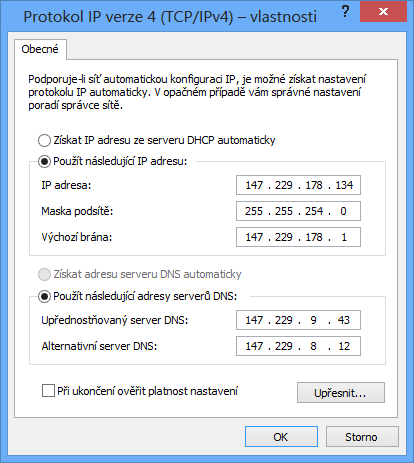

<!--
New-NetIPAddress selže, pokud na rozhraní už statická adresa je – nejdřív Remove-NetIPAddress (a Remove-NetRoute pro starou výchozí bránu), nebo použít Set-NetIPAddress. Při přechodu ze statické na DHCP je nutné odstranit i statickou výchozí bránu (Remove-NetRoute -InterfaceAlias LAN1 -DestinationPrefix 0.0.0.0/0).

netsh dál funguje, ale Microsoft ho označuje za nástroj pro starší skripty; nové skripty mají používat cmdlety Net*. Na cvičení (E03) se používají adresy 192.168.0.0/24 na adaptéru LAN1 (Private1) bez výchozí brány – v laboratorní síti žádný směrovač není; parametr -DefaultGateway <IP> (netsh: čtvrtý argument) se uvádí jen tam, kde směrovač je.

Zdroj: https://learn.microsoft.com/en-us/powershell/module/nettcpip/new-netipaddress?view=windowsserver2025-ps
Zdroj: https://learn.microsoft.com/en-us/powershell/module/dnsclient/set-dnsclientserveraddress?view=windowsserver2025-ps
-->

---

# Informace o nastavení protokolu IPv4

- **Nastavení** \ Síť a internet \ Ethernet (Wi-Fi) – přehled ve vlastnostech sítě
  - Upřesnit nastavení sítě \ Vlastnosti hardwaru a připojení – vše na jedné stránce
- Pomocí nástroje **ipconfig**
  - `ipconfig /all`
- **PowerShell**
  - `Get-NetIPConfiguration -Detailed` (obdoba `ipconfig /all`)
  - `Get-NetIPAddress -AddressFamily IPv4`, `Get-NetAdapter`, `Get-DnsClientServerAddress`

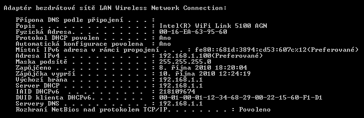

<!--
Snímek výstupu ipconfig je z Windows 7; formát výstupu se ve Windows 11 nezměnil.
-->

---

<!-- _class: dense -->

# PowerShell – moduly pro správu sítě

- **NetTCPIP** – adresy, rozhraní, směrování, TCP/UDP spojení, `Test-NetConnection`
- **NetAdapter** – síťové karty (`Get-NetAdapter`, `Disable-NetAdapter`, `Rename-NetAdapter`, `Get-NetAdapterBinding`)
- **DnsClient** – DNS klient (`Resolve-DnsName`, `Get-DnsClientCache`, `Set-DnsClientServerAddress`, DoH)
- **NetConnection** – síťové profily (`Get-NetConnectionProfile`, `Set-NetConnectionProfile`)
- **NetSecurity** – Windows Defender Firewall (L05), **SmbShare** – sdílení (L06)
- **Dokumentace**: <https://learn.microsoft.com/en-us/powershell/module/nettcpip/?view=windowsserver2025-ps>

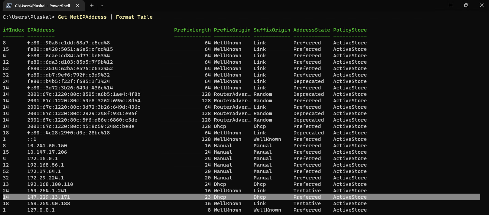

<!--
Cmdlety fungují stejně ve Windows PowerShell 5.1 i v PowerShellu 7 (přes kompatibilní vrstvu). Dokumentace na learn.microsoft.com je verzovaná podle Windows Server (windowsserver2025-ps = aktuální), stejné moduly jsou i v klientských Windows 11.

Ve výpisu jsou vidět typy IPv6 adres podle původu (PrefixOrigin / SuffixOrigin): WellKnown/Link = link-local, RouterAdvertisement/Link = SLAAC s náhodným identifikátorem, RouterAdvertisement/Random = dočasné (temporary) adresy, Dhcp/Dhcp = DHCPv6; AddressState Deprecated = adresa už se nepoužívá pro nová spojení.

Zdroj: https://learn.microsoft.com/en-us/powershell/module/nettcpip/?view=windowsserver2025-ps
-->

---

<!-- _class: dense -->

# Síťové profily (Network Location Awareness)

- Každé připojení má **profil**, podle něj se aplikují pravidla brány firewall (L05) a zjišťování sítě
  - **Veřejná síť** – výchozí, počítač skrytý, sdílení blokováno
  - **Privátní síť** – důvěryhodná síť, zjišťování a sdílení povoleno
  - **Doménová síť** – automaticky po ověření vůči řadiči domény
- Windows 11: Nastavení \ Síť a internet \ Ethernet (Wi-Fi \ síť) \ **Typ síťového profilu**
- **PowerShell**
  - `Get-NetConnectionProfile`
  - `Set-NetConnectionProfile -InterfaceAlias LAN0 -NetworkCategory Private`
- Historie: **Windows 7/8** – dotaz Domácí / Pracovní / Veřejná síť při prvním připojení; **Windows 10** – přepínač „Nastavit tento počítač jako zjistitelný“

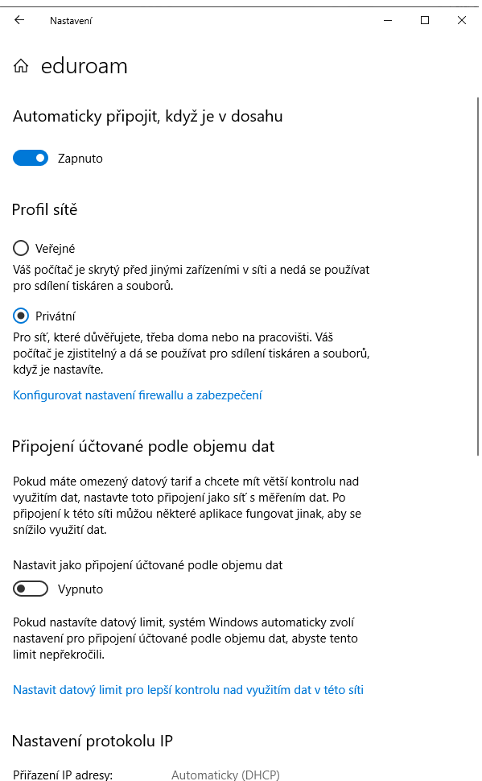

<!--
Služba Network Location Awareness (NlaSvc) určuje profil podle identifikace sítě (výchozí brána, MAC, DNS přípona, dostupnost řadiče domény). Profil Doména nelze nastavit ručně. Na cvičení (E03, Lab 02) se profil adaptéru LAN0 přepíná mezi Private a Public a sleduje se dopad na pravidla brány firewall.

Snímek je z Windows 10 (stránka Wi-Fi sítě s přepínačem Profil sítě); ve Windows 11 je stejná volba pojmenovaná Typ síťového profilu.

Zdroj: https://learn.microsoft.com/en-us/powershell/module/netconnection/set-netconnectionprofile?view=windowsserver2025-ps
-->

---

# Směrování

- Provádí se pomocí tzv. **směrovacích tabulek**
  - Informace o dosažitelných (pod)sítích
- **Obecný algoritmus** směrování
  - Pokud je cíl **totožný se zdrojem**
    - Neposílej data na síť (doručení probíhá interně)
  - Pokud je cíl na **stejné (pod)síti**
    - Pošli data na síť (doručení na MAC adresu cíle)
  - Pokud je cíl na **jiné (pod)síti**
    - Pošli data na výchozí bránu, jenž umožňuje doručení do cílové sítě (doručení na MAC adresu výchozí brány)

---

# Směrovací tabulka

- **Vypsání** např. pomocí `route print` nebo `Get-NetRoute`
- Neoficiální GUI **NetRouteView**
  - <https://www.nirsoft.net/utils/network_route_view.html>

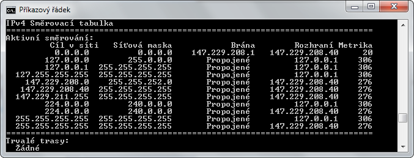

`route print`

---

<!-- _class: dense -->

# Směrovací tabulka – PowerShell

- `Get-NetRoute -AddressFamily IPv4 | Sort-Object RouteMetric` – **výpis**
- `Find-NetRoute -RemoteIPAddress 8.8.8.8` – **kterou cestou** a z jaké adresy se pošle datagram
- `New-NetRoute -DestinationPrefix 10.0.0.0/8 -InterfaceAlias LAN1 -NextHop 192.168.0.10` – **přidání trasy** (`-PolicyStore PersistentStore` = trvalá)
- `Remove-NetRoute -DestinationPrefix 10.0.0.0/8` – **odebrání**; historie: `route add … -p`, `route delete`

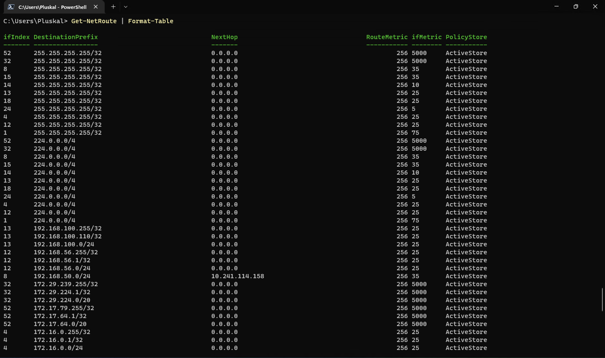

<!--
Metrika trasy = RouteMetric + ifMetric (metrika rozhraní, automaticky podle rychlosti linky, lze změnit Set-NetIPInterface -InterfaceMetric). Trasa s nižší metrikou vyhrává, při shodě delší prefix.

Zdroj: https://learn.microsoft.com/en-us/powershell/module/nettcpip/new-netroute?view=windowsserver2025-ps
-->

---

# Network Address Translation (NAT)

- Metoda **překladu IP adres** (a portů) z jedné sítě do jiné sítě (např. z privátní sítě do sítě internet)
  - Dochází k úpravě hlaviček IP datagramů (zpomalení)
  - Překlad se provádí na základě překladových tabulek
- **Přístup do sítě internet** pro zařízení s IP adresami, jenž v ní nejsou směrovatelné
  - Překlad privátních IP adres na veřejné IP adresy
  - Počítače na privátní síti nejsou adresovatelné ze sítě internet (nelze se na ně připojit z internetu)
    - Vyšší bezpečnost, problematické poskytování služeb

<!--
Ve Windows se NAT používá i lokálně: Hyper-V přepínač Default Switch (na stanicích v C304 dává virtuálním strojům DHCP a internet přes NAT), WSL2, Mobilní hotspot a Sdílení připojení k internetu. Vlastní NAT pro Hyper-V přepínač: New-NetNat (modul NetNat).
-->

---

<!-- _class: dense -->

# Princip činnosti NAT

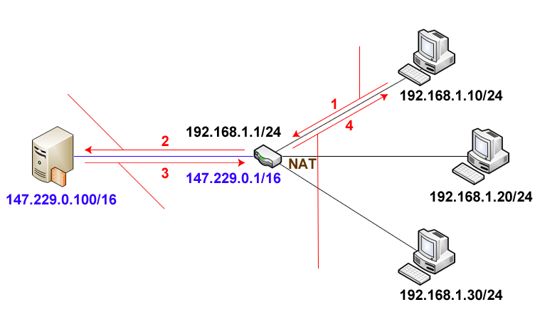

| Překladová tabulka                              |
| ----------------------------------------------- |
| 192.168.1.10 : 2412 ← TCP → 147.229.0.1 : 5000  |

**1**

| Protokol        | TCP           |
| --------------- | ------------- |
| Zdrojová adresa | 192.168.1.10  |
| Zdrojový port   | 2412          |
| Cílová adresa   | 147.229.0.100 |
| Cílový port     | 80            |

**2**

| Protokol        | TCP           |
| --------------- | ------------- |
| Zdrojová adresa | 147.229.0.1   |
| Zdrojový port   | 5000          |
| Cílová adresa   | 147.229.0.100 |
| Cílový port     | 80            |

**3**

| Protokol        | TCP           |
| --------------- | ------------- |
| Zdrojová adresa | 147.229.0.100 |
| Zdrojový port   | 80            |
| Cílová adresa   | 147.229.0.1   |
| Cílový port     | 5000          |

**4**

| Protokol        | TCP           |
| --------------- | ------------- |
| Zdrojová adresa | 147.229.0.100 |
| Zdrojový port   | 80            |
| Cílová adresa   | 192.168.1.10  |
| Cílový port     | 2412          |

---

# Protokol DHCP

- **Dynamic Host Configuration Protocol**
- **Automatická konfigurace** IP adres zařízení
  - Omezená doba platnosti (*lease time*)
  - Možnost rezervace IP adres pro konkrétní zařízení
  - Lze nastavovat i další informace (*options*):
    - výchozí brána, DNS servery, doménová přípona, NTP, PXE boot (option 60/66/67)
- **Obnova** při startu zařízení nebo manuálně
  - Uvolnění IP adresy příkazem `ipconfig /release`
  - Obnova IP adresy příkazem `ipconfig /renew`
  - PowerShell: `Get-NetIPAddress -PrefixOrigin Dhcp`, `Set-NetIPInterface -Dhcp Enabled`

<!--
Pro IPv6 existuje DHCPv6 (stavová konfigurace) – Windows ho používá, pokud router v RA nastaví příznaky M/O; kromě toho si adresy generuje sám pomocí SLAAC. Přepínače ipconfig /release6 a /renew6 pracují s DHCPv6.

PXE boot: klient dostane přes DHCP options 66 (Boot Server Host Name) a 67 (Bootfile Name) adresu TFTP serveru a jméno zavaděče; option 60 (PXEClient) se používá, když DHCP a PXE server běží na jednom stroji. Používá to WDS i moderní nástupci (Configuration Manager PXE, iPXE). WDS je od Windows Server 2022 zastaralý (L03).
-->

---

# Systém DNS

- **Domain Name System**
- Systém pro **překlad doménových jmen** (*domain name*) na odpovídající IP adresy
- **Kešování** výsledků překladů po dobu TTL
  - Zobrazení aktuální keš příkazem `ipconfig /displaydns` nebo `Get-DnsClientCache`
  - Podpora negativního kešování (*negative caching*)
    - Cíl neexistuje
  - Vyrovnávací paměť (*cache*) lze vymazat i manuálně příkazem `ipconfig /flushdns` nebo `Clear-DnsClientCache`
- **Automatická registrace** zařízení v systému DNS
  - Lze spustit manuálně příkazem `ipconfig /registerdns` nebo `Register-DnsClient`
- **Dotazy**: `nslookup`, `Resolve-DnsName` (viz nástroje)

<!--
Negativní kešování – pokud autoritativní server odpoví negativně (NXDOMAIN), klient si i tuto odpověď zapamatuje.

Windows 11 má kromě klasického DNS klienta i mDNS/LLMNR pro překlad jmen v lokální síti bez DNS serveru (LLMNR Microsoft doporučuje vypnout politikou, mDNS je standard RFC 6762).
-->

---

<!-- _class: dense -->

# Šifrované DNS – DNS over HTTPS (DoH)

- **Klasické DNS**: UDP/TCP 53 v otevřeném textu → lze odposlouchávat a podvrhovat
- Windows 11 (a Windows Server 2022+) má **DoH klienta** (RFC 8484) přímo v systému
  - Funguje jen pro DNS servery ze seznamu známých DoH serverů (výchozí: Cloudflare 1.1.1.1, Google 8.8.8.8, Quad9 9.9.9.9 a jejich IPv6 adresy)
  - Nastavení \ Síť a internet \ Ethernet \ Přiřazení serveru DNS \ Upravit \ Ručně → **Preferované šifrování DNS**
    - *Pouze nešifrované* / *Pouze šifrované (DNS přes HTTPS)* / *Upřednostňovat šifrované, povolit nešifrované*
- **PowerShell** (modul DnsClient)
  - `Get-DnsClientDohServerAddress` – seznam známých serverů
  - `Add-DnsClientDohServerAddress -ServerAddress 10.0.0.53 -DohTemplate https://dns.priklad.cz/dns-query -AllowFallbackToUdp $false -AutoUpgrade $true`
  - `netsh dns show encryption` – klasický ekvivalent
- **Zásady skupiny**: Konfigurace počítače \ Šablony pro správu \ Síť \ Klient DNS \ *Configure DNS over HTTPS (DoH) name resolution* (Allow / Prohibit / Require)
- Windows Server 2025 umí DoH i **na straně DNS serveru** (od aktualizace 2026-06, KB5094125)

<!--
V doménovém prostředí Microsoft nedoporučuje „Require DoH“ – Active Directory je silně závislé na DNS a DNS server ve Windows Server před 2025 (2026-06) DoH neuměl. DNSSEC je doplněk, ne náhrada: DoH chrání přenos, DNSSEC ověřuje pravost dat.

Podporu DNS over TLS (DoT) v klientu Windows 11 se z dokumentace learn.microsoft.com nepodařilo ověřit – na snímku neuvádíme.

České popisky voleb šifrování jsou překladem anglických „Unencrypted only“, „Encrypted only (DNS over HTTPS)“, „Encrypted preferred, unencrypted allowed“ – ověřit přesné znění na Windows 11 25H2 s českým jazykem.

Zdroj: https://learn.microsoft.com/en-us/windows-server/networking/dns/doh-client-support
Zdroj: https://learn.microsoft.com/en-us/windows-server/networking/dns/dns-encryption-dns-over-https
-->

---

<!-- _class: dense -->

# Sdílení připojení k internetu (ICS) a Mobilní hotspot

- **Internet Connection Sharing** – počítač jako NAT router pro další síť
  - Automatická konfigurace NAT, DHCP a DNS proxy
  - Přiděluje IPv4 adresy ze sítě 192.168.137.0/24, výchozí brána 192.168.137.1 (lze změnit v registru)
  - Zapíná se ve vlastnostech sdíleného připojení (`ncpa.cpl`), karta *Sdílení*
- **Mobilní hotspot** – Nastavení \ Síť a internet \ Mobilní hotspot
  - Sdílení připojení (Ethernet, Wi-Fi, mobilní síť) přes Wi-Fi nebo Bluetooth, volba pásma (2,4 / 5 GHz)
  - Vestavěný soft-AP + ICS (klienti dostávají adresy 192.168.137.x)
  - Vyžaduje Wi-Fi adaptér s podporou Wi-Fi Direct
- Historie: **Wireless Hosted Network** (Windows 7, `netsh wlan set hostednetwork`)
  - Přidělovalo adresy ze sítě 192.168.173.0/24
  - Ovladače WDI (Windows 10+) SoftAP nepodporují → `netsh wlan show drivers` hlásí „Hosted network supported: No“; náhradou je Mobilní hotspot

<!--
Rozsah 192.168.137.0/24 používá ICS od Windows 7 a pokračuje ve Windows 11; pokud stejný rozsah používá i nadřazená síť, ICS nefunguje. Změna přes registr HKLM\SYSTEM\CurrentControlSet\Services\SharedAccess\Parameters (ScopeAddress, StandaloneDhcpAddress).

Wireless Hosted Network je popsán jako funkce Windows 7 (dokumentace nebyla od té doby aktualizována); v odpovědích Microsoft Q&A a v dokumentaci Intelu se uvádí, že nový ovladačový model WDI ve Windows 10 SoftAP/ad-hoc nepodporuje, a doporučuje se Mobilní hotspot.

Zdroj: https://learn.microsoft.com/en-us/windows/win32/nativewifi/about-the-wireless-hosted-network
Zdroj: https://learn.microsoft.com/en-us/answers/questions/4260014/hosted-network-not-supported
Zdroj: https://www.intel.com/content/www/us/en/support/articles/000023257/wireless.html
-->

---

# Povolení sdílení připojení k internetu

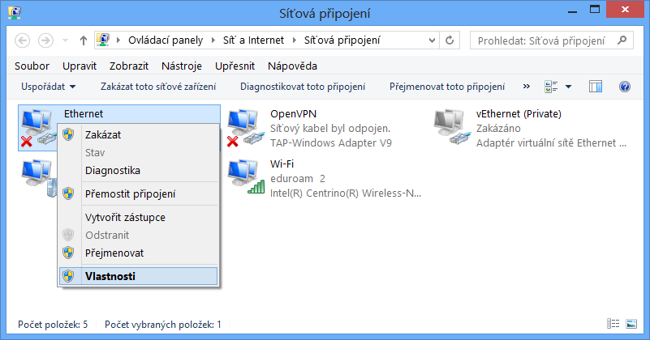

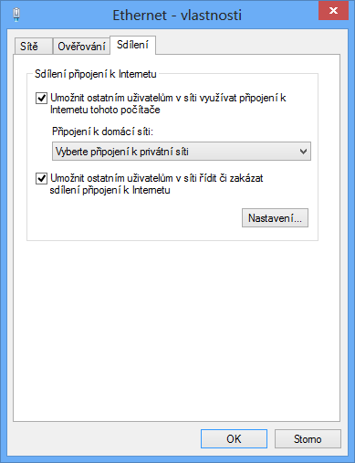

<!--
Klasický dialog Síťová připojení (ncpa.cpl) \ Vlastnosti \ Sdílení – ve Windows 11 vypadá stejně jako na snímku z Windows 8. V rozevíracím seznamu se vybírá privátní rozhraní, kterému ICS přidělí adresu 192.168.137.1.
-->

---

# Internet Protocol verze 6 (IPv6)

- Protokol **internetové (resp. síťové) vrstvy** (RFC 8200, internetový standard od 2017)
- Zajišťuje **směrování IPv6 datagramů** (paketů)
- Ve Windows je **povinnou součástí** systému od Windows Vista
  - **Dual stack** – IPv4 i IPv6 současně, IPv6 se upřednostňuje
  - Microsoft nedoporučuje IPv6 vypínat (některé součásti pak nefungují)

<!--
Místo vypínání IPv6 Microsoft doporučuje změnit prioritu prefixů („Prefer IPv4 over IPv6“, DisabledComponents = 0x20) – viz snímek IPv6 ve Windows 11.

Zdroj: https://learn.microsoft.com/en-us/troubleshoot/windows-server/networking/configure-ipv6-in-windows
-->

---

# Formát IPv6 adres

- Délka **128 bitů**
- Zápis v tzv. **dvojtečkové notaci**
  - X:X:X:X:X:X:X:X kde X je hexadecimální číslo od 0000 do FFFF (16 bitů, tzv. skupina / blok)
- Skládá se z **identifikátorů (pod)sítě a rozhraní**
  - Určeny IPv6 prefixem

<!--
IPv6 adres je 3.4*10^38 (oproti 4*10^9 IPv4 adres), což 6.5*10^23 adres na každý metr čtvereční planety Země nebo 5*10^28 pro každého člověka.
-->

---

# Zkrácený formát IPv6 adres

- **Vynechání úvodních nul** každé skupiny
  - V každé skupině musí zůstat alespoň jedna číslice
- **Sloučení** po sobě jdoucích nulových skupin
  - Lze provést pouze jednou v rámci dané IPv6 adresy
- **Doporučený tvar** (RFC 5952): malá písmena, co nejdelší běh nul nahradit `::`

`2001:0db8:0000:000a:f563:5add:6fc4:152e` → `2001:db8:0:a:f563:5add:6fc4:152e`

`2001:db8:0:a:f563:5add:6fc4:152e` → `2001:db8::a:f563:5add:6fc4:152e`

<!--
Prefix 2001:db8::/32 je vyhrazen pro dokumentaci a příklady (RFC 3849) – původní příklady s fec0:: používaly site-local adresy, které jsou od RFC 3879 (2004) zrušené.
-->

---

# IPv6 prefix

- Určuje kolik **počátečních bitů** IPv6 adresy naleží identifikátoru (pod)sítě (vychází z CIDR notace)
- **Stejný zápis** jako u masky podsítě u CIDR
  - X:X:X:X:X:X:X:X/Y kde Y je číslo od 0 do 128
- **Příklad** IPv6 adresy s definovaným prefixem
  - `2001:0db8:0000:000a:f563:5add:6fc4:152e/64`
  - Náleží do (pod)sítě `2001:0db8:0000:000a::/64`
    - Po vynechání úvodních nul `2001:db8:0:a::/64`
- Koncové sítě mají typicky **prefix /64** (nutné pro SLAAC), organizace dostává /48 nebo /56

---

# Typy IPv6 adres

- **Individuální** (*unicast*)
  - Identifikují právě jedno síťové rozhraní
  - Data se doručují tomuto rozhraní
- **Skupinové** (*multicast*)
  - Identifikují celou skupinu síťových rozhraní
  - Data se doručují všem členům skupiny
- **Výběrové** (*anycast*)
  - Identifikují celou skupinu síťových rozhraní
  - Data se doručují nejbližšímu členovi skupiny

---

# Globální individuální IPv6 adresy

- **Global Unicast Addresses**
- Adresy ze sítě **2000::/3**
- Obdoba **veřejných IPv4 adres**
  - Jednoznačná identifikace rozhraní v rámci celé sítě internet
  - Přiřazovány automaticky pomocí SLAAC (router advertisement), DHCPv6 nebo manuálně
  - Identifikátor rozhraní: Windows generuje náhodně (ne z MAC adresy) a navíc používá dočasné adresy

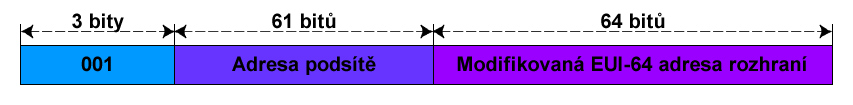

<!--
Globální individuální IPv6 adresy mohou mít i jiný prefix než 001, ovšem ty jsou zatím rezervovány a budou použity až dojdou globální individuální IPv6 adresy s prefixem 001.

Obrázek ukazuje původní schéma s modifikovaným EUI-64 identifikátorem odvozeným z MAC adresy. Windows od Vista ve výchozím stavu generuje náhodný stabilní identifikátor (netsh interface ipv6 set global randomizeidentifiers, Get-NetIPv6Protocol → RandomizeIdentifiers) a navíc dočasné adresy podle RFC 8981 (dříve RFC 4941) – ty se pravidelně mění a používají se pro odchozí spojení (SuffixOrigin = Random ve výpisu Get-NetIPAddress).
-->

---

# Místní IPv6 adresy v rámci propojení

- **Link-Local Addresses**
- Adresy ze sítě **fe80::/10** (pro ethernet fe80::/64)
- Obdoba **APIPA adres**
  - Jednoznačná identifikace rozhraní v rámci propojení
  - EUI se generuje automaticky (náhodně) pro každé síťové rozhraní
  - Nesměrovatelné – při zápisu se doplňuje index rozhraní (zone ID), např. `fe80::1%14`
  - Používají se pro Neighbor Discovery (náhrada ARP) a router advertisement

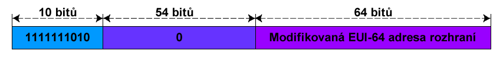

<!--
Sousedy (obdoba ARP tabulky) vypíše Get-NetNeighbor -AddressFamily IPv6 nebo netsh interface ipv6 show neighbors. Index rozhraní za % odpovídá ifIndex ve výpisu Get-NetAdapter.
-->

---

# Místní IPv6 adresy

- **Unique Local Addresses**
- Adresy ze sítě **fc00::/7**
- Obdoba **privátních IPv4 adres**
  - Jednoznačná identifikace rozhraní v rámci lokální sítě
  - Nesměrovatelné v síti internet
  - Přiřazovány pomocí protokolu DHCPv6 nebo pomocí tzv. router advertisement (bezestavová konfigurace)

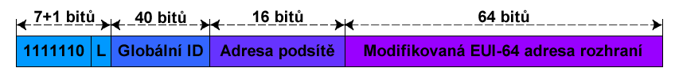

<!--
V říjnu 2005 (v RFC 4193) nahradily Site-Local Addresses, jenž byly označeny jako deprecated (v RFC 3879).

Bit L určuje jakým způsobem bylo vygenerováno globální ID. Pokud je nastaven na 1, znamená to, že byla použita tzv. lokální metoda generování globálního ID, jenž je popsána v RFC 4193.
-->

---

# Skupinové (multicast) IPv6 adresy

- Adresy ze sítě **ff00::/8**
- Identifikace **skupiny rozhraní**
- Data se doručují **všem členům** skupiny
- **Dosah** definuje rozsah platnosti skupiny
  - Určuje, jak daleko mohou být data zaslána
  - Nejčastěji se používají dosahy uzel, propojení, místo (lokální síť), organizace (VPN) a globální (síť internet)

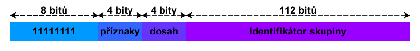

<!--
https://en.wikipedia.org/wiki/Multicast_address#IPv6
-->

---

# Výběrové (anycast) IPv6 adresy

- Identifikace **skupiny rozhraní**
- Data se doručují **nejbližšímu členovi** skupiny
  - Potřeba metriky (např. počet skoků datagramu)
  - Nutná podpora na směrovačích
- **Využití**
  - Systém DNS, CDN (Content Delivery Networks)

<!--
Aktuálně se využívá Border Gateway Protocol (BGP), resp. jeho rozšíření, pro výpočet metriky.

Kromě výše popsaného formátu lze jako výběrové IPv6 adresy používat i individuální (unicast) IPv6 adresy. Pro to je ovšem nutná podpora na směrovačích, které musí být schopny rozlišit, zda s danou IPv6 adresou mají nakládat jako s individuální nebo výběrovou.
-->

---

# Speciální IPv6 adresy

- **Neplatná** IPv6 adresa
  - 0:0:0:0:0:0:0:0 nebo ::
- **Loopback** IPv6 adresa
  - 0:0:0:0:0:0:0:1 nebo ::1
- **Privátní** IPv6 adresy
  - Místní adresy (unique local a link-local adresy)
  - Nesměrovatelné v síti internet
- **Další vyhrazené prefixy**
  - 2001:db8::/32 – dokumentace a příklady (RFC 3849)
  - ::ffff:0:0/96 – IPv4 adresy mapované do IPv6 (např. ::ffff:147.229.178.134)

---

# Výhody protokolu IPv6 (1)

- **Větší prostor adres**
- **Automatická konfigurace** adres
  - Podpora bezstavové konfigurace (SLAAC, nevyžaduje DHCP)
- **Zabezpečení** na úrovni sítě
  - IPsec (Internet Protocol Security) je součástí architektury IPv6
  - Historie: do roku 2011 povinný (MUST) pro každou implementaci, od [RFC 6434](https://www.rfc-editor.org/rfc/rfc6434) jen doporučený (SHOULD) – potvrzeno i v aktuálním [RFC 8504](https://www.rfc-editor.org/rfc/rfc8504) (2019)
- Podpora **QoS** (Quality of Service)
  - Identifikace typu dat v hlavičce (nešifrováno),
  - Flow label
  - V IPv4 DSCP

<!--
RFC 8504 (IPv6 Node Requirements, leden 2019) nahradilo RFC 6434 (2011), které nahradilo RFC 4294 (2006). Aktuální požadavky na IPv6 uzel: IPsec SHOULD, dočasné adresy (privacy extensions) SHOULD s možností vypnutí uživatelem, přechodové mechanismy (6to4, ISATAP, Teredo) nejsou vyžadovány.

Zdroj: https://www.rfc-editor.org/rfc/rfc8504
-->

---

# Výhody protokolu IPv6 (2)

- Menší velikost **směrovacích tabulek**
  - Slučování souvislých bloků adres
- Menší **fixní velikost hlavičky**
  - Obsahuje jen nejnutnější informace, vše ostatní jinde
- **Eliminace všesměrového vysílání**
  - Nahrazeno skupinovým vysíláním s možností definice dosahu

---

<!-- _class: dense -->

# IPv6 ve Windows 11 – výchozí chování

- **Dual stack**, výběr adresy podle tabulky prefixů (RFC 6724) – IPv6 má přednost
  - `Get-NetPrefixPolicy`, `netsh interface ipv6 show prefixpolicies`
  - Preferovat IPv4 místo vypínání IPv6: registr `DisabledComponents` = 0x20
- **Náhodné identifikátory** rozhraní a **dočasné adresy** (RFC 8981) zapnuty
  - `Get-NetIPv6Protocol` → `RandomizeIdentifiers`, `UseTemporaryAddresses`
- **Bezestavová konfigurace** (SLAAC) + DHCPv6 podle příznaků M/O v router advertisement
- **Přechodové (tunelovací) technologie** jsou zastaralé a vypnuté
  - 6to4 od Windows 10 1607, ISATAP od 1703, Teredo od 1803 – používat nativní IPv6
  - DirectAccess (IP-HTTPS) zastaralý od 2024 → Always On VPN (L11)
- **IPv6-only síť**: Microsoft deklaruje, že IPv6 je povinná součást Windows a vestavěné služby na něm fungují i bez IPv4 (IPv4 lze vypnout na rozhraní, ne v systému) – konkrétní scénáře (SMB, RDP, AD, Windows Update) ověřit v praxi

<!--
Zdroj (transition technologies vypnuté, verze): https://learn.microsoft.com/en-us/windows/whats-new/deprecated-features
Zdroj (DirectAccess deprecated, červen 2024): https://learn.microsoft.com/en-us/windows/whats-new/deprecated-features
Zdroj (DisabledComponents, doporučení nevypínat IPv6): https://learn.microsoft.com/en-us/troubleshoot/windows-server/networking/configure-ipv6-in-windows

Poslední odrážka je záměrně formulována jako deklarace Microsoftu (článek Configure IPv6 in Windows: IPv6 je povinná součást Windows, nedoporučuje se vypínat), ne jako ověřený seznam – konkrétní seznam ověřených IPv6-only scénářů pro 24H2/Server 2025 na learn.microsoft.com není.
-->

---

<!-- _class: dense -->

# Nastavení protokolu IPv6

- Nastavení \ Síť a internet \ Ethernet \ Přiřazení IP adresy \ Upravit \ Ručně → přepínač **IPv6**
  - IP adresa, Délka předpony podsítě, Brána, DNS
- **Klasický dialog**: Vlastnosti připojení \ Protokol IP verze 6 (TCP/IPv6)
- **PowerShell**
  - `New-NetIPAddress -InterfaceAlias LAN1 -IPAddress 2001:db8::11 -PrefixLength 64 -DefaultGateway 2001:db8::1`
  - `Set-DnsClientServerAddress -InterfaceAlias LAN1 -ServerAddresses 2001:db8::53`
- **Historie**: `netsh interface ipv6 set address "LAN1" 2001:db8::11/64`, `netsh interface ipv6 add route ::/0 "LAN1" 2001:db8::1`

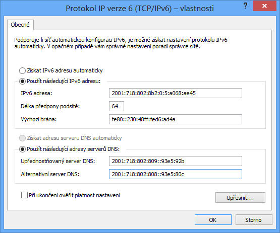

<!--
Pokud není prefix specifikován, použije se prefix o délce 64 bitů. Výchozí brána u IPv6 je typicky link-local adresa routeru (fe80::…), jak je vidět i na snímku klasického dialogu.
-->

---

# Informace o nastavení protokolu IPv6

- Lze využít **stejné nástroje** jako u protokolu IPv4
  - `ipconfig /all`, `Get-NetIPConfiguration -Detailed`
  - `Get-NetIPAddress -AddressFamily IPv6`
  - Nastavení \ Síť a internet \ Ethernet – Adresa IPv6, Místní adresa IPv6 v rámci propojení, Servery DNS IPv6

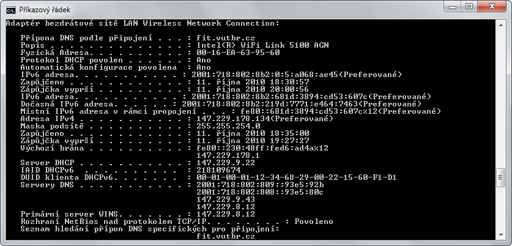

<!--
Ve výpisu ipconfig /all jsou vidět dvě globální adresy (stabilní SLAAC + DHCPv6) a „Dočasná IPv6 adresa“ – ta se používá jako zdrojová pro odchozí spojení.
-->

---

<!-- _class: dense -->

# Podrobné informace o IPv6 adresách

- `Get-NetIPAddress -AddressFamily IPv6 | Format-List` – **stav** (Preferred / Deprecated / Tentative), **původ** (SLAAC, Random, Dhcp, Manual), **doby platnosti** (ValidLifetime, PreferredLifetime)
- `netsh interface ipv6 show addresses level=verbose` – **klasický výpis** (na snímku)

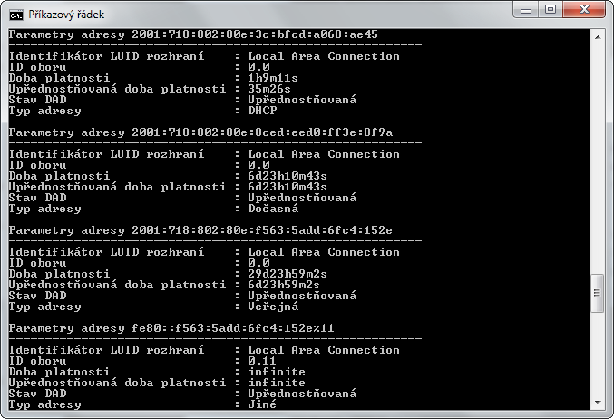

<!--
ID oboru (Scope ID) určuje topologický rozsah v jehož rámci může být IPv6 adresa použita jako unikátní identifikátor.

Stav DAD (Duplicate Address Detection): Tentative = adresa se ještě ověřuje, Preferred = platná a používaná, Deprecated = platná, ale nepoužívá se pro nová spojení (typicky staré dočasné adresy), Duplicate = konflikt.
-->

---

<!-- _class: dense -->

# Nástroje pro správu sítě

| Úloha                              | Klasický nástroj      | PowerShell                                            |
| ---------------------------------- | --------------------- | ----------------------------------------------------- |
| Konfigurace adres                  | `ipconfig`, `netsh`   | `Get-NetIPConfiguration`, `Get-/New-/Set-NetIPAddress` |
| Dostupnost cíle                    | `ping`                | `Test-NetConnection`, `Test-Connection`               |
| Trasování cesty                    | `tracert`, `pathping` | `Test-NetConnection -TraceRoute`                      |
| Překlad jmen                       | `nslookup`            | `Resolve-DnsName`, `Get-DnsClientCache`               |
| Spojení a porty                    | `netstat`             | `Get-NetTCPConnection`, `Get-NetUDPEndpoint`          |
| Směrovací tabulka                  | `route`               | `Get-/New-/Remove-NetRoute`, `Find-NetRoute`          |
| Sousedé (ARP / ND)                 | `arp -a`              | `Get-NetNeighbor`                                     |
| Adaptéry, MAC adresy               | `getmac`, `netsh`     | `Get-NetAdapter`, `Get-NetAdapterStatistics`          |
| Zachytávání paketů                 | `netsh trace`         | `pktmon` (samostatný nástroj)                         |

- Všechny nástroje pracují s protokolem **IPv4 i IPv6** (přepínače `-4` / `-6`)

<!--
PowerShell cmdlety vrací objekty, které lze dál filtrovat a řadit (Where-Object, Sort-Object, Export-Csv) – to je hlavní důvod, proč jsou pro skriptování a vzdálenou správu (Invoke-Command) vhodnější než textový výstup klasických nástrojů. Klasické nástroje zůstávají pro rychlou interaktivní diagnostiku a na cvičení (E03) se používají obě sady.
-->

---

# ping

- **Ověření dostupnosti** cílového zařízení
- Využívá protokol **ICMP** (v4 nebo v6)
- Provádí **překlad hostitelských jmen** na IP adresy
- Windows 11 na **příchozí ping** ve výchozím stavu neodpovídá
  - Pravidlo brány firewall „Sdílení souborů a tiskáren (požadavek echo – ICMPv4-In)“ je zapnuto jen v privátním/doménovém profilu se zapnutým sdílením (L05)
- **PowerShell**: `Test-NetConnection fit.vut.cz`, `Test-Connection fit.vut.cz -Count 2`

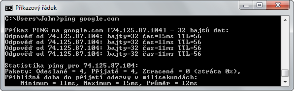

<!--
AutomatedLab nasazuje stanice s vypnutou bránou firewall ve všech profilech; skript E03 (Lab 00) ji zapíná a obnovuje výchozí stav. V Lab 03 studenti přepnou LAN1 do veřejného profilu (ping neprochází) a odpověď na ping povolí vlastním pravidlem pro ICMPv4 echo.
-->

---

# tracert

- **Trasování cesty** k cílovému zařízení
  - Kontrola dostupnosti (ping) každého uzlu na cestě (ICMP Echo s rostoucím TTL)
- Každé trasování může procházet **jinou cestou**
- **PowerShell**: `Test-NetConnection fit.vut.cz -TraceRoute` (vrací pole adres uzlů)

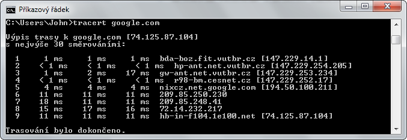

---

# pathping

- **Trasování cesty** k cíli s výpočtem statistik
  - Opakované ověřování dostupnosti a odezvy každého uzlu na cestě k cíli
  - Ukazuje, na kterém uzlu (lince) vznikají ztráty
- **Příklad**: `pathping google.com` (na snímku); nemá přímý PowerShell ekvivalent

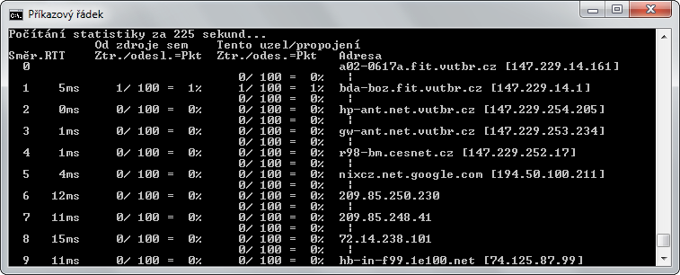

---

<!-- _class: dense -->

# nslookup a Resolve-DnsName

- `nslookup fit.vut.cz` – **klasický dotaz** na výchozí DNS server
  - `nslookup -type=MX vut.cz 1.1.1.1` – typ záznamu a konkrétní server
  - Interaktivní režim (`set type=AAAA`, `server 8.8.8.8`)
- `Resolve-DnsName fit.vut.cz` – vrací **objekty** (A, AAAA, CNAME …)
  - `Resolve-DnsName fit.vut.cz -Type AAAA -Server 1.1.1.1`
  - `Resolve-DnsName vut.cz -Type MX | Sort-Object Preference`
  - `-DnsOnly` (obejít hosts, LLMNR, mDNS), `-NoHostsFile`, `-CacheOnly`
- **Rozdíl**: `nslookup` má vlastní resolver (ptá se přímo serveru), `Resolve-DnsName` a `ping` používají DNS klienta Windows (cache, hosts, NRPT, DoH)

<!--
Proto může nslookup dát jinou odpověď než aplikace: neprojde přes Name Resolution Policy Table, hosts soubor ani DoH nastavení. Pro ladění „proč se mi jméno nepřekládá“ použít Resolve-DnsName, pro ověření odpovědi konkrétního serveru nslookup nebo Resolve-DnsName -Server.

Zdroj: https://learn.microsoft.com/en-us/powershell/module/dnsclient/resolve-dnsname?view=windowsserver2025-ps
-->

---

<!-- _class: dense -->

# netstat a Get-NetTCPConnection

- `netstat` zobrazuje **statistiky síťového provozu**
  - Aktivní spojení (`-a` nebo `-n`), otevřené porty (`-a`), vlastnící proces (`-o`, `-b` s oprávněním správce)
  - Směrovací tabulky (`-r`), statistiky protokolů (`-s -p { tcp(v6) | udp(v6) | icmp(v6) | ip(v6) }`), Ethernet (`-e`)
  - Typicky `netstat -ano -p tcp`
- **PowerShell** (modul NetTCPIP)
  - `Get-NetTCPConnection -State Listen | Select-Object LocalAddress, LocalPort, OwningProcess`
  - `Get-NetTCPConnection -State Established | Sort-Object RemoteAddress`
  - `Get-NetUDPEndpoint`
  - Spojení s názvem procesu: `Get-NetTCPConnection | Select-Object LocalPort, RemoteAddress, State, @{n='Process'; e={ (Get-Process -Id $_.OwningProcess).ProcessName }}`
- **Alternativa s GUI**: Sledování prostředků (`resmon`), karta *Síť*; Sysinternals TCPView

---

<!-- _class: dense -->

# Diagnostika sítě ve Windows 11

- **Poradce při potížích**: Nastavení \ Systém \ Řešení potíží \ Další poradci při potížích \ Síť a internet
  - Běží v aplikaci Získat nápovědu (*Get Help*); klasické MSDT poradce Microsoft ukončil (2023–2025)
  - Testuje platnost IP adres, dostupnost výchozí brány, DHCP, DNS, …
- **Resetování sítě**: Nastavení \ Síť a internet \ Upřesnit nastavení sítě – přeinstaluje adaptéry a vrátí výchozí nastavení TCP/IP
- **Prohlížeč událostí**: protokoly Microsoft-Windows-NetworkProfile, Dhcp-Client, DNS Client Events, WLAN-AutoConfig
- **Zpráva o Wi-Fi**: `netsh wlan show wlanreport` → HTML report (historie připojení, chyby)
- **Sběr konfigurace pro podporu**: `Get-NetView` (modul z PowerShell Gallery od Microsoftu) – jeden archiv se vším o síti počítače
- Historie: **Windows Network Diagnostics** (Windows 7/8) ukládal výsledky testů do ETL, které se otevíraly v Network Monitor / Message Analyzer – oba nástroje jsou ukončené

<!--
MSDT (Microsoft Support Diagnostic Tool) byl označen za zastaralý v lednu 2023; plán Microsoftu: 2023 přesměrování poradců do Získat nápovědu, 2024 odstranění zbývajících poradců, 2025 odstranění platformy MSDT. Ve Windows 11 24H2/25H2 už msdt.exe /id NetworkDiagnosticsNetworkAdapter poradce nespustí.

Get-NetView: https://www.powershellgallery.com/packages/Get-NetView (zdrojový kód https://github.com/microsoft/Get-NetView). Aktuální verzi se v době přípravy nepodařilo ověřit – před cvičením zkontrolovat.

Zdroj (MSDT deprecated): https://learn.microsoft.com/en-us/windows/whats-new/deprecated-features
Zdroj (harmonogram): https://support.microsoft.com/en-us/windows/deprecation-of-microsoft-support-diagnostic-tool-msdt-and-msdt-troubleshooters-0c5ac9a2-1600-4539-b9d0-069e71f9040a
-->

---

<!-- _class: dense -->

# Zachytávání a analýza paketů

- Historie: **Network Monitor 3.4** (2010, jen archiv) a **Message Analyzer** (staženo 25. 11. 2019, bez náhrady od Microsoftu)
- **pktmon** – Packet Monitor, součást Windows od Windows 10 2004 / Server 2019
  - `pktmon filter add -p 53` → `pktmon start --capture` → `pktmon stop` → `pktmon etl2pcap PktMon.etl`
  - Ukazuje i průchod paketu komponentami zásobníku (vSwitch, filtry) a důvod zahození
  - Rozšíření Packet Monitoring ve Windows Admin Center
- **netsh trace** – ETW trasování + zachytávání paketů
  - `netsh trace start capture=yes tracefile=C:\trace.etl` … `netsh trace stop`
  - ETL → pcapng: `etl2pcapng` (open source, Microsoft)
- **Wireshark** – standardní analyzátor protokolů (ovladač Npcap), otevře pcapng z obou nástrojů
- **Doporučený postup** Microsoftu: pktmon → netsh trace (když nestačí) → Wireshark na analýzu

<!--
Zdroj (Message Analyzer retirement notice): https://learn.microsoft.com/en-us/openspecs/blog/ms-winintbloglp/dd98b93c-0a75-4eb0-b92e-e760c502394f
Zdroj (pktmon): https://learn.microsoft.com/en-us/windows-server/networking/technologies/pktmon/pktmon
Zdroj (netsh trace): https://learn.microsoft.com/en-us/windows-server/administration/windows-commands/netsh-trace
Zdroj (etl2pcapng): https://github.com/microsoft/etl2pcapng
-->

---

# Bezdrátové sítě

- Identifikovány pomocí **SSID** (Service Set Identifier)
  - Různé bezdrátové sítě mohou mít stejné SSID
- Mohou být **neviditelné**
  - Nevysílají své SSID (zakázán tzv. SSID broadcast)
- Nastavení uloženo v (bezdrátových) **profilech**
  - Vytvářeny při připojení nebo importováním z XML (ručně, `netsh`, Intune / zásady skupiny)
  - Uspořádány podle priority profilu (preference sítě)
    - Výše uvedené bezdrátové profily (sítě) mají vyšší prioritu
    - Pokud je v dosahu více bezdrátových sítí, k nimž se systém automaticky připojuje, připojí se k té s nejvyšší prioritou

<!--
Standardně odpovídá každý profil jedné konkrétní bezdrátové sítí (bezdrátové síti identifikované jedním konkrétním SSID) a název profilu je totožný s SSID této bezdrátové sítě. Pak priorita použití konkrétního bezdrátového profilu vyjadřuje prioritu připojení k bezdrátové síti s SSID uloženém v tomto profilu (neboli preferování dané bezdrátové sítě před ostatními).
-->

---

<!-- _class: dense -->

# Standardy Wi-Fi a jejich podpora ve Windows

| Generace         | Standard | Pásma                   | Podpora ve Windows                              |
| ---------------- | -------- | ----------------------- | ----------------------------------------------- |
| Wi-Fi 4          | 802.11n  | 2,4 / 5 GHz             | Windows 7+                                      |
| Wi-Fi 5          | 802.11ac | 5 GHz                   | Windows 8.1+                                    |
| Wi-Fi 6          | 802.11ax | 2,4 / 5 GHz             | Windows 10, Windows 11                          |
| Wi-Fi 6E         | 802.11ax | + 6 GHz                 | Windows 10, Windows 11                          |
| Wi-Fi 7          | 802.11be | 2,4 / 5 / 6 GHz (MLO)   | Windows 11 24H2+; podnikové sítě (WPA3-Enterprise) od aktualizace 09/2025 |

- **Zjištění schopností adaptéru**: `netsh wlan show drivers`
  - Radio types supported: 802.11be / 802.11ax …
  - Authentication and cipher supported: WPA3 Personal / WPA3 Enterprise …
- V pásmu 6 GHz (Wi-Fi 6E/7) je **WPA3 povinné** – bez WPA3 se k síti nelze připojit

<!--
Wi-Fi 7 přináší Multi-Link Operation (současné použití více pásem), 320 MHz kanály a 4K-QAM. Podpora vyžaduje adaptér i přístupový bod s Wi-Fi 7 a WPA3.

Zdroj: https://support.microsoft.com/en-us/windows/experience/connectivity-networking/faster-and-more-secure-wi-fi-in-windows
Zdroj: https://techcommunity.microsoft.com/blog/windows-itpro-blog/introducing-wi-fi-7-for-enterprise-connectivity/4456751
-->

---

<!-- _class: dense -->

# Připojení k bezdrátové síti

- Přes **Rychlé nastavení** (ikona sítě v hlavním panelu, Win+A) → seznam sítí (vytvoří profil, pokud neexistuje)
- Nastavení \ Síť a internet \ Wi-Fi \ **Zobrazit dostupné sítě**
- Pomocí nástroje **netsh** (vyžaduje existující profil)
  - `netsh wlan connect name=<profil> [ssid=<ssid>] [interface=<rozhraní>]`
- **Zjištění bezdrátových sítí** v dosahu
  - `netsh wlan show networks mode=bssid`
- Pro Wi-Fi zatím neexistuje **vestavěný PowerShell modul** – `netsh wlan` zůstává primárním nástrojem příkazového řádku

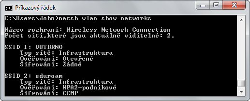

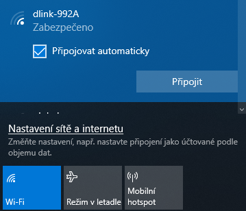

<!--
SSID sítě je potřeba zadat pouze v případě, že lze profil použít pro více sítí zároveň (obsahuje více než jedno SSID) a musíme specifikovat, ke které z těchto sítí se budeme připojovat. Standardně ovšem odpovídá každý profil jedné jediné síti (sítí identifikované jedním konkrétním SSID) a SSID bude zjištěno automaticky z profilu. Specifikace rozhraní, jenž se má použít pro připojení, má smysl pouze v případě, že máme více bezdrátových síťových rozhraní a chceme použít pro připojení konkrétní z nich. Pokud není rozhraní zadáno, vybere systém Windows vhodné rozhraní automaticky.

Snímek vpravo je panel sítí z Windows 10; ve Windows 11 je seznam Wi-Fi sítí součástí Rychlého nastavení (šipka u tlačítka Wi-Fi).
-->

---

# Ruční připojení k bezdrátové síti

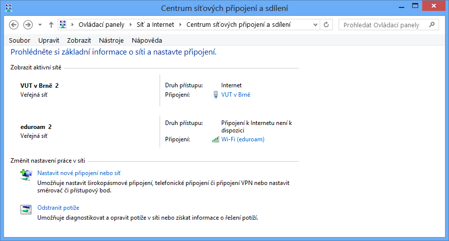 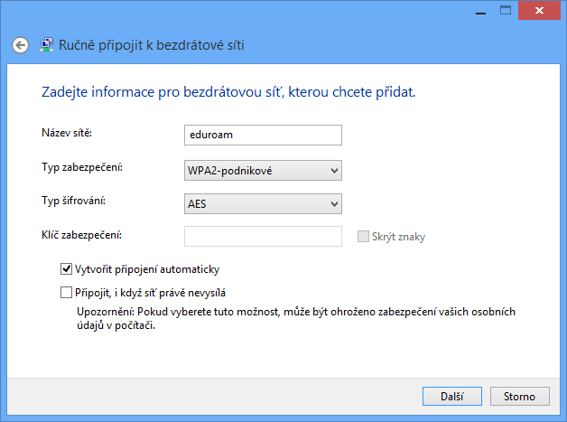 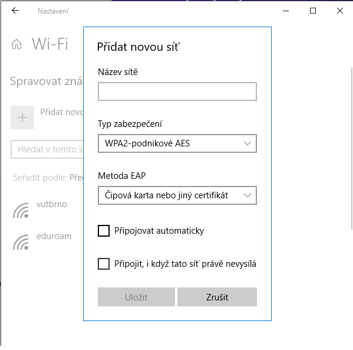

- Windows 11: Nastavení \ Síť a internet \ Wi-Fi \ Spravovat známé sítě \ **Přidat síť** (vpravo)
- Klasicky: Centrum síťových připojení a sdílení \ Nastavit nové připojení nebo síť \ **Ručně připojit k bezdrátové síti** (vlevo, uprostřed)

<!--
Ruční připojení k bezdrátové síti je potřeba např. pokud síť nevysílá své SSID (a nezobrazí se v seznamu sítí) nebo např. pokud chceme vytvořit profil pro bezdrátovou síť, jenž není aktuálně v dosahu.

Průvodce vlevo a uprostřed je z Windows 8, dialog Přidat novou síť vpravo z Windows 10 – ve Windows 11 vypadá stejně a nabízí i WPA3.
-->

---

# Informace o připojení k bezdrátové síti

- Nastavení \ Síť a internet \ Wi-Fi \ **vlastnosti sítě** (SSID, protokol, pásmo, kanál, rychlost linky, adresy)
- Pomocí nástroje **netsh**
  - `netsh wlan show interfaces`
- **Adaptér**: `Get-NetAdapter | Where-Object PhysicalMediaType -eq 'Native 802.11'`

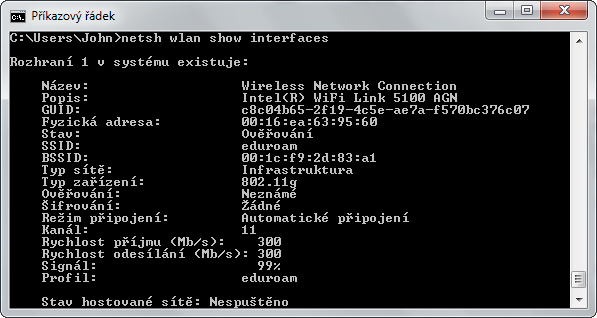

<!--
Řádek „Stav hostované sítě: Nespuštěno“ na snímku (Windows 7) se týká Wireless Hosted Network – u dnešních ovladačů (WDI) se nezobrazuje.
-->

---

# Nastavení profilů bezdrátových sítí

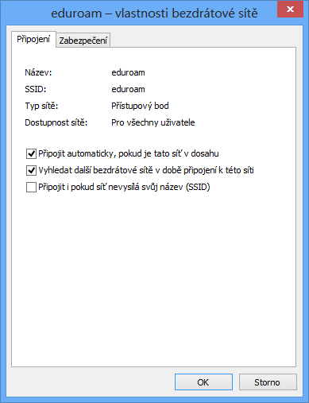 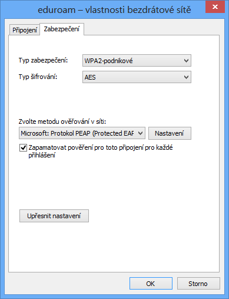

- Windows 11: Spravovat známé sítě \ síť \ **Vlastnosti** (automatické připojení, profil sítě, měřené připojení, IP a DNS)
- **Klasický dialog** *Vlastnosti bezdrátové sítě* (karty *Připojení* a *Zabezpečení*) se otevře z Centra síťových připojení nebo `netsh wlan show profile` → úprava přes XML

---

<!-- _class: dense -->

# Možnosti zabezpečení

- **WEP** (Wired Equivalent Privacy)
  - Prolomený – klíč 40 / 104 bitů (RC4); Windows od 10 1903 při připojení varuje, v budoucí verzi bude připojení odmítnuto
- **WPA** (Wi-Fi Protected Access, TKIP)
  - Dočasná náhrada za WEP během vytváření WPA2; dnes stejně zastaralé jako WEP
- **WPA2** (Wi-Fi Protected Access II, 802.11i)
  - Šifrování AES-CCMP; zranitelnost KRACK (2017) opravena aktualizacemi klientů
- **WPA3** (Wi-Fi Protected Access III, 2018)
  - Osobní režim: SAE (Simultaneous Authentication of Equals) místo PSK – odolné proti offline útoku na heslo, dopředná bezpečnost
  - Povinná ochrana řídicích rámců (PMF), režim WPA3-Enterprise 192-bit, přechodový režim WPA2/WPA3
  - Doplněk Wi-Fi Enhanced Open (OWE) – šifrování i na otevřené síti bez hesla
  - Podpora ve Windows 10 i Windows 11; v pásmu 6 GHz povinné

<!--
WEP používá jen 40 bitů resp. 104 bitů pro klíče, 24 bitů se používá pro uložení dalších informací (IV).
WPA2 je implementací standardu 802.11i.

WPA3 (Wi-Fi Alliance 2018): SAE handshake nahrazuje čtyřcestný handshake s PSK, který byl náchylný na offline slovníkový útok; Wi-Fi Easy Connect (DPP, QR kód) pro zařízení bez displeje. Zranitelnosti Dragonblood (2019) vedly k úpravám SAE (hash-to-element, H2E).

Pozor na Wi-Fi Protected Setup (WPS) – často nevhodná implementace (formálně vyžaduje stisk tlačítka apod., ale často i bez, nebo je PIN odvozen od MAC).

Zdroj (WEP/TKIP deprecated 1903): https://learn.microsoft.com/en-us/windows/whats-new/deprecated-features
Zdroj (WPA3 ve Windows): https://support.microsoft.com/en-us/windows/experience/connectivity-networking/faster-and-more-secure-wi-fi-in-windows
-->

---

# Režimy protokolů WPA2 a WPA3

- **Osobní** (*personal*) režim
  - Sdílené heslo pro celou síť: WPA2-PSK (klíč 256 bitů odvozen z hesla), WPA3-SAE
- **Podnikový** (*enterprise*) režim – IEEE 802.1X
  - Každý uživatel / zařízení se ověřuje samostatně (EAP), klíč relace se generuje pro každé připojení
  - Vyžaduje autentizační server RADIUS (Windows Server: Network Policy Server) a certifikační autoritu (CA) pro certifikát serveru
  - Metody: EAP-TLS (certifikát klienta, čipová karta, Windows Hello for Business), PEAP-MSCHAPv2 (jméno a heslo – např. eduroam), EAP-TEAP
  - Profily se distribuují zásadami skupiny nebo Intune

<!--
Pro ještě vyšší bezpečnost se často generují nové klíče ne jen při vytváření relace (při připojování k bezdrátové síti), ale i během relace, např. co hodinu se vygeneruje nový klíč, jenž nahradí aktuálně používaný klíč.

Certifikáty jsou často uloženy na čipové kartě nebo v TPM (Windows Hello for Business). Microsoft doporučuje přechod z PEAP-MSCHAPv2 na EAP-TLS kvůli ochraně hesel (souvisí s postupným útlumem NTLM).
-->

---

<!-- _class: dense -->

# Správa profilů bezdrátových sítí

- **Zobrazení** všech profilů
  - `netsh wlan show profiles`, detail včetně hesla: `netsh wlan show profile name=<profil> key=clear`
- **Odstranění** profilu
  - `netsh wlan delete profile name=<profil>`
  - Nastavení \ Síť a internet \ Wi-Fi \ Spravovat známé sítě \ **Zapomenout**
- **Změna priority** profilu (sítě)
  - `netsh wlan set profileorder name=<profil> interface=<rozhraní> priority=<číslo>`
- **Export / import** profilu (XML) – nasazení na více počítačů
  - `netsh wlan export profile name=<profil> folder=C:\Profily key=clear`, `netsh wlan add profile filename=<soubor.xml>`
  - Centrálně: Intune (konfigurační profil Wi-Fi) nebo zásady skupiny (*Zásady bezdrátových sítí 802.11*)

<!--
Čím nižší číslo, tím vyšší priorita.

Hesla potřebná pro připojení k bezdrátovým sítím jsou uložena přímo v bezdrátových profilech. Lze je zobrazit buď přes vlastnosti bezdrátové sítě (pokud je síť v dosahu, jinak nelze toto okno vyvolat) nebo pomocí nástroje netsh (netsh wlan show profile name="<název>" key=clear). Netýká se hesel pro autentizaci např. u RADIUS serveru, ty jsou uloženy jinde (Credential Manager).
-->

---

# Správa profilů bezdrátových sítí – ukázka

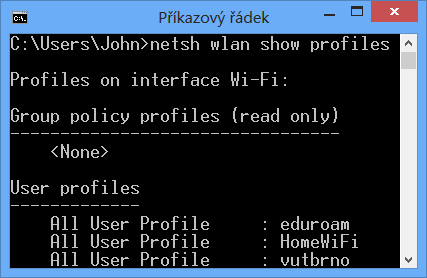

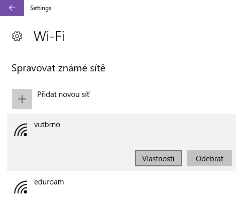

<!-- Vlevo výstup netsh wlan show profiles / export profilu, vpravo Nastavení › Síť a internet › Wi-Fi › Spravovat známé sítě. -->

---

<!-- _class: dense -->

# Zjišťování topologie sítě

- **LLTD** (Link Layer Topology Discovery) – protokol Microsoftu (Vista+)
  - *Ovladač mapovače zjišťování topologie* – počítač zjišťuje ostatní
  - *Odpovídající zařízení zjišťování topologie* – počítač je vidět v mapě
  - Historie: GUI **Mapa sítě** odstraněno ve Windows 8, komponenty zůstávají
- **LLDP** (IEEE 802.1AB) – otevřený standard, který používají přepínače a IP telefony
  - *Ovladač protokolu LLDP společnosti Microsoft* (ve vlastnostech adaptéru)
  - Modul NetLldpAgent (`Enable-NetLldpAgent`) – vyžaduje Data Center Bridging (Windows Server)
- Zařízení v síti dnes ukazuje **Průzkumník souborů \ Síť** (WS-Discovery) a `Get-NetNeighbor`

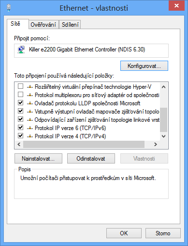

<!--
Původní snímek deklaroval, že zjišťování topologie používá LLDP – ve skutečnosti komponenty „mapovač“ a „odpovídající zařízení“ implementují proprietární LLTD (Microsoft, specifikace MS-LLTD). Podpora LLDP (ms_lldp) přibyla ve Windows 10 / Server 2016 jako samostatný ovladač viditelný na snímku.

Zdroj (NetLldpAgent, vyžaduje DataCenterBridging): https://learn.microsoft.com/en-us/powershell/module/netlldpagent/?view=windowsserver2025-ps
-->

---

<!-- _class: dense -->

# Sdílení v síti – co se změnilo (SMB ve Windows 11 24H2)

- Sdílení souborů a tiskáren = protokol **SMB** (podrobně L06); Domácí skupina odstraněna (1803)
- **SMB1** není v žádné edici Windows 11 nainstalován (volitelná funkce SMB 1.0/CIFS); NetBIOS porty (137–139) už nejsou v pravidlech brány firewall
- **Podepisování SMB povinné** ve Windows 11 24H2 (Pro, Enterprise, Education – příchozí i odchozí) a Windows Server 2025 (jen odchozí, tj. jako klient)
  - Klient se nepřipojí k serveru bez podpisu ani přes hosta (*guest*) → typicky starší NAS
  - Edice Home podepisování nevyžaduje
- **Připojení hostem** (*insecure guest*) zakázáno i v edici Pro; **blokování NTLM** pro odchozí SMB; volitelně **povinné šifrování** a minimální dialekt (SMB 3.1.1)
- **Omezovač rychlosti ověřování** (2 s po neúspěšném pokusu) proti hádání hesel
- **SMB over QUIC** – SMB přes UDP 443 s TLS 1.3 bez VPN; server: všechny edice Windows Server 2025 (dříve jen 2022 Azure Edition), klient: Windows 11

<!--
Zdroj (SMB1 není instalován v žádné edici Windows 11, podepisování 24H2): https://learn.microsoft.com/en-us/windows-server/storage/file-server/troubleshoot/detect-enable-and-disable-smbv1-v2-v3
Zdroj (přehled zabezpečení SMB 24H2 / Server 2025 – podepisování, guest, NTLM, QUIC, rate limiter, NetBIOS porty): https://learn.microsoft.com/en-us/windows-server/storage/file-server/smb-security-hardening
Zdroj (Home nevyžaduje podepisování; Server 2025 jen odchozí): https://learn.microsoft.com/en-us/windows-server/storage/file-server/smb-signing
Zdroj (problémy s NAS po 24H2): https://techcommunity.microsoft.com/blog/filecab/accessing-a-third-party-nas-with-smb-in-windows-11-24h2-may-fail/4154300
-->

---

<!-- _class: dense -->

# Výchozí tiskárna a tisk podle umístění

- Windows 10/11: Nastavení \ Bluetooth a zařízení \ **Tiskárny a skenery**
  - *Svěřit správu výchozí tiskárny systému Windows* – výchozí je naposledy použitá tiskárna v aktuálním umístění (síti)
  - Vypnuto → výchozí tiskárnu volí uživatel (tlačítko *Nastavit jako výchozí* u tiskárny)
  - PowerShell: `Get-Printer`, `Set-Printer`, `(New-Object -ComObject WScript.Network).SetDefaultPrinter('název')`
- Historie: **Location Aware Printing** (Windows 7/8, edice Pro a Enterprise)
  - Explicitní tabulka síť → výchozí tiskárna v Zařízení a tiskárny \ *Spravovat výchozí tiskárny*
  - Ve Windows 10 odstraněno a nahrazeno automatickou volbou podle naposledy použité tiskárny

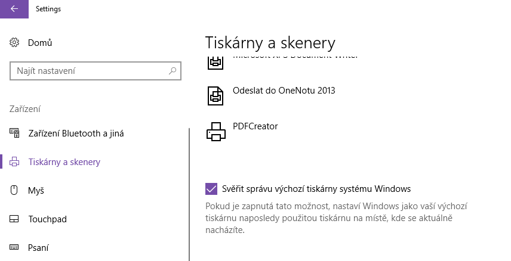

<!--
Snímek je z Windows 10 (stránka Tiskárny a skenery s zaškrtávacím políčkem). Ve Windows 11 je stejná volba přepínačem v sekci Předvolby tiskárny na stránce Nastavení \ Bluetooth a zařízení \ Tiskárny a skenery.

Chování „Windows spravuje výchozí tiskárnu“ ukládá dvojici síť–tiskárna automaticky, tabulku ale uživatel nevidí ani neupravuje (na rozdíl od Location Aware Printing).
-->

---

# Historie: Location Aware Printing (Windows 7/8)

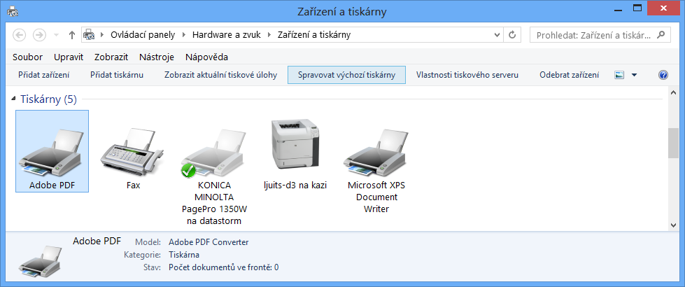

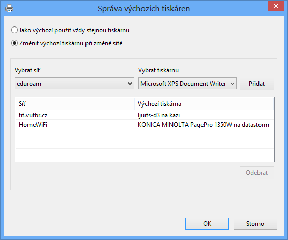

- Ovládací panely \ Zařízení a tiskárny \ **Spravovat výchozí tiskárny** → „Změnit výchozí tiskárnu při změně sítě“
- Ve **Windows 10/11** dialog neexistuje

<!--
Tlačítko Spravovat výchozí tiskárny se objevilo až po vybrání nějaké tiskárny. Snímky jsou z Windows 8 a nelze je znovu pořídit.
-->

---

<!-- _class: dense -->

# Tisk ve Windows 11 – moderní tisková platforma

- **Windows Ready Print** – vestavěný ovladač třídy IPP (Internet Printing Protocol) pro tiskárny s certifikací Mopria (síť i USB, od Windows 10 21H2)
  - Bez ovladačů výrobce; přizpůsobení přes Print Support Apps z Microsoft Store
- **Windows protected print mode** (WPP) – Windows 11 24H2+, zatím volitelně (v budoucnu výchozí)
  - Nastavení \ Bluetooth a zařízení \ Tiskárny a skenery \ Předvolby tiskárny → *Nastavit*
  - Povolí jen IPP/Mopria tiskárny; tiskárny s ovladači třetích stran se odinstalují (včetně XPS Document Writer a Faxu)
  - Zavaditelné zásadami skupiny / Intune; ovladače třetích stran se nenačítají, spooler běží s nižšími oprávněními
- **Konec servisu ovladačů třetích stran** (v3/v4) přes Windows Update
  - **15. 1. 2026** – na Windows Update nejsou přijímány nové ovladače (Windows 11+, Server 2025+)
  - **1. 7. 2026** – při výběru ovladače má vždy přednost vestavěný IPP ovladač
  - **1. 7. 2027** – přes Windows Update jen bezpečnostní opravy; instalační balíčky výrobců fungují dál
- Protokol **LPR/LPD** zastaralý (od Server 2012) → IPP

<!--
Zdroj (WPP – postup, chování): https://learn.microsoft.com/en-us/windows/modern-print/windows-protected-print-mode/windows-protected-print-mode
Zdroj (WPP FAQ – bude výchozí v budoucnu): https://learn.microsoft.com/en-us/windows/modern-print/windows-protected-print-mode/windows-protected-mode-faq
Zdroj (harmonogram konce servisu ovladačů, aktualizace květen 2025): https://learn.microsoft.com/en-us/windows-hardware/drivers/print/end-of-servicing-plan-for-third-party-printer-drivers-on-windows
Zdroj (LPR/LPD deprecated): https://learn.microsoft.com/en-us/windows/whats-new/deprecated-features

České znění popisku „Windows protected print mode“ v Nastavení se nepodařilo ověřit (dokumentace jen anglicky) – ověřit na Windows 11 25H2.
-->

---

<!-- _class: dense -->

# Universal Print – tisk z cloudu

- **Cloudová tisková služba** Microsoft 365 (Azure, Microsoft Entra ID) – náhrada tiskového serveru Windows Server
  - Tiskárny se registrují do Entra tenantu přímo (Universal Print ready) nebo přes **konektor** na počítači s Windows
  - Klient: Windows 10/11 připojený k Entra ID – tiskárny se přidávají v Nastavení \ Tiskárny a skenery bez ovladačů (IPP)
  - Přístup přes skupiny zabezpečení, vyhledání tiskárny podle umístění, správa v Microsoft 365 admin center
  - Součást licencí Microsoft 365 / Windows Enterprise; účtuje se počet úloh (job pool)
- Pro rozšíření staré tiskové fronty: konektor umí sdílet tiskárny s **IPP Class Driver**
- **Alternativy třetích stran**: PaperCut, Printix, uniFLOW …

<!--
Zdroj: https://learn.microsoft.com/en-us/universal-print/discover-universal-print
Zdroj: https://learn.microsoft.com/en-us/universal-print/fundamentals/universal-print-connector-with-ipp
-->
