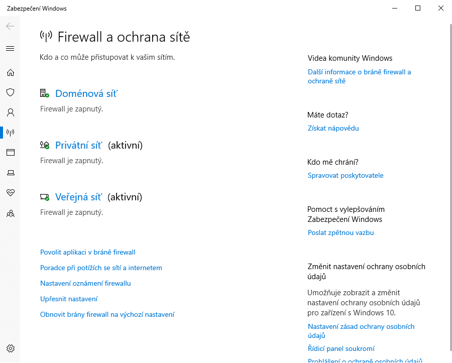
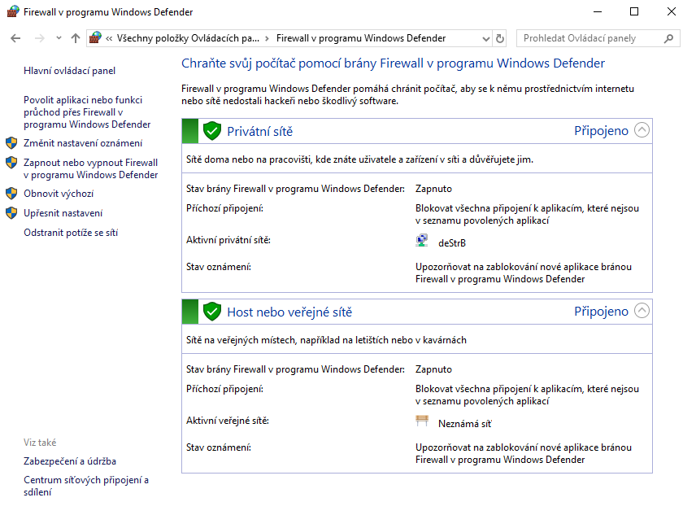
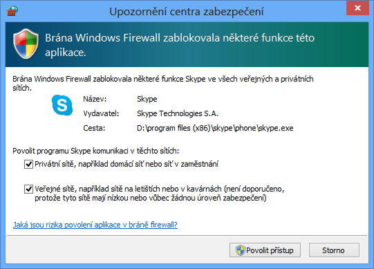
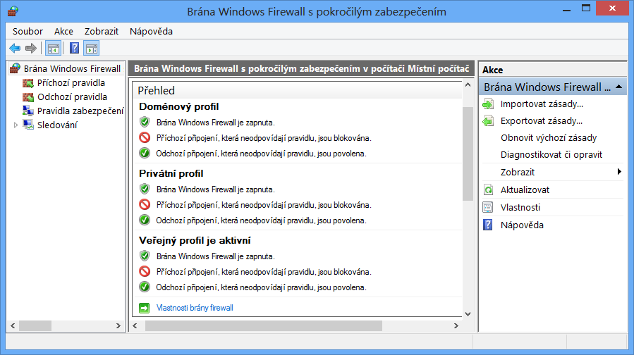
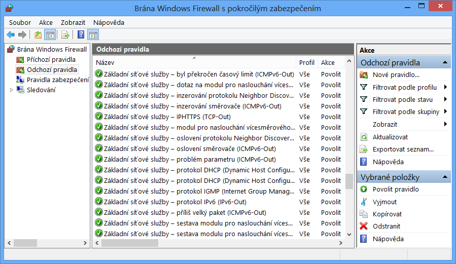
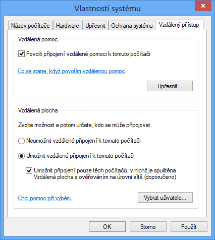
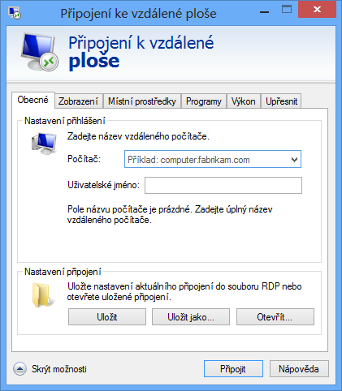
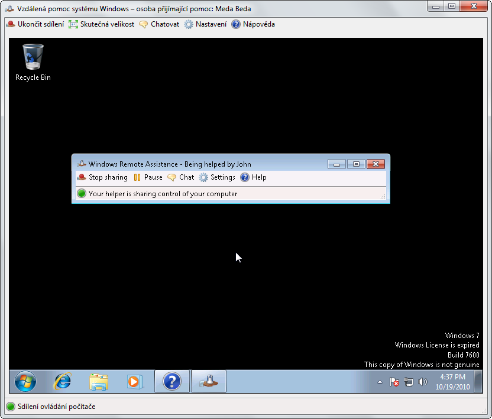

<!-- _class: title -->
<!-- _header: '' -->

# Desktop systémy Microsoft Windows

## IW1

Jan Pluskal\
pluskal@vut.cz

Fakulta informačních technologií\
Vysoké učení technické v Brně\
Božetěchova 2, 612 66 Brno

---

<!-- _class: section -->

# Brána Firewall

<!-- header: 'Desktop systémy Microsoft Windows Brána Firewall' -->

---

# Brána Firewall

- Omezuje síťový provoz na základě definovaných pravidel
- Dva nástroje pro správu (pravidel) brány Firewall
  - Brána Windows Firewall
  - Brána Windows Firewall s pokročilým zabezpečením
  - Sdílejí databázi pravidel
  - Liší se komplexností definovaných pravidel

<!--
Funkcionalitu brány Firewall poskytuje v systémech Windows jediná služba s názvem Brána Windows Firewall. Oba nástroje pro správu pravidel brány Firewall tedy ve skutečnosti pracují se stejnou službou a jedinou databázi pravidel. Tyto nástroje jsou tedy prakticky jen dvě odlišná rozhraní k jedné službě systému Windows.
-->

---

# Rozšíření brány Firewall ve Windows

- Podpora tzv. zneviditelnění (funkce full stealth)
  - Zabraňuje zjišťování operačního systému (operating system fingerprinting)
    - Ochrana proti útokům na konkrétní verzi Windows
  - Vždy povolena (nelze zakázat)
- Ochrana při bootování (boot time filtering)
  - V době, kdy dochází k aktivaci jednotlivých síťových rozhraní (lze komunikovat na síti), již brána Firewall běží (u Windows XP nabíhala až později)

<!--
Ochrana proti útokům na konkrétní verzi Windows je velmi důležitá, jelikož pokud útočník získá informace o verzi Windows, jenž běží na cílovém počítači, může použít útoky cílené na danou verzi Windows. Primárně takové útoky, jenž využívají známé díry v dané verzi Windows.
-->

---

# Brána Windows Firewall

- Umožňuje definovat pouze jednoduchá pravidla
  - Definice programů a funkcí systému Windows, jenž mohou komunikovat na síti
- Uzavřený (closed) Firewall
  - Co není explicitně povoleno, je zakázáno
- Ve výchozím nastavení blokuje většinu programů
- Umožňuje blokovat veškerou komunikaci
  - Blokování i explicitně povolených programů

---

# Firewall a ochrana sítě v Nastavení

<!--
Přejmenováno z „Brána Windows Firewall“ na „Firewall v programu Windows Defender“
-->

---

# Nástroj Brána Windows Firewall

<!--
Přejmenováno z „Brána Windows Firewall“ na „Firewall v programu Windows Defender“
-->

---

# Přidání nového pravidla

- Při notifikaci nebo přes nástroj Windows Firewall
  - Pro přidání pravidla jsou potřeba oprávnění správce

<!--
Ukázat přidání nového pravidla přes nastavení brány Windows Firewall (Ovládací Panely -> Brána Windows Firewall -> Povolit aplikaci nebo funkci průchod bránou Windows Firewall):
1) Sloupec doména je zobrazen pouze pokud je počítač připojen v doméně.
2) Může obsahovat sloupec zásady skupiny (group policy), jenž říká, zda bylo pravidlo přidáno přes zásady skupiny.
-->

---

# Brána WF s pokročilým zabezpečením

- WFAS (Windows Firewall with Advanced Security)
- Umožňuje definovat komplexní pravidla
- Filtrování síťového provozu na základě
  - Směru připojení (příchozí / odchozí)
  - Typu protokolu (TCP, UDP, ICMP, …) a čísla portu
  - Komunikujícího programu, funkce nebo služby
  - IP adres komunikujících počítačů
  - Zabezpečení komunikace
  - Komunikujících počítačů nebo uživatelů

<!--
U základního Firewallu jsou definovaná pravidla vždy příchozí pravidla.
Typ protokolu lze zadat i přes jeho identifikační číslo.
Od Windows 8 lze filtrovat síťový provoz také na základě komunikující aplikace z Windows Store (Windows Store app).
-->

---

# Výchozí chování

- Uzavřený (closed) Firewall pro příchozí připojení
  - Co není explicitně povoleno, je zakázáno
  - Zde náleží pravidla definovaná ve Windows Firewall
- Otevřený (open) Firewall pro odchozí připojení
  - Co není explicitně zakázáno, je povoleno
- Chování lze změnit v nastavení WFAS pro každý síťový profil zvlášť

---

# Síťové profily

- Určují, která pravidla brány Firewall jsou aktivní
  - Jedno pravidlo může být aktivní ve více profilech
- Ovlivňují síťový provoz na konkrétních síťových rozhraních (na rozdíl od Windows Vista)
  - Na každé rozhraní je aplikován právě jeden profil
  - Jeden profil může být aplikován na více rozhraní

---

# Umístění v síti

- NLA (Network Location Awareness)
- Přiřazování síťových profilů jednotlivým síťovým rozhraním podle typu sítě, do níž jsou připojeny
- Typy síťových profilů (výběr při připojení do sítě)
  - Privátní síť
  - Veřejná síť
  - Doména
    - Nastaven automaticky při přihlášení klienta do domény

<!--
Umístění v síti se určuje z části na základě nastavení výchozí brány, pokud není nastavena, nemusí být rozhraní přiřazen síťový profil (stává se např. u OpenVPN).
-->

---

# Výchozí nastavení síťových profilů

---

# Pravidla brány Firewall

- Povolují (zakazují) síťovou komunikaci (připojení) na základě definovaných podmínek
- Podle směru připojení se dělí na
  - Pravidla pro příchozí připojení (příchozí pravidla)
  - Pravidla pro odchozí připojení (odchozí pravidla)
- Podpora edge traversal
  - Možnost povolit či zakázat přijímání nevyžádaných příchozích paketů (např. od zařízení podporujícího překlad adres NAT)

<!--
Edge traversal – např. spojení DirectAccess přes Teredo (v6 over v4)

this option applies to only specific types of traffic that use encapsulation in order to successfully traverse a firewall or NAT. One example of a situation where the Edge traversal option matters is DirectAccess. If a DirectAccess client is located on a remote private network behind a NAT, the client uses a technology named Teredo to communicate with its corporate network over the Internet. Teredo encapsulates IPv6 inside IPv4 in such a way that it can pass through NATs. This DirectAccess client should be configured to allow unsolicited inbound traffic from management servers on the corporate network. The corresponding inbound rules should allow edge traversal.
-->

---

# Pravidla pro základní síťové služby

---

# Příchozí a odchozí pravidla

|                                                                                                  | Příchozí připojení                                                         | Odchozí připojení                                                          |
| ------------------------------------------------------------------------------------------------ | -------------------------------------------------------------------------- | -------------------------------------------------------------------------- |
|  Vzdálená IP adresa (Remote IP address) Vzdálený port (Remote port) | Zdrojová IP adresa (Source IP address) Zdrojový port (Source port)      | Cílová IP adresa (Destination IP address) Cílový port (Destination port) |
|                                                                                                  | ↓                                                                          | ↑                                                                          |
|  Místní IP adresa (Local IP address) Místní port (Local port)   | Cílová IP adresa (Destination IP address) Cílový port (Destination port) | Zdrojová IP adresa (Source IP address) Zdrojový port (Source port)      |

---

# Typy a priorita zpracování pravidel

- Pravidla povolující připojení přepisující pravidla blokující připojení (authenticated bypass)
  - Vždy povolují pouze zabezpečená připojení
  - Vyžaduje specifikaci autorizovaných počítačů
- Pravidla blokující připojení (block connection)
- Pravidla povolující připojení (allow connection)
  - Mohou povolovat i nezabezpečená připojení
- Výchozí chování brány Firewall
  - Pravidlo povolující nebo blokující jakékoliv připojení

<!--
Výchozí pravidlo brány Firewall je pravidlo s nejnižší prioritou odpovídající jakémukoliv datagramu.
-->

---

<!-- _class: dense -->

# Zabezpečená připojení

<!-- REVIEW: odkaz na Step-by-Step Guide (download.microsoft.com, .docx) je pravděpodobně mrtvý –
     ověřit a případně nahradit aktuálním odkazem na Microsoft Learn. -->

- K zajištění zabezpečení připojení se využívá IPSec
- Vždy musí být ověřená, liší se zabezpečením dat
  - Ověřená připojení s chráněnou integritou
    - Vyžadována pouze integrita dat (pouze systémy Windows Vista a novější)
  - Šifrovaná připojení
    - Kromě integrity dat je navíc vyžadováno i jejich utajení
  - Připojení s nulovým zapouzdřením
    - Žádné nároky na zabezpečení dat, je vyžadováno pouze ověření připojení (pouze systémy Windows 7 a novější)
- [Kompletní návod zde](https://download.microsoft.com/download/A/1/9/A19656C7-1A5C-4641-8200-4DC46C0D71ED/Step-by-Step%20Guide%20to%20Deploying%20Windows%20Firewall%20and%20IPsec%20Policies.docx)

---

# Pravidla zabezpečení připojení

- Definují kdy a jakou metodou musí být ověřeno připojení, aby bylo považováno za zabezpečené
  - Ověření lze vyžadovat nebo jen preferovat
- Nepovolují připojení
- Způsoby ověřování (uživatelů a počítačů)
  - Kerberos v5
  - NTLMv2 (NT LAN Manager)
  - Certifikáty
  - Předsdílený klíč (pre-shared key) (jen u počítačů)

<!--
Od Windows 8 lze použít IKEv2 (a IKEv1) protokol jako modul pro výměnu klíčů v pravidlech zabezpečení připojení (v předchozích systémech šlo použít jen AuthIP, jenž fungovalo s jakoukoliv dvoufázovou autentizací). Výběr modulu pro výměnu klíčů lze ale (zatím) provést pouze skrz příkazový řádek nebo PowerShell.
-->

---

# Typy pravidel zabezpečení připojení

- Izolace (isolation)
  - Omezení komunikace na počítače, jenž jsou schopny se autentizovat pomocí konkrétního pověření
- Výjimka z ověření (authentication exemption)
  - Vyloučení specifických počítačů z izolace
- Server-to-server
  - Ověřování připojení mezi konkrétními počítači
- Tunel (tunnel)
  - Ověřování připojení v tunelovém režimu IPSec

<!--
Pravidla typu izolace se nejčastěji používají v doménách Active Directory v kombinaci s metodou ověřování Kerberos v5. Tato metoda se totiž používá při přihlašování uživatelů a počítačů do domén Active Directory a všichni uživatelé a počítače v doméně jsou tedy schopni se touto metodou se svými pověřeními pro přihlašování do domény autentizovat i vzdálenému počítači při ustavování zabezpečeného připojení.
Výjimky z ověření se často používají pro DHCP a DNS servery.
U pravidel typu server-to-server se pro autentizaci nejčastěji používají certifikáty.
-->

---

# Správa pomocí příkazové řádky

- Pomocí `netsh advfirewall`
  - Vyžaduje oprávnění správce
- Přidání nového pravidla
  - `netsh advfirewall firewall add rule name="<název>" dir={in|out} action={allow|block|bypass} …`
  - Název pravidla (`<název>`) nesmí být `all`
    - Zastupuje všechna pravidla brány Firewall
  - Při nastavení akce `bypass` a směru `in` musí být určena skupina vzdálených počítačů a vyžadováno ověření

---

# Správa pomocí Powershellu

- Vyžaduje oprávnění správce
- Přidání nového pravidla
  - `New-NetFirewallRule -DisplayName "název" [-Direction [Inbound|Outbound]] [-Action [Allow|Block]] [-Protocol [TCP|UDP|...]] [-LocalPort xxx] [-RemotePort xxx]`
- Změna pravidla
  - `Set-NetFirewallRule`
- Aktivace / deaktivace
  - `Enable-NetFirewallRule`, `Disable-NetFirewallRule`

<!--
-DisplayName je mandatory, ostatní volitelné
-->

---

<!-- _class: section -->

# Vzdálená správa

<!-- header: 'Desktop systémy Microsoft Windows Vzdálená správa' -->

---

# Vzdálená plocha (Remote Desktop)

<!-- REVIEW: „Vyžaduje alespoň Windows XP SP3“ – XP je dávno mimo podporu, zvážit vypuštění
     nebo přeformulování (NLA je standardně vyžadováno ve všech podporovaných verzích). -->

- Umožňuje se vzdáleně přihlásit k počítači
  - Připojení k odpojenému či nově vytvořenému sezení
- Podpora ověřování na úrovni sítě
  - NLA (network level authentication)
  - Vyžaduje alespoň Windows XP SP3
- Automatická konfigurace brány Firewall
  - Přidání pravidel brány Firewall povolujících připojení ke vzdálené ploše při povolení vzdálené plochy
- Využívá protokol TCP, naslouchání na portu 3389

<!--
NLA lze sice použít i u Windows XP SP3, ale musí se nastavit, což je relativně složitý proces.
-->

---

# Připojení ke vzdálené ploše

<!--
Ověřování na úrovni sítě (NLA, Network Level Authentication) vyžaduje autentizaci uživatele před vytvořením vzdálené relace (session). Dříve se nejprve vytvořila vzdálená relace a pak se přihlásil uživatel, což vedlo k zbytečnému plýtvání prostředků serveru (uživateli se nemuselo podařit se vůbec přihlásit) a zvyšovalo riziko DoS útoků (útočník mohl vytvořit tisíce relací, aniž by se musel přihlásit). NLA je podporováno od RDC 6.0 (ve Windows Vista) a systém musí podporovat CredSSP protokol (poskytuje SSO řešení).
Od Windows 8 jsou k dispozici 2 klienti pro připojení ke vzdálené ploše, jeden je stejný jako ve Windows 7, druhý je touch-based klient pro modern UI s podporou touch remoting (multitouch gesta a síla dotyku se přenáší na vzdálený systém).
-->

---

# Vzdálené přihlášení

- Podporováno pouze u edicí Pro a Enterprise
- Mohou se přihlásit
  - Správci počítače (členové skupiny Administrators)
  - Uživatelé vzdálené plochy (členové skupiny Remote Desktop Users)
- Vždy je vyžadováno heslo
  - K účtu, který není chráněn heslem se nelze přihlásit
- V jednom okamžiku může být přihlášen (lokálně nebo vzdáleně) maximálně jeden uživatel

<!--
Vzdálené přihlášení (přihlášení na daný počítač z jiného počítače nebo zařízení) je možné pouze u edicí Pro a Enterprise, ale přihlašovat se lze z jakékoliv edice. Klient vzdálené plochy je totiž k dispozici ve všech edicích Windows, ovšem server vzdálené plochy (jenž je potřeba pro vzdálené přihlášení) je k dispozici pouze v edicích Pro a Enterprise.
Uživatelé vzdálené plochy (remote desktop users) se mohou vzdáleně přihlašovat, jelikož mají přiřazeno právo v zásadách skupiny, jenž jim to umožňuje.
-->

---

# Souběžné přihlášení více uživatelů

- Pokud je lokálně přihlášen nějaký uživatel a jiný se přihlašuje vzdáleně, musí lokálně přihlášený uživatel povolit vzdálené připojení (a naopak)
  - Po povolení přihlášení jiného uživatele je aktuálně přihlášený uživatel odpojen (disconnected)
  - Povolení je vyžadováno i v případě, že se přihlašuje správce (a je přihlášen standardní uživatel)
- Pokud je lokálně přihlášen nějaký uživatel a daný uživatel se připojuje i vzdáleně, je tento uživatel připojen do aktuálního sezení a lokálně odpojen

<!--
Aktuálně přihlášený uživatel má 30 sekund na povolení nebo zamítnutí vzdáleného připojení, po 30 sekundách je vzdálené připojení automaticky povoleno.
-->

---

# Místní prostředky ve vzdálené relaci

- Možnost použití místních zařízení a prostředků na vzdáleném počítači (ve vzdálené relaci)
  - Jeví se jako fyzicky přítomné na vzdáleném počítači
- Ve vzdálené relaci lze použít místní
  - Tiskárny
  - Schránku (clipboard)
  - Diskové jednotky (oddíly disku)
  - Čipové karty
  - Jiná podporovaná zařízení Plug and Play

---

# Vzdálená pomoc (Remote Assistance)

<!-- REVIEW: Vzdálená pomoc systému Windows (msra) je ve Windows 11 zastaralá a nahrazena
     aplikací Rychlá pomoc (Quick Assist) – rozhodnout, zda ponechat, nebo doplnit/nahradit. -->

- Umožňuje se vzdáleně připojit k počítači
  - Připojení k aktuálně běžícímu sezení
- Automatická konfigurace brány Firewall
- Využívá protokol TCP, naslouchání na portu 3389
- Musí být iniciována na vzdáleném počítači
  - Vzdálený počítač musí odeslat pozvánku (s omezenou dobou platnosti)
  - Uživatel na vzdáleném počítači musí povolit následné připojení (odpověď na pozvánku)

---

# Vzdálená pomoc systému Windows

<!-- REVIEW: snímek je z Windows 7 (včetně vodoznaku „Windows License is expired“) –
     zvážit nový snímek z Windows 11 (Vzdálená pomoc nebo Rychlá pomoc). -->

---

# Možnosti vystavení pozvánky

<!-- REVIEW: Snadné připojení používá protokol PNRP, který byl z Windows 10/11 odstraněn –
     rozhodnout, zda odrážku ponechat jako historii, nebo vypustit. -->

- Uložit pozvánku jako soubor (chráněn heslem)
- Odeslat pozvánku pomocí e-mailu
  - Soubor pozvánky je uložen jako příloha e-mailu
- Použitím nástroje Snadné připojení
  - Automatické ustanovení spojení mezi dvěma počítači
    - Lokalizace vzdáleného počítače na základě zadaného hesla pomocí protokolu PNRP (Peer Name Resolution Protocol)
  - Pracuje i napříč sítí internet
  - K dispozici od Windows 7

---

# Vzdálené připojení

- Připojení lze uskutečnit pouze pokud
  - Nevypršela doba platnosti pozvánky
  - Uživatel na vzdáleném počítači ještě neuzavřel okno Vzdálená pomoc systému Windows
  - Uživatel připojující se na vzdálený počítač zadal heslo
- Vzdáleně připojený uživatel může
  - Sledovat nebo ovládat plochu lokálního uživatele
  - Zasílat zprávy a soubory lokálnímu uživateli
  - Být kdykoliv odpojen lokálním uživatelem

---

# Vzdálená správa systému Windows

- WinRM (Windows Remote Management)
- Umožňuje vzdáleně spouštět příkazy na počítači
- Pro zadávání příkazů lze použít
  - Windows Remote Shell (WinRS)
  - Windows PowerShell
- Komunikace pomocí protokolů HTTP nebo HTTPS
  - Data jsou šifrována (při použití HTTP lze vypnout)
  - Pokud není možné ověřovat důvěryhodnost počítačů je potřeba je zadat manuálně (nastavit trusted hosts)

<!--
WinRM 3.0 (obsažena ve Windows 8) je po stránce funkcionality totožná s předchozí verzí, změny jsou primárně implementačního rázu jako robustnější spojení, lepší dodržování standardů protokolu WS-Management a podpora více PowerShell sezení v jednom procesu.
WinRM funguje pouze v privátních sítích a doméně.
-->

---

# Konfigurace vzdáleného počítače

- Pomocí WinRM (příkaz `winrm quickconfig`)
  - Konfigurace vyžaduje oprávnění správce
- Konfigurace zahrnuje
  - Spuštění služby Vzdálená správa systému Windows
  - Povolení přihlašování s oprávněními správce (nastavení local account token filter policy)
  - Nastavení naslouchání na portu 5985 pomocí HTTP protokolu (příjem zpráv protokolu WS-Management)
  - Přidání pravidel brány Firewall povolujících připojení ke službě Vzdálená správa systému Windows

<!--
Port 5986 u HTTPS.
-->

---

# Vzdálené spouštění příkazů

- Pomocí WinRS
  - `winrs -r:[<protokol>://]<počítač> -u:<uživatel> [-p:<heslo>] <příkaz>`
  - Konfigurace pomocí WinRM nebo zásad skupiny
- Pomocí Windows PowerShell verze 2 nebo vyšší
  - `icm -ComputerName [<protokol>://]<počítač> -Credential:<uživatel> <příkaz>`
  - `icm` je alias pro `Invoke-Command`
  - Pro zadání hesla lze místo uživatele předat přepínači `-Credential` objekt typu `PSCredential`

---

# Možnosti ověřování

- Základní (basic)
  - Přihlašovací údaje zasílány jako čitelný text
- Algoritmem Digest
  - Zasílán otisk (hash) hesla, nevhodný při použití HTTP
- Na základě klientských certifikátů (certificate)
- Protokolem Kerberos
- Metodou Vyjednávat (negotiate)
  - Kerberos pro doménové účty, NTLM pro lokální účty
- CredSSP (Credential Security Support Provider)

<!--
Certifikáty se často používají při použití protokolu HTTPS, jelikož ten také vyžaduje certifikáty (pro SSL).
CredSSP se používá hlavně tehdy, pokud se vykonávané příkazy samy někde přihlašují (např. ke sdílení), řeší tuto dodatečnou autentizaci.
-->
