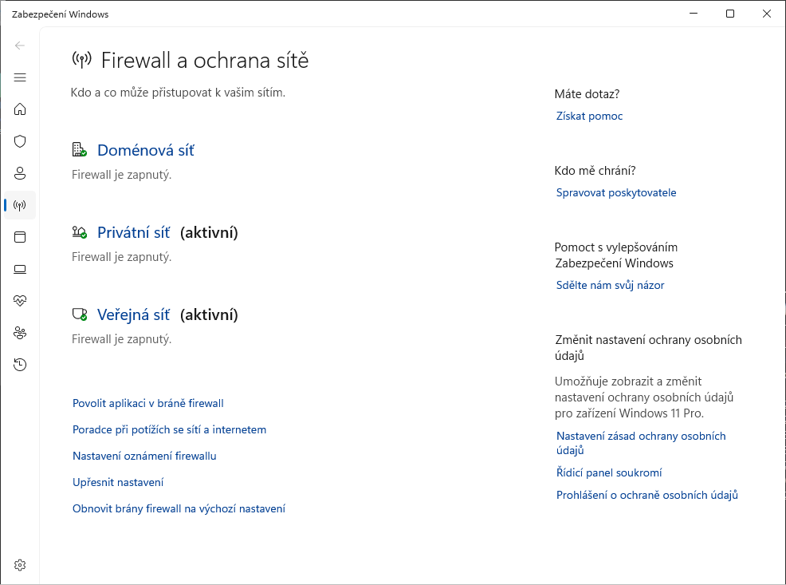
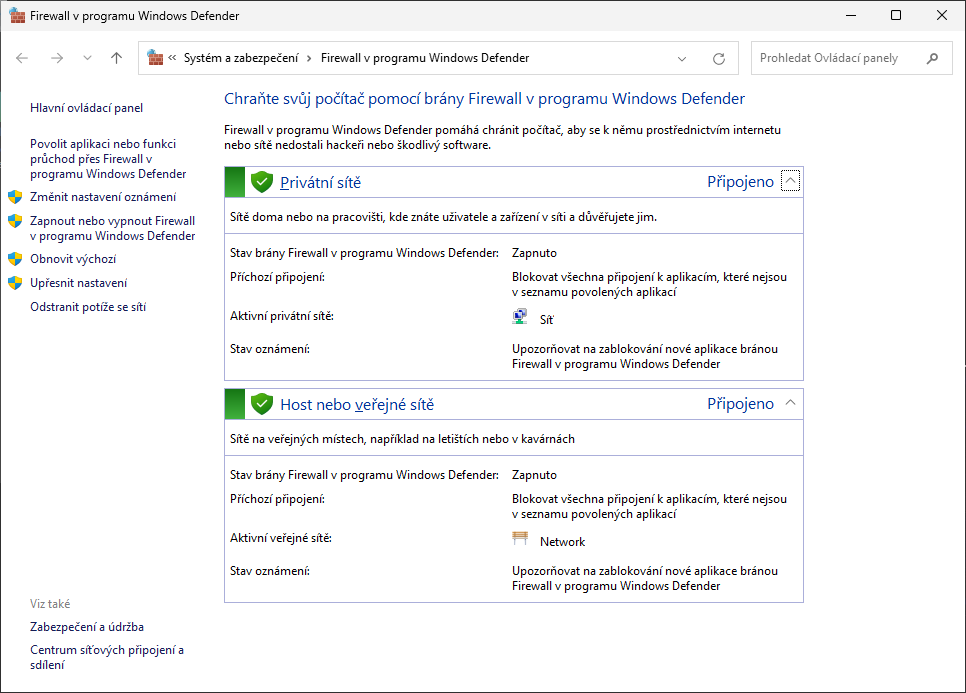
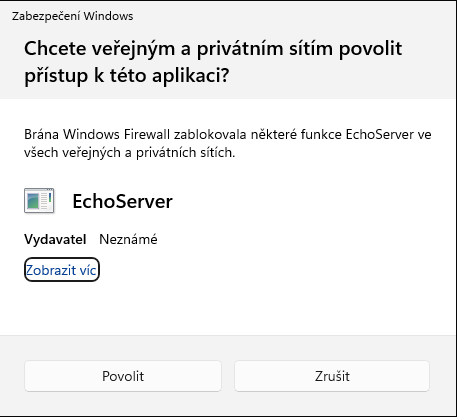
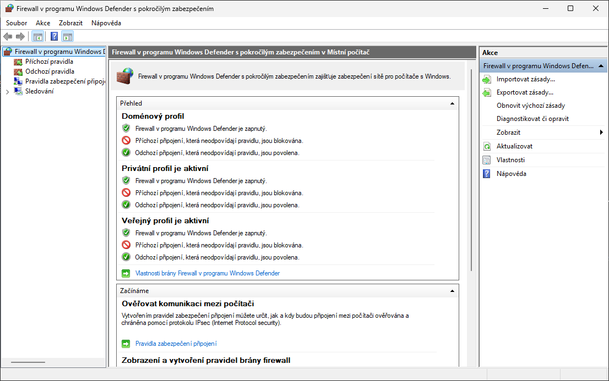
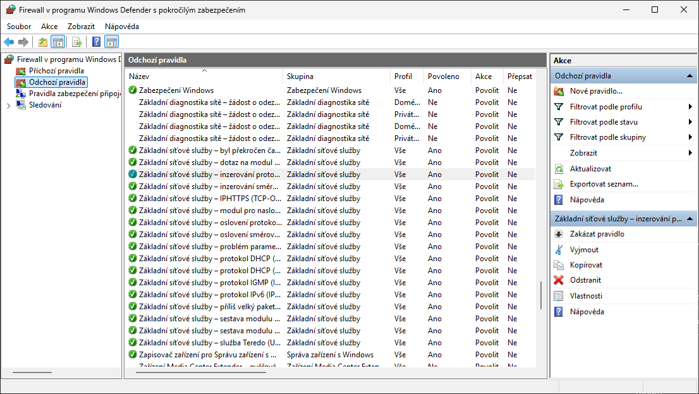
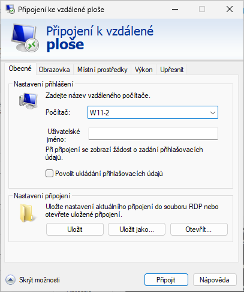
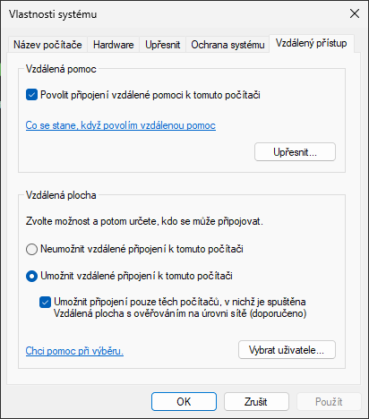
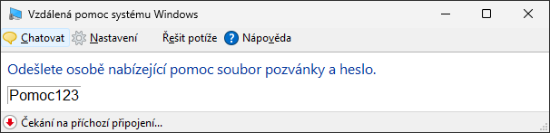
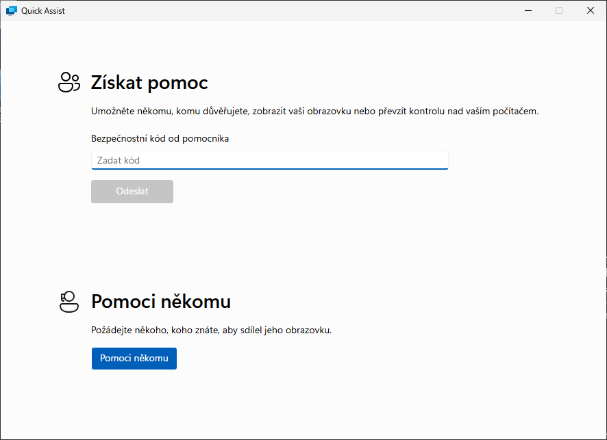

<!-- _class: title -->
<!-- _header: '' -->

# Desktop systémy Microsoft Windows

## IW1

Jan Pluskal\
pluskal@vut.cz

Fakulta informačních technologií\
Vysoké učení technické v Brně\
Božetěchova 2, 612 66 Brno

---

<!-- _class: section -->

# Brána Firewall

<!-- header: 'Desktop systémy Microsoft Windows Brána Firewall' -->

---

<!-- _class: dense -->

# Brána Firewall (Windows Firewall)

- **Hostitelský firewall**, součást Windows, zapnutý ve výchozím stavu ve všech edicích
- **Omezení síťového provozu** na základě definovaných pravidel
- **Jedna služba** a jedna databáze pravidel, několik rozhraní pro správu
  - **Zabezpečení Windows** > *Firewall a ochrana sítě* – hlavní rozhraní ve Windows 11
  - **Ovládací panely** > *Firewall v programu Windows Defender* – jednoduchá pravidla
  - Firewall v programu Windows Defender s pokročilým zabezpečením (**WFAS**, `wf.msc`) – komplexní pravidla, IPsec
  - **PowerShell** (modul NetSecurity), `netsh advfirewall`, zásady skupiny, Intune (Firewall CSP)
- Historie: **Brána Windows Firewall** (Vista – Windows 10 1703) → Firewall v programu Windows Defender (od Windows 10 1709, Fall Creators Update); dokumentace Microsoftu od roku 2024 používá opět název Windows Firewall

<!--
Funkcionalitu brány Firewall poskytuje ve Windows jediná služba (zobrazovaný název „Windows Defender Firewall“, název služby MpsSvc). Všechna rozhraní – Zabezpečení Windows, Ovládací panely, konzola WFAS, PowerShell, netsh, GPO i Intune – pracují se stejnou službou a jedinou databází pravidel, liší se jen komplexností pravidel, která umí zobrazit a vytvořit.
Microsoft firewall nedoporučuje vypínat; pokud je to nutné, vypíná se profil (Set-NetFirewallProfile -Enabled False), nikdy zastavením služby MpsSvc – to není podporováno a rozbíjí Start, instalaci aplikací ze Store i aktivaci.
Ve Windows 11 se název „Windows Defender Firewall“ stále zobrazuje v Ovládacích panelech, v konzole wf.msc a u služby; v aplikaci Zabezpečení Windows je stránka „Firewall a ochrana sítě“.
Zdroj: https://learn.microsoft.com/en-us/windows/security/operating-system-security/network-security/windows-firewall/
Zdroj (přejmenování na Windows Defender Firewall ve verzi 1709): https://learn.microsoft.com/en-us/previous-versions/windows/it-pro/windows-10/whats-new/whats-new-windows-10-version-1709 -->

---

# Rozšíření brány Firewall ve Windows

- Podpora tzv. **zneviditelnění** (funkce *full stealth*)
  - Zabraňuje zjišťování operačního systému (*operating system fingerprinting*)
    - Ochrana proti útokům na konkrétní verzi Windows
  - Vždy povolena (nelze zakázat)
- **Ochrana při bootování** (*boot time filtering*)
  - Brána Firewall běží už v době aktivace síťových rozhraní
- **Windows Service Hardening**
  - Služby systému smí komunikovat jen způsobem, který mají povolen
- Historie: firewall **Windows XP** nabíhal až po startu sítě a filtroval jen příchozí provoz

<!--
Ochrana proti útokům na konkrétní verzi Windows je velmi důležitá, jelikož pokud útočník získá informace o verzi Windows, jenž běží na cílovém počítači, může použít útoky cílené na danou verzi Windows – primárně útoky využívající známé díry v dané verzi.
Stealth, boot time filtering i Windows Service Hardening jsou důvody, proč Microsoft nedoporučuje firewall vypínat ani při použití firewallu třetí strany – ten má vypnout jen kategorie pravidel, které potřebuje (programově přes API).
Zdroj: https://learn.microsoft.com/en-us/windows/security/operating-system-security/network-security/windows-firewall/
-->

---

<!-- _class: dense -->

# Novinky brány Firewall ve Windows 11

- **Hyper-V firewall** (od Windows 11 22H2)
  - Filtruje provoz kontejnerů hostovaných Windows – WSL, Windows Subsystem for Android
  - Pravidla per `VMCreatorId`; správa jen PowerShellem nebo CSP (Intune), ne přes GPO
  - `Get-NetFirewallHyperVVMCreator`, `Get-NetFirewallHyperVVMSetting`, `New-NetFirewallHyperVRule`
- **Dynamická klíčová slova** (*dynamic keywords*) – pravidla podle FQDN a rozsahů IP
  - `New-NetFirewallDynamicKeywordAddress -Keyword contoso.com -AutoResolve $true` + `New-NetFirewallRule … -RemoteDynamicKeywordAddresses`
  - Vyžaduje Microsoft Defender Antivirus s ochranou sítě (*network protection*), jen odchozí FQDN
- **Microsoft Intune** – Endpoint security > *Firewall* (Firewall CSP)
  - Profily *Windows Firewall*, *Windows Firewall rules* (max. 150 pravidel / profil), *Windows Hyper-V Firewall Rules*
  - Opakovaně použitelné skupiny nastavení (rozsahy IP, FQDN)

<!--
Hyper-V firewall doplňuje hostitelský firewall o filtrování provozu virtuálních strojů/kontejnerů, které Windows hostují pro WSL nebo WSA – jejich síťový provoz jinak obchází pravidla hostitele. Pokud jsou pravidla hostitele nastavena přes GPO a Hyper-V firewall není nastaven přes CSP, zrcadlí se nastavení z GPO automaticky. WSL má VMCreatorId {40E0AC32-46A5-438A-A0B2-2B479E8F2E90}.
Dynamická klíčová slova řeší pravidla pro služby s měnícími se IP adresami (cloud). FQDN pravidlo se vyhodnocuje až po DNS dotazu aplikace – Windows neprovádí periodické DNS dotazy; příchozí FQDN pravidla nejsou nativně podporována. Nutný Defender AV platform 4.18.2209.7+, network protection v režimu block/audit a vypnuté DNS over HTTPS.
Intune: firewall se spravuje jako „Endpoint security policy“; profily Windows Firewall řeší chování profilů, Windows Firewall rules jednotlivá pravidla (150 na profil, více profilů se slučuje).
Zdroj: https://learn.microsoft.com/en-us/windows/security/operating-system-security/network-security/windows-firewall/hyper-v-firewall
Zdroj: https://learn.microsoft.com/en-us/windows/security/operating-system-security/network-security/windows-firewall/dynamic-keywords
Zdroj: https://learn.microsoft.com/en-us/intune/intune-service/protect/endpoint-security-firewall-policy
-->

---

# Základní nastavení brány Firewall

- **Zabezpečení Windows** > *Firewall a ochrana sítě*
  - Stav firewallu pro Doménovou, Privátní a Veřejnou síť
  - *Povolit aplikaci v bráně firewall*, *Nastavení oznámení firewallu*, *Upřesnit nastavení* (→ WFAS), *Obnovit výchozí nastavení*
- **Ovládací panely** > *Firewall v programu Windows Defender* (`firewall.cpl`)
- Umožňují definovat pouze **jednoduchá pravidla**
  - Programy a funkce systému Windows, jenž mohou komunikovat na síti
- **Uzavřený** (*closed*) Firewall
  - Co není explicitně povoleno, je zakázáno
- Umožňují blokovat **veškerou komunikaci**
  - Blokování i explicitně povolených programů (*Blokovat všechna příchozí připojení*)

<!--
Ve Windows 11 je primárním rozhraním aplikace Zabezpečení Windows (Nastavení > Ochrana osobních údajů a zabezpečení > Zabezpečení Windows > Firewall a ochrana sítě). Klasický applet Ovládacích panelů zůstává a nabízí stejné volby: Povolit aplikaci nebo funkci průchod přes Firewall, Změnit nastavení oznámení, Zapnout nebo vypnout firewall, Obnovit výchozí, Upřesnit nastavení.
U základního rozhraní jsou definovaná pravidla vždy příchozí pravidla.
Zdroj: https://learn.microsoft.com/en-us/windows/security/operating-system-security/network-security/windows-firewall/
-->

---

# Firewall a ochrana sítě v Zabezpečení Windows

<!--
Snímek je z Windows 11 24H2 (stanice W11-1 z E03 – aktivní je privátní i veřejný profil současně, protože LAN1 na Private1 má privátní a LAN0 na Default Switch veřejný profil): Doménová síť, Privátní síť, Veřejná síť, odkazy Povolit aplikaci v bráně firewall, Poradce při potížích se sítí a internetem, Nastavení oznámení firewallu, Upřesnit nastavení, Obnovit brány firewall na výchozí nastavení.
Historie: applet se jmenoval „Brána Windows Firewall“, od Windows 10 1709 „Firewall v programu Windows Defender“.
-->

---

# Firewall v programu Windows Defender (Ovládací panely)

<!--
Snímek: Windows 11 24H2 (W11-1) – aktivní privátní síť „Síť“ (LAN1) a veřejná síť „Network“ (LAN0). Klasický applet Ovládacích panelů (firewall.cpl) je ve Windows 11 stále k dispozici, i když Microsoft postupně přesouvá nastavení do aplikace Nastavení a Zabezpečení Windows. Ukázat stav profilů (Privátní sítě / Host nebo veřejné sítě), aktivní síť a stav oznámení.
-->

---

# Přidání nového pravidla

- Při **oznámení Zabezpečení Windows** (program začne naslouchat na síti) nebo ručně
  - Zabezpečení Windows > Firewall a ochrana sítě > *Povolit aplikaci v bráně firewall*
  - WFAS > Příchozí pravidla > *Nové pravidlo…*
  - `New-NetFirewallRule`
- Pro přidání pravidla jsou potřeba **oprávnění správce**
- **Oznámení** lze vypnout pro každý profil zvlášť

<!--
Ukázat přidání nového pravidla přes Zabezpečení Windows -> Firewall a ochrana sítě -> Povolit aplikaci v bráně firewall (totéž: Ovládací panely -> Firewall v programu Windows Defender -> Povolit aplikaci nebo funkci průchod přes Firewall):
1) Sloupec Doména je zobrazen pouze pokud je počítač připojen v doméně.
2) Může obsahovat sloupec Zásady skupiny (group policy), jenž říká, zda bylo pravidlo přidáno přes zásady skupiny.
Snímek: Windows 11 24H2 – dialog Zabezpečení Windows „Chcete veřejným a privátním sítím povolit přístup k této aplikaci?“ po spuštění programu EchoServer.exe, který začal naslouchat na TCP 5000. Odkaz Zobrazit víc rozbalí cestu k programu a volbu profilů, Povolit vytvoří příchozí pravidlo pro program, Zrušit vytvoří pravidlo blokující.
-->

---

# Brána WF s pokročilým zabezpečením

- **WFAS** (*Windows Firewall with Advanced Security*), konzola `wf.msc`
  - Ve Windows 11 „Firewall v programu Windows Defender s pokročilým zabezpečením“
- Umožňuje definovat **komplexní pravidla**
- **Filtrování síťového provozu** na základě
  - **Směru připojení** (příchozí / odchozí)
  - **Typu protokolu** (TCP, UDP, ICMP, …) a čísla portu
  - **Komunikujícího programu**, funkce, služby nebo aplikace z Microsoft Store
  - **IP adres** komunikujících počítačů (i klíčových slov: výchozí brána, DNS, místní podsíť, …)
  - **Zabezpečení komunikace** (IPsec)
  - **Komunikujících počítačů nebo uživatelů**

<!--
U základního rozhraní jsou definovaná pravidla vždy příchozí pravidla; ve WFAS lze vytvářet příchozí i odchozí pravidla, pravidla zabezpečení připojení a sledovat aktivní pravidla a asociace IPsec.
Typ protokolu lze zadat i přes jeho identifikační číslo (0–255).
Od Windows 8 lze filtrovat síťový provoz také na základě komunikující aplikace z Microsoft Store (balíčky AppX/MSIX).
Vzdálené adresy lze zadat klíčovými slovy (Default gateway, DHCP servers, DNS servers, Local subnet, Intranet, Internet …) místo konkrétních IP.
Zdroj: https://learn.microsoft.com/en-us/windows/security/operating-system-security/network-security/windows-firewall/
-->

---

# Výchozí chování

- **Uzavřený** (*closed*) Firewall pro příchozí připojení
  - Co není explicitně povoleno, je zakázáno
  - Zde náleží pravidla definovaná v základním rozhraní
- **Otevřený** (*open*) Firewall pro odchozí připojení
  - Co není explicitně zakázáno, je povoleno
- Chování lze změnit v nastavení WFAS pro **každý síťový profil zvlášť**
  - `Set-NetFirewallProfile -Profile Public -DefaultInboundAction Block -DefaultOutboundAction Allow`

<!--
Výchozí chování: blokovat všechen příchozí provoz, který není vyžádaný nebo neodpovídá pravidlu; povolit všechen odchozí provoz, který neodpovídá blokujícímu pravidlu. Změna výchozí akce pro odchozí provoz na Block se používá jen ve vysoce zabezpečených prostředích (nutná inventura aplikací); výchozí akce pro příchozí provoz se nikdy nemá měnit na Allow.
Zdroj: https://learn.microsoft.com/en-us/windows/security/operating-system-security/network-security/windows-firewall/configure-with-command-line
-->

---

# Síťové profily

- Určují, která **pravidla** brány Firewall jsou aktivní
  - Jedno pravidlo může být aktivní ve více profilech
- Ovlivňují síťový provoz na konkrétních **síťových rozhraních**
  - Na každé rozhraní je aplikován právě jeden profil
  - Jeden profil může být aplikován na více rozhraní
- Tři profily: **Doménový**, **Privátní**, **Veřejný**
  - Veřejný je výchozí pro neznámé sítě a má nejpřísnější nastavení
- Historie: **Windows Vista** aplikovala jediný (nejpřísnější) profil na celý počítač

<!--
Od Windows 7 je profil vázán na síťové rozhraní – notebook připojený kabelem do domény a zároveň k veřejné Wi-Fi má na každém rozhraní jiný profil. Ve Windows Vista platil pro celý počítač profil nejméně důvěryhodné sítě.
Zdroj: https://learn.microsoft.com/en-us/windows/security/operating-system-security/network-security/windows-firewall/
-->

---

<!-- _class: dense -->

# Umístění v síti

- **NLA** (*Network Location Awareness*) – služba přiřazující síťové profily jednotlivým rozhraním podle typu sítě, do níž jsou připojeny
- **Typy síťových profilů**
  - **Privátní síť** – domácí síť, síť v zaměstnání; nastavuje správce ručně
  - **Veřejná síť** – výchozí pro neznámé sítě (hotspot, hotel, letiště)
  - **Doména** – nastavena automaticky, jakmile počítač ověří dostupnost řadiče domény (nelze nastavit ručně)
- Windows 11: **Nastavení** > Síť a internet > Ethernet (Wi-Fi > vlastnosti sítě) > *Typ síťového profilu*: Veřejná síť / Privátní síť
  - Při prvním připojení k síti dotaz „Chcete povolit, aby váš počítač byl zjistitelný …?“ – Ano = Privátní
- **PowerShell**: `Get-NetConnectionProfile`, `Set-NetConnectionProfile -InterfaceAlias LAN0 -NetworkCategory Private`

<!--
Umístění v síti se určuje z části na základě nastavení výchozí brány; pokud není nastavena, nemusí být rozhraní přiřazen síťový profil a zůstává Veřejný (stává se např. u OpenVPN nebo u izolované laboratorní sítě bez brány – v E03 se proto profil na LAN1 přepíná PowerShellem).
Historie: Windows 7/8 nabízely při připojení volby Domácí síť / Síť v zaměstnání / Veřejná síť, Windows 10 přepínač „Nastavit tento počítač jako zjistitelný“; Windows 11 má přímo přepínač typu profilu.
Pro zařízení připojená do Microsoft Entra ID (bez AD domény) lze doménový profil detekovat pomocí zásad NetworkListManager Policy CSP (Intune).
Zdroj: https://learn.microsoft.com/en-us/windows/security/operating-system-security/network-security/windows-firewall/
-->

---

# Výchozí nastavení síťových profilů

<!--
Přehled v konzole WFAS: pro každý profil stav firewallu, výchozí akce pro příchozí (blokována) a odchozí (povolena) připojení; aktivní profil je označen. Snímek: Windows 11 24H2 (W11-1) – konzola Firewall v programu Windows Defender s pokročilým zabezpečením (wf.msc), přehled profilů; na stanici jsou aktivní privátní (LAN1) i veřejný (LAN0) profil.
-->

---

# Pravidla brány Firewall

- Povolují (zakazují) síťovou komunikaci (připojení) na základě **definovaných podmínek**
- Podle **směru připojení** se dělí na
  - Pravidla pro **příchozí připojení** (příchozí pravidla)
  - Pravidla pro **odchozí připojení** (odchozí pravidla)
- Podpora **edge traversal**
  - Možnost povolit či zakázat přijímání nevyžádaných příchozích paketů (např. od zařízení podporujícího překlad adres NAT)
  - Historie: používal DirectAccess přes Teredo (IPv6 v IPv4) – Teredo je od Windows 10 1803 vypnuto, DirectAccess je od 6/2024 zastaralý (náhrada Always On VPN)

<!--
Edge traversal – např. spojení DirectAccess přes Teredo (v6 over v4).
This option applies to only specific types of traffic that use encapsulation in order to successfully traverse a firewall or NAT. One example of a situation where the Edge traversal option matters is DirectAccess. If a DirectAccess client is located on a remote private network behind a NAT, the client uses a technology named Teredo to communicate with its corporate network over the Internet. Teredo encapsulates IPv6 inside IPv4 in such a way that it can pass through NATs. This DirectAccess client should be configured to allow unsolicited inbound traffic from management servers on the corporate network. The corresponding inbound rules should allow edge traversal.
Přechodové technologie 6to4 (1607), ISATAP (1703) a Teredo (1803) jsou ve Windows 10/11 vypnuty; Microsoft doporučuje nativní IPv6. DirectAccess je deprecated od června 2024 s doporučenou migrací na Always On VPN (L11).
Zdroj: https://learn.microsoft.com/en-us/windows/whats-new/deprecated-features
-->

---

# Pravidla pro základní síťové služby

<!--
Předdefinované skupiny pravidel (Základní síťové služby, Sdílení souborů a tiskáren, Vzdálená plocha, Vzdálená správa systému Windows, …) pokrývají DHCP, DNS, ICMPv6/Neighbor Discovery, IGMP atd. Skupinu lze povolit/zakázat najednou: Enable-NetFirewallRule -DisplayGroup "…". Snímek: Windows 11 24H2 – Odchozí pravidla seřazená podle názvu, skupina Základní síťové služby (ICMPv6 Neighbor Discovery a oznámení směrovače, DHCP, IGMP, IPHTTPS, Teredo…); seznam je ve Windows 11 delší než dřív (např. pravidla pro Hyper-V, Optimalizaci doručení, Rychlou pomoc).
-->

---

# Příchozí a odchozí pravidla

|                                                                                                  | Příchozí připojení                                                         | Odchozí připojení                                                          |
| ------------------------------------------------------------------------------------------------ | -------------------------------------------------------------------------- | -------------------------------------------------------------------------- |
|  Vzdálená IP adresa (*Remote IP address*) Vzdálený port (*Remote port*) | Zdrojová IP adresa (*Source IP address*) Zdrojový port (*Source port*)      | Cílová IP adresa (*Destination IP address*) Cílový port (*Destination port*) |
|                                                                                                  | ↓                                                                          | ↑                                                                          |
|  Místní IP adresa (*Local IP address*) Místní port (*Local port*)   | Cílová IP adresa (*Destination IP address*) Cílový port (*Destination port*) | Zdrojová IP adresa (*Source IP address*) Zdrojový port (*Source port*)      |

---

# Typy a priorita zpracování pravidel

- Pravidla povolující připojení přepisující pravidla blokující připojení (**authenticated bypass**)
  - Vždy povolují pouze zabezpečená připojení
  - Vyžaduje specifikaci autorizovaných počítačů
- Pravidla blokující připojení (**block connection**)
- Pravidla povolující připojení (**allow connection**)
  - Mohou povolovat i nezabezpečená připojení
- **Výchozí chování** brány Firewall
  - Pravidlo povolující nebo blokující jakékoliv připojení

<!--
Výchozí pravidlo brány Firewall je pravidlo s nejnižší prioritou odpovídající jakémukoliv datagramu.
Authenticated bypass v PowerShellu: New-NetFirewallRule … -Authentication Required -OverrideBlockRules $true -RemoteMachine <SDDL skupiny počítačů>.
Zdroj: https://learn.microsoft.com/en-us/windows/security/operating-system-security/network-security/windows-firewall/configure-with-command-line
-->

---

<!-- _class: dense -->

# Zabezpečená připojení

- K zajištění zabezpečení připojení se využívá **IPsec**
- Vždy musí být **ověřená**, liší se zabezpečením dat
  - Ověřená připojení s **chráněnou integritou**
    - Vyžadována pouze integrita dat (AH nebo ESP bez šifrování)
  - **Šifrovaná připojení**
    - Kromě integrity dat je navíc vyžadováno i jejich utajení (ESP)
  - Připojení s **nulovým zapouzdřením** (*null encapsulation*)
    - Žádné nároky na zabezpečení dat, je vyžadováno pouze ověření připojení
- Dokumentace: [**Windows Firewall** na Microsoft Learn](https://learn.microsoft.com/en-us/windows/security/operating-system-security/network-security/windows-firewall/) (přehled, pravidla, IPsec, správa z příkazové řádky)
  - Historie: [*Step-by-Step Guide to Deploying Windows Firewall and IPsec Policies*](https://download.microsoft.com/download/A/1/9/A19656C7-1A5C-4641-8200-4DC46C0D71ED/Step-by-Step%20Guide%20to%20Deploying%20Windows%20Firewall%20and%20IPsec%20Policies.docx) (.docx, Windows 7 / Server 2008 R2)

<!--
Všechny tři úrovně podporují všechny dnes podporované verze Windows (integrita od Vista, null encapsulation od Windows 7), historické poznámky o verzích byly vypuštěny.
Odkaz na Step-by-Step Guide (.docx) byl ověřen 17. 9. 2026 – stále funguje (HTTP 200, 858 kB), popisuje ale prostředí Windows 7 / Server 2008 R2; jako primární zdroj slouží aktuální dokumentace Windows Firewall na Microsoft Learn (články Overview, Rules, Configure with command line, Windows Firewall deployment guide).
Zdroj: https://learn.microsoft.com/en-us/windows/security/operating-system-security/network-security/windows-firewall/
-->

---

# Pravidla zabezpečení připojení

- Definují kdy a jakou metodou musí být **ověřeno připojení**, aby bylo považováno za zabezpečené
  - Ověření lze vyžadovat nebo jen preferovat
- Nepovolují připojení
- **Způsoby ověřování** (uživatelů a počítačů)
  - **Kerberos v5** (doporučeno, doména AD)
  - **NTLMv2** – protokol NTLM je od 6/2024 zastaralý (*deprecated*), NTLMv1 z Windows 11 24H2 odstraněn
  - **Certifikáty**
  - **Předsdílený klíč** (*pre-shared key*) (jen u počítačů)

<!--
Modul pro výměnu klíčů: AuthIP (výchozí, funguje s jakoukoliv dvoufázovou autentizací) nebo IKEv1/IKEv2 (od Windows 8). Výběr IKEv2 lze provést pouze z příkazové řádky nebo PowerShellu (New-NetIPsecRule … -KeyModule IKEv2), a to jen s ověřením certifikátem počítače bez druhé fáze.
NTLM (všechny verze) je deprecated od června 2024 – volání NTLM má být nahrazeno Negotiate (Kerberos s fallbackem na NTLM). NTLMv1 je odstraněn ve Windows 11 24H2 a Windows Server 2025.
Zdroj: https://learn.microsoft.com/en-us/windows/whats-new/deprecated-features
Zdroj: https://learn.microsoft.com/en-us/windows/security/operating-system-security/network-security/windows-firewall/configure-with-command-line
-->

---

# Typy pravidel zabezpečení připojení

- **Izolace** (*isolation*)
  - Omezení komunikace na počítače, jenž jsou schopny se autentizovat pomocí konkrétního pověření
- **Výjimka z ověření** (*authentication exemption*)
  - Vyloučení specifických počítačů z izolace
- **Server-to-server**
  - Ověřování připojení mezi konkrétními počítači
- **Tunel** (*tunnel*)
  - Ověřování připojení v tunelovém režimu IPsec

<!--
Pravidla typu izolace se nejčastěji používají v doménách Active Directory v kombinaci s metodou ověřování Kerberos v5. Tato metoda se totiž používá při přihlašování uživatelů a počítačů do domén Active Directory a všichni uživatelé a počítače v doméně jsou tedy schopni se touto metodou se svými pověřeními pro přihlašování do domény autentizovat i vzdálenému počítači při ustavování zabezpečeného připojení (domain isolation).
Výjimky z ověření se často používají pro DHCP a DNS servery.
U pravidel typu server-to-server se pro autentizaci nejčastěji používají certifikáty.
PowerShell: New-NetIPsecRule -DisplayName "Basic Domain Isolation Policy" -Profile Domain -Phase1AuthSet … -InboundSecurity Require -OutboundSecurity Request; tunel: -Mode Tunnel -LocalTunnelEndpoint/-RemoteTunnelEndpoint.
Zdroj: https://learn.microsoft.com/en-us/windows/security/operating-system-security/network-security/windows-firewall/configure-with-command-line
-->

---

# Správa pomocí příkazové řádky (netsh)

- Pomocí `netsh advfirewall` – **starší, stále podporované** rozhraní
  - Vyžaduje oprávnění správce; Microsoft doporučuje PowerShell
- **Zapnutí / vypnutí profilů**
  - `netsh advfirewall set allprofiles state on|off`
- **Přidání nového pravidla**
  - `netsh advfirewall firewall add rule name="<název>" dir={in|out} action={allow|block|bypass} …`
  - Název pravidla (`<název>`) nesmí být `all`
    - Zastupuje všechna pravidla brány Firewall
  - Při nastavení akce `bypass` a směru `in` musí být určena skupina vzdálených počítačů a vyžadováno ověření
- **Pravidla IPsec**: `netsh advfirewall consec add rule …`

<!--
Dokumentace Windows Firewall (aktualizace 5/2026) uvádí u každého příkladu variantu PowerShell i netsh; netsh nemá odstraňovací datum, ale některé operace (dotazy na pravidla podle vlastností, skupiny pravidel, GPO cache, kopírování pravidel mezi úložišti) umí jen PowerShell.
Příklad shodný s cvičením E03: netsh advfirewall firewall add rule name="A - Blokace Public Internetu" dir=out action=block protocol=TCP remoteport=80,443 profile=public
Zdroj: https://learn.microsoft.com/en-us/windows/security/operating-system-security/network-security/windows-firewall/configure-with-command-line
-->

---

<!-- _class: dense -->

# Správa pomocí PowerShellu

- Modul **NetSecurity** (Windows PowerShell 5.1 i PowerShell 7), vyžaduje oprávnění správce
- **Profily**
  - `Get-NetFirewallProfile`, `Set-NetFirewallProfile -Profile Domain,Private,Public -Enabled True`
- **Přidání nového pravidla** (`-DisplayName` je povinný, ostatní parametry volitelné)
  - `New-NetFirewallRule -DisplayName "název" [-Direction Inbound|Outbound] [-Action Allow|Block] [-Protocol TCP|UDP|ICMPv4|…] [-LocalPort n] [-RemotePort n] [-RemoteAddress …] [-Program …] [-Profile …]`
  - Např. `New-NetFirewallRule -DisplayName "A - Blokace Public Internetu" -Direction Outbound -Protocol TCP -RemotePort 80,443 -Action Block -Profile Public`
- **Změna, aktivace / deaktivace, odstranění**
  - `Set-NetFirewallRule -DisplayName "název" -RemoteAddress 192.168.0.12`
  - `Enable-NetFirewallRule` / `Disable-NetFirewallRule -DisplayName "název"`, `Remove-NetFirewallRule`
  - **Skupiny**: `Enable-NetFirewallRule -DisplayGroup "Remote Desktop"`
- **Dotazy**: `Get-NetFirewallRule -Enabled True -Direction Inbound | Get-NetFirewallPortFilter`
- **Vzdáleně přes WinRM**: `Get-NetFirewallRule -CimSession <počítač>`

<!--
-DisplayName je mandatory, ostatní volitelné. Příklad pravidla odpovídá Lab 02 v E03 (blokace TCP 80/443 pro profil Public), Set-NetFirewallRule -RemoteAddress odpovídá bodovanému úkolu 2 (povolit ICMP echo jen z W11-3).
Podmínky pravidla (porty, adresy, program, služba) jsou samostatné objekty – filtry (Get-NetFirewallPortFilter, Get-NetFirewallAddressFilter, Get-NetFirewallApplicationFilter), Get-NetFirewallRule je přímo nezobrazí.
Zobrazované názvy skupin a pravidel jsou lokalizované (na českých Windows „Vzdálená plocha“); jazykově nezávislý je parametr -Group s odkazem na zdroj řetězců, např. -Group "@FirewallAPI.dll,-28752" pro Vzdálenou plochu, nebo -Name.
Parametr -PolicyStore umožňuje zapisovat přímo do GPO (domain.contoso.com\gpo_name), -CimSession spravovat vzdálený počítač přes WinRM.
Zdroj: https://learn.microsoft.com/en-us/windows/security/operating-system-security/network-security/windows-firewall/configure-with-command-line
-->

---

<!-- _class: section -->

# Vzdálená správa

<!-- header: 'Desktop systémy Microsoft Windows Vzdálená správa' -->

---

<!-- _class: dense -->

# Vzdálená plocha (Remote Desktop)

- Umožňuje se **vzdáleně přihlásit** k počítači
  - Připojení k odpojenému či nově vytvořenému sezení
- Protokol **RDP** (*Remote Desktop Protocol*), naslouchání na portu `3389` (TCP, od RDP 8 i UDP)
- Ověřování na úrovni sítě – **NLA** (*Network Level Authentication*)
  - Uživatel je ověřen (CredSSP) ještě před vytvořením relace; ve výchozím stavu vyžadováno
- **Automatická konfigurace** brány Firewall
  - Při povolení vzdálené plochy se aktivuje skupina pravidel *Vzdálená plocha*
- **Hostitel**: Windows 11 Pro, Pro for Workstations, Pro Education, Education, Enterprise; Windows Server
  - Windows 11 Home může být pouze klientem
- Přístup z internetu jen přes **VPN nebo RD Gateway** (Windows Server 2022/2025), případně Windows 365 / Azure Virtual Desktop – port 3389 nikdy nevystavovat přímo

<!--
Ověřování na úrovni sítě (NLA) vyžaduje autentizaci uživatele před vytvořením vzdálené relace (session). Dříve se nejprve vytvořila vzdálená relace a pak se přihlásil uživatel, což vedlo k zbytečnému plýtvání prostředků serveru (uživateli se nemuselo podařit se vůbec přihlásit) a zvyšovalo riziko DoS útoků (útočník mohl vytvořit tisíce relací, aniž by se musel přihlásit). NLA je podporováno od RDC 6.0 (Windows Vista) a systém musí podporovat protokol CredSSP (poskytuje SSO). Ve všech dnes podporovaných verzích Windows je NLA k dispozici a standardně vyžadováno; vypnout je nutné jen pro staré klienty třetích stran.
Historie: Windows XP SP3 uměl NLA jen po ruční konfiguraci (CredSSP se musel zapnout v registru).
Microsoft: „Windows Home editions can't serve as Remote Desktop hosts, though they can be used as clients.“ Povolení vzdálené plochy otevírá port do místní sítě – povolovat jen v důvěryhodných sítích; pro přístup zvenčí VPN nebo RD Gateway (L11).
Zdroj: https://learn.microsoft.com/en-us/windows-server/remote/remote-desktop-services/remotepc/remote-desktop-allow-access
-->

---

<!-- _class: dense -->

# Povolení vzdálené plochy ve Windows 11

- **Nastavení** > Systém > *Vzdálená plocha* → zapnout přepínač *Vzdálená plocha* a potvrdit
  - Ponechat „Vyžadovat, aby zařízení k připojení používala ověřování na úrovni sítě (doporučeno)“
  - Odkaz *Uživatelé vzdálené plochy* – přidání účtů mimo skupinu Administrators
  - Volba „Nastavit počítač jako zjistitelný v privátních sítích …“ (výchozí zapnuto)
- Klasický dialog **Vlastnosti systému** > *Vzdálený přístup*: `SystemPropertiesRemote.exe`
  - Ve Windows 11 už není dostupný z vlastností počítače v Nastavení
- **PowerShell** (správce)
  - `Set-ItemProperty 'HKLM:\SYSTEM\CurrentControlSet\Control\Terminal Server' -Name fDenyTSConnections -Value 0`
  - `Enable-NetFirewallRule -DisplayGroup "Remote Desktop"`
- Centrálně: **zásady skupiny** (Služba Vzdálená plocha > Připojení > *Povolit uživatelům vzdálené připojení*) nebo **Intune** (RemoteDesktopServices CSP)

<!--
Postup odpovídá Lab 04 v E03 (Settings > System > Remote Desktop; klasický dialog SystemPropertiesRemote.exe; klient mstsc.exe). Přesné české řetězce přepínačů v Nastavení se mezi verzemi mírně liší – anglicky „Enable Remote Desktop“, „Require devices to use Network Level Authentication to connect (Recommended)“, „Remote Desktop users“.
Klíč fDenyTSConnections = 0 povoluje připojení; NLA řídí hodnota UserAuthentication v HKLM:\SYSTEM\CurrentControlSet\Control\Terminal Server\WinStations\RDP-Tcp. Na českých Windows se skupina pravidel jmenuje „Vzdálená plocha“ (jazykově nezávisle -Group "@FirewallAPI.dll,-28752").
Zdroj: https://learn.microsoft.com/en-us/windows-server/remote/remote-desktop-services/remotepc/remote-desktop-allow-access
-->

---

<!-- _class: dense -->

# Klienti vzdálené plochy

- **Připojení ke vzdálené ploše** (`mstsc.exe`) – součást Windows, plně podporovaný klient pro přímé RDP připojení k PC
  - Soubory `.rdp`, přepínače `/v:<počítač>`, `/admin`, `/restrictedAdmin`, `/remoteGuard`, `/multimon`
- **Windows App** – jednotný klient Microsoftu (Windows, macOS, iOS/iPadOS, Android, web)
  - Windows 365, Azure Virtual Desktop, Microsoft Dev Box, Remote Desktop Services, vzdálené PC
  - Na Windows je přímé připojení k PC zatím jen v preview (stav 7/2026) – pro RDP k PC nadále `mstsc`
- Historie: aplikace **Vzdálená plocha** z Microsoft Store ukončena 27. 5. 2025, samostatný klient Remote Desktop (MSI) 27. 3. 2026 – obojí nahrazuje Windows App
- Přihlášení účtem **Microsoft Entra ID** (zařízení připojené do Entra ID)
  - mstsc > Upřesnit > „K přihlášení ke vzdálenému počítači použít webový účet“ (vlastnost `enablerdsaadauth:i:1`), jméno `uzivatel@domena`, název počítače (ne IP adresa)
  - Windows 11 s aktualizací z 10/2022 (KB5018418) a novější, Windows Server 2022

<!--
Microsoft (Windows App overview, 7/2026): „Remote PC connections are in preview on Windows. To connect to a remote PC using a generally available application, continue to use the Remote Desktop Connection app that comes with Windows (also known as MSTSC).“ Pro Remote Desktop Services na Windows se dál používá klient Remote Desktop (MSI). Přihlášení do Windows App vyžaduje pracovní/školní účet; k vzdálenému PC se lze připojit i bez přihlášení.
Aplikace „Remote Desktop“ z Microsoft Store přestala být podporována 27. 5. 2025 (připojení k Windows 365/AVD/Dev Box z ní jsou blokována). Konec podpory samostatného klienta Remote Desktop (MSRDC, MSI) 27. 3. 2026 podle blogu Windows IT Pro „Prepare for the Remote Desktop client for Windows end of support“. Zdroj: https://techcommunity.microsoft.com/blog/windows-itpro-blog/prepare-for-the-remote-desktop-client-for-windows-end-of-support/4397724
Bez Entra ověření lze k Entra-joined počítači přistupovat i heslem ve tvaru AzureAD\uzivatel@domena (klient Windows 10 1607+ ve stejném tenantu). Uzamčení relace s Entra tokenem relaci odpojí (zámek obrazovky nepodporuje Entra ověření).
Zdroj: https://learn.microsoft.com/en-us/windows-app/overview
Zdroj: https://learn.microsoft.com/en-us/windows/client-management/client-tools/connect-to-remote-aadj-pc
Zdroj: https://techcommunity.microsoft.com/blog/windows-itpro-blog/windows-app-to-replace-remote-desktop-app-for-windows/4390893
-->

---

# Připojení ke vzdálené ploše

<!--
Vlevo klient Připojení ke vzdálené ploše (mstsc.exe) na W11-1 s rozbalenými možnostmi (Zobrazit možnosti) a cílem W11-2 – karty Obecné, Obrazovka, Místní prostředky, Výkon, Upřesnit (zde ověřování serveru, RD Gateway a přihlášení webovým účtem Entra ID; karta Programy z Windows 8 už není). Vpravo klasický dialog Vlastnosti systému > Vzdálený přístup (SystemPropertiesRemote.exe) na W11-2 po povolení Vzdálené plochy s ověřováním na úrovni sítě (E03, Lab 04) – části Vzdálená pomoc a Vzdálená plocha. Oba snímky jsou z Windows 11 24H2.
Historie: Windows 8 přinesl vedle mstsc i dotykového klienta pro Modern UI, Windows 10 aplikaci Vzdálená plocha ze Store (ukončena 2025) – nástupcem je Windows App.
-->

---

<!-- _class: dense -->

# Vzdálené přihlášení

- Podporováno pouze u edicí **Pro** (vč. Pro Education, Pro for Workstations), **Education** a **Enterprise**
  - Přihlašovat se lze z jakékoliv edice, klient je součástí všech
- Mohou se přihlásit
  - **Správci počítače** (členové skupiny Administrators)
  - **Uživatelé vzdálené plochy** (členové skupiny Remote Desktop Users)
  - **Účty Entra ID**: `net localgroup "Remote Desktop Users" /add "AzureAD\uzivatel@domena"` nebo zásada Intune
- Vždy je vyžadováno **heslo**
  - K účtu, který není chráněn heslem, se nelze přihlásit
- Současně může být přihlášen (lokálně nebo vzdáleně) max. **jeden uživatel**
  - Více současných relací umí jen Windows Server (RDS) a Windows 11 Enterprise multi-session (Azure Virtual Desktop / Windows 365)

<!--
Vzdálené přihlášení (přihlášení na daný počítač z jiného počítače nebo zařízení) je možné pouze u edicí Pro a vyšších, ale přihlašovat se lze z jakékoliv edice. Klient vzdálené plochy je k dispozici ve všech edicích Windows, ovšem server vzdálené plochy (potřebný pro vzdálené přihlášení) chybí v edici Home.
Uživatelé vzdálené plochy (Remote Desktop Users) se mohou vzdáleně přihlašovat, jelikož mají přiřazeno uživatelské právo „Povolit přihlášení prostřednictvím Vzdálené plochy“ v zásadách zabezpečení.
Zákaz prázdných hesel vychází ze zásady „Účty: Omezit používání prázdných hesel místních účtů jen na přihlášení ke konzole“ (výchozí Povoleno). Přihlášení bez hesla přes RDP je možné jen s Windows Hello for Business (certificate trust, nebo key trust s certifikátem pro RDP) či čipovou kartou.
Skupina Entra ID přidaná do Remote Desktop Users není při RDP přihlášení respektována – nutno přidat konkrétní uživatele, nebo řešit zásadou.
Zdroj: https://learn.microsoft.com/en-us/windows/client-management/client-tools/connect-to-remote-aadj-pc
Zdroj: https://learn.microsoft.com/en-us/windows-server/remote/remote-desktop-services/remotepc/remote-desktop-allow-access
-->

---

# Souběžné přihlášení více uživatelů

- Pokud je lokálně přihlášen nějaký uživatel a **jiný se přihlašuje vzdáleně**, musí lokálně přihlášený uživatel povolit vzdálené připojení (a naopak)
  - Po povolení přihlášení jiného uživatele je aktuálně přihlášený uživatel odpojen (*disconnected*)
  - Povolení je vyžadováno i v případě, že se přihlašuje správce (a je přihlášen standardní uživatel)
- Pokud je lokálně přihlášen nějaký uživatel a **daný uživatel** se připojuje i vzdáleně, je tento uživatel připojen do aktuálního sezení a lokálně odpojen

<!--
Aktuálně přihlášený uživatel má 30 sekund na povolení nebo zamítnutí vzdáleného připojení, po 30 sekundách je vzdálené připojení automaticky povoleno. Chování je ve Windows 11 stejné jako v předchozích verzích (Lab 04 v E03: po připojení z W11-2 je relace na W11-1 přerušena).
-->

---

# Místní prostředky ve vzdálené relaci

- Možnost použití **místních zařízení a prostředků** na vzdáleném počítači (ve vzdálené relaci)
  - Jeví se jako fyzicky přítomné na vzdáleném počítači
- Ve **vzdálené relaci** lze použít místní
  - **Tiskárny**
  - **Schránku** (*clipboard*)
  - **Diskové jednotky** (oddíly disku)
  - **Čipové karty**, zabezpečovací klíče (WebAuthn / Windows Hello)
  - **Zvuk**, kamery a zařízení pro záznam videa, porty (COM)
  - Jiná podporovaná zařízení **Plug and Play** (USB)

<!--
Nastavení v mstsc na záložce Místní prostředky (Vzdálený zvuk, Klávesnice, Místní zařízení a prostředky > Další…). Přesměrování lze na hostiteli omezit zásadami (Služba Vzdálená plocha > Hostitel relace > Přesměrování zařízení a prostředků) nebo v Intune; ve Windows App je matice podporovaných přesměrování podle platformy v dokumentaci.
Zdroj: https://learn.microsoft.com/en-us/windows-app/compare-platforms-features
-->

---

<!-- _class: dense -->

# Zabezpečení vzdálené plochy

- **NLA** (CredSSP) – ověření před vytvořením relace, ochrana před DoS a útoky na přihlašovací obrazovku
- **Certifikát hostitele** – výchozí self-signed certifikát vyvolá varování; v doméně certifikát z interní CA
- **Remote Credential Guard** – přihlašovací údaje neopouštějí klienta (Kerberos se přesměruje zpět), SSO do dalších systémů
  - `mstsc.exe /remoteGuard`, jen Kerberos a hostitel v doméně AD, zásada „Omezit delegování přihlašovacích údajů“
- **Restricted Admin mode** – `mstsc.exe /restrictedAdmin`, relace jedná identitou hostitele; doporučeno pro helpdesk
- Nikdy nevystavovat **TCP 3389** do internetu – VPN, RD Gateway (HTTPS 443), Entra ID + podmíněný přístup
- **Windows LAPS** pro unikátní hesla místních správců, MFA přes Entra ID

<!--
Remote Credential Guard: „Credentials aren't sent to the remote host“, útočník na kompromitovaném hostiteli může jednat jménem uživatele jen po dobu relace. Vyžaduje Kerberos (bez NTLM fallbacku), hostitele v doméně AD (ne Entra-joined) a zásadu „Remote host allows delegation of nonexportable credentials“ na hostiteli. Pro helpdesk Microsoft doporučuje Restricted Admin (/RestrictedAdmin), protože RDP relace na už kompromitovaného klienta by útočníkovi umožnila zneužít otevřený kanál.
Podmíněný přístup Entra ID se aplikuje na aplikaci Microsoft Remote Desktop (a4a365df-50f1-4397-bc59-1a1564b8bb9c).
Zdroj: https://learn.microsoft.com/en-us/windows/security/identity-protection/remote-credential-guard
Zdroj: https://learn.microsoft.com/en-us/windows/client-management/client-tools/connect-to-remote-aadj-pc
-->

---

<!-- _class: dense -->

# Vzdálená pomoc – přehled nástrojů

| Nástroj | Stav (2026) | Použití |
| --- | --- | --- |
| **Vzdálená pomoc systému Windows** (`msra.exe`) | Starší (*legacy*) nástroj, ve Windows 11 stále přítomen, dále nevyvíjen | Pozvánky souborem / e-mailem, LAN a doména (Offer RA) |
| **Rychlá pomoc** (*Quick Assist*) | Vestavěná aplikace, aktualizace přes Microsoft Store | Jednorázová pomoc přes internet, 6místný kód |
| **Remote Help** (Microsoft Intune) | Placený doplněk Intune (Intune Suite) | Firemní podpora v rámci tenantu Entra ID, RBAC, audit |
| Snadné připojení (*Easy Connect*) | Historie: služba PNRP vypnuta 2018 (1809), API odstraněna ve Windows 11 24H2 | – |

<!--
Vzdálená pomoc systému Windows není v oficiálním seznamu zastaralých ani odstraněných funkcí (stav 8/2026), ale Microsoft ji od Windows 10 1607 skryl z nabídky Start a pro běžnou podporu doporučuje Rychlou pomoc; ve firemním prostředí Remote Help. V E03 (Lab 05) se msra stále používá – na Windows 11 24H2 se objevily hlášené problémy s DCOM (událost 10006) mezi doménovými počítači bez oficiální opravy.
Snadné připojení stavělo na protokolu PNRP; cloudová služba PNRP byla vypnuta ve Windows 10 1809 a odpovídající API odstraněna ve Windows 11 24H2 (náhrada pro discovery: DNS-SD, mDNS).
Zdroj: https://learn.microsoft.com/en-us/windows/whats-new/removed-features
Zdroj: https://learn.microsoft.com/en-us/windows/client-management/client-tools/quick-assist
Zdroj: https://learn.microsoft.com/en-us/answers/questions/4374902/remote-assistance-(msra)-fails-after-upgrade-to-wi
-->

---

# Vzdálená pomoc systému Windows (Remote Assistance)

- Umožňuje se **vzdáleně připojit** k počítači
  - Připojení k aktuálně běžícímu sezení (uživatel svou plochu sdílí)
- **Automatická konfigurace** brány Firewall (skupina pravidel *Vzdálená pomoc*)
- Využívá protokol **RDP** na **dynamickém portu** (TCP `49152–65535`, uveden v pozvánce v atributu `RCTICKET`); port 3389 jen historicky (Windows XP)
- Musí být **iniciována na vzdáleném počítači**
  - Vzdálený počítač musí odeslat pozvánku (s omezenou dobou platnosti, chráněnou heslem)
  - Uživatel na vzdáleném počítači musí povolit následné připojení (odpověď na pozvánku)
- **Povolení**: Vlastnosti systému > *Vzdálený přístup* (`SystemPropertiesRemote.exe`), spuštění `msra.exe`

<!--
Vzdálená pomoc je legacy nástroj – na Windows 11 funguje, ale není v nabídce Start (spouští se msra.exe nebo hledáním „Vzdálená pomoc“). V doméně lze zásadami skupiny povolit nabízenou pomoc (Offer Remote Assistance) bez pozvánky – nad relací má stále kontrolu uživatel. Pozvánka je XML soubor .msrcIncident chráněný 12místným heslem (Lab 05 v E03).
Přepínače: msra /novice (žádost o pomoc), msra /expert (nabídnutí pomoci), msra /offerRA <počítač>, msra /saveasfile <soubor> <heslo>.
Pro pomoc přes internet a pro počítače mimo doménu použít Rychlou pomoc.
Od Windows Vista/7 si msra otevírá posluchač na náhodném portu z dynamického rozsahu (49152–65535); port nelze nastavit a v pozvánce .msrcIncident je v RCTICKET dvojice IP:port. Firewall proto řeší skupina pravidel Vzdálená pomoc (program msra.exe), ne otevření 3389.
Zdroj: https://learn.microsoft.com/en-us/archive/blogs/csstwplatform/windows-7vista-can-i-change-the-default-listening-port-of-remote-assistance -->

---

# Vzdálená pomoc systému Windows a Rychlá pomoc

- **Vzdálená pomoc** (`msra.exe`) – vystavená pozvánka: soubor pozvánky + heslo, okno čeká na příchozí připojení pomocníka

- **Rychlá pomoc** – bezpečnostní kód od pomocníka, žádná pozvánka ani otevřený port

<!--
Vlevo okno Vzdálené pomoci systému Windows (Windows 11 24H2, msra.exe /saveasfile na stanici W11-1) po vystavení pozvánky – aplikace se od Windows 7 vzhledově nezměnila; po připojení pomocníka a odsouhlasení se ve stejném okně objeví stav „Pomocník sdílí ovládání počítače“ a tlačítka Ukončit sdílení / Pozastavit / Chatovat. Relaci mezi dvěma stanicemi (pozvánka souborem, /offerRA) předvést živě. Vpravo úvodní obrazovka Rychlé pomoci (Quick Assist) ve Windows 11 24H2: Získat pomoc (zadání bezpečnostního kódu) / Pomoci někomu (přihlášení pomocníka) – nástupce Vzdálené pomoci, podrobně na snímku 38.
-->

---

# Možnosti vystavení pozvánky

- Uložit pozvánku jako **soubor** (chráněn heslem)
  - XML soubor `.msrcIncident`, předání např. přes sdílenou složku
- Odeslat pozvánku pomocí **e-mailu**
  - Soubor pozvánky je uložen jako příloha e-mailu (vyžaduje nastaveného poštovního klienta)
- Historie: nástroj **Snadné připojení** (*Easy Connect*)
  - Automatické ustanovení spojení mezi dvěma počítači jen na základě hesla pomocí protokolu PNRP (*Peer Name Resolution Protocol*), i napříč internetem (Windows 7 – Windows 10 1803)
  - Služba PNRP vypnuta ve Windows 10 1809, API odstraněna ve Windows 11 24H2 – volba nefunguje

<!--
Snadné připojení používalo PNRP a IPv6 (Teredo) k nalezení druhého počítače podle hesla; obě technologie jsou dnes vypnuty/odstraněny, takže volba v průvodci buď chybí, nebo hlásí, že není k dispozici. Náhradou pro pomoc přes internet je Rychlá pomoc (kód místo pozvánky).
Zdroj: https://learn.microsoft.com/en-us/windows/whats-new/removed-features
-->

---

# Vzdálené připojení

- **Připojení** lze uskutečnit pouze pokud
  - Nevypršela doba platnosti pozvánky
  - Uživatel na vzdáleném počítači ještě neuzavřel okno *Vzdálená pomoc systému Windows*
  - Uživatel připojující se na vzdálený počítač zadal heslo
- **Vzdáleně připojený uživatel** může
  - Sledovat nebo ovládat plochu lokálního uživatele (po schválení žádosti o převzetí kontroly)
  - Zasílat zprávy a soubory lokálnímu uživateli
  - Být kdykoliv odpojen lokálním uživatelem
- **Výzvy UAC** vidí a potvrzuje lokální uživatel, pokud nepovolil odpovídat i pomáhajícímu

<!--
Odpovídá Lab 05 v E03: pomáhající nejprve jen sleduje (read-only), tlačítkem Request control žádá o ovládání; lokální uživatel může povolit převzetí kontroly bez možnosti odpovídat na výzvy UAC – pak se při pokusu o zvýšení oprávnění obrazovka pomáhajícímu ztmaví, než lokální uživatel výzvu potvrdí.
-->

---

<!-- _class: dense -->

# Rychlá pomoc (Quick Assist)

- **Vestavěná aplikace** Windows 11 (aktualizace z Microsoft Store), klávesová zkratka <kbd>Ctrl</kbd>+<kbd>Win</kbd>+<kbd>Q</kbd>
- **Pomáhající** (*helper*) se přihlásí účtem Microsoft nebo Entra ID → získá časově omezený 6místný bezpečnostní kód
- **Uživatel** (*sharer*) se nepřihlašuje – zadá kód a odsouhlasí sdílení obrazovky
  - Pomáhající může požádat o převzetí ovládání, uživatel musí povolit; kdykoliv může relaci ukončit
- **Funkce**: zobrazení, ovládání, poznámky na obrazovce, laserové ukazovátko, chat, pauza, restart, Správce úloh
- Komunikace přes internet – **RDP zabalené v HTTPS** (TCP 443) přes službu Remote Assistance Service Microsoftu
  - Funguje i mimo doménu a přes NAT, žádná pozvánka ani otevřený port na straně uživatele
- **Výzvy UAC** musí potvrdit uživatel; pomáhající má stejná oprávnění jako uživatel
- Pozor na **podvody „technické podpory“** – nikdy nezadávat kód od neznámé osoby

<!--
Quick Assist: „The helper must have a Microsoft account. The sharer doesn't have to authenticate.“ Ověření helpera pomocí MSA nebo Microsoft Entra ID, lokální AD účet nelze použít. Komunikace přes port 443 na https://remoteassistance.support.services.microsoft.com (RDP přes RDP Relay), šifrováno TLS 1.2; je nutná dostupnost dalších endpointů Microsoftu (*.support.services.microsoft.com, login.microsoftonline.com, *.skype.com pro chat).
Microsoft neukládá obsah relace, jen metadata (začátek, konec, chyby, použité funkce) na max. 3 dny. Na Windows 10 vyžaduje WebView2 (ve Windows 11 vestavěné).
Ve firmě s vlastním nástrojem podpory Microsoft doporučuje Rychlou pomoc zakázat (blokování endpointu nebo odinstalace balíčku MicrosoftCorporationII.QuickAssist), aby ji nemohli zneužít útočníci vydávající se za podporu.
Zdroj: https://learn.microsoft.com/en-us/windows/client-management/client-tools/quick-assist
-->

---

# Remote Help (Microsoft Intune)

- **Cloudová podpora** pro spravované zařízení organizace – nástupce Vzdálené pomoci ve firemním prostředí
- **Placený doplněk Intune** (součást Intune Suite), musí být zapnut pro tenant
- Pomáhající i uživatel se přihlašují účtem **Entra ID** téže organizace
  - Podmíněný přístup (MFA, vyhovující zařízení), varování o nevyhovujícím zařízení
- **Řízení přístupu podle rolí** (RBAC) – kdo smí jen sledovat, kdo ovládat, kdo zvyšovat oprávnění (UAC)
- **Vzdálené spuštění** z portálu Intune, bezobslužné přihlášení (*unattended*) k firemním zařízením
- **Audit relací** a protokoly v Intune admin center, chat, webová aplikace pro uživatele
- **Platformy**: Windows, macOS, Android (Windows 365 / Cloud PC)

<!--
Remote Help „only works within your organization's tenant“ – nelze pomáhat uživatelům jiné organizace. Oproti Rychlé pomoci přidává vynucení podmíněného přístupu, RBAC, logování a audit, izolaci v rámci tenantu a integraci s Defender for Endpoint; Microsoft proto firmám používajícím Rychlou pomoc v jednom tenantu doporučuje přechod na Remote Help. Elevation na Windows umožňuje pomáhajícímu zadat vlastní přihlašovací údaje do výzvy UAC na zařízení uživatele.
Zdroj: https://learn.microsoft.com/en-us/intune/intune-service/fundamentals/remote-help
-->

---

# Vzdálená správa systému Windows (WinRM)

- **WinRM** (*Windows Remote Management*) – implementace protokolu WS-Management (SOAP přes HTTP/HTTPS)
- Umožňuje **vzdáleně spouštět příkazy** na počítači a číst data WMI/CIM
- Pro **zadávání příkazů** lze použít
  - **Windows PowerShell 5.1 i PowerShell 7** (*PowerShell remoting*), moduly s `-CimSession`
  - **Windows Remote Shell** (`winrs`) – starší nástroj
  - **Windows Admin Center**, Server Manager, Event Forwarding
- Komunikace pomocí protokolů **HTTP** (port `5985`) nebo **HTTPS** (port `5986`)
  - Zprávy jsou šifrovány i přes HTTP (na úrovni zpráv; vypnout lze jen `AllowUnencrypted`)
  - Mimo doménu nelze ověřit důvěryhodnost počítačů – nutno je zadat ručně (`TrustedHosts`)

<!--
WinRM je součástí všech podporovaných verzí Windows. Na Windows Serveru (2012 a novější) je služba i naslouchání zapnuto ve výchozím stavu (Server Manager vzdálenou správu vyžaduje), na klientských Windows 11 je služba WinRM nastavena na ruční spuštění a bez listeneru – před použitím je nutná konfigurace (další snímek).
Historie: WinRM 3.0 (Windows 8) přinesl robustnější spojení, lepší dodržování WS-Management a více PowerShell relací v jednom procesu; od té doby se verze protokolu nemění.
Kerberos umožňuje vzájemné ověření jen v doméně; ve workgroup se počítače přidávají do TrustedHosts (winrm set winrm/config/client '@{TrustedHosts="W11-1,W11-2"}' nebo Set-Item WSMan:\localhost\Client\TrustedHosts) – počítače v seznamu nejsou ověřovány, klient jim může poslat přihlašovací údaje, proto seznam držet co nejkratší.
Zdroj: https://learn.microsoft.com/en-us/windows/win32/winrm/installation-and-configuration-for-windows-remote-management
-->

---

<!-- _class: dense -->

# Konfigurace vzdáleného počítače

- `Enable-PSRemoting -Force` (**PowerShell**) nebo `winrm quickconfig` (**příkazový řádek**)
  - Konfigurace vyžaduje oprávnění správce
- **Konfigurace** zahrnuje
  - **Spuštění služby** Vzdálená správa systému Windows (WinRM) a nastavení automatického startu
  - **Nastavení naslouchání** na portu `5985` pomocí HTTP protokolu (příjem zpráv protokolu WS-Management)
  - **Přidání pravidel brány Firewall** povolujících připojení ke službě WinRM (jen profily Doména a Privátní)
  - **Registraci konfigurací relací** (`Microsoft.PowerShell`) a jejich zpřístupnění vzdáleným uživatelům
- **Veřejný profil sítě**: `Enable-PSRemoting -SkipNetworkProfileCheck` (jen místní podsíť) nebo `Set-NetFirewallRule -Name "WINRM-HTTP-In-TCP-PUBLIC" -RemoteAddress Any`
- **Místní účty správců** mimo doménu: nastavení `LocalAccountTokenFilterPolicy` (povolení plných oprávnění správce přes síť)
- **HTTPS**: `winrm quickconfig -transport:https` (vyžaduje certifikát serveru, port `5986`)

<!--
Enable-PSRemoting spouští Set-WSManQuickConfig (start služby WinRM, Automatic, listener na všech IP, výjimka firewallu) a navíc registruje a povoluje konfigurace relací PowerShellu. „PowerShell remoting is enabled by default on Windows Server 2012 and higher.“ Na klientských Windows 11 je nutné spustit ručně. Pokud je některé rozhraní ve Veřejném profilu, cmdlet skončí chybou – řešením je přepnout profil na Privátní (Set-NetConnectionProfile) nebo použít -SkipNetworkProfileCheck (pravidlo jen pro místní podsíť).
Port 5986 u HTTPS; listener HTTPS potřebuje certifikát s názvem počítače v místním úložišti.
LocalAccountTokenFilterPolicy (HKLM\SOFTWARE\Microsoft\Windows\CurrentVersion\Policies\System, DWORD = 1) vypíná filtrování tokenu UAC pro místní účty přistupující po síti – jinak má i člen Administrators při vzdáleném přístupu jen standardní token. winrm quickconfig ji nastavuje automaticky.
Zdroj: https://learn.microsoft.com/en-us/powershell/module/microsoft.powershell.core/enable-psremoting?view=powershell-5.1
Zdroj: https://learn.microsoft.com/en-us/windows/win32/winrm/installation-and-configuration-for-windows-remote-management
-->

---

<!-- _class: dense -->

# Vzdálené spouštění příkazů

- Pomocí **PowerShellu** (Windows PowerShell 5.1 i PowerShell 7 přes WinRM)
  - **Jednorázově**: `Invoke-Command -ComputerName <počítač> -Credential <uživatel> -ScriptBlock { <příkazy> }`
    - `icm` je alias pro `Invoke-Command`; `-ComputerName` přijímá i více počítačů (paralelně)
  - **Interaktivně**: `Enter-PSSession -ComputerName <počítač> -Credential <uživatel>`, ukončení `Exit-PSSession`
  - **Trvalá relace**: `$s = New-PSSession -ComputerName <počítač>`; `Invoke-Command -Session $s { … }`
  - Pro zadání hesla lze místo jména předat parametru `-Credential` objekt `PSCredential` (`Get-Credential`)
  - **Přes HTTPS**: `-UseSSL`; jiný port: `-Port`
- Pomocí **WinRS** (starší, příkazový řádek)
  - `winrs -r:[<protokol>://]<počítač> -u:<uživatel> [-p:<heslo>] <příkaz>`
  - Konfigurace pomocí WinRM nebo zásad skupiny (*Windows Remote Shell*)

<!--
Příklad: Invoke-Command -ComputerName W11-1 -Credential W11-1\root -ScriptBlock { Get-NetFirewallProfile | Select Name, Enabled }.
Ve workgroup (bez Kerberos) musí být cílový počítač v TrustedHosts klienta a používá se ověření Negotiate/NTLM s účtem ve tvaru počítač\uživatel.
Historie: PowerShell remoting je k dispozici od Windows PowerShell 2.0 (Windows 7); PowerShell 2.0 byl z Windows 11 24H2 odstraněn (8/2025), na Windows 11 je vždy Windows PowerShell 5.1 a volitelně PowerShell 7.
Zdroj: https://learn.microsoft.com/en-us/powershell/module/microsoft.powershell.core/enable-psremoting?view=powershell-5.1
-->

---

# Možnosti ověřování (WinRM)

- **Základní** (*basic*)
  - Přihlašovací údaje zasílány jako čitelný text – jen přes HTTPS, na serveru výchozí zakázáno
- Algoritmem **Digest**
  - Zasílán otisk (hash) hesla, nevhodný při použití HTTP; služba WinRM ho nepřijímá
- Na základě **klientských certifikátů** (*certificate*) – jen místní účty, HTTPS
- Protokolem **Kerberos** – výchozí v doméně, vzájemné ověření
- Metodou **Vyjednávat** (*negotiate*) – výchozí
  - Kerberos pro doménové účty, NTLM pro lokální účty a `TrustedHosts` (NTLM je *deprecated*)
- **CredSSP** (*Credential Security Support Provider*) – delegování pověření na další počítač (*second hop*), výchozí zakázáno

<!--
Certifikáty se často používají při použití protokolu HTTPS, jelikož ten také vyžaduje certifikáty (pro TLS). Certificate-based ověření lze mapovat jen na místní účty.
CredSSP se používá hlavně tehdy, pokud se vykonávané příkazy samy někde přihlašují (např. ke sdílení) – řeší tuto dodatečnou autentizaci (double hop). Bezpečnější alternativou je delegování na základě prostředků (resource-based Kerberos constrained delegation) nebo JEA.
NTLM je od 6/2024 deprecated; Negotiate ho použije jen tam, kde Kerberos není možný (workgroup, přístup přes IP adresu).
Zdroj: https://learn.microsoft.com/en-us/windows/win32/winrm/installation-and-configuration-for-windows-remote-management
Zdroj: https://learn.microsoft.com/en-us/windows/whats-new/deprecated-features
-->

---

<!-- _class: dense -->

# PowerShell 7 a vzdálená správa přes SSH

- Windows 11 obsahuje **Windows PowerShell 5.1** (součást systému); **PowerShell 7** (`pwsh.exe`) se instaluje vedle něj
  - Aktuálně PowerShell 7.6 LTS (3/2026, podpora do 11/2028), 7.4 LTS podporován do 11/2026; instalace `winget install Microsoft.PowerShell`
- PowerShell 7 umí remoting přes WinRM (jen Windows) i přes **SSH** (Windows, Linux, macOS)
  - `Enter-PSSession -HostName <počítač> -UserName <uživatel> [-KeyFilePath <klíč>]`
  - `Invoke-Command -HostName <počítač> -UserName <uživatel> -ScriptBlock { … }`, `New-PSSession -HostName …`
- Na cílovém počítači musí běžet **server OpenSSH** s PowerShell subsystémem (`sshd_config`)
  - `Subsystem powershell c:/progra~1/powershell/7/pwsh.exe -sshs`
  - Ověřování řeší SSH (heslo, veřejný klíč, MFA) – PowerShell žádné vlastní neimplementuje
- **Omezení oproti WinRM**: bez konfigurací koncových bodů a JEA, bez profilů

<!--
PowerShell 7 je multiplatformní (MIT licence), podpora se řídí životním cyklem .NET: 7.6 LTS (vydán 18. 3. 2026, .NET 10) podporován do 14. 11. 2028; 7.4 LTS do 10. 11. 2026; 7.5 (stable) do 10. 11. 2026. Windows PowerShell 5.1 je součástí Windows a sdílí jeho životní cyklus.
SSH remoting: „PowerShell 6 or higher, and SSH must be installed on all computers.“ Ve Windows je nutné použít cestu bez mezer (8.3 název progra~1, nebo symbolický odkaz), protože OpenSSH pro Windows neumí subsystem s mezerou v cestě. Uživatelé mají v relaci stejná oprávnění jako lokálně (správce dostane elevated shell).
Zdroj: https://learn.microsoft.com/en-us/powershell/scripting/security/remoting/ssh-remoting-in-powershell
Zdroj: https://learn.microsoft.com/en-us/powershell/scripting/install/powershell-support-lifecycle
-->

---

<!-- _class: dense -->

# OpenSSH ve Windows

- Vestavěný **klient i server OpenSSH** (*Feature on Demand*) od Windows 10 1809 / Windows Server 2019
  - Klient (`ssh.exe`, `scp`, `sftp`, `ssh-keygen`) je předinstalován; server je volitelná funkce
- **Instalace serveru**: Nastavení > Systém > Volitelné funkce > Zobrazit funkce > *Server OpenSSH*, nebo
  - `Add-WindowsCapability -Online -Name OpenSSH.Server~~~~0.0.1.0`
  - `Start-Service sshd; Set-Service sshd -StartupType Automatic`
  - Instalace vytvoří pravidlo firewallu `OpenSSH-Server-In-TCP` (TCP 22)
- **Windows Server 2025**: OpenSSH server je předinstalován, zapíná se v Server Manageru (*Remote SSH Access*)
- **Konfigurace** `%ProgramData%\ssh\sshd_config`; výchozí shell `cmd.exe`, lze změnit na PowerShell (registr `DefaultShell`)
  - Přihlášení: `ssh doména\uživatel@server` nebo `ssh uživatel@server`; klíče správců v `administrators_authorized_keys`
- Přístup lze omezit skupinou **OpenSSH Users** (Server 2025) nebo `AllowGroups`

<!--
Microsoft udržuje fork Win32-OpenSSH (PowerShell/openssh-portable); verze vestavěná ve Windows se aktualizuje přes Windows Update a je doporučená. Vestavěná verze v Server 2025 je OpenSSH 9.5p1.
„Beginning with Windows Server 2025, OpenSSH is now installed by default.“ – povolení: Server Manager > Local Server > Remote SSH Access > Enabled; po zapnutí je SSHD povolen na výchozím portu 22 pro privátní sítě.
Výchozí shell se nastavuje New-ItemProperty -Path "HKLM:\SOFTWARE\OpenSSH" -Name DefaultShell -Value "C:\Program Files\PowerShell\7\pwsh.exe" -PropertyType String -Force (dokumentace „OpenSSH Server configuration for Windows“).
Zdroj: https://learn.microsoft.com/en-us/windows-server/administration/openssh/openssh_install_firstuse
-->

---

<!-- _class: dense -->

# Windows Admin Center

- **Lokálně nasazovaný nástroj** pro správu ve webovém prohlížeči (Microsoft Edge, Google Chrome), zdarma
  - Moderní nástupce Server Manageru a konzol MMC; doplňuje System Center a Intune, nenahrazuje je
- Spravuje **Windows Server 2016–2025**, Windows 10/11, klastry failover a Azure Local, Hyper-V, Azure Arc servery
- **Gateway** – instalace na Windows Server (režim brány pro celou organizaci) nebo na stanici Windows 10/11 v doméně (desktop režim)
  - Spravované počítače řídí přes Remote PowerShell a WMI přes WinRM – žádný agent
- Aktuální verze **2606** (GA); od verze 2410 backend na .NET 8, mikroslužby, HTTP/2 (Kestrel)
- **Nástroje**: certifikáty, zařízení, události, firewall, soubory, místní uživatelé a skupiny, síť, PowerShell, procesy, registr, role a funkce, plánované úlohy, služby, úložiště, aktualizace, Vzdálená plocha, virtuální stroje
- **Rozšiřitelnost** (SDK, rozšíření třetích stran), RBAC, ověřování Entra ID, integrace se službami Azure

<!--
„Windows Admin Center runs in a web browser and manages Windows Server 2016 and later, Windows 11, Windows 10, and more through the Windows Admin Center gateway installed on Windows Server or domain-joined Windows 10 or 11. The gateway manages servers by using Remote PowerShell and WMI over WinRM.“ Proto musí být na spravovaných počítačích funkční WinRM (u klientských Windows 11 tedy Enable-PSRemoting).
Verze: 2606 je nejnovější GA (2026); 2511 obnovila HA nasazení; 2410 (11/2024) přešla z .NET 4.6.2 na .NET 8. Každá GA verze je podporována 30 dní po vydání následující.
Windows Admin Center je také dostupný v Azure portálu pro Azure VM a Arc-enabled servery (správa bez VPN a veřejné IP).
Zdroj: https://learn.microsoft.com/en-us/windows-server/manage/windows-admin-center/understand/what-is
Zdroj: https://learn.microsoft.com/en-us/windows-server/manage/windows-admin-center/support/release-history
-->

---

<!-- _class: dense -->

# Přehled nástrojů vzdálené správy

| Nástroj | Protokol / port | Typické použití |
| --- | --- | --- |
| Vzdálená plocha (`mstsc`, Windows App) | RDP, TCP/UDP 3389; přes RD Gateway HTTPS 443 | Interaktivní grafická relace, Windows 11 Pro+ |
| Rychlá pomoc / Remote Help | RDP v HTTPS 443 přes cloud Microsoftu | Pomoc uživateli u jeho běžící relace |
| Vzdálená pomoc systému Windows (`msra`) | RDP, dynamický port TCP 49152–65535 (v pozvánce, `RCTICKET`); pravidla skupiny *Vzdálená pomoc* | Legacy, LAN / doména |
| PowerShell remoting (WinRM) | WS-Management, HTTP 5985 / HTTPS 5986 | Skriptování, hromadná správa, CIM |
| PowerShell 7 přes SSH, OpenSSH | SSH, TCP 22 | Multiplatformní správa, klíče |
| Windows Admin Center | HTTPS k bráně; brána → WinRM | Webová konzola pro servery i klienty |
| Microsoft Intune | HTTPS (MDM, Entra ID) | Cloudová správa zásad, firewall, Remote Help |

<!--
Shrnutí: pro grafickou práci Vzdálená plocha (u vlastního počítače) nebo Rychlá pomoc / Remote Help (u počítače uživatele, který zůstává u klávesnice); pro správu bez GUI PowerShell remoting přes WinRM (doména) nebo SSH (heterogenní prostředí); Windows Admin Center jako webová nadstavba nad WinRM; Intune pro cloudově spravovaná zařízení.
-->
