<!-- TODO-SCREENSHOT: snímky 5, 8, 10, 12, 15, 19, 24, 25, 30, 41, 48, 50, 57 – pořídit znovu z Windows 11 25H2 -->

<!-- _class: title -->
<!-- _header: '' -->

# Desktop systémy Microsoft Windows

## IW1

Jan Pluskal\
pluskal@vut.cz

Fakulta informačních technologií\
Vysoké učení technické v Brně\
Božetěchova 2, 612 66 Brno

---

<!-- _class: section -->

# Sdílení a zabezpečení prostředků

<!-- header: 'Desktop systémy Microsoft Windows Sdílení a zabezpečení prostředků' -->

<!-- Obsahově celkem rozsáhlé téma, zde osekané, hlavně z pohledu různých nastavení v zásadách skupiny, jenž se vážou ke sdílení a zabezpečení prostředků.
Stav k roku 2026: klient Windows 11 24H2/25H2, server Windows Server 2022/2025. Windows 10 je od 14. 10. 2025 bez podpory – zmiňujeme jen jako historii. -->

---

# Sdílení prostředků

- **Sdílení souborů** protokolem SMB (*Server Message Block*)
  - **Sdílené adresáře** (standardní i skryté)
  - **Knihovny** (ve Windows 11 skryté, lze zobrazit)
- **Sdílení tiskáren**
- **Soubory offline** (*Offline Files*) – *legacy*, stále součástí Pro/Enterprise/Education
- **Moderní alternativy:** Sdílení v okolí (*Nearby sharing*), OneDrive
- **Historie:** Domácí skupiny (*HomeGroup*) – Windows 7 až Windows 10 v. 1709, odstraněny ve verzi 1803, ve Windows 11 neexistují

<!-- HomeGroup byly odstraněny ve Windows 10 v. 1803 (duben 2018): zmizely z Průzkumníka, Ovládacích panelů i Poradce při potížích; položky „Domácí skupina (zobrazení)“ v nabídce Udělit přístup ještě chvíli zůstaly, ale nic nedělaly. Náhrada: běžné sdílení SMB (Konkrétní lidé), Sdílení v okolí, OneDrive.
Zdroj: https://learn.microsoft.com/en-us/windows/whats-new/removed-features -->

---

# Povolení sdílení prostředků

- Na úrovni **síťových profilů**
  - Nastavení › Síť a internet › Upřesnit nastavení sítě › *Upřesnit nastavení sdílení*
  - *Zjišťování sítě*, *Sdílení souborů a tiskáren*, *Sdílení chráněné heslem* (Privátní / Veřejné / Všechny sítě)
- Na úrovni **síťových rozhraní** (vlastnosti adaptéru)
  - *Sdílení souborů a tiskáren v síti Microsoft* (serverová část, služba `LanmanServer`)
  - *Klient sítě Microsoft* (klientská část, služba `LanmanWorkstation`)
  - PowerShell: `Get-NetAdapterBinding -ComponentID ms_server`
- **Brána Windows Defender Firewall** – skupina pravidel *Sdílení souborů a tiskáren*

<!-- Sdílení souborů a tiskáren je ve výchozím nastavení povoleno pro privátní sítě a zakázáno pro veřejné sítě. Ve Windows 11 22H2+ se „Upřesnit nastavení sdílení“ přestěhovalo z Ovládacích panelů do aplikace Nastavení; stará stránka Ovládacích panelů na ni jen přesměruje.
Sdílení prostředků lze omezit i pomocí pravidel brány firewall (protokol SMB, TCP port 445). Od Windows 11 24H2 / Windows Server 2025 se při vytvoření sdílení zapíná nová skupina pravidel „Sdílení souborů a tiskáren (omezující)“ (File and Printer Sharing (Restrictive)), která už neobsahuje NetBIOS porty UDP/TCP 137–139 – ty potřebuje jen SMB1.
Zdroj: https://learn.microsoft.com/en-us/windows/whats-new/whats-new-windows-11-version-24h2#smb-firewall-rule-changes
Zdroj: https://learn.microsoft.com/en-us/windows-server/storage/file-server/smb-secure-traffic -->

---

# Nastavení sdílení pro profil a adaptér

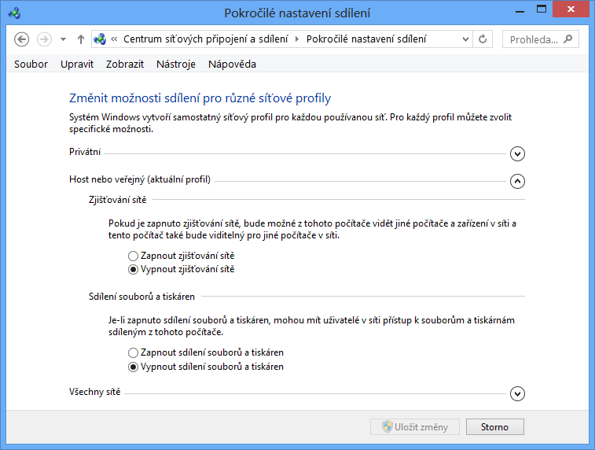

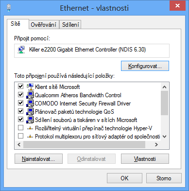

<!-- Snímky z Windows 8 (Ovládací panely › Pokročilé nastavení sdílení). Ve Windows 11 je stejná volba v Nastavení › Síť a internet › Upřesnit nastavení sítě › Upřesnit nastavení sdílení; vlastnosti adaptéru (druhý snímek) vypadají stále stejně. -->

---

<!-- _class: dense -->

# SMB ve Windows 11 24H2 a Windows Server 2025

- **Podepisování SMB** (*SMB signing*) vyžadováno ve výchozím stavu pro všechna spojení – všechny edice včetně Home
  - Chrání proti relay útokům a manipulaci s daty; NAS bez podpory podepisování se nepřipojí
- **Šifrování SMB 3** lze vynutit i na klientovi pro všechna odchozí spojení (`Set-SmbClientConfiguration -RequireEncryption $true`)
- **Blokování NTLM** na SMB klientovi (volitelné): `Set-SmbClientConfiguration -BlockNTLM $true`, seznam výjimek; NTLMv1 odstraněn, NTLMv2 *deprecated*
- **Omezovač rychlosti ověřování** (*authentication rate limiter*): prodleva 2 s po neúspěšném NTLM přihlášení, zapnut ve výchozím stavu
- **Správa dialektů:** server může povolit jen SMB 3.1.1; alternativní porty pro TCP/QUIC/RDMA
- **SMB over QUIC** – „SMB VPN“ přes UDP 443 a TLS 1.3; klient Windows 11, server Windows Server 2025 (všechny edice) nebo 2022 Datacenter: Azure Edition
- **SMB1** – ve Windows 11 není po čisté instalaci klient ani server; SMB 2.02–3.1.1 zůstávají
- **Přístup hostem** (*guest fallback*) zakázán – Enterprise/Education od 1709, Pro od Windows 11 24H2; Windows 11 Home dokumentace neuvádí (Windows 10 Home/Pro ho dál povolují)

<!-- Windows 11 24H2 Pro, Enterprise a Education vyžadují podepisování SMB pro příchozí i odchozí spojení; Windows Server 2025 jen pro odchozí (jako klient) a Windows 11 Home ho nevyžaduje (stránka „Control SMB signing behavior“; přehled What's new 24H2 uvádí obecně „Home, Pro, Education, Enterprise“ – řídit se specializovanou stránkou). Zdroj: https://learn.microsoft.com/en-us/windows-server/storage/file-server/smb-signing Podepisování existuje 30 let, ale poprvé je vyžadováno. Důsledek: starší NAS s vypnutým podepisováním nebo jen s hostem se nepřipojí („You can't access this shared folder because your organization's security policies block unauthenticated guest access“). Řešení je opravit NAS, ne vypínat podepisování – Set-SmbClientConfiguration -RequireSecuritySignature $false je jen nouzové.
Guest fallback: hostovský přístup navíc nepodporuje podepisování ani šifrování, takže i kde je povolen, s vyžadovaným podepisováním selže. Dokumentace uvádí zákaz pro Windows 11 Pro od Insider buildu 25267 (tj. první vydaná verze je 24H2); Windows 11 Home v seznamu není, u Windows 10 Home/Pro zůstal povolen.
SMB over QUIC: server musí mít certifikát (Server Authentication), klient zkouší nejdřív TCP 445 a až pak QUIC (nebo NET USE /TRANSPORT:QUIC, New-SmbMapping -TransportType QUIC). Od Windows 11 24H2 lze řídit, kteří klienti smějí QUIC použít (client access control), a auditovat spojení (event 30832).
Zdroj: https://learn.microsoft.com/en-us/windows/whats-new/whats-new-windows-11-version-24h2#server-message-block-smb-protocol-changes
Zdroj: https://learn.microsoft.com/en-us/windows-server/storage/file-server/smb-ntlm-blocking
Zdroj: https://learn.microsoft.com/en-us/windows-server/storage/file-server/configure-smb-authentication-rate-limiter
Zdroj: https://learn.microsoft.com/en-us/windows-server/storage/file-server/smb-over-quic
Zdroj: https://learn.microsoft.com/en-us/windows-server/storage/file-server/troubleshoot/smbv1-not-installed-by-default-in-windows
Zdroj: https://learn.microsoft.com/en-us/windows-server/storage/file-server/enable-insecure-guest-logons-smb2-and-smb3
Zdroj: https://learn.microsoft.com/en-us/windows-server/get-started/removed-deprecated-features-windows-server -->

---

# Moderní způsoby sdílení ve Windows 11

- **Standardní sdílení SMB** – Průzkumník souborů › pravé tlačítko › Udělit přístup › *Konkrétní lidé*, nebo záložka *Sdílení* ve vlastnostech
- **Sdílení v okolí** (*Nearby sharing*)
  - Nastavení › Systém › *Sdílení v okolí*; volby *Vypnuto* / *Jen moje zařízení* / *Všichni v okolí*
  - Přenos souborů a odkazů přes Bluetooth nebo Wi-Fi (stejná privátní síť); tlačítko *Sdílet* v Průzkumníku
  - Jen mezi počítači s Windows (10 v. 1803+ / 11); pro telefony Android není součástí Windows – Google Quick Share pro Windows nebo Propojení s telefonem
- **OneDrive** – sdílení odkazem, oprávnění *Může zobrazit* / *Může upravovat*, Files On-Demand („Soubory na vyžádání“), Známé složky (Plocha, Dokumenty, Obrázky)
- **Aplikace pro sdílení** (*Share sheet*) – tlačítko *Sdílet* předává soubor libovolné registrované aplikaci (Pošta, Teams, …)

<!-- Sdílení v okolí je náhrada „ad hoc“ použití domácích skupin: bez serveru, bez nastavování oprávnění. Při volbě Všichni v okolí je Bluetooth MAC adresa a název počítače viditelný okolním zařízením. Přijaté soubory končí ve složce Stažené soubory (lze změnit). Podle dokumentace funguje pouze mezi podporovanými zařízeními s Windows; přenos z/na Android řeší samostatná aplikace Google Quick Share pro Windows (není součástí systému) nebo sdílení souborů v aplikaci Propojení s telefonem.
OneDrive je dnes cesta, kterou Microsoft doporučuje i místo Souborů offline (viz dále).
Zdroj: https://support.microsoft.com/windows/share-things-with-nearby-devices-in-windows-0efbfe40-e3e2-581b-13f4-1a0e9936c2d9 -->

---

# Sdílené adresáře (Shared Folders)

- Povolení a nastavení ve **vlastnostech adresáře** (záložka *Sdílení*)
- **2 typy sdílení**
  - **Jednoduché** (*simple*) sdílení – tlačítko *Sdílení…*
  - **Pokročilé** (*advanced*) sdílení – tlačítko *Rozšířené možnosti sdílení…*

<!-- Pro nastavení jednoduchého sdílení je potřeba mít povoleno Používat průvodce sdílením (Doporučeno) v Možnostech Průzkumníka souborů (záložka Zobrazení), jinak bude tlačítko Sdílení… zašedlé. Dialog je ve Windows 11 stále stejný jako na snímku z Windows 8. -->

---

# Jednoduché sdílení adresářů

- Rozlišuje **3 typy oprávnění** (nastavuje vlastník)
  - **Čtení** (zahrnuje i spouštění)
  - **Čtení/zápis** (zahrnuje i úpravy a mazání)
  - **Vlastník** (nelze nastavit, přiřazeno automaticky účtu uživatele, jenž daný adresář nasdílel)
- Oprávnění lze nastavovat pouze
  - **Lokálním uživatelům**
  - **Lokální skupině Everyone**
  - **Doménovým skupinám a uživatelům**
- Spuštění také z **kontextové nabídky**: Udělit přístup › *Konkrétní lidé*

<!-- Pokud nemá uživatel přiřazeno žádné oprávnění, nemůže vůbec přistupovat k danému sdílení.
Při použití jednoduchého sdílení se při nastavení oprávnění pro sdílení nastaví automaticky také odpovídající NTFS oprávnění u sdíleného adresáře. Při následném odebrání oprávnění pro sdílení se ovšem automaticky nastavená NTFS oprávnění neodeberou a zůstanou i nadále v platnosti. Automatické nastavení NTFS oprávnění také často ruší dědění NTFS oprávnění.
Historie: v seznamu bývala i skupina Domácí skupina (HomeUsers); ta s odstraněním domácích skupin (1803) zmizela. -->

---

# Nastavení jednoduchého sdílení

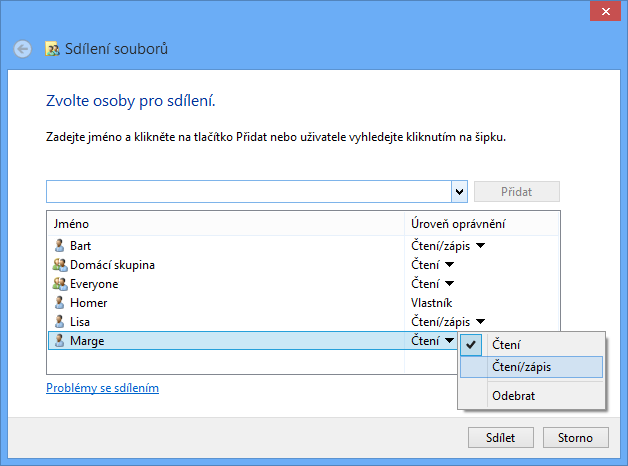

<!-- Snímky z Windows 8 – v seznamu je ještě položka Domácí skupina, kterou Windows 11 nenabízí. -->

---

# Pokročilé sdílení adresářů

- Rozlišuje **3 typy oprávnění**
  - **Číst** (zahrnuje i spouštění)
  - **Změnit** (čtení + zápis, úpravy a mazání)
  - **Úplné řízení** (možnost nastavovat oprávnění)
- Oprávnění lze nastavovat
  - **Lokálním i doménovým** uživatelům a skupinám
- Možnost **limitování počtu připojených uživatelů**
  - Max. **20** současných připojení (licenční omezení klientských Windows včetně Windows 11)
- Podpora **souborů offline** (tlačítko *Mezipaměť*)

<!-- K počítači s klientskými Windows (8/10/11) může být připojeno maximálně 20 uživatelů současně (u Windows XP/Vista bylo 10, od Windows 7 je to 20) – jde o omezení licenčních podmínek („Device Connections“), ne protokolu. Při vytváření sdílení je toto maximum nastaveno jako výchozí limit. K počítačům, na kterých běží Windows Server, se může připojit maximálně 2^24 uživatelů, což lze pokládat za neomezený počet.
Zdroj (Windows 7 Professional EULA, Device Connections – up to 20 other devices): https://www.microsoft.com/content/dam/microsoft/usetm/documents/windows/7-professional/oem-pre-installed/Windows_7%20Professional_English.pdf
Zdroj (Windows 11 licenční podmínky, Device Connections – 20 zařízení): https://learn.microsoft.com/en-us/windows/iot/iot-enterprise/eula/license_en-us_english_united_states.pdf -->

---

# Nastavení pokročilého sdílení

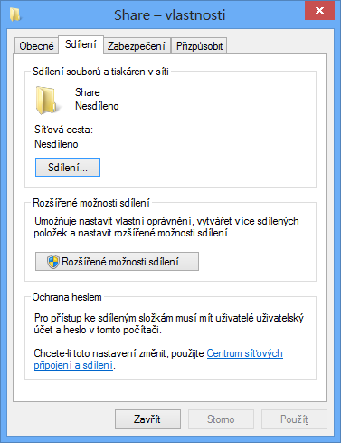

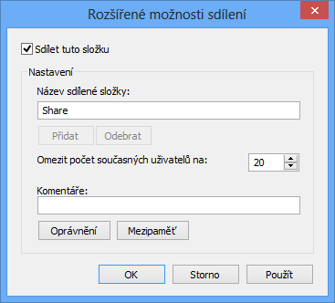

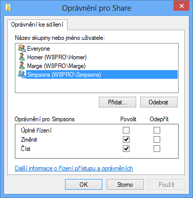

<!-- Možnost specifikovat název sdílené složky je důležitá pro vytváření skrytých sdílení.
V Mezipaměti se nastavují soubory offline (offline files). Dialogy jsou ve Windows 11 shodné. -->

---

# Skryté sdílené adresáře

- **Znak** `$` na konci názvu (např. `C$`)
- **Neviditelné** při prohledávání sítě
  - Jsou přístupné pomocí UNC cesty
- **UNC** (*Uniform Naming Convention*) cesta
  - Popis umístění sdíleného prostředku na síti
  - Obecný tvar `\\<server>\<sdílení>\<prostředek>`
    - Prostředkem může být např. adresář, soubor nebo tiskárna

<!-- Skrytí je jen kosmetické: `net share`, `Get-SmbShare` i vzdálené `net view \\server /all` je vypíší. Prohledávání sítě v Průzkumníku dnes používá WS-Discovery (služby Function Discovery), ne NetBIOS browsing závislý na SMB1. -->

---

# Speciální sdílené adresáře

- Vytvářeny **automaticky** systémem Windows
  - Vždy skryté
  - Přístupné pouze uživatelům s oprávněními správce
- `ADMIN$`
  - Sdílení kořenového adresáře systému Windows
- `IPC$` (*Inter Process Communication*)
  - Sdílení souborů mezi počítači při komunikaci procesů
- `<jednotka>$` pro každý připojený oddíl disku
  - Sdílení kořenového adresáře oddílu disku

<!-- Od Windows Vista nejsou administrativní sdílení (ADMIN$, <jednotka>$) standardně přístupná lokálním účtům správců, jelikož se přes síť kvůli UAC připojí jen s oprávněními standardního uživatele (UAC remote restrictions). Aby se připojili s oprávněními správce, musí se v registru nastavit LocalAccountTokenFilterPolicy na hodnotu 1 (doménových účtů se to netýká). Zásady zabezpečení Microsoftu doporučují administrativní sdílení a LocalAccountTokenFilterPolicy nechat ve výchozím stavu a pro vzdálenou správu používat Windows LAPS / PowerShell remoting. -->

---

# Správa pomocí MMC konzole

- **Spuštění** příkazem `compmgmt.msc`, přes *Nástroje Windows* (dříve *Nástroje pro správu*) nebo pravým tlačítkem na Start › *Správa počítače*
- Systémové nástroje › **Sdílené složky**: *Sdílené složky*, *Relace*, *Otevřené soubory*
- **Vzdáleně:** Správa počítače › *Připojit k jinému počítači* (RPC/DCOM a SMB – skupiny pravidel firewallu *Vzdálená správa protokolu událostí*, *Vzdálená správa služeb*, *Sdílení souborů a tiskáren*; WinRM používá až PowerShell remoting)

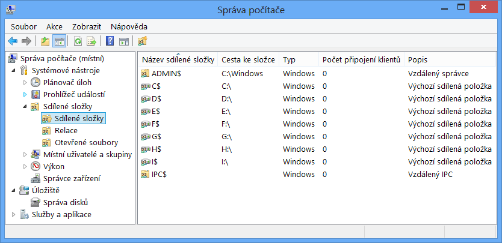

<!-- Lze násilně ukončit relaci (připojení ke sdílení) konkrétního uživatele, ale ten se může ihned připojit zpátky, pokud k tomu stále má dostatečná oprávnění.
Ve Windows 11 se sekce Ovládacích panelů jmenuje Nástroje Windows (Windows Tools) a je zároveň složkou v nabídce Start. -->

---

# Správa pomocí příkazové řádky (`net share`)

- **Vypsání seznamu** sdílených adresářů na počítači
  - `net share`
- **Vypsání informací** o sdíleném adresáři
  - `net share <název>`
- **Vytvoření** nového sdíleného adresáře
  - `net share <název>=<cesta-k-adresáři> [/users:<limit> | /unlimited] [/grant:<uživatel>,{read|change|full}]`
    - Název sdílení musí být unikátní v rámci počítače
    - Limit pro počet připojených uživatelů nesmí být 0
- **Odstranění** sdílení: `net share <název> /delete`

<!-- Přepínač /unlimited nastaví limit na maximum pro danou verzi systému Windows. Při specifikaci limitu přesahujícího maximum pro danou verzi systému Windows bude nastaveno jen maximum namísto zadaného limitu.
Pokud je nastavený limit roven maximu pro danou verzi systému Windows, vypisuje net share namísto limitu text Bez omezení, což je dosti zavádějící, jelikož limit pořád existuje (a u desktopových Windows je dosti omezující).
net share je stále funkční, ale moderní cesta je modul SmbShare (další snímek). -->

---

# Správa pomocí PowerShellu (modul SmbShare)

- **Sdílení:** `Get-SmbShare`, `New-SmbShare -Name Firma -Path C:\Smlouvy -FullAccess Everyone`, `Set-SmbShare`, `Remove-SmbShare`
- **Oprávnění sdílení:** `Get-SmbShareAccess`, `Grant-SmbShareAccess -Name Firma -AccountName Users -AccessRight Read`, `Revoke-SmbShareAccess`, `Block-SmbShareAccess` (odepření)
- **Kdo je připojen:** `Get-SmbSession`, `Get-SmbOpenFile`, `Close-SmbSession`
- **Strana klienta:** `Get-SmbConnection` (dialekt, podepisování, šifrování), `New-SmbMapping -LocalPath Z: -RemotePath \\W11-1\Firma`
- **Konfigurace:** `Get-SmbServerConfiguration`, `Get-SmbClientConfiguration`, `Set-SmbServerConfiguration -EncryptData $true`

<!-- Modul SmbShare je součástí Windows od verze 8 / Server 2012 a funguje ve Windows PowerShellu 5.1 i v PowerShellu 7. Get-SmbConnection ukáže u každého spojení dialekt (3.1.1) a zda je podepsané/šifrované – užitečné při ladění problémů s NAS po přechodu na 24H2.
Zdroj: https://learn.microsoft.com/en-us/powershell/module/smbshare/ -->

---

# Knihovny (Libraries)

- **Virtuální adresáře** zahrnující jiné adresáře
  - Tvořeny odkazy na (lokální nebo síťové) adresáře
  - Fyzicky XML soubory s příponou `.library-ms` (`%AppData%\Microsoft\Windows\Libraries`)
- Přístup a správa pomocí **Průzkumníka souborů**
  - Definice obsažených adresářů (a výchozího adresáře pro ukládání dat) ve vlastnostech dané knihovny
- Možnost **optimalizace** pro konkrétní typy dat
- Ve Windows 10/11 **skryté ve výchozím stavu** – zobrazí se přes Možnosti složky › Zobrazení › *Zobrazit knihovny* (nebo pravým tlačítkem na navigační podokno)
- Sdílení jen **běžným způsobem** (sdílení v rámci domácí skupiny zaniklo)

<!-- Knihovny dál používají např. Fotky nebo dialogy Otevřít/Uložit; Historie souborů ve Windows 11 (jen v Ovládacích panelech) zálohuje právě knihovny + Plochu, Kontakty a Oblíbené; další složku přidáte tak, že ji zahrnete do knihovny – dnes hlavní praktický důvod, proč knihovny existují (stránka Nastavení › Zálohování s přidáváním složek ve Windows 11 není).
Zdroj: https://learn.microsoft.com/en-us/answers/questions/4114960/add-more-folders-to-file-history-in-windows-11
Zdroj: https://learn.microsoft.com/en-us/answers/questions/3873491/on-windows-11-where-can-i-see-the-list-of-folders Nový Průzkumník (Windows 11) je má v navigačním podokně vypnuté, ale položka Knihovny zůstává pod „Tento počítač“ po zapnutí volby. -->

---

# Přístup ke knihovnám a jejich správa

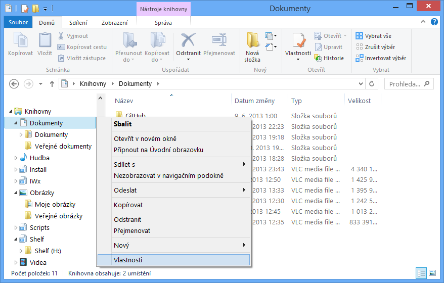

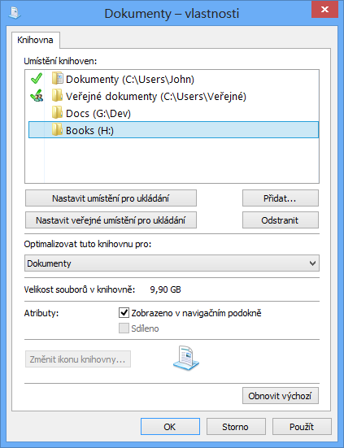

<!-- Snímky z Windows 8 (kontextová nabídka ještě obsahuje „Sdílet s › Domácí skupina“). Ve Windows 10/11 není sekce Knihovny ve výchozím nastavení viditelná, musí se povolit: Možnosti složky › Zobrazení › Navigační podokno › Zobrazit knihovny. -->

---

# Sdílení tiskáren

- Nastavení ve **vlastnostech tiskárny** (Nastavení › Bluetooth a zařízení › Tiskárny a skenery › tiskárna › Vlastnosti tiskárny › *Sdílení*)
- **3 základní typy oprávnění**
  - **Tisk** (a správa vlastních dokumentů v tiskové frontě)
  - **Správa této tiskárny** (změna nastavení a oprávnění tiskárny, sdílení tiskárny, pozastavení tiskárny, …)
  - **Správa dokumentů** (správa veškerých dokumentů v tiskové frontě)
- Možnost dodat **další ovladače** (x64, ARM64) – klient si je stáhne při přidání tiskárny (*Point and Print*)
- Windows 11 24H2: režim **Chráněný tisk Windows** – jen vestavěný ovladač IPP/Mopria, ovladače třetích stran se neinstalují

<!-- Ovladač samotný nemusí někdy postačovat pro správné fungování tiskárny, může být potřeba např. speciální tiskový procesor (např. pro GDI tiskárny), jenž není nainstalován s ovladačem.
Point and Print: po útocích PrintNightmare (2021) vyžaduje instalace ovladače ze sdílené tiskárny ve výchozím stavu oprávnění správce (RestrictDriverInstallationToAdministrators = 1). Chráněný tisk Windows (Windows protected print mode) tento problém řeší tím, že ovladače třetích stran vůbec nepovolí; zapíná se v Nastavení › Bluetooth a zařízení › Tiskárny a skenery nebo zásadou Konfigurace počítače › Šablony pro správu › Tiskárny › Konfigurovat chráněný tisk Windows.
Zdroj: https://learn.microsoft.com/en-us/windows/whats-new/whats-new-windows-11-version-24h2#windows-protected-print-mode -->

---

# Soubory offline (Offline Files)

- **Přístup k souborům v síti** i bez připojení k této síti
  - Kešování souborů na lokálním počítači (`C:\Windows\CSC`)
  - Synchronizace souborů při opětovném připojení
- Pouze u edicí **Pro, Enterprise a Education** (ne Home)
- Možnost **šifrování dat** ve vyrovnávací paměti (EFS) – Ovládací panely › Centrum synchronizace › Spravovat soubory offline › karta *Šifrování* › *Šifrovat* (certifikát EFS uživatele)
- Stav 2026: **legacy** – dál funguje (Ovládací panely › *Centrum synchronizace*), Microsoft do něj neinvestuje, není ale na seznamu zastaralých funkcí
  - Microsoft doporučuje OneDrive (Files On-Demand), pro on-prem souborové servery Work Folders

<!-- Soubory offline lze také použít např. pro urychlení spouštění programů ze síťového umístění, kdy bude velká část potřebných souborů daného programu již nakešována lokálně.
Centrum synchronizace zůstává jen v Ovládacích panelech, do Nastavení nebylo nikdy přeneseno. Ve cvičení E04 (Lab 07) se Soubory offline stále používají – funkčnost ve Windows 11 24H2 ověřena.
Zdroj (srovnávací tabulka Work Folders / Offline Files / OneDrive): https://learn.microsoft.com/en-us/windows-server/storage/work-folders/work-folders-overview#comparison-with-other-sync-technologies
Zdroj (seznam zastaralých funkcí – Soubory offline v něm nejsou): https://learn.microsoft.com/en-us/windows/whats-new/deprecated-features -->

---

# Moderní náhrady: OneDrive a Work Folders

- **OneDrive Files On-Demand** (Soubory na vyžádání)
  - Soubory viditelné v Průzkumníku, stahují se při otevření; stavy: jen online (obláček), lokálně dostupný, vždy na zařízení (zelené zatržítko)
  - **Známé složky** (*Known Folder Move*) – Plocha, Dokumenty, Obrázky přesměrované do OneDrive; řešení konfliktů verzí přímo v klientu
  - Firemní data: OneDrive pro firmy / SharePoint, správa přes Intune a zásady skupiny
- **Work Folders** (Pracovní složky)
  - Role souborového serveru (Windows Server 2012 R2+), klient ve Windows 10/11 (Ovládací panely › *Pracovní složky*)
  - Synchronizace přes HTTPS i z internetu, vynucení šifrování a zámku obrazovky na zařízení
  - Lze kombinovat s Přesměrováním složek a Soubory offline; dnes spíše okrajové, Microsoft míří na OneDrive

<!-- OneDrive Files On-Demand vyžaduje NTFS (používá reparse points / cloud files API). Ve Windows 11 je klient OneDrive součástí systému a při OOBE s účtem Microsoft se Známé složky zálohují automaticky (lze vypnout v nastavení OneDrive › Synchronizace a zálohování).
Work Folders nemá oficiální „deprecated“ status (ověřeno v seznamech zastaralých funkcí Windows i Windows Server, září 2026), ale dokumentace uvádí jako podporované servery jen 2012 R2–2019 a od roku 2019 nepřibyly nové funkce.
Zdroj: https://learn.microsoft.com/en-us/windows-server/storage/work-folders/work-folders-overview
Zdroj: https://learn.microsoft.com/en-us/windows-server/get-started/removed-deprecated-features-windows-server -->

---

# Povolení a nastavení souborů offline

- Povolení souborů offline v **Centru synchronizace** (Spravovat soubory offline › *Povolit soubory offline*, vyžaduje restart)
- **Výběr souborů**, jenž budou k dispozici offline
  - **Manuálně** pomocí Průzkumníka souborů (*Vždy přístupné offline* – ve Windows 11 pod *Zobrazit další možnosti*)
    - Musí být podporovány (resp. povoleny) na úrovni adresáře v Rozšířených možnostech sdílení › *Mezipaměť*
  - **Automaticky** povolením na úrovni adresáře
  - **Centrálně** pomocí zásad skupiny
- **Vyloučení** jednotlivých typů souborů
  - **Centrálně** pomocí zásad skupiny

<!-- Vyloučení se týká pouze typů souborů (např. *.avi), ne konkrétních vybraných souborů. Zásady jsou v Konfigurace počítače › Šablony pro správu › Síť › Soubory offline. -->

---

# Globální povolení souborů offline

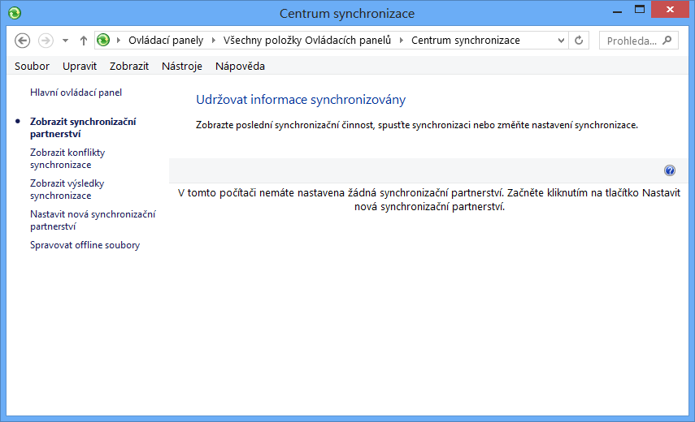

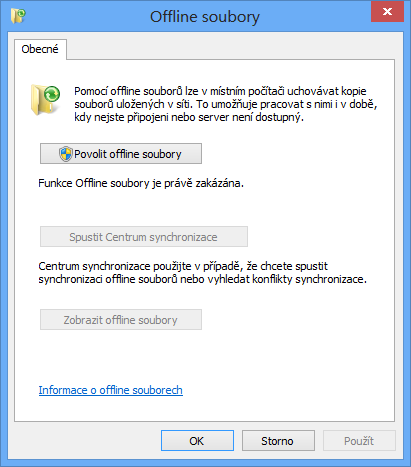

<!-- Snímky z Windows 8; Centrum synchronizace vypadá ve Windows 11 stejně (Ovládací panely). -->

---

# Povolení na úrovni sdíleného adresáře

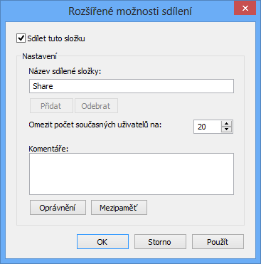

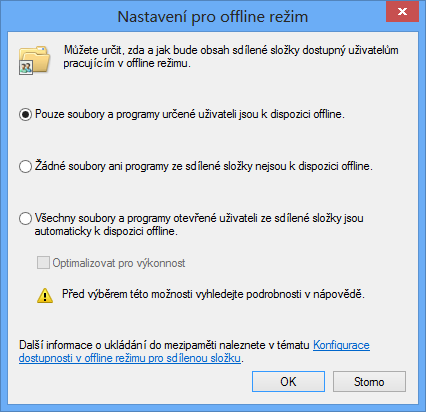

<!-- Dialog Nastavení pro offline režim (tlačítko Mezipaměť v Rozšířených možnostech sdílení) je ve Windows 11 beze změny. -->

---

# Režimy souborů offline (1)

- **Online režim**
  - Čtení z vyrovnávací paměti (cache), zápis do sdílení
  - Synchronizace prováděna automaticky
- **Automatický offline režim**
  - Čtení a zápis do vyrovnávací paměti (cache)
  - Ověřování připojení do sítě co 2 minuty

---

# Režimy souborů offline (2)

- **Manuální offline režim**
  - Čtení a zápis do vyrovnávací paměti (cache)
  - Ověřování neprobíhá
  - Zapnutí / vypnutí v Průzkumníku souborů (*Pracovat offline* / *Pracovat online*)
- **Režim pomalé linky** (*slow-link*)
  - Čtení a zápis do vyrovnávací paměti (cache)
  - Povolen automaticky při pomalém připojení do sítě (práh lze nastavit v zásadách skupiny)
  - Synchronizace na pozadí každých 6 hodin (výchozí hodnota, lze změnit zásadou)

<!-- Výchozí práh režimu pomalé linky je latence 35 ms (Windows 8 a novější; Windows 7 80 ms), není-li zásada Configure slow-link mode nakonfigurována; 64 kb/s byl práh Windows XP. Zdroj: https://admx.help/?Category=Windows_10_2016&Policy=Microsoft.Policies.OfflineFiles::Pol_SlowLinkSettings ; https://learn.microsoft.com/en-us/previous-versions/windows/it-pro/windows-server-2012-R2-and-2012/hh968298(v=ws.11)
Synchronizace na pozadí v režimu pomalé linky (od Windows 8) probíhá ve výchozím nastavení co 6 hodin (zásada Configure Background Sync). -->

---

# Režimy souborů offline (3)

- **Režim vždy offline** (*Always offline*)
  - Varianta režimu pomalé linky
  - Pouze v doméně Active Directory
  - Pomocí zásad skupin zajistíme vynucení práce offline i při dobré konektivitě
    - zásada *Configure slow-link mode* a použití `Latency=1`
  - Synchronizace každé 2 hodiny

<!-- Režim Always Offline vynucuje práci v offline režimu i pokud má počítač dobrou konektivitu do sítě. Tento režim se zapíná nastavením zásady Configure slow-link mode a použitím Latency=1 u výběru adresáře, pro který má být tento režim zapnut. Synchronizace v tomto režimu probíhá ve výchozím nastavení co 120 minut (lze změnit nastavením zásady Configure Background Sync). Počítač musí být v doméně Active Directory! -->

---

# Synchronizace

- Probíhá **automaticky nebo manuálně**
- **Řešení konfliktů** při synchronizaci
  - **Ponechání lokální verze** (přepsání verze ve sdílení)
  - **Ponechání verze ve sdílení** (přepsání lokální verze)
  - **Ponechání obou verzí** (přejmenování lokální verze)
- **Cost-aware synchronizace**
  - Přepnutí do offline režimu na měřeném připojení (mobilní hotspot, roaming, blížící se datový limit); zásada *Enable file synchronization on costed networks*
  - Jen v doméně

<!-- Cost-aware synchronizace vynutí přepnutí do offline režimu (a vypne synchronizaci na pozadí), pokud počítač přesáhl nebo se blíží limitu pro přenos dat (např. mobilní hotspot, síť označená v Nastavení jako Měřené připojení). Uživatel může pořád provést synchronizaci manuálně. Tato forma synchronizace se zapíná nastavením zásady Enable file synchronization on costed networks. Informaci o měřeném připojení dodává NCSI / nastavení Měřené připojení (mobilní síť, roaming, blížící se limit plánu), nikoli latence – latence 35 ms je práh režimu pomalé linky (předchozí snímek). Zdroj: https://learn.microsoft.com/en-us/windows-server/storage/folder-redirection/enable-background-synchronization ; https://learn.microsoft.com/en-us/previous-versions/windows/it-pro/windows-server-2012-R2-and-2012/hh848267(v=ws.11) Počítač musí být v doméně Active Directory! -->

---

# Řešení konfliktů při synchronizaci

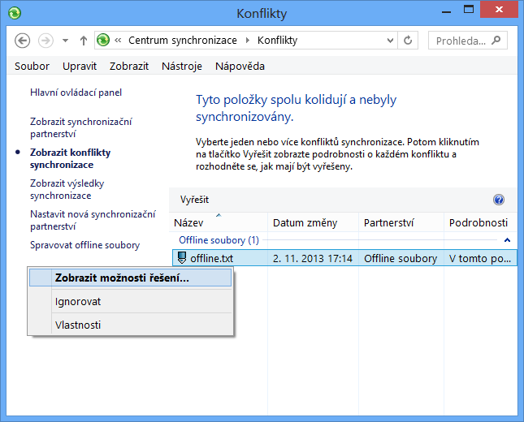

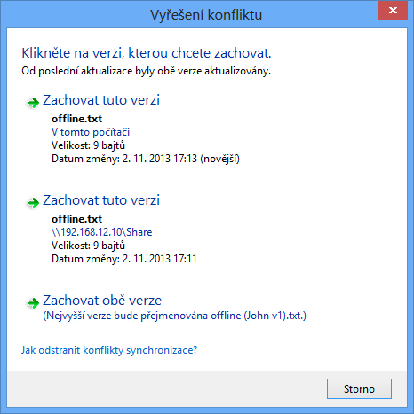

<!-- Neprobíraly se veřejné adresáře (public folders) a transparentní kešování (transparent caching).
Veřejné adresáře (C:\Users\Public) jsou přístupné (čtení i zápis) pro všechny uživatele na daném počítači a jejich sdílení do sítě se povoluje v Upřesnit nastavení sdílení › Všechny sítě › Sdílení veřejné složky.
Transparentní kešování je něco na způsob online režimu souborů offline, kdy kešujeme soubory na síti, se kterými pracujeme, a upřednostňujeme práci s kešovanými lokálními kopiemi před prací s originálními soubory na síti; zapíná se zásadou Enable Transparent Caching a je k dispozici i tam, kde nejsou Soubory offline. -->

---

# Zabezpečení prostředků

- **Oprávnění**
  - **Sdílení**
  - **Tiskáren**
  - **Souborového systému NTFS** (a ReFS – stejný model ACL)
- **Auditování přístupu**
- **Šifrování**
  - **EFS** (*Encrypting File System*) – na úrovni souborů a uživatele
  - **Personal Data Encryption** (PDE) – na úrovni souborů, klíče vázané na Windows Hello (Enterprise/Education)
  - **BitLocker** – na úrovni celého oddílu a počítače

---

<!-- _class: dense -->

# Souborové systémy: NTFS, ReFS a Dev Drive

- **NTFS** – výchozí pro systémový i datové oddíly; ACL, EFS, komprese, kvóty, žurnál USN, tvrdé/symbolické odkazy, VSS
- **ReFS** (*Resilient File System*) – integrita metadat (kontrolní součty), block cloning, velké svazky; bez kvót, bootování, zmenšování svazku a výměnných médií; EFS až na Windows Server 2025
  - Na klientu lze ReFS svazek vytvořit jen v edicích **Enterprise a Pro for Workstations** (od 1709), ostatní edice ho jen čtou a zapisují – pro ně je cestou Dev Drive; na Windows Server pro datové svazky (Storage Spaces, Hyper-V)
- **Dev Drive** (Windows 11 od build 22621.2338, všechny edice)
  - Svazek ReFS optimalizovaný pro zdrojové kódy, balíčky a build výstupy; min. 50 GB, Defender v režimu performance mode
  - Nastavení › Systém › Úložiště › Upřesnit nastavení úložiště › Disky a svazky › *Vytvořit Dev Drive*, nebo `Format-Volume -DriveLetter D -DevDrive`
  - Nelze pro C:, ne na dynamických discích (*deprecated* → Storage Spaces)

<!-- NTFS oprávnění probíraná dále platí i pro ReFS – používá stejný bezpečnostní popisovač (DACL/SACL). ReFS ale nepodporuje diskové kvóty, krátké názvy 8.3, transakce, ODX, zmenšování svazku ani výměnná média a Windows z něj neumí bootovat, proto zůstává systémový oddíl NTFS. Šifrování EFS na ReFS uvádí přehled ReFS jako dostupné pouze na Windows Server 2025; na klientu (Dev Drive) EFS na ReFS není. Blokovou kompresi ReFS podporuje (stejně jako NTFS), jde ale o jinou implementaci než komprese NTFS po souborech.
Dev Drive od Windows 11 24H2 podporuje block cloning (kopie souboru jako metadata). Nový VHD s Dev Drive na BitLockerem šifrovaném disku je šifrován s hostitelským svazkem.
Zdroj: https://learn.microsoft.com/en-us/windows/dev-drive/
Zdroj: https://learn.microsoft.com/en-us/windows-server/storage/refs/refs-overview
Zdroj (dynamické disky deprecated): https://learn.microsoft.com/en-us/windows/whats-new/deprecated-features
Zdroj (ReFS 1709 – vytváření svazků jen Enterprise a Pro for Workstations, ostatní edice čtení/zápis): https://learn.microsoft.com/en-us/windows/whats-new/removed-features -->

---

# NTFS oprávnění

- Zabezpečení na **úrovni přístupů k datům**
- Lze nastavovat **lokálním i doménovým** skupinám a uživatelům (a předdefinovaným skupinám)
  - Předdefinované skupiny **Everyone** a **Creator Owner**
    - Zahrnují všechny uživatele, resp. uživatele, jenž vlastní daný adresář nebo soubor (v době definice oprávnění)
- Nelze použít u souborových systémů **FAT, FAT32 a exFAT**
- Ověřovány i při **přístupu ze sítě**
- Uloženy v **ACL seznamech** (*Access Control Lists*)

<!-- Předdefinované skupiny jsou přesněji předdefinované objekty zabezpečení, ovšem u desktop systémů jsou všechny tyto objekty skupiny.
U systémů Windows se ACL seznamy obsahující NTFS oprávnění označují jako DACL seznamy (Discretionary Access Control Lists); auditovací záznamy jsou v SACL.
ACL seznamy lze najít i u UNIXových systémů (POSIX ACL, NFSv4 ACL).
ACL seznamy se skládají z ACE záznamů (Access Control Entries), jenž obsahují informace o oprávněních konkrétního uživatele nebo skupiny.
Oprávnění pro skupinu Creator Owner zůstávají jen u adresářů, u souborů je tato skupina nahrazována účtem aktuálního vlastníka. -->

---

<!-- _class: dense -->

# Základní (skupiny) NTFS oprávnění

| Oprávnění | Prostředek | Popis |
| --- | --- | --- |
| Úplné řízení | Adresář | Zobrazení a přístup k obsahu, vytváření souborů a adresářů, změny oprávnění, odstraňování souborů a adresářů |
|  | Soubor | Čtení, zápis, úpravy a odstraňování, změny oprávnění |
| Měnit | Adresář | Zobrazení a přístup k obsahu, vytváření souborů a adresářů |
|  | Soubor | Čtení, zápis, úpravy a odstraňování |
| Číst a spouštět | Adresář | Zobrazení obsahu, přístup k souborům a jejich spouštění (dědí soubory i podsložky) |
|  | Soubor | Přístup k souboru a jeho spouštění |
| Zobrazovat obsah složky | Adresář | Totéž jako Číst a spouštět, dědí jen podsložky (ne soubory) |
| Číst | Adresář | Zobrazení obsahu, čtení atributů a oprávnění |
|  | Soubor | Přístup k souboru |
| Zapisovat | Adresář | Vytváření souborů a adresářů (ne jejich odstraňování) |
|  | Soubor | Zápis a úpravy (ne odstraňování) |

<!-- I s oprávněním měnit pro adresář můžeme obvykle mazat soubory (a podadresáře) v tomto adresáři, jelikož tyto soubory a adresáře typicky dědí oprávnění od otcovského adresáře a tímto získáme oprávnění dědit i pro daný soubor (podadresář). Rozklad základních oprávnění na 14 rozšířených (Procházet složku / Spouštět soubor, Vypisovat složku / Číst data, …) je v textu cvičení E04.
Číst i Číst a spouštět obsahují rozšířené oprávnění Vypisovat složku / Číst data (List Folder / Read Data), takže obsah složky zobrazit lze; Zobrazovat obsah složky se od Číst a spouštět liší jen dědičností (jen podsložky). Zdroj: https://learn.microsoft.com/en-us/previous-versions/windows/it-pro/windows-server-2003/cc787794(v=ws.10) -->

---

# Nastavení a změny NTFS oprávnění

- Ve **vlastnostech souboru nebo adresáře** (záložka *Zabezpečení*), případně přes příkazovou řádku
- Oprávnění může nastavovat nebo měnit
  - **Uživatel nebo skupina**, jenž má přiděleno oprávnění *Měnit oprávnění* (zahrnuto ve skupině *Úplné řízení*)
  - **Vlastník** souboru nebo adresáře
    - Ve výchozím nastavení uživatel, jenž vytvořil daný soubor nebo adresář
    - Může být kdykoliv nahrazen jiným uživatelem, jenž má oprávnění *Přebírat vlastnictví* (správci počítače mohou přebírat vlastnictví i bez tohoto oprávnění – Upřesnit › Vlastník › *Změnit*)

---

# Dědičnost NTFS oprávnění

- **Nově vytvářené soubory a adresáře** dědí NTFS oprávnění adresáře, ve kterém byly vytvořeny
  - Zděděná oprávnění mají nižší prioritu než explicitní
- **Zákaz dědičnosti** ve vlastnostech souboru/adresáře (Upřesnit › *Zakázat dědičnost*)
  - *Převést zděděná oprávnění na výslovná* / *Odebrat všechna zděděná oprávnění*
- **Vynucení dědičnosti** na podřízených souborech a adresářích (*child objects*)
  - Přepsání NTFS oprávnění u podřízených objektů (*Nahradit všechny položky oprávnění podřízených objektů…*)
    - Uživatel musí být schopen měnit oprávnění

---

# Výpočet výsledných NTFS oprávnění

- Každé oprávnění lze **povolit nebo odepřít**
  - Odepření má vždy vyšší prioritu (přepisuje povolení)
- **Obecný algoritmus**
  1. **Vytvoř** prázdnou množinu oprávnění S
  2. **Přidej** do S zděděná oprávnění, která jsou povolená pro daného uživatele nebo skupinu, jenž je členem
  3. **Odeber** z S zděděná oprávnění, která jsou odepřená pro daného uživatele nebo skupinu, jenž je členem
  4. **Opakuj** body 2) a 3) pro explicitní oprávnění
  5. **Vrať** oprávnění obsažená v množině S

---

# Příklad s povolením (allow) oprávnění

- Uživatel je členem skupin **A a B**

| Oprávnění skupiny A |  |
| --- | --- |
| Povolit | Číst a spouštět |
| Povolit | Číst |

| Oprávnění skupiny B |  |
| --- | --- |
| Povolit | Číst |
| Povolit | Zapisovat |

**Sjednocení**

| Výsledná oprávnění |
| --- |
| Číst a spouštět |
| Číst |
| Zapisovat |

---

# Příklad s odepřením (deny) oprávnění

- Uživatel je členem skupin **A a B**

| Oprávnění skupiny A |  |
| --- | --- |
| Povolit | Číst a spouštět |
| Povolit | Číst |

| Oprávnění skupiny B |  |
| --- | --- |
| Povolit | Číst |
| Povolit | Zapisovat |

**Sjednocení**

| Oprávnění |
| --- |
| Číst a spouštět |
| Číst |
| Zapisovat |

| Oprávnění uživatele |  |
| --- | --- |
| Odepřít | Číst |

**Rozdíl**

| Výsledná oprávnění |
| --- |
| Spouštět |
| Zapisovat |

<!-- Zjednodušený model s pěti základními oprávněními – v dialogu Platný přístup Windows zobrazí rozklad na rozšířená oprávnění (Odepřít Číst odebere i Číst atributy a Synchronize, takže reálně selže i zápis do souboru). -->

---

# Příklad se zděděnými oprávněními

- Uživatel je členem skupin **A a B**

**Zděděno**

| Oprávnění skupiny A |  |
| --- | --- |
| Povolit | Číst |
| Povolit | Zapisovat |

| Oprávnění uživatele |  |
| --- | --- |
| Odepřít | Číst |

**Rozdíl**

| Oprávnění |
| --- |
| Zapisovat |

| Oprávnění skupiny B |  |
| --- | --- |
| Povolit | Číst |

**Sjednocení**

| Výsledná oprávnění |
| --- |
| Číst |
| Zapisovat |

---

# Zjištění výsledných NTFS oprávnění

- Vlastnosti › Zabezpečení › Upřesnit › záložka **Platný přístup** (*Effective Access*) › Vybrat uživatele › *Zobrazit platný přístup*

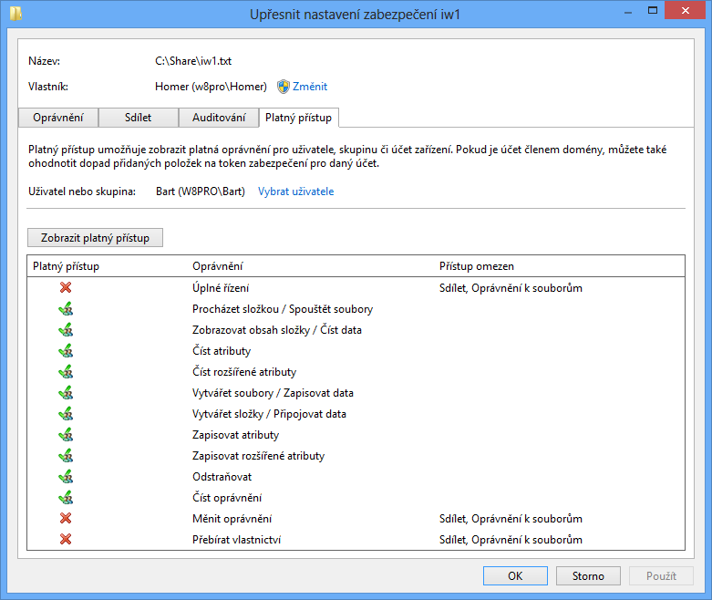

<!-- Dialog počítá výsledná oprávnění ze všech skupin, kterých je účet členem, a umožňuje i simulaci (přidat skupinu, nároky zařízení). U přístupu ze sítě nezohledňuje oprávnění sdílení – ta je třeba započítat zvlášť (viz dále). Stejný název záložky (Platný přístup) používá cvičení E04. -->

---

<!-- _class: dense -->

# Kopírování a přesun

**Standardní chování**

|  | V rámci stejného oddílu | Mezi různými oddíly | Na oddíl FAT/FAT32/exFAT |
| --- | --- | --- | --- |
| Přesun | Zachovává oprávnění | Dědí oprávnění od cílového adresáře | Nezachovává oprávnění |
| Kopírování | Dědí oprávnění od cílového adresáře | Dědí oprávnění od cílového adresáře | Nezachovává oprávnění |

Při použití nástroje **robocopy** (`/COPY:DATSOU` nebo `/COPYALL`, `/SEC`)

|  | V rámci stejného oddílu | Mezi různými oddíly | Na oddíl FAT/FAT32/exFAT |
| --- | --- | --- | --- |
| Přesun | Zachovává oprávnění | Zachovává oprávnění | Nezachovává oprávnění |
| Kopírování | Zachovává oprávnění | Zachovává oprávnění | Nezachovává oprávnění |

<!-- robocopy bez přepínačů kopíruje jen data, atributy a časy (/COPY:DAT); oprávnění (S), vlastníka (O) a auditování (U) zachová až /COPY:DATSOU, /COPYALL nebo /SEC (= /COPY:DATS). Totéž platí pro cíl na ReFS. -->

---

<!-- _class: dense -->

# Správa pomocí příkazové řádky (`icacls`)

- **Výpis** NTFS oprávnění
  - `icacls <soubor/adresář>`
- **Změna** NTFS oprávnění
  - **Povolení:** `icacls <soubor/adresář> /grant <uživatel>:<oprávnění>`
  - **Odepření:** `icacls <soubor/adresář> /deny <uživatel>:<oprávnění>`
  - **Odebrání:** `icacls <soubor/adresář> /remove <uživatel>`
  - Oprávnění mohou být jak skupiny (`F`, `M`, `RX`, `R`, `W`), tak konkrétní NTFS oprávnění (odděleny čárkami a uvedeny v závorce)
- **Dědičnost a vlastník:** `/inheritance:e|d|r`, `/setowner <uživatel>`, `/T` (rekurzivně), `/reset`
- **Záloha a obnova ACL:** `icacls C:\Data /save acl.txt /T`, `icacls C:\ /restore acl.txt`
- **PowerShell:** `Get-Acl`, `Set-Acl`; převzetí vlastnictví `takeown /F <cesta> /R`

<!-- Pro správu lze také využít PowerShell a jeho cmdlety Get-Acl a Set-Acl, jenž zpřístupňují resp. nastavují objekty reprezentující ACL seznamy a jejich položky (System.Security.AccessControl); položku ACE se přidává metodou AddAccessRule. Modul NTFSSecurity z PowerShell Gallery to zjednodušuje.
Uživatele lze specifikovat pomocí názvu nebo SID jeho uživatelského účtu (`*S-1-5-32-544` pro Administrators).
Zdroj: https://learn.microsoft.com/en-us/windows-server/administration/windows-commands/icacls -->

---

# Výpočet oprávnění při přístupu ze sítě

- Ověřují se oprávnění **sdílení i NTFS**
- **Obecný algoritmus**
  1. Vypočti množinu výsledných **oprávnění sdílení**
  2. Vypočti množinu výsledných **NTFS oprávnění**
  3. **Vrať** oprávnění obsažená v obou množinách
- **Doporučená praxe:** sdílení *Úplné řízení* pro Authenticated Users, řízení přístupu ponechat na NTFS oprávněních

<!-- Pořadí kontrol při přístupu ze sítě: firewall → právo Přístup k tomuto počítači ze sítě (User Rights Assignment) → oprávnění sdílení → NTFS oprávnění. -->

---

# Příklad s oprávněními sdílení (share)

- Uživatel je členem skupin **A a B**

| Oprávnění skupiny A |  |
| --- | --- |
| Povolit | Číst a spouštět |
| Povolit | Číst |

| Oprávnění skupiny B |  |
| --- | --- |
| Povolit | Číst |
| Povolit | Zapisovat |

**Sjednocení**

| Oprávnění |
| --- |
| Číst a spouštět |
| Číst |
| Zapisovat |

| Oprávnění sdílení |  |
| --- | --- |
| Povolit | Číst |

**Průnik**

| Výsledná oprávnění |
| --- |
| Číst a spouštět |
| Číst |

<!-- Číst u oprávnění sdílení umožňuje i spouštět. -->

---

# Auditování přístupu k prostředkům

- **Monitorování přístupu** k souborům a adresářům
  - Uložení informací o přístupech v Prohlížeči událostí (protokol *Zabezpečení*; události 4656, 4663, 4670, u sdílení 5140/5145)
- Povolení v **zásadách skupiny** (Konfigurace počítače › Nastavení systému Windows › *Nastavení zabezpečení*)
  - **Starší zásada** *Auditovat přístup k objektům* (Místní zásady › Zásady auditu)
  - **Doporučeno:** Konfigurace upřesňujících zásad auditu › Přístup k objektům › *Auditovat systém souborů*, *Auditovat sdílenou složku*
  - Lze monitorovat úspěšné a/nebo neúspěšné pokusy
  - Pouze umožňuje monitorovat přístup k souborům a adresářům (nespouští monitorování)
- **Příkazová řádka:** `auditpol /get /category:"Object Access"`, `auditpol /set /subcategory:"File System" /success:enable /failure:enable`

<!-- Upřesňující (Advanced) zásady auditu existují od Windows Vista/Server 2008 a mají přednost před starými devíti kategoriemi; míchat oboje nedoporučeno. Události generované při přístupu k souborům obsahují dodatečné informace, např. atributy souboru nebo přístupovou masku. Pro souborový server je smysluplnější Auditovat sdílenou složku / Podrobná sdílená složka (5145) než auditovat celý systém souborů. V doméně lze auditování řídit centrálně (Global Object Access Auditing) a sbírat přes Event Forwarding.
Zdroj: https://learn.microsoft.com/en-us/windows/security/threat-protection/auditing/advanced-security-auditing -->

---

# Nastavení auditování

- Nastavení ve **vlastnostech** jednotlivých souborů a adresářů (spuštění monitorování)
  - Vlastnosti › Zabezpečení › Upřesnit › záložka *Auditování* (zápis do SACL)
  - **Výběr oprávnění**, jejichž aplikace (čtení, zápis, apod.) má být monitorována a zaznamenána
  - **Výběr uživatelů a skupin**, kteří mají být monitorováni (pro monitorování všech uživatelů a skupin lze použít skupinu Everyone)
- **Příkazová řádka:** `icacls` pracuje jen s DACL (SACL neumí) – auditní pravidla přes PowerShell `Get-Acl -Audit` / `Set-Acl` (`FileSystemAuditRule`), stav zásad `auditpol /get /category:"Object Access"`

<!-- Příklad: $acl = Get-Acl -Audit C:\Data; $acl.AddAuditRule((New-Object System.Security.AccessControl.FileSystemAuditRule('Everyone','FullControl','ContainerInherit,ObjectInherit','None','Success,Failure'))); Set-Acl C:\Data $acl. Přepínač /setaudit v icacls neexistuje (referenční seznam: /save, /setowner, /findsid, /verify, /reset, /grant, /deny, /remove, /setintegritylevel, /substitute, /restore, /inheritance). Zdroj: https://learn.microsoft.com/en-us/windows-server/administration/windows-commands/icacls -->

---

# Výběr monitorovaných oprávnění

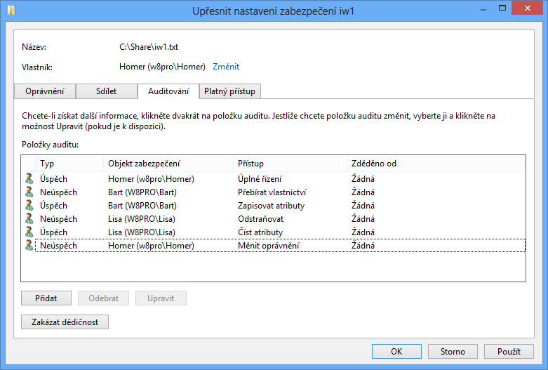

<!-- Dialog Upřesnit nastavení zabezpečení › Auditování je ve Windows 11 shodný se snímkem z Windows 8. -->

---

# EFS (Encrypting File System)

- Pouze u edicí **Pro, Enterprise a Education** (ne Home)
- **Šifrování jednotlivých souborů**
  - Zabezpečení na úrovni dat
  - Šifrování na úrovni uživatele (certifikát v profilu uživatele)
  - Nelze šifrovat systémové soubory a komprimované soubory
- Služba **souborového systému NTFS**
  - Nelze použít u souborových systémů FAT, FAT32 a exFAT; na ReFS jen na Windows Server 2025 (ne na klientském Dev Drive)
- **Transparentní** uživateli
  - Práce s šifrovanými soubory stejná jako s normálními
- Stav 2026: funkce **beze změny od Windows XP**; není náhradou BitLockeru (nechrání systém ani proti přihlášenému útočníkovi), moderní alternativa v Enterprise je PDE

<!-- EFS chrání data proti offline útoku (vyjmutý disk, jiný OS, správce na tomtéž počítači), ale ne když je uživatel přihlášen – pak jsou soubory transparentně čitelné každému procesu běžícímu pod jeho účtem (malware). Proto Microsoft doporučuje kombinaci: BitLocker na celý disk + EFS/PDE pro data více uživatelů na jednom počítači. Ztráta certifikátu = ztráta dat, odtud důraz na zálohu (cvičení E04 Lab 02) a agenta obnovení (Lab 05). Windows 11 Home EFS nemá; soubory zašifrované EFS se při kopírování na FAT/exFAT/ReFS dešifrují (Windows varuje).
Zdroj (edice pro BitLocker – Pro, Enterprise, Pro Education/SE, Education): https://learn.microsoft.com/en-us/windows/security/operating-system-security/data-protection/bitlocker/#windows-edition-and-licensing-requirements
Zdroj (EFS není v edici Home – porovnání edic Windows 11): https://www.microsoft.com/en-us/windows/business/compare-windows-11-editions
Zdroj (EFS na ReFS pouze Windows Server 2025 – tabulka Feature comparison, poznámka 3): https://learn.microsoft.com/en-us/windows-server/storage/refs/refs-overview -->

---

# Šifrování obsahu souborů (a složek)

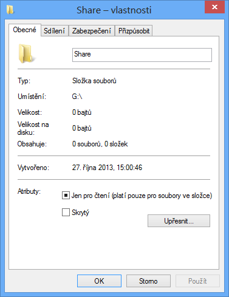

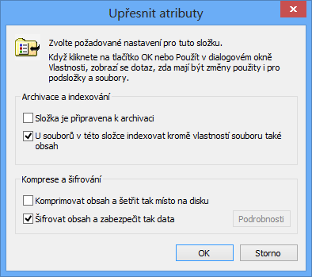

<!-- Vlastnosti › Obecné › Upřesnit… › Šifrovat obsah a zabezpečit tak data (stejně ve Windows 11, viz E04 Lab 02). Alternativně `cipher /e /s:<adresář>`; stav zobrazí `cipher /c <soubor>`. -->

---

# Šifrování

- Založeno na **hybridní kryptografii**
  - Data šifrována (a dešifrována) sdíleným klíčem (**FEK**, *File Encryption Key*) pomocí symetrické kryptografie (AES-256)
  - FEK klíč šifrován veřejným (a dešifrován privátním) klíčem uživatele pomocí asymetrické kryptografie (RSA 2048, volitelně ECC)
- **Výhody** hybridní kryptografie
  - **Rychlé šifrování** dat (symetrická kryptografie)
  - **Bezpečné sdílení** FEK klíče (asymetrická kryptografie)
  - Jednoduchá (a také efektivní) realizace **přístupu více uživatelů** k šifrovaným souborům

<!-- Výchozí algoritmy od Windows Vista/7: AES-256 pro FEK, RSA 2048 pro certifikát uživatele (samopodepsaný, pokud není PKI); zásada „Šifrování systému souborů“ umožňuje vynutit ECC (P-256/384/521) nebo čipovou kartu. -->

---

# Klíče

- **FEK klíč** (*File Encryption Key*)
  - Unikátní pro každý šifrovaný soubor
  - Generován při šifrování souboru prvním uživatelem
- **Veřejný klíč** (*public key*)
  - Uložen ve formě certifikátu v úložišti certifikátů
  - K dispozici všem uživatelům
- **Privátní klíč** (*private key*)
  - Uložen ve formě certifikátu v úložišti certifikátů (chráněn DPAPI heslem uživatele)
  - K dispozici pouze danému uživateli

<!-- Veřejné klíče jsou distribuovány v rámci Active Directory všem uživatelům v doméně. Privátní klíč chrání DPAPI, tj. odvozuje se z hesla uživatele – proto reset hesla správcem (ne změna uživatelem) znepřístupní EFS soubory, dokud se neobnoví zálohovaný certifikát (.pfx). -->

---

# Šifrování souboru prvním uživatelem

| Vstup | Operace | Klíč | Výstup |
| --- | --- | --- | --- |
| — | Generování | — | FEK |
| Data | Šifrování | FEK | Šifrovaná data |
| FEK | Šifrování | Veřejný klíč uživatele | FEK šifrovaný daným uživatelem |

<!-- Původně blokové schéma se šipkami (Data, FEK, klíče); převedeno na tabulku kroků. Šifrovaný FEK je uložen v atributu $EFS souboru (DDF – Data Decryption Field); pro agenta obnovení vzniká navíc DRF – Data Recovery Field. -->

---

# Šifrování souboru dalším uživatelem

| Vstup | Operace | Klíč | Výstup |
| --- | --- | --- | --- |
| FEK šifrovaný prvním uživatelem | Dešifrování | Privátní klíč prvního uživatele | FEK |
| FEK | Šifrování | Veřejný klíč dalšího uživatele | FEK šifrovaný dalším uživatelem |
| Šifrovaná data | (beze změny) | — | Šifrovaná data |

<!-- Původně blokové schéma se šipkami; převedeno na tabulku kroků. Přidání uživatele: Vlastnosti › Obecné › Upřesnit… › Podrobnosti › Přidat (cvičení E04 Lab 03) – přidávající musí být sám schopen FEK dešifrovat. -->

---

# Dešifrování souboru uživatelem

| Vstup | Operace | Klíč | Výstup |
| --- | --- | --- | --- |
| FEK šifrovaný daným uživatelem | Dešifrování | Privátní klíč uživatele | FEK |
| Šifrovaná data | Dešifrování | FEK | Data |
| FEK šifrovaný jiným uživatelem | (nepoužit) | — | — |

<!-- Původně blokové schéma se šipkami; převedeno na tabulku kroků. Uživatel bez odpovídajícího DDF/DRF záznamu dostane „Přístup byl odepřen“, i když má NTFS oprávnění Číst. -->

---

# Agent obnovení (RA, Recovery Agent)

- Umí dešifrovat **jakákoliv data** zašifrovaná pomocí EFS v době po jeho vytvoření
  - Při šifrování je FEK klíč (navíc) automaticky zašifrován pomocí veřejného klíče agenta obnovení
    - Zašifrování dříve vytvořených FEK klíčů pomocí `cipher /u`
- **Vytvoření** agenta obnovení
  - **Vygenerování** veřejného a privátního klíče agenta obnovení (certifikátu) pomocí `cipher /r:<název>`
  - Vytvoření agenta obnovení (RA) **v zásadách skupiny** importováním certifikátu obsahujícího veřejný klíč
    - Konfigurace počítače › Nastavení systému Windows › Nastavení zabezpečení › Zásady veřejných klíčů › Šifrování systému souborů › *Přidat Agenta obnovování dat…*

<!-- Příkaz cipher /r vygeneruje 2 soubory – .cer obsahující veřejný klíč a .pfx obsahující veřejný a privátní klíč (chráněný heslem). V doméně je agentem obnovení implicitně první správce domény; v pracovní skupině žádný není, dokud ho nevytvoříme (cvičení E04 Lab 05). -->

---

# Vytvoření agenta obnovení

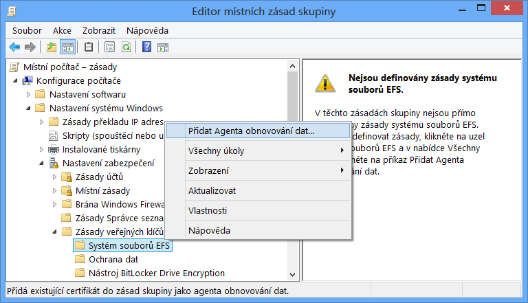

<!-- Editor místních zásad skupiny (gpedit.msc) – snímek z Windows 8, strom i dialog jsou ve Windows 11 shodné. -->

---

<!-- _class: dense -->

# Personal Data Encryption (PDE)

- Šifrování souborů s klíči vázanými na **Windows Hello for Business** (ne na certifikát jako EFS)
  - Klíče se uvolní při přihlášení přes Windows Hello (PIN, biometrie); po odhlášení (úroveň 1) nebo minutu po uzamčení (úroveň 2) se zahodí
  - Nepřístupné při přihlášení heslem, přes UNC cestu, Vzdálenou plochu ani jinému uživateli téhož PC
- Pouze **Windows 11 Enterprise a Education**, verze 22H2+; zařízení připojené k Microsoft Entra ID (i hybridně), ne čistě doménové (AD DS); vypnuté ARSO
- **PDE pro známé složky** (24H2+): Plocha, Dokumenty, Obrázky – zapnutí zásadou Intune (Endpoint security › *Disk encryption*)
- **Doplňuje BitLocker** (klíč uvolněn až při přihlášení uživatele, ne při startu) – není jeho náhradou
- **Riziko:** zničující reset PINu / TPM = ztráta klíčů → záloha (OneDrive), služba PIN reset

<!-- PDE používá AES-CBC 256. Stav ochrany souboru zobrazí Vlastnosti › Obecné › Upřesnit… › Podrobnosti („Personal Data Encryption is: On“) nebo `cipher /c`. Pro školní/laboratorní prostředí bez Entra ID není dostupné; probíráme jako směr, kterým Microsoft nahrazuje EFS v podnikovém nasazení.
Zdroj: https://learn.microsoft.com/en-us/windows/security/operating-system-security/data-protection/personal-data-encryption/
Zdroj: https://learn.microsoft.com/en-us/windows/whats-new/whats-new-windows-11-version-24h2#personal-data-encryption-for-folders -->

---

# BitLocker

- **Plný BitLocker** v edicích Pro, Pro Education/SE, Enterprise a Education; Home má jen **Šifrování zařízení** (*Device encryption* – automatická varianta BitLockeru)
- **Šifrování celých oddílů** disků
  - Zabezpečení na úrovni dat
  - Šifrování na úrovni počítače
  - Lze šifrovat i systémový oddíl (systémové soubory)
- Chrání **integritu operačního systému**
  - Nemožnost externí modifikace systémových souborů
- Sdílený klíč **FVEK** (*Full Volume Encryption Key*) pro šifrování a dešifrování; algoritmus **XTS-AES 128** (výchozí od Windows 10 1511), volitelně XTS-AES 256

<!-- Klíčů pro šifrování a dešifrování dat u BitLockeru je obecně více, FVEK je pouze jeden z nich (FVEK je zašifrován VMK – Volume Master Key, ten je chráněn jednotlivými protektory: TPM, PIN, klíč pro start, heslo pro obnovení, certifikát agenta).
BitLocker vyžaduje pro svou funkcionalitu (šifrování systémového oddílu) disk s alespoň dvěma oddíly:
 Oddíl se soubory operačního systému (NTFS, šifrován)
 Systémový oddíl se soubory nutnými pro start (u UEFI oddíl EFI s FAT32, u BIOSu NTFS; nešifrován, doporučeno 350 MB, po zapnutí BitLockeru alespoň 250 MB volných). Instalace Windows ho vytváří automaticky; ručně `bdehdcfg.exe`.
Lze šifrovat jen použité místo (Used Space Only) – rychlé u nových disků – nebo celý oddíl (Full). Oddíl lze zašifrovat už z WinPE před instalací (pre-provisioning, `manage-bde -on X: -used`), pak je chráněn jen tzv. clear key a po dokončení instalace se doplní protektory.
Hardwarově šifrované disky (Encrypted Hard Drive / OPAL) BitLocker podporuje, ale od roku 2019 dává ve výchozím stavu přednost softwarovému šifrování (zranitelnosti firmwaru SSD).
Windows Server: BitLocker je volitelná funkce, používá se i pro clustery a Storage Spaces Direct.
Zdroj: https://learn.microsoft.com/en-us/windows/security/operating-system-security/data-protection/bitlocker/ -->

---

<!-- _class: dense -->

# Šifrování zařízení ve Windows 11 24H2

- Od 24H2 se při čisté instalaci zapíná **automaticky ve všech edicích** včetně Home
  - Zrušeny požadavky na Modern Standby/HSTI a na absenci DMA portů; zůstává TPM (1.2/2.0) + UEFI Secure Boot
  - Po OOBE je disk zašifrován „clear key“ (stav pozastaveno, žlutý vykřičník); ochrana se aktivuje až po přihlášení účtem Microsoft nebo Entra ID → klíč pro obnovení se zálohuje online, vytvoří se TPM protektor
  - Jen lokální účty = disk zašifrován, ale nechráněn (BitLocker lze zapnout ručně, Pro+)
- **Klíč pro obnovení** (48 číslic): účet Microsoft (`aka.ms/myrecoverykey`), Microsoft Entra ID (Intune / portál), AD DS (`msFVE-RecoveryInformation`)
- **Ovládání:** Nastavení › Ochrana osobních údajů a zabezpečení › *Šifrování zařízení*; Ovládací panely › *Nástroj BitLocker Drive Encryption* (Pro+)
- **Vypnutí automatiky:** registr `HKLM\SYSTEM\CurrentControlSet\Control\BitLocker\PreventDeviceEncryption = 1` (nebo v unattend)

<!-- Praktický důsledek: každý nový notebook s Windows 11 24H2 přijde k uživateli zašifrovaný. Kdo se přihlásí jen lokálním účtem, má disk zašifrovaný bez ochrany (clear key) – žádná bezpečnost navíc, ale také žádné riziko ztráty dat. Kdo použije účet Microsoft, musí vědět, kde najde klíč pro obnovení – po výměně základní desky, aktualizaci firmwaru bez pozastavení BitLockeru nebo změně Secure Boot se objeví modrá obrazovka BitLocker recovery. Zásady „Choose how BitLocker-protected operating system drives can be recovered“ řídí zálohu do AD DS/Entra ID.
Výchozí metoda šifrování zařízení je XTS-AES 128; jinou (256) je třeba nastavit zásadou před OOBE (Intune Enrollment Status Page), jinak se disk musí nejprve dešifrovat. Podporu ověří msinfo32 › Device Encryption Support. Změna se netýká Windows IoT edic.
Zdroj: https://learn.microsoft.com/en-us/windows/security/operating-system-security/data-protection/bitlocker/#device-encryption
Zdroj: https://learn.microsoft.com/en-us/windows-hardware/design/device-experiences/oem-bitlocker -->

---

# Základní pojmy

- **TPM** (*Trusted Platform Module*)
  - Čip (diskrétní nebo firmwarový – Intel PTT, AMD fTPM) pro uložení celého (nebo části) klíče; Windows 11 vyžaduje TPM 2.0, BitLocker sám umí i TPM 1.2
  - Měření startu do registrů PCR (*Platform Configuration Registers*), operace seal/unseal
- **PIN** (*Personal Identification Number*)
  - Heslo ověřované při startu počítače (4–20 znaků; bez zásady min. 6, rozšířený PIN i písmena)
  - Nikde se neukládá – hash PINu je autorizační hodnota, kterou TPM vyžaduje k uvolnění (unseal) klíče; odtud anti-hammering
- **Klíč pro start** (*Startup key*)
  - Zařízení USB obsahující soubor s celým (nebo částí) klíče (tzv. *keying material*)
- **Heslo pro obnovení** (*Recovery password*) – 48 číslic; **klíč pro obnovení** (*Recovery key*) – soubor `.BEK` na USB

<!-- Od Windows 8 mohou resetovat PIN (pro BitLocker) a heslo (pro BitLocker To Go) i standardní uživatelé, dříve bylo potřeba mít oprávnění správce.
Od Windows 8 lze přiřadit hesla potřebná pro dešifrování oddílů disků k účtům AD (uživatel, skupina a počítač), po úspěšné autentizaci do domény pak může daný účet (uživatel, počítač) automaticky dešifrovat datové oddíly, ke kterým má přiřazená hesla (protektor typu ADAccountOrGroup).
Minimální délku PINu nastavuje zásada Configure minimum PIN length for startup (4–20 číslic); bez ní Windows vyžadují 6–20. Rozšířený PIN (písmena, symboly) povoluje zásada Allow enhanced PINs for startup – ne každý firmware ho v preboot prostředí umí zadat.
TPM 2.0 nefunguje v režimu Legacy BIOS/CSM – nutné nativní UEFI (převod MBR→GPT nástrojem mbr2gpt). Windows 11 vyžaduje TPM 2.0 a Secure Boot jako součást hardwarových požadavků.
Zdroj: https://learn.microsoft.com/en-us/windows/security/operating-system-security/data-protection/bitlocker/#system-requirements
Zdroj (PIN): https://learn.microsoft.com/en-us/windows/security/operating-system-security/data-protection/bitlocker/configure#configure-minimum-pin-length-for-startup
PIN (ani jeho hash) není uložen na disku ani na klíči pro start; TPM ho vyžaduje jako autorizaci k uvolnění VMK a při opakovaných chybách se uzamkne (anti-hammering). Zdroj: https://learn.microsoft.com/en-us/windows/security/operating-system-security/data-protection/bitlocker/countermeasures -->

---

# BitLocker režimy

- **Pouze TPM** (výchozí, používá ho i Šifrování zařízení)
- **TPM + PIN**
- **TPM + Klíč pro start**
- **TPM + PIN + Klíč pro start**
- **TPM + Network Unlock** (klíč od serveru WDS v podnikové síti – bezobslužné restarty)
- **BitLocker bez TPM** (klíč pro start, nebo heslo – ve výchozím stavu zakázáno zásadou)

<!-- Bez TPM je nutné povolit zásadu Konfigurace počítače › Šablony pro správu › Součásti systému Windows › Šifrování jednotky BitLocker › Jednotky operačního systému › Vyžadovat další ověřování při spuštění › Povolit BitLocker bez kompatibilního čipu TPM. Varianta s heslem nemá ochranu proti hrubé síle, proto ji Microsoft nedoporučuje.
Network Unlock vyžaduje UEFI s DHCP ovladačem, server WDS s rolí BitLocker Network Unlock a certifikát; klient bez sítě spadne na PIN. -->

---

# Pouze TPM

- Klíč pro dešifrování dat je uložen **na TPM čipu**
  - Nejméně bezpečný režim (celý klíč VMK uvolní TPM sám při správném měření startu)
- **Plně transparentní** uživateli
  - Dešifrování obsahu probíhá automaticky
- **Chrání proti**
  - Zpřístupnění dat při odcizení pevného disku
  - Změně nebo úpravám bootovacího prostředí
- **Nechrání proti**
  - Zpřístupnění dat při odcizení počítače (útoky na přihlašovací obrazovku, DMA, cold boot, odposlech sběrnice TPM)

<!-- Útočník sice může data dešifrovat tím, že odcizený počítač spustí, ale zároveň dojde ke spuštění systému, který může dále data chránit např. pomocí NTFS oprávnění a přihlašovací obrazovky. Známé praktické útoky: sniffování klíče na sběrnici diskrétního TPM (LPC/SPI), DMA přes Thunderbolt (mitigace Kernel DMA Protection), chyby ve WinRE. Proto Microsoft pro Enterprise doporučuje TPM + PIN. -->

---

# TPM + PIN a/nebo klíč pro start

- Při použití TPM **pouze s PINem**
  - Uložení celého klíče v TPM čipu, uvolnění podmíněno PINem (ochrana TPM proti hrubé síle – anti-hammering)
- Při použití TPM **s klíčem pro start** a/nebo PINem
  - Uložení ½ klíče v TPM čipu a ½ na klíči pro start; PIN se neukládá (autorizační hodnota TPM)
- **Chrání proti**
  - Zpřístupnění dat při odcizení pevného disku
  - Zpřístupnění dat při odcizení počítače
  - Změně nebo úpravám bootovacího prostředí

<!-- Režim TPM + PIN + klíč pro start lze nastavit pouze pomocí nástroje manage-bde nebo PowerShellu (Add-BitLockerKeyProtector -TpmAndPinAndStartupKeyProtector), nemůže být vybrán v průvodci.
Namísto PINu lze použít Network Unlock a přeskočit tak výzvu pro zadání PINu, což umožňuje provádět vzdálenou údržbu (restarty po aktualizacích) bez nutnosti být u počítače fyzicky přítomen a se zachováním dvoufaktorové autentizace mimo firemní síť. -->

---

# BitLocker bez TPM

- Celý klíč je uložen **na klíči pro start** (soubor `.BEK` na USB) nebo odvozen **z hesla**
  - Klíč na USB není nijak chráněn (žádné šifrování apod.)
- **Chrání proti**
  - Zpřístupnění dat při odcizení pevného disku
  - Zpřístupnění dat při odcizení počítače
- **Nechrání proti**
  - Změně nebo úpravám bootovacího prostředí (žádné měření startu)
- **Použití:** virtuální stroje bez vTPM, starý hardware; Windows 11 ale TPM 2.0 vyžaduje

<!-- V Hyper-V má VM 2. generace virtuální TPM (Povolit čip TPM v zabezpečení VM), takže i v laboratoři lze BitLocker používat s TPM. -->

---

# Dešifrování oddílu (při použití TPM)

- **Aktualizace PCR registrů** TPM čipu měřením firmwaru, zavaděče a konfigurace Secure Boot
- **Dešifrování klíče** (celého nebo ½) pomocí klíče daného obsahem PCR registrů TPM čipu (*unseal*)
  - Při jakékoliv změně bootovacího prostředí (procesu bootování) nebude možné klíč dešifrovat → režim obnovení
- **Doplnění 2. ½ klíče** z klíče pro start
- **Ověření PINu**
- **Dešifrování obsahu oddílu** disku pomocí FVEK klíče

<!-- Obsah PCR registrů se mění podle dat z částí firmwaru, zavaděče, konfigurace Secure Boot atd. Na UEFI se Secure Boot BitLocker váže na PCR 7 (+ 11): stačí měřit stav Secure Boot a certifikáty, takže aktualizace firmwaru nebo změna pořadí bootování nespustí obnovení; bez PCR 7 se používá profil PCR 0, 2, 4, 11 a každá změna firmwaru vyžaduje pozastavit BitLocker (Suspend-BitLocker) před aktualizací.
Při nastavování dual-boot je potřeba BitLocker pozastavit, jelikož se mění informace pro bootování.
Zdroj: https://learn.microsoft.com/en-us/windows-hardware/design/device-experiences/oem-bitlocker -->

---

# Obnovení a agent obnovení (Recovery Agent)

- **Způsoby obnovení** zamčeného oddílu
  - **Heslo pro obnovení** (48 číslic) – z účtu Microsoft, Entra ID / Intune, AD DS nebo vytištěné/uložené
  - **Klíč pro obnovení** (`.BEK` na USB), `manage-bde -unlock X: -RecoveryPassword <heslo>`
- **Agent obnovení dat** (DRA) – umí dešifrovat oddíly zašifrované pomocí technologie BitLocker
  - Založen na certifikátech
    - Importování certifikátu s veřejným klíčem v zásadách skupiny (Zásady veřejných klíčů › Šifrování jednotky BitLocker)
    - Zašifrovaný klíč VMK je uložen na šifrovaném oddíle
  - Obnovení dat
    - `manage-bde.exe -unlock <oddíl> -Certificate -ct <otisk> [-PIN]`

<!-- Metadata BitLockeru (protektory, zašifrovaný VMK) jsou uložena v hlavičkách oddílu ve třech kopiích. BDE je zkratka BitLocker Drive Encryption. Zásada „Choose how BitLocker-protected operating system drives can be recovered“ určuje, zda se heslo pro obnovení ukládá do AD DS/Entra ID a zda smí uživatel BitLocker zapnout bez zálohy klíče. V Intune lze uživatelům povolit samoobslužné zobrazení klíče v portálu Moje zařízení. -->

---

<!-- _class: dense -->

# Správa: `manage-bde` a PowerShell (modul BitLocker)

- **Stav:** `manage-bde -status`, `Get-BitLockerVolume`
- **Zapnutí:** `Enable-BitLocker C: -TpmProtector -EncryptionMethod XtsAes256 -UsedSpaceOnly`, `manage-bde -on C: -used`
- **Protektory:** `Add-BitLockerKeyProtector C: -RecoveryPasswordProtector`, `-Pin (Read-Host -AsSecureString) -TpmAndPinProtector`, `manage-bde -protectors -get C:`
- **Záloha klíče:** `BackupToAAD-BitLockerKeyProtector`, `Backup-BitLockerKeyProtector` (AD DS), `manage-bde -protectors -adbackup C: -id {…}`
- **Údržba:** `Suspend-BitLocker C: -RebootCount 1` (před aktualizací firmwaru), `Resume-BitLocker`, `Unlock-BitLocker`, `Disable-BitLocker` (dešifrování)
- **Zásady:** Šablony pro správu › Součásti systému Windows › *Šifrování jednotky BitLocker*; Intune Endpoint security › *Disk encryption*; CSP BitLocker

<!-- manage-bde.exe je starší, ale stále plně podporovaný; modul BitLocker (Windows 8+) je dnes preferovaný a funguje ve Windows PowerShellu 5.1 i PowerShellu 7. Enable-BitLocker bez zálohy hesla pro obnovení je hazard – vždy nejprve Add-BitLockerKeyProtector -RecoveryPasswordProtector a zálohovat. repair-bde.exe umí zachránit data z poškozeného oddílu, má-li heslo/klíč pro obnovení.
Zdroj: https://learn.microsoft.com/en-us/powershell/module/bitlocker/
Zdroj: https://learn.microsoft.com/en-us/windows-server/administration/windows-commands/manage-bde -->

---

# BitLocker To Go

- BitLocker umožňující šifrování **výměnných jednotek** (USB disky, SD karty; FAT32, exFAT i NTFS)
- Zapnout lze v edicích **Pro, Pro Education/SE, Enterprise a Education**
  - Odemknout, číst i zapisovat lze ve všech edicích Windows 11 včetně Home (a Windows 10)
  - **Historie:** BitLocker To Go Reader pro Windows XP/Vista (jen čtení) – *deprecated* od Windows 10 21H1, zásada *Allow access to BitLocker-protected removable data drives from earlier versions of Windows* a `manage-bde -DiscoveryVolumeType` mizí
- Data chráněná **heslem nebo čipovou kartou** (protektor Password / Certificate), případně automatické odemykání na daném PC
  - Nepotřebuje TPM čip
- **Zásady:** možnost zakázat zápis na výměnné jednotky nechráněné technologií BitLocker; pro kompatibilitu se staršími Windows volit AES-CBC namísto výchozího XTS-AES

<!-- Průzkumník souborů › pravé tlačítko na jednotku › Zapnout nástroj BitLocker; správa hesla a automatického odemykání v Ovládacích panelech › Nástroj BitLocker Drive Encryption. Výchozí algoritmus je XTS-AES 128 i pro výměnné jednotky; jednotku šifrovanou XTS-AES neotevřou Windows starší než 10 1511 (dnes už nepodstatné), pro macOS/Linux existují nástroje třetích stran (dislocker, cryptsetup bitlk).
Zdroj (deprecated Reader): https://learn.microsoft.com/en-us/windows/whats-new/deprecated-features
Zdroj: https://learn.microsoft.com/en-us/windows/security/operating-system-security/data-protection/bitlocker/ -->
