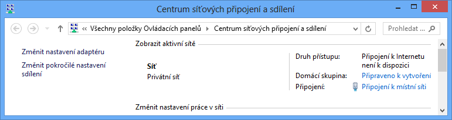
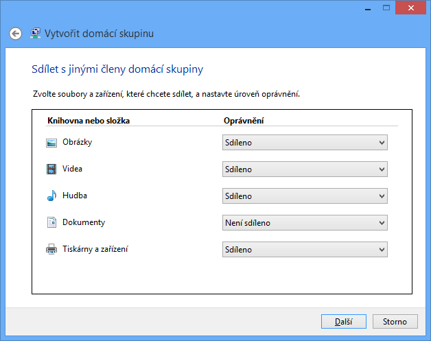
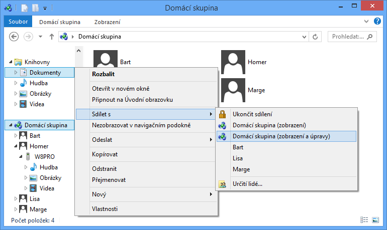

<!-- _class: title -->
<!-- _header: '' -->

# Desktop systémy Microsoft Windows

## IW1

Jan Pluskal\
pluskal@vut.cz

Fakulta informačních technologií\
Vysoké učení technické v Brně\
Božetěchova 2, 612 66 Brno

---

<!-- _class: section -->

# Sdílení a zabezpečení prostředků

<!-- header: 'Desktop systémy Microsoft Windows Sdílení a zabezpečení prostředků' -->

<!-- Obsahově celkem rozsáhlé téma, zde osekané, hlavně z pohledu různých nastavení v zásadách skupiny, jenž se vážou ke sdílení a zabezpečení prostředků. -->

---

# Sdílení prostředků

- Domácí skupiny (obsolentní)
- Sdílení souborů
  - Sdílené adresáře
  - Knihovny
- Sdílení tiskáren
- Soubory offline

---

# Povolení sdílení prostředků

- Na úrovni síťových profilů (v části pokročilých nastavení sdílení)
  - Povolit Sdílení souborů a tiskáren
- Na úrovni síťových rozhraní (ve vlastnostech jednotlivých síťových rozhraní)
  - Povolit Sdílení souborů a tiskáren v síti Microsoft
  - Povolit Klient sítě Microsoft

<!-- Sdílení souborů a tiskáren je ve výchozím nastavení povoleno pro domácí sítě a zakázáno pro veřejné sítě.
Sdílení prostředků lze omezit i pomocí pravidel brány Firewall (protokol SMB, TCP port 445, UDP porty 137 – 139 apod.). -->

---

# Nastavení sdílení pro profil a adaptér

---

# Domácí skupiny (HomeGroups)

<!-- REVIEW: HomeGroup byly odstraněny ve Windows 10 v. 1803 a ve Windows 11 neexistují – rozhodnout, zda slidy o domácích skupinách (6–9) ponechat jako historii, nebo je vypustit. -->

- Umožňují jednoduché sdílení souborů a tiskáren v systémech Windows 7 až Windows 10 v. 1709
  - Povolení vyžaduje oprávnění správce
  - Co sdílet si volí jednotliví uživatelé
- Dostupné pouze v privátní síti

<!-- Ve Windows 8 šlo domácí skupinu vytvořit a nastavit také přes Modern UI (sekce pod PC Settings).

After you update your PC to Windows 10 (Version 1803):
HomeGroup won’t appear in File Explorer.
HomeGroup won’t appear in Control Panel, which means that you can’t create, join, or leave a homegroup.
HomeGroup won’t appear on the Troubleshoot screen when you go to Settings > Update & Security > Troubleshoot.
You won’t be able to share new files and printers using HomeGroup.

The HomeGroup (view) and HomeGroup (view and edit) options still appear in Windows 10 (Version 1803 or later) when you right-click a folder in File Explorer, and then point to Give access to. However, neither option will do anything. To share a file or folder, select Specific people from the same shortcut menu instead. -->

---

# Vytvoření domácí skupiny

---

# Připojení a přístup k domácí skupině

- Připojení k domácí skupině
  - Přes Centrum síťových připojení a sdílení
  - Pro připojení je vyžadováno sdílené heslo
- Přístup k domácí skupině
  - Přes průzkumníka Windows (samostatný uzel)
  - Rozlišovány na základě uživatele a počítače
  - Dostupné vždy když běží daný počítač (i pokud není přihlášen konkrétní uživatel)
  - K přístupu lze použít vlastní nebo sdílený účet

---

# Sdílení adresářů v domácí skupině

<!-- Ve Windows 10 v 1803+ položky Domácí skupina stále je, ale nic nedělá. -->

---

# Sdílené adresáře (Shared Folders)

- Povolení a nastavení ve vlastnostech adresáře (záložka sdílení)
- 2 typy sdílení
  - Jednoduché (simple) sdílení
  - Pokročilé (advanced) sdílení

<!-- Pro nastavení jednoduchého sdílení je potřeba povolit Používat průvodce sdílením (Doporučeno) v Možnostech složky v Ovládacích panelech, jinak bude tlačítko Sdílení… zašedlé. -->

---

# Jednoduché sdílení adresářů

- Rozlišuje 3 typy oprávnění (nastavuje vlastník)
  - Čtení (zahrnuje i spouštění)
  - Čtení/zápis (zahrnuje i úpravy a mazání)
  - Vlastník (nelze nastavit, přiřazeno automaticky účtu uživatele, jenž daný adresář nasdílel)
- Oprávnění lze nastavovat pouze
  - Lokálním uživatelům
  - Lokálním skupinám Everyone a Domácí skupina
  - Doménovým skupinám a uživatelům

<!-- Pokud nemá uživatel přiřazeno žádné oprávnění, nemůže vůbec přistupovat k danému sdílení.
Při použití jednoduchého sdílení se při nastavení oprávnění pro sdílení nastaví automaticky také odpovídající NTFS oprávnění u sdíleného adresáře. Při následném odebrání oprávnění pro sdílení se ovšem automaticky nastavená NTFS oprávnění neodeberou a zůstanou i nadále v platnosti. Automatické nastavení NTFS oprávnění také často ruší dědění NTFS oprávnění. -->

---

# Nastavení jednoduchého sdílení

---

# Pokročilé sdílení adresářů

- Rozlišuje 3 typy oprávnění
  - Číst (zahrnuje i spouštění)
  - Změnit (čtení + zápis, úpravy a mazání)
  - Úplné řízení (možnost nastavovat oprávnění)
- Oprávnění lze nastavovat
  - Lokálním i doménovým uživatelům a skupinám
- Možnost limitování počtu připojených uživatelů
  - Maximum uživatelů je 20 (omezení Windows 8/10/11)
- Podpora souborů offline (offline files)

<!-- K počítači, na kterém běží Windows 8/10, může být připojeno maximálně 20 uživatelů současně (dříve bylo 10). Při vytváření sdílení je automaticky nastaveno toto maximum jako výchozí limit. K počítačům, na kterých běží Windows Server, se může připojit maximálně 2^24 uživatelů, což lze pokládat za neomezený počet. -->

---

# Nastavení pokročilého sdílení

<!-- Možnost specifikovat název sdílené složky je důležitá pro vytváření skrytých sdílení.
V mezipaměti se nastavují soubory offline (offline files). -->

---

# Skryté sdílené adresáře

- Název ukončen znakem `$` (např. `C$`)
- Nejsou viditelné při prohledávání sítě
  - Jsou přístupné pomocí UNC cesty
- UNC (Uniform Naming Convention) cesta
  - Popis umístění sdíleného prostředku na síti
  - Obecný tvar `\\<server>\<sdílení>\<prostředek>`
    - Prostředkem může být např. adresář, soubor nebo tiskárna

<!-- Při procházení PowerShellem jsou vidět -->

---

# Speciální sdílené adresáře

- Vytvářeny automaticky systémem Windows
  - Vždy skryté
  - Přístupné pouze uživatelům s oprávněními správce
- `ADMIN$`
  - Sdílení kořenového adresáře systému Windows
- `IPC$` (Inter Process Communication)
  - Sdílení souborů mezi počítači při komunikaci procesů
- `<jednotka>$` pro každý připojený oddíl disku
  - Sdílení kořenového adresáře oddílu disku

<!-- Od Windows Vista nejsou administrativní sdílení (ADMIN$, <jednotka>$) standardně přístupná, jelikož správci počítače se přes síť kvůli UAC připojí s jen oprávněními standardního uživatele. Aby se připojili s oprávněními správce, musí se v registru nastavit LocalAccountTokenFilterPolicy na hodnotu 1. -->

---

# Správa pomocí MMC konzole

<!-- REVIEW: ve Windows 11 se sekce Ovládacích panelů jmenuje „Nástroje Windows" (dříve Nástroje pro správu) – upravit název. -->

- Spuštění příkazem `compmgmt.msc` nebo přes Ovládací panely (sekce Nástroje pro správu)

<!-- Lze násilně ukončit relaci (připojení ke sdílení) konkrétního uživatele, ale ten se může ihned připojit zpátky, pokud k tomu stále má dostatečná oprávnění. -->

---

# Správa pomocí příkazové řádky

- Vypsání seznamu sdílených adresářů na počítači
  - `net share`
- Vypsání informací o sdíleném adresáři
  - `net share <název>`
- Vytvoření nového sdíleného adresáře
  - `net share <název>=<cesta-k-adresáři> [/users:<limit> | /unlimited] [/grant:<uživatel>,{read|change|full}]`
    - Název sdílení musí být unikátní v rámci počítače
    - Limit pro počet připojených uživatelů nesmí být 0

<!-- Přepínač /unlimited nastaví limit na maximum pro danou verzi systému Windows. Při specifikaci limitu přesahujícího maximum pro danou verzi systému Windows bude nastaveno jen maximum namísto zadaného limitu.
Pokud je nastavený limit roven maximu pro danou verzi systému Windows, vypisuje net share namísto limitu text Bez omezení, což je dosti zavádějící, jelikož limit pořád existuje (a u desktopových Windows je dosti omezující). -->

---

# Knihovny (Libraries)

- Virtuální adresáře zahrnující jiné adresáře
  - Tvořeny odkazy na (lokální nebo síťové) adresáře
  - Fyzicky XML soubory s příponou `.library-ms`
- Přístup a správa pomocí průzkumníka Windows
  - Definice obsažených adresářů (a výchozího adresáře pro ukládání dat) ve vlastnostech dané knihovny
- Možnost optimalizace pro konkrétní typy dat
- Možnost sdílení (normálně nebo v rámci domácí skupiny)

---

# Přístup ke knihovnám a jejich správa

<!-- Ve Windows 10 není sekce Knihovny ve výchozím nastavení viditelná, musí se povolit v zobrazení -> Navigační podokno -> Zobrazit knihovny. -->

---

# Sdílení tiskáren

- Nastavení ve vlastnostech tiskárny
- 3 základní typy oprávnění
  - Tisk (a správa vlastních dokumentů v tiskové frontě)
  - Správa této tiskárny (změna nastavení a oprávnění tiskárny, sdílení tiskárny, pozastavení tiskárny, …)
  - Správa dokumentů (správa veškerých dokumentů v tiskové frontě)
- Možnost dodat ovladače pro starší systémy
  - Automatické stažení a instalace při přidání tiskárny

<!-- Ovladač samotný nemusí někdy postačovat pro správné fungování tiskárny, může být potřeba např. speciální tiskový procesor (např. pro GDI tiskárny), jenž není nainstalován s ovladačem. -->

---

# Soubory offline (Offline Files)

- Umožňují přistupovat k souborům v síti i bez připojení k této síti
  - Kešování souborů na lokálním počítači
  - Synchronizace souborů při opětovném připojení
- K dispozici pouze u edicí Pro a Enterprise
- Možnost šifrování dat ve vyrovnávací paměti

<!-- Soubory offline lze také použít např. pro urychlení spouštění programů ze síťového umístění, kdy bude velká část potřebných souborů daného programu již nakešována lokálně. -->

---

# Povolení a nastavení souborů offline

- Povolení souborů offline v Centru synchronizace
- Výběr souborů, jenž budou k dispozici offline
  - Manuálně pomocí průzkumníka Windows
    - Musí být podporovány (resp. povoleny) na úrovni adresáře v rozšířených možnostech sdílení
  - Automaticky povolením na úrovni adresáře
  - Centrálně pomocí zásad skupiny
- Vyloučení jednotlivých typů souborů
  - Centrálně pomocí zásad skupiny

<!-- Vyloučení se týká pouze typů souborů (např. *.avi), ne konkrétních vybraných souborů. -->

---

# Globální povolení souborů offline

---

# Povolení na úrovni sdíleného adresáře

---

# Režimy souborů offline (1)

- Online režim
  - Čtení z vyrovnávací paměti (cache), zápis do sdílení
  - Synchronizace prováděna automaticky
- Automatický offline režim
  - Čtení a zápis do vyrovnávací paměti (cache)
  - Ověřování připojení do sítě co 2 minuty

---

# Režimy souborů offline (2)

- Manuální offline režim
  - Čtení a zápis do vyrovnávací paměti (cache)
  - Ověřování neprobíhá
  - Zapnutí / vypnutí v průzkumníku Windows
- Režim pomalé linky (slow-link)
  - Čtení a zápis do vyrovnávací paměti (cache)
  - Povolen automaticky při pomalém připojení do sítě (práh lze nastavit v zásadách skupiny)
  - Pouze manuální synchronizace
    - od Windows 8 každých 6 hodin

<!-- Výchozí prahová hodnota pro pomalou linku je 64 000 b/s.
Od Windows 8 se u režimu pomalé linky provádí synchronizace, ve výchozím nastavení co 6 hodin (lze změnit v zásadách skupiny). -->

---

# Režimy souborů offline (3)

- Režim vždy offline (Always offline)
  - Varianta režimu pomalé linky
  - Pouze v doméně Active Directory
  - Pomocí zásad skupin zajistíme vynucení práce offline i při dobré konektivitě
    - zásada Configure slow-link mode a použití Latency=1
  - Synchronizace každé 2 hodiny

<!-- Ve Windows 8 je k dispozici také Always Offline režim, jenž vynucuje práci v offline režimu i pokud má počítač dobrou konektivitu do sítě. Tento režim se zapíná nastavením zásady Configure slow-link mode a použitím Latency=1 u výběru adresáře, pro který má být tento režim zapnut. Synchronizace v tomto režimu probíhá ve výchozím nastavení co 120 minut (lze změnit nastavením zásady Configure Background Sync). Počítač musí být v doméně Active Directory! -->

---

# Synchronizace

- Probíhá automaticky nebo manuálně
- Řešení konfliktů při synchronizaci
  - Ponechání lokální verze (přepsání verze ve sdílení)
  - Ponechání verze ve sdílení (přepsání lokální verze)
  - Ponechání obou verzí (přejmenování lokální verze)
- Cost-aware synchronizace
  - Přepnutí do offline režimu při latenci vyšší než 35 ms a blížícímu se datovém limitu sítě
  - Jen v doméně

<!-- Od Windows 8 je k dispozici také Cost-aware synchronizace, jenž vynutí přepnutí do offline režimu (a vypne synchronizaci na pozadí), pokud počítač přesáhl nebo se blíží limitu pro přenos dat (např. ve 4G síti). Uživatel může pořád provést synchronizaci manuálně. Tato forma synchronizace se zapíná nastavením zásady Enable file synchronization on costed networks. Windows rozpoznává sítě s limitem pro přenos dat na základě jejich zpoždění (latency), pokud je zpoždění větší než 35 milisekund, bude síť pokládána za síť s limitem pro přenos dat. Počítač musí být v doméně Active Directory! -->

---

# Řešení konfliktů při synchronizaci

<!-- Neprobíraly se veřejné adresáře (public folders) a transparentní kešování (transparency caching).
Veřejné adresáře jsou přístupné (čtení i zápis) pro všechny uživatele na daném počítači a povolují se v pokročilých možnostech sdílení, lze je také nasdílet.
Transparentní kešování je něco na způsob online režimu souborů offline, kdy kešujeme soubory na síti, se kterými pracujeme, a upřednostňujeme práci s kešovanými lokálními kopiemi před prácí s originálními soubory na síti (už bylo asi i ve Vistách, v XP asi ne). Mělo by být k dispozici i v Home edicích Windows 7 a standardní edici Windows 8, kde nejsou k dispozici soubory offline. -->

---

# Zabezpečení prostředků

- Oprávnění
  - Sdílení
  - Tiskáren
  - Souborového systému NTFS
- Šifrování
  - EFS (Encrypted File System)
  - BitLocker

---

# NTFS oprávnění

- Zabezpečení na úrovni přístupů k datům
- Lze nastavovat lokálním i doménovým skupinám a uživatelům (a předdefinovaným skupinám)
  - Předdefinované skupiny Everyone a Creator Owner
    - Zahrnují všechny uživatele, resp. uživatele, jenž vlastní daný adresář nebo soubor (v době definice oprávnění)
- Nelze použít u souborových systémů FAT a FAT32
- Ověřovány i při přístupu ze sítě
- Uloženy v ACL seznamech (Access Control Lists)

<!-- Předdefinované skupiny jsou přesněji předdefinované objekty zabezpečení, ovšem u desktop systémů jsou všechny tyto objekty skupiny.
U systémů Windows se ACL seznamy obsahující NTFS oprávnění označují jako DACL seznamy (Discretionary Access Control Lists).
ACL seznamy lze najít i u UNIXových systémů (existuje norma).
ACL seznamy se skládají z ACE záznamů (Access Control Entries), jenž obsahují informace o oprávněních konkrétního uživatele nebo skupiny.
Oprávnění pro skupinu Creator Owner zůstávají jen u adresářů, u souborů je tato skupina nyní nahrazována účtem aktuálního vlastníka. -->

---

<!-- _class: dense -->

# Základní (skupiny) NTFS oprávnění

| Oprávnění | Prostředek | Popis |
| --- | --- | --- |
| Úplné řízení | Adresář | Zobrazení a přístup k obsahu, vytváření souborů a adresářů, změny oprávnění, odstraňování souborů a adresářů |
|  | Soubor | Čtení, zápis, úpravy a odstraňování, změny oprávnění |
| Měnit | Adresář | Zobrazení a přístup k obsahu, vytváření souborů a adresářů |
|  | Soubor | Čtení, zápis, úpravy a odstraňování |
| Číst a spouštět | Adresář | Přístup k obsahu (ne jeho zobrazení) a jeho spouštění |
|  | Soubor | Přístup k souboru a jeho spouštění |
| Zobrazovat obsah složky | Adresář | Zobrazení obsahu |
| Číst | Adresář | Přístup k obsahu (ne jeho zobrazení) |
|  | Soubor | Přístup k souboru |
| Zapisovat | Adresář | Vytváření souborů a adresářů (ne jejich odstraňování) |
|  | Soubor | Zápis a úpravy (ne odstraňování) |

<!-- I s oprávněním měnit pro adresář můžeme obvykle mazat soubory (a podadresáře) v tomto adresáři, jelikož tyto soubory a adresáře typicky dědí oprávnění od otcovského adresáře a tímto získáme oprávnění dědit i pro daný soubor (podadresář). -->

---

# Nastavení a změny NTFS oprávnění

- Ve vlastnostech souboru nebo adresáře (záložka Zabezpečení), případně přes příkazovou řádku
- Oprávnění může nastavovat nebo měnit
  - Uživatel nebo skupina, jenž má přiděleno oprávnění Měnit oprávnění (zahrnuto ve skupině Úplné řízení)
  - Vlastník souboru nebo adresáře
    - Ve výchozím nastavení uživatel, jenž vytvořil daný soubor nebo adresář
    - Může být kdykoliv nahrazen jiným uživatelem, jenž má oprávnění Přebírat vlastnictví (správci počítače mohou přebírat vlastnictví i bez tohoto oprávnění)

---

# Dědičnost NTFS oprávnění

- Nově vytvářené soubory a adresáře dědí NTFS oprávnění adresáře, ve kterém byly vytvořeny
  - Zděděná oprávnění mají nižší prioritu než explicitní
- Lze zakázat ve vlastnostech souboru/adresáře
  - Zkopírování / odstranění zděděných NTFS oprávnění
- Lze vynutit dědičnost na podřízených souborech a adresářích (child objects)
  - Přepsání NTFS oprávnění u podřízených objektů
    - Uživatel musí být schopen měnit oprávnění

---

# Výpočet výsledných NTFS oprávnění

- Každé oprávnění lze povolit nebo odepřít
  - Odepření má vždy vyšší prioritu (přepisuje povolení)
- Obecný algoritmus
  1. Vytvoř prázdnou množinu oprávnění S
  2. Přidej do S zděděná oprávnění, která jsou povolená pro daného uživatele nebo skupinu, jenž je členem
  3. Odeber z S zděděná oprávnění, která jsou odepřená pro daného uživatele nebo skupinu, jenž je členem
  4. Opakuj body 2) a 3) pro explicitní oprávnění
  5. Vrať oprávnění obsažená v množině S

---

# Příklad s povolením (allow) oprávnění

- Uživatel je členem skupin A a B

| Oprávnění skupiny A |  |
| --- | --- |
| Povolit | Číst a spouštět |
| Povolit | Číst |

| Oprávnění skupiny B |  |
| --- | --- |
| Povolit | Číst |
| Povolit | Zapisovat |

**Sjednocení**

| Výsledná oprávnění |
| --- |
| Číst a spouštět |
| Číst |
| Zapisovat |

---

# Příklad s odepřením (deny) oprávnění

- Uživatel je členem skupin A a B

| Oprávnění skupiny A |  |
| --- | --- |
| Povolit | Číst a spouštět |
| Povolit | Číst |

| Oprávnění skupiny B |  |
| --- | --- |
| Povolit | Číst |
| Povolit | Zapisovat |

**Sjednocení**

| Oprávnění |
| --- |
| Číst a spouštět |
| Číst |
| Zapisovat |

| Oprávnění uživatele |  |
| --- | --- |
| Odepřít | Číst |

**Rozdíl**

| Výsledná oprávnění |
| --- |
| Spouštět |
| Zapisovat |

---

# Příklad se zděděnými oprávněními

- Uživatel je členem skupin A a B

**Zděděno**

| Oprávnění skupiny A |  |
| --- | --- |
| Povolit | Číst |
| Povolit | Zapisovat |

| Oprávnění uživatele |  |
| --- | --- |
| Odepřít | Číst |

**Rozdíl**

| Oprávnění |
| --- |
| Zapisovat |

| Oprávnění skupiny B |  |
| --- | --- |
| Povolit | Číst |

**Sjednocení**

| Výsledná oprávnění |
| --- |
| Číst |
| Zapisovat |

---

# Zjištění výsledných NTFS oprávnění

---

<!-- _class: dense -->

# Kopírování a přesun

**Standardní chování**

|  | V rámci stejného oddílu | Mezi různými oddíly | Na oddíl FAT/FAT32 |
| --- | --- | --- | --- |
| Přesun | Zachovává oprávnění | Dědí oprávnění od cílového adresáře | Nezachovává oprávnění |
| Kopírování | Dědí oprávnění od cílového adresáře | Dědí oprávnění od cílového adresáře | Nezachovává oprávnění |

**Při použití nástroje robocopy**

|  | V rámci stejného oddílu | Mezi různými oddíly | Na oddíl FAT/FAT32 |
| --- | --- | --- | --- |
| Přesun | Zachovává oprávnění | Zachovává oprávnění | Nezachovává oprávnění |
| Kopírování | Zachovává oprávnění | Zachovává oprávnění | Nezachovává oprávnění |

---

# Správa pomocí příkazové řádky

- Výpis NTFS oprávnění
  - `icacls <soubor/adresář>`
- Změna NTFS oprávnění
  - Povolení
    - `icacls <soubor/adresář> /grant <uživatel>:<oprávnění>`
  - Odepření
    - `icacls <soubor/adresář> /deny <uživatel>:<oprávnění>`
  - Oprávnění mohou být jak skupiny, tak konkrétní NTFS oprávnění (odděleny čárkami a uvedeny v závorce)

<!-- Pro správu lze také využít PowerShell a jeho cmdlety Get-Acl a Set-Acl, jenž zpřístupňují resp. nastavují objekty reprezentující ACL seznamy a jejich položky.
Uživatele lze specifikovat pomocí názvu nebo SID jeho uživatelského účtu. -->

---

# Výpočet oprávnění při přístupu ze sítě

- Ověřují se oprávnění sdílení i NTFS oprávnění
- Obecný algoritmus
  1. Vypočti množinu výsledných oprávnění sdílení
  2. Vypočti množinu výsledných NTFS oprávnění
  3. Vrať oprávnění obsažená v obou množinách

---

# Příklad s oprávněními sdílení (share)

- Uživatel je členem skupin A a B

| Oprávnění skupiny A |  |
| --- | --- |
| Povolit | Číst a spouštět |
| Povolit | Číst |

| Oprávnění skupiny B |  |
| --- | --- |
| Povolit | Číst |
| Povolit | Zapisovat |

**Sjednocení**

| Oprávnění |
| --- |
| Číst a spouštět |
| Číst |
| Zapisovat |

| Oprávnění sdílení |  |
| --- | --- |
| Povolit | Číst |

**Průnik**

| Výsledná oprávnění |
| --- |
| Číst a spouštět |
| Číst |

<!-- Číst u oprávnění sdílení umožňuje i spouštět. -->

---

# Auditování přístupu k prostředkům

- Monitorování přístupu k souborům a adresářům
  - Uložení informací o přístupech v protokolu událostí (protokol Zabezpečení)
- Povolení v zásadách skupiny
  - Zásada Auditovat přístup k objektům
    - Od Windows Vista lze povolovat auditování jednotlivých typů objektů (musí se explicitně povolit)
  - Lze monitorovat úspěšné a/nebo neúspěšné pokusy
  - Pouze umožňuje monitorovat přístup k souborům a adresářům (nespouští monitorování)

<!-- Ve Windows 8/10 obsahují události generované při přístupu k souborům dodatečné informace jako např. atributy souboru, ke kterým uživatel přistupoval. -->

---

# Nastavení auditování

- Nastavení ve vlastnostech jednotlivých souborů a adresářů (spuštění monitorování)
  - Výběr oprávnění, jejichž aplikace (čtení, zápis, apod.) má být monitorována a zaznamenána
  - Výběr uživatelů a skupin, kteří mají být monitorováni (pro monitorování všech uživatelů a skupin lze použít skupinu Everyone)

---

# Výběr monitorovaných oprávnění

---

# EFS (Encrypted File System)

- Pouze u edicí Pro a Enterprise
- Šifrování jednotlivých souborů
  - Zabezpečení na úrovni dat
  - Šifrování na úrovni uživatele
  - Nelze šifrovat systémové soubory
- Služba souborového systému NTFS
  - Nelze použít u souborových systémů FAT ani FAT32
- Transparentní uživateli
  - Práce s šifrovanými soubory stejná jako s normálními

---

# Šifrování obsahu souborů (a složek)

---

# Šifrování

- Založeno na hybridní kryptografii
  - Data šifrována (a dešifrována) sdíleným klíčem (FEK, File Encryption Key) pomocí symetrické kryptografie
  - FEK klíč šifrován veřejným (a dešifrován privátním) klíčem uživatele pomocí asymetrické kryptografie
- Výhody hybridní kryptografie
  - Rychlé šifrování dat (symetrická kryptografie)
  - Bezpečné sdílení FEK klíče (asymetrická kryptografie)
  - Jednoduchá (a také efektivní) realizace přístupu více uživatelů k šifrovaným souborům

---

# Klíče

- FEK klíč (File Encryption Key)
  - Unikátní pro každý šifrovaný soubor
  - Generován při šifrování souboru prvním uživatelem
- Veřejný klíč (public key)
  - Uložen ve formě certifikátu v úložišti certifikátů
  - K dispozici všem uživatelům
- Privátní klíč (private key)
  - Uložen ve formě certifikátu v úložišti certifikátů
  - K dispozici pouze danému uživateli

<!-- Veřejné klíče jsou distribuovány v rámci Active Directory všem uživatelům v doméně. -->

---

# Šifrování souboru prvním uživatelem

<!-- REVIEW: původně blokové schéma se šipkami (Data, FEK, klíče); zde převedeno na tabulku kroků – zvážit překreslení jako diagram. -->

| Vstup | Operace | Klíč | Výstup |
| --- | --- | --- | --- |
| — | Generování | — | FEK |
| Data | Šifrování | FEK | Šifrovaná data |
| FEK | Šifrování | Veřejný klíč uživatele | FEK šifrovaný daným uživatelem |

---

# Šifrování souboru dalším uživatelem

<!-- REVIEW: původně blokové schéma se šipkami; zde převedeno na tabulku kroků – zvážit překreslení jako diagram. -->

| Vstup | Operace | Klíč | Výstup |
| --- | --- | --- | --- |
| FEK šifrovaný prvním uživatelem | Dešifrování | Privátní klíč prvního uživatele | FEK |
| FEK | Šifrování | Veřejný klíč dalšího uživatele | FEK šifrovaný dalším uživatelem |
| Šifrovaná data | (beze změny) | — | Šifrovaná data |

---

# Dešifrování souboru uživatelem

<!-- REVIEW: původně blokové schéma se šipkami; zde převedeno na tabulku kroků – zvážit překreslení jako diagram. -->

| Vstup | Operace | Klíč | Výstup |
| --- | --- | --- | --- |
| FEK šifrovaný daným uživatelem | Dešifrování | Privátní klíč uživatele | FEK |
| Šifrovaná data | Dešifrování | FEK | Data |
| FEK šifrovaný jiným uživatelem | (nepoužit) | — | — |

---

# Agent obnovení (RA, Recovery Agent)

- Umí dešifrovat jakákoliv data zašifrovaná pomocí EFS v době po jeho vytvoření
  - Při šifrování je FEK klíč (navíc) automaticky zašifrován pomocí veřejného klíče agenta obnovení
    - Zašifrování dříve vytvořených FEK klíčů pomocí `cipher /u`
- Vytvoření agenta obnovení
  - Vygenerování veřejného a privátního klíče agenta obnovení (certifikátu) pomocí `cipher /r:<název>`
  - Vytvoření agenta obnovení (RA) v zásadách skupiny importováním certifikátu obsahujícího veřejný klíč

<!-- Příkaz cipher /r vygeneruje 2 certifikáty – soubor .cer obsahující veřejný klíč a soubor .pfx obsahující veřejný a privátní klíč. -->

---

# Vytvoření agenta obnovení

---

# BitLocker

<!-- REVIEW: Windows 11 Home má „šifrování zařízení" (od 24H2 zapnuté automaticky při čisté instalaci s účtem Microsoft) – rozhodnout, zda „pouze Pro a Enterprise" doplnit o tuto výjimku. -->

- Pouze u edicí Pro a Enterprise
- Šifrování celých oddílů disků
  - Zabezpečení na úrovni dat
  - Šifrování na úrovni počítače
  - Lze šifrovat i systémový oddíl (systémové soubory)
- Chrání integritu operačního systému
  - Nemožnost externí modifikace systémových souborů
- Pro šifrování a dešifrování se používá sdílený klíč (FVEK, Full Volume Encryption Key)

<!-- Klíčů pro šifrování a dešifrování dat u BitLockeru je obecně více, FVEK je pouze jeden z nich.
BitLocker vyžaduje pro svou funkcionalitu (šifrování systémového oddílu) disk s alespoň dvěma oddíly disku:
 Oddíl se soubory operačního systému (NTFS, šifrován)
 Oddíl se soubory nutnými pro start operačního systému jakmile firmware připraví potřebný hardware (FAT32 pro UEFI-based firmware / NTFS pro BIOS firmware, nešifrován, alespoň 100MB místa, doporučeno 350MB). Často vytvářen automaticky a pojmenován System Reserved.
Od Windows 8 lze šifrovat jen části oddílu disku, kde jsou uložena nějaká data, dříve se šifroval celý oddíl disku (včetně částí obsahujících volné místo).
Od Windows 8 lze oddíl disku zašifrovat ještě před samotnou instalací systému, kdy se BitLocker povolí z WinPE po vytvoření daného oddílu disku. Tento oddíl je šifrován náhodně vygenerovaným heslem, jenž by mělo být změněno po dokončení instalace (ovládací panel BitLockeru na to upozorňuje žlutým vykřičníkem).
BitLocker ve Windows 8 podporuje tzv. Encrypted Hard Drives, kde šifrování dat zajišťuje samotný ovladač disku (urychluje čtení a zápis).
Ve Windows Server 2012 lze BitLocker také používat pro ochranu clusterů. -->

---

# Základní pojmy

- TPM (Trusted Platform Module)
  - Speciální čip (většinou na základní desce) pro uložení celého (nebo části) FVEK klíče
- PIN (Personal Identification Number)
  - Heslo ověřované při startu počítače
  - Uloženo v TPM čipu nebo na klíči pro start
- Klíč pro start (Startup key)
  - Zařízení USB obsahující soubor s celým (nebo částí) FVEK klíče (tzv. keying material)

<!-- Od Windows 8 mohou resetovat PIN (pro BitLocker) a heslo (pro BitLocker To Go) i standardní uživatelé, dříve bylo potřeba mít oprávnění správce.
Od Windows 8 lze přiřadit hesla potřebná pro dešifrování oddílů disků k účtům AD (uživatel, skupina a počítač), po úspěšné autentizaci do domény pak může daný účet (uživatel, počítač) automaticky dešifrovat oddíly disků, ke kterým má přiřazená hesla. -->

---

# BitLocker režimy

- Pouze TPM
- TPM + PIN
- TPM + Klíč pro start
- TPM + PIN + Klíč pro start
- BitLocker bez TPM

---

# Pouze TPM

- Klíč pro dešifrování dat je uložen na TPM čipu
  - Nejméně bezpečný režim (celý FVEK v TPM čipu)
- Plně transparentní uživateli
  - Dešifrování obsahu probíhá automaticky
- Chrání proti
  - Zpřístupnění dat při odcizení pevného disku
  - Změně nebo úpravám bootovacího prostředí
- Nechrání proti
  - Zpřístupnění dat při odcizení počítače

<!-- Útočník sice může data dešifrovat tím, že odcizený počítač spustí, ale zároveň dojde ke spuštění systému, který může dále data chránit např. pomocí NTFS oprávnění. -->

---

# TPM + PIN a/nebo klíč pro start

- Při použití TPM pouze s PINem
  - Uložení celého FVEK klíče i PINu v TPM čipu
- Při použití TPM s klíčem pro start a/nebo PINem
  - Uložení ½ FVEK klíče v TPM čipu a ½ na klíči pro start
  - Při použití PINu je PIN uložen na klíči pro start
- Chrání proti
  - Zpřístupnění dat při odcizení pevného disku
  - Zpřístupnění dat při odcizení počítače
  - Změně nebo úpravám bootovacího prostředí

<!-- Režim TPM + PIN + klíč pro start je k dispozici až od Windows Vista SP1 nebo Windows 7 a lze ho nastavit pouze pomocí nástroje manage-bde, nemůže být vybrán v průvodci nastavením technologie BitLocker.
Od Windows 8 lze namísto PINu použít také tzv. network key a přeskočit tak výzvu pro zadání PINu, což umožňuje provádět vzdálenou údržbu počítače bez nutnosti být u něj fyzicky přítomen a se zachováním dvoufaktorové autentizace. -->

---

# BitLocker bez TPM

- Celý FVEK klíč je uložen na klíči pro start
  - Klíč není nijak chráněn (žádné šifrování apod.)
- Chrání proti
  - Zpřístupnění dat při odcizení pevného disku
  - Zpřístupnění dat při odcizení počítače
- Nechrání proti
  - Změně nebo úpravám bootovacího prostředí

---

# Dešifrování oddílu (při použití TPM)

- Aktualizace PCR registrů TPM čipu
- Dešifrování (celého nebo ½) FVEK klíče pomocí klíče daného obsahem PCR registrů TPM čipu
  - Při jakékoliv změně bootovacího prostředí (procesu bootování) nebude možné FVEK klíč dešifrovat
- Doplnění 2. ½ FVEK klíče z klíče pro start
- Ověření PINu
- Dešifrování obsahu oddílu disku pomocí FVEK klíče

<!-- Obsah PCR registrů se mění podle dat z částí BIOSu, bootovacího sektoru, MBR, atd.
Při nastavování dual-boot je potřeba BitLocker vypnout, jelikož se mění informace pro bootování. -->

---

# Agent obnovení (Recovery Agent)

- Umí dešifrovat oddíly disku zašifrované pomocí technologie BitLocker
- Založen na certifikátech
  - Importování certifikátu s veřejným klíčem, jenž bude použit pro zašifrování FVEK klíče, v zásadách skupiny
  - Zašifrovaný FVEK klíč je uložen na šifrovaném oddíle
- Obnovení dat
  - `manage-bde.exe -unlock <oddíl> -Certificate -ct <otisk> [-PIN]`

<!-- U nesystémových oddílů se FVEK klíč ukládá na daném oddíle (v hlavičkách na začátku), u systémových oddílů MS neuvádí, kde je FVEK uložen.
BDE je zkratka BitLocker Drive Encryption. -->

---

# BitLocker To Go

<!-- REVIEW: Windows 7/8/10 jsou po konci podpory a BitLocker To Go Reader (XP/Vista) je mrtvý – zvážit zjednodušení výčtu edic/verzí na Windows 11. -->

- BitLocker umožňující šifrování oddílů USB disků
- Lze nastavit v edicích Pro a Enterprise
  - Číst a zapisovat lze ve všech edicích Windows 7/8/10/11
  - U předchozích verzí systému Windows lze pouze číst (vyžaduje BitLocker To Go Reader)
- Data chráněná heslem nebo čipovou kartou
  - Nepotřebuje TPM čip
- Možnost zakázat zápis na USB disky nechráněné technologií BitLocker
