<!-- _class: title -->
<!-- _header: '' -->

# Desktop systémy Microsoft Windows

## IW1

Jan Pluskal\
pluskal@vut.cz

Fakulta informačních technologií\
Vysoké učení technické v Brně\
Božetěchova 2, 612 66 Brno

---

<!-- _class: section -->

# Řízení uživatelských účtů (UAC)

<!-- header: 'Desktop systémy Microsoft Windows Řízení uživatelských účtů (UAC)' -->

---

<!-- _class: dense -->

# Řízení uživatelských účtů

- **UAC** (*User Account Control*), od Windows Vista – princip beze změny i ve Windows 11
- Umožňuje **zvyšování (elevaci) oprávnění**
- Zvyšuje **bezpečnost systému**
  - Explicitní souhlas / zadání pověření (*credentials*)
  - Malware nemůže tiše získat oprávnění správce
- **Ikona štítu** – graficky odlišuje úkony, které vyžadují zvýšení oprávnění
- **Tři úrovně nastavení**
  - **Základní**: Ovládací panely → Uživatelské účty → *Změnit nastavení nástroje Řízení uživatelských účtů*
  - **Pokročilé**: zásady skupiny (`gpedit.msc`, `secpol.msc`)
  - **Centrální**: Microsoft Intune (Settings catalog), CSP `LocalPoliciesSecurityOptions`

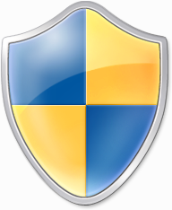

<!--
UAC není bezpečnostní hranice (security boundary) – v Microsoft Security Servicing Criteria for Windows je UAC uvedeno mezi funkcemi „defense-in-depth“ (kategorie User safety), správce je součástí TCB. Administrator protection (viz dále) to zpřísňuje, ale ani ono není podle Microsoftu formální hranicí.
Základní dialog lze spustit i přímo: UserAccountControlSettings.exe. Ve Windows 11 už není v Centru akcí (to zmizelo), ale pod Uživatelské účty; vyhledat lze i ze Start.
Zdroj: https://www.microsoft.com/en-us/msrc/windows-security-servicing-criteria
Zdroj: https://learn.microsoft.com/en-us/windows/security/application-security/application-control/user-account-control/how-it-works
Zdroj: https://learn.microsoft.com/en-us/windows/security/application-security/application-control/user-account-control/settings-and-configuration
-->

---

# Výzvy k zadání souhlasu a pověření

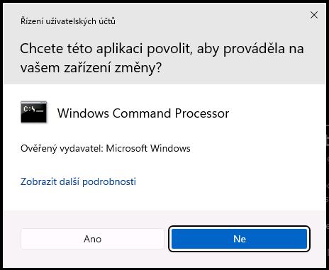

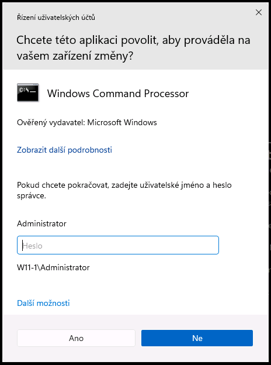

- **Windows 11**: „Chcete této aplikaci povolit, aby prováděla ve vašem zařízení změny?“
- **Barva záhlaví**: žlutá = neznámý (nepodepsaný) vydavatel; ověřený vydavatel včetně součástí Windows – modrá (Windows 10), neutrální (Windows 11 24H2)

<!--
Vlevo výzva k zadání souhlasu (consent prompt – správce v režimu schválení správce), vpravo výzva k zadání pověření (credential prompt – standardní uživatel). Snímky z Windows 11 24H2 (zachyceny na zabezpečené ploše přes konzoli Hyper-V): vlevo výzva k souhlasu pro účet root ve skupině Administrators, vpravo výzva k zadání pověření pro standardního uživatele bart – dialog nabídne účet správce a odkaz Další možnosti (jiný účet, PIN, Windows Hello, klíč zabezpečení). Vyvoláno spuštěním cmd.exe jako správce.
Windows nejprve zjistí vydavatele souboru: Windows, ověřený (podepsaný) vydavatel, neověřený (nepodepsaný) – podle toho obarví výzvu. Barvy: Vista/7 rozlišovaly modrozelenou (součást Windows), šedou (podepsaný vydavatel) a žlutou (nepodepsaný); Windows 10/11 mají jen modré záhlaví („Ověřený vydavatel“) a žluté („Vydavatel: neznámý“). Dokumentace UAC barvy už neuvádí; při pořizování snímků na 24H2 mělo záhlaví výzvy pro ověřeného vydavatele (Microsoft Windows) neutrální světlou barvu, nikoli modrou.
Zdroj: https://www.itechguides.com/user-account-control-in-windows-11-in-2026-settings-admin-prompts-and-fixes/
Zdroj: https://learn.microsoft.com/en-us/windows/security/application-security/application-control/user-account-control/how-it-works
-->

---

<!-- _class: dense -->

# Zvyšování (elevace) oprávnění

- Proces zpřístupnění **oprávnění správce** uživateli
- **Všichni přihlášení uživatelé** (včetně správců) běží s oprávněními standardního uživatele
- Vždy pouze pro **konkrétní úkon** (např. spuštění programu, změnu nastavení systému, …)
  - Oprávnění pro ostatní úkony musí být zvýšena zvlášť
  - Podřízené procesy dědí token rodiče (musí mít stejnou úroveň integrity)
- **Režim schválení správce** (*Admin Approval Mode*)
  - Správce musí explicitně potvrdit zvýšení oprávnění
  - Potvrzení formou souhlasu nebo zadání pověření
- **Úrovně integrity** (*integrity levels*): nízká (prohlížeč) → střední (uživatel) → vysoká (správce) → systém
  - Proces s nižší úrovní nemůže měnit data procesu s vyšší úrovní

<!--
Úrovně integrity jsou součást Mandatory Integrity Control (od Vista). Zobrazit lze např. v Process Explorer (sloupec Integrity) nebo whoami /groups (řádek Mandatory Label).
Zdroj: https://learn.microsoft.com/en-us/windows/security/application-security/application-control/user-account-control/how-it-works
-->

---

# Standardní uživatel

**Přihlášení** → Přístupový token s oprávněními standardního uživatele
→ Plocha (`explorer.exe`)

**Spuštění** → Zvýšení oprávnění (Zadání pověření správce)
→ Přístupový token s oprávněními správce (jiný uživatel)
→ Správa počítače (`compmgmt.msc`)

<!--
Standardní uživatel má jediný token. Výchozí výzva je credential prompt: zadá jméno a heslo (PIN, Windows Hello) účtu, který je členem Administrators – tzv. over-the-shoulder elevace. Elevovaný proces pak běží pod identitou toho správce, ne pod identitou přihlášeného uživatele (profil, HKCU, síťová pověření jsou správcova).
Tok odpovídá diagramu přihlášení v dokumentaci UAC.
Zdroj: https://learn.microsoft.com/en-us/windows/security/application-security/application-control/user-account-control/how-it-works
-->

---

# Správce v režimu schválení správce

**Přihlášení** → LSA vytvoří **dva** tokeny (rozdělený token, *split token*)\
→ filtrovaný token standardního uživatele → Plocha (`explorer.exe`)\
→ plný token správce (zatím nepoužit, čeká na elevaci)

**Spuštění** → Zvýšení oprávnění (Souhlas či zadání pověření)
→ Přístupový token s oprávněními správce (stejný uživatel)
→ Správa počítače (`compmgmt.msc`)

<!--
Filtrovaný token má odebrány administrátorské SID (Administrators je označeno „deny only") a privilegia. explorer.exe je rodič všech uživatelem spouštěných procesů, proto vše běží jako standardní uživatel, dokud uživatel neodsouhlasí elevaci. Po souhlasu se proces spustí s plným tokenem – identita i profil jsou stejné, jen s právy správce. Právě toto (plný token existuje po celou relaci) je slabina, kterou řeší Administrator protection na dalším snímku.
Zdroj: https://learn.microsoft.com/en-us/windows/security/application-security/application-control/user-account-control/how-it-works
-->

---

# Administrator protection (Windows 11 24H2 / 25H2)

**Přihlášení** → jediný token standardního uživatele (*deprivileged*)
→ Plocha (`explorer.exe`) – žádný plný token správce neexistuje

**Spuštění** → Ověření uživatele (Windows Hello: PIN, biometrie, heslo)
→ Systém použije **skrytý účet správce**, spravovaný systémem, s odděleným profilem
→ Izolovaný token správce „just-in-time“ → Správa počítače (`compmgmt.msc`)
→ **Zničení tokenu** po ukončení procesu

- **Žádné automatické elevace** – každou operaci správce potvrzuje interaktivně
- Cíl: **malware** běžící pod uživatelem nemůže manipulovat s elevovanou relací

<!--
Administrator protection nahrazuje split token: uživatel je celou dobu jen standardní uživatel, elevace probíhá pod jinou identitou (skrytý účet generovaný systémem, oddělený profil – v elevovaném procesu tedy není HKCU ani %USERPROFILE% uživatele, ani jeho SSO pověření a síťové disky). Elevace je auditovatelná: ETW události 15031 (Elevation Approved) a 15032 (Elevation Denied/Fail) providera Microsoft-Windows-LUA.
Microsoft sám uvádí (KB5120998), že ani Administrator protection není formální bezpečnostní hranicí, jen ztěžuje elevation-of-privilege útoky; Google Project Zero publikoval v lednu 2026 sérii obcházení, která Microsoft opravoval.
Zdroj: https://learn.microsoft.com/en-us/windows/security/application-security/application-control/administrator-protection/
Zdroj: https://support.microsoft.com/servicing/os/windows-11/2026/08/kb5120998-windows-11-24h2-25h2-update
-->

---

<!-- _class: dense -->

# Administrator protection – stav a nasazení (září 2026)

- Dostupnost: **Windows 11 24H2 a 25H2** – volitelná aktualizace KB5120998 (27. 8. 2026, buildy 26200.9278 / 26100.9278), obsah náhledu přechází do následných kumulativních aktualizací; edice Home, Pro, Enterprise, Education
  - Postupné nasazování (*gradual rollout*); poprvé vydáno v KB5067036 (28. 10. 2025), od 1. 12. 2025 Microsoftem dočasně vypnuto (kompatibilita aplikací)
  - Nepodporováno: Windows 365 Cloud PC, Azure Virtual Desktop, Windows Server (plánováno)
- Ve výchozím nastavení **vypnuto** – zapíná správce, po zapnutí nutný restart
  - **Zásady skupiny** (`secpol.msc`): Možnosti zabezpečení →
    „User Account Control: Configure type of Admin Approval Mode“ = *Admin Approval Mode with Administrator protection*
    a „User Account Control: Behavior of the elevation prompt for administrators running with Administrator protection“ (souhlas / pověření)
  - **Intune** (custom OMA-URI; Settings catalog zatím náhled) / CSP `LocalPoliciesSecurityOptions`: `UserAccountControl_TypeOfAdminApprovalMode`, `UserAccountControl_BehaviorOfTheElevationPromptForAdministratorProtection`
  - **Zabezpečení Windows** → Ochrana účtu → přepínač *Administrator protection* – zatím jen Windows Insider (náhled)
- **Známá omezení**: Hyper-V a WSL (nezapínat), naplánované úlohy „s nejvyššími oprávněními“ (použít SYSTEM / servisní účet), oddělený profil = jiná nastavení aplikací, síťové disky a SSO v elevované relaci nejsou, vzdálené přihlášení doménových správců bez elevace (samostatná zásada)

<!--
České názvy dvou nových zásad v gpedit nejsou v dokumentaci Microsoftu k dispozici (stránka settings-and-configuration je zatím anglicky, cs-cz verze se přesměruje); ověřit na Windows 11 25H2 v učebně před přednáškou. Laboratorní VM v E05 jsou en-us, studenti tedy vidí anglické názvy.
Historie: ohlášeno na Ignite 11/2024, testováno v Insider Canary od podzimu 2024; poprvé vydáno ve volitelné aktualizaci KB5067036 (28. 10. 2025), Google Project Zero (J. Forshaw) mezitím nahlásil 9 obcházení (všechna opravena v KB5067036 nebo následnými bulletiny; článek 26. 1. 2026). „As of 1st December 2025 the Administrator Protection feature has been disabled by Microsoft while an application compatibility issue is dealt with“ – nasazování obnoveno KB5120998 (buildy 26200.9278 / 26100.9278, „Preview“). KB5120998: „not classified as a formal security boundary“.
Obsah volitelné aktualizace přechází podle běžného cyklu do následující bezpečnostní aktualizace (KB5124008, 8. 9. 2026, buildy .9445); její stránka podpory ale Administrator protection výslovně nezmiňuje a údaj pochází jen z tisku (pureinfotech, 4sysops) – proto není na snímku.
Zdroj: https://learn.microsoft.com/en-us/windows/security/application-security/application-control/administrator-protection/
Zdroj: https://support.microsoft.com/servicing/os/windows-11/2026/08/kb5120998-windows-11-24h2-25h2-update
Zdroj: https://projectzero.google/2026/26/windows-administrator-protection.html
Zdroj: https://pureinfotech.com/kb5124008-windows-11-september-2026-update/
-->

---

# Zabezpečená plocha (Secure Desktop)

- Zabraňuje **modifikaci plochy** (obrazovky) v době, kdy je zobrazena výzva ke zvýšení oprávnění
  - Plocha je v této době nepřístupná (zobrazen ztmavený snímek), k zabezpečené ploše mají přístup jen procesy Windows
  - Nelze do ní vkládat obsah schránky (od Windows Server 2019 a odpovídajících klientů)
- Uživatel musí na výzvu reagovat v **časovém limitu**
  - Po jeho uplynutí je zvýšení oprávnění automaticky zamítnuto a zabezpečená plocha zrušena
- **Malware** může zabezpečenou plochu napodobit, ale při výzvě k souhlasu tím elevaci nezíská
  - Při výzvě k zadání pověření může napodobenina sbírat hesla → i proto Windows Hello

<!--
Zabezpečená plocha také znemožňuje ovládat vstupně-výstupní zařízení, nelze tedy programově najet kurzorem myší na Ano a stisknout ho.
Původní deck uváděl limit 150 sekund (údaj z dokumentace Windows Vista). Aktuální dokumentace UAC žádnou konkrétní hodnotu neuvádí; v praxi je výzva po cca 2 minutách zamítnuta (Administrator protection loguje „timeout" jako událost 15032). Číslo proto na snímku není – neověřeno pro Windows 11.
Zdroj: https://learn.microsoft.com/en-us/windows/security/application-security/application-control/user-account-control/how-it-works
-->

---

# Základní nastavení

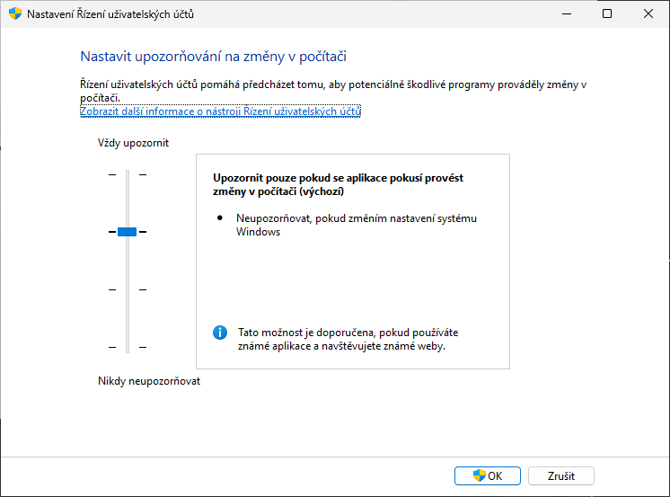

- Ovládací panely → Uživatelské účty → *Změnit nastavení nástroje Řízení uživatelských účtů* (`UserAccountControlSettings.exe`)

<!--
Snímek z Windows 11 24H2 (starý Win32 dialog, nemá náhradu v Nastavení). Posuvník mění hodnoty ConsentPromptBehaviorAdmin a PromptOnSecureDesktop v HKLM\SOFTWARE\Microsoft\Windows\CurrentVersion\Policies\System; EnableLUA od Windows 8 nemění (nejnižší úroveň nastavovala EnableLUA=0 jen ve Windows 7). Ověřit na W11-1: reg query HKLM\SOFTWARE\Microsoft\Windows\CurrentVersion\Policies\System /v EnableLUA po posunutí posuvníku dolů.
Zdroj: https://woshub.com/user-account-control-slider-and-group-policy-settings/
Zdroj: https://learn.microsoft.com/en-us/windows/security/application-security/application-control/user-account-control/settings-and-configuration
-->

---

# Možnosti základního nastavení

- **Vždy upozorňovat**
- Upozorňovat pouze pokud se programy pokusí provést změny v počítači (**výchozí**)
  - Povolit provádění změn v systému Windows nástroji pocházejícími ze systému Windows (jsou podepsány)
- Upozorňovat pouze pokud se programy pokusí provést změny v počítači (**nestmívat plochu**)
- **Nikdy neupozorňovat**
  - Povolovat pro správce resp. zamítat pro standardního uživatele všechny žádosti o zvýšení oprávnění
  - Zabezpečení Windows hlásí sníženou úroveň zabezpečení; UAC (`EnableLUA`) zůstává zapnuto, jen bez výzev

<!--
Povolení provádění změn v systému Windows nástroji pocházejícími ze systému Windows (2. nastavení) snižuje počet oken (výzev) o cca 2/3, jelikož většina úkolů, jež vyžaduje elevaci oprávnění, se týká změn nastavení systému Windows.
Odpovídající hodnoty registru (ConsentPromptBehaviorAdmin / PromptOnSecureDesktop): 2/1, 5/1, 5/0, 0/0. Od Windows 8 nejnižší úroveň EnableLUA nemění (zůstává 1): elevace se jen tiše schvalují, restart není nutný a aplikace z Microsoft Store fungují dál. Úplné vypnutí UAC (EnableLUA=0) jde jen zásadou „Spustit všechny správce v Režimu schválení správce“ = Zakázáno nebo registrem – viz Zásady (1).
Zdroj: https://woshub.com/user-account-control-slider-and-group-policy-settings/
AutomatedLab v E05 UAC ve VM vypíná (EnableLUA=0), skript ho na W11-1 znovu zapíná přes Set-LabVMUacStatus.
Zdroj: https://learn.microsoft.com/en-us/windows/security/application-security/application-control/user-account-control/settings-and-configuration
-->

---

<!-- _class: dense -->

# Pokročilé nastavení

- **Editor místních zásad skupiny** (`gpedit.msc`) nebo **Místní zásady zabezpečení** (`secpol.msc`, ve Windows 11 v Ovládací panely → *Nástroje Windows*)
  - Konfigurace počítače → Nastavení systému Windows → Nastavení zabezpečení → Místní zásady → *Možnosti zabezpečení*
- Stejná nastavení: **Intune Settings catalog** (kategorie Local Policies Security Options), **CSP** `LocalPoliciesSecurityOptions`, **registr** `HKLM\SOFTWARE\Microsoft\Windows\CurrentVersion\Policies\System`

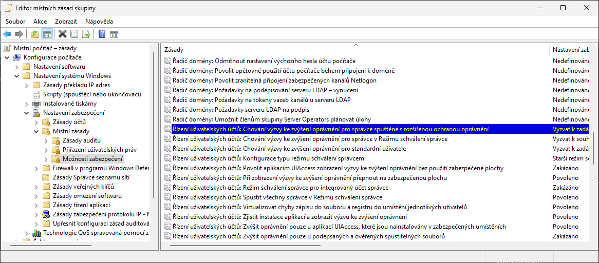

<!--
Ve Windows 11 se složka Ovládacích panelů „Nástroje pro správu" jmenuje „Nástroje Windows" (Windows Tools). gpedit.msc není v edici Home; secpol.msc také ne – tam zbývá registr nebo Intune.
Snímek gpedit z Windows 11 24H2 (Možnosti zabezpečení, zásady Řízení uživatelských účtů: …).
Zdroj: https://learn.microsoft.com/en-us/windows/security/application-security/application-control/user-account-control/settings-and-configuration
-->

---

<!-- _class: dense -->

# Zásady ovlivňující chování UAC (1)

- Řízení uživatelských účtů: **Chování výzvy** ke zvýšení oprávnění pro správce v Režimu schválení správce
  (*Behavior of the elevation prompt for administrators in Admin Approval Mode*)
  - **Zvýšit bez zobrazení výzvy** (*Elevate without prompting*)
  - Vyzvat k zadání souhlasu / pověření **na zabezpečené ploše**
  - **Vyzvat k zadání souhlasu / pověření** (*Prompt for consent / credentials*)
  - Vyzvat k zadání souhlasu **pro binární soubory nepocházející z Windows** (výchozí)
    - Požadovat souhlas pouze v případě, že zvýšení oprávnění vyžaduje aplikace, jež není součástí systému Windows
- Řízení uživatelských účtů: **Spustit všechny správce** v Režimu schválení správce (*Run all administrators in Admin Approval Mode*, `EnableLUA`)
  - Zakázáním dojde k vypnutí UAC pro všechny správce (`EnableLUA` = 0, nutný restart) – Zabezpečení Windows hlásí snížené zabezpečení, aplikace z Microsoft Store se nespustí („Tuto aplikaci nelze aktivovat, když je nástroj Řízení uživatelských účtů vypnutý“)
  - Ve výchozím nastavení povoleno

<!--
Vynucení zabezpečené plochy (zásada na snímku (3)) má přednost před volbami „bez zabezpečené plochy" u chování výzev.
Registr: ConsentPromptBehaviorAdmin 0 = bez výzvy, 1 = pověření na zab. ploše, 2 = souhlas na zab. ploše, 3 = pověření, 4 = souhlas, 5 = souhlas pro ne-Windows binárky (výchozí). Laboratorní skript E05 nastavuje výchozí hodnotu -ConsentPromptBehaviorAdmin 5.
Názvy zásad odpovídají cvičení E05 (česky) a en-us VM (anglicky v závorce).
Hlášení „This app can't be activated when UAC is disabled“ se váže na EnableLUA=0, ne na posuvník Řízení uživatelských účtů.
Zdroj: https://windowsreport.com/app-cant-be-activated-uac-disabled/
Zdroj: https://learn.microsoft.com/en-us/windows/security/application-security/application-control/user-account-control/settings-and-configuration
-->

---

<!-- _class: dense -->

# Zásady ovlivňující chování UAC (2)

- Řízení uživatelských účtů: Režim schválení správce pro **integrovaný účet správce**
  (*Admin Approval Mode for the built-in Administrator account*, `FilterAdministratorToken`)
  - Povoluje Režim schválení správce pro uživatele Administrator
    - Účet Administrator je ve výchozím nastavení zakázán
  - Ve výchozím nastavení zakázáno (tedy automatické zvyšování oprávnění bez jakékoliv výzvy)
- Řízení uživatelských účtů: **Chování výzvy** ke zvýšení oprávnění pro standardní uživatele
  (*Behavior of the elevation prompt for standard users*, `ConsentPromptBehaviorUser`)
  - **Automaticky zamítnout** požadavky na zvýšení (*Automatically deny elevation requests*)
  - **Vyzvat k zadání pověření** (na zabezpečené ploše)
  - Výchozí nastavení: Vyzvat k zadání pověření; bezpečnostní baseline Microsoftu pro firemní stanice doporučuje zamítat
- Řízení uživatelských účtů: Konfigurovat **typ režimu schválení správce** (*Configure type of Admin Approval Mode*) – nové, zapíná Administrator protection (viz výše)

<!--
Registr: ConsentPromptBehaviorUser 0 = zamítnout, 1 = pověření na zab. ploše, 3 = pověření (výchozí). Skript E05 nastavuje -ConsentPromptBehaviorUser 3; Lab 01 pak zkouší hodnotu Automatically deny.
Původní deck uváděl u Enterprise výchozí „zamítnout" – aktuální dokumentace uvádí jednotné výchozí „Prompt for credentials"; zamítání je doporučení Windows security baseline.
Český název zásady „Konfigurovat typ režimu schválení správce" je překlad autora, ověřit v gpedit na 25H2.
Zdroj: https://learn.microsoft.com/en-us/windows/security/application-security/application-control/user-account-control/settings-and-configuration
Zdroj: https://learn.microsoft.com/en-us/windows/security/application-security/application-control/administrator-protection/
-->

---

<!-- _class: dense -->

# Zásady ovlivňující chování UAC (3)

- Řízení uživatelských účtů: Při zobrazení výzvy ke zvýšení oprávnění **přepnout na zabezpečenou plochu**
  (*Switch to the secure desktop when prompting for elevation*, `PromptOnSecureDesktop`)
  - Při povolení vynucuje použití zabezpečené plochy při výzvách k zadání souhlasu / pověření
  - Při zakázání lze pořád vynutit použití zabezpečené plochy v nastavení chování výzev pro správce / standardní uživatele
  - Ve výchozím nastavení povoleno
- Řízení uživatelských účtů: **Zjistit instalace aplikací** a zobrazit výzvu ke zvýšení oprávnění
  (*Detect application installations and prompt for elevation*, `EnableInstallerDetection`)
  - Umožňuje instalátorům aplikací (setup.exe, install.exe, …) požadovat zvýšení oprávnění
  - Výchozí: povoleno v edici Home, ve firemních edicích zakázáno; firmy s Intune / Configuration Managerem vypínají

<!--
I při povolené zabezpečené ploše je možné se před aktivováním zabezpečené plochy přepnout do jiného okna a pozdržet tím aktivaci zabezpečené plochy. Výzva pro elevaci oprávnění pak bliká na liště jako normální spuštěná aplikace. Při přepnutí na tuto výzvu se před jejím zobrazením aktivuje zabezpečená plocha, bezpečnost tedy není nikterak narušena (výzva se vykresluje až po zobrazení zašedlého snímku plochy).
Detekce instalátorů: heuristika podle názvu souboru (setup, install, update) a hlavičky – funguje jen pro 32bit interaktivní procesy bez manifestu requestedExecutionLevel. Dokumentace uvádí výchozí „Enabled (default for home edition only) / Disabled (default)"; v praxi mají Pro stanice EnableInstallerDetection=1 – ověřit na 25H2.
Zdroj: https://learn.microsoft.com/en-us/windows/security/application-security/application-control/user-account-control/settings-and-configuration
-->

---

<!-- _class: dense -->

# Zásady ovlivňující chování UAC (4)

- Řízení uživatelských účtů: Povolit **aplikacím UIAccess** zobrazit výzvu ke zvýšení oprávnění bez použití zabezpečené plochy
  (*Allow UIAccess applications to prompt for elevation without using the secure desktop*)
  - Povolením mohou uživatelé UIAccess aplikací (např. vzdálené pomoci – dnes Rychlá pomoc, Intune Remote Help) reagovat na výzvy ke zvýšení oprávnění
  - Ve výchozím nastavení zakázáno
- Řízení uživatelských účtů: Zvýšit oprávnění pouze u aplikací UIAccess, které jsou nainstalovány v **zabezpečených umístěních**
  (*Only elevate UIAccess applications that are installed in secure locations*)
  - Zabezpečená umístění: `%ProgramFiles%`, `%ProgramFiles(x86)%`, `%SystemRoot%\system32`
  - Zakázání umožňuje každé aplikaci požadovat spuštění s úrovní integrity UIAccess (aplikace musí být ovšem pořád podepsána důvěryhodnou certifikační autoritou)
  - Výchozí nastavení je povoleno

<!--
UIAccess = aplikace pro usnadnění přístupu (čtečky obrazovky, vzdálená pomoc), které potřebují kreslit přes okna s vyšší integritou; deklarují uiAccess="true" v manifestu.
Vzdálená pomoc (msra.exe) je zastaralá; nástupci jsou Rychlá pomoc (Quick Assist) a Remote Help v Intune – obě umí elevovat vzdáleně, Rychlá pomoc přes UAC výzvu na straně uživatele.
Zdroj: https://learn.microsoft.com/en-us/windows/security/application-security/application-control/user-account-control/settings-and-configuration
-->

---

<!-- _class: dense -->

# Zásady ovlivňující chování UAC (5)

- Řízení uživatelských účtů: Zvýšit oprávnění pouze u **podepsaných a ověřených** spustitelných souborů
  (*Only elevate executables that are signed and validated*, `ValidateAdminCodeSignatures`)
  - Všechny nepodepsané aplikace, případně aplikace podepsané nedůvěryhodným vydavatelem, nemůžou vyžadovat zvyšování oprávnění (automaticky zamítnuto)
  - Ověřuje se certifikační cesta; povolené vydavatele lze přidat do úložiště Důvěryhodní vydavatelé
  - Ve výchozím nastavení zakázáno
- Řízení uživatelských účtů: **Virtualizovat chyby zápisu** do souboru a registru do umístění jednotlivých uživatelů
  (*Virtualize file and registry write failures to per-user locations*, `EnableVirtualization`)
  - Přesměruje zápisy do `%ProgramFiles%`, `%Windir%`, `HKLM\Software` do profilu uživatele (`%LocalAppData%\VirtualStore`, `HKCU\Software\Classes\VirtualStore`)
  - Jen pro starší 32bit aplikace bez manifestu; ve výchozím nastavení povoleno

<!--
Virtualizace může způsobovat problémy, pokud je potřeba sdílet zapsaná data nebo nastavení mezi uživateli (každý uživatel má svou vlastní kopii dat a nastavení). Aplikace s manifestem (requestedExecutionLevel) virtualizaci nemají; 64bit aplikace nikdy. Ve Správci úloh (Podrobnosti) lze přidat sloupec „Virtualizace UAC" a u procesu ji zapnout/vypnout.
Zdroj: https://learn.microsoft.com/en-us/windows/security/application-security/application-control/user-account-control/settings-and-configuration
-->

---

<!-- _class: section -->

# Autentizace a autorizace

<!-- header: 'Desktop systémy Microsoft Windows Autentizace a autorizace' -->

---

# Základní pojmy

- **Autentizace** (*authentication*)
  - Ověření identity uživatele důvěryhodnou autoritou (lokální bezpečnostní autoritou (LSA, *Local Security Authority*), řadičem domény – Kerberos, Microsoft Entra ID, …)
  - Vytváří se tzv. přístupový token (*access token*)
- **Autorizace** (*authorization*)
  - Prokázání identity uživatele pro zpřístupnění určitého prostředku (souboru, adresáře, tiskárny, …)
  - Ověření oprávnění uživatele resp. skupin uložených v předloženém přístupovém tokenu
- Trend 2026: **bez hesla** (*passwordless*) – Windows Hello, přístupové klíče, klíče FIDO2; NTLM je zastaralý (*deprecated* 2024, NTLMv1 odstraněn ve 24H2)

<!--
Změny příslušenství uživatele ve skupinách se projeví až po jeho novém přihlášení (kdy získá nový přístupový token).
LSA je ve Windows 11 22H2+ chráněný proces (LSA protection, RunAsPPL) a v edicích Enterprise/Education běží Credential Guard ve výchozím nastavení (VBS izolace hashů a Kerberos lístků).
Zdroj: https://learn.microsoft.com/en-us/windows/whats-new/deprecated-features
Zdroj: https://learn.microsoft.com/en-us/windows/whats-new/whats-new-windows-11-version-22h2
-->

---

<!-- _class: dense -->

# Možnosti autentizace ve Windows 11

- Nastavení → Účty → **Možnosti přihlášení**
  - **Heslo** (místní účet, účet Microsoft, doménový / pracovní účet)
  - **PIN** (Windows Hello) – vázán na zařízení a TPM, nikdy neopouští zařízení
  - **Rozpoznávání obličeje / otisků prstů** (Windows Hello) – biometrie zůstává jen v zařízení
  - **Klíč zabezpečení** (FIDO2 – USB / NFC / Bluetooth)
  - Historie: **obrázkové heslo** – od července 2026 (KB5101650) už nelze nově nastavit
- **Čipová karta** (*smart card*) – certifikát + PIN, dvoufaktorová autentizace
- **Přístupové klíče** (*passkeys*) – pro weby a aplikace, uloženy ve Windows Hello nebo u správce hesel
- Vlastní způsob vytvořením odpovídajícího **poskytovatele pověření** (*credential provider*)
  - Možnost kombinace rozdílných metod – vícefaktorová autentizace
- **Dynamický zámek** (Bluetooth telefon), **Enhanced Phishing Protection** (varuje před zadáním hesla do phishingu)

<!--
Historie: Windows 8 přinesla obrázkové heslo a PIN, Windows 10 Windows Hello (obličej, duhovka, otisk) a „Microsoft Passport" – ten byl přejmenován na Windows Hello for Business. Obrázkové heslo: KB5101650 (14. 7. 2026, buildy 26100.8875 / 26200.8875) – „picture password is no longer available for new enrollment"; existující nastavení funguje, po odstranění se nedá znovu zapnout.
Windows Hello s místním účtem je jen pohodlné přihlášení (není kryté asymetrickým klíčem); plnou hodnotu má s účtem Microsoft, Entra ID nebo AD.
Zdroj: https://support.microsoft.com/en-us/servicing/os/windows-11/2026/07/july-14-2026-kb5101650-os-builds-26200-8875-and-26100-8875
Zdroj: https://learn.microsoft.com/en-us/windows/security/identity-protection/hello-for-business/
Zdroj: https://learn.microsoft.com/en-us/windows/whats-new/whats-new-windows-11-version-22h2
-->

---

<!-- _class: dense -->

# Windows Hello a Windows Hello for Business

- **Windows Hello**: PIN / biometrie odemyká asymetrický klíč uložený v TPM
  - Přihlášení k účtu Microsoft, k místnímu účtu (jen pohodlí) a k webům přes FIDO2 / WebAuthn
  - Vestavěná ochrana proti hádání PINu (anti-hammering TPM)
- **Windows Hello for Business** (WHfB) – firemní rozšíření
  - Účty Microsoft Entra ID a Active Directory; klíčová nebo certifikátová autentizace, podmíněný přístup (*Conditional Access*), atestace zařízení
  - Dvoufaktorové: „něco mám“ (klíč v TPM zařízení) + „něco vím“ (PIN) nebo „něco jsem“ (biometrie)
  - Modely nasazení: cloud-only, hybridní, on-premises; typy důvěry: **cloud Kerberos trust** (doporučeno), key trust, certificate trust
  - Edice Pro, Enterprise, Pro Education / SE, Education
- **Bez hesla** = odolné proti phishingu a útokům na server (server má jen veřejný klíč)
- Related: **Personal Data Encryption** (22H2, Enterprise) šifruje soubory klíčem odemykaným WHfB

<!--
WHfB nefunguje s Microsoft Entra Domain Services. Biometrická data neopouštějí zařízení, nejsou roamována.
Cloud Kerberos trust (od 2022) nepotřebuje PKI ani synchronizaci klíčů do AD – v hybridním prostředí je dnes výchozí volba; key trust vyžaduje Server 2016+ DC a synchronizaci klíče (Entra Connect), certificate trust vyžaduje PKI + AD FS / Intune SCEP.
Zdroj: https://learn.microsoft.com/en-us/windows/security/identity-protection/hello-for-business/
Zdroj: https://learn.microsoft.com/en-us/windows/whats-new/whats-new-windows-11-version-22h2
-->

---

<!-- _class: dense -->

# Přístupové klíče (passkeys) a klíče zabezpečení FIDO2

- **Přístupový klíč** = pár klíčů FIDO2 / WebAuthn pro konkrétní web či aplikaci
  - Soukromý klíč v zařízení (Windows Hello / TPM), služba má jen veřejný klíč; unikátní pro každou službu, odolný proti phishingu a znovupoužití
  - Odemknutí gestem Windows Hello (PIN, biometrie) nebo z telefonu / tabletu přes Bluetooth (*cross-device*)
- Windows 11: **nativní správa** od 22H2 + KB5030310 (9/2023, „Moment 4“ = 23H2)
  - Nastavení → Účty → *Přístupové klíče* (správa, mazání); 24H2: souhlas aplikace s přístupem k přístupovým klíčům (Nastavení → Soukromí a zabezpečení → *Přístup k přístupovým klíčům*)
  - Od aktualizace 11/2025: rozhraní pro správce přístupových klíčů třetích stran (1Password, Bitwarden) a Microsoft Password Manager (synchronizace přes účet Microsoft) jako plugin
- **Klíč zabezpečení FIDO2** (YubiKey, Feitian, …): přenosný autentikátor – přihlášení do Windows (Entra ID) i k webům; správa v Možnosti přihlášení → *Klíč zabezpečení*
- V síti bez Bluetooth: omezit Bluetooth jen na **FIDO služby** (CSP `Bluetooth/ServicesAllowedList`)

<!--
Passkeys fungují ve všech podporovaných verzích Windows (WebAuthn API), ale správu v Nastavení přinesla až aktualizace KB5030310 pro 22H2 (a 23H2). Edice: Pro, Enterprise, Pro Education / SE, Education.
Podpora správců hesel třetích stran (plugin passkey manager – 1Password, Bitwarden, Microsoft Password Manager) je GA od listopadové (2025) bezpečnostní aktualizace Windows 11 – blog Windows IT Pro „Windows 11 expands passkey manager support" (11/2025); uživatel volí výchozího poskytovatele v Nastavení → Účty → Přístupové klíče → Pokročilé možnosti. Firemní zásady pro souhlas aplikací (24H2): dokumentace (stav 12. 5. 2026) je stále uvádí jako Insider s cílem GA do konce června 2026 – k 17. 9. 2026 neověřeno, zkontrolovat před přednáškou.
Zdroj: https://learn.microsoft.com/en-us/windows/security/identity-protection/passkeys/
Zdroj: https://techcommunity.microsoft.com/blog/windows-itpro-blog/windows-11-expands-passkey-manager-support/4467572
-->

---

<!-- _class: dense -->

# Typy účtů a správa účtu správce

- **Místní účet** – jen v tomto počítači (SAM); OOBE Windows 11 Home i Pro vyžaduje internet a účet Microsoft, místní účet lze přidat později (Nastavení → Účty → *Další uživatelé*)
- **Účet Microsoft** (MSA) – přihlášení stejným účtem na více zařízeních, synchronizace (Zálohování Windows), Windows Hello, BitLocker recovery key v cloudu
- **Pracovní nebo školní účet** (Nastavení → Účty → *Přístup do práce nebo školy*)
  - **Microsoft Entra joined** – zařízení patří organizaci, přihlášení účtem Entra ID, správa Intune
  - **Microsoft Entra registered** – BYOD, jen registrace + MDM, přihlášení zůstává místní / MSA
  - **Doména Active Directory** – klasické připojení; hybridní join = AD + Entra ID
- **Skupiny**: Administrators (správce), Users (standardní uživatel), Guests; vestavěný účet Administrator zakázán, Guest nelze pro přihlášení použít
- **Windows LAPS** (*Local Administrator Password Solution*) – součást Windows od aktualizace 11. 4. 2023
  - Automaticky rotuje heslo místního správce a zálohuje jej do Entra ID nebo AD (šifrovaně, s historií); správce si heslo vyzvedne v Intune / ADUC
  - 24H2 / Server 2025: **Automatic Account Management** – LAPS účet správce sám vytvoří a spravuje; starý Microsoft LAPS (MSI) je zastaralý, od 23H2 se nedá instalovat

<!--
LAPS: řeší stejné heslo místního správce na všech stanicích (pass-the-hash, laterální pohyb). Entra-joined zařízení zálohují jen do Entra ID, AD-joined jen do AD, hybridní si vyberou; Entra registered (BYOD) LAPS nepodporuje. Licence: Entra ID Free stačí, ve Windows zdarma ve všech edicích. Konfigurace: LAPS CSP (Intune → Account protection), zásady skupiny (Computer Configuration → Administrative Templates → System → LAPS), PowerShell modul LAPS (Get-LapsADPassword, Reset-LapsPassword).
OOBE: Microsoft v roce 2025 odstranil oblíbené obcházení (bypassnro) – cvičení E01 řeší instalaci bez účtu Microsoft odpovědním souborem.
Zdroj: https://learn.microsoft.com/en-us/windows-server/identity/laps/laps-overview
-->

---

# Nastavení hesel a uzamykání účtů

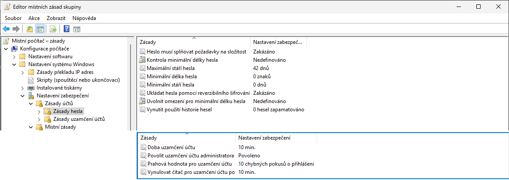

- `secpol.msc` → Zásady účtů → **Zásady hesla / Zásady uzamčení účtů**; doménově Default Domain Policy, Windows Server: jemně odstupňované zásady hesel (PSO)

<!--
Složitá hesla musí obsahovat znaky alespoň ze 3 z 5 kategorií (velká písmena, malá písmena, číslice, speciální znaky, ostatní abecední znaky Unicode – např. asijská písma), mít alespoň 6 znaků a nesmí obsahovat jméno účtu ani část zobrazovaného jména delší než 2 znaky.
Zdroj: https://learn.microsoft.com/en-us/previous-versions/windows/it-pro/windows-10/security/threat-protection/security-policy-settings/password-must-meet-complexity-requirements
Uzamykání účtů může způsobovat problémy např. při periodicky vykonávaných akcích (zálohování apod.), kdy někdo zablokuje účet, jenž je pro tuto akci používán. Historie: vestavěný Administrator se dříve nezamykal. Od Windows 11 22H2 (build 22528+, resp. čisté instalace s kumulativní aktualizací z 11. 10. 2022 před OOBE) je výchozí Prahová hodnota uzamčení účtu 10 pokusů, Doba trvání uzamčení 10 minut a nová zásada „Allow Administrator account lockout" povolena (KB5020282) – platí jen pro čisté instalace, upgradované stanice si nechávají staré hodnoty. Český název zásady na 24H2: „Povolit uzamčení účtu administratora“.
Zdroj: https://support.microsoft.com/en-us/topic/kb5020282-account-lockout-available-for-built-in-local-administrators-bce45c4d-f28d-43ad-b6fe-70156cb2dc00
Max. stáří 0–999 dní. Min. délka v GUI 0–14; od Windows 10 2004 / Server 2022 lze zásadou „Relax minimum password length limits" povolit 0–128 (a zásadou „Minimum password length audit" nejprve auditovat). Microsoft dnes doporučuje delší fráze místo nucené expirace (baseline od 2019 expiraci hesel nevyžaduje).
Snímek z Windows 11 24H2 (čistá instalace: Doba uzamčení účtu 10 min., Povolit uzamčení účtu administrátora – Povoleno, Prahová hodnota 10 chybných pokusů).
Zdroj: https://learn.microsoft.com/en-us/previous-versions/windows/it-pro/windows-10/security/threat-protection/security-policy-settings/minimum-password-length
Zdroj: https://support.microsoft.com/en-us/topic/minimum-password-length-auditing-and-enforcement-on-certain-versions-of-windows-5ef7fecf-3325-f56b-cc10-4fd565aacc59
-->

---

<!-- _class: dense -->

# Možnosti řešení zapomenutí hesla

- **Místní účet**
  - **Bezpečnostní otázky** (od Windows 10 1803) – nastavují se v *Možnosti přihlášení*, reset na přihlašovací obrazovce
  - **Disk pro resetování hesla** (Ovládací panely → Uživatelské účty → *Vytvořit disketu pro resetování hesla*)
    - Data pro resetování hesla uložena na USB úložném zařízení (v nechráněné podobě)
    - Zachování všech osobních certifikátů (včetně EFS certifikátů) a hesel uložených ve Správci pověření
  - **Resetování hesla správcem** (`net user`, `lusrmgr.msc`, Nastavení)
    - Ztráta osobních certifikátů (včetně EFS certifikátů) a hesel uložených ve Správci pověření
- **Účet Microsoft**: reset online (account.live.com); **Entra ID**: self-service password reset (SSPR)
- **Windows Hello PIN**: „Zapomněl(a) jsem PIN“ – nový PIN po ověření účtem, heslo se nemění
- **Heslo místního správce**: Windows LAPS (výše)

<!--
Ztráta EFS certifikátů při resetu správcem: DPAPI master key je odvozen z hesla uživatele; při změně hesla samotným uživatelem (zná staré) se přešifruje, při resetu správcem ne. Proto stále platí: zálohovat EFS certifikát (další snímek) nebo mít agenta obnovení dat.
Disk pro resetování hesla funguje jen pro místní účty; ve Windows 11 je dialog stále v Ovládacích panelech.
-->

---

# Zálohování EFS certifikátů

- Export do **.pfx souboru**
  - Chráněn heslem
  - Obsahuje veřejný i privátní klíč
- **3 možnosti exportu**
  - Přes **průvodce** *Spravovat šifrovací certifikáty souborů* (`rekeywiz.exe`)
  - Přes **MMC konzoli Certifikáty** (`certmgr.msc`)
  - **Příkazem** `cipher /x <název>`
- Alternativa: **agent obnovení dat** (DRA) v doméně; EFS beze změny i ve Windows 11

<!--
EFS existuje jen v edicích Pro a vyšších. Osobní certifikáty lze přenést i Zálohováním Windows / USMT (migrují se s profilem), ale zálohu .pfx mimo počítač to nenahrazuje.
-->

---

<!-- _class: dense -->

# Správce pověření

- Ovládací panely → **Správce pověření**: Webová pověření a Pověření systému Windows (`control /name Microsoft.CredentialManager`)
  - Uchovává přihlašovací jména a hesla pro přístup k síťovým prostředkům, certifikáty, obecná pověření aplikací
  - Možnost synchronizace s účtem Microsoft (Nastavení → Účty → Zálohování Windows → Zapamatovat si moje předvolby → *Hesla*)
  - Hesla nelze zobrazit (webová ano po ověření)
- Umožňuje **zálohu a obnovu pověření**
  - Migrace uložených pověření na jiný počítač
  - Zálohuje i některé certifikáty (ne certifikáty pro EFS)
  - Záloha chráněná heslem
  - Zálohování i obnova vždy přes zabezpečenou plochu (Ctrl+Alt+Del)
- Hesla pro weby dnes spravuje **Microsoft Edge** (Microsoft Password Manager), ne Správce pověření

<!--
Při zálohování uživatelských dat se uložená pověření nezálohují (Zálohování Windows synchronizuje jen část přes účet Microsoft).
Před přechodem na zabezpečenou plochu je potřeba zvolit Ctrl+Alt+Del.
PowerShell: cmdkey /list, cmdkey /add:server /user:jméno /pass; z pohledu útočníka jsou pověření chráněna DPAPI – uživatel je může dešifrovat (mimikatz vault::cred), proto neukládat pověření správce (viz runas /savecred).
Historie: Windows 7 trezor Windows (Windows Vault), Windows 8 Credential Locker s roamingem přes účet Microsoft (bez možnosti zamknout heslem, nedoporučováno s roaming profily); Credential Locker W8 = Správce pověření W10/W11. Webová pověření dříve plnil Internet Explorer (vyřazen 2022) – dnes je zapisují jen aplikace používající Web Authentication Broker; Edge má vlastní úložiště hesel.
-->

---

# Čipové karty

- Obsahují **certifikáty** použitelné pro autentizaci
  - Možnost zneplatnění (*revoke*) certifikátu při odcizení
- **Nativní podpora** (ovladače, minidriver) v systému Windows
- Jednoduchá **integrace do Active Directory** (Kerberos PKINIT), podpora i pro Entra ID (*certificate-based authentication*)
- **Virtuální čipové karty** (certifikáty v TPM namísto karty)
  - Microsoft doporučuje místo nich Windows Hello for Business nebo klíče FIDO2 (pro nové instalace)
- Nastavení přes **zásady skupiny**
  - Možnosti zabezpečení, část *Interaktivní přihlašování*

<!--
Od Windows 8 se spouští služba Čipová karta (Smart Card) jen pokud je připojena čtečka čipových karet (a zastavuje jakmile je odpojena), dříve běžela neustále.
Dokumentace virtuálních čipových karet: „Windows Hello for Business and FIDO2 security keys are modern, two-factor authentication methods for Windows. Customers using virtual smart cards are encouraged to move to Windows Hello for Business or FIDO2." Formálně na seznamu deprecated features nejsou.
Zdroj: https://learn.microsoft.com/en-us/windows/security/identity-protection/virtual-smart-cards/virtual-smart-card-overview
-->

---

# Zásady čipových karet

- Interaktivní přihlašování: **Požadovat čipovou kartu** (*Interactive logon: Require Windows Hello for Business or smart card*)
  - Při povolení se není možné autentizovat heslem – jen čipovou kartou nebo Windows Hello for Business
  - Ve výchozím nastavení zakázáno
- Interaktivní přihlašování: **Chování při odebrání** čipové karty
  - **Žádná akce** (výchozí nastavení)
  - **Uzamknout pracovní stanici**
  - **Vynutit odhlášení**
  - **Odpojit** v případě relace Vzdálené plochy
- Pro **Windows Hello**: zásada *Použít Windows Hello pro firmy*, Vyžadovat PIN / biometrii, dynamický zámek

<!--
Zásada „Interactive logon: Require smart card" se dnes jmenuje „Interactive logon: Require Windows Hello for Business or smart card" (dokumentace: Windows 10 1703+ / Windows 11) – český název v gpedit ověřit na 25H2. Odhlášení při odebrání karty vyžaduje běžící službu Zásady odebrání čipové karty (SCPolicySvc).
Zdroj: https://learn.microsoft.com/en-us/windows/security/threat-protection/security-policy-settings/interactive-logon-require-smart-card
Zdroj: https://learn.microsoft.com/en-us/windows/security/identity-protection/hello-for-business/
-->

---

# Spouštění programů pod jiným účtem

- Nástroj `runas [/profile | /noprofile] [/savecred | /smartcard] /user:<jméno> "<program>"`
- Spuštěný program běží pod **zadaným uživatelem**
  - Přístup k prostředkům realizován tímto uživatelem
- Možnost **načtení / nenačtení profilu** uživatele
  - Při načtení lze přistupovat k šifrovaným datům (EFS) daného uživatele (certifikáty jsou uloženy v profilu)
  - Nenačtení profilu urychluje spuštění programu, ale program nemusí pracovat správně
- **PowerShell**: `Start-Process <program> -Credential (Get-Credential)` (jiný uživatel), `Start-Process <program> -Verb RunAs` (elevace přes UAC)
- **GUI**: Shift + pravé tlačítko → *Spustit jako jiný uživatel*; *Spustit jako správce*

<!--
Nezapomínat na uvozovky při specifikaci programu (hlavně, když má být spouštěn s parametry).
runas nikdy neelevuje – spustí proces s tokenem zadaného uživatele tak, jak ho vytvoří LSA, tedy u správce s filtrovaným tokenem (viz další snímek). Elevaci dělá jen UAC (Spustit jako správce, -Verb RunAs) nebo sudo.
-->

---

# Pověření a oprávnění

- Zadané pověření lze uložit ve **Správci pověření**
  - Přepínač `/savecred` pro uložení i použití pověření
- Pověření lze dodat na **čipové kartě** (*smart card*)
  - Přepínač `/smartcard` (nelze uložit přes `/savecred`)
- Všechny spouštěné programy běží s oprávněními **standardního uživatele**
  - Nelze zobrazovat výzvy k zadání souhlasu / pověření
  - Není možné provést zvýšení oprávnění jinak než plně automaticky
- **Uložená pověření správce** = trvalá cesta k oprávněním správce pro cokoli pod účtem uživatele → v praxi zakázat (`/savecred` není v edici Home)

<!--
Pozor na ukládání pověření (lokálního) správce do Správce pověření přes /savecred, oprávnění lze pak zneužít pro spouštění jiných aplikací – jde o klasickou techniku eskalace (runas /savecred se uloženým pověřením spustí cokoli bez dotazu). Bezpečnostní baseline proto doporučuje zásadu „Přístup k síti: Nepovolit ukládání hesel a pověření pro síťové ověřování".
-->

---

<!-- _class: dense -->

# Sudo for Windows (Windows 11 24H2+)

- `sudo <příkaz>` – elevace příkazu z neelevované konzole; ve výchozím nastavení **vypnuto**
  - Zapnutí: Nastavení → Systém → Upřesnit (dříve Pro vývojáře) → *Povolit sudo*; nebo `sudo config --enable <režim>` z elevované konzole
- **Tři režimy**
  - **V novém okně** (`forceNewWindow`, výchozí) – elevovaný proces v novém okně, obdoba `runas`
  - **Se zavřeným vstupem** (`disableInput`) – běží v aktuálním okně, ale nepřijímá vstup (kompromis)
  - **Inline** (`normal`) – chování jako sudo v Linuxu; neelevovaný proces může posílat vstup elevovanému → riziko eskalace
- Elevace jde vždy přes **UAC výzvu**; neumí spustit pod jiným uživatelem (to umí jen `runas`) ani zadat heslo v konzoli
- Komunitní alternativa s více funkcemi: **gsudo**

<!--
Sudo for Windows je open source (github.com/microsoft/sudo), součást Windows 11 24H2 a novějších. Zapnutí v Nastavení bylo ve 24H2 v sekci „Pro vývojáře", aktuální dokumentace uvádí System → Advanced (stránka byla přejmenována) – český název ověřit na 25H2 v učebně. Bezpečnostní varování Microsoftu: v režimech disableInput a normal může škodlivý proces zneužít spojení mezi neelevovaným a elevovaným sudo.exe.
Zdroj: https://learn.microsoft.com/en-us/windows/advanced-settings/sudo/
-->

---

<!-- _class: section -->

# Omezování aplikací

<!-- header: 'Desktop systémy Microsoft Windows Omezování aplikací' -->

---

<!-- _class: dense -->

# Nástroje pro omezování aplikací (2026)

| Nástroj | Stav | Edice | Správa |
| --- | --- | --- | --- |
| **Zásady omezení softwaru** (SRP) | zastaralé od Windows 10 1803 | vše | GPO (uživatel i počítač) |
| **AppLocker** | podporován, „obrana do hloubky“ | vše (Win10 2004+ / Win11, KB5024351) | GPO, Intune (OMA-URI), PowerShell |
| **App Control for Business** (dříve WDAC / Device Guard) | primární, i pro jádro | Pro, Enterprise, Education (Home jen bez cmdletů) | Intune, ConfigMgr, GPO, skript |
| **Smart App Control** | pro spotřebitele / malé firmy | Windows 11 22H2+, jen čistá instalace | Zabezpečení Windows (zap./vyp.) |

- **Aplikační kontrola** = „běží jen to, co zásada povolí“ – doplněk antiviru, ne jeho náhrada
- **Pokryté typy**: .exe, .dll, skripty (.ps1 → PowerShell Constrained Language Mode), .msi, balíčky MSIX, ovladače (jen App Control)

<!--
Přejmenování WDAC na App Control for Business proběhlo v dokumentaci 2024; Device Guard byl název z Windows 10 1507. Microsoft: AppLocker „is a defense-in-depth security feature and not considered a defensible Windows security feature" – pro robustní ochranu použít App Control.
Zdroj: https://learn.microsoft.com/en-us/windows/security/application-security/application-control/app-control-for-business/appcontrol
Zdroj: https://learn.microsoft.com/en-us/windows/security/application-security/application-control/app-control-for-business/feature-availability
Zdroj: https://learn.microsoft.com/en-us/windows/whats-new/deprecated-features
-->

---

<!-- _class: dense -->

# Zásady omezení softwaru (historie)

- Podpora od **Windows XP** a Windows Server 2003
- **Zastaralé** (*deprecated*) od Windows 10 1803 a Windows Server 2019 – Microsoft odkazuje na AppLocker / App Control for Business
  - Windows 11 22H2+: na čisté instalaci se pravidla SRP standardně nevynucují (E05 Lab 03 – jen pročíst)
- Celkem **5 různých typů pravidel** (podle priority)
  - **Pravidla algoritmu hash**
  - **Pravidla certifikátu**
  - **Pravidla cesty**
  - **Pravidla zóny sítě**
  - **Výchozí pravidla**
- Priorita podle **specifičnosti pravidel**
  - Více specifická pravidla mají vždy vyšší prioritu

<!--
Kapitola zůstává v kondenzované podobě, protože typy pravidel (hash, certifikát, cesta) se stejně objevují v AppLockeru a cvičení E05 Lab 03 na SRP odkazuje.
Oficiální stav: „Software Restriction Policies were deprecated beginning with Windows 10 build 1803 and also applies to Windows Server 2019 and above." Nevynucování na Windows 11 22H2 (čistá instalace) je komunitní zjištění (Born, MalwareTips 11/2022; souvisí s tím, že registr indikuje aktivní AppLocker a SRP/SAFER se tím vypne) – Microsoft to nikde explicitně nepotvrzuje; na upgradovaných stanicích SRP stále může fungovat.
Zdroj: https://learn.microsoft.com/en-us/windows-server/identity/software-restriction-policies/software-restriction-policies
Zdroj: https://learn.microsoft.com/en-us/windows/whats-new/deprecated-features
-->

---

# Výchozí pravidla

- Vždy může být aktivní **pouze jedno**
  - Výběr pod uzlem *Úrovně zabezpečení*
- Celkem **3 výchozí pravidla**
  - **Nepovoleno**
    - Aplikace, jež nejsou explicitně povoleny, nesmí běžet
  - **Standardní uživatel**
    - Aplikace, jež nevyžadují oprávnění správce, mohou běžet
  - **Bez omezení**
    - Aplikace, jež nejsou explicitně zakázány, mohou běžet

<!--
Výchozí pravidla jsou zároveň akce u ostatních typů pravidel (říkají, co dělat, pokud dané pravidlo sedí).
-->

---

# Nastavení v zásadách skupiny

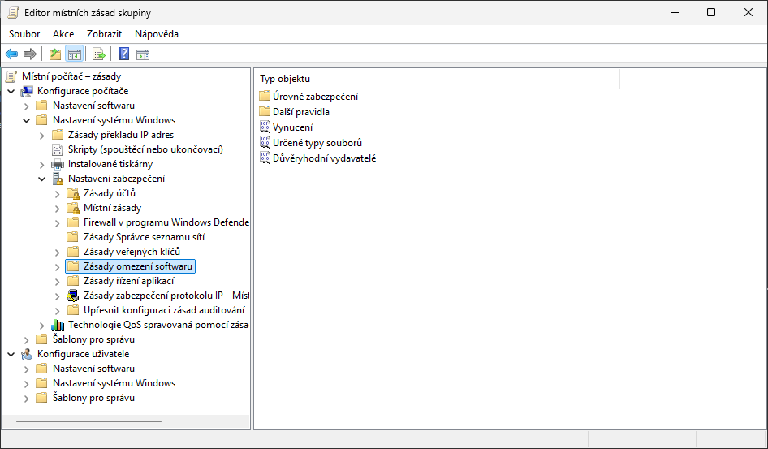

<!--
Konfigurace počítače → Nastavení systému Windows → Nastavení zabezpečení → Zásady omezení softwaru; uzel je prázdný, dokud se nezvolí Nové zásady omezení softwaru. Snímek z Windows 11 24H2 po volbě Nové zásady omezení softwaru.
-->

---

<!-- _class: dense -->

# Typy pravidel SRP

- **Pravidla cesty** – soubory, adresáře nebo klíče registru
  - Zástupné znaky `*` a `?`, systémové proměnné (`%SystemRoot%`), cesty ke klíčům registru uzavřené mezi `%`
  - Závislé na umístění – lze obejít přesunutím (přejmenováním) souboru; specifičtější cesta má vyšší prioritu
- **Pravidla algoritmu hash** – pouze soubory
  - Digitální otisk z binárního obsahu; unikátní pro každý soubor i verzi, mění se při jakékoliv změně
  - Nutná úprava při každé aktualizaci; nezávislost na umístění
- **Pravidla certifikátu** – soubory podepsané zadaným certifikátem
  - Nezávislost na umístění, aktualizace nevadí (stejný podpis); platí pro všechny soubory daného výrobce
  - Ověřování validity certifikátu (vyšší zatížení); musí být explicitně povolena
- **Pravidla zóny sítě** – jen .msi soubory podle zóny, z níž byly získány
  - Zóny (Důvěryhodné servery, Internet, Místní intranet, Místní počítač, Servery s omezeným přístupem) definuje dodnes dialog *Vlastnosti internetu* (`inetcpl.cpl`), i když Internet Explorer byl vyřazen (2022, IE mode v Edge)

<!--
U nástroje AppLocker se nijak explicitně neuvádí, že by ověřování validity certifikátu zatěžovalo počítač.
Zóny sítě: hodnota se bere z atributu Zone.Identifier (Mark of the Web) souboru, který zapisují Edge i jiné prohlížeče, a z nastavení zón v Ovládací panely → Možnosti Internetu → Zabezpečení (dialog zůstává kvůli IE mode a WinINet aplikacím). Pravidla zóny se týkají jen Instalační služby systému Windows.
Zdroj: https://learn.microsoft.com/en-us/windows-server/identity/software-restriction-policies/software-restriction-policies
-->

---

# Vynucení a určené typy souborů

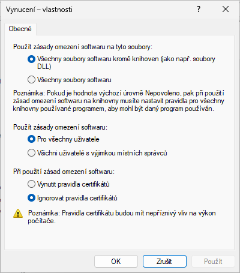

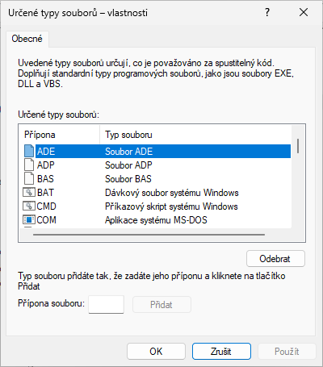

<!--
V případě omezování spouštění DLL knihoven je potřeba specifikovat povolující pravidla pro všechny DLL knihovny, jež spouštěná aplikace používá, ne jen pro danou aplikaci. Vynucení lze omezit na všechny uživatele kromě místních správců; určené typy souborů rozšiřují seznam přípon považovaných za spustitelné (.bat, .cmd, .vbs, .js, …).
-->

---

<!-- _class: dense -->

# AppLocker

- K dispozici ve **všech edicích** Windows 10 2004+ a Windows 11 (od KB 5024351); dříve jen Enterprise / Education (Windows 7 i Ultimate) – zásady přes MDM fungovaly na všech edicích vždy
  - Podpora od Windows 7 a Windows Server 2008 R2; ne na Server Core
- Pro správné fungování musí běžet služba **Identita aplikace** (AIS, *Application Identity Service*, `appidsvc`)
  - Ve výchozím nastavení neběží (ruční start)
- Omezování běhu aplikací pro **jednotlivé uživatele nebo skupiny**; od Windows 10 i pro služby a procesy SYSTEM (rozšíření kolekcí)
- Podpora **automatického vytváření pravidel**
  - Průvodce pro analýzu adresářů a generování pravidel
- Microsoft: „**obrana do hloubky**“, pro robustní ochranu doporučuje App Control for Business

<!--
E05 ponechává pro W11-domain edici Education (jediná živě ověřená); text E05 správně uvádí, že od KB 5024351 (2023) vynucují AppLocker všechny edice včetně Windows 11 Pro.
Při konfiguraci nástroje AppLocker je vhodné AIS nejprve spustit ručně a ověřit si, zda vše funguje, jak má, a teprve pak přepnout start AIS na automatické spouštění po startu počítače. Špatné nastavení nástroje AppLocker totiž může zablokovat celý systém (znemožnit spouštění důležitých součástí systému).
Při automatickém vytváření pravidel se generují pravidla vydavatele pro všechny podepsané soubory a pravidla cesty nebo algoritmu hash pro ostatní soubory.
PowerShell: Get-AppLockerPolicy -Effective, Set-AppLockerPolicy, Test-AppLockerPolicy, Get-AppLockerFileInformation.
Zdroj: https://learn.microsoft.com/en-us/windows/security/application-security/application-control/app-control-for-business/applocker/requirements-to-use-applocker
Zdroj: https://learn.microsoft.com/en-us/windows/security/application-security/application-control/app-control-for-business/applocker/applocker-overview
-->

---

# Typy pravidel

- **Pravidla vydavatele**
  - Pracují s certifikáty (digitálně podepsané soubory)
  - Lze rozlišovat na úrovni vydavatele, názvu produktu, názvu souboru nebo verze souboru (<, >, =)
- **Pravidla hodnoty hash souboru**
  - Možnost počítat hodnotu hash pro všechny soubory v zadaném adresáři
- **Pravidla cesty**
  - Nelze definovat systémové proměnné (jen proměnné AppLocker: `%WINDIR%`, `%SYSTEM32%`, `%PROGRAMFILES%`, `%OSDRIVE%`, `%REMOVABLE%`, `%HOT%`) ani cesty ke klíčům registru

<!--
U pravidel vydavatele se nevybírá certifikát, ale digitálně podepsaný soubor.
Název souboru není název souboru v souborovém systému, ale v digitálním podpisu.
Pravidla vydavatele jsou nejflexibilnější, proto se primárně vytváří při automatickém generování pravidel.
Pravidla vydavatele umožňují rozlišovat soubory také na úrovni podepsán/nepodepsán.
Proměnných nástroje AppLocker je jen pár – %REMOVABLE% odkazuje na vyměnitelná média (CD/DVD), %HOT% na USB disky.
-->

---

# Kolekce pravidel

- **Pravidla pro spustitelné soubory**
  - Aplikace na soubory s příponami .exe a .com
- **Pravidla Instalační služby** systému Windows
  - Aplikace na soubory s příponami .msi, .msp a .mst
- **Pravidla pro skripty**
  - Soubory s příponami .ps1, .bat, .cmd, .vbs a .js
- **Pravidla souborů DLL** (musí se nejprve povolit)
  - Soubory s příponami .dll, .ocx (a .rll)
- **Pravidla pro zabalené aplikace** a instalátory zabalených aplikací (MSIX / .appx)
- **Rozšíření kolekcí**: vynucení i pro služby (procesy bez uživatelského kontextu)

<!--
PowerShell skripty pod AppLockerem (a App Control) běží v Constrained Language Mode, pokud nejsou povoleny. Rozšíření kolekcí (rule collection extensions) je od Windows 10 / Server 2016 a nastavuje se v XML zásady (ServiceEnforcement), ne v GUI.
Zdroj: https://learn.microsoft.com/en-us/windows/security/application-security/application-control/app-control-for-business/feature-availability
-->

---

# Pravidla pro zabalené aplikace

- Omezují běh **zabalených aplikací** (MSIX, dříve UWP / .appx) z Microsoft Store, `winget` i sideloadingu (`Add-AppxPackage`)
  - Balíčky .msix / .msixbundle (starší .appx / .appxbundle); dokumentace AppLockeru stále uvádí .appx
  - Standardní uživatel je smí instalovat i bez správce – proto samostatná kolekce
- **Odlišnosti** od ostatních pravidel
  - Lze definovat pouze **pravidla vydavatele**
    - Mohou reagovat jen na název vydavatele, název aplikace (*package name*) a verzi aplikace (*package version*)
    - Všechny zabalené aplikace musí být digitálně podepsány
  - Omezují jak běh aplikace, tak její **instalaci**
  - Týkají se **celé aplikace** (všech jejích souborů)
    - Nelze omezovat konkrétní .exe nebo .dll soubory aplikace

<!--
MSIX (od Windows 10 1809) je nástupce APPX i MSI/App-V pro moderní i klasické (Win32) aplikace; balíček sdílí jednu identitu (vydavatel, název, verze), proto jedno pravidlo pokryje celou aplikaci a přežije aktualizace. Instalátor zabalené aplikace = .msix/.appx soubor sám; distribuce: Microsoft Store, Intune, winget (repozitář msstore), App Installer.
Praktický důsledek pro E05, Lab 04: Poznámkový blok ve Windows 11 je zabalená aplikace Microsoft.WindowsNotepad ze Store. Pravidlo Deny v kolekci Pravidla spouštění zablokuje jen zástupný C:\Windows\System32\notepad.exe (Win+R, cmd); dlaždice ve Startu se řídí touto kolekcí a její události končí v protokolu Packaged app-Execution. Cvičení E05 to u Lab 04 dokumentuje.
Zdroj: https://learn.microsoft.com/en-us/answers/questions/2199864/applocker-issues-on-windows-11-24h2
Zdroj: https://learn.microsoft.com/en-us/windows/security/application-security/application-control/app-control-for-business/applocker/packaged-apps-and-packaged-app-installer-rules-in-applocker
-->

---

# Výchozí pravidla

- Možnost **automatického generování** pro jednotlivé typy (kolekce) souborů
- Povolují spouštění souborů **kdekoliv pro správce**
- Pro **spustitelné soubory**, **skripty** a **soubory DLL**
  - Povolují spouštění souborů obsažených v adresářích Windows a Program Files pro všechny uživatele
- Pro soubory **Instalační služby systému Windows**
  - Povolují spouštění souborů obsažených v adresáři `Windows\Installer` a všech digitálně podepsaných souborů kdekoliv pro všechny uživatele
- Pro **zabalené aplikace**: jediné pravidlo vydavatele povolující všechny podepsané balíčky

<!--
Většina výchozích pravidel jsou pravidla cesty, výjimkou jsou pravidla vydavatele povolující spouštění všech digitálně podepsaných souborů.
Známá slabina výchozích pravidel: uživatelsky zapisovatelné podadresáře ve %WINDIR% (např. Tasks, Temp) – doporučuje se přidat výjimky nebo použít App Control, který zapisovatelnost cest kontroluje za běhu.
-->

---

# Nastavení v zásadách skupiny

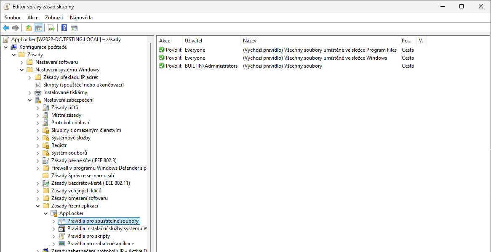

<!--
Snímek z Windows 11 24H2: Editor správy zásad skupiny (RSAT, doménový objekt zásad skupiny AppLocker z cvičení E05 Lab 04) – Konfigurace počítače → Zásady → Nastavení systému Windows → Nastavení zabezpečení → Zásady řízení aplikací → AppLocker → Pravidla pro spustitelné soubory s výchozími pravidly; v místním gpedit.msc je cesta stejná (bez uzlu Zásady).
Pravidla souborů DLL se objeví teprve po jejich povolení na záložce Upřesnit ve vlastnostech nástroje AppLocker. Historie: ve Windows 8 se toto povolení neukládalo a platilo jen pro danou instanci Editoru místních zásad skupiny.
-->

---

# Priorita pravidel a výjimky

- **Blokující pravidla** (akce *Odepřít*) – mají vždy přednost před povolujícími
- **Povolující pravidla** (akce *Povolit*)
- **Integrované blokující pravidlo**
  - Nelze změnit
  - Blokuje spouštění všech souborů, pro které neexistuje povolující pravidlo
- **Výjimky z pravidel**
  - Mohou být ve formě pravidla vydavatele, cesty i hash
  - Lze definovat pro blokující i povolující pravidla
  - Lze definovat jen u pravidel vydavatele a cesty

<!--
Rozdíl od SRP: v AppLockeru explicitní Odepřít vždy přebije Povolit bez ohledu na specifičnost; v SRP rozhodovala specifičnost pravidla.
-->

---

<!-- _class: dense -->

# Auditování

- Režim **Pouze audit** (*Audit only*) na kolekci – nasazení bez blokování, sběr událostí
- **Monitorování** aplikace AppLocker pravidel
  - Informace uloženy v protokolu AppLocker (Protokoly aplikací a služeb → Microsoft → Windows → AppLocker: EXE and DLL, MSI and Script, Packaged app-Deployment, Packaged app-Execution)
- **Ukládané informace**
  - **Název pravidla**
  - **SID** cílového uživatele nebo skupiny
  - **Cesta k souboru**
  - **Akce** (spuštění povoleno nebo odepřeno; události 8002–8007, 8020–8025 u balíčků)
  - **Typ pravidla** (vydavatel, hodnota hash, cesta)
- **PowerShell**: `Get-AppLockerFileInformation -EventLog -EventType Audited` → `New-AppLockerPolicy`

<!--
Cvičení E05 Lab 04 postupuje stejně: nejprve Audit only (varování 8003 v logu EXE and DLL), potom Enforce rules (chyba 8004). Události lze centrálně sbírat přes Event Forwarding nebo Intune / Defender for Endpoint (advanced hunting).
-->

---

# Nastavení auditování a povolení DLL

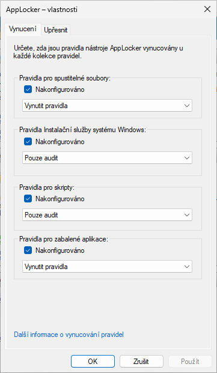

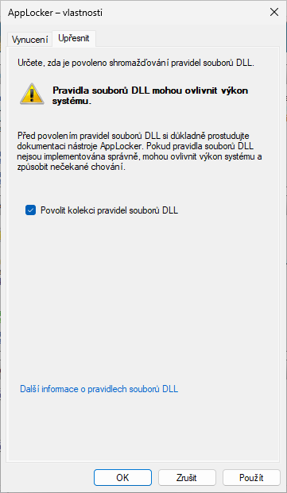

<!--
Vlastnosti uzlu AppLocker: karta Vynucení (Nakonfigurováno → Vynutit pravidla / Pouze audit pro každou kolekci) a karta Upřesnit (Povolit kolekci pravidel DLL). Snímky z Windows 11 24H2 (vlastnosti uzlu AppLocker v doménovém objektu zásad skupiny).
-->

---

<!-- _class: dense -->

# App Control for Business (dříve WDAC)

- Zásada řízení aplikací vynucovaná **integritou kódu** (*Code Integrity*) v jádře – platí pro celé zařízení, včetně ovladačů (.sys) a kódu v režimu jádra
  - Není per-user; nelze obejít spuštěním pod jiným účtem (na rozdíl od AppLockeru)
- **Pravidla**: vydavatel / certifikát (i řetěz k CA), hash, cesta (od 1903, kontrola zapisovatelnosti za běhu), balíčky, COM objekty, **Managed Installer** (co nainstaluje Intune / ConfigMgr, je důvěryhodné), **Intelligent Security Graph** (reputace z cloudu – stejný zdroj jako Smart App Control)
- **Zásada** = XML → binární .cip; více zásad zároveň (base + supplemental), režimy Audit / Enforce; nástroje: App Control Wizard, PowerShell modul ConfigCI, `CiTool.exe`
- **Nasazení**: Intune (Endpoint security → *App Control for Business*), Configuration Manager, GPO, skript
- **Edice**: Pro, Enterprise, Pro Education / SE, Education (Home: zásady fungují, chybí cmdlety); Windows Server 2016+
- **Výchozí šablony**: Default Windows, Allow Microsoft, Signed and Reputable (≈ Smart App Control) + doporučené blokovací seznamy (LOLBins, zranitelné ovladače)

<!--
Přejmenování: Device Guard (2015) → Windows Defender Application Control (2017) → App Control for Business (2024). Zásady lze podepisovat – podepsaná zásada je odolná i proti správci. Doporučený postup Microsoftu: začít od zásady Smart App Control (%windir%\schemas\CodeIntegrity\ExamplePolicies\SmartAppControl.xml), přidat vlastní LOB aplikace, nasadit v auditu, pak vynutit.
Zdroj: https://learn.microsoft.com/en-us/windows/security/application-security/application-control/app-control-for-business/appcontrol
Zdroj: https://learn.microsoft.com/en-us/windows/security/application-security/application-control/app-control-for-business/feature-availability
-->

---

<!-- _class: dense -->

# Smart App Control (Windows 11 22H2+)

- **Aplikační kontrola pro spotřebitele** a malé firmy, postavená na App Control for Business
  - Spustí jen kód, který cloudová služba Microsoftu (ISG) předpoví jako bezpečný, nebo je podepsán certifikátem důvěryhodné CA
  - Neznámý nepodepsaný kód, malware a PUA blokuje; blokuje i některé zneužitelné binárky Windows
- Jen na **čisté instalaci** (nebo po Obnovit počítač do továrního nastavení) Windows 11 22H2+, ve vybraných regionech
- Tři stavy: **Vyhodnocování** (*evaluation* – sleduje, zda by uživateli nepřekáželo) → **Zapnuto** nebo **Vypnuto**
  - Po vypnutí (ručně nebo automaticky) jej lze znovu zapnout jen reinstalací
  - Na zařízeních spravovaných firmou se po 48 h vyhodnocování vypne samo
- **Zabezpečení Windows** → Ovládání aplikací a prohlížeče → *Smart App Control*; registr `HKLM\SYSTEM\CurrentControlSet\Control\CI\Policy\VerifiedAndReputablePolicyState` (0 vyp., 1 zap., 2 vyhodnocování) + `CiTool.exe -r`
- Se zapnutým SAC je aktivní i **blokovací seznam zranitelných ovladačů**; Defender AV přechází do pasivního režimu při jiném AV

<!--
Stanice v C304 (Windows 11 Education 25H2, image přes UWF) mají SAC nejspíš vypnutý – ověřit v Zabezpečení Windows. Český název sekce v aplikaci Zabezpečení Windows („Ovládání aplikací a prohlížeče" → „Smart App Control" / „Chytré řízení aplikací") ověřit na 25H2 – dokumentace v češtině není k dispozici.
Pro vývojáře: aplikace podepsané certifikátem z Trusted Root Program projdou; nepodepsané nástroje (interní skripty, Python .exe z PyInstalleru) SAC blokuje – proto se u „power userů" vypne sám.
Dokumentace: „Smart App Control starts in evaluation mode and switches off within 48 hours for enterprise managed devices unless the user turns it on first"; blokovací seznam zranitelných ovladačů je od Windows 11 22H2 zapnutý na všech zařízeních a vynucený při HVCI, SAC nebo S mode; při zapnutém SAC (nebo App Control s ISG) přechází Defender AV na stanicích s jiným antivirem do pasivního/hybridního režimu (dělá jen reputační dotazy).
Zdroj: https://learn.microsoft.com/en-us/windows/apps/develop/smart-app-control/overview
Zdroj: https://learn.microsoft.com/en-us/windows/security/application-security/application-control/app-control-for-business/design/microsoft-recommended-driver-block-rules
Zdroj: https://learn.microsoft.com/en-us/windows/security/application-security/application-control/app-control-for-business/appcontrol
-->
