<!-- _class: title -->
<!-- _header: '' -->

# Desktop systémy Microsoft Windows

## IW1

Jan Pluskal\
pluskal@vut.cz

Fakulta informačních technologií\
Vysoké učení technické v Brně\
Božetěchova 2, 612 66 Brno

---

<!-- _class: section -->

# Řízení uživatelských účtů (UAC)

<!-- header: 'Desktop systémy Microsoft Windows Řízení uživatelských účtů (UAC)' -->

---

<!-- _class: dense -->

# Řízení uživatelských účtů

- UAC (User Account Control)
- Umožňuje zvyšování (elevaci) oprávnění
- Zvyšuje bezpečnost systému
  - Explicitní souhlas / zadání pověření (credentials)
- Úkony, které vyžadují zvýšení oprávnění graficky odlišeny ikonou štítu
- Dvě úrovně nastavení
  - Základní nastavení v ovládacích panelech
  - Pokročilé nastavení v zásadách skupiny

---

# Výzvy k zadání souhlasu a pověření

<!-- REVIEW: všechny snímky obrazovky v této přednášce (slidy 4, 9, 11, 20, 31, 36, 42, 45)
     jsou z Windows 8 – rozhodnout, zda je přefotit ve Windows 11. -->

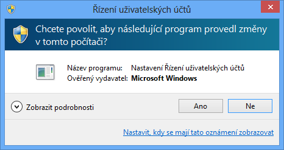

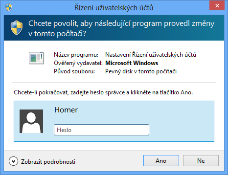

---

# Zvyšování (elevace) oprávnění

- Proces zpřístupnění oprávnění správce uživateli
- Všichni přihlášení uživatelé (včetně správců) běží s oprávněními standardního uživatele
- Vždy pouze pro konkrétní úkon (např. spuštění programu, změnu nastavení systému, …)
  - Oprávnění pro ostatní úkony musí být zvýšeny zvlášť
- Režim schválení správce (Admin Approval mode)
  - Správce musí explicitně potvrdit zvýšení oprávnění
  - Potvrzení formou souhlasu nebo zadání pověření

---

# Standardní uživatel

<!-- REVIEW: slidy 6 a 7 byly v pptx diagramy z tvarů (šipky, tokeny, procesy) –
     tady přepsány jako textový tok; ověřit, případně nakreslit znovu. -->

**Přihlášení** → Přístupový token s oprávněními standardního uživatele
→ Plocha (`explorer.exe`)

**Spuštění** → Zvýšení oprávnění (Zadání pověření)
→ Přístupový token s oprávněními správce (jiný uživatel)
→ Správa počítače (`compmgmt.msc`)

---

# Správce v režimu schválení správce

**Přihlášení** → Přístupový token s oprávněními standardního uživatele
→ Plocha (`explorer.exe`)

**Spuštění** → Zvýšení oprávnění (Zadání pověření či potvrzení)
→ Přístupový token s oprávněními správce
→ Správa počítače (`compmgmt.msc`)

---

# Zabezpečená plocha (Secure Desktop)

- Zabraňuje modifikaci plochy (obrazovky) v době, kdy je zobrazena výzva k zvýšení oprávnění
  - Plocha je v této době nepřístupná (zobrazen snímek)
- Uživatel musí do 150 sekund reagovat na výzvu
  - Po 150 sekundách je zvýšení oprávnění automaticky zamítnuto a zabezpečená plocha zrušena

<!--
Zabezpečená plocha také znemožňuje ovládat vstupně-výstupní zařízení, nelze tedy programově najet kurzorem myší na Ano a stisknout ho.
-->

---

# Základní nastavení

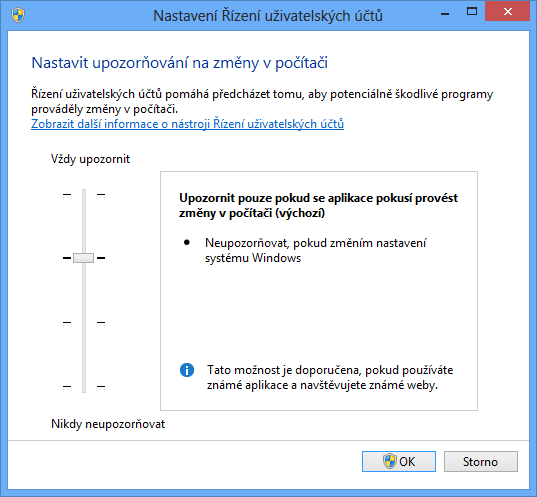

---

# Možnosti základního nastavení

- Vždy upozorňovat
- Upozorňovat pouze pokud se programy pokusí provést změny v počítači
  - Povolit provádění změn v systému Windows nástroji pocházejícími ze systému Windows (jsou podepsány)
- Upozorňovat pouze pokud se programy pokusí provést změny v počítači (nestmívat plochu)
- Nikdy neupozorňovat
  - Povolovat pro správce resp. zamítat pro standardního uživatele všechny žádosti o zvýšení oprávnění

<!--
Povolení provádění změn v systému Windows nástroji pocházejícími ze systému Windows (2. nastavení) snižuje počet oken (výzev) o cca. 2/3, jelikož většina úkolů, jenž vyžaduje elevaci oprávnění se týká změn nastavení systému Windows.
-->

---

# Pokročilé nastavení

<!-- REVIEW: ve Windows 11 se „Nástroje pro správu" v Ovládacích panelech jmenují „Nástroje Windows". -->

- Spuštění příkazem `gpedit.msc` nebo vyhledáním Upravit zásady skupiny (nachází se v Ovládacích panelech v sekci Nástroje pro správu)

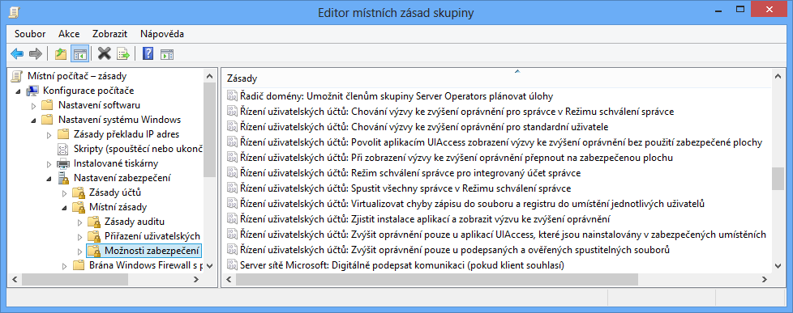

---

# Zásady ovlivňující chování UAC (1)

- Chování výzvy ke zvýšení oprávnění pro správce v Režimu schválení správce
  - Zvýšit bez zobrazení výzvy
  - Vyzvat k zadání souhlasu (na zabezpečené ploše)
  - Vyzvat k zadání pověření (na zabezpečené ploše)
  - Vyzvat k souhlasu pro binární soubory neurčené pro systém Windows (výchozí nastavení)
    - Požadovat souhlas pouze v případě, že zvýšení oprávnění vyžaduje aplikace, jenž není součástí systému Windows
- Spustit všechny správce v Režimu schválení správce
  - Zakázáním dojde k vypnutí UAC pro všechny správce
  - Ve výchozím nastavení povoleno

<!--
Vynucení zabezpečené plochy zde má přednost před jinými nastaveními týkajícími se zabezpečené plochy.
-->

---

# Zásady ovlivňující chování UAC (2)

- Režim schválení správce pro integrovaný účet správce
  - Povoluje Režim schválení správce pro uživatele Administrator
    - Účet Administrator je ve výchozím nastavení zakázán
  - Ve výchozím nastavení zakázáno (tedy automatické zvyšování oprávnění bez jakékoliv výzvy)
- Chování výzvy ke zvýšení oprávnění pro standardní uživatele
  - Automaticky zamítnout požadavky na zvýšení
  - Vyzvat k zadání pověření (na zabezpečené ploše)
  - Výchozí nastavení různé (u serverů většinou zadat pověření, u edicí Enterprise zamítnout, u Professional zadat pověření)

---

# Zásady ovlivňující chování UAC (3)

- Při zobrazení výzvy ke zvýšení oprávnění přepnout na zabezpečenou plochu
  - Při povolení vynucuje použití zabezpečené plochy při výzvách k zadání souhlasu / pověření
  - Při zakázání lze pořád vynutit použití zabezpečené plochy v nastavení chování výzev pro správce / standardní uživatele
  - Ve výchozím nastavení povoleno
- Zjistit instalace aplikací a zobrazit výzvu ke zvýšení oprávnění
  - Umožňuje instalátorům aplikací požadovat zvýšení oprávnění
  - Ve výchozím nastavení povoleno

<!--
I při povolené zabezpečené ploše je možné se před aktivováním zabezpečené plochy přepnout do jiného okna a pozdržet tím aktivaci zabezpečené plochy. Výzva pro elevaci oprávnění pak bliká na liště jako normální spuštěná aplikace. Při přepnutí na tuto výzvu se před jejím zobrazením aktivuje zabezpečená plocha, bezpečnost tedy není nikterak narušena (výzva se vykresluje až po zobrazení zašedlého snímku plochy).
-->

---

# Zásady ovlivňující chování UAC (4)

- Povolit aplikacím UIAccess zobrazení výzvy ke zvýšení oprávnění bez použití zabezpečené plochy
  - Povolením mohou uživatelé UIAccess aplikací (např. vzdálené pomoci) reagovat na výzvy ke zvýšení oprávnění
  - Ve výchozím nastavení zakázáno
- Zvýšit oprávnění pouze u aplikací UIAccess, které jsou nainstalovány v zabezpečených umístěních
  - Zakázání umožňuje každé aplikaci požadovat spuštění s úrovní integrity UIAccess (aplikace musí být ovšem pořád podepsána důvěryhodnou certifikační autoritou)
  - Výchozí nastavení je povoleno

---

# Zásady ovlivňující chování UAC (5)

- Zvýšit oprávnění pouze u podepsaných a ověřených spustitelných souborů
  - Všechny nepodepsané aplikace, případně aplikace podepsané nedůvěryhodným vydavatelem, nemůžou vyžadovat zvyšování oprávnění (automaticky zamítnuto)
  - Ve výchozím nastavení zakázáno
- Virtualizovat chyby zápisu do souboru a registru do umístění jednotlivých uživatelů
  - Povolení povolí přesměrování zápisů do chráněných adresářů a větví registru do profilu uživatele
  - Ve výchozím nastavení povoleno

<!--
Virtualizace může způsobovat problémy, pokud je potřeba sdílet zapsaná data nebo nastavení mezi uživateli (každý uživatel má svou vlastní kopii dat a nastavení).
-->

---

<!-- _class: section -->

# Autentizace a autorizace

<!-- header: 'Desktop systémy Microsoft Windows Autentizace a autorizace' -->

---

# Základní pojmy

- Autentizace (authentication)
  - Ověření identity uživatele důvěryhodnou autoritou (lokální bezpečnostní autoritou (LSA, Local Security Authority), řadičem domény, …)
  - Vytváří se tzv. přístupový token (access token)
- Autorizace (authorization)
  - Prokázání identity uživatele pro zpřístupnění určitého prostředku (souboru, adresáře, tiskárny, …)
  - Ověření oprávnění uživatele resp. skupin uložených v předloženém přístupovém tokenu

<!--
Změny příslušenství uživatele ve skupinách se projeví až po jeho novém přihlášení (kdy získá nový přístupový token).
-->

---

# Možnosti autentizace ve Windows 10

<!-- REVIEW: Windows 10 skončila podpora 10/2025 – přejmenovat na Windows 11; obrázkové heslo ve Windows 11
     už není v Nastavení, „Microsoft Passport" v poznámkách je dnes Windows Hello for Business / passkeys. -->

- Zadáním pověření (uživatelského jména a hesla)
  - Heslo může být standardní, obrázkové nebo PIN
- Čipovou kartou (smart card)
  - Dvoufaktorová autentizace pokud je použit i PIN
- Windows Hello (otisk prstu, rozpoznání obličeje)
- Vlastním způsobem vytvořením odpovídajícího poskytovatele pověření (credential provider)
  - Možnost kombinace rozdílných metod autentizace
    - Vícefaktorová autentizace, výrazně zvyšuje bezpečnost

<!--
Windows 8 podporuje také autentizaci biometrickým identifikátorem při startu počítače (boot-time biometric authentication).
Ve Windows 8 došlo k vylepšení integrace čteček otisků prstů a synchronizace hesel s otisky prstů.
Windows 10 podporuje 3 různé biometrické identifikátory – obličej, duhovku oka a otisk prstu (tzv. Windows Hello).
Microsoft Passport umožňuje svázat zařízení s Windows Hello nebo PINem pro docílení dvoufaktorové autentizace.
-->

---

# Nastavení hesel a uzamykání účtů

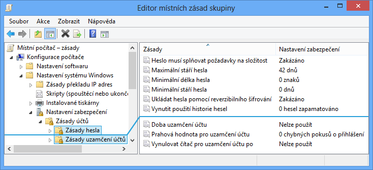

<!--
Složitá hesla musí obsahovat alespoň 3 typy znaků ze 4 (velká písmena, malá písmena, číslice, symboly).
Uzamykání účtů může způsobovat problémy např. při periodicky vykonávaných akcí (zálohování apod.), kdy někdo zablokuje účet, jenž je pro tuto akci používán.

Max stáří 0-999
Min délka 0-20
-->

---

# Možnosti řešení zapomenutí hesla

- Použití disku pro resetování hesla uživatelem
  - Data pro resetování hesla uložena na USB úložném zařízení (v nechráněné podobě)
  - Zachování všech osobních certifikátů (včetně EFS certifikátů) a hesel uložených ve Správci pověření
- Resetování hesla správcem
  - Ztráta osobních certifikátů (včetně EFS certifikátů) a hesel uložených ve Správci pověření

---

# Zálohování EFS certifikátů

- Export do .pfx souboru
  - Chráněn heslem
  - Obsahuje veřejný i privátní klíč
- 3 možnosti exportu
  - Přes průvodce Spravovat šifrovací certifikáty souborů
  - Přes MMC konzoli Certifikáty (`certmgr.msc`)
  - Příkazem `cipher /x <název>`

---

# Správce pověření

- Uchovává přihlašovací jména a hesla pro přístup k síťovým prostředkům (a webovým stránkám)
  - Možnost synchronizace s účtem Microsoft
  - Hesla nelze zobrazit
- Umožňuje zálohu a obnovu pověření
  - Migrace uložených pověření na jiný počítač
  - Zálohuje i některé certifikáty (ne certifikáty pro EFS)
  - Záloha chráněná heslem
  - Zálohování i obnova vždy přes zabezpečenou plochu

<!--
Při zálohování uživatelských dat se (pravděpodobně) nezálohují uložená pověření.
Před přechodem na zabezpečenou plochu je potřeba zvolit CRTL+ALT+DEL.
Ve Windows 7 byla pověření uložena v trezoru Windows (neboli Windows Vault), kterých mohlo existovat více než jeden. Ve Windows 8 nahradil trezor Windows tzv. Credential Locker, jenž může být pouze jeden, a spolu s účtem Microsoft (dříve Windows Live ID) ho lze nyní použít jako plnohodnotné SSO řešení. Všechna pověření uložená v Credential Locker jsou synchronizována s účtem Microsoft, což umožňuje např. se přihlásit do sytému Windows přes účet Microsoft namísto standardního zadání pověření. Tento roaming pověření ale znamená, že Credential Locker není možné uzamykat ani chránit heslem. Také není doporučováno používat roaming profily uživatelů zároveň s touto formou roamingu pověření, jelikož Credential Locker je uložen v profilu uživatelů.

Credential Locker W8 = Credential Manager W10
-->

---

# Čipové karty

- Obsahují certifikáty použitelné pro autentizaci
  - Možnost zneplatnění (revoke) certifikátu při odcizení
- Nativní podpora (ovladače) v systému Windows
- Jednoduchá integrace do Active Directory
- Podpora virtuálních čipových karet
  - Certifikáty jsou uloženy na TPM čipu namísto karty
- Nastavení přes zásady skupiny
  - Možnosti zabezpečení, část Interaktivní přihlašování

<!--
Od Windows 8 se spouští služba Čipová karta (Smart Card) jen pokud je připojena čtečka čipových karet (a zastavuje jakmile je odpojena), dříve běžela neustále.
-->

---

# Zásady čipových karet

- Požadovat čipovou kartu
  - Při povolení se není možné autentizovat bez použití čipové karty
  - Ve výchozím nastavení zakázáno
- Chování při odebrání čipové karty
  - Žádná akce (výchozí nastavení)
  - Uzamknout pracovní stanici
  - Vynutit odhlášení
  - Odpojit v případě relace Vzdálené plochy

---

# Spouštění programů pod jiným účtem

- Nástroj `runas [/profile | /noprofile] [/savecred | /smartcard] /user:<jméno> "<program>"`
- Spuštěný program běží pod zadaným uživatelem
  - Přístup k prostředkům realizován tímto uživatelem
- Možnost načtení / nenačtení profilu uživatele
  - Při načtení lze přistupovat k šifrovaným datům (EFS) daného uživatele (certifikáty jsou uloženy v profilu)
  - Nenačtení profilu urychluje spuštění programu, ale program nemusí pracovat správně

<!--
Nezapomínat na uvozovky při specifikaci programu (hlavně, když má být spouštěn s parametry).
-->

---

# Pověření a oprávnění

- Zadané pověření lze uložit ve Správci pověření
  - Přepínač `/savecred` pro uložení i použití pověření
- Pověření lze dodat na čipové kartě (smart card)
  - Přepínač `/smartcard` (nelze uložit přes `/savecred`)
- Všechny spouštěné programy běží s oprávněními standardního uživatele
  - Nelze zobrazovat výzvy k zadání souhlasu / pověření
  - Není možné provést zvýšení oprávnění jinak než plně automaticky

<!--
Pozor na ukládání pověření (lokálního) správce do trezoru Windows přes /savecred, oprávnění lze pak zneužít pro spouštění jiných aplikací.
-->

---

<!-- _class: section -->

# Omezování aplikací

<!-- header: 'Desktop systémy Microsoft Windows Omezování aplikací' -->

---

# Zásady omezení softwaru

<!-- REVIEW: Zásady omezení softwaru (SRP) Microsoft označil za zastaralé (nástupce AppLocker /
     App Control for Business, dříve WDAC) – rozhodnout, zda kapitolu ponechat, nebo jen jako historii. -->

- Podpora od Windows XP a Windows Server 2003
- Celkem 5 různých typů pravidel (podle priority)
  - Pravidla algoritmu hash
  - Pravidla certifikátu
  - Pravidla cesty
  - Pravidla zóny sítě
  - Výchozí pravidla
- Priorita podle specifičnosti pravidel
  - Více specifická pravidla mají vždy vyšší prioritu

---

# Výchozí pravidla

- Vždy může být aktivní pouze jedno
  - Výběr pod uzlem Úrovně zabezpečení
- Celkem 3 výchozí pravidla
  - Nepovoleno
    - Aplikace, jenž nejsou explicitně povoleny nesmí běžet
  - Standardní uživatel
    - Aplikace, jenž nevyžadují oprávnění správce mohou běžet
  - Bez omezení
    - Aplikace, jenž nejsou explicitně zakázány mohou běžet

<!--
Výchozí pravidla jsou zároveň akce u ostatních typů pravidel (říkají co dělat pokud dané pravidlo sedí).
-->

---

# Nastavení v zásadách skupiny

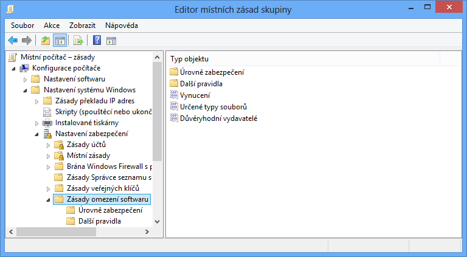

---

# Pravidla cesty

- Umožňují specifikovat soubory, adresáře či klíče registru (cesty ke klíčům registru)
  - Podpora zástupných znaků `*` a `?`
  - Podpora systémových proměnných (`%SystemRoot%`)
  - Klíče registru musí být uzavřeny mezi znaky `%`
- Závislé na umístění souboru
  - Lze obejít přesunutím (přejmenováním) souboru
- Pravidla obsahující více specifickou cestu mají vždy vyšší prioritu

---

# Pravidla algoritmu hash

- Umožňují specifikovat pouze soubory
- Generování digitálního otisku (hash) souboru
  - Generován na základě binárního obsahu
  - Unikátní pro každý soubor (i pro každou jeho verzi)
  - Mění se při jakékoliv změně souboru
- Potřeba úpravy při každé aktualizaci souboru
- Nezávislost na umístění souboru

---

# Pravidla certifikátu

- Umožňují specifikovat pouze certifikáty
  - Identifikují soubory podepsané zadaným certifikátem
- Nezávislost na umístění souboru
- Žádná potřeba úpravy při aktualizaci souboru
  - Soubor je pořád podepsán stejným certifikátem
- Nutnost ověřování validity certifikátu
  - Vyšší zatížení počítače
- Aplikovány na všechny soubory daného výrobce
- Musí být explicitně povoleny

<!--
U nástroje AppLocker se nijak explicitně neuvádí, že by ověřování validity certifikátu zatěžovalo počítač.
-->

---

# Pravidla zóny sítě

<!-- REVIEW: Internet Explorer je od 6/2022 vyřazen – zóny sítě dnes spravuje Edge / nastavení Internetu;
     rozhodnout, jak slide formulovat. -->

- Umožňují specifikovat jen .msi soubory získané přes Internet Explorer
- Omezování spouštění .msi souborů na základě typu sítě, z níž byly získány
  - Důvěryhodné servery
  - Internet
  - Místní intranet
  - Místní počítač
  - Servery s omezeným přístupem

---

# Vynucení a určené typy souborů

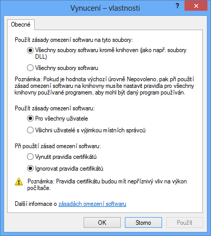

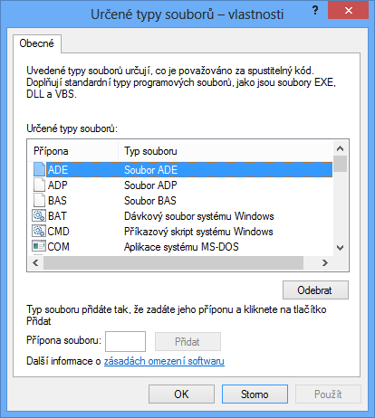

<!--
V případě omezování spouštění DLL knihoven je potřeba specifikovat povolující pravidla pro všechny DLL knihovny, jenž spouštěná aplikace používá, ne jen pro danou aplikaci.
-->

---

# AppLocker

<!-- REVIEW: dostupnost podle edice se změnila (Windows 10 2004+/Windows 11 i v edici Pro, Education);
     nástupce je App Control for Business (WDAC) – ověřit a upravit první odrážku. -->

- K dispozici pouze v edici Enterprise
  - Podpora od Windows 7 a Windows Server 2008 R2
- Pro správné fungování musí běžet služba Identita Aplikace (AIS, Application Identity Service)
  - Ve výchozím nastavení neběží (ruční start)
- Omezování běhu aplikací pro jednotlivé uživatele nebo skupiny
- Podpora automatického vytváření pravidel
  - Průvodce pro analýzu adresářů a generování pravidel

<!--
W10 – taky u Education
U Windows 7 je AppLocker k dispozici i v edici Ultimate, která u Windows 8 již neexistuje.
Při konfiguraci nástroje AppLocker je vhodné AIS nejprve spustit ručně a ověřit si, zda vše funguje jak má a teprve pak přepnout start AIS na automatické spouštění po startu počítače. Špatné nastavení nástroje AppLocker totiž může zablokovat celý systém (znemožnit spouštění důležitých součástí systému).
Při automatickém vytváření pravidel se generují pravidla vydavatele pro všechny podepsané soubory a pravidla cesty nebo algoritmu hash pro ostatní soubory.
-->

---

# Typy pravidel

- Pravidla vydavatele
  - Pracují s certifikáty (digitálně podepsané soubory)
  - Lze rozlišovat na úrovni vydavatele, názvu produktu, názvu souboru nebo verze souboru (<, >, =)
- Pravidla hodnoty hash souboru
  - Možnost počítat hodnotu hash pro všechny soubory v zadaném adresáři
- Pravidla cesty
  - Nelze definovat systémové proměnné (jen proměnné AppLocker) ani cesty ke klíčům registru

<!--
U pravidel vydavatele se nevybírá certifikát, ale digitálně podepsaný soubor.
Název souboru není název souboru v souborovém systému, ale v digitálním podpisu.
Pravidla vydavatele jsou nejflexibilnější, proto se primárně vytváří při automatickém generování pravidel.
Pravidla vydavatele umožňují rozlišovat soubory také na úrovni podepsán/nepodepsán.
Proměnných nástroje AppLocker je jen pár, např. proměnné odkazující na kořenové oddíly vyměnitelných zařízení.
-->

---

# Kolekce pravidel

- Pravidla pro spustitelné soubory
  - Aplikace na soubory s příponami .exe a .com
- Pravidla Instalační služby systému Windows
  - Aplikace na soubory s příponami .msi, .msp a .mst
- Pravidla pro skripty
  - Soubory s příponami .ps1, .bat, .cmd, .vbs a .js
- Pravidla souborů DLL (musí se nejprve povolit)
  - Soubory s příponami .dll a .ocx
- Pravidla pro zabalené aplikace

---

# Pravidla pro zabalené aplikace

<!-- REVIEW: „apps pro Modern UI" a .appx – dnes UWP/MSIX (.msix, .appxbundle); zvážit aktualizaci terminologie. -->

- Omezují běh apps (aplikací pro Modern UI)
  - Soubory s příponou .appx
- Odlišnosti od ostatních pravidel
  - Lze definovat pouze pravidla vydavatele
    - Mohou reagovat jen na název vydavatele, název aplikace (package name) a verzi aplikace (package version)
    - Všechny apps musí být digitálně podepsány
  - Omezují jak běh aplikace, tak její instalaci
  - Týkají se celé aplikace (všech jejích souborů)
    - Nelze omezovat konkrétní .exe nebo .dll soubory aplikace

---

# Výchozí pravidla

- Je možné generovat automaticky pro jednotlivé typy (kolekce) souborů
- Povolují spouštění souborů kdekoliv pro správce
- Pro spustitelné soubory, skripty a soubory DLL
  - Povolují spouštění souborů obsažených v adresářích Windows a Program Files pro všechny uživatele
- Pro soubory Instalační služby systému Windows
  - Povolují spouštění souborů obsažených v adresáři `Windows\Installer` a všech digitálně podepsaných souborů kdekoliv pro všechny uživatele

<!--
Většina výchozích pravidel jsou pravidla cesty, výjimkou jsou pravidla vydavatele povolující spouštění všech digitálně podepsaných souborů.
Pro zabalené aplikace se vytváří jediné výchozí pravidlo (pravidlo vydavatele) povolující spouštění všech digitálně podepsaných souborů jakýmkoliv uživatelem.
-->

---

# Nastavení v zásadách skupiny

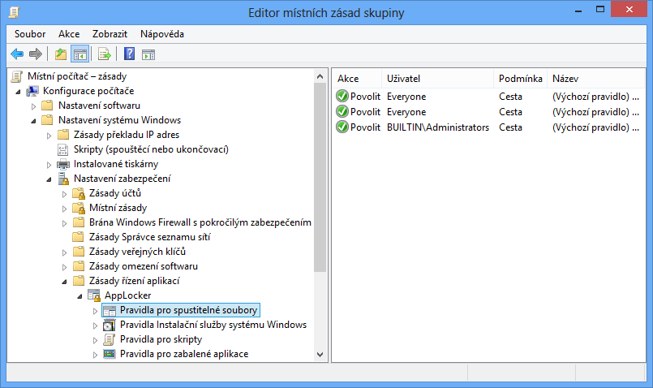

<!--
Pravidla souborů DLL se objeví teprve po jejich povolení na záložce upřesnit ve vlastnostech nástroje AppLocker. Ve Windows 8 se toto povolení z nějakého důvodu neukládá a platí pouze pro danou instanci (okno) Editoru místních zásad skupiny.
-->

---

# Priorita pravidel a výjimky

- Blokující pravidla (akce Odepřít)
- Povolující pravidla (akce Povolit)
- Integrované blokující pravidlo
  - Nelze změnit
  - Blokuje spouštění všech souborů
- Výjimky z pravidel
  - Mohou být ve formě pravidla vydavatele, cesty i hash
  - Lze definovat pro blokující i povolující pravidla
  - Lze definovat jen u pravidel vydavatele a cesty

---

# Auditování

- Monitorování aplikace AppLocker pravidel
  - Informace uloženy v protokolu AppLocker (Protokoly aplikací a služeb | Microsoft | Windows)
- Ukládají se informace
  - Název pravidla
  - SID cílového uživatele nebo skupiny
  - Cesta k souboru
  - Akce (spuštění povoleno nebo odepřeno)
  - Typ pravidla (vydavatel, hodnota hash, cesta)

---

# Nastavení auditování a povolení DLL

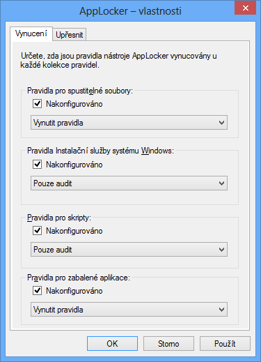

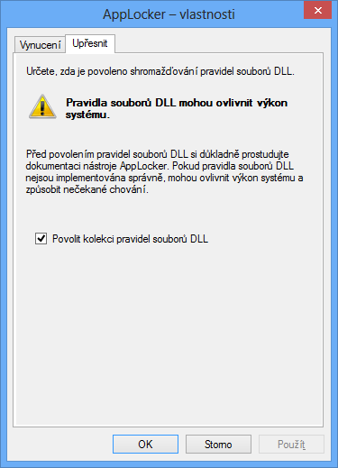

