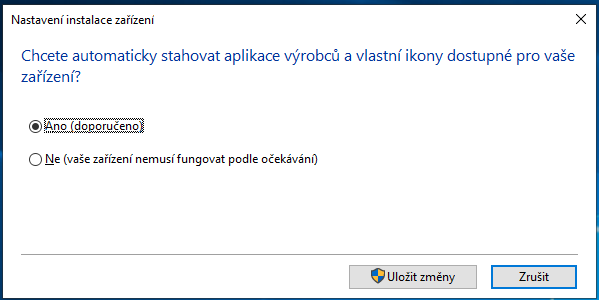
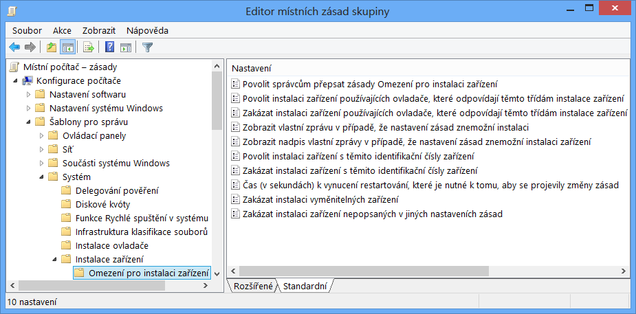
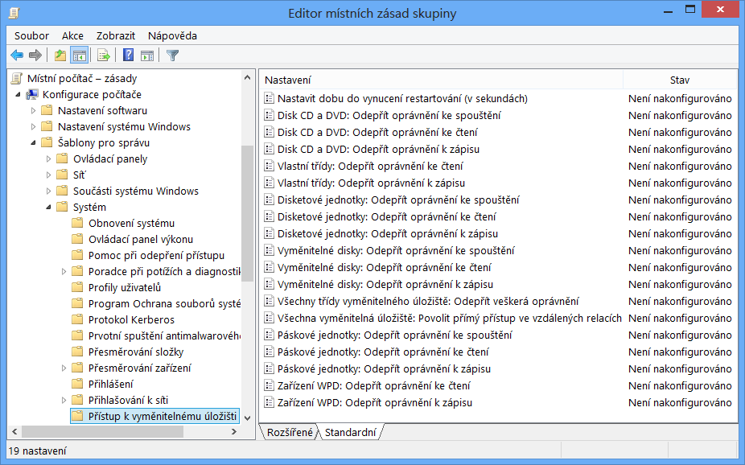
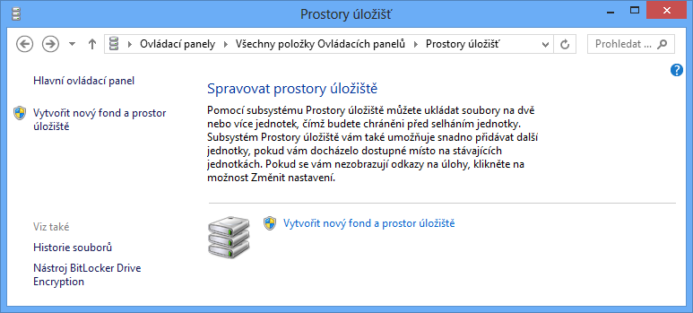
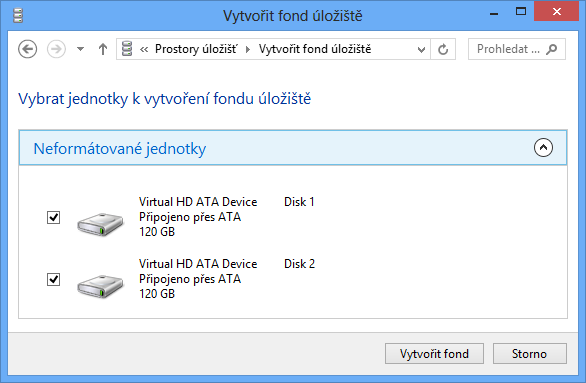
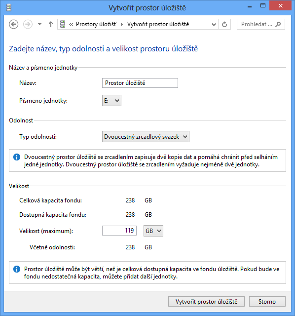
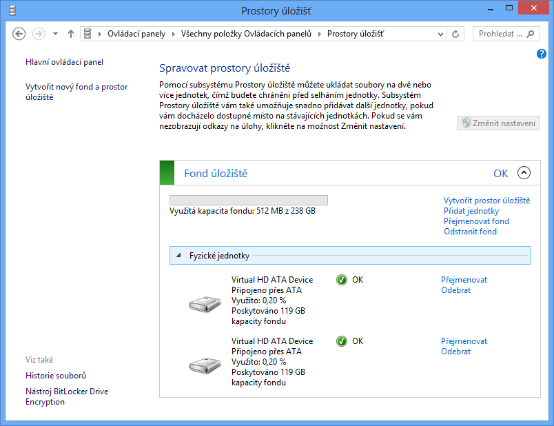
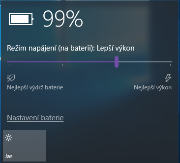
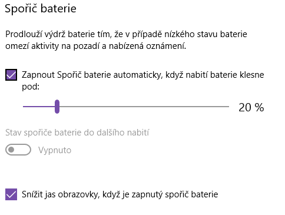
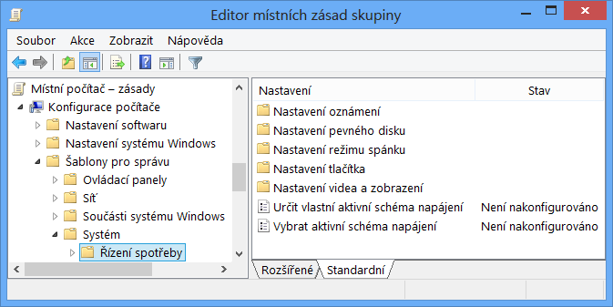

<!-- _class: title -->
<!-- _header: '' -->

# Desktop systémy Microsoft Windows

## IW1

Jan Pluskal\
pluskal@vut.cz

Fakulta informačních technologií\
Vysoké učení technické v Brně\
Božetěchova 2, 612 66 Brno

---

<!-- _class: section -->

# Správa zařízení

<!-- header: 'Desktop systémy Microsoft Windows Správa zařízení' -->

---

# Správce zařízení (Device Manager)

- Grafické rozhraní pro správu zařízení
  - Informace o ovladačích a prostředcích zařízení
  - Instalace, odinstalace a aktualizace ovladačů zařízení
  - Změna pokročilých nastavení nebo vlastností zařízení
- MMC konzole `devmgmt.msc`
- Možnost připojení k vzdálenému počítači
  - Spuštění pouze v režimu pro čtení (read-only mode)
- Některá zařízení jsou skrytá

<!--
Prostředky (resources) jsou např. úseky paměti, které dané zařízení používá (nejčastěji pro V/V a komunikaci).
Zhruba 200 MB paměti RAM bývá standardně využito zařízeními v počítači.
Pokročilá nastavení zařízení jsou často např. u (bezdrátových) síťových karet.
Ve vlastnostech zařízení jsou uvedeny (kromě jiného) různé identifikátory zařízení, jenž jsou potřeba např. při konfiguraci některých zásad v zásadách skupiny.
Připojení k jinému počítači lze provést buď vytvořením nové MMC konzole nebo např. přes Správu počítače, kde lze zvolit jiný než místní počítač.
-->

---

# Podrobnosti a upřesňující nastavení

<!--
Na záložce podrobnosti lze nalézt detailní informace o daném zařízení, jako je třeba jeho ID, podle kterého se např. určuje, který ovladač pro dané zařízení nainstalovat nebo zda se má vůbec instalace ovladače povolit.
Na záložce upřesnit lze nalézt pokročilé možnosti nastavení konkrétního zařízení, které se obecně liší pro každé zařízení. Pro bezdrátové síťové karty je například zajímavé nastavení bezdrátového režimu nebo vysílací energie, jenž může často pomoci při problémech se slabým signálem nebo s automatickým výběrem bezdrátového režimu, který část zařízení kolem nepodporuje.
-->

---

# Prostředky a řízení spotřeby

<!--
Dříve se stávalo, že více zařízení využívalo stejné IRQ a docházelo ke konfliktům, dnes lze IRQ sdílet mezi více zařízeními.
Konfliktní rozsahy paměti mezi různými zařízeními často vedly k BSOD.
Ukázat Správce zařízení:
 Zobrazení podle připojení je výhodné např. při zjišťovaní, ke kterému USB rozbočovači je připojeno nějaké zařízení.
 Pod skrytými zařízeními jsou hlavně nízkoúrovňové ovladače jádra (např. ovladač PC speakeru beep) a jiné non-PnP ovladače (odebráno ve Windows 8, lze ještě vypnout přes Ovládací Panely -> Zvuk).
 V podrobnostech o ovladači lze nalézt cesty k souborům ovladače.
-->

---

# Instalace ovladačů zařízení

- Automaticky
  - Pouze u Plug and Play (PnP) zařízení
  - Instalaci zajišťuje služba Plug and Play
  - Ovladač je vybrán na základě informací poskytnutých zařízením (ID Hardwaru apod.)
  - Ovladač musí být přítomen v úložišti ovladačů
- Manuálně
  - Instalace pomocí průvodce Přidat hardware
  - Ovladač vybrán uživatelem

<!--
Každý ovladač má ve svém .inf souboru uloženy identifikátory (ID hardwaru apod.), jenž určují, pro které zařízení je určen.
-->

---

# Aktualizace ovladačů zařízení

- Automaticky
  - Stažení z Windows Update a následná instalace
  - Lze vypnout v Nastavení instalace zařízení
    - V případě použití Windows Server Update Services (WSUS) automaticky vypnuto
- Manuálně
  - Pomocí průvodce Aktualizovat software ovladače

<!--
Ve Windows 8 a 10 nejsou stahovány aktualizace ovladačů, pokud je počítač připojen do sítě internet přes zpoplatněnou síť (metered connection).
-->

---

# Nastavení stahování ovladačů zařízení

- System properties -> Device installation settings

<!--
Dříve byly volby:
- provádět automaticky
- Ručně zvolit – vždy instalovat nejnovější z WU / nikdy neinstalovat z WU
-->

---

# Staging ovladačů zařízení

- Proces vyhledání, ověření a uložení ovladače zařízení do úložiště ovladačů (driver store)
- Může provádět kdokoliv (i standardní uživatel)
  - Od Windows 7 běží celý proces v kontextu systému bez jakékoliv interakce s uživatelem
- Vyhledávání ovladačů zařízení
  - Na webu Windows Update
  - V adresářích určených klíčem registru `DevicePath`
    - Obsažen v `HKEY_LOCAL_MACHINE\Software\Microsoft\Windows\CurrentVersion`

<!--
Ve Windows Vista mohli do úložiště ovladačů přidávat ovladače standardní uživatelé jen pokud to bylo povoleno v zásadách skupiny, jelikož přidávaní ovladačů do úložiště ovladačů probíhalo v kontextu administrátora, který vyžadoval, aby měl uživatel oprávnění správce. Pokud byl ovladač již v úložišti ovladačů, mohl jej nainstalovat i standardní uživatel (to probíhalo v kontextu systému), ale přidat ovladač z Windows Update nebo z nějakého adresáře nemohl (jelikož to probíhalo v kontextu administrátora). Ve Windows 7 probíhá přidávání ovladačů z Windows Update nebo adresářů do úložiště ovladačů v kontextu systému (a tedy není potřeba mít oprávnění správce), i normální uživatel tedy může provádět přidávání ovladačů do úložiště ovladačů.
-->

---

<!-- _class: dense -->

# Proces instalace zařízení

1. **Detekováno nové zařízení**
2. Identifikace zařízení
3. Nalezení vhodného referenčního ovladače v úložišti ovladačů
4. Je vhodnější ovladač na webu Windows Update?
   - **Ano** → staging ovladače zařízení
   - **Ne** → krok 5
5. Je vhodnější ovladač v adresářích určených klíčem DevicePath?
   - **Ano** → staging ovladače zařízení
   - **Ne** → krok 6
6. Je nyní vhodný ovladač v úložišti ovladačů?
   - **Ano** → **Nainstalován ovladač z úložiště ovladačů**
   - **Ne** → **Oznámena chyba**

**Staging ovladače zařízení**

1. Stažení ovladače
2. Ověření podpisu ovladače
3. Uložení ovladače do úložiště ovladačů

→ pokračuje krokem 6

<!--
Ověření ovladače zabraňuje standardnímu uživateli vložení pochybného ovladače do úložiště ovladačů.
U Windows Vista se mezi stažením ovladače a ověřením podpisu ještě ověřovalo, zda má uživatel oprávnění vložit daná ovladač do úložiště ovladačů.
V TK k W8 je proces instalace popsán částečně podle Windows Vista a částečně podle Windows 7, což ve výsledku vede k mixu, který nedává příliš smysl a obsahuje chyby.
-->

---

# Omezování instalací zařízení

- Nastavení v zásadách skupiny
- Týká se všech uživatelů na daném počítači (patří do sekce konfigurace počítače)
  - Pro správce lze nastavit ignorování všech omezení
- Probíhá na základě
  - Identifikačního čísla zařízení (vlastnosti ID hardwaru nebo ID kompatibility)
  - Třídy zařízení (třída musí být zadána ve formě GUID)
- Lze zakázat instalace vyměnitelných zařízení

<!--
Nelze omezovat vkládání ovladačů do úložiště ovladačů, to může provádět kterýkoliv uživatel (pokud je ovladač podepsán).
-->

---

# Zásady omezující instalace zařízení

---

<!-- _class: dense -->

# Proces povolení / zakázání instalace

1. **Detekováno nové zařízení, vhodný ovladač v úložišti ovladačů**
2. Je uživatel správce? — **Ano** → krok 3, **Ne** → krok 4
3. Je zásada *Povolit správcům přepsat zásady Omezení pro instalaci zařízení* povolena? — **Ano** → povolit instalaci, **Ne** → krok 4
4. Je zařízení uvedeno v některé zásadě zakazující instalaci? — **Ano** → zakázat instalaci, **Ne** → krok 5
5. Je zásada *Zakázat instalaci zařízení nepopsaných v jiných nastaveních zásad* povolena? — **Ne** → povolit instalaci, **Ano** → krok 6
6. Je zařízení uvedeno v některé zásadě povolující instalaci? — **Ano** → povolit instalaci, **Ne** → zakázat instalaci

Výsledek: **Povolit instalaci zařízení** nebo **Zakázat instalaci zařízení**

---

# Řešení problémů s ovladači zařízení

<!-- REVIEW: „Poslední známá funkční konfigurace“ (Last Known Good) byla odebrána od Windows 8 – rozhodnout, zda bod ponechat jako historii, nebo nahradit (Startup Repair / obnovení systému). -->

- Odinstalování ovladače nebo zakázání zařízení
- Navrácení (Roll Back) k předchozímu ovladači
  - Při aktualizaci ovladačů je jejich stará verze (pouze ta poslední) ponechána v úložišti ovladačů
- Obnovení systému (System Restore)
  - Obnovení obsahu úložiště ovladačů i nainstalovaných ovladačů zařízení
- Použití poslední známé funkční konfigurace
  - Použití posledních správně fungujících systémových nastavení (zahrnuje i nastavení ovladačů)

<!--
Ve Windows XP se uvádí, že 90-95% BSOD bylo způsobeno chybnými ovladači.
Při vypínání systému po úspěšném startu se zálohuje velká část konfigurace systému (větev registru CurrentControlSet) a k té se lze navrátit při použití poslední známé funkční konfigurace (zálohování se provádí do větví CurrentControlSet001 a CurrentControlSet002).
Pokud odinstalujeme ovladač, systém ho při první příležitosti nainstaluje zpět, pokud ho zároveň neodebereme z úložiště ovladačů (pomocí pnputil).
-->

---

# Ověřovač ovladačů (Driver Verifier)

- Nástroj pro monitorování běhu ovladačů
  - Musí běžet s oprávněními správce
- Možnost simulace
  - Nedostatku prostředků (paměti apod.)
  - Dlouhého vyřizování V/V požadavků
- Úspěšné provedení standardních testů je jednou z podmínek složení WHQL testů

<!--
Simulace dlouhého vyřizování V/V požadavků se provádí vložením velké časové prodlevy mezi zasláním požadavku na fyzické zařízení a vyřízením požadavku tímto zařízením. Tato simulace není součástí standardních testů, jelikož některé ovladače vyžadují rychlé vyřizování V/V požadavků pro svou správnou činnost.

WHQL = Windows Hardware Quality Labs
-->

---

<!-- _header: 'Desktop systémy Microsoft Windows Ověřovač ovladačů (Driver Verifier)' -->

# Ověřované vlastnosti

- Práce se vstupem a výstupem (V/V)
  - Detekce špatného používání V/V funkcí
- Přítomnost uváznutí (deadlock)
  - Ověřování práce se spin locky, mutexy a fast mutexy
- Práce s DMA
  - Detekce špatného používání DMA vyrovnávacích pamětí, adaptérů a překladových (map) registrů
- Práce s pamětí
  - Monitorování alokace a dealokace paměti

<!--
Překladové registry provádějí mapování mezi fyzickým a logickým paměťovým prostorem.
-->

---

<!-- _header: 'Desktop systémy Microsoft Windows Ověřovač ovladačů (Driver Verifier)' -->

# Nastavení a spuštění testů

- Spuštění standardních testů (vyžaduje restart)
  - `verifier /standard /driver <ovladač> [<ovladač> …]`
- Spuštění / vypnutí testů za běhu (`/volatile`)
  - `verifier /volatile /flags <příznaky-testů> {/adddriver | /removedriver} <ovladač> [<ovladač> …]`
- Nastavení simulace nedostatku prostředků
  - `verifier /volatile /faults <nastavení>`
- Získání informací o spuštěných testech
  - `verifier /querysettings`

<!--
Namísto konkrétních ovladačů lze vybrat všechny pomocí přepínače /all.
Testů je aktuálně (asi) 11.
U simulace nedostatku prostředků lze nastavovat i např. u které aplikace může dojít k nedostatku prostředků, jaká je pravděpodobnost, že selže alokace paměti apod.
-->

---

# Podpisy ovladačů

- Umožňují kontrolu integrity ovladače
  - Ověření, že nedošlo k modifikaci souboru ovladače
- Většina ovladačů podepsaných firmou Microsoft
  - Musí úspěšně projít sérií WHQL (Windows Hardware Quality Labs) testů
- Nepodepsané ovladače může ukládat do úložiště ovladačů / instalovat pouze správce
  - V případě 64-bitových verzí systému nikdo (je možné dočasně vypnout výběrem Zakázat vynucení podpisu ovladače při bootování, platí jen do dalšího restartu)

<!--
V doménách lze jednoduše podepisovat nepodepsané ovladače vlastními certifikáty, kterým důvěřují všechny počítače v doméně.
Při zakázání vynucení podpisu ovladače se počítač spouští v tzv. test režimu (test mode), který se liší od standardního běhu systému (MS neříká, jak se liší test režim od standardního režimu, nelze tedy říci, jaké dopady na systém, spouštěné aplikace atd. bude tento režim mít).
-->

---

# Ověřování podpisu ovladačů

- Pomocí nástroje Ověření podpisu souboru
  - Spuštění příkazem `sigverif`
  - Produkuje protokol s informacemi o ovladačích a kdo je podepsal
- Pomocí nástroje `driverquery`
  - `driverquery [/s <počítač>] /si [/fo {table | list | csv}]`
  - Vypisuje informace o ovladačích a zda jsou, či nejsou, podepsány ve formátu tabulky, seznamu nebo CSV
  - Možnost připojení k jinému počítači

---

<!-- _class: section -->

# Správa disků

<!-- header: 'Desktop systémy Microsoft Windows Správa disků' -->

---

# Údržba disku

<!-- REVIEW: Vyčištění disku (cleanmgr) je nahrazováno funkcí Smart úložiště (Storage Sense) v Nastavení – rozhodnout, zda ji zmínit. -->

- Nástroj Vyčištění disku
  - Odstraňuje soubory v koši, dočasné soubory aplikací a internetu, webové stránky offline, miniatury apod.
  - Správci mohou odstraňovat body obnovení a stínové kopie souborů
- Defragmentace disku
- Oprava chyb na disku

---

# Defragmentace disku

- Přeskupení dat souborů do souvislých bloků
  - Urychluje práci s diskem
- Je možné provádět u interních a externích disků, USB flash disků i virtuálních disků (VHD)
- Nelze provádět u síťových úložišť (disků apod.)
- Podpora pouze souborového systému NTFS
- Může běžet periodicky (jako naplánovaná úloha)
- Běží transparentně
  - Disk lze během defragmentace normálně používat

<!--
Úlohy pro defragmentaci disku jsou již předpřipraveny v plánovači úloh a jsou spouštěny kdykoliv je systém idle.
-->

---

<!-- _header: 'Desktop systémy Microsoft Windows Defragmentace disku' -->

# Nástroje pro defragmentaci

- Defragmentace vyžaduje oprávnění správce
- Nástroj `defrag` (pro příkazovou řádku)
  - `defrag {<oddíly> | /c | /e <oddíly>} [/a] [/h]`
  - Provede defragmentaci jednotlivých, všech (`/c`) nebo všech kromě zadaných (`/e`) oddílů disku
  - Použití přepínače `/a` spustí jen analýzu fragmentace
  - Přepínač `/h` spouští nástroj s normální prioritou
- Nástroj Defragmentace disku (grafický)
  - Umožňuje navíc plánovat periodické spouštění

<!--
Nástroj defrag používají jak naplánované úlohy pro defragmentaci disku i grafický nástroj Defragmentace disku.
-->

---

# Oprava chyb na disku

- Analýza chyb na disku (chyby se neopravují)
  - `chkdsk <oddíl>`
- Oprava všech chyb na disku
  - `chkdsk <oddíl> /f`
- Nalezení a označení chybných sektorů na disku
  - `chkdsk <oddíl> /r`
  - Označení na úrovni souborového systému (informace o chybných sektorech uloženy v metadatech NTFS)
  - Přesune čitelná data automaticky do jiných sektorů

<!--
chkdsk lze použít pro NTFS i FAT/FAT32 oddíly, některé jeho přepínače jsou ovšem k dispozici pouze pro NTFS oddíly.
Ve Windows 8 došlo k výraznému urychlení běhu chkdsk díky:
Vylepšenému samoopravování: NTFS automaticky opravuje řadu chyb bez nutnosti vůbec spouštět chkdsk.
Online analýza: dříve trávil chkdsk většinu času analýzou disku, nyní je tato fáze prováděna automaticky jako úloha na pozadí a navíc se kontroluje, zda objevená chyba není jen přechodná (transient) a chkdsk nemá tedy smysl vůbec spouštět, jelikož by žádnou chybu nenašel (přechodné chyby jsou velmi časté).
Urychlená oprava chyb: pokud je během analýzy nalezena chyba, oznámí to systém správci (skrz události nebo MMC konzole) a navrhne nejlepší řešení. Pokud je potřeba provést opravu pomocí chkdsk, není potřeba již dělat žádnou analýzu (ta už proběhla online) a rychlost opravy je dána počtem chyb (namísto souborů).
-->

---

# Přístup k odnímatelným úložištím

- Konfigurace pomocí zásad skupiny (pro počítače)
  - Povolení / zakázání čtení, zápisu a spouštění souborů
- Lze nastavovat pro
  - Disky CD a DVD
  - Disketové jednotky
  - Vyměnitelné disky (USB flash disky apod.)
  - Páskové jednotky
  - Zařízení WPD (mobilní telefony, přehrávače, …)
  - Vlastní zařízení (specifikace přes GUID třídy zařízení)

<!--
WPD (Windows Portable Device).
-->

---

<!-- _header: 'Desktop systémy Microsoft Windows Přístup k odnímatelným úložištím' -->

# Zásady pro omezování přístupu

<!--
Omezování přístupu se týká celého počítače (tzn. všech uživatelů na počítači včetně správců).
-->

---

# Typy disků (podle typu tabulky oddílů)

- MBR (Master Boot Record)
  - Tabulka oddílů v MBR, maximálně 4 oddíly (rozšířený oddíl ovšem může zahrnovat více logických oddílů)
  - Disky (a oddíly disků) mohou mít velikost až 2,2 TB
- GPT (GUID Partition Table)
  - Tabulka oddílů na začátku disku (za MBR), minimálně 16 KB velká (až 128 oddílů), záloha na konci disku
  - Disky (a oddíly disků) mohou mít velikost až 9,4 ZB
- Dynamický (Dynamic)

<!--
Rozšířené oddíly mohou obsahovat maximálně (asi) 63 logických oddílů.
U MBR disků je uložena velikost oddílu disku jako 32-bitové číslo, což by umožňovalo uložit velikost kolem 4GB, ovšem tato velikost není v bytech, ale v sektorech, které odpovídají 512 bajtům, takže dohromady dokážeme uložit velikost zhruba 2,2TB.
Informace o logických oddílech uvnitř rozšířených oddílů jsou uloženy na začátku každého rozšířeného oddílu, tedy mimo MBR.
S GPT přišel Intel (v roce myslím 1998, MBR byl v roce 1980) a tehdy řekl, že předpokládá, že kolem roku 2010 již nebude MBR dostačovat.
-->

---

# Převody mezi typy disků

- Umístění systémových oddílů na dynamických discích nesmí být po převodu změněno, jinak nebude možné z nich již bootovat

<table>
<tr><th colspan="2" rowspan="2">Tabulka převodů</th><th colspan="3">Cílový typ disku</th></tr>
<tr><th>MBR</th><th>GPT</th><th>Dynamický</th></tr>
<tr><th rowspan="3">Výchozí typ disku</th><th>MBR</th><td></td><td>Pokud disk neobsahuje žádné oddíly</td><td>Kdykoliv, ale disk se může stát nebootovatelným</td></tr>
<tr><th>GPT</th><td>Pokud disk neobsahuje žádné oddíly</td><td></td><td>Kdykoliv, ale disk se může stát nebootovatelným</td></tr>
<tr><th>Dynamický</th><td>Pokud disk neobsahuje žádné oddíly</td><td>Pokud disk neobsahuje žádné oddíly</td><td></td></tr>
</table>

---

# Dynamické disky

<!-- REVIEW: dynamické disky Microsoft označil za zastaralé (deprecated, náhradou jsou Prostory úložišť) – rozhodnout, zda blok o dynamických discích a jejich svazcích (snímky 29–39) zkrátit nebo ponechat jako kontext. -->

- Tabulka oddílů na konci disku (poslední 1 MB) ve formě LDM (Logical Disk Manager) databáze
- LDM databáze replikována na ostatní dynamické disky (sdílení a záloha informací o oddílech)
- Každá LDM databáze identifikována tzv. skupinou disku (disk group)
  - Při importu na počítač bez dynamických disků se tato skupina zachovává
  - Připojené disky s jinou skupinou se označují jako cizí a musí být manuálně importovány

<!--
Při rozdělování disku ve Správě disků nechává systém vždy na konci disku cca. 8MB volného místa pro případ, že by byl disk někdy konvertován na dynamický disk.
V případě, že se připojí dynamický disk k počítači bez dynamických disků (a ten přebere jeho skupinu disku) a následně se připojí zpět k původnímu počítači (kde je stejná skupina disku), může dojít k problémům s dynamickými disky. Není oficiální postup jak tuto situaci řešit, nejčastěji se přepisuje skupina disku na počítači (lze přepsat v registrech) na jinou, aby byly obě skupiny odlišné, ale MS negarantuje, že to bude fungovat.
-->

---

<!-- _header: 'Desktop systémy Microsoft Windows Dynamické disky' -->

# Typy oddílů (svazků)

- Svazky (volumes) tvořeny tzv. oblastmi disku
  - Oblasti jsou souvislé části diskového prostoru
- Typy svazků
  - Jednoduché (simple)
  - Rozložené (spanned)
  - Prokládané (striped, RAID-0)
  - Zrcadlené (mirrored, RAID-1)
  - Prokládané s paritou (RAID-5)

---

<!-- _header: 'Desktop systémy Microsoft Windows Typy oddílů (svazků) dynamických disků' -->

# Jednoduchý (simple) svazek

- Tvořen oblastmi z jediného disku
  - Lze použít jednu i více oblastí
  - Oblasti nemusí být stejné velikosti
- Obdoba oddílu u základních disků
- Podporuje změny velikosti

---

<!-- _header: 'Desktop systémy Microsoft Windows Typy oddílů (svazků) dynamických disků' -->

# Rozložený (spanned) svazek

- Tvořen oblastmi z více disků
  - Z každého disku lze použít jednu i více oblastí
  - Oblasti nemusí být stejné velikosti
- Data jsou ukládána postupně
- Zvyšuje riziko ztráty dat
  - Selhání jednoho disku způsobí selhání celého svazku
- Možnost rozšiřování svazku o další oblasti
  - Svazky naformátované jako FAT / FAT32 nelze rozšířit
- Lze vytvořit rozšířením jednoduchého svazku

---

<!-- _header: 'Desktop systémy Microsoft Windows Rozložený (spanned) svazek' -->

# Ilustrace průběhu zaplňování svazku

<b>Disk 1</b>

Svazek A<i>Blok 1</i><i>Blok 2</i><i>Blok 3</i><i>Blok 4</i>

Svazek B

Svazek A<i>Blok 5</i><i>Blok 6</i>

Data 1<i>Blok 1</i><i>Blok 2</i><i>Blok 3</i><i>Blok 4</i>

Data 2<i>Blok 5</i><i>Blok 6</i><i>Blok 7</i><i>Blok 8</i>

<b>Disk 2</b>

Svazek C

Svazek A<i>Blok 7</i><i>Blok 8</i>

Svazek D

---

<!-- _header: 'Desktop systémy Microsoft Windows Typy oddílů (svazků) dynamických disků' -->

# Prokládaný (striped) svazek (RAID-0)

- Tvořen oblastmi z alespoň dvou disků
  - Z každého disku lze použít jednu i více oblastí
  - Součet velikostí oblastí každého disku musí být stejný
- Data jsou ukládána prokládaně
  - Data rozdělena na malé části (stripes) a každá část je uložena do jiné oblasti (na jiný disk)
  - Zvyšuje rychlost čtení i zápisu
- Zvyšuje riziko ztráty dat
  - Selhání jednoho disku způsobí selhání celého svazku

---

<!-- _header: 'Desktop systémy Microsoft Windows Prokládaný (striped) svazek (RAID-0)' -->

# Ilustrace průběhu zaplňování svazku

<b>Disk 1</b>

Svazek A<i>Blok 1</i><i>Blok 3</i>

Svazek B

Svazek A<i>Blok 5</i><i>Blok 7</i>

Data 1<i>Blok 1</i><i>Blok 2</i><i>Blok 3</i><i>Blok 4</i>

Data 2<i>Blok 5</i><i>Blok 6</i><i>Blok 7</i><i>Blok 8</i>

<b>Disk 2</b>

Svazek A<i>Blok 2</i><i>Blok 4</i><i>Blok 6</i><i>Blok 8</i>

Svazek C

Svazek A

---

<!-- _header: 'Desktop systémy Microsoft Windows Typy oddílů (svazků) dynamických disků' -->

# Zrcadlený (mirrored) svazek (RAID-1)

- Tvořen oblastmi z právě dvou disků
  - Z každého disku lze použít jednu i více oblastí
  - Součet velikostí oblastí každého disku musí být stejný
- Data jsou uložena dvakrát
  - V obou oblastech (na obou discích) jsou vždy uložena stejná data
  - Poskytuje ochranu proti selhání disku
  - Neurychluje čtení
- Lze použít jako systémový oddíl (svazek)

<!--
Implementace od MS čte data vždy jen z jednoho disku, z druhého disku čte data jen tehdy, pokud se mu je nepodaří přečíst z prvního disku.
Jiné implementace (např. HW implementace) mohou číst ½ dat z jednoho disku a ½ dat z druhého, ale častěji to dělají tak, že přečtou data a obou disků zároveň a porovnají je, zda jsou shodné (aby detekovaly případné chyby při čtení a mohly díky tomu hlásit možné problémy s diskem).
-->

---

<!-- _header: 'Desktop systémy Microsoft Windows Zrcadlený (mirrored) svazek (RAID-1)' -->

# Ilustrace průběhu zaplňování svazku

<b>Disk 1</b>

Svazek A<i>Blok 1</i><i>Blok 2</i>

Svazek B

Svazek A<i>Blok 3</i><i>Blok 4</i><i>Blok 5</i><i>Blok 6</i>

Data 1<i>Blok 1</i><i>Blok 2</i><i>Blok 3</i><i>Blok 4</i>

Data 2<i>Blok 5</i><i>Blok 6</i>

<b>Disk 2</b>

Svazek A<i>Blok 1</i><i>Blok 2</i><i>Blok 3</i><i>Blok 4</i>

Svazek C

Svazek A<i>Blok 5</i><i>Blok 6</i>

---

<!-- _header: 'Desktop systémy Microsoft Windows Typy oddílů (svazků) dynamických disků' -->

# Prokládaný svazek s paritou (RAID-5)

<!-- REVIEW: „Ve Windows 10 není tento svazek podporován“ – platí i pro Windows 11 (klientské edice); po konci podpory Windows 10 aktualizovat verzi systému. -->

- Tvořen oblastmi z alespoň tří disků
  - Z každého disku lze použít jednu i více oblastí
  - Součet velikostí oblastí každého disku musí být stejný
- Data s paritou jsou ukládána prokládaně
  - Data rozdělena na malé části a každá část je uložena do jiné oblasti (na jiný disk), do jedné oblasti je vždy uložena komprimovaná parita dat ze zbylých oblastí
  - Poskytuje ochranu proti selhání disku
  - Zvyšuje rychlost čtení a částečně i zápisu
- Ve Windows 10 není tento svazek podporován

<!--
V TK vůbec nezmiňují, že Windows 7/8/10 nepodporuje RAID-5.
Nástroj diskpart při pokusu vytvořit svazek typu RAID-5 na Windows 7/8/10 hlásí chybu, že tento typ svazku není na daném OS podporován.
-->

---

<!-- _header: 'Desktop systémy Microsoft Windows Prokládaný svazek s paritou (RAID-5)' -->

# Ilustrace průběhu zaplňování svazku

Data 1<i>Blok 1</i><i>Blok 2</i><i>Blok 3</i><i>Blok 4</i>

Data 2<i>Blok 5</i><i>Blok 6</i><i>Blok 7</i><i>Blok 8</i>

<b>Disk 1</b>

Svazek A<i>Blok 1</i><i>Blok 3</i><i>Parita 5+6</i><i>Blok 7</i>

<b>Disk 2</b>

Svazek A<i>Blok 2</i><i>Parita 3+4</i><i>Blok 5</i><i>Blok 8</i>

<b>Disk 3</b>

Svazek A<i>Parita 1+2</i><i>Blok 4</i><i>Blok 6</i><i>Parita 7+8</i>

<!--
Parita rotuje, aby se vyvážila zátěž jednotlivých disků.
-->

---

# Prostory úložišť (Storage Spaces)

- Technologie pro virtualizaci (a správu) úložišť dat
  - Seskupování disků do fondů úložišť (storage pools)
  - Svazky (prostory úložišť) vytvářeny v rámci fondů
  - Důraz kladen na ochranu dat (ne zvýšení výkonu)
- Fondy úložišť mohou být tvořeny
  - Standardními interními disky
  - Externími USB disky
  - Virtuálními disky
- Podpora od Windows 8 a Windows Server 2012

<!--
Fondy úložišť (storage pools) jsou hybridní úložiště, mohou tedy obsahovat interní, USB i virtuální disky zároveň. V rámci jednoho fondu lze také kombinovat pevné i SSD disky.
U Windows Server lze navíc využívat kombinace pevných a SSD disků pro Storage Tiers a Write-Back Cache.
Storage Tiers umožňují používat SSD disky daného fondu pro uložení dat, ke kterým se často přistupuje, a (pomalejší) pevné disky pro zbylá data. Prostory úložišť pak automaticky přesunují data mezi SSD a pevnými disky podle frekvence přístupu k těmto datům. Výsledkem je urychlení přístupu k často používaným datům na daném svazku (v daném prostoru úložišť).
Write-Back Cache umožňuje kešovat náhodné zápisy menšího množství dat ve vyrovnávací paměti situované na SSD disku a zapsat je na (pomalý) pevný disk až později.
Prostory úložišť podporují také tzn. Thin Provisioning, jenž umožňuje vytvářet svazky o velikosti větší než je kapacita obsažených disků. V tomto případě budou svazky fyzicky zabírat jen tolik místa, kolik zabírají data, jenž obsahují (jako u dynamicky se rozšiřujících virtuálních disků, ovšem zde se mohou svazky kromě rozšiřování také zmenšovat při odstraňování dat). Jakmile začne docházet místo, jenž lze alokovat pro potřeby těchto svazků, bude uživatel upozorněn na tuto skutečnost a měl by doplnit další disky do fondů úložišť, jenž poskytuje místo pro tyto svazky.
-->

---

# Vytvoření nového fondu úložiště

<!--
Další disky mohou být přidány do fondu úložiště i po jeho vytvoření.
-->

---

# Vytvoření nového prostoru úložiště

---

<!-- _header: 'Desktop systémy Microsoft Windows Prostory úložišť (Storage Spaces)' -->

# Podporované typy svazků (1)

- Jednoduchý (bez odolnosti) (simple)
  - Obdoba rozloženého svazku u dynamických disků
    - Zapisuje se jediná kopie dat
    - Žádná ochrana proti selhání disku
  - Vyžaduje pouze 1 disk
- Dvoucestný zrcadlový svazek (two-way mirror)
  - Obdoba zrcadleného svazku u dynamických disků
    - Zapisují se 2 kopie dat
    - Ochrana proti selhání 1 disku
  - Vyžaduje alespoň 2 disky

---

<!-- _header: 'Desktop systémy Microsoft Windows Prostory úložišť (Storage Spaces)' -->

# Podporované typy svazků (2)

- Třícestný zrcadlový svazek (three-way mirror)
  - Zapisují se 3 kopie dat, ochrana proti selhání 2 disků
  - Vyžaduje alespoň 5 disků
- Parita (parity)
  - Obdoba prokládaného disku s paritou u dynamických disků
    - Zapisuje se jediná kopie dat spolu s informacemi o paritě
    - Informace o paritě rozprostřeny napříč použitými disky
    - Ochrana proti selhání 1 disku
  - Vyžaduje alespoň 3 disky

---

<!-- _class: section -->

# Správa napájení

<!-- header: 'Desktop systémy Microsoft Windows Správa napájení' -->

---

# Schémata napájení

<!-- REVIEW: Windows 10 skončil podporu 10/2025; Windows 11 standardně nabízí jen schéma Rovnováha a „režim napájení“ v Nastavení – rozhodnout, zda přepsat na Windows 11. -->

- Sada nastavení určujících jak má systém využívat energii, když je napájen z baterie nebo ze sítě
- Aplikují se na úrovni počítače
  - V jednom okamžiku může být aktivní jediné schéma
- Správa v Možnostech napájení
- Windows 10 obsahuje 3 základní schémata
  - Vysoký výkon
  - Rovnováha
  - Úsporný režim

---

<!-- _class: dense -->

# Změny ve verzi 1709 Fall Creators Update

<!-- REVIEW: historická verze Windows 10 (2017); ve Windows 11 je posuvník nahrazen volbou Režim napájení v Nastavení > Systém > Napájení – rozhodnout, zda snímek přeformulovat. -->

- Všechna schémata napájení mimo Rovnováha jsou při upgradu odstraněna (stále lze přidat vlastní)
- Do vlastností baterie přidán posuvník s možností ovlivnit v přednastavených krocích výkon a spotřebu
- Spořič baterie

---

# Podporované úsporné režimy (1)

- Režim spánku
  - Paměť RAM a zařízení, které mohou probudit počítač (klávesnice, myši, síťové karty) zůstávají zapnuty
  - Procesor a ostatní zařízení vypnuta
  - Rychlé probuzení počítače (vše pořád v paměti RAM)
- Hibernace
  - Veškerý obsah paměti RAM je uložen na disk (soubor `hiberfil.sys`)
  - Všechna zařízení jsou vypnuta
  - Při probuzení je obsah paměti RAM obnoven z disku

<!--
Hibernaci lze povolit nebo zakázat pomocí powercfg -H { on | off }.
Výchozí velikost souboru hiberfil.sys je 75% velikosti paměti RAM, lze změnit pomocí powercfg -H -Size <velikost-v-procentech>.
-->

---

# Podporované úsporné režimy (2)

- Hybridní režim spánku
  - Režim spánku při kterém se navíc obsah paměti RAM uloží na disk (soubor `hiberfil.sys`)
  - Rychlé probuzení počítače (použijí se data v paměti RAM, pokud nedošlo k vypnutí)
  - Chrání proti ztrátě dat v případě přerušení napájení
  - Často se používá u stolních počítačů (nemají baterii)

---

# Nastavení přes zásady skupiny

- Možnost nastavit, zda mohou otevřené soubory nebo aplikace znemožnit uspání počítače

<!--
Nastavení řízení spotřeby je pod konfigurací počítače.
-->

---

# Správa pomocí nástroje powercfg

- Umožňuje
  - Specifikovat zařízení, jenž mohou probouzet počítač
    - Přepínače `/deviceenablewake` a `/devicedisablewake`
  - Importovat a exportovat schémata napájení
    - Přepínače `/import` a `/export`
  - Specifikovat ovladače, aplikace a služby, jenž mohou zabránit přechodu do režimu spánku
    - Přepínač `/requestsoverride <typ> <název> System`
  - Nastavovat oprávnění pro provádění změn nastavení
    - Přepínač `/setsecuritydescriptor <guid> <sddl>`

<!--
Typ je driver, application nebo service, název je název ovladače, aplikace (.exe souboru) nebo služby, System říká, že se konfigurují nastavení týkající se přechodu do režimu spánku.
Ukázat powercfg /devicequery wake_programmable a powercfg /devicequery wake_armed, jenž zobrazí seznam zařízení, které jsou schopny, resp. aktuálně mohou, probudit počítač z úsporného režimu.
Ukázat powercfg /lastwake, jenž zobrazí informace o zařízení, které naposledy probudilo počítač z úsporného režimu.
-->
