<!-- _class: title -->
<!-- _header: '' -->

# Desktop systémy Microsoft Windows

## IW1

Jan Pluskal\
pluskal@vut.cz

Fakulta informačních technologií\
Vysoké učení technické v Brně\
Božetěchova 2, 612 66 Brno

---

<!-- _class: section -->

# Správa zařízení

<!-- header: 'Desktop systémy Microsoft Windows Správa zařízení' -->

---

# Správce zařízení (Device Manager)

- **Grafické rozhraní** pro správu zařízení (beze změn od Windows 7)
  - Informace o ovladačích a prostředcích zařízení
  - Instalace, odinstalace, aktualizace a vrácení ovladačů zařízení
  - Změna pokročilých nastavení nebo vlastností zařízení
- **MMC konzole** `devmgmt.msc` (též Nastavení > Systém > O systému > Související odkazy > *Správce zařízení*)
- Některá zařízení jsou **skrytá** (Zobrazit > *Zobrazit skrytá zařízení*)
- **Zobrazení:** podle typu / podle připojení, zařízení podle ovladače, ovladače podle typu
- **Historie:** připojení ke vzdálenému počítači bylo odebráno ve Windows 8 – dnes PowerShell remoting (`Get-PnpDevice`, `pnputil`)

<!--
Prostředky (resources) jsou např. úseky paměti, které dané zařízení používá (nejčastěji pro V/V a komunikaci).
Pokročilá nastavení zařízení jsou často např. u (bezdrátových) síťových karet.
Ve vlastnostech zařízení jsou uvedeny (kromě jiného) různé identifikátory zařízení, jenž jsou potřeba např. při konfiguraci některých zásad v zásadách skupiny.
Vzdálený přístup k RPC rozhraní Plug and Play byl odebrán ve Windows 8 / Windows Server 2012; Správce zařízení připojený ke vzdálenému počítači (např. přes Správu počítače) skončí chybou „Access denied“. Vzdáleně se dnes zařízení spravují přes PowerShell remoting: Invoke-Command -ComputerName PC01 { Get-PnpDevice -Status Error } nebo přes pnputil ve vzdálené relaci (Enter-PSSession).
Windows 11 nabízí běžnému uživateli přehled zařízení v Nastavení > Bluetooth a zařízení (Bluetooth, tiskárny, myš, dotykové zařízení, USB); odkaz „Další nastavení zařízení a tiskárny“ tam otevírá klasické Zařízení a tiskárny, ne Správce zařízení. Správce zařízení zůstává nástrojem správce; z Nastavení je odkazován ze stránky Systém > O systému (Související odkazy / Související nastavení – popisek ověřit na 25H2).
Zdroj: https://www.digitalcitizen.life/ways-open-device-manager-windows/
Zdroj: https://learn.microsoft.com/en-us/troubleshoot/windows-server/system-management-components/error-connect-device-manager-remotely
Zdroj: https://learn.microsoft.com/en-us/windows-hardware/drivers/install/viewing-hidden-devices
-->

---

# Podrobnosti a upřesňující nastavení

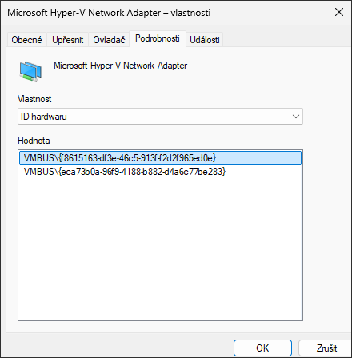

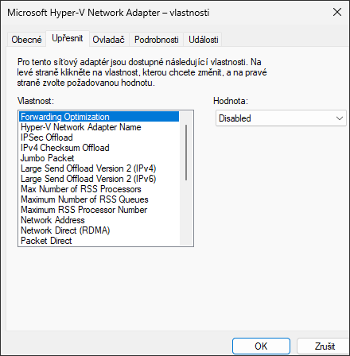

<!--
Na záložce Podrobnosti lze nalézt detailní informace o daném zařízení, jako je třeba jeho ID hardwaru, ID kompatibility nebo ID instance zařízení, podle kterých se např. určuje, který ovladač pro dané zařízení nainstalovat nebo zda se má vůbec instalace ovladače povolit (zásady omezení instalace zařízení).
Na záložce Upřesnit lze nalézt pokročilé možnosti nastavení konkrétního zařízení, které se obecně liší pro každé zařízení. Pro bezdrátové síťové karty je například zajímavé nastavení bezdrátového režimu nebo vysílací energie, jenž může často pomoci při problémech se slabým signálem nebo s automatickým výběrem bezdrátového režimu, který část zařízení kolem nepodporuje.
Snímky jsou z Windows 11 24H2 (síťový adaptér Microsoft Hyper-V).
-->

---

# Prostředky a řízení spotřeby

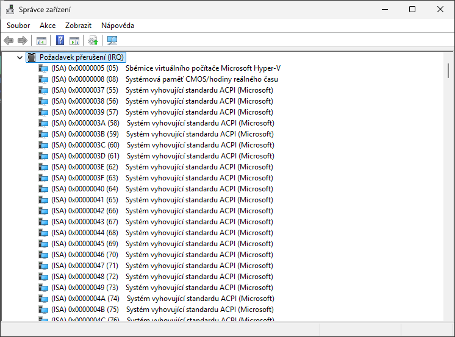

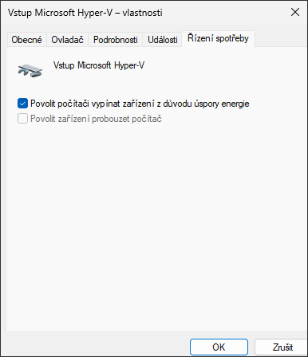

<!--
Dříve se stávalo, že více zařízení využívalo stejné IRQ a docházelo ke konfliktům, dnes lze IRQ sdílet mezi více zařízeními (u PCIe se používají MSI/MSI-X přerušení, konflikty prakticky nevznikají).
Konfliktní rozsahy paměti mezi různými zařízeními často vedly k BSOD.
Záložka Řízení spotřeby: „Povolit počítači vypínat zařízení z důvodu úspory energie“ a „Povolit zařízení probouzet počítač“ – totéž lze nastavit z příkazové řádky pomocí powercfg /deviceenablewake a /devicedisablewake (viz část Správa napájení).
Snímek Prostředky: Správce zařízení › Zobrazit › Prostředky podle typu (syntetická zařízení Hyper-V záložku Prostředky ve vlastnostech nemají); snímek Řízení spotřeby: vstupní zařízení HID (Windows 11 24H2).
Ukázat Správce zařízení:
 Zobrazení podle připojení je výhodné např. při zjišťovaní, ke kterému USB rozbočovači je připojeno nějaké zařízení.
 Pod skrytými zařízeními jsou hlavně nízkoúrovňové ovladače jádra a jiné non-PnP ovladače a dále zařízení, která už nejsou připojena (non-present devices).
 V podrobnostech o ovladači lze nalézt cesty k souborům ovladače.
-->

---

# Instalace ovladačů zařízení

- **Automaticky**
  - Pouze u Plug and Play (PnP) zařízení
  - Instalaci zajišťuje služba Plug and Play
  - Ovladač je vybrán na základě informací poskytnutých zařízením (ID hardwaru, ID kompatibility) a jeho hodnocení (*rank*)
  - Ovladač musí být přítomen v úložišti ovladačů (*driver store*, `%SystemRoot%\System32\DriverStore`)
- **Manuálně**
  - Ve Správci zařízení: Aktualizovat ovladač > *Vyhledat ovladače v počítači*
  - Průvodce *Přidat hardware* (`hdwwiz`) pro non-PnP zařízení
  - `pnputil /add-driver <inf> /install`
- Moderní ovladače: **Windows Drivers** (DCH – deklarativní, komponentizované, Hardware Support App)

<!--
Každý ovladač má ve svém .inf souboru uloženy identifikátory (ID hardwaru, ID kompatibility), jenž určují, pro které zařízení je určen. Pokud vyhovuje více ovladačů, vybírá se podle hodnocení (rank): přesnější shoda ID a podepsaný ovladač vyhrávají, datum a verze rozhodují až poté. Kandidáty pro konkrétní zařízení vypíše pnputil /enum-devices /instanceid <ID> /drivers.
DCH (Declarative, Componentized, Hardware Support Apps) jsou zásady návrhu ovladačů zavedené s Windows 10: instalace jen deklarativními direktivami INF (žádné co-installery), oddělení základního ovladače od rozšíření OEM a UI výrobce dodávané jako aplikace z Microsoft Store (HSA). Takové ovladače je možné servisovat nezávisle na OS a jsou základem pro distribuci přes Windows Update.
Zdroj: https://learn.microsoft.com/en-us/windows-hardware/drivers/develop/windows-driver-types
Zdroj: https://learn.microsoft.com/en-us/windows-hardware/drivers/devtest/pnputil-command-syntax
-->

---

<!-- _class: dense -->

# Aktualizace ovladačů zařízení

- **Automaticky** z Windows Update
  - Ovladače klasifikované výrobcem jako *automatic* se instalují s běžnými aktualizacemi
  - Ostatní jsou **volitelné**: Nastavení > Windows Update > Upřesnit možnosti > Volitelné aktualizace > *Aktualizace ovladačů*
  - Na měřených (*metered*) připojeních se ovladače nestahují
- **Manuálně**
  - Správce zařízení > *Aktualizovat ovladač* (automaticky / vyhledat v počítači)
  - Balíček od výrobce, `pnputil /add-driver <inf> /install`
- **Řízení ve firmě**
  - **Zásady skupiny**: *Do not include drivers with Windows Updates* (Windows Update > *Správa aktualizací nabízených ze služby Windows Update*)
  - **Microsoft Intune** – zásady aktualizací ovladačů (automatické / ruční schvalování, pozastavení)
  - **WSUS**: synchronizace ovladačů označena za zastaralou (2024), po zpětné vazbě zákazníků zatím pokračuje

<!--
Ve Windows 10/11 se ovladače z Windows Update dělí na „automatické“ (výrobce je označil jako povinné/doporučené – nainstalují se v rámci běžného vyhledávání aktualizací) a „manuální“ (zobrazí se ve Volitelných aktualizacích a uživatel si je musí vybrat). Windows Update také automaticky hledá ovladač při připojení nového zařízení, pro které není ovladač v úložišti.
Na měřených připojeních (metered connection) Windows aktualizace ovladačů nestahuje – platí od Windows 8.
Zásada „Do not include drivers with Windows Updates“ (Konfigurace počítače > Šablony pro správu > Součásti systému Windows > Windows Update > Správa aktualizací nabízených ze služby Windows Update; registr HKLM\SOFTWARE\Policies\Microsoft\Windows\WindowsUpdate\ExcludeWUDriversInQualityUpdate=1) vyloučí ovladače z kvalitativních aktualizací; ovladače nutné pro upgrade funkce se mohou nainstalovat i tak. Český název zásady v editoru ověřit na stanici.
Intune: Zařízení > Windows > Zásady aktualizací ovladačů (Windows driver update policies) – Intune předá schválené ovladače službě Windows Autopatch / Windows Update for Business deployment service, která řídí Windows Update na zařízeních. Režim automatického schvalování nasadí každý nový „doporučený“ ovladač po zvolené prodlevě; ruční režim vyžaduje schválení správcem. Vyžaduje Microsoft Entra joined / hybrid joined zařízení a odesílání diagnostických dat alespoň na úrovni Required.
WSUS: v červnu 2024 Microsoft oznámil konec synchronizace ovladačů do WSUS k 18. 4. 2025; 7. 4. 2025 na základě zpětné vazby rozhodnutí odložil a synchronizace ovladačů pokračuje (WSUS jako celek je deprecated od 9/2024, viz L12).
Zdroj: https://learn.microsoft.com/en-us/windows/deployment/update/waas-wu-settings
Zdroj: https://learn.microsoft.com/en-us/intune/device-updates/windows/manage-driver-updates
Zdroj: https://techcommunity.microsoft.com/blog/windows-itpro-blog/continuing-wsus-support-for-driver-synchronization/4401042
-->

---

# Nastavení stahování aplikací výrobců

- Nastavení > Systém > O systému > Upřesnit nastavení systému > Hardware > **Nastavení instalace zařízení**
- Týká se **aplikací výrobců** a vlastních ikon zařízení (*Hardware Support Apps*), ne samotných ovladačů

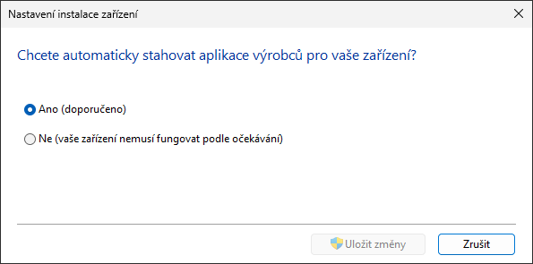

<!--
Dialog Nastavení instalace zařízení se od Windows 10 ptá jen na to, zda stahovat aplikace výrobců a vlastní ikony pro zařízení (dnes typicky Hardware Support Apps z Microsoft Store párované s DCH ovladačem). Samotné ovladače tímto dialogem vypnout nelze – k tomu slouží zásada Do not include drivers with Windows Updates (předchozí snímek).
Historie: ve Windows 7/8 zde byly volby „provádět automaticky“ / „ručně zvolit – vždy instalovat nejnovější z Windows Update / nikdy neinstalovat z Windows Update“.
Snímek je z Windows 11 24H2.
-->

---

# Staging ovladačů zařízení

- Proces vyhledání, ověření a uložení ovladače zařízení do **úložiště ovladačů** (*driver store*)
- Celý proces běží v **kontextu systému** bez interakce s uživatelem
  - Může jej vyvolat kdokoliv (i standardní uživatel), ovladač ale musí být podepsán
  - Přímo: `pnputil /add-driver <inf>` (vyžaduje správce)
- **Vyhledávání ovladačů zařízení**
  - Na webu Windows Update
  - V adresářích určených klíčem registru `DevicePath`
    - Obsažen v `HKEY_LOCAL_MACHINE\Software\Microsoft\Windows\CurrentVersion`
- **Historie:** ve Windows Vista probíhal staging v kontextu správce, standardní uživatel ho mohl spustit jen s povolením v zásadách skupiny

<!--
Ve Windows Vista mohli do úložiště ovladačů přidávat ovladače standardní uživatelé jen pokud to bylo povoleno v zásadách skupiny, jelikož přidávaní ovladačů do úložiště probíhalo v kontextu administrátora. Od Windows 7 probíhá přidávání ovladačů z Windows Update nebo adresářů do úložiště ovladačů v kontextu systému a není potřeba mít oprávnění správce – to platí i ve Windows 11.
Klíč DevicePath (výchozí %SystemRoot%\inf) se používá např. při přípravě bitových kopií s vlastními ovladači (viz L03) – doplní se do něj cesta ke sdílenému adresáři s ovladači; alternativou je DISM /Add-Driver do offline obrazu.
Zdroj: https://learn.microsoft.com/en-us/windows-hardware/drivers/install/driver-store
-->

---

<!-- _class: dense -->

# Proces instalace zařízení

1. **Detekováno nové zařízení**
2. **Identifikace** zařízení (ID hardwaru, ID kompatibility)
3. Nalezení vhodného referenčního ovladače v **úložišti ovladačů**
4. Je vhodnější ovladač na webu **Windows Update**?
   - **Ano** → staging ovladače zařízení
   - **Ne** → krok 5
5. Je vhodnější ovladač v adresářích určených klíčem `DevicePath`?
   - **Ano** → staging ovladače zařízení
   - **Ne** → krok 6
6. Je **nyní** vhodný ovladač v úložišti ovladačů?
   - **Ano** → **Nainstalován ovladač z úložiště ovladačů**
   - **Ne** → **Oznámena chyba** (zařízení se žlutým vykřičníkem)

**Staging ovladače zařízení**

1. **Stažení** ovladače
2. **Ověření podpisu** ovladače
3. **Uložení** ovladače do úložiště ovladačů

→ pokračuje krokem 6

<!--
Postup platí beze změny i pro Windows 11: PnP manažer nejdříve prohledá úložiště ovladačů, pak (pokud je to povoleno a připojení není měřené) Windows Update a adresáře v DevicePath; nalezený lepší ovladač se nejprve nastaguje do úložiště a až z něj se instaluje. Instalace samotná probíhá vždy jen z úložiště ovladačů.
Ověření podpisu zabraňuje standardnímu uživateli vložit pochybný ovladač do úložiště ovladačů.
Historie: u Windows Vista se mezi stažením ovladače a ověřením podpisu ještě ověřovalo, zda má uživatel oprávnění vložit daný ovladač do úložiště.
Zdroj: https://learn.microsoft.com/en-us/windows-hardware/drivers/install/how-windows-selects-a-driver-for-a-device
-->

---

<!-- _class: dense -->

# Správa ovladačů a zařízení z příkazové řádky

- `pnputil` – **primární nástroj** (součást Windows, vyžaduje správce)
  - `pnputil /enum-drivers` – výpis balíčků ovladačů třetích stran v úložišti (`oemNN.inf`)
  - `pnputil /add-driver <cesta>\*.inf /subdirs /install` – staging (a instalace) ovladačů
  - `pnputil /delete-driver oemNN.inf /uninstall /force` – odebrání z úložiště
  - `pnputil /export-driver * D:\Drivers` – záloha ovladačů před reinstalací
  - `pnputil /enum-devices /problem` – zařízení s chybou; `/enum-devices /instanceid <id> /drivers`
  - `pnputil /disable-device`, `/enable-device`, `/restart-device`, `/remove-device`, `/scan-devices`
- **PowerShell**
  - Modul **PnpDevice**: `Get-PnpDevice -Status Error`, `Get-PnpDeviceProperty`, `Disable-PnpDevice`
  - Modul **DISM**: `Get-WindowsDriver -Online`, offline obraz `Add-WindowsDriver` (viz L03)
- `driverquery /v`, `sigverif`, `verifier` – **diagnostika** (viz dále)

<!--
pnputil je od Windows 10 1607 plnohodnotný nástroj pro úložiště ovladačů (dříve jen -a/-d/-e), od 1903 vypisuje zařízení (/enum-devices), od 2004 umí zařízení zakázat/povolit/restartovat/odebrat a vyvolat hledání změn hardwaru (/scan-devices), od Windows 11 22H2 filtruje podle třídy a sběrnice a ve 23H2 přibylo /enum-devicetree a /enum-containers. Legacy syntaxe (-a, -d, -e) stále funguje.
Typický scénář: po reinstalaci Windows chybí ovladač síťové karty – před reinstalací pnputil /export-driver * D:\Drivers, po ní pnputil /add-driver D:\Drivers\*.inf /subdirs /install.
Pokud ovladač odinstalujeme jen ve Správci zařízení, systém ho při první příležitosti nainstaluje zpět z úložiště; je potřeba zaškrtnout „Odstranit software ovladače pro toto zařízení“ nebo použít pnputil /delete-driver … /uninstall.
Zdroj: https://learn.microsoft.com/en-us/windows-hardware/drivers/devtest/pnputil-command-syntax
Zdroj: https://learn.microsoft.com/en-us/powershell/module/pnpdevice/
-->

---

# Omezování instalací zařízení

- Nastavení v **zásadách skupiny** (Konfigurace počítače > Šablony pro správu > Systém > Instalace zařízení > *Omezení pro instalaci zařízení*) nebo v **Intune** (Policy CSP `DeviceInstallation`)
- Týká se **všech uživatelů** na daném počítači
  - Pro správce lze nastavit ignorování všech omezení
- Probíhá na základě
  - **ID instance zařízení** (konkrétní kus hardwaru)
  - **ID zařízení** (ID hardwaru nebo ID kompatibility)
  - **Třídy zařízení** (třída musí být zadána ve formě GUID)
- Lze zakázat instalaci **vyměnitelných zařízení**
- Novější zásada *Apply layered order of evaluation…* mění **pořadí vyhodnocení**: specifičtější kritérium vítězí

<!--
Nelze omezovat vkládání ovladačů do úložiště ovladačů, to může provádět kterýkoliv uživatel (pokud je ovladač podepsán). Omezuje se až instalace ovladače k zařízení.
Zásady s ID instance zařízení (Allow/Prevent installation of devices that match any of these device instance IDs) přibyly ve Windows 10 1809 – umožňují povolit jeden konkrétní kus hardwaru (např. jeden USB flash disk podle sériového čísla), zatímco zbytek třídy je zakázán.
Zásada „Apply layered order of evaluation for Allow and Prevent device installation policies across all device match criteria“ (doplněna kumulativní aktualizací z července 2021 (volitelná) / srpna 2021 do všech tehdy podporovaných Windows 10, tj. ADMX 1903+; Windows 11 ji má od začátku – „1809“ v příručce je jen dolní hranice podporovaných verzí): ve výchozím stavu má každé „Zakázat“ přednost před jakýmkoliv „Povolit“; po zapnutí platí hierarchie ID instance zařízení > ID zařízení > třída zařízení > vyměnitelná zařízení, takže konkrétnější pravidlo přepíše obecnější (typický scénář: zakázat všechna USB úložiště, povolit jeden firemní disk). Microsoft ji doporučuje v praxi zapnout. Český název zásady v editoru ověřit na stanici.
V Intune jsou stejné zásady dostupné v katalogu nastavení (Device Installation) a přes Policy CSP DeviceInstallation; pro USB úložiště se dnes častěji používá Device Control v Microsoft Defender for Endpoint.
Zdroj: https://learn.microsoft.com/en-us/windows/client-management/client-tools/manage-device-installation-with-group-policy
Zdroj: https://learn.microsoft.com/en-us/windows/client-management/mdm/policy-csp-deviceinstallation
Zdroj: https://techcommunity.microsoft.com/blog/windows-itpro-blog/introducing-the-ability-to-apply-layered-group-policy/2608462
-->

---

# Zásady omezující instalace zařízení

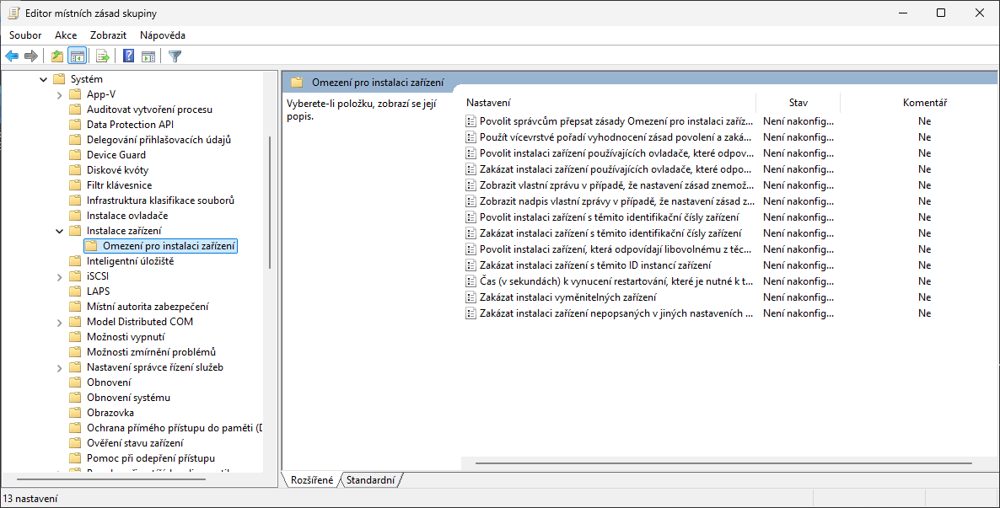

<!--
Snímek je z Windows 11 24H2 (Editor místních zásad skupiny). Oproti původním 10 zásadám z Windows 8 jsou ve složce navíc zásady pro ID instance zařízení (povolit/zakázat) a zásada „Apply layered order of evaluation for Allow and Prevent device installation policies across all device match criteria“.
-->

---

<!-- _class: dense -->

# Proces povolení / zakázání instalace

1. **Detekováno nové zařízení**, vhodný ovladač v úložišti ovladačů
2. Je uživatel **správce**? — **Ano** → krok 3, **Ne** → krok 4
3. Je zásada *Povolit správcům přepsat zásady Omezení pro instalaci zařízení* povolena? — **Ano** → povolit instalaci, **Ne** → krok 4
4. Je zařízení uvedeno v některé zásadě **zakazující** instalaci? — **Ano** → zakázat instalaci, **Ne** → krok 5
5. Je zásada *Zakázat instalaci zařízení nepopsaných v jiných nastaveních zásad* povolena? — **Ne** → povolit instalaci, **Ano** → krok 6
6. Je zařízení uvedeno v některé zásadě **povolující** instalaci? — **Ano** → povolit instalaci, **Ne** → zakázat instalaci

Výchozí pořadí: každé **Zakázat** má přednost před **Povolit**. Se zapnutou zásadou *Apply layered order of evaluation* se kroky 4–6 vyhodnocují po úrovních: **ID instance → ID zařízení → třída → vyměnitelná zařízení**; na první úrovni, kde je zařízení uvedeno, rozhodne Povolit/Zakázat.

<!--
Postup odpovídá výchozímu chování i ve Windows 11. Vrstvené vyhodnocení (layered order) umožňuje výjimky: např. zásada „Zakázat instalaci zařízení pro tyto třídy“ s GUID třídy USB úložišť a současně „Povolit instalaci zařízení odpovídajících těmto ID instance“ s jedním konkrétním diskem – ve výchozím režimu by zákaz vyhrál, ve vrstveném režimu vítězí konkrétnější ID instance.
Zdroj: https://learn.microsoft.com/en-us/windows/client-management/client-tools/manage-device-installation-with-group-policy
-->

---

# Řešení problémů s ovladači zařízení

- **Odinstalování ovladače** nebo **zakázání zařízení** (Správce zařízení, `pnputil`)
- **Navrácení** (*Roll Back*) k předchozímu ovladači
  - Při aktualizaci ovladačů je jejich stará verze (pouze ta poslední) ponechána v úložišti ovladačů
- **Nouzový režim a WinRE** (Nastavení > Systém > Obnovení > *Spuštění s upřesněným nastavením*)
  - Oprava spouštění (*Startup Repair*) se spustí automaticky po opakovaném selhání startu
- **Obnovení systému** (*System Restore*)
  - Obnovení obsahu úložiště ovladačů i nainstalovaných ovladačů zařízení
- **Historie:** Poslední známá funkční konfigurace (*Last Known Good*) byla odebrána ve Windows 8

<!--
Ve Windows XP se uvádělo, že 90–95 % BSOD bylo způsobeno chybnými ovladači; dnes je díky podepisování, Driver Verifier a HVCI podíl výrazně nižší, přesto zůstávají ovladače hlavní příčinou pádů jádra.
Poslední známá funkční konfigurace (záloha větve registru CurrentControlSet při úspěšném přihlášení, návrat přes F8) byla ve Windows 8 z nabídky spouštění odebrána ve prospěch automatické Opravy spouštění, Obnovení systému a Nouzového režimu; ve Windows 11 ji lze technicky znovu zapnout klíčem registru, Microsoft to ale nepodporuje. Rychlé spuštění a Modern Standby navíc znamenají, že klasické F8 menu není dostupné – do WinRE se vstupuje přes Nastavení > Systém > Obnovení > Spuštění s upřesněným nastavením > Restartovat nyní, přes Shift+Restartovat, nebo automaticky po dvou neúspěšných startech.
Pokud odinstalujeme ovladač, systém ho při první příležitosti nainstaluje zpět, pokud ho zároveň neodebereme z úložiště ovladačů (pnputil /delete-driver oemNN.inf /uninstall).
Navrácení ovladače: Vlastnosti zařízení > karta Ovladač > Vrátit zpět ovladač; Windows si uchovává jen jednu předchozí verzi.
Zdroj: https://support.microsoft.com/cs-cz/windows/aktualizace-ovladac%C5%AF-ve-windows-ec62f46c-ff14-c91d-eead-d7126dc1f7b6
-->

---

# Ověřovač ovladačů (Driver Verifier)

- Nástroj pro **monitorování běhu ovladačů** (`verifier.exe`, součást Windows 11)
  - Musí běžet s oprávněními správce
  - Nalezená chyba vyvolá BSOD s kódem chyby ověřovače – používat na testovacím stroji
- Možnost **simulace**
  - **Nedostatku prostředků** (paměti apod.)
  - **Dlouhého vyřizování V/V požadavků**
- Úspěšné provedení standardních testů je jednou z podmínek **certifikace ovladače** v programu Windows Hardware Compatibility Program (testy HLK)

<!--
Simulace dlouhého vyřizování V/V požadavků se provádí vložením velké časové prodlevy mezi zasláním požadavku na fyzické zařízení a vyřízením požadavku tímto zařízením. Tato simulace není součástí standardních testů, jelikož některé ovladače vyžadují rychlé vyřizování V/V požadavků pro svou správnou činnost.
Driver Verifier je určen pro vývoj a ladění ovladačů; na produkčním počítači může způsobit pád při startu. Pokud systém po zapnutí ověřovače nenastartuje, vypnout ho lze v nouzovém režimu příkazem verifier /reset nebo z WinRE (příkazový řádek).
WHQL = Windows Hardware Quality Labs – historický název; dnes Windows Hardware Compatibility Program (WHCP) s testy Windows Hardware Lab Kit (HLK).
Zdroj: https://learn.microsoft.com/en-us/windows-hardware/drivers/devtest/driver-verifier
-->

---

<!-- _header: 'Desktop systémy Microsoft Windows Ověřovač ovladačů (Driver Verifier)' -->

# Ověřované vlastnosti

- Práce se **vstupem a výstupem** (V/V)
  - Detekce špatného používání V/V funkcí
- Přítomnost **uváznutí** (*deadlock*)
  - Ověřování práce se spin locky, mutexy a fast mutexy
- Práce s **DMA**
  - Detekce špatného používání DMA vyrovnávacích pamětí, adaptérů a překladových (map) registrů
- Práce s **pamětí**
  - Monitorování alokace a dealokace paměti
- Soulad s pravidly ověřenými **DDI** (*Device Driver Interface*), kompatibilita s **HVCI**

<!--
Překladové registry provádějí mapování mezi fyzickým a logickým paměťovým prostorem.
Novější testy zahrnují např. „DDI compliance checking“ (správné použití funkcí jádra) a „Code integrity checks“ – ověření, že ovladač nealokuje paměť spustitelnou i zapisovatelnou zároveň, což je požadavek pro kompatibilitu s HVCI / Integritou paměti (viz snímek Podpisy ovladačů).
Zdroj: https://learn.microsoft.com/en-us/windows-hardware/drivers/devtest/driver-verifier-options
-->

---

<!-- _header: 'Desktop systémy Microsoft Windows Ověřovač ovladačů (Driver Verifier)' -->

# Nastavení a spuštění testů

- Spuštění **standardních testů** (vyžaduje restart)
  - `verifier /standard /driver <ovladač> [<ovladač> …]`
- Spuštění / vypnutí testů **za běhu** (`/volatile`)
  - `verifier /volatile /flags <příznaky-testů> {/adddriver | /removedriver} <ovladač> [<ovladač> …]`
- Nastavení **simulace nedostatku prostředků**
  - `verifier /volatile /faults <nastavení>`
- Získání **informací** o spuštěných testech
  - `verifier /querysettings`
- **Vypnutí** všech testů
  - `verifier /reset`

<!--
Namísto konkrétních ovladačů lze vybrat všechny pomocí přepínače /all – to však typicky vede k velmi pomalému systému a pádům, doporučuje se ověřovat jen podezřelé ovladače třetích stran.
Bez parametrů se verifier spustí jako grafický průvodce – ten (verifiergui.exe) je od 5/2024 zastaralý, Microsoft doporučuje jen příkazovou řádku verifier.exe.
Zdroj: https://learn.microsoft.com/en-us/windows/whats-new/deprecated-features (Driver Verifier GUI)
U simulace nedostatku prostředků lze nastavovat i např. u které aplikace může dojít k nedostatku prostředků, jaká je pravděpodobnost, že selže alokace paměti apod.
Zdroj: https://learn.microsoft.com/en-us/windows-hardware/drivers/devtest/driver-verifier-command-syntax
-->

---

<!-- _class: dense -->

# Podpisy ovladačů

- Kontrola **integrity a původu** ovladače (Authenticode podpis souboru `.cat`/`.sys`)
- Ovladače režimu jádra musí být podepsány **Microsoftem** (Windows 10 1607+ se Secure Boot, tj. každá instalace Windows 11)
  - Windows Hardware Dev Center: certifikace **WHCP** (testy HLK) nebo **attestation signing** (bez HLK, jen klient)
  - Výrobce potřebuje EV certifikát pro účet na portálu; cross-signing vlastním certifikátem skončil
- **HVCI / Integrita paměti** (Zabezpečení Windows > Zabezpečení zařízení > *Izolace jádra*)
  - Ovladače nekompatibilní s HVCI se nenačtou; ve výchozím stavu zapnuto na nových instalacích Windows 11
  - **Microsoft Vulnerable Driver Blocklist** – blokování známých zranitelných podepsaných ovladačů (výchozí od 22H2)
- **Nepodepsaný ovladač** jádra nelze načíst (Windows 11 je jen 64-bitový)
  - **Testovací režim**: `bcdedit /set testsigning on` nebo volba spouštění *Zakázat vynucení podpisu ovladače* (platí do dalšího restartu)

<!--
Od Windows 10 1607 (se zapnutým Secure Boot) nenačte Windows nové ovladače režimu jádra, které nejsou podepsány přes Windows Hardware Dev Center (Dev Portal). Výjimky: počítač upgradovaný z dřívější verze, Secure Boot vypnutý, nebo ovladač podepsaný certifikátem vydaným před 29. 7. 2015 s cross-certifikátem Microsoftu. Windows 11 vyžaduje UEFI Secure Boot jako hardwarový požadavek, takže v praxi platí pravidlo bez výjimky.
Cesty k podpisu: (a) certifikace WHCP – výrobce spustí testy Hardware Lab Kit (HLK), odešle logy a ovladač na portál, Microsoft podepíše; (b) attestation signing – výrobce jen deklaruje, že ovladač otestoval, podpis platí pouze pro klientské Windows 10/11 (ne Windows Server); (c) testovací podpis pro vývoj. Pro založení účtu na portálu je nutný EV (Extended Validation) code-signing certifikát.
HVCI (Hypervisor-protected Code Integrity, v Nastavení „Integrita paměti“ pod Izolací jádra) běží ověřování integrity kódu v odděleném prostředí VBS; ovladač musí splnit pravidla (např. žádná paměť současně zapisovatelná i spustitelná). Nekompatibilní ovladač Windows nenačte a Zabezpečení Windows ho zobrazí v seznamu „Nekompatibilní ovladače“. Na nových instalacích Windows 11 (22H2+) je integrita paměti zapnuta ve výchozím stavu; Windows 11 24H2 přinesla dalších rozšíření VBS.
Microsoft Vulnerable Driver Blocklist: seznam podepsaných, ale zranitelných ovladačů (používaných útoky typu BYOVD), který Windows blokuje; ve Windows 11 22H2+ je zapnut ve výchozím stavu a je součástí App Control for Business.
Při zakázání vynucení podpisu ovladače (položka 7 v Nastavení spouštění) se počítač spouští v tzv. testovacím režimu (test mode) – na ploše se zobrazuje vodoznak. Se zapnutým Secure Boot nelze bcdedit /set testsigning on použít.
V doménách lze nepodepsané ovladače podepsat vlastním certifikátem jen pro PnP instalaci (katalog), ovladač režimu jádra to však nezavede – k tomu je nutný podpis Microsoftu (nebo testovací režim).
Zdroj: https://learn.microsoft.com/en-us/windows-hardware/drivers/install/kernel-mode-code-signing-policy--windows-vista-and-later-
Zdroj: https://learn.microsoft.com/en-us/windows/security/application-security/application-control/app-control-for-business/design/microsoft-recommended-driver-block-rules
Zdroj: https://learn.microsoft.com/en-us/windows-hardware/design/device-experiences/oem-hvci-enablement
-->

---

# Ověřování podpisu ovladačů

- Pomocí nástroje **Ověření podpisu souboru**
  - Spuštění příkazem `sigverif`
  - Produkuje protokol s informacemi o ovladačích a kdo je podepsal
- Pomocí nástroje `driverquery`
  - `driverquery [/s <počítač>] /si [/fo {table | list | csv}]`
  - Vypisuje informace o ovladačích a zda jsou, či nejsou, podepsány ve formátu tabulky, seznamu nebo CSV
  - Možnost připojení k jinému počítači
- **PowerShell**: `Get-AuthenticodeSignature C:\Windows\System32\drivers\*.sys`
- `pnputil /enum-drivers` vypisuje poskytovatele a verzi každého balíčku

<!--
sigverif kontroluje podpisy systémových souborů a ovladačů a výsledek zapíše do %SystemRoot%\sigverif.txt.
Get-AuthenticodeSignature vrací pro každý soubor stav (Valid / NotSigned / HashMismatch) a certifikát podepisujícího – vhodné pro hromadnou kontrolu v Invoke-Command na více počítačích.
Zdroj: https://learn.microsoft.com/en-us/windows-server/administration/windows-commands/driverquery
-->

---

<!-- _class: section -->

# Správa disků

<!-- header: 'Desktop systémy Microsoft Windows Správa disků' -->

---

<!-- _class: dense -->

# Nástroje pro správu disků

- **Grafické**
  - Nastavení > Systém > Úložiště > Upřesnit nastavení úložiště > **Disky a svazky** (Windows 11)
  - **Správa disků** (`diskmgmt.msc`), Nástroje Windows > *Správa počítače*
- **Příkazová řádka**
  - `diskpart` – interaktivní (`list disk`, `select disk`, `clean`, `convert gpt`, `create partition`, `format`, `assign`); skripty `diskpart /s`
  - PowerShell modul **Storage**: `Get-Disk`, `Initialize-Disk -PartitionStyle GPT`, `New-Partition -UseMaximumSize -AssignDriveLetter`, `Format-Volume -FileSystem NTFS`, `Resize-Partition`, `Get-Volume`, `Optimize-Volume`, `Repair-Volume`
  - `mbr2gpt`, `chkdsk`, `defrag`, `fsutil`, `format`
- **Vzdáleně**: Windows Admin Center, PowerShell remoting, Storage Management API (WMI)

<!--
Windows 11 má správu disků na dvou místech: moderní Nastavení > Systém > Úložiště > Upřesnit nastavení úložiště > Disky a svazky (vytvoření/zmenšení/formátování svazku, změna písmene, Dev Drive, vlastnosti disku) a klasickou MMC konzoli Správa disků, která zůstává nezbytná pro dynamické disky, VHD a některé speciální operace.
diskpart a Správa disků stojí na Virtual Disk Service (VDS), kterou Microsoft postupně nahrazuje Windows Storage Management API (WMI, namespace ROOT\Microsoft\Windows\Storage) – nad ní stojí PowerShell modul Storage i Nastavení. Nové funkce (fondy Storage Spaces, Dev Drive) jsou dostupné jen novým API – diskpart je nevytvoří; svazek ReFS naformátovat umí (format fs=refs, kde to edice dovolí).
Zdroj: https://learn.microsoft.com/en-us/windows-server/administration/windows-commands/format (/FS: FAT, FAT32, NTFS, exFAT, ReFS, UDF)
Cvičení E02 používá diskpart pro GPT rozdělení disku před nasazením obrazu; stejný postup v PowerShellu: Get-Disk 0 | Clear-Disk -RemoveData; Initialize-Disk 0 -PartitionStyle GPT; New-Partition -DiskNumber 0 -Size 100MB -GptType '{c12a7328-f81f-11d2-ba4b-00a0c93ec93b}' … (viz L02).
Zdroj: https://learn.microsoft.com/en-us/powershell/module/storage/
Zdroj: https://learn.microsoft.com/en-us/windows/compatibility/vds-is-transitioning-to-windows-storage-management-api
-->

---

# Údržba disku

- **Uvolňování místa**
  - **Smart úložiště** (*Storage Sense*) – Nastavení > Systém > Úložiště: automatické mazání dočasných souborů, koše, souborů OneDrive dostupných jen online
  - *Doporučení k vyčištění*, *Dočasné soubory* (tamtéž)
  - Nástroj **Vyčištění disku** (`cleanmgr`) stále existuje – odstraňuje soubory v koši, dočasné soubory, miniatury; správci mohou odstraňovat body obnovení a stínové kopie
- **Optimalizace jednotek** (defragmentace HDD, TRIM u SSD)
- **Oprava chyb** na disku (`chkdsk`, `Repair-Volume`)

<!--
Storage Sense (v české lokalizaci Windows 11 „Smart úložiště“; web podpory Microsoftu překládá i jako „Inteligentní úložiště“) je ve Windows 10 1703+ a Windows 11 v Nastavení > Systém > Úložiště. Lze ho spouštět automaticky (denně/týdně/měsíčně/při nedostatku místa), nastavit mazání souborů v koši a ve složce Stažené soubory po N dnech a převod dlouho nepoužívaných souborů OneDrive na „pouze online“ (Soubory na vyžádání). Řídit ho lze zásadami skupiny (Konfigurace počítače > Šablony pro správu > Systém > Storage Sense) i přes Intune (Storage CSP).
Vyčištění disku (cleanmgr.exe) není označeno za zastaralé a je stále součástí Windows 11; jeho funkce jsou postupně přebírány stránkou Úložiště v Nastavení (Doporučení k vyčištění, Dočasné soubory), kde je i mazání předchozích instalací Windows (Windows.old) a souborů optimalizace doručení.
Zdroj: https://support.microsoft.com/cs-cz/windows/uvoln%C4%9Bn%C3%AD-m%C3%ADsta-na-disku-ve-windows-85529ccb-c365-490d-b548-831022bc9b32
Zdroj: https://learn.microsoft.com/en-us/windows/client-management/mdm/policy-csp-storage
-->

---

# Optimalizace jednotek

- HDD: **defragmentace** – přeskupení dat souborů do souvislých bloků
  - Urychluje práci s diskem (méně pohybů hlaviček)
- SSD/NVMe: **retrim** – předání seznamu nepoužitých bloků řadiči (TRIM/Unmap); klasická defragmentace je zbytečná a zkracuje životnost
  - Windows rozpozná typ média a volí správnou operaci
- Tenké svazky (Storage Spaces, VHDX): **konsolidace slabů** (*slab consolidation*)
- **Podporované souborové systémy**: NTFS, ReFS, FAT, FAT32; interní i externí disky, virtuální disky (VHD/VHDX)
- Nelze provádět u **síťových úložišť**
- Běží **periodicky** (naplánovaná úloha, výchozí týdně) a **transparentně** – disk lze normálně používat

<!--
Úloha Optimalizace jednotek je předpřipravena v Plánovači úloh (Microsoft\Windows\Defrag\ScheduledDefrag) a spouští se v rámci automatické údržby, typicky týdně, jen při napájení ze sítě. U SSD provádí naplánovaná úloha retrim a jednou měsíčně také „tradiční“ defragmentaci (kvůli fragmentaci metadat NTFS a limitu fragmentů souboru); ruční klasická defragmentace SSD ale není žádoucí.
TRIM je u SSD zapnut ve výchozím stavu (ověření: fsutil behavior query DisableDeleteNotify – hodnota 0 znamená TRIM zapnut). Retrim posílá hinty znovu pro všechny volné bloky, což pomáhá řadiči SSD s garbage collection.
Zdroj: https://learn.microsoft.com/en-us/windows-server/administration/windows-commands/defrag
-->

---

<!-- _header: 'Desktop systémy Microsoft Windows Optimalizace jednotek' -->

# Nástroje pro optimalizaci

- Vyžaduje **oprávnění správce**
- Nástroj `defrag` (pro příkazovou řádku)
  - `defrag {<svazky> | /c | /e <svazky>} [/o | /l | /x | /k] [/a] [/h] [/u] [/v]`
  - `/o` správná optimalizace podle typu média, `/l` retrim (SSD), `/x` konsolidace volného místa, `/k` konsolidace slabů
  - `/a` pouze analýza, `/h` normální priorita, `/u` průběh, `/v` podrobný výstup
  - `/c` všechny svazky, `/e` všechny kromě zadaných
- **PowerShell**: `Optimize-Volume -DriveLetter C -ReTrim -Verbose`, `-Defrag`, `-Analyze`, `-SlabConsolidate`
- Grafický nástroj **Defragmentovat a optimalizovat jednotky** (`dfrgui`)
  - Umožňuje navíc plánovat periodické spouštění

<!--
Nástroj defrag používají jak naplánovaná úloha, tak grafický nástroj Defragmentovat a optimalizovat jednotky (dfrgui.exe, dostupný i z vlastností svazku > Nástroje > Optimalizovat).
Svazek musí mít alespoň 15 % volného místa, aby defragmentace proběhla úplně.
Zdroj: https://learn.microsoft.com/en-us/windows-server/administration/windows-commands/defrag
Zdroj: https://learn.microsoft.com/en-us/powershell/module/storage/optimize-volume
-->

---

# Oprava chyb na disku

- **Analýza** chyb na disku (chyby se neopravují)
  - `chkdsk <svazek>`; online kontrola NTFS za běhu: `chkdsk <svazek> /scan`
- **Oprava chyb** v souborovém systému
  - `chkdsk <svazek> /f` (svazek musí být uzamčen – u systémového až při restartu)
  - `chkdsk <svazek> /spotfix` – oprava jen chyb nalezených online kontrolou (sekundy)
- Nalezení a označení **chybných sektorů** na disku
  - `chkdsk <svazek> /r`
  - Označení na úrovni souborového systému (informace uloženy v metadatech NTFS), čitelná data se přesunou
- **PowerShell**: `Repair-Volume -DriveLetter D -Scan | -SpotFix | -OfflineScanAndFix`
- **ReFS** opravuje metadata online sám (*integrity streams*), `chkdsk` nepotřebuje

<!--
chkdsk lze použít pro NTFS i FAT/FAT32/exFAT oddíly, některé přepínače (/scan, /spotfix, /b, /i, /c, /l) jsou k dispozici pouze pro NTFS.
Od Windows 8 je chkdsk výrazně rychlejší díky: (1) vylepšenému samoopravování – NTFS automaticky opravuje řadu chyb bez nutnosti chkdsk; (2) online analýze – dřívější zdlouhavá analytická fáze běží na pozadí za běhu (chkdsk /scan), přechodné chyby se ignorují; (3) spot fixing – nalezené chyby se zapíší do fronty ($corrupt) a oprava (chkdsk /spotfix, resp. při restartu) trvá jen sekundy, protože se opravují jen zaznamenané chyby, ne celý svazek. Grafické „Kontrola chyb“ ve vlastnostech svazku > Nástroje používá stejný mechanismus.
Na SSD není opakované chkdsk /r škodlivé, ale zbytečně zvyšuje počet zápisů; chybné sektory řeší firmware SSD.
Zdroj: https://learn.microsoft.com/en-us/windows-server/administration/windows-commands/chkdsk
Zdroj: https://learn.microsoft.com/en-us/powershell/module/storage/repair-volume
-->

---

# Přístup k odnímatelným úložištím

- Konfigurace pomocí **zásad skupiny** (Konfigurace počítače > Šablony pro správu > Systém > *Přístup k vyměnitelnému úložišti*) nebo **Intune**
  - Povolení / zakázání čtení, zápisu a spouštění souborů
- Lze nastavovat pro
  - **Disky CD a DVD**, disketové jednotky, páskové jednotky
  - **Vyměnitelné disky** (USB flash disky apod.)
  - **Zařízení WPD** (mobilní telefony, přehrávače, …)
  - **Vlastní zařízení** (specifikace přes GUID třídy zařízení)
- Ve firmách dnes navíc: **Device Control** v Microsoft Defender for Endpoint (pravidla podle výrobce/sériového čísla, audit) a **BitLocker To Go** (zápis jen na šifrované disky)

<!--
WPD (Windows Portable Device).
Zásady Přístup k vyměnitelnému úložišti existují beze změny ve Windows 11 a jsou i v Intune (katalog nastavení > Administrative Templates > System > Removable Storage Access, resp. Policy CSP RemovableStorageDevices). Omezují až přístup k souborovému systému zařízení; instalaci zařízení řeší zásady z první části přednášky.
Device Control v Microsoft Defender for Endpoint umožňuje jemnější pravidla (konkrétní výrobce, model, sériové číslo, jen čtení, audit s hlášením do portálu) a je dnes doporučovaným řešením pro USB úložiště v Intune-spravovaném prostředí.
Zásada BitLocker „Odepřít přístup pro zápis na vyměnitelné jednotky, které nejsou chráněny nástrojem BitLocker“ (viz L06) vynutí šifrování všech USB disků, na které se zapisuje.
Zdroj: https://learn.microsoft.com/en-us/windows/client-management/mdm/policy-csp-admx-removablestorage
Zdroj: https://learn.microsoft.com/en-us/defender-endpoint/device-control-overview
-->

---

<!-- _header: 'Desktop systémy Microsoft Windows Přístup k odnímatelným úložištím' -->

# Zásady pro omezování přístupu

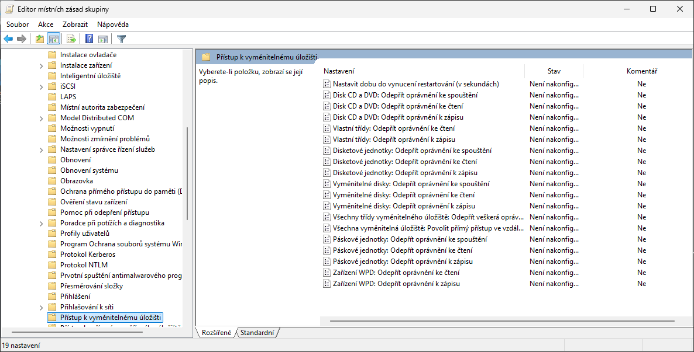

<!--
Omezování přístupu se týká celého počítače (tzn. všech uživatelů na počítači včetně správců); stejné zásady existují i v Konfiguraci uživatele.
Snímek je z Windows 11 24H2 (složka Přístup k vyměnitelnému úložišti).
-->

---

<!-- _class: dense -->

# Typy disků (podle stylu tabulky oddílů)

- **MBR** (*Master Boot Record*, 1983)
  - Tabulka oddílů v MBR, maximálně 4 primární oddíly (rozšířený oddíl může zahrnovat více logických oddílů)
  - Disky (a oddíly disků) mohou mít velikost až 2 TiB (32-bitový počet 512 B sektorů)
  - Nutný pro spouštění z BIOS (*legacy*); Windows 11 z MBR disku nelze nainstalovat
- **GPT** (*GUID Partition Table*, součást UEFI)
  - Ochranný MBR v prvním sektoru, za ním hlavička GPT a tabulka oddílů (min. 16 KiB, ve Windows až 128 oddílů), záloha na konci disku, kontrolní součty CRC32
  - Disky (a oddíly disků) mohou mít velikost až 9,4 ZB
  - Výchozí pro Windows 11: UEFI + Secure Boot jsou hardwarovým požadavkem, systémový disk je vždy GPT (oddíly EFI, MSR, Windows, WinRE)
- Nezávisle na stylu oddílů: **typ úložiště** základní (*basic*) nebo dynamický (*dynamic*)

<!--
Rozšířené oddíly mohou obsahovat maximálně (asi) 63 logických oddílů.
U MBR disků je uložena velikost oddílu jako 32-bitové číslo sektorů po 512 B, tedy 2^32 × 512 B = 2 TiB (≈ 2,2 TB). Disky s 4K nativními sektory mohou být v MBR větší, Windows je ale zavádí jen z GPT.
Informace o logických oddílech uvnitř rozšířených oddílů jsou uloženy na začátku každého rozšířeného oddílu, tedy mimo MBR.
GPT vznikl v rámci specifikace EFI (Intel, konec 90. let). Ochranný MBR (protective MBR) v LBA 0 obsahuje jediný oddíl typu 0xEE přes celý disk, aby staré nástroje disk nepřepsaly. Hlavička GPT je v LBA 1, položky oddílů (128 × 128 B = 16 KiB) v LBA 2–33; kopie hlavičky a tabulky je na konci disku. Teoretický limit 2^64 sektorů × 512 B ≈ 9,4 ZB.
Windows 11 vyžaduje UEFI se Secure Boot (hardwarový požadavek), instalátor proto vytváří GPT rozložení: EFI systémový oddíl (100 MB, FAT32), MSR (16 MB), oddíl Windows a oddíl nástrojů pro obnovení (WinRE, u 24H2 nejméně 250 MB navíc kvůli aktualizacím WinRE). Stejné rozložení se vytváří v cvičení E02 (diskpart).
Základní vs. dynamický disk je odlišný koncept (typ úložiště, storage type) než styl oddílů – oba typy úložiště mohou používat MBR i GPT.
Zdroj: https://learn.microsoft.com/en-us/windows/win32/fileio/basic-and-dynamic-disks
Zdroj: https://learn.microsoft.com/en-us/windows-hardware/manufacture/desktop/configure-uefigpt-based-hard-drive-partitions
-->

---

<!-- _class: dense -->

# Převody mezi styly a typy disků

- Správa disků / `diskpart convert {mbr | gpt | dynamic | basic}` – změna stylu vyžaduje **prázdný disk**
- `mbr2gpt /validate /disk:0 /allowFullOS`, `mbr2gpt /convert …` – systémový disk MBR → GPT **bez ztráty dat** (BIOS → UEFI, od Windows 10 1703)
- Umístění **systémových oddílů** na dynamických discích nesmí být po převodu změněno, jinak z nich nebude možné bootovat

<table>
<tr><th colspan="2" rowspan="2">Tabulka převodů</th><th colspan="3">Cílový typ disku</th></tr>
<tr><th>MBR</th><th>GPT</th><th>Dynamický</th></tr>
<tr><th rowspan="3">Výchozí typ disku</th><th>MBR</th><td></td><td>Pokud disk neobsahuje žádné oddíly (systémový disk: <code>mbr2gpt</code>)</td><td>Kdykoliv, ale disk se může stát nebootovatelným</td></tr>
<tr><th>GPT</th><td>Pokud disk neobsahuje žádné oddíly</td><td></td><td>Kdykoliv, ale disk se může stát nebootovatelným</td></tr>
<tr><th>Dynamický</th><td>Pokud disk neobsahuje žádné oddíly</td><td>Pokud disk neobsahuje žádné oddíly</td><td></td></tr>
</table>

<!--
mbr2gpt.exe převede systémový disk z MBR na GPT na místě: zmenší oddíl Windows, vytvoří EFI systémový oddíl a MSR, nakopíruje zavaděč a upraví BCD; po převodu je nutné ve firmwaru přepnout z legacy BIOS/CSM na UEFI. Podmínky: nejvýše 3 primární oddíly, žádný rozšířený/logický, dostatek místa pro ESP, disk s Windows 10 1703+ / Windows 11. Použití: nejprve /validate, poté /convert; z běžícího systému s přepínačem /allowFullOS, jinak z WinPE. Typický scénář: příprava starších stanic na upgrade na Windows 11 (UEFI + Secure Boot + TPM 2.0).
Převod základního disku na dynamický (a zpět) je stále možný, ale vzhledem k zastaralosti dynamických disků se nedoporučuje; zpět na základní disk lze převést jen prázdný disk (všechny svazky musí být smazány).
Zdroj: https://learn.microsoft.com/en-us/windows/deployment/mbr-to-gpt
Zdroj: https://learn.microsoft.com/en-us/windows-server/storage/disk-management/change-a-dynamic-disk-back-to-a-basic-disk
-->

---

<!-- _class: dense -->

# Dynamické disky (zastaralé)

- Microsoft označil dynamické disky za **zastaralé** (*deprecated*) pro všechna použití kromě zrcadleného systémového svazku – náhradou jsou Prostory úložišť (*Storage Spaces*)
  - Ve Windows 11 stále přítomny (Správa disků, `diskpart`), nové nasazení se nedoporučuje; Dev Drive a Storage Spaces na nich nefungují
- **Databáze LDM** (*Logical Disk Manager*) místo tabulky oddílů
  - MBR: poslední 1 MB disku; GPT: skrytý 1 MB oddíl
  - Replikována na ostatní dynamické disky (sdílení a záloha informací o svazcích)
- Každá LDM databáze identifikována tzv. **skupinou disku** (*disk group*)
  - Připojené disky s jinou skupinou se označují jako cizí a musí být manuálně importovány
- **Svazky** (*volumes*) tvořeny **oblastmi** (*extents*) – souvislými částmi diskového prostoru, i nesouvislými a z více disků

<!--
Zdroj deprecace: „For all usages except mirror boot volumes (using a mirror volume to host the operating system), dynamic disks are deprecated. For data that requires resiliency against drive failure, use Storage Spaces.“ Dynamické disky stojí na LDM a Virtual Disk Service (VDS), které Microsoft od Windows 8 / Server 2012 nahrazuje Windows Storage Management API; diskpart, Správa disků a dynamické disky zůstávají kvůli kompatibilitě.
Při rozdělování disku ve Správě disků nechává systém na konci disku cca 1 MB (dříve 8 MB) volného místa pro případ, že by byl disk někdy konvertován na dynamický disk.
V případě, že se připojí dynamický disk k počítači bez dynamických disků (a ten přebere jeho skupinu disku) a následně se připojí zpět k původnímu počítači (kde je stejná skupina disku), může dojít k problémům s dynamickými disky. Není oficiální postup jak tuto situaci řešit, nejčastěji se přepisuje skupina disku na počítači v registru; Microsoft negarantuje, že to bude fungovat.
Zdroj: https://learn.microsoft.com/en-us/windows/win32/fileio/basic-and-dynamic-disks
Zdroj: https://learn.microsoft.com/en-us/windows/compatibility/vds-is-transitioning-to-windows-storage-management-api
-->

---

<!-- _header: 'Desktop systémy Microsoft Windows Dynamické disky (zastaralé)' -->

# Typy svazků dynamických disků

- **Jednoduchý** (*simple*) – oblasti jediného disku, obdoba oddílu základního disku, lze rozšiřovat
- **Rozložený** (*spanned*) – oblasti více disků zaplňované postupně
- **Prokládaný** (*striped*, RAID-0)
- **Zrcadlený** (*mirrored*, RAID-1) – jediný typ, pro který dynamické disky nejsou zastaralé (zrcadlený systémový svazek)
- **Prokládaný s paritou** (RAID-5) – pouze Windows Server, klientské edice Windows 10/11 ho nepodporují
- **Rozložení dat** u jednotlivých typů popisují následující snímky – stejné principy používají i Prostory úložišť

<!--
Nástroj diskpart při pokusu vytvořit svazek typu RAID-5 na klientských Windows (7 až 11) hlásí chybu, že tento typ svazku není na daném OS podporován; ve Správě disků je volba „Nový svazek RAID-5“ zašedlá. Na klientu jsou dostupné jednoduché, rozložené, prokládané a zrcadlené svazky (zrcadlené ne v edici Home – neověřeno v dokumentaci, vychází z dotazů na Microsoft Q&A).
Svazky naformátované jako FAT/FAT32 nelze rozšířit; rozšíření vyžaduje NTFS (ReFS na dynamických discích není podporován).
Zdroj: https://learn.microsoft.com/en-us/windows/win32/fileio/basic-and-dynamic-disks
Zdroj: https://learn.microsoft.com/en-gb/answers/questions/1295275/windows-11-home-missing-new-mirror-volume-option
-->

---

<!-- _header: 'Desktop systémy Microsoft Windows Rozložení dat na více discích' -->

# Rozložený (spanned, JBOD) svazek

- Tvořen oblastmi z **více disků**
  - Z každého disku lze použít jednu i více oblastí
  - Oblasti nemusí být stejné velikosti
- Data jsou ukládána **postupně** (nejprve se zaplní první oblast)
- Zvyšuje **riziko ztráty dat**
  - Selhání jednoho disku způsobí selhání celého svazku
- Možnost **rozšiřování** svazku o další oblasti
  - Lze vytvořit rozšířením jednoduchého svazku
- Dynamické disky: rozložený svazek; Prostory úložišť: **neexistuje** (jednoduchý prostor data prokládá)

---

<!-- _header: 'Desktop systémy Microsoft Windows Rozložený (spanned) svazek' -->

# Ilustrace průběhu zaplňování svazku

<b>Disk 1</b>

Svazek A<i>Blok 1</i><i>Blok 2</i><i>Blok 3</i><i>Blok 4</i>

Svazek B

Svazek A<i>Blok 5</i><i>Blok 6</i>

Data 1<i>Blok 1</i><i>Blok 2</i><i>Blok 3</i><i>Blok 4</i>

Data 2<i>Blok 5</i><i>Blok 6</i><i>Blok 7</i><i>Blok 8</i>

<b>Disk 2</b>

Svazek C

Svazek A<i>Blok 7</i><i>Blok 8</i>

Svazek D

<!--
Svazek A je tvořen třemi oblastmi (dvěma na disku 1, jednou na disku 2); data se zapisují postupně – nejprve se zaplní první oblast, potom druhá atd.
-->

---

<!-- _header: 'Desktop systémy Microsoft Windows Rozložení dat na více discích' -->

# Prokládaný (striped) svazek (RAID-0)

- Tvořen oblastmi z **alespoň dvou disků**
  - Součet velikostí oblastí každého disku musí být stejný
- Data jsou ukládána **prokládaně**
  - Data rozdělena na malé části (*stripes*) a každá část je uložena do jiné oblasti (na jiný disk)
  - Zvyšuje rychlost čtení i zápisu
- Zvyšuje **riziko ztráty dat**
  - Selhání jednoho disku způsobí selhání celého svazku
- Dynamické disky: prokládaný svazek; Prostory úložišť: **jednoduchý prostor** (*simple*, bez odolnosti)

---

<!-- _header: 'Desktop systémy Microsoft Windows Prokládaný (striped) svazek (RAID-0)' -->

# Ilustrace průběhu zaplňování svazku

<b>Disk 1</b>

Svazek A<i>Blok 1</i><i>Blok 3</i>

Svazek B

Svazek A<i>Blok 5</i><i>Blok 7</i>

Data 1<i>Blok 1</i><i>Blok 2</i><i>Blok 3</i><i>Blok 4</i>

Data 2<i>Blok 5</i><i>Blok 6</i><i>Blok 7</i><i>Blok 8</i>

<b>Disk 2</b>

Svazek A<i>Blok 2</i><i>Blok 4</i><i>Blok 6</i><i>Blok 8</i>

Svazek C

Svazek A

<!--
Bloky se střídavě zapisují na disk 1 a disk 2, čtení i zápis tak probíhají paralelně. U Prostorů úložišť je „stripe“ tvořen slaby o velikosti 256 MB rozloženými přes všechny disky fondu.
-->

---

<!-- _header: 'Desktop systémy Microsoft Windows Rozložení dat na více discích' -->

# Zrcadlený (mirrored) svazek (RAID-1)

- Tvořen oblastmi z **právě dvou disků**
  - Součet velikostí oblastí každého disku musí být stejný
- Data jsou uložena **dvakrát**
  - V obou oblastech (na obou discích) jsou vždy uložena stejná data
  - Poskytuje ochranu proti selhání jednoho disku
  - Neurychluje čtení (implementace Microsoftu čte jen z jednoho disku)
- Lze použít jako **systémový svazek**
- Dynamické disky: zrcadlený svazek; Prostory úložišť: **dvoucestné zrcadlení** (2 kopie), **třícestné zrcadlení** (3 kopie, 5 disků)

<!--
Implementace od MS čte data vždy jen z jednoho disku, z druhého disku čte data jen tehdy, pokud se mu je nepodaří přečíst z prvního disku.
Jiné implementace (např. HW implementace) mohou číst ½ dat z jednoho disku a ½ dat z druhého, ale častěji to dělají tak, že přečtou data z obou disků zároveň a porovnají je, zda jsou shodné (aby detekovaly případné chyby při čtení a mohly díky tomu hlásit možné problémy s diskem).
U Prostorů úložišť zrcadlení kombinuje kopírování s prokládáním: dvě (tři) kopie každého slabu jsou uloženy na různých discích fondu, přes více než 2 disky se navíc prokládají – dvoucestné zrcadlení tak čte rychleji než jeden disk.
-->

---

<!-- _header: 'Desktop systémy Microsoft Windows Zrcadlený (mirrored) svazek (RAID-1)' -->

# Ilustrace průběhu zaplňování svazku

<b>Disk 1</b>

Svazek A<i>Blok 1</i><i>Blok 2</i>

Svazek B

Svazek A<i>Blok 3</i><i>Blok 4</i><i>Blok 5</i><i>Blok 6</i>

Data 1<i>Blok 1</i><i>Blok 2</i><i>Blok 3</i><i>Blok 4</i>

Data 2<i>Blok 5</i><i>Blok 6</i>

<b>Disk 2</b>

Svazek A<i>Blok 1</i><i>Blok 2</i><i>Blok 3</i><i>Blok 4</i>

Svazek C

Svazek A<i>Blok 5</i><i>Blok 6</i>

<!--
Každý blok je uložen na obou discích; rozložení oblastí na jednotlivých discích se může lišit, důležité je, že celková kapacita oblastí na obou discích je shodná.
-->

---

<!-- _header: 'Desktop systémy Microsoft Windows Rozložení dat na více discích' -->

# Prokládaný svazek s paritou (RAID-5)

- Tvořen oblastmi z **alespoň tří disků**
  - Součet velikostí oblastí každého disku musí být stejný
- Data s paritou jsou ukládána **prokládaně**
  - Data rozdělena na malé části a každá část uložena do jiné oblasti (na jiný disk), do jedné oblasti je vždy uložena parita (XOR) dat ze zbylých oblastí
  - Poskytuje ochranu proti selhání jednoho disku
  - Zvyšuje rychlost čtení; zápis zpomaluje výpočet parity
- Dynamické disky: pouze Windows Server; Prostory úložišť: **parita** (3+ disků, i na klientu), **duální parita** (7+ disků, 2 selhání)

<!--
Klientské edice Windows (7 až 11) svazky RAID-5 na dynamických discích nepodporují (diskpart hlásí nepodporovaný typ svazku). Ochranu proti selhání disku s paritou nabízí na klientu Prostory úložišť (odolnost Parita).
Parita v Prostorech úložišť je vhodná pro sekvenční zápis velkých souborů (archivy, zálohy); pro náhodné zápisy se doporučuje zrcadlení kvůli režii výpočtu parity (read-modify-write).
Zdroj: https://support.microsoft.com/en-us/windows/storage-spaces-in-windows-b6c8b540-b8d8-fb8a-e7ab-4a75ba11f9f2
-->

---

<!-- _header: 'Desktop systémy Microsoft Windows Prokládaný svazek s paritou (RAID-5)' -->

# Ilustrace průběhu zaplňování svazku

Data 1<i>Blok 1</i><i>Blok 2</i><i>Blok 3</i><i>Blok 4</i>

Data 2<i>Blok 5</i><i>Blok 6</i><i>Blok 7</i><i>Blok 8</i>

<b>Disk 1</b>

Svazek A<i>Blok 1</i><i>Blok 3</i><i>Parita 5+6</i><i>Blok 7</i>

<b>Disk 2</b>

Svazek A<i>Blok 2</i><i>Parita 3+4</i><i>Blok 5</i><i>Blok 8</i>

<b>Disk 3</b>

Svazek A<i>Parita 1+2</i><i>Blok 4</i><i>Blok 6</i><i>Parita 7+8</i>

<!--
Parita rotuje, aby se vyvážila zátěž jednotlivých disků. Při selhání jednoho disku se chybějící blok dopočítá XORem zbylých bloků a parity.
-->

---

<!-- _class: dense -->

# Prostory úložišť (Storage Spaces)

- Technologie pro virtualizaci (a správu) úložišť dat – **náhrada dynamických disků**
  - Seskupování fyzických disků do fondů úložišť (*storage pools*)
  - Prostory (virtuální disky) vytvářeny v rámci fondů, na nich běžné svazky NTFS/ReFS
  - Důraz kladen na ochranu dat a snadné rozšiřování kapacity
- **Fondy úložišť** mohou být tvořeny interními (SATA, SAS, NVMe), externími USB i virtuálními disky
- **Tenké zřizování** (*thin provisioning*) – prostor může být větší než fond, disky se doplňují postupně
- **Správa** ve Windows 11
  - Nastavení > Systém > Úložiště > Upřesnit nastavení úložiště > **Prostory úložišť**
  - Ovládací panely > *Prostory úložišť* (původní GUI), PowerShell modul Storage
- Podpora od **Windows 8 / Windows Server 2012**; na serverech navíc vrstvy (*tiers*), Storage Spaces Direct

<!--
Fondy úložišť (storage pools) jsou hybridní úložiště, mohou tedy obsahovat interní, USB i virtuální disky zároveň. V rámci jednoho fondu lze také kombinovat pevné i SSD disky.
U Windows Server lze navíc využívat kombinace pevných a SSD disků pro Storage Tiers a Write-Back Cache. Storage Tiers umožňují používat SSD disky daného fondu pro uložení dat, ke kterým se často přistupuje, a (pomalejší) pevné disky pro zbylá data; Write-Back Cache kešuje náhodné zápisy na SSD. Storage Spaces Direct (S2D) sdružuje lokální disky více serverů clusteru do jednoho fondu (Azure Stack HCI / Azure Local).
Thin provisioning umožňuje vytvářet prostory o velikosti větší než je kapacita obsažených disků. Prostor fyzicky zabírá jen tolik místa, kolik zabírají data; jakmile začne fyzické místo docházet, uživatel je upozorněn a měl by doplnit další disky do fondu.
PowerShell: Get-PhysicalDisk -CanPool $true; New-StoragePool -FriendlyName Fond -StorageSubSystemFriendlyName "Windows Storage*" -PhysicalDisks (Get-PhysicalDisk -CanPool $true); New-VirtualDisk -StoragePoolFriendlyName Fond -FriendlyName Data -ResiliencySettingName Mirror -ProvisioningType Thin -Size 2TB; poté Initialize-Disk, New-Partition, Format-Volume. Ukázat lze ve VM v Hyper-V s několika přidanými VHDX (stejně jako na snímcích z Windows 8 – „Virtual HD ATA Device“).
Zdroj: https://support.microsoft.com/en-us/windows/storage-spaces-in-windows-b6c8b540-b8d8-fb8a-e7ab-4a75ba11f9f2
Zdroj: https://learn.microsoft.com/en-us/windows-server/storage/storage-spaces/overview
-->

---

# Vytvoření nového fondu úložiště

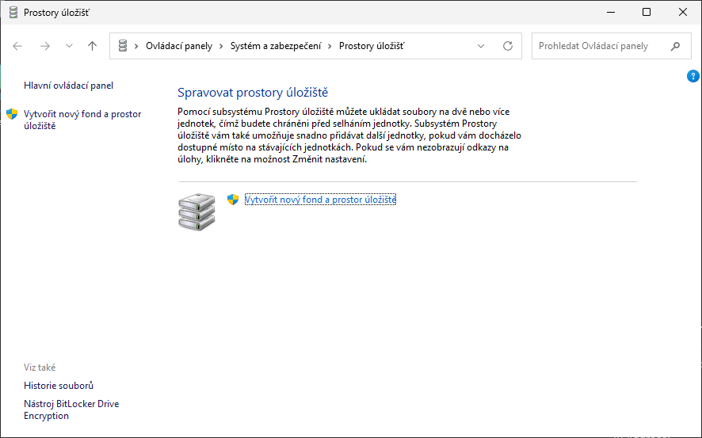

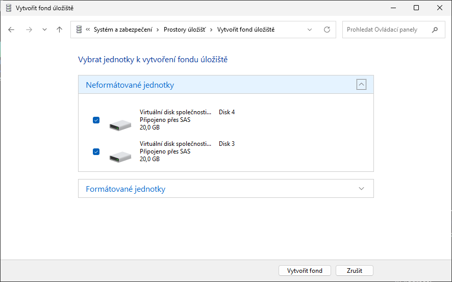

<!--
Snímky jsou z ovládacího panelu Prostory úložišť (Windows 11 24H2, dva neformátované 20 GB virtuální disky); stejný postup (výběr neformátovaných jednotek > Vytvořit fond) nabízí i nová stránka Prostory úložišť v Nastavení.
Další disky mohou být přidány do fondu úložiště i po jeho vytvoření (Přidat jednotky), disk lze z fondu také odebrat, pokud se na zbylé disky vejdou data.
-->

---

# Vytvoření nového prostoru úložiště

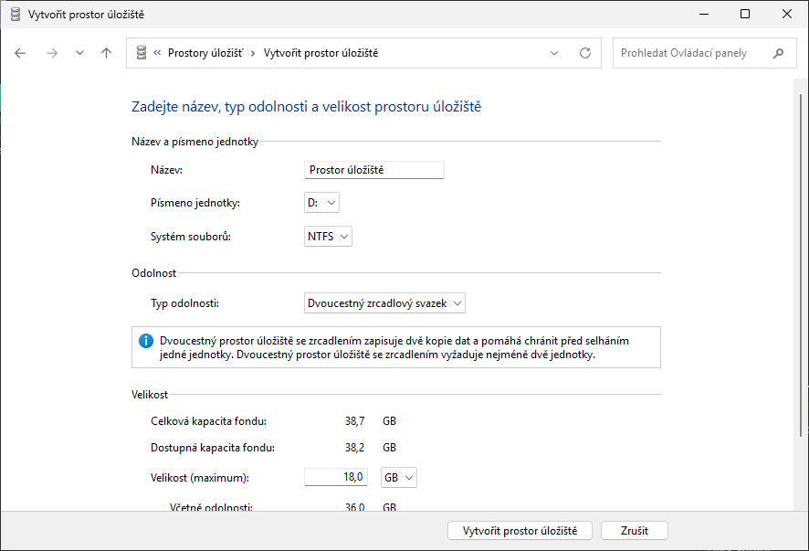

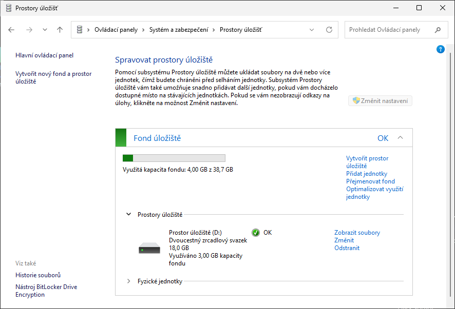

<!--
Při vytváření prostoru se volí název, písmeno jednotky, souborový systém (NTFS, ReFS), typ odolnosti a velikost – ta může být díky tenkému zřizování větší než kapacita fondu (na snímku fond 2 × 20 GB, dvoucestné zrcadlení nabízí 18 GB využitelných; písmeno jednotky a souborový systém NTFS/ReFS se volí tamtéž).
V Nastavení Windows 11 je postup shodný, jen s novým vzhledem.
-->

---

<!-- _header: 'Desktop systémy Microsoft Windows Prostory úložišť (Storage Spaces)' -->

# Podporované typy odolnosti (1)

- **Jednoduchý** (bez odolnosti) (*simple*)
  - Data prokládána přes disky fondu (obdoba prokládaného svazku, RAID-0)
    - Zapisuje se jediná kopie dat
    - Žádná ochrana proti selhání disku, maximální kapacita a výkon
  - Lze vytvořit už z 1 jednotky; „aby to mělo smysl“, alespoň 2
- **Dvoucestné zrcadlení** (*two-way mirror*)
  - Obdoba zrcadleného svazku (RAID-1), navíc prokládané přes více disků
    - Zapisují se 2 kopie dat
    - Ochrana proti selhání 1 disku
  - Vyžaduje alespoň 2 jednotky

<!--
Původní snímek uváděl jednoduchý prostor jako obdobu rozloženého svazku – to není přesné: jednoduchý prostor data prokládá přes všechny disky fondu (stripe po slabech 256 MB), chová se tedy jako RAID-0 včetně nárůstu výkonu.
Počty jednotek podle dokumentace Microsoftu pro Windows 11: jednoduchý „alespoň dvě jednotky, aby to mělo smysl“ (není to tvrdý limit – PowerShell New-VirtualDisk i Nastavení dovolí jednoduchý prostor nad fondem s jediným diskem), dvoucestné zrcadlení 2, třícestné zrcadlení 5, parita 3, duální parita 7. Tabulka v E05 uvádí u jednoduchého prostoru minimum 1 – s tímto snímkem je to konzistentní.
Zdroj: https://support.microsoft.com/en-us/windows/storage-spaces-in-windows-b6c8b540-b8d8-fb8a-e7ab-4a75ba11f9f2
-->

---

<!-- _header: 'Desktop systémy Microsoft Windows Prostory úložišť (Storage Spaces)' -->

# Podporované typy odolnosti (2)

- **Třícestné zrcadlení** (*three-way mirror*)
  - Zapisují se 3 kopie dat, ochrana proti selhání 2 disků
  - Vyžaduje alespoň 5 jednotek
- **Parita** (*parity*)
  - Obdoba prokládaného svazku s paritou (RAID-5)
    - Zapisuje se jediná kopie dat spolu s informacemi o paritě, rozprostřenými napříč disky
    - Ochrana proti selhání 1 disku, nižší výkon zápisu
  - Vyžaduje alespoň 3 jednotky
- **Duální parita** (*dual parity*)
  - Ochrana proti selhání 2 disků (obdoba RAID-6)
  - Vyžaduje alespoň 7 jednotek

<!--
Odolnost se volí při vytváření prostoru a nelze ji později změnit; v jednom fondu mohou být prostory s různou odolností.
Zdroj: https://support.microsoft.com/en-us/windows/storage-spaces-in-windows-b6c8b540-b8d8-fb8a-e7ab-4a75ba11f9f2
-->

---

<!-- _class: dense -->

# Souborové systémy: NTFS, ReFS a Dev Drive

- **NTFS** – výchozí pro systémový i datové disky (oprávnění, EFS, komprese, kvóty, žurnál, stínové kopie – viz L06, L10)
- **ReFS** (*Resilient File System*) – Windows Server, Windows 11 Pro for Workstations / Enterprise; na všech edicích jako Dev Drive
  - Integrity streams, online oprava metadat, block cloning, velké svazky (35 PB); bez EFS, komprese NTFS, kvót, bez spouštění systému
- **Dev Drive** (Windows 11 22H2 build 22621.2338+, všechny edice)
  - Svazek ReFS optimalizovaný pro vývoj (repozitáře, balíčky, build), min. 50 GB
  - Nastavení > Systém > Úložiště > Upřesnit nastavení úložiště > Disky a svazky > *Vytvořit jednotku Dev Drive* (nový VHDX, zmenšení svazku nebo volné místo); `Format-Volume -DriveLetter D -DevDrive`
  - Microsoft Defender v režimu výkonu (asynchronní kontrola), filtry jen podle seznamu (`fsutil devdrv`)
  - Od 24H2 s block cloning – kopírování jako operace nad metadaty
- **FAT32 / exFAT** – vyměnitelná média, EFI systémový oddíl (FAT32)

<!--
ReFS byl uveden s Windows Server 2012; na klientu bylo formátování ReFS ve Windows 10 1709 omezeno na edice Pro for Workstations a Enterprise (ostatní edice ReFS svazky jen čtou a zapisují). Dev Drive ve Windows 11 zpřístupnil ReFS svazky všem edicím, ale jen pro účel vývojářského disku. ReFS nepodporuje spuštění Windows, EFS, kompresi NTFS, diskové kvóty ani pevné odkazy v plném rozsahu; naopak nabízí integrity streams (kontrolní součty dat), automatickou opravu při zrcadlení/paritě v Prostorech úložišť a block cloning (kopie jako odkaz na stejné klastry, Copy-on-Write).
Dev Drive: minimální velikost 50 GB, doporučeno 16 GB RAM; systémový disk C: nelze označit jako Dev Drive; nepodporován na vyměnitelných discích a na dynamických discích. Důvěryhodný Dev Drive (fsutil devdrv trust D:) přepne Microsoft Defender do režimu výkonu – kontrola souborů probíhá asynchronně po otevření; ostatní filtry souborového systému (např. Procmon, Docker) se připojí jen po zapsání do seznamu (fsutil devdrv setfiltersallowed). Ve firemním prostředí lze Dev Drive řídit zásadami skupiny / Intune (povolení, vynucení filtrů).
Block cloning na Dev Drive od Windows 11 24H2 a Windows Server 2025: kopírování souboru v rámci svazku je operace nad metadaty, tedy téměř okamžitá a bez zápisů dat.
Zdroj: https://learn.microsoft.com/en-us/windows/dev-drive/
Zdroj: https://learn.microsoft.com/en-us/windows-server/storage/refs/refs-overview
-->

---

<!-- _class: dense -->

# Virtuální disky (VHD / VHDX)

- Soubor `.vhd` / `.vhdx` připojený jako **běžný disk** – Správa disků > Akce > *Vytvořit virtuální pevný disk* / *Připojit virtuální pevný disk*, dvojklik v Průzkumníku souborů
- `diskpart`: `create vdisk file=D:\d.vhdx maximum=51200 type=expandable`, `attach vdisk`, `detach vdisk`
- **PowerShell**: `Mount-DiskImage`, `Dismount-DiskImage` (Storage); `New-VHD`, `Mount-VHD`, `Resize-VHD` (modul Hyper-V)
- **Pevná** (*fixed*) nebo **dynamicky se rozšiřující** (*expandable*) velikost, **rozdílový disk** (*differencing*)
- **VHD** max. 2040 GB (starší formát); **VHDX** max. 64 TB, odolný proti výpadku napájení, 4K sektory – preferovaný
- **Nativní spuštění** Windows z VHDX (*native boot*) – viz L02; Dev Drive a WSL používají VHDX

<!--
Virtuální disky se používají pro Hyper-V (cvičení: BASE_*.vhdx jako rodičovské disky, rozdílové disky VM), pro nativní spuštění Windows z VHDX (dual boot bez přerozdělování disku, viz L02), pro Dev Drive, WSL2 a Windows Sandbox. Připojený VHDX se chová jako fyzický disk – lze ho inicializovat (GPT), dělit, formátovat, zálohovat i šifrovat BitLockerem (VHDX na BitLockerem šifrovaném svazku je šifrován spolu s ním).
Native boot vyžaduje formát VHDX (ne VHD) a nepodporuje hibernaci ani BitLocker na spouštěném virtuálním disku.
Zdroj: https://learn.microsoft.com/en-us/windows-server/storage/disk-management/manage-virtual-hard-disks
Zdroj: https://learn.microsoft.com/en-us/windows-hardware/manufacture/desktop/deploy-windows-on-a-vhd--native-boot
-->

---

<!-- _class: section -->

# Správa napájení

<!-- header: 'Desktop systémy Microsoft Windows Správa napájení' -->

---

<!-- _class: dense -->

# Schémata napájení

- **Sada nastavení** určujících jak má systém využívat energii, když je napájen z baterie nebo ze sítě
- Aplikují se na **úrovni počítače**; v jednom okamžiku může být aktivní jediné schéma
- **Správa**: Ovládací panely > *Možnosti napájení* (`powercfg.cpl`), `powercfg /list`, `/setactive`
- Windows 11 ve výchozím stavu zobrazuje jen schéma **Rovnováha**
  - Na zařízeních s Modern Standby jsou ostatní schémata skryta; lze obnovit `powercfg /duplicatescheme <GUID>` (Vysoký výkon, Úsporný režim, Maximální výkon)
  - Jemné ladění místo schémat řeší **Režim napájení** v Nastavení (další snímek)
- **Historie:** Windows 7–10 nabízely 3 základní schémata (Vysoký výkon, Rovnováha, Úsporný režim); od Windows 10 1709 jsou na zařízeních s posuvníkem výkonu (Modern Standby) všechna kromě Rovnováhy skryta, na stolních PC zůstala

<!--
Schémata napájení (power schemes/plans) existují dál a jsou plně dostupná přes powercfg a Možnosti napájení v Ovládacích panelech (Upřesnit nastavení napájení – časové limity disku, USB selective suspend, PCI Express Link State, správa napájení procesoru…). Na noteboocích s Modern Standby (S0 low power idle) Windows 11 vystavuje jen Rovnováhu; Vysoký výkon a Úsporný režim se dají znovu vytvořit duplikováním výchozích GUID: Vysoký výkon 8c5e7fda-e8bf-4a96-9a85-a6e23a8c635c, Úsporný režim a1841308-3541-4fab-bc81-f71556f20b4a, Rovnováha 381b4222-f694-41f0-9685-ff5bb260df2e, Maximální výkon (Ultimate Performance, primárně Pro for Workstations) e9a42b02-d5df-448d-aa00-03f14749eb61. Na stanicích C304 (stolní PC bez Modern Standby) by měla být schémata Vysoký výkon a Úsporný režim ve Možnostech napájení pod „Zobrazit další schémata“ – ověřit na stanici.
Zdroj: https://learn.microsoft.com/en-us/windows-hardware/design/device-experiences/powercfg-command-line-options
Zdroj: https://learn.microsoft.com/en-us/answers/questions/4335036/getting-only-balanced-power-plan
-->

---

<!-- _class: dense -->

# Režim napájení a Spořič energie (Windows 11)

- **Režim napájení** (*Výkonový režim*) – Nastavení > Systém > Napájení a baterie
  - Nejlepší energetická účinnost / Vyvážený / Nejlepší výkon
  - Technicky překryvná schémata (overlay) nad Rovnováhou, mění jen nastavení procesoru a grafiky (`powercfg /q` s aliasy overlay)
- **Spořič energie** (*Energy Saver*, od 24H2) – nahrazuje Spořič baterie
  - Funguje i při napájení ze sítě a na stolních PC
  - Zapnutí: Rychlé nastavení, automaticky při poklesu baterie pod %, nebo „vždy“
  - Sníží jas o 30 %, vypne průhlednost, omezí aplikace na pozadí a nekritické stahování aktualizací, zamkne Režim napájení
- **Historie:** Windows 10 1709 – posuvník výkonu ve vlastnostech baterie a Spořič baterie

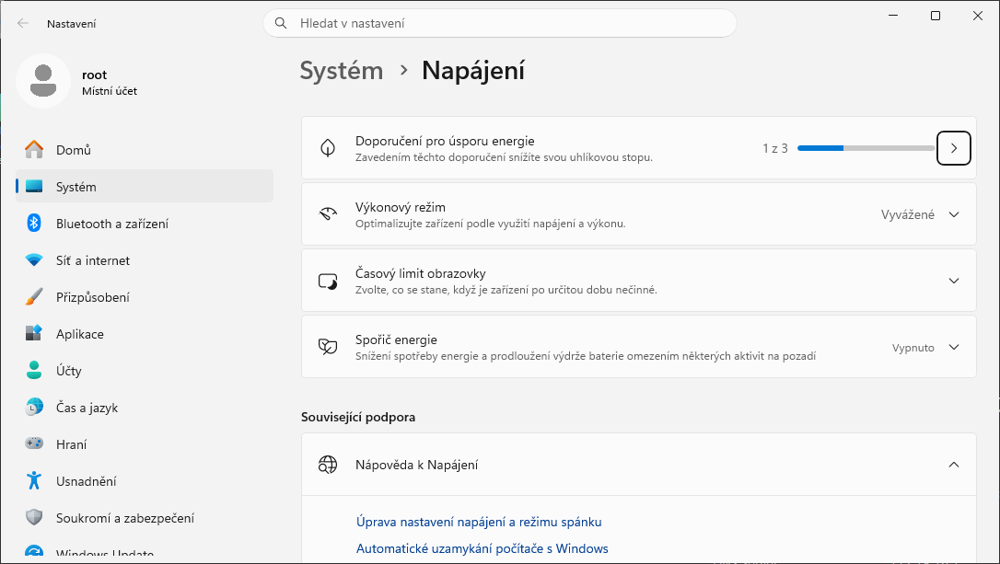

<!--
Režim napájení (power mode) je nástupcem posuvníku výkonu z Windows 10 1709. Realizován je jako „overlay“ schémata (aliasy OVERLAY_SCHEME_MIN/MAX apod. v powercfg /aliases), která upravují jen podskupiny SUB_PROCESSOR a SUB_GRAPHICS nad aktivním schématem Rovnováha – proto jsou obě nastavení (schéma i režim) nezávislá. Zda Windows 11 24H2 nabízí režim napájení zvlášť pro baterii a pro napájení ze sítě, ověřit na stanici (dokumentace to jednoznačně neuvádí).
Spořič energie (energy saver) je ve Windows 11 24H2 a novějších a nahrazuje Spořič baterie. Lze ho zapnout kdykoli z Rychlého nastavení (i na stolním PC), nastavit automatické zapnutí při poklesu nabití pod zvolené procento, nebo ponechat zapnutý trvale („vždy používat spořič energie“). Při zapnutí: jas displeje snížen o 30 % (lze vypnout), vypnuty efekty průhlednosti, uživatel nemůže měnit Režim napájení; při napájení z baterie navíc blokovány aplikace na pozadí (s výjimkami, např. VoIP), nekritické stahování Windows Update (kontroly probíhají), většina telemetrie a některé naplánované úlohy.
Snímek vpravo: Nastavení › Systém › Napájení ve Windows 11 24H2 (virtuální počítač bez baterie, proto jen „Napájení“) – rozevírací seznam Výkonový režim (Vyvážené) a sekce Spořič energie (Vypnuto); ve Windows 10 1709 tomu odpovídal posuvník „Režim napájení (na baterii)“ v nabídce baterie a Spořič baterie.
Zdroj: https://learn.microsoft.com/en-us/windows-hardware/design/component-guidelines/energy-saver
Zdroj: https://support.microsoft.com/cs-CZ/Windows/Experience/Power-Battery/power-settings-in-windows-11
Zdroj: https://learn.microsoft.com/en-us/windows-hardware/design/device-experiences/powercfg-command-line-options
-->

---

<!-- _class: dense -->

# Podporované úsporné režimy (1)

- Režim spánku – klasický **S3**
  - Paměť RAM a zařízení, které mohou probudit počítač (klávesnice, myši, síťové karty), zůstávají napájeny; procesor a ostatní zařízení vypnuta
  - Rychlé probuzení počítače (vše pořád v paměti RAM)
- **Modern Standby** (*S0 low-power idle*) – na moderních noteboocích a tabletech místo S3
  - Systém zůstává v nízkopříkonovém běhu, může udržovat síť (*connected standby*), okamžité probuzení
  - Zařízení podporuje buď S3, nebo Modern Standby; přepnout nelze bez reinstalace (`powercfg /a`)
- Hibernace (**S4**)
  - Veškerý obsah paměti RAM je uložen na disk (soubor `hiberfil.sys`), všechna zařízení vypnuta
  - Při probuzení je obsah paměti RAM obnoven z disku
  - `hiberfil.sys`: typ *full* = 40 % RAM (hibernace i Rychlé spuštění), *reduced* = 20 % (jen Rychlé spuštění)

<!--
Stavy ACPI: S0 běh, S1–S3 spánek (Windows používá S3), S4 hibernace, S5 vypnuto. Modern Standby je S0 low-power idle: obrazovka je vypnutá, ale SoC střídá aktivní a nečinný režim, software běží jen v krátkých kontrolovaných dávkách (aktivátory), síťová karta může zůstat připojená (connected standby) nebo být odpojena (disconnected standby). Systém s Modern Standby nepodporuje S1–S3; přechod mezi S3 a Modern Standby není podporován bez kompletní reinstalace OS (nastavením v BIOS se to řešit nedá – firmware musí být pro daný model navržen). Které stavy zařízení podporuje a proč ne, zobrazí powercfg /a (powercfg /availablesleepstates).
Hibernaci lze povolit nebo zakázat pomocí powercfg /h {on | off}. Velikost souboru hiberfil.sys: plný soubor (full) je 40 % fyzické RAM a podporuje hibernaci i Rychlé spuštění; zmenšený (reduced) 20 % RAM podporuje jen Rychlé spuštění: powercfg /h /size 0 a poté powercfg /h /type reduced. Vlastní velikost lze nastavit powercfg /h /size <procent>; dokumentace dovoluje nejméně 50 (tj. 50–100 %). Výchozí velikosti 40 % (full) a 20 % (reduced) na snímku pocházejí z komunitních návodů – dokumentace powercfg uvádí jen, že HiberFileSizePercent >= 40 se považuje za typ full.
Historie: ve Windows 7 měl hiberfil.sys výchozí velikost 75 % RAM.
Zdroj: https://learn.microsoft.com/en-us/windows/win32/power/system-power-states
Zdroj: https://learn.microsoft.com/en-us/windows-hardware/design/device-experiences/modern-standby
Zdroj: https://learn.microsoft.com/en-us/windows-hardware/design/device-experiences/powercfg-command-line-options
-->

---

# Podporované úsporné režimy (2)

- **Hybridní režim spánku**
  - Režim spánku, při kterém se navíc obsah paměti RAM uloží na disk (soubor `hiberfil.sys`)
  - Rychlé probuzení počítače (použijí se data v paměti RAM, pokud nedošlo k vypnutí)
  - Chrání proti ztrátě dat v případě přerušení napájení
  - Výchozí u stolních počítačů (nemají baterii), na noteboocích vypnutý
- **Rychlé spuštění** (*Fast Startup*, hybridní vypnutí, hiberboot) – výchozí od Windows 8
  - „Vypnout“ odhlásí uživatele a hibernuje relaci jádra; při startu se obnoví z `hiberfil.sys`
  - „Restartovat“ provede skutečný studený start – proto se při potížích doporučuje restart
  - Důsledky: uzamčené svazky při dual bootu, Wake-on-LAN po vypnutí nefunguje, změny v BIOS/ovladačích se projeví až po restartu
  - Vypnutí: Možnosti napájení > Nastavení tlačítek napájení > *Zapnout rychlé spuštění*, nebo `powercfg /h off`

<!--
Rychlé spuštění vyžaduje zapnutou hibernaci (soubor hiberfil.sys alespoň typu reduced); powercfg /h off vypne hibernaci i Rychlé spuštění. Zásada skupiny: Konfigurace počítače > Šablony pro správu > Systém > Vypnutí > Vyžadovat použití rychlého spuštění.
Při Rychlém spuštění je souborový systém NTFS na systémovém disku ve „hibernovaném“ stavu – při dual bootu s Linuxem je svazek připojen jen pro čtení; podobně USB disky připojené k jinému systému. Windows Update aktualizace vyžadující restart si o skutečný restart řeknou samy.
Zdroj: https://learn.microsoft.com/en-us/windows-hardware/drivers/kernel/distinguishing-fast-startup-from-wake-from-hibernation
-->

---

<!-- _class: dense -->

# Nastavení přes zásady skupiny a Intune

- **Zásady skupiny**: Konfigurace počítače > Šablony pro správu > Systém > *Řízení spotřeby*
  - Časové limity spánku a hibernace, akce tlačítek a víka, vyžadování hesla po probuzení, výběr aktivního schématu
  - Zda mohou otevřené soubory nebo aplikace znemožnit uspání počítače
- **Intune**: katalog nastavení > *Power* (Policy CSP `Power`) – tytéž hodnoty pro Entra joined zařízení, včetně prahu Spořiče energie

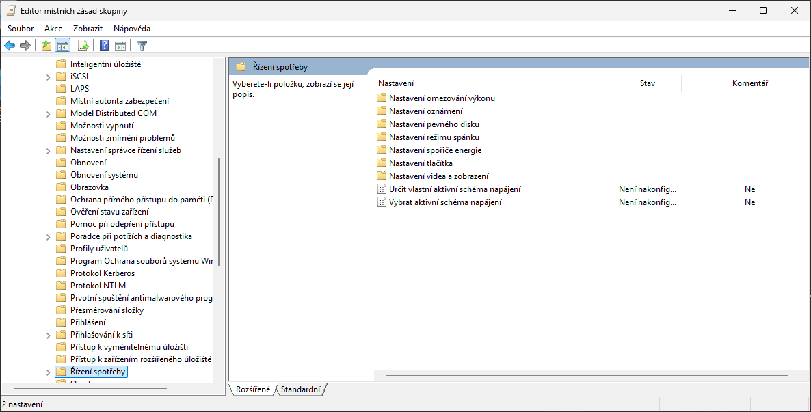

<!--
Nastavení Řízení spotřeby je pod Konfigurací počítače (snímek z Windows 11 24H2: podsložky Nastavení omezování výkonu, oznámení, pevného disku, režimu spánku, spořiče energie, tlačítka, videa a zobrazení a zásady Určit vlastní aktivní schéma napájení, Vybrat aktivní schéma napájení).
V Intune (Zařízení > Konfigurace > Katalog nastavení > kategorie Power) jsou odpovídající nastavení Policy CSP Power: Allow Hibernate, Allow Standby States When Sleeping, Hibernate/Standby Timeout (on battery / plugged in), Select Lid Close / Power Button / Sleep Button Action, Require Password When Computer Wakes, Energy Saver Battery Threshold (on battery / plugged in), Turn Off Hybrid Sleep. Alternativou pro stolní PC jsou skripty s powercfg (remediace).
Zdroj: https://learn.microsoft.com/en-us/windows/client-management/mdm/policy-csp-power
-->

---

# Správa pomocí nástroje powercfg

- Umožňuje
  - Specifikovat zařízení, jenž mohou **probouzet počítač**
    - `powercfg /devicequery wake_armed`, přepínače `/deviceenablewake` a `/devicedisablewake`
  - **Importovat a exportovat** schémata napájení
    - Přepínače `/import` a `/export` (soubory `.pow`, nasazení skriptem nebo balíčkem zřizování)
  - Specifikovat ovladače, aplikace a služby, jenž mohou zabránit **přechodu do režimu spánku**
    - `powercfg /requests` (kdo právě brání), `/requestsoverride <typ> <název> System`
  - Nastavovat **oprávnění** pro provádění změn nastavení
    - Přepínač `/setsecuritydescriptor <guid> <sddl>`
  - **Měnit hodnoty schémat**: `/change standby-timeout-ac 30`, `/setacvalueindex`, `/setdcvalueindex`

<!--
Typ u /requestsoverride je driver, process nebo service, název je název ovladače, procesu (.exe souboru) nebo služby, System říká, že se konfiguruje požadavek týkající se přechodu do režimu spánku (další typy: Display, Awaymode).
Ukázat powercfg /devicequery wake_programmable a powercfg /devicequery wake_armed, jenž zobrazí seznam zařízení, které jsou schopny, resp. aktuálně mohou, probudit počítač z úsporného režimu.
Ukázat powercfg /lastwake (co naposledy probudilo počítač) a powercfg /waketimers (naplánovaná probuzení, např. Windows Update / automatická údržba).
Přepínače lze psát s lomítkem i pomlčkou (powercfg -h off).
Zdroj: https://learn.microsoft.com/en-us/windows-hardware/design/device-experiences/powercfg-command-line-options
-->

---

<!-- _header: 'Desktop systémy Microsoft Windows Správa pomocí nástroje powercfg' -->

<!-- _class: dense -->

# Diagnostické sestavy powercfg

- `powercfg /a` – podporované stavy spánku (S3 vs. Modern Standby, hibernace, Rychlé spuštění) a důvody nedostupnosti
- `powercfg /energy [/duration 60]` – analýza běžících problémů s úsporou energie (HTML sestava, spouštět na nečinném počítači, správce)
- `powercfg /batteryreport` – historie kapacity a cyklů baterie, odhad výdrže
- `powercfg /sleepstudy` – kvalita Modern Standby za poslední 3 dny (aktivátory bránící spánku)
- `powercfg /systempowerreport` (`/spr`) – obecnější sestava všech přechodů napájení (i S3) včetně connected standby
- `powercfg /systemsleepdiagnostics` – zda počítač usnul, když uživatel nebyl přítomen
- `powercfg /lastwake`, `/waketimers` – kdo počítač probudil / probudí

<!--
Sestavy se ukládají jako HTML do aktuálního adresáře (přepínač /output <soubor> změní umístění, /xml formát). /energy, /systempowerreport a /systemsleepdiagnostics vyžadují příkazový řádek správce.
Sleep Study má smysl jen na zařízeních s Modern Standby; na stolním PC s S3 vrací prázdnou sestavu. /systempowerreport je obecnější varianta pokrývající všechny přechody napájení (i S3), sleepstudy jen Modern Standby; dokumentace obě sestavy vede vedle sebe a žádnou nepreferuje.
Sestava baterie ukazuje „Design capacity“ vs. „Full charge capacity“ – rozdíl ukazuje opotřebení baterie; hodí se při reklamacích a plánování obměny notebooků.
Zdroj: https://learn.microsoft.com/en-us/windows-hardware/design/device-experiences/powercfg-command-line-options
Zdroj: https://learn.microsoft.com/en-us/windows-hardware/design/device-experiences/modern-standby-sleepstudy
-->
