<!-- _class: title -->
<!-- _header: '' -->

# Desktop systémy Microsoft Windows

## IW1

Jan Pluskal\
pluskal@vut.cz

Fakulta informačních technologií\
Vysoké učení technické v Brně\
Božetěchova 2, 612 66 Brno

---

<!-- _class: section -->

# Monitorování a výkon

<!-- header: 'Desktop systémy Microsoft Windows Monitorování a výkon' -->

---

# Nástroje pro monitorování počítače

- Monitorování stavu počítače
  - Základní informace o stavu počítače
    - Zabezpečení a údržba (dříve Centrum akcí)
  - Monitorování stavu počítače v reálném čase
    - Správce úloh, Sledování prostředků a Process Explorer
  - Zjišťování dalších informací o stavu počítače
    - Sledování spolehlivosti, Služby a Prohlížeč událostí
- Monitorování výkonu počítače
  - Sledování výkonu a Sady kolekcí dat
  - Možnosti výkonu

---

# Zabezpečení a údržba (Security and Maintenance)

<!-- REVIEW: ve Windows 11 je hlavním rozhraním aplikace Zabezpečení Windows; applet
     Zabezpečení a údržba v Ovládacích panelech stále existuje – rozhodnout, co učit primárně. -->

- Monitoruje stav počítače z pohledu bezpečnosti a údržby a oznamuje problémy týkající se
  - Služby Windows Update (systém je aktuální, …)
  - Antivirové ochrany (je přítomná a aktuální, …)
  - Řízení uživatelských účtů a Brány Firewall (povoleny)
  - Zálohování a Historie souborů (zálohy vytvářeny, …)
  - Stavu (diskových) jednotek a Prostorů úložišť
  - …
- Spuštění přes Ovládací panely

---

# Nastavení oznamování problémů

<!-- REVIEW: oba snímky jsou z Centra akcí Windows 8 (Domácí skupina, Účet Microsoft) –
     nahradit snímky appletu Zabezpečení a údržba z Windows 11. -->

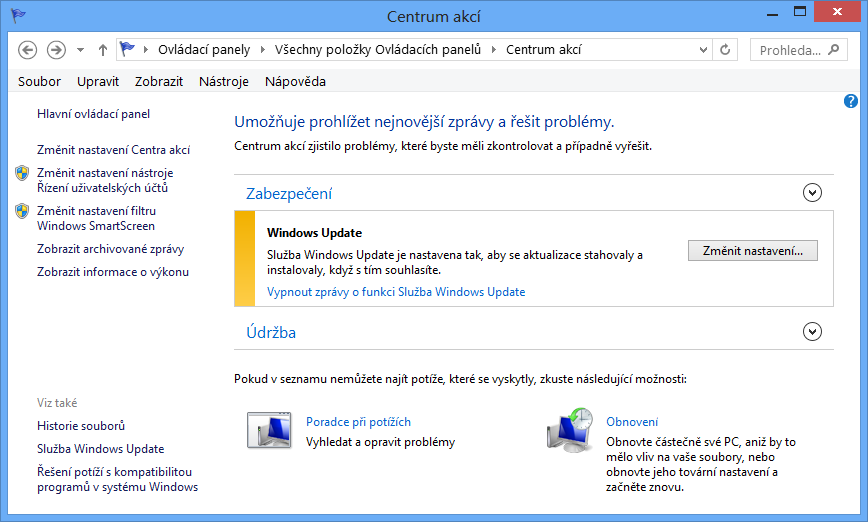

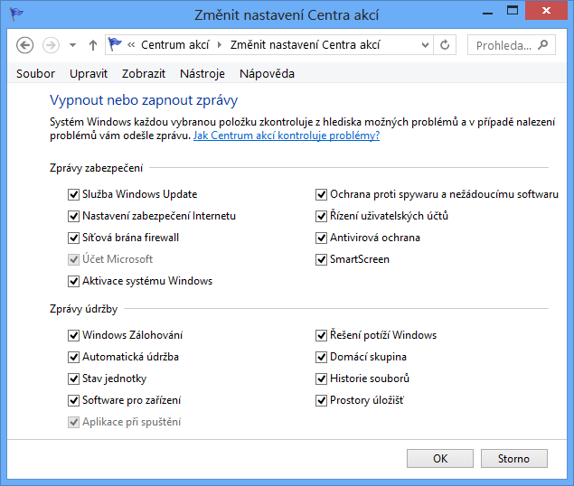

---

# Správce úloh (Task Manager)

- Poskytuje základní informace o výkonu počítače
- Umožňuje správu procesů, služeb a sezení
  - Informace o procesech (využití CPU, paměti, …)
  - Nastavení spřažení (affinity) a priority procesů
  - Povolení / zakázání virtualizace procesů
  - Možnost ukončování běhu procesů a výběru aplikací, jenž mají být spuštěny při startu systému Windows
- Spuštění příkazem `taskmgr`, klávesovou zkratkou CTRL+SHIFT+ESC nebo přes CTRL+ALT+DEL

<!-- Čím vyšší číslo, tím vyšší priorita (na rozdíl např. od UNIXových systémů, kde to je naopak). -->

---

# Správa procesů pomocí Správce úloh

<!-- REVIEW: všechny snímky obrazovky v přednášce (sn. 5–35) jsou z Windows 8 –
     rozhodnout, zda je přesnímat z Windows 11. -->

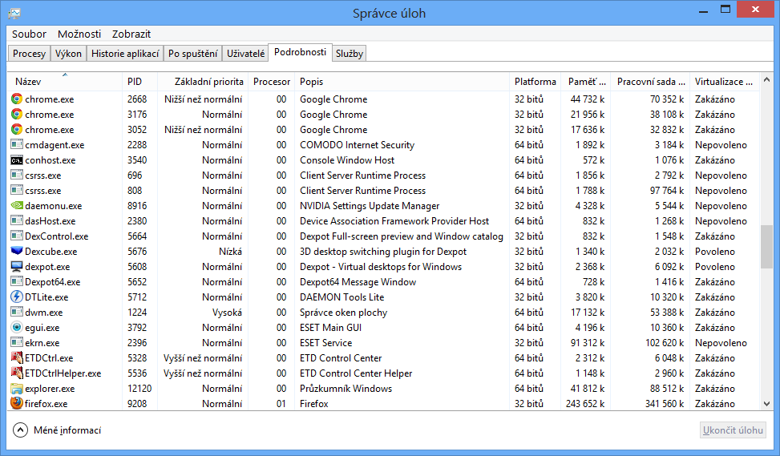

---

# Sledování prostředků

- Monitorování využití prostředků v reálném čase
  - Filtrování na základě procesů nebo služeb
  - Zjišťování závislostí mezi procesy (zda proces nečeká na prostředky aktuálně používané jinými procesy)
  - Informace o používaných souborech, klíčích registru, synchronizačních objektech, událostech, …
  - Zavedené moduly (DLL knihovny, ovladače, …)
  - Ustanovená TCP spojení a otevřené porty
- Spuštění příkazem `perfmon /res` či `resmon` nebo přes Správce úloh

---

# Nástroj Sledování prostředků

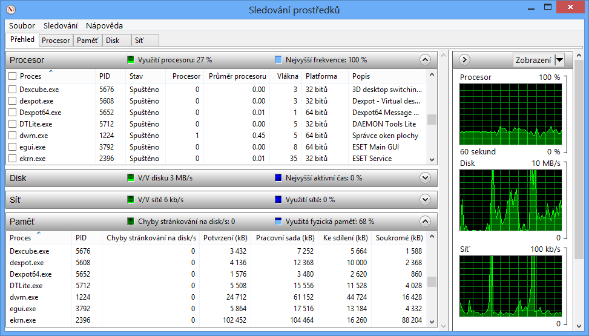

---

# Process Explorer

- Rozšíření Správce úloh (a Sledování prostředků)
  - Poskytuje detailní informace o běžících procesech
  - Zdarma ke stažení na webu Windows Sysinternals
- Umožňuje (kromě řady dalších věcí)
  - Zobrazovat procesy ve stromové hierarchii na základě toho, jak byly vytvářeny (hierarchie otec/syn)
  - Vyhledávat procesy využívající zadané DLL knihovny nebo popisovače (soubory, klíče registru, …)
  - Získávat podrobné informace o všech popisovačích, DLL knihovnách, vláknech, proměnných prostředí, …

---

# Nástroj Process Explorer

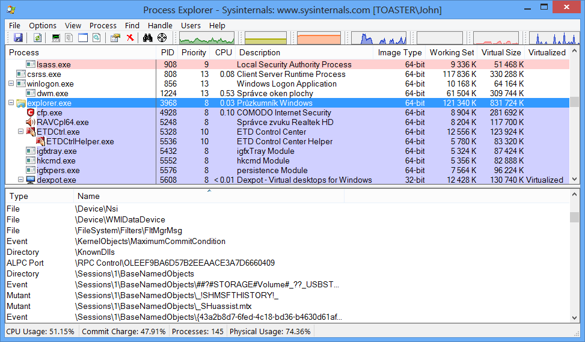

<!--
Process Explorer umožňuje zjišťovat i tak detailní informace jako např. call stack procesu.

Vše pod procesem services.exe jsou procesy služeb, při najetí na jakýkoliv z těchto procesů lze zjistit konkrétní služby, jenž daný proces zajišťuje.
-->

---

# Sledování spolehlivosti

- Monitoruje stabilitu systému
  - Chyby aplikací a systému Windows
  - Úspěšné a neúspěšné instalace ovladačů, aktualizací, aplikací apod.
- Spuštění příkazem `perfmon /rel`
- Stabilita vyjádřena tzv. indexem stability
  - Vypočítán na základě počtu chyb za posledních 28 dní (starší chyby mají nižší váhu)
- Data jsou uchovávána po dobu 1 roku

---

# Nástroj Sledování spolehlivosti

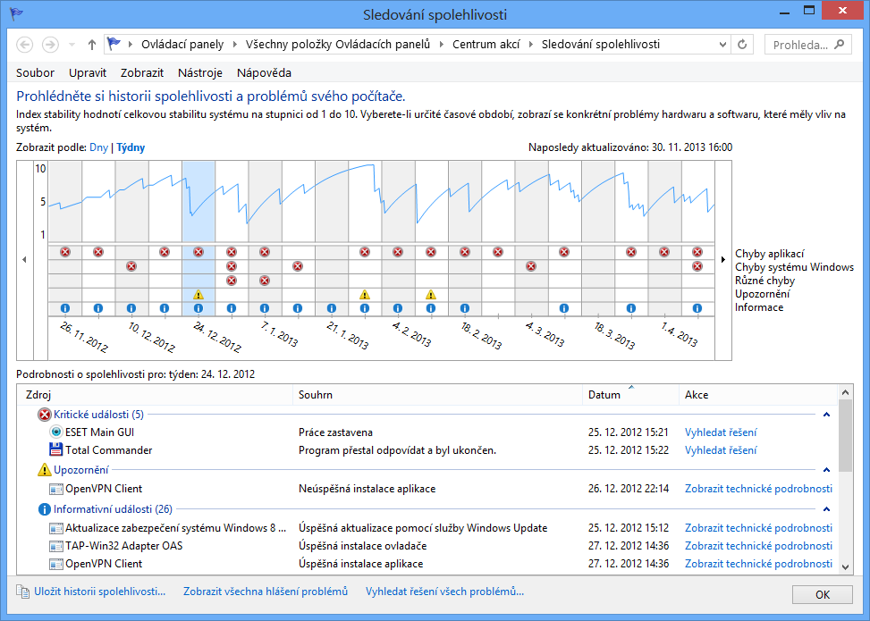

---

# Služby

- Poskytuje detailní informace o službách systému a pokročilé možnosti jejich správy
  - Informace o závislostech mezi službami
  - Specifikace účtu, pod kterým služba běží
  - Definice reakcí při selhání služby (restartovat službu, restartovat počítač nebo spustit program)
- Spuštění příkazem `services.msc`
- Služby se zpožděným spuštěním jsou spuštěny až po nabootování celého systému

<!-- Ve Windows 10 jsou některé služby chráněné – např. Application Identity (AppLocker) – lze konfigurovat přes zásady nebo registry -->

---

# MMC konzole Služby

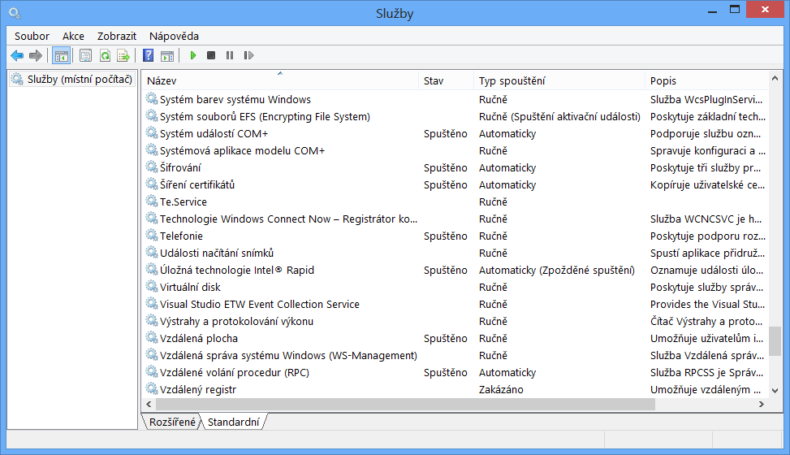

---

# Prohlížeč událostí (Event Viewer)

<!-- REVIEW: ve Windows 11 se sekce Ovládacích panelů jmenuje „Nástroje systému Windows“
     (Windows Tools), ne „Nástroje pro správu“ – rozhodnout, zda název aktualizovat. -->

- Umožňuje zobrazit obsah protokolů událostí
- Spuštění příkazem `eventvwr` nebo přes Ovládací panely (sekce Nástroje pro správu)
- Události jsou řazeny do 4 kategorií
  - Kritické (chyby, ze kterých se nebylo možné zotavit)
  - Chyby (chyby, jenž mohou ovlivnit běh systému)
  - Výstrahy (chyby, které mohou ovlivnit běh aplikace)
  - Informace (významnější informace o běhu systému)

---

# Další možnosti a funkcionalita

- Filtrování událostí
  - Dočasně pomocí filtru
  - Trvale pomocí vlastního zobrazení (custom view)
    - Možnost importu a exportu (uložení jako XML soubor)
- Vykonávání úloh při výskytu konkrétních událostí
  - Možnost přiřadit úlohu (spuštění programu / skriptu, zaslání e-mailu nebo zobrazení zprávy) dané události
- Export událostí do XML, CSV nebo TXT souboru
- Zasílání událostí na vzdálené počítače

<!--
Akce zaslání e-mailu a zobrazení zprávy jsou od Windows 8 označeny jako zastaralé (deprecated) a neměly by se dále používat. Namísto nich lze ale spustit program, jenž bude tyto úlohy realizovat.

Události lze exportovat i z příkazové řádky nástrojem wevtutil.

Zasílání zpráv na vzdálené počítače je novinka od Windows Vista.
-->

---

# Definice vlastního zobrazení (filtru)

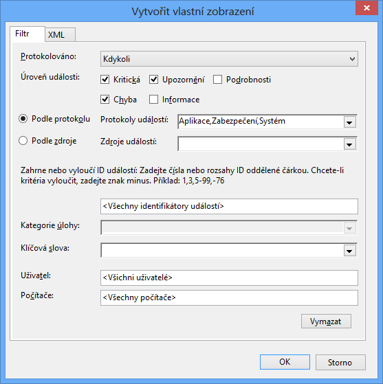

---

# Protokoly systému Windows

- Aplikace (Application)
  - Zahrnuje události nastalé činností běžících aplikací
- Zabezpečení (Security)
  - Zahrnuje události spojené s auditováním přístupu
- Systém (System)
  - Zahrnuje události systému Windows a jeho služeb
- Předané události (Forwarded Events)
  - Zahrnuje události zaslané z jiných počítačů

<!--
Ještě existuje protokol Instalace, jenž obsahuje informace o průběhu instalace systému.

Ukázat Protokoly aplikací a služeb, hlavně Diagnosis-PLA, kde zapisuje události nástroj Sledování výkonu.
-->

---

# Předávání událostí (Event Forwarding)

<!-- REVIEW: minimální verze (Vista / Server 2003 R2, XP SP2 / Server 2003 SP1) jsou
     dávno nepodporované – rozhodnout, zda odrážky zkrátit na „všechny podporované verze“. -->

- Zasílání specifických událostí na vzdálený počítač
  - Na cílovém počítači (jenž přijímá události) musí běžet alespoň Windows Vista nebo Server 2003 R2
  - Na zdrojovém počítači (jenž zasílá události) musí být alespoň Windows XP SP2 nebo Server 2003 SP1
  - Musí běžet pod účtem uživatele ze skupiny Event Log Readers (Administrators pro události ze Zabezpečení)
- Na obou počítačích musí běžet služby
  - Vzdálená správa systému Windows (WinRM)
  - Sběr událostí systému Windows

<!--
Přeposílané události lze filtrovat pomocí standardních filtrů zmíněných dříve.

WinRM se používá pro přenos událostí, Sběr událostí systému Windows zase pro filtrování zasílaných událostí a jejich sběr.
-->

---

# Režimy odběrů (subscription) událostí

- Iniciované cílovým (collector) počítačem
  - Cílový počítač stahuje události ze zdrojových počítačů
  - Manuální konfigurace zdrojových počítačů
  - Vhodný pouze pro malé sítě
- Iniciované zdrojovým (source) počítačem
  - Zdrojové počítače zasílají události cílovému počítači
  - Konfigurace zdrojových počítačů přes zásady skupiny
  - Lze přidávat další počítače i po nastavení odběru
  - Vhodný v rozsáhlých sítích

<!--
U collector režimu nelze (asi) přidávat další počítače po nastavení odběru, musí se vytvořit nový odběr.

Někdy se zdrojovému (source) počítači říká forwarding.
-->

---

# Vytvoření a nastavení odběru

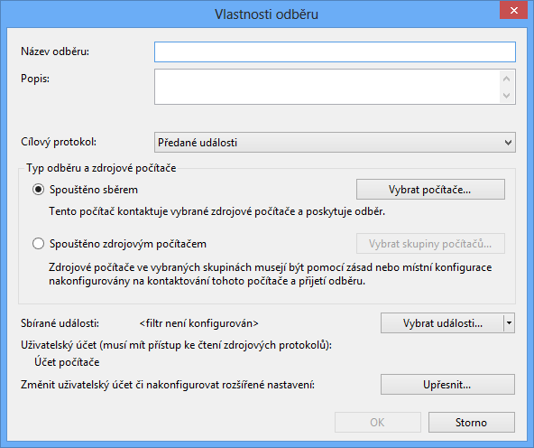

---

# Pokročilá nastavení odběru

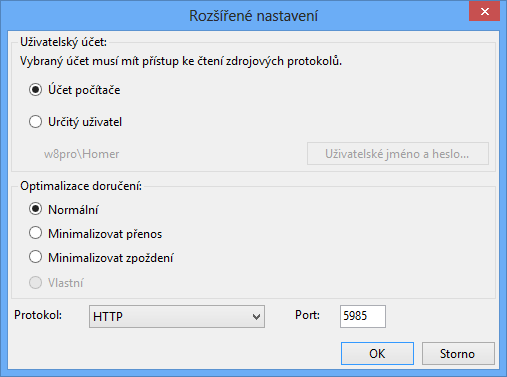

<!-- Minimalizace pro přenos vynutí použití komprese apod., což ovšem může mít za následek vyšší zpoždění. -->

---

# Monitorování výkonu počítače

- Monitorování hodnot čítačů (counters)
  - Každý čítač je vázán ke konkrétní instanci objektu
  - Speciální instance `_Total` obsahující součet (průměr u procentuálních) hodnot všech instancí daného čítače
- Zatěžuje počítač
  - Vhodné monitorovat jen potřebné informace

---

# Typy čítačů

- Čítače hardwaru (zařízení)
  - Procesor (vytížení procesoru, obsluha přerušení, …)
  - Paměť (volná paměť, stránkování, mezipaměť, …)
  - Logický disk (vytížení disku a fronty, volné místo, …)
  - …
- Čítače softwaru (aplikací)
  - TCP/IP stack (přijaté a odeslané datagramy, chyby, …)
  - .NET platforma (procesy, třídy, výjimky, kompilátor, …)
  - …

---

# Sledování výkonu

- Sledování hodnot čítačů v reálném čase
  - Vizuální zobrazení ve formě grafu, histogramu nebo sestavy (hodnoty zobrazeny jako prostý text)
- Vizuální zobrazení hodnot čítačů zaznamenaných dříve pomocí sad kolekcí dat
- Lze spustit
  - Jako součást Sledování výkonu (`perfmon`)
  - Jako samostatný nástroj (`perfmon /sys`)
  - V režimu pro porovnávání grafů (`perfmon /comp`)

<!-- Režim porovnávání grafů (/comp) není uveden v nápovědě nástroje ani na MSDN. -->

---

# Nástroj Sledování výkonu

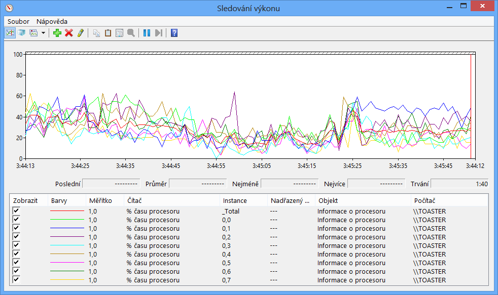

<!--
Ukázat přidání dalších čítačů (např. TCP protokol, .NET, …).

V případě, že některé čítače chybí (nejsou v seznamu), může to být tím, že odkazy na ně jsou poškozeny. Odkazy lze opravit (navrátit do původního stavu) příkazem lodctr /r.
-->

---

# Sady kolekcí dat (Data Collector Sets)

- Monitorují činnost celého systému
- Mohou zaznamenávat
  - Hodnoty nebo překročení mezí čítačů (výstrahy)
  - Data trasování událostí (např. událostí jádra, služeb systému, platformy .NET, NTFS či Active Directory)
  - Informace o konfiguraci systému (hodnoty registrů nebo informace získané pomocí WMI dotazů)
- Výsledky zobrazeny pod uzlem Sestavy

<!-- Ukázat cesty pro správu v konfiguračních kolekcích, jenž zaznamenávají výsledek nějakého WMI dotazu (což není z názvu na první pohled vůbec zřejmé). -->

---

# Systémové sady kolekcí dat

- Výkon systému (System Performance)
  - Zaznamenává hodnoty čítačů procesor, fyzický disk, paměť, IPv4, IPv6, …
  - Zaznamenává data trasování jádra
  - Vhodné při náhlém zpomalení počítače
- Diagnostika systému (System Diagnostics)
  - Zaznamenává stejné informace jako Výkon systému
  - Zaznamenává navíc detailní informace o systému (procesech, službách, zařízeních, uživatelích, …)
  - Vhodný při potížích s hardwarem nebo ovladači

<!--
Diagnostika systému běží 60 sekund.

Ukázat sestavu Diagnostiky systému.
-->

---

# Upozornění čítačů výkonu

- Umožňuje detekovat překročení mezních hodnot vybraných čítačů
- Při detekci lze
  - Zaznamenat tuto událost do protokolu událostí
  - Spustit sadu kolekcí dat
  - Spustit naplánovanou úlohu
    - Spustit program / skript
    - Zobrazit zprávu (zastaralé), lze nahradit voláním `msg.exe`
    - Odeslat e-mail (zastaralé), lze nahradit voláním Windows PowerShell příkazu (cmdletu) `Send-MailMessage`

<!--
Naplánovaná úloha lze spouštět zadáním jejího jména na záložce upozorňující úloha, kde se má podle nápovědy a MSDN zadávat WMI úloha (jenž neexistuje), TK ani raději nerozebírá, co se tam má nastavit (autoři to pravděpodobně sami neví). Argumenty úlohy lze sice zadat, ale naplánované úlohy je nepodporují (ve Windows XP se na záložce upozorňující úloha zadával program nebo skript, teď se tam zadává název naplánované úlohy, ale rozhraní zůstalo jako ve Windows XP).

Ukázat skript, jenž dělá to, co upozornění čítačů výkonu.
-->

---

# Nastavení čítačů a upozornění čítačů

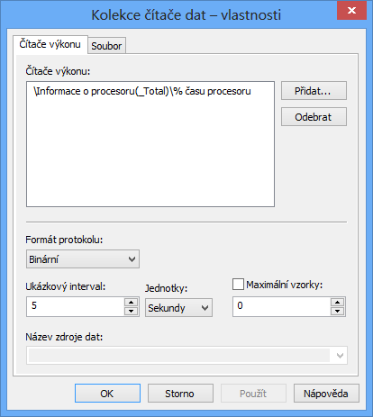

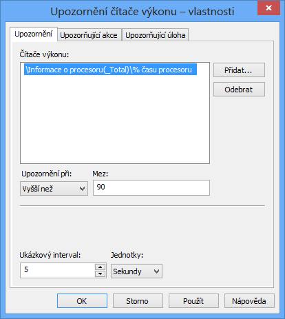

---

# Správa pomocí příkazové řádky (1)

- Vyžaduje oprávnění správce
- Vytváření / úprava (sad) kolekcí dat
  - `logman { create | update } { counter | trace | cfg | alert | api } <sada>\<kolekce> …`
  - Možnost vytváření kolekce dat pro trasování rozhraní API (zaznamenávání volání API funkcí v programu)
- Vytvoření (sady) kolekce dat monitorující čítač(e)
  - `logman create counter <sada>\<kolekce> -c <čítač> [<čítač> …] -si <interval> -sc <max-počet-vzorků>`

<!--
Kolekce dat api zatím nic nedělá, ve Sledování výkonu ani přes příkaz logman se nezobrazí, že v dané sadě je, lze ji vidět pouze po exportu v cílovém souboru.

V případě zadání jen jednoho názvu se tento název použije jak pro sadu, tak pro kolekci (v nápovědě to není napsané).

Název čítače musí být v lokalizaci daného systému, tedy česky v českých Windows, anglicky v anglických atd.
-->

---

# Správa pomocí příkazové řádky (2)

- Import / export (šablon) sad kolekcí dat
  - `logman { import | export } -xml <soubor-šablony>`
- Informace o kolekcích dat v sadě kolekcí dat
  - `logman query <sada>`
- Spouštění / zastavování sad kolekcí dat
  - `logman { start | stop } <sada>`
- Generování sestavy diagnostiky systému
  - `perfmon /report`
  - Spouští sadu kolekcí dat Diagnostika systému

<!-- Nelze spouštět jednotlivé kolekce dat, jen celé sady. -->

---

# Možnosti výkonu

- Umožňuje nastavit různé optimalizace ovlivňující výkon systému (a počítače)
- Konfigurace
  - Vizuálních efektů grafického rozhraní systému
  - Přidělování času procesoru službám a programům
  - Stránkovacích souborů
  - Prevence spouštění kódu z nespustitelných oblastí
- Přístup přes Vlastnosti systému (záložka Upřesnit) nebo příkazem `SystemPropertiesPerformance`

<!-- Spouštění kódu v nespustitelných oblastech (např. na zásobníku) se používá např. při útocích typu buffer overflow. Ve výchozím nastavení je tato ochrana povolena pro všechny důležité služby a procesy systému, lze ji ale povolit i pro ostatní aplikace a služby (a případně pak explicitně vybrat aplikace a služby, které takto nemají být chráněny). -->

---

# Vizuální efekty a virtuální paměť

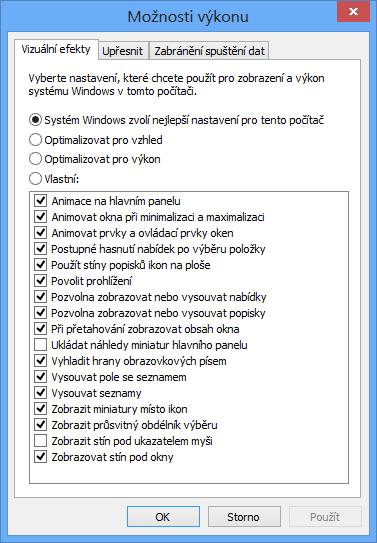

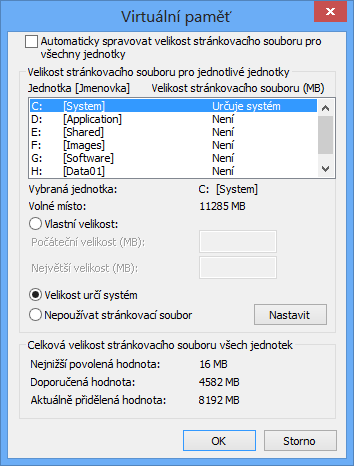

<!--
Kromě již zmíněných nástrojů existuje ještě Windows Performance Toolkit (WPT), což je sada nástrojů pro profilování (měření a analýzu výkonu) systému a aplikací. Je součástí Windows ADK a zahrnuje 2 základní nástroje:

Windows Performance Recorder (WPR), jenž zajišťuje trasování událostí vybrané aplikace

Windows Performance Analyzer (WPA), jenž umožňuje zobrazit dříve zachycené události

Mezi zachycované události patří např. přepnutí kontextu, přerušení, vyváření a ukončování procesů a vláken, odložené volání procedur, V/V operace s diskem, operace s registry a další.
-->
