<!-- TODO-SCREENSHOT: snímek 36 – nástroj Obnovení souborů (Historie souborů) se nepodařilo pořídit znovu: na laboratorním VM (Windows 11 24H2, cílová jednotka = druhý virtuální disk) Historie souborů po zapnutí hlásí „Znovu připojte jednotku“ a žádnou kopii nevytvoří; ponechán snímek z Windows 8 -->

<!-- _class: title -->
<!-- _header: '' -->

# Desktop systémy Microsoft Windows

## IW1

Jan Pluskal\
pluskal@vut.cz

Fakulta informačních technologií\
Vysoké učení technické v Brně\
Božetěchova 2, 612 66 Brno

---

<!-- _class: section -->

# Zálohování a obnova dat

<!-- header: 'Desktop systémy Microsoft Windows Zálohování a obnova dat' -->

---

<!-- header: 'Desktop systémy Microsoft Windows Stínové kopie (Shadow Copies)' -->

# Stínové kopie (Shadow Copies)

- **Konzistentní záznamy dat** určitých oddílů disků v konkrétních časech (tzv. *point-in-time* kopie dat)
  - Ukládány inkrementálně (jen změněné bloky)
- Vytvářeny službou **Stínová kopie svazku** (*Volume Shadow Copy Service*, VSS)
  - Při vytváření **bodů obnovení** (Ochrana systému, Obnovení k určitému časovému bodu)
  - Při **zálohování** (Historie souborů, Zálohování a obnovení (Windows 7), `wbadmin`, zálohovací software třetích stran)
- Pro uchování vyžadují souborový systém **NTFS**
  - U jiných souborových systémů vytvořeny jen dočasně

<!--
Omezení na NTFS souborový systém je dáno tím, že po výchozí instalaci obsahuje systém pouze jediného poskytovatele pro vytváření stínových kopií, jenž trvalé kopie podporuje pouze na NTFS („persistent shadow copies can be made only for NTFS volumes“; i úložiště stínových kopií musí být na svazku NTFS). Lze ale dodat i vlastní poskytovatele, jež mohou pracovat i s jinými souborovými systémy.

VSS je ve Windows 11 beze změny – je to základ i pro nejnovější nástroje (Obnovení k určitému časovému bodu, 2026) a používá ho většina zálohovacího softwaru třetích stran (Veeam Agent, Macrium Reflect, Acronis …).

Zdroj: https://learn.microsoft.com/en-us/windows-server/storage/file-server/volume-shadow-copy-service
-->

---

# Možnosti a omezení

- Určeny **pouze pro čtení** (nelze upravovat obsah)
- Max. **64 stínových kopií** na oddíl disku
  - Při dosažení limitu je nejstarší stínová kopie smazána
  - Počet uchovaných verzí souborů může být menší
- Povolovány **na úrovni oddílů** disků
  - Nelze povolit pro konkrétní soubory nebo adresáře
- **Soubory offline** – stínové kopie nejsou pořizovány
- **Explicitní vyloučení** některých souborů a složek
- **Úložiště stínových kopií** (*diff area*) má nastavitelný limit velikosti

<!--
Během vytváření lze stínové kopie ještě upravovat, jakmile se ale uloží na disk, tak žádné dodatečné úpravy již není možné provádět.

U Windows Server lze používat stínové kopie i nad sdílenými adresáři (Shadow Copies of Shared Folders) a také lze v registru (MaxShadowCopies) navýšit počet uchovávaných stínových kopií až na 512.

Nemá smysl verzovat soubory offline, lepší je verzovat sdílený adresář, kde jsou tyto soubory uloženy.

Limit úložiště stínových kopií se nastavuje v Ochraně systému (Konfigurovat > Využití místa na disku) nebo příkazem vssadmin resize shadowstorage – viz dále.

Zdroj: https://learn.microsoft.com/en-us/windows-server/storage/file-server/volume-shadow-copy-service
-->

---

# Ilustrace vytváření stínových kopií

<svg viewBox="50 45 620 440" width="680" height="482" style="display:block;margin:0 auto;font-family:inherit" role="img" aria-label="Schéma vytváření stínové kopie: žadatel, VSS služba, zapisovatelé, poskytovatel a oddíly">
  <defs>
    <marker id="arr" markerWidth="8" markerHeight="8" refX="7" refY="4" orient="auto-start-reverse" markerUnits="userSpaceOnUse">
      <path d="M0,0 L8,4 L0,8 z" fill="#1f497d"/>
    </marker>
  </defs>
  <g fill="#dbe5f1" stroke="#4f81bd" stroke-width="1.5">
    <rect x="56" y="141" width="141" height="70" rx="10"/>
    <rect x="289" y="113" width="141" height="127" rx="10"/>
    <rect x="521" y="141" width="141" height="70" rx="10"/>
    <rect x="425" y="283" width="141" height="70" rx="10"/>
  </g>
  <g font-size="13" text-anchor="middle" fill="#000">
    <text x="126.5" y="172">Žadatel</text><text x="126.5" y="190" font-size="11" fill="#595959">(VSS requester)</text>
    <text x="359.5" y="172">VSS služba</text><text x="359.5" y="190" font-size="11" fill="#595959">(VSS service)</text>
    <text x="591.5" y="172">Zapisovatelé</text><text x="591.5" y="190" font-size="11" fill="#595959">(VSS writers)</text>
    <text x="495.5" y="314">Poskytovatel</text><text x="495.5" y="332" font-size="11" fill="#595959">(VSS provider)</text>
  </g>
  <!-- oddíly (disky) -->
  <g fill="#f2f2f2" stroke="#595959" stroke-width="1.2">
    <path d="M411,440 v28 a42.5,7 0 0 0 85,0 v-28"/><ellipse cx="453.5" cy="440" rx="42.5" ry="7"/>
    <path d="M496,440 v28 a42.5,7 0 0 0 85,0 v-28"/><ellipse cx="538.5" cy="440" rx="42.5" ry="7"/>
    <path d="M411,403 v28 a42.5,7 0 0 0 85,0 v-28"/><ellipse cx="453.5" cy="403" rx="42.5" ry="7"/>
    <path d="M496,403 v28 a42.5,7 0 0 0 85,0 v-28"/><ellipse cx="538.5" cy="403" rx="42.5" ry="7"/>
  </g>
  <g font-size="11" text-anchor="middle" fill="#000">
    <text x="453.5" y="426">Oddíl</text><text x="538.5" y="426">Oddíl</text>
    <text x="453.5" y="463">Oddíl</text><text x="538.5" y="463">Oddíl</text>
  </g>
  <!-- šipky -->
  <g fill="none" stroke="#1f497d" stroke-width="1.5" marker-end="url(#arr)">
    <path d="M126.5,141 V126 H288"/>
    <path d="M198,155 H288" marker-start="url(#arr)"/>
    <path d="M430,127 H591 V140" marker-start="url(#arr)"/>
    <path d="M430,153 H520"/>
    <path d="M521,177 H431"/>
    <path d="M430,201 H520"/>
    <path d="M430,226 H591 V212"/>
    <path d="M359.5,240 V261 H495.5 V282"/>
    <path d="M495.5,353 V375 H453.5 V394" marker-start="url(#arr)"/>
    <path d="M495.5,353 V375 H538.5 V394" marker-start="url(#arr)"/>
  </g>
  <!-- čísla kroků -->
  <g fill="#1f497d" stroke="#fff" stroke-width="1.5">
    <circle cx="206" cy="127" r="11"/><circle cx="243" cy="155" r="11"/><circle cx="512" cy="127" r="11"/>
    <circle cx="464" cy="152" r="11"/><circle cx="487" cy="176" r="11"/><circle cx="464" cy="200" r="11"/>
    <circle cx="427" cy="261" r="11"/><circle cx="512" cy="226" r="11"/>
  </g>
  <g font-size="12" font-weight="bold" text-anchor="middle" fill="#fff">
    <text x="206" y="131">1</text><text x="243" y="159">3</text><text x="512" y="131">2</text>
    <text x="464" y="156">4</text><text x="487" y="180">5</text><text x="464" y="204">6</text>
    <text x="427" y="265">7</text><text x="512" y="230">8</text>
  </g>
  <!-- legenda -->
  <g fill="#1f497d">
    <circle cx="81" cy="266" r="11"/><circle cx="81" cy="294" r="11"/><circle cx="81" cy="322" r="11"/><circle cx="81" cy="351" r="11"/>
    <circle cx="81" cy="379" r="11"/><circle cx="81" cy="407" r="11"/><circle cx="81" cy="436" r="11"/><circle cx="81" cy="464" r="11"/>
  </g>
  <g font-size="12" font-weight="bold" text-anchor="middle" fill="#fff">
    <text x="81" y="270">1</text><text x="81" y="298">2</text><text x="81" y="326">3</text><text x="81" y="355">4</text>
    <text x="81" y="383">5</text><text x="81" y="411">6</text><text x="81" y="440">7</text><text x="81" y="468">8</text>
  </g>
  <g font-size="13" fill="#000">
    <text x="99" y="270">Žádost o vytvoření</text>
    <text x="99" y="298">Získání seznamu komponent</text>
    <text x="99" y="326">Výběr komponent</text>
    <text x="99" y="355">Vyzvání k přípravě dat</text>
    <text x="99" y="383">Dokončení přípravy dat</text>
    <text x="99" y="411">Zmrazení zápisů</text>
    <text x="99" y="440">Vytvoření stínové kopie</text>
    <text x="99" y="468">Povolení zápisů</text>
  </g>
</svg>

<!--
Schéma bylo při konverzi překresleno do SVG a ověřeno proti tvarům původní prezentace (4 bloky, 4 oddíly, 10 šipek, 8 očíslovaných kroků, stejná legenda; polohy odpovídají na 1 pt). Oboustranné šipky u kroků 2 a 3 a mezi poskytovatelem a oddíly odpovídají originálu (dialog seznam/výběr komponent, čtení i zápis oddílů).

Vytváření je složitý proces, hlavní problém je zachování konzistence dat, což je něco co se primárně řeší v databázích.

Žadatel může být např. program pro zálohování dat.

Zapisovatelé mohou být např. služby systému Windows (registru, protokolu událostí, WMI, AD), ale také kterákoliv aplikace (SQL Server, Exchange, Hyper-V …).

Příprava dat může zahrnovat vyprázdnění vyrovnávacích pamětí (cache), zápis dat a metadat na disk, atd.

Uložení stínové kopie se musí provést do 10 sekund, ale většina dat se stejně ukládá již během vytváření stínové kopie a zde je tedy potřeba uložit pouze zbylou část změněných dat, což lze provést velice rychle (většinou to jsou data, jež byla změněna během vytváření stínové kopie).
-->

---

<!-- _class: dense -->

# Postup vytváření stínových kopií

- **Žadatel požádá** VSS službu o vytvoření stínové kopie
- VSS služba získá od zapisovatelů **seznam všech komponent** a datových úložišť, jež mohou být zachycena do stínové kopie
- Žadatel **vybere komponenty**, jež mají být zachyceny
- VSS služba vyzve všechny zapisovatele, aby **připravili svá data** pro zachycení do stínové kopie
- Zapisovatelé oznámí VSS službě **dokončení přípravy** svých dat
- VSS služba nechá zapisovatele **zmrazit požadavky na zápis** (na maximálně 60 sekund), vyprázdní vyrovnávací paměti a úplně zmrazí celý souborový systém (pro zajištění konzistence)
- Poskytovatel **vytvoří stínovou kopii** (za maximálně 10 sekund)
- VSS služba **povolí opětovné zpracování** požadavků na zápis

---

# Metody vytváření stínových kopií

- **Complete copy**
  - Kompletní kopie (klon) dat oddílu disku
  - Časově náročné vytváření
- **Copy-on-write**
  - Ukládá (kopíruje) data před provedením jejich změny
  - Nevhodné při vysokém počtu operací zápisů
- **Redirect-on-write**
  - Ukládá (kopíruje) přímo změněná data
  - Nevhodné při vysokém počtu operací čtení

<!--
Copy-on-write a redirect-on-write jsou inkrementální metody.

U copy-on-write se při zápisu nejprve uloží aktuální data (z disku) do stínové kopie a pak se přepíší aktuální data (na disku) novou verzí (čtení je rychlé, jelikož čteme z disku, ale při vysokém počtu zápisů se pořád musí kopírovat data do stínové kopie).

U redirect-on-write se nová data ukládají přímo do stínové kopie a na disku zůstávají stará data (pomalé čtení, jelikož se musí číst data ze stínové kopie místo disku, ale při velkém počtu zápisů se nemusí nic kopírovat).
-->

---

# Poskytovatelé (Providers)

- Realizují **vytváření a správu** stínových kopií
- **Dva druhy** poskytovatelů
  - **Hardwaroví** (vytváření a správa všech stínových kopií je zajišťována fyzickým úložištěm dat)
  - **Softwaroví** (vytváření a správu stínových kopií má na starosti speciální ovladač a sada knihoven)
- **Systémový poskytovatel** (*System Provider*)
  - Softwarový poskytovatel obsažený ve Windows
  - Využívá copy-on-write metodu pro vytváření kopií
  - Skládá se z ovladače `volsnap.sys` a knihovny `swprv.dll`

<!--
Seznam registrovaných poskytovatelů vypíše vssadmin list providers – na běžném klientu je jen „Microsoft Software Shadow Copy provider 1.0“. Hardwaroví poskytovatelé se dodávají s diskovými poli (SAN) a používají se na serverech.
-->

---

<!-- _class: dense -->

# Správa stínových kopií z příkazového řádku

- `vssadmin` (vyžaduje oprávnění správce)
  - `vssadmin list shadows` – existující stínové kopie (včetně bodů obnovení)
  - `vssadmin list writers` – zapisovatelé a jejich stav (`Stable`, `Failed` …) – první krok při ladění záloh
  - `vssadmin list providers`, `vssadmin list volumes`
  - `vssadmin list shadowstorage` – úložiště stínových kopií a jeho limit
  - `vssadmin resize shadowstorage /For=C: /On=C: /MaxSize=10%`
  - `vssadmin delete shadows /For=C: /Oldest` (nebo `/All`)
  - `vssadmin create shadow` je k dispozici jen na Windows Server
- **Vytvoření stínové kopie** na klientu (PowerShell / WMI)
  - `Invoke-CimMethod -ClassName Win32_ShadowCopy -MethodName Create -Arguments @{Volume='C:\'; Context='ClientAccessible'}`
  - `Get-CimInstance Win32_ShadowCopy` – výpis, přístup přes `\\?\GLOBALROOT\Device\HarddiskVolumeShadowCopyN\`
- **Bod obnovení**: `Checkpoint-Computer -Description "Před změnou"`

<!--
Na klientských Windows jsou v vssadmin jen výpisy, mazání a změna velikosti úložiště; vytvoření (create shadow), revert a diskshadow.exe existují pouze na Windows Server.

vssadmin delete shadows /all /quiet je typický krok ransomwaru před šifrováním dat (zničí lokální verze souborů i body obnovení) – proto Microsoft Defender (Tamper Protection, pravidla ASR) toto volání blokuje a proto lokální stínové kopie nikdy nejsou plnohodnotná záloha.

Checkpoint-Computer vyžaduje zapnutou Ochranu systému a od Windows 8 vytvoří nejvýše jeden bod obnovení za 24 hodin (omezení lze obejít klíčem registru SystemRestorePointCreationFrequency).

Zdroj: https://learn.microsoft.com/en-us/windows-server/administration/windows-commands/vssadmin
-->

---

<!-- _class: dense -->
<!-- header: 'Desktop systémy Microsoft Windows Zálohování a obnova dat' -->

# Nástroje pro zálohování a obnovu dat

- **Zálohování dat uživatele**
  - **Zálohování Windows** (aplikace) + OneDrive – výchozí cesta ve Windows 11 (účet Microsoft)
  - **Historie souborů** (*File History*) – lokální/síťové verzování souborů, bez dalšího vývoje
  - **Zálohování a obnovení (Windows 7)**, `wbadmin` – zálohy souborů a bitová kopie systému, zastaralé od Windows 10 1709
  - **Zálohovací software třetích stran** (Veeam Agent, Macrium Reflect, Acronis …)
- **Obnova stavu systému**
  - **Ochrana systému** – body obnovení, Obnovení systému (*System Restore*)
  - **Obnovení k určitému časovému bodu** (*Point-in-time restore*, Windows 11 24H2+)
  - **Předchozí verze souborů** (*Previous Versions*)
- **Obnova počítače**
  - *Obnovit počítač do továrního nastavení*, *Opravit problémy pomocí Windows Update*, *Jednotka pro obnovení*
  - **Windows Recovery Environment** (Windows RE) – Oprava spouštění systému, Rychlé zotavení počítače, `bootrec`, `bcdboot`
- **Firemní prostředí**: Windows settings backup and restore (Windows Backup for Organizations), OneDrive KFM, Intune

<!--
Historie: původní přednáška stavěla na nástroji Zálohování a obnovení (Windows 7). Ten ve Windows 11 25H2 stále existuje, ale Microsoft ho od Windows 10 1709 vede jako zastaralý („System Image Backup (SIB) Solution“) a pro plnou zálohu disku doporučuje software třetích stran, pro data OneDrive. Kapitola je proto zkrácena a doplněna o moderní nástroje.

Zdroj: https://learn.microsoft.com/en-us/windows/whats-new/deprecated-features
-->

---

<!-- _class: dense -->
<!-- header: 'Desktop systémy Microsoft Windows Zálohování Windows a OneDrive' -->

# Zálohování Windows (aplikace)

- Součást Windows 10 22H2 a Windows 11 od aktualizací ze **srpna 2023** (systémová komponenta, nelze odinstalovat)
  - Nastavení > Účty > *Zálohování Windows* nebo aplikace Zálohování Windows
- Zálohuje do cloudu, vázáno na osobní **účet Microsoft** (MSA)
  - **Složky** – Plocha, Dokumenty, Obrázky, Videa, Hudba (zálohování složek OneDrive, 5 GB zdarma)
  - **Aplikace** – seznam nainstalovaných aplikací (ze Microsoft Store se obnoví automaticky, u ostatních jen odkaz na stažení)
  - **Nastavení** – přizpůsobení, jazyk, usnadnění přístupu a další nastavení Windows
  - **Přihlašovací údaje** – hesla Wi-Fi a účty
- **Obnova při prvním spuštění** (OOBE) nového nebo přeinstalovaného PC po přihlášení stejným účtem Microsoft
- Není k dispozici pro účty **Microsoft Entra ID**, **doménové** ani **lokální**
  - Na PC v doméně / se správou se aplikace od ledna 2024 ani nezobrazuje
- Není to záloha celého systému – jen **data a nastavení uživatele**

<!--
Aplikace je nástupcem dřívějšího „Synchronizace nastavení“ a „Migrace profilu (Windows Easy Transfer)“. Zálohou složek je ve skutečnosti přesměrování známých složek do OneDrive (viz další snímek), ostatní kategorie se ukládají do cloudu Microsoft účtu.

Na stanicích v učebně (lokální účet root, Windows 11 Education) aplikaci nepůjde předvést – ukázat na vlastním zařízení s účtem Microsoft.

Zdroj: https://support.microsoft.com/en-us/windows/back-up-and-restore-with-windows-backup-87a81f8a-78fa-456e-b521-ac0560e32338
Zdroj: https://support.microsoft.com/en-us/topic/kb5032038-overview-of-windows-backup-as-installed-in-windows-10-and-windows-11-bd264359-4180-4541-a09f-738420f9900d
-->

---

# OneDrive – zálohování složek

- **Přesměrování známých složek** (*Known Folder Move*, KFM)
  - Plocha, Dokumenty, Obrázky (a Hudba, Videa) se přesunou do složky OneDrive a synchronizují
  - Nastavení OneDrive > Synchronizace a zálohování > *Spravovat zálohování*
  - Firemně vynutitelné zásadou (GPO / Intune: „*Silently move Windows known folders to OneDrive*“)
- **Ochrana dat v OneDrive**
  - **Historie verzí** souborů (osobní účet 25 verzí / 30 dní, pracovní až 500 verzí) a koš (osobní 30 dní, pracovní 93 dní)
  - **Obnovení souborů** (*Files Restore*) – návrat celého OneDrive až 30 dní zpět (ransomware)
  - **Soubory na vyžádání** – lokálně jen zástupci, plný obsah v cloudu
- **Synchronizace není záloha**
  - Smazání i zašifrování se šíří do cloudu – kompenzuje jen verzování a obnovení

<!--
KFM je základ „Složek“ v aplikaci Zálohování Windows i doporučená náhrada za Historii souborů a Zálohování a obnovení (Windows 7) pro uživatelská data.

Doba uchování v koši: 30 dní u osobního OneDrive, 93 dní u OneDrive pro práci nebo školu (SharePoint). Historie verzí: osobní OneDrive uchovává verze 30 dní (nejvýše 25 verzí souboru), OneDrive pro práci nebo školu podle nastavení knihovny – výchozí limit 500 verzí. Files Restore je u OneDrive pro práci nebo školu i u předplatného Microsoft 365 Personal/Family.
Zdroj: https://support.microsoft.com/en-us/office/restore-a-previous-version-of-a-file-stored-in-onedrive-159cad6d-d76e-4981-88ef-de6e96c93893
Zdroj: https://learn.microsoft.com/en-us/sharepoint/document-library-version-history-limits

Zdroj: https://learn.microsoft.com/en-us/sharepoint/redirect-known-folders
-->

---

<!-- _class: dense -->

# Přenos dat a nastavení na nový počítač

- Historie: **Migrace profilu** (*Windows Easy Transfer*) byla odstraněna ve Windows 10
- **Obnova ze zálohy** Zálohování Windows při OOBE nového PC (účet Microsoft)
- **Přenos PC-to-PC** (Windows 11, 2025)
  - Aplikace Zálohování Windows > „*Přenést informace do nového počítače*“; párování jednorázovým kódem po místní síti během OOBE nového PC (Windows 11 24H2 a novější)
  - Přenášel soubory a nastavení, nikoli aplikace, uložená hesla, obsah OneDrive ani disky šifrované BitLockerem
  - V roce 2026 Microsoft funkci ukončil – dokumentace uvádí „This feature is no longer available. Use Windows Backup and Restore instead.“
- **Ruční přenos** přes externí disk nebo OneDrive
- **Firemní prostředí**
  - **USMT** (`ScanState` / `LoadState`) z Windows ADK – migrace profilů
  - **Windows settings backup and restore** pro účty Entra ID (viz konec přednášky)
  - **Intune / Autopilot** – nový PC dostane aplikace a zásady, data jsou v OneDrive

<!--
PC-to-PC přenos byl představen v roce 2025 jako součást aplikace Zálohování Windows; k září 2026 už stránka podpory nese upozornění, že funkce není dostupná a má se použít záloha a obnova přes účet Microsoft. Stránku ponechte jako historickou referenci – text přenášených položek pochází z ní.

USMT je popsán v přednášce L01 (Instalace, Update, Migrace).

Zdroj: https://support.microsoft.com/en-us/windows/experience/backup-recovery/transfer-your-files-and-settings-to-a-new-windows-pc
Zdroj: https://learn.microsoft.com/en-us/windows/whats-new/removed-features
-->

---

<!-- _class: dense -->
<!-- header: 'Desktop systémy Microsoft Windows Zálohování a obnovení (Windows 7)' -->

# Zálohování a obnovení (Windows 7)

- Ovládací panely > Systém a zabezpečení > **Zálohování a obnovení (Windows 7)**, `sdclt.exe`
  - **Zálohy souborů** ve vybraných složkách (ZIP) a **bitová kopie systému** (*System Image*, VHDX)
- Využívá **stínové kopie** (*shadow copies*)
  - Umožňuje zálohování i aktuálně otevřených souborů
  - Vyžaduje souborový systém NTFS
- Vyžaduje **oprávnění správce**
- **Provádění záloh**
  - **Automaticky** (pomocí naplánované úlohy)
  - **Manuálně** (iniciované správcem)
- Stav: **zastaralé** od Windows 10 1709 („System Image Backup (SIB) Solution“)
  - Ve Windows 11 25H2 stále přítomno, bez dalšího vývoje; Microsoft doporučuje OneDrive a pro plnou zálohu disku software třetích stran

<!--
Pro zálohování by mělo postačovat být členem Backup Operators, ovšem nástroj vyžaduje pro tuto akci oprávnění správce.

Pro spuštění manuálního zálohování je potřeba mít vytvořen (nastaven) plán.

Historie: ve Windows 8.1 byl nástroj zredukován na „Záloha bitové kopie systému (System Image Backup)“, Windows 10 vrátil i standardní zálohy a plány. Windows 10 skončil podporu 14. 10. 2025 (ESU pro spotřebitele do 13. 10. 2026).

Přesné znění Microsoftu: „This feature is also known as the Backup and Restore (Windows 7) legacy control panel. For full-disk backup solutions, look for a third-party product from another software publisher. You can also use OneDrive to sync data files with Microsoft 365.“ (deprecated 1709).

Zdroj: https://learn.microsoft.com/en-us/windows/whats-new/deprecated-features
-->

---

# Nastavení zálohování

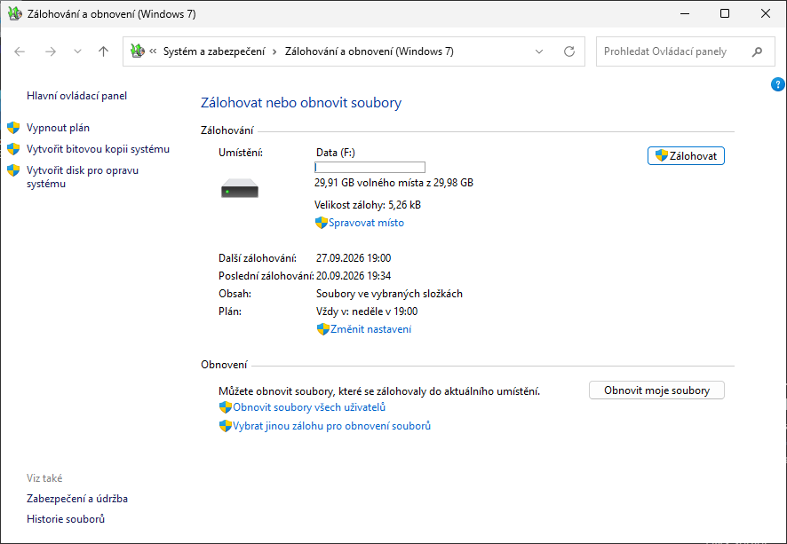

<!--
Snímek z Windows 11 24H2 (naplánovaná záloha složky C:\Share na jednotku Data (F:), nástroj se od Windows 7 nemění).
-->

---

# Typy úložišť

- **Oddíl na pevném disku** (interním, externím nebo virtuálním)
  - Nesmí být systémový ani obsahovat zálohovaná data
- **Optické médium** (CD nebo DVD)
  - Dnes prakticky nepoužitelné (velikost, absence mechanik)
- **USB flash disk**
  - Musí mít velikost minimálně 1 GB
- **Sdílený adresář** (nebo síťový disk)
  - Není k dispozici u edice Home (Pro, Education, Enterprise ano)
  - Nutno zadat účet pro připojení s oprávněním zápisu

<!--
MS uvádí, že je potřeba mít oprávnění Úplné řízení, ale obecně by mělo postačovat oprávnění pro zápis (problémy by ale mohly nastat v případě, že by bylo potřeba modifikovat oprávnění na některém souboru s metadaty nebo adresáři, ve kterém je záloha uložena).

Omezení síťového cíle na vyšší edice platí od Windows 7 (Home Premium) a přetrvává u Windows 10/11 Home; aktuální dokumentace Microsoftu k zastaralému nástroji ho už výslovně neuvádí – nelze tedy doložit odkazem, ověřit na instalaci Windows 11 Home.
-->

---

# Záloha souborů ve vybraných složkách

- Data uložena do komprimovaných **.zip souborů**
  - Lze procházet v jakémkoliv správci souborů
- **Inkrementální zálohování** dat
  - Ukládají se pouze změny oproti poslední verzi zálohy
- **Neukládají se** (i když je lze vybrat pro zálohu)
  - Soubory registrované jako součást programů (obecně soubory v adresáři Program Files, ale mohou i jiné)
  - Soubory uložené na FAT/FAT32/exFAT oddílech disků
  - Soubory v koši a dočasné soubory

<!--
ZIP archívy jsou chráněny pouze NTFS oprávněními.

Změny oproti poslední záloze se určují na základě archivního bitu.

U Windows Vista nešlo explicitně vybírat konkrétní soubory a adresáře pro zálohování, pouze typy souborů.
-->

---

# Struktura záloh vybraných adresářů

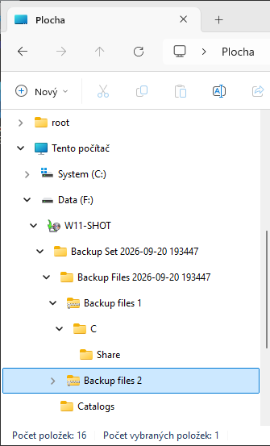

<!--
Katalogy jsou na úrovni Backup Set i Backup Files.
Snímek: navigační podokno Průzkumníka souborů ve Windows 11 24H2 – Data (F:) > W11-SHOT > Backup Set <datum> > Backup Files <datum> > Backup files 1 > C > Share; vedle Backup Files je složka Catalogs.
-->

---

# Katalogy

- **Globální katalog** (soubor `GlobalCatalog.wbcat`)
  - Obsahuje index všech zálohovaných souborů spolu s informacemi, ve kterých ZIP souborech jsou uloženy
  - U bitových kopií systému obsahuje informace o verzi zachycené bitové kopie systému (system image)
- **Souborové katalogy** (soubory s příponou `.wbcat`)
  - Obsahují seznam oprávnění (ACL seznam) pro každý zálohovaný soubor
  - Při manuálním obnovení souborů (extrakci souborů ze ZIP souboru) nejsou obnovena jejich oprávnění

<!--
Globální katalog je uložen v Backup Set\Catalogs, souborové katalogy pak v Backup Files\Catalogs.

Formát .wbcat je binární.
-->

---

# Obnova souborů a složek

- **Výběr souborů a složek** přes nástroj Zálohování a obnovení (Windows 7)
  - Umožňuje obnovit všechny soubory, k nimž má daný uživatel oprávnění pro čtení
  - Správce může obnovit veškerá zálohovaná data
- **Ruční obnova** rozbalením ZIP souborů (bez NTFS oprávnění)

---

# Obnovení souborů a složek

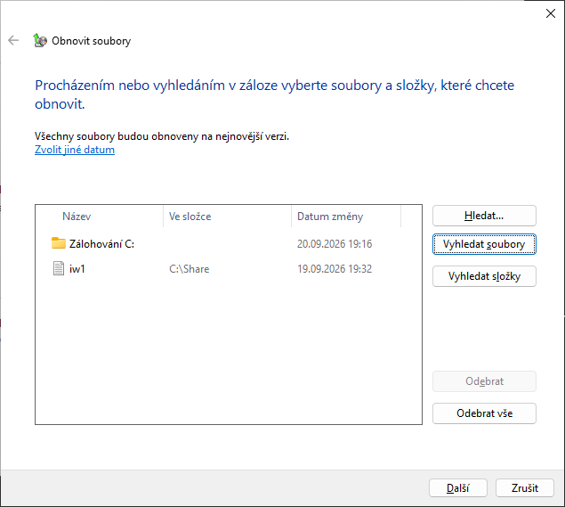

---

# Bitová kopie systému (System Image)

- Obsahuje kopii **všech oddílů disků** potřebných ke spuštění systému Windows (záloha systému)
  - Obsahuje data systému Windows, programy, všechny ovladače a kompletní nastavení registru
- Lze uložit pouze na interní, externí nebo virtuální disky obsahující souborový systém **NTFS** nebo do **sdíleného adresáře** (jen poslední verze)
- Data uložena ve formě **.vhdx souboru** (do Windows 7 .vhd)
  - Lze připojit jako virtuální disk (Správa disků, `Mount-DiskImage`) nebo z něj spustit virtuální počítač v Hyper-V

<!--
Může se stát, že systém vyhodnotí, že i např. oddíl na externím disku je potřeba pro spuštění systému.

Při ukládání na disk se provádí verzování bitových kopií, u sdíleného adresáře ne (stará bitová kopie se maže před vytvářením nové, takže pokud vytváření nové bitové kopie selže, nebude mít uživatel ani starou, ani novou bitovou kopii).

První připojení bitové kopie systému nesmí být v režimu pouze pro čtení, až při druhém připojení ji lze takto připojit.

Pro spuštění VHDX v Hyper-V je u UEFI/GPT instalace potřeba VM generace 2 a obraz systémového (EFI) oddílu – v praxi je pohodlnější Disk2vhd (Sysinternals).
-->

---

# Obnovení bitové kopie systému

- Obnovení systému a **veškerých uživatelských dat** obsažených na systémovém (i jiných) oddílech
  - Přepisuje veškerý obsah cílových oddílů
- Nástroj je součástí prostředí **Windows RE** (*Windows Recovery Environment*)
  - Odstranit potíže > Upřesnit možnosti > *Obnovení bitové kopie systému*
  - Spuštění z lokálního WinRE, z instalačního média (*Opravit počítač*) nebo z jednotky pro obnovení
- U šifrovaných disků je potřeba **klíč pro obnovení BitLockeru**

<!--
Lokální WinRE je uloženo v oddílu pro obnovení (dříve v adresáři C:\Recovery) – podrobnosti v kapitole Windows Recovery Environment.

Technická reference WinRE pro Windows 11 uvádí „System image recovery“ už jen pro edice Windows Server; na klientu Windows 11 je položka „Obnovení bitové kopie systému“ v Upřesnit možnosti stále přítomna (potvrzuje stránka podpory k WinRE), ale jde o součást zastaralého řešení SIB. Ověřit na stanici s 25H2.

Zdroj: https://learn.microsoft.com/en-us/windows-hardware/manufacture/desktop/windows-recovery-environment--windows-re--technical-reference
-->

---

<!-- _class: dense -->

# Zálohování přes příkazový řádek – `wbadmin`

- Umožňuje **automatizaci** vytváření bitových kopií systému (s pomocí naplánovaných úloh)
- **Vytvoření** bitové kopie oddílů
  - `wbadmin start backup -backupTarget:{<oddíl> | <sdílený-adresář>} -include:<oddíl> [,<oddíl> …]`
- **Vypsání informací** o bitových kopiích oddílů
  - `wbadmin get versions [-backupTarget:<oddíl/adr>]`
- **Vypsání obsahu** určité verze bitové kopie oddílů
  - `wbadmin get items -version:<identifikátor>`
- **Obnova celého systému** jen z Windows RE
  - `wbadmin start sysrecovery -version:<identifikátor> -backupTarget:<oddíl>`
- Ve Windows 11 **stále přítomen** (součást zastaralého řešení SIB)

<!--
V grafickém nástroji nelze automatizovat vytváření bitových kopií (v plánu zálohování lze zaškrtnout vytvoření bitové kopie, ale ta se vytvoří jen jednou při prvním zálohování a pak už se vytvářet nebude).

Na klientu jsou k dispozici jen podpříkazy start backup, stop job, get versions, get items, get status a start sysrecovery (z WinRE); plánování (enable backup) a obnova stavu systému jsou jen na Windows Server (Windows Server Backup).

Zdroj: https://learn.microsoft.com/en-us/windows-server/administration/windows-commands/wbadmin
-->

---

<!-- header: 'Desktop systémy Microsoft Windows Ochrana a obnovení systému' -->

# Ochrana a obnovení systému

- **Ochrana systému** (*System Protection*)
  - Zajišťuje vytváření bodů obnovení (*restore points*)
  - Umožňuje přístup k předchozím verzím souborů
  - Využívá stínové kopie (*shadow copies*)
  - Ovládací panely > Systém > *Ochrana systému* (`SystemPropertiesProtection.exe`), Nastavení > Systém > O systému > *Ochrana systému*
  - Na čistých instalacích Windows 11 bývá pro systémový disk vypnutá – zkontrolovat a zapnout
- **Obnovení systému** (*System Restore*, `rstrui.exe`)
  - Navrací systém do dříve uloženého stavu (vybraného bodu obnovení)
  - Spuštění buď ze systému Windows nebo z prostředí Windows RE (Odstranit potíže > Upřesnit možnosti > *Obnovení systému*)

<!--
Výchozí stav Ochrany systému Microsoft nedokumentuje; na čistých instalacích Windows 11 (včetně 24H2/25H2) je ochrana systémového disku typicky vypnutá a zapne se až ruční konfigurací nebo instalátorem, který si ji vyžádá. Ověřit na stanici.

PowerShell: Enable-ComputerRestore -Drive "C:\", Get-ComputerRestorePoint, Checkpoint-Computer, Restore-Computer -RestorePoint <číslo>.

Zdroj: https://support.microsoft.com/en-us/windows/system-restore-a5ae3ed9-07c4-fd56-45ee-096777ecd14e
-->

---

# Nastavení ochrany systému

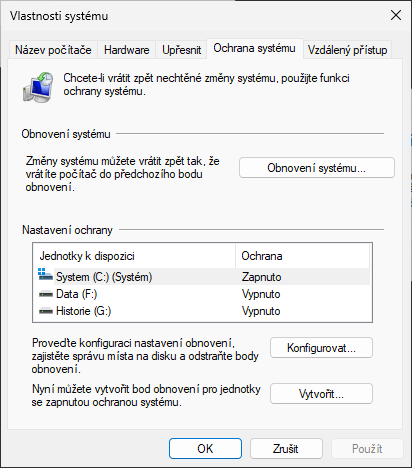

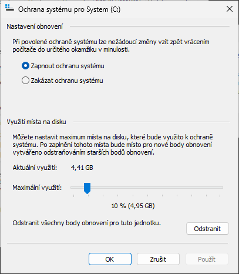

<!--
Snímky z Windows 11 24H2 (klasické Vlastnosti systému › Ochrana systému a dialog Konfigurovat). U Windows 7 byla navíc možnost zapnout pouze ochranu souborů (a ne celého systému), jež umožňovala přístup k předchozím verzím souborů, ale neumožňovala obnovit celý systém do předchozího stavu.
-->

---

<!-- _class: dense -->

# Body obnovení (Restore Points)

- Obsahují **soubory a nastavení systému Windows**, registr, soubory programů a ovladače
  - Uloženy na stejném oddílu jako chráněná data (úložiště stínových kopií)
- Vytvářeny **inkrementálně**
  - **Automaticky** vždy před důležitými změnami systému (instalace aplikací, ovladačů, aktualizací Windows Update, …)
  - **Automaticky naplánovanou úlohou** (nejvýše jeden za 7 dní, pokud nevznikl jiný)
  - **Manuálně** uživatelem (Ochrana systému > *Vytvořit*) nebo `Checkpoint-Computer`
- Neovlivňují **uživatelská data** (v profilech i mimo)
  - Odstraní ale aplikace, ovladače a aktualizace nainstalované po vytvoření bodu
- Uchování: Windows 11 24H2 od června 2025 nejvýše **60 dní** (starší body se mažou); Windows 10 90 dní, Windows 11 předtím nekonzistentně 10–90 dní
- **Velikost úložiště** omezena v Ochraně systému (Konfigurovat > *Využití místa na disku*)

<!--
O vytvoření bodu obnovení může zažádat jakákoliv aplikace (nejčastěji o to žádají instalační programy přes API SRSetRestorePoint).

Šedesátidenní limit zavedla bezpečnostní aktualizace z 10. 6. 2025 (KB5060842) pro Windows 11 24H2: „After installing the June 2025 Windows security update, Windows 11, version 24H2 will retain system restore points for up to 60 days. … This 60-day limit will also apply to future versions of Windows 11, version 24H2.“ Windows 11 25H2 je balíček povolení nad stejnou platformou 24H2, limit tedy platí i tam. Devadesát dní bylo chování Windows 10; ve Windows 11 před KB5060842 se body mazaly nekonzistentně (podle tisku 10–90 dní) – KB5060842 samo o 90 dnech nemluví.
Zdroj: https://www.xda-developers.com/windows-11-system-restore-points-may-vanish-30-days-earlier/

Body obnovení sdílejí úložiště stínových kopií s Historií souborů, Obnovením k určitému časovému bodu i zálohovacím softwarem – při naplnění limitu se mažou nejstarší stínové kopie bez ohledu na původ.

Zdroj: https://support.microsoft.com/en-us/topic/june-10-2025-kb5060842-os-build-26100-4349-47ff300b-2a04-440c-9476-2860d04fce8d
-->

---

# Nástroj Obnovení systému

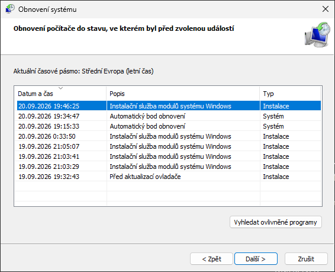

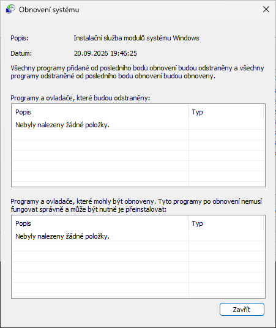

<!--
rstrui.exe – snímky z Windows 11 24H2 (seznam bodů obnovení a dialog Vyhledat ovlivněné programy). Tlačítko „Vyhledat ovlivněné programy“ ukáže, které aplikace a ovladače budou odstraněny nebo vráceny.

Z Windows RE se Obnovení systému spouští bez přihlášení správce (Windows 11), u šifrovaného disku je potřeba klíč pro obnovení BitLockeru.
-->

---

<!-- _class: dense -->

# Obnovení k určitému časovému bodu (Point-in-time restore)

- **Nový nástroj** Windows 11 24H2/25H2 (2026, obnova zatím *preview*), Nastavení > Systém > Obnovení > *Obnovení k určitému časovému bodu*
- **Body obnovení přes VSS** automaticky (výchozí každých ~24 h), uchování nejvýše 72 h
  - Limit 2 % disku (2–50 GB), využívá rezervované úložiště; při < 20 GB volného místa se nejstarší body mažou
- Obnovuje **celý stav systémového svazku** – OS, aplikace, nastavení i lokální soubory
  - Změny po bodu obnovení se ztratí (data v OneDrive nedotčena); ostatní svazky se neobnovují
- Obnova **pouze z Windows RE** (stav *preview*): Odstranit potíže > *Obnovení k určitému časovému bodu* (nutný klíč pro obnovení BitLockeru)
- **Výchozí stav**
  - **Zapnuto** na nespravovaných PC (Home, Pro mimo doménu a MDM) se systémovým svazkem ≥ 200 GB
  - **Vypnuto** na spravovaných PC (Enterprise, Education, Pro v doméně/MDM) až do Windows 11 26H2; správa přes Recovery CSP (Intune)
- Vs. **Obnovení systému**: to obnovuje jen systémové soubory a nastavení, body vznikají událostmi/ručně, bez limitu 72 h, správa v Ovládacích panelech

<!--
Frekvenci (4, 6, 12, 16 nebo 24 h) a dobu uchování (4–72 h) může měnit jen edice Enterprise, Home a Pro jen zapnutí a limit místa. Nelze exportovat ani připojit body jako obraz; body vytvořené pod jinou edicí (např. před upgradem Home → Pro) nejdou použít; soubory šifrované EFS obnovu blokují.

Ve Windows RE je položka vedle Obnovení systému; dokumentace zatím uvádí obnovu jen lokálně z WinRE („in preview“ ve stavu k červnu 2026). Český název položky převzat ze stránek podpory (support.microsoft.com/cs-cz) – ověřit skutečný popisek na stanici s 25H2.

Zdroj: https://learn.microsoft.com/en-us/windows/configuration/point-in-time-restore
Zdroj: https://support.microsoft.com/en-us/windows/experience/backup-recovery/recovery-options-in-windows
-->

---

<!-- header: 'Desktop systémy Microsoft Windows Předchozí verze (Previous Versions)' -->

# Předchozí verze (Previous Versions)

- Přístup k **stínovým kopiím** jednotlivých souborů i celých adresářů
  - Záložka *Předchozí verze* ve vlastnostech souboru/složky v Průzkumníku souborů
  - Možnost návratu k předchozím verzím souborů (*Otevřít*, *Obnovit*)
- **Zdroje verzí** ve Windows 10/11
  - **Body obnovení** (Ochrana systému) a **Historie souborů**
  - Na Windows Server také **stínové kopie sdílených složek**
- Je možné obnovovat i **přejmenované a smazané soubory** (včetně souborů vymazaných z koše)
  - Potřeba znát adresář, kde byly původně uloženy
  - Obnovení přes předchozí verze tohoto adresáře
- Historie: **Windows 8/8.1** záložku skryly (jen Historie souborů), Windows 10 ji vrátil

<!--
Lze přistupovat k souborům a adresářům v bodech obnovení i zálohovaných datech (jelikož body obnovení i zálohování je založeno na stínových kopiích).

Bezplatný nástroj ShadowExplorer umožňuje procházet data ve stínových kopiích stejně jako Předchozí verze, včetně kopií, které Průzkumník souborů nenabízí.

Bez zapnuté Ochrany systému nebo Historie souborů je záložka prázdná („Nejsou k dispozici žádné předchozí verze“) – častý dotaz uživatelů.
-->

---

<!-- _class: dense -->

# Obnovení předchozí verze souboru

- Ve Windows 10/11 je záložka *Předchozí verze* viditelná **přímo ve vlastnostech** souboru nebo složky
- Historie: ve Windows 8/8.1 byla záložka viditelná **pouze při přístupu ze sítě**
  - Pro její zobrazení stačilo otevřít vlastnosti souboru nebo složky ze sítě, tedy například namísto cesty ve formátu `<jednotka>:\` použít síťovou (UNC) cestu `\\localhost\<jednotka>$\`

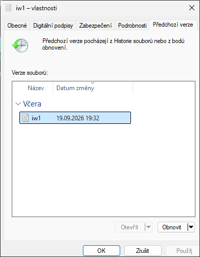

<!--
Trik s UNC cestou funguje i dnes u serverových sdílených složek se zapnutými stínovými kopiemi – klient vidí verze ze serveru, nikoli lokální.
-->

---

<!-- _class: dense -->
<!-- header: 'Desktop systémy Microsoft Windows Historie souborů (File History)' -->

# Historie souborů (File History)

- Kombinace **předchozích verzí** se **zálohováním**
  - Zálohování předchozích verzí souborů v pravidelných intervalech na cílový (interní nebo externí) disk nebo do sdíleného adresáře
  - Pokud je cílový disk / sdílený adresář nepřístupný
    - Soubory se uloží do lokální vyrovnávací paměti
    - Soubory jsou automaticky přesunuty na cílový disk / do sdíleného adresáře, jakmile je opět k dispozici
- Windows 11: **pouze Ovládací panely** > Systém a zabezpečení > *Historie souborů*
  - Stránka v Nastavení (Windows 10: Zálohování > *Zálohovat pomocí Historie souborů*) byla odstraněna
- Stav: funkční, ale **bez dalšího vývoje** (*legacy*); Microsoft směřuje uživatele k Zálohování Windows a OneDrive
- Lze používat zároveň se **Zálohováním a obnovením (Windows 7)**

<!--
Historie souborů neumožňuje přístup k verzím souborů, jež jsou obsaženy v bodech obnovení nebo ve standardních zálohách. Důvodem je, že body obnovení neobsahují žádná uživatelská data, takže je zbytečné k těmto datům přistupovat.

Historie: ve Windows 8 nebylo možné používat Historii souborů se Zálohováním systému Windows 7; od Windows 10 lze obojí.

Cílovým diskem nemůže být disk obsahující systémový oddíl.

Historie souborů není na oficiálním seznamu zastaralých funkcí Windows (na rozdíl od Zálohování a obnovení (Windows 7)), Microsoft ji ale od Windows 11 nerozvíjí a v Nastavení ji nahradila aplikace Zálohování Windows.

Zdroj: https://support.microsoft.com/en-us/windows/experience/backup-recovery/backup-and-restore-with-file-history
-->

---

# Nástroj Historie souborů

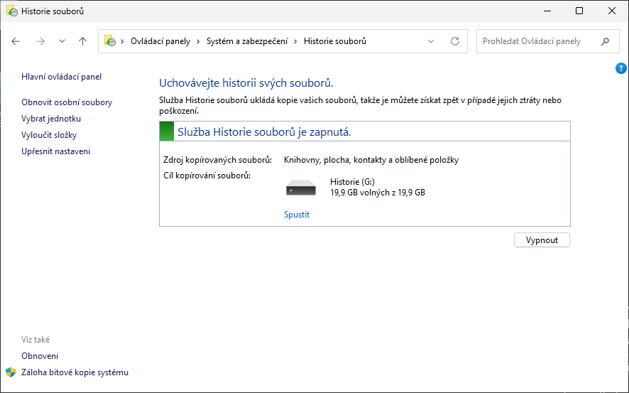

---

# Nastavení Historie souborů

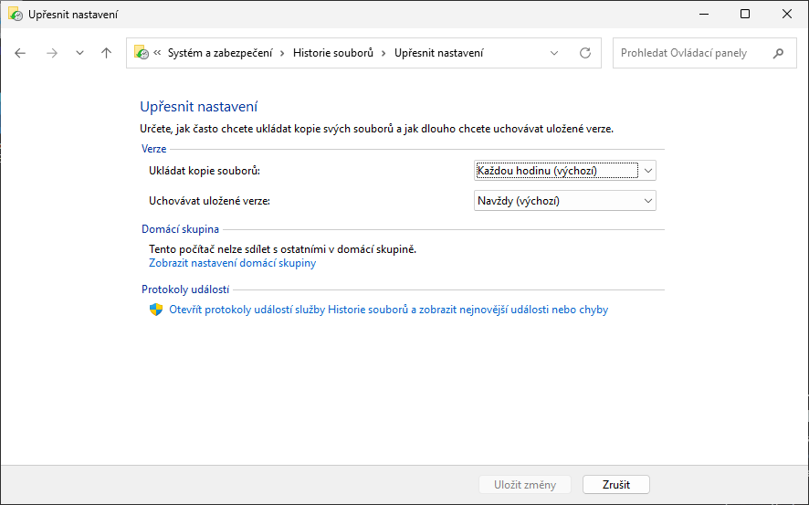

<!--
Ve výchozím nastavení se zálohování provádí co 1 hodinu, nejmenší interval zálohování je 10 minut, nejvyšší 1 den. Uchování verzí: navždy (výchozí), 1 měsíc až 2 roky, nebo dokud je místo.

Ve Windows 10/11 nelze nastavovat velikost offline mezipaměti, ve Windows 8 šlo nastavit 2–20 % velikosti oddílu disku.
-->

---

# Výběr souborů a složek

- **Automaticky zálohovány**
  - **Knihovny** (Dokumenty, Obrázky, Videa, Hudba a vlastní knihovny)
  - **Soubory na ploše** (obsah adresáře Desktop)
  - **Kontakty** (obsah adresáře Contacts)
  - **Oblíbené položky** (obsah adresáře Favorites)
- **Další složky**: zahrnout do existující nebo nové knihovny (Zobrazit další možnosti > *Zahrnout do knihovny*)
  - Windows 11 nemá tlačítko „*Přidat složku*“ z Nastavení Windows 10
- **Složky synchronizované s OneDrive** se nezálohují (chrání je OneDrive)
- Možnost **vyloučení** konkrétních knihoven a složek (*Vyloučit složky*)

<!--
Důvodem, proč lze zálohovat pouze soubory v knihovnách, na ploše, kontakty a oblíbené položky, je, že mimo tato úložiště by měly být uloženy již jen soubory systému a aplikací, které není nutné zálohovat.

Vyloučení složek OneDrive potvrzují odpovědi Microsoftu na Microsoft Q&A (Historie souborů považuje OneDrive za samostatný synchronizační a obnovovací systém), oficiální dokumentace to výslovně neuvádí. Obejít lze přidáním složky OneDrive do knihovny a stažením všech souborů (vypnutí Souborů na vyžádání).

Zdroj: https://support.microsoft.com/en-us/windows/experience/backup-recovery/backup-and-restore-with-file-history
-->

---

# Obnovení souborů a složek

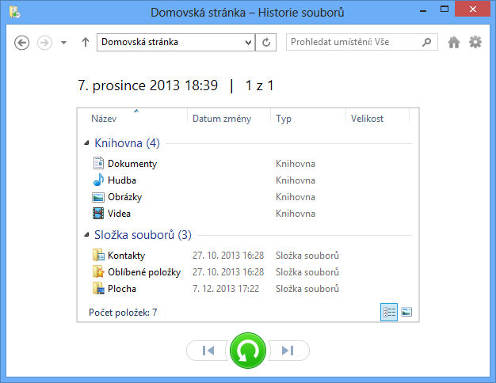

<!--
K předchozím verzím souborů se dá přistoupit také přes záložku Předchozí verze ve vlastnostech souboru nebo složky v Průzkumníku souborů (tlačítko Historie z pásu karet Windows 8/10 ve Windows 11 není).
-->

---

<!-- _class: dense -->
<!-- header: 'Desktop systémy Microsoft Windows Obnovení počítače' -->

# Obnovit počítač do továrního nastavení

- Nastavení > Systém > Obnovení > **Obnovit počítač do továrního nastavení** (`systemreset.exe`); ve Windows RE Odstranit potíže > *Obnovit počítač do továrního nastavení*
- **Zachovat moje soubory**
  - Přeinstaluje Windows, zachová soubory a účty uživatelů, odstraní aplikace a nastavení
  - Volitelně obnoví předinstalované aplikace výrobce (*Restore preinstalled apps*)
- **Odebrat vše**
  - Čistá instalace – odstraní účty, data, aplikace i nastavení; volitelně vyčistí celý disk (předání počítače)
- **Zdroj instalace**
  - **Místní přeinstalace** – z komponent na disku (bez samostatného obrazu pro obnovení, od Windows 10)
  - **Stažení z cloudu** – aktuální bitová kopie z Windows Update (rychlejší, potřebuje internet; ne u LTSC)
- Obnovuje OS i ovladače **v aktualizovaném stavu**; při selhání omezený návrat zpět
- Historie: **Windows 8** – Částečně obnovit počítač (*refresh*) / Všechno smazat (*reset*), vlastní obraz přes `recimg.exe`; ve Windows 10+ sloučeno do jedné funkce, `recimg` odstraněn, aplikace ze Store se nezachovávají

<!--
Problémem varianty Zachovat moje soubory je, že ne vždy se zachová, co by bylo potřeba. Např. nastavení asociace souborů, pravidla brány firewall a nainstalované aplikace (Win32 i Store) se odstraní – před resetem je vhodné mít zálohu přes Zálohování Windows / OneDrive.

Push-button reset ve Windows 10/11 nepotřebuje ani nepodporuje samostatný obraz pro obnovení na oddílu (image-less recovery); výrobci přizpůsobují reset pomocí auto-apply složek a provisioning balíčků. Při spuštění z jednotky pro obnovení není Zachovat moje soubory / Odebrat vše k dispozici, jen obnova z jednotky (bare metal recovery).

Zdroj: https://learn.microsoft.com/en-us/windows-hardware/manufacture/desktop/push-button-reset-overview
Zdroj: https://support.microsoft.com/en-us/windows/experience/backup-recovery/recovery-options-in-windows
-->

---

<!-- _class: dense -->

# Další možnosti obnovy

- **Opravit problémy pomocí Windows Update** (Nastavení > Systém > Obnovení > *Přeinstalovat*)
  - Oprava na místě (*in-place repair*): stáhne opravnou verzi aktuální verze Windows a přeinstaluje ji; zachová aplikace, soubory i nastavení
  - Windows 11 22H2 a novější (od aktualizace z února 2024); nedostupné na spravovaných PC (zásady Windows Update for Business, WSUS, Autopatch)
- **Vrátit se k předchozí verzi Windows** – do 10 dnů po upgradu (složka `Windows.old`)
- **Odinstalovat aktualizace** – z Nastavení > Windows Update > *Historie aktualizací* nebo z Windows RE
- **Jednotka pro obnovení** (`RecoveryDrive.exe`)
  - USB disk s prostředím Windows RE; volba „*Zálohovat systémové soubory na jednotku pro obnovení*“ umožní přeinstalaci Windows (obnova z jednotky)
  - Neobsahuje data ani aplikace uživatele; Microsoft doporučuje vytvořit znovu jednou ročně
- **Instalační médium** (Media Creation Tool / ISO) – *Opravit počítač* spustí Windows RE, případně čistá instalace
- **Nástroje**: `sfc /scannow`, `DISM /Online /Cleanup-Image /RestoreHealth` (oprava úložiště komponent)

<!--
Opravit problémy pomocí Windows Update je odpověď na dřívější „in-place upgrade z ISO“ – nepotřebuje médium a výsledek je stejná verze a build. Nabídka chybí, pokud jsou nastaveny zásady UpdateServiceUrl, DeferFeatureUpdatePeriodInDays, DeferQualityUpdatePeriodInDays, TargetReleaseVersion nebo SetDisableUXWUAccess.

Velikost USB disku pro jednotku pro obnovení se systémovými soubory Microsoft aktuálně nespecifikuje (dříve 16 GB); v praxi 16–32 GB.

Zdroj: https://support.microsoft.com/en-us/windows/fix-issues-by-reinstalling-the-current-version-of-windows-497ac6da-7cac-4641-82a5-f50398d879a0
Zdroj: https://support.microsoft.com/en-us/windows/create-a-recovery-drive-abb4691b-5324-6d4a-8766-73fab304c246
Zdroj: https://support.microsoft.com/en-us/windows/experience/backup-recovery/recovery-options-in-windows
-->

---

<!-- _class: dense -->

# Rychlé zotavení počítače (Quick machine recovery)

- **Windows 11 24H2** (build 26100.4700 a novější, červenec 2025) a 25H2; součást Windows Resiliency Initiative
- Po **opakovaném selhání startu** Windows RE připojí síť (Ethernet nebo Wi-Fi WPA/WPA2 s heslem) a hledá ve Windows Update cílenou opravu (*cloud remediation*)
  - Nalezenou opravu stáhne, aplikuje a restartuje; bez opravy nabídne ostatní nástroje WinRE, nebo opakuje hledání v intervalu (*auto remediation*)
  - Aplikovaná oprava je vidět v Nastavení > Windows Update > *Historie aktualizací*
- **Výchozí stav**
  - **Zapnuto**: Home a Pro mimo doménu / bez správy MDM (jednorázové hledání)
  - **Vypnuto**: Enterprise, Education a spravované Pro – zapnout zásadou (Recovery CSP / Intune, GPO)
- Nastavení > Systém > Obnovení > **Rychlé zotavení počítače**
- `reagentc /setrecoverysettings /path settings.xml` (XML: Wi-Fi, CloudRemediation, AutoRemediation), `/getrecoverysettings`, `/clearrecoverysettings`
- **Testovací režim** `reagentc /SetRecoveryTestmode` + `reagentc /BootToRe` (Insider)

<!--
Motivací byl výpadek způsobený vadnou aktualizací CrowdStrike v červenci 2024 – miliony PC v boot loopu, oprava vyžadovala ruční zásah ve WinRE. Rychlé zotavení počítače umožňuje Microsoftu doručit opravu (např. odstranění vadného ovladače) přímo do WinRE bez zásahu správce.

Kroky: 1. opakovaný pád při startu, 2. start do WinRE, 3. připojení k síti a dotaz na Windows Update, 4. stažení a aplikace opravy (nebo navedení uživatele / opakování), 5. restart. Podporované sítě: kabel a WPA/WPA2 s heslem; ve WinRE se od 2026 (Insider) znovu používají i Wi-Fi profily uložené ve Windows.

Český název položky převzat ze stránek podpory (support.microsoft.com/cs-cz: „Rychlé zotavení počítače“) – ověřit skutečný popisek na stanici s 25H2.

Zdroj: https://learn.microsoft.com/en-us/windows/configuration/quick-machine-recovery/
Zdroj: https://learn.microsoft.com/en-us/windows-hardware/manufacture/desktop/windows-recovery-environment--windows-re--technical-reference
-->

---

<!-- _class: dense -->
<!-- header: 'Desktop systémy Microsoft Windows Windows Recovery Environment' -->

# Windows Recovery Environment (Windows RE)

- Rozšíření prostředí **Windows PE** o sadu nástrojů pro obnovu systému Windows
  - Předinstalováno u všech desktop edicí; uloženo v oddílu pro obnovení (NTFS) hned za oddílem Windows
- Nabídka **Odstranit potíže**
  - Obnovit počítač do továrního nastavení, Rychlé zotavení počítače, Obnovení k určitému časovému bodu
  - **Upřesnit možnosti**: Oprava spouštění systému, Nastavení spouštění, Příkazový řádek, Odinstalovat aktualizace, Nastavení firmwaru UEFI, Obnovení systému, Obnovení bitové kopie systému
- **Spuštění Windows RE**
  - **Automaticky** po dvou neúspěšných startech (nebo dvou pádech do 2 minut po startu), při chybě Secure Boot
  - **Shift + Restartovat**; Nastavení > Systém > Obnovení > *Spuštění s upřesněným nastavením*; `shutdown /r /o`; `reagentc /boottore`
  - **Z jednotky pro obnovení** nebo instalačního média (*Opravit počítač*)
- Windows 11: nástroje běží **bez hesla správce**; k datům na šifrovaném disku je potřeba klíč BitLockeru
- **Zdroj obrazu**: `winre.wim` (v `install.wim` v `\Windows\System32\Recovery`), při průchodu specialize zkopírován do oddílu pro obnovení
  - Vlastní bootovatelné médium: postup jako u Windows PE, jen s `winre.wim` namísto `boot.wim`

<!--
Windows RE je založeno na Windows PE a obsahuje volitelné komponenty WinPE-SRT (Startup Repair), WinPE-Rejuv (reset), WinPE-SecureStartup (BitLocker), WinPE-WMI, WinPE-Scripting, WinPE-HTA aj. Přidat lze ovladače, jazyky a jeden vlastní nástroj do nabídky (reagentc /setbootshelllink).

Síť ve WinRE se zapíná jen pro scénáře, které ji potřebují (Rychlé zotavení počítače, vzdálená náprava, Cloud rebuild – ten je v září 2026 jen v Insider Experimental kanálu); podporován je Ethernet, WPA/WPA2 s heslem a některé podnikové sítě s certifikátem počítače.

Historie: „režim ladění“ z bootovací nabídky (F8) Windows 7 spouštěl WinRE z C:\Recovery; od Windows 8 je nabídka F8 vypnutá (rychlý start) a Poslední známá funkční konfigurace odstraněna – náhradou je Oprava spouštění systému, Obnovení systému a Nastavení spouštění.

Zdroj: https://learn.microsoft.com/en-us/windows-hardware/manufacture/desktop/windows-recovery-environment--windows-re--technical-reference
Zdroj: https://support.microsoft.com/cs-cz/windows/windows-recovery-environment-0eb14733-6301-41cb-8d26-06a12b42770b
-->

---

<!-- _class: dense -->

# Správa Windows RE – `reagentc`

- `reagentc /info` – stav (Enabled/Disabled) a umístění, např. `\\?\GLOBALROOT\device\harddisk0\partition4\Recovery\WindowsRE`
- `reagentc /disable` – vypne WinRE a přesune `winre.wim` do `C:\Windows\System32\Recovery`; `reagentc /enable` – zapne (výchozí nebo vlastní obraz)
- `reagentc /setreimage /path <cesta>` – registrace vlastního obrazu, `/boottore` – příští start do WinRE, `/setbootshelllink` – vlastní nástroj v nabídce
- `reagentc /setrecoverysettings`, `/getrecoverysettings`, `/clearrecoverysettings` – nastavení Rychlého zotavení počítače (viz výše)
- **Úpravy obrazu**: `dism /Mount-Image /ImageFile:winre.wim …` – ovladače, jazyky, volitelné komponenty (postup jako u Windows PE)
  - Aktualizace WinRE obraz nahradí a zachová jen ovladače z běžícího systému a obsah `\Sources\Recovery`

<!--
reagentc vyžaduje oprávnění správce. Po /disable je winre.wim v C:\Windows\System32\Recovery a lze ho připojit přes DISM, upravit a znovu zapnout přes /enable; /setreimage se hodí, když je obraz uložen jinde (např. na vlastním oddílu).

Windows RE je založeno na Windows PE a obsahuje volitelné komponenty WinPE-SRT (Startup Repair), WinPE-Rejuv (reset), WinPE-SecureStartup (BitLocker), WinPE-WMI, WinPE-Scripting, WinPE-HTA aj. Přidat lze ovladače, jazyky a jeden vlastní nástroj do nabídky (reagentc /setbootshelllink); vlastní nástroj musí ležet v \Sources\Recovery\Tools, aby přežil aktualizaci WinRE.

Zdroj: https://learn.microsoft.com/en-us/windows-hardware/manufacture/desktop/reagentc-command-line-options
Zdroj: https://learn.microsoft.com/en-us/windows-hardware/manufacture/desktop/windows-recovery-environment--windows-re--technical-reference
-->

---

<!-- _class: dense -->

# Oddíl pro obnovení a aktualizace WinRE

- **Oddíl pro obnovení** (GPT typ `DE94BBA4-06D1-4D40-A16A-BFD50179D6AC`, atribut `0x8000000000000001`; MBR id `27`)
  - **Velikost**: `winre.wim` + vlastní úpravy + 250 MB volného místa pro servis (doporučení pro vlastní skripty: alespoň 990 MB)
  - **Umístění** hned za oddílem Windows – Windows ho pak umí zvětšit zmenšením oddílu Windows; formát NTFS
- **Aktualizace WinRE** (*Safe OS Dynamic Update*) přicházejí s měsíčními kumulativními aktualizacemi
  - Pokud se nový obraz nevejde, Windows oddíl zvětší; když to nejde, obraz skončí v oddílu Windows a starý oddíl osiří
  - 2024: aktualizace KB5034441/KB5034440 (CVE-2024-20666) selhávaly chybou 0x80070643 na oddílech s < 250 MB volného místa
- **Ruční zvětšení** podle KB5028997
  - `reagentc /disable` → `diskpart`: `shrink desired=250 minimum=250`, `delete partition override`, `create partition primary id=…`, `gpt attributes=…`, `format quick fs=ntfs label="Windows RE tools"` → `reagentc /enable`

<!--
Nový oddíl podle KB5028997: u GPT „create partition primary id=de94bba4-06d1-4d40-a16a-bfd50179d6ac“ a „gpt attributes=0x8000000000000001“, u MBR „create partition primary id=27“.

Doporučení Microsoftu pro vlastní diskpart skripty výrobců: oddíl pro obnovení alespoň 990 MB s minimálně 250 MB volného místa.

Zdroj: https://learn.microsoft.com/en-us/windows-hardware/manufacture/desktop/configure-uefigpt-based-hard-drive-partitions
Zdroj: https://learn.microsoft.com/en-us/windows-hardware/manufacture/desktop/windows-recovery-environment--windows-re--technical-reference
Zdroj: https://support.microsoft.com/en-us/topic/kb5028997-instructions-to-manually-resize-your-partition-to-install-the-winre-update-400faa27-9343-461c-ada9-24c8229763bf
-->

---

# Oprava spouštění systému (Startup Repair)

- **Automatická analýza a oprava**
  - Chyb v MBR, zaváděcím sektoru nebo tabulce oddílů (BIOS) a chybějících zaváděcích souborů na oddílu EFI (UEFI)
  - Poškozených dat v BCD (*Boot Configuration Data*)
  - Chybějících nebo poškozených systémových souborů nebo souborů ovladačů
  - Problematických nebo nekompatibilních ovladačů
  - Nekompatibilních aktualizací
  - Chyb v metadatech souborového systému
  - Poškozených klíčů registru
- **Nastavení spouštění**: nouzový režim (F4/F5/F6), zakázání vynucení podpisu ovladačů (F7), ochrany proti malwaru při spuštění (F8), automatického restartu (F9)

<!--
Oprava spouštění systému se spustí automaticky po dvou neúspěšných startech; protokol je v C:\Windows\System32\LogFiles\Srt\SrtTrail.txt.

Poslední známá funkční konfigurace (Last Known Good Configuration) z Windows 7 ve Windows 8 a novějších neexistuje; nouzový režim se spouští přes Nastavení spouštění ve WinRE (nebo bcdedit /set {default} safeboot minimal, msconfig).
-->

---

# Nástroj Bootrec

- Součást Windows RE (*Příkazový řádek*), určen pro **BIOS/MBR instalace**
- **Nalezení** všech nainstalovaných systémů
  - `bootrec /ScanOs`
- **Přidání** vybraných systémů do úložiště BCD
  - `bootrec /RebuildBcd`
- **Oprava MBR** (*Master Boot Record*)
  - `bootrec /FixMbr`
- **Oprava zaváděcího sektoru** systémového oddílu
  - `bootrec /FixBoot`
- U **UEFI/GPT instalací** (výchozí u Windows 11) MBR a zaváděcí sektor nehrají roli – zavaděč na oddílu EFI se obnovuje nástrojem `bcdboot`

<!--
Nástroj Bootrec nahradil příkazy fixboot, fixmbr a listos z Konzoly pro zotavení Windows XP; oficiálně je popsán jen ve starém článku KB 927392. Na UEFI systémech /FixBoot často skončí „Přístup byl odepřen“ – správná cesta je bcdboot.
-->

---

<!-- _class: dense -->

# Nástroje `bcdedit` a `bcdboot`

- `bcdedit` – správa úložiště BCD (*Boot Configuration Data*)
  - `bcdedit /enum all` – výpis položek (zavaděč `{bootmgr}`, systémy, `{default}`, WinRE `{recoverysequence}`)
  - `bcdedit /set {default} safeboot minimal` (a `/deletevalue {default} safeboot`) – nouzový režim
  - `bcdedit /timeout 5`, `/default {GUID}`, `/displayorder`, `/export C:\bcd.bak`, `/import`
  - `bcdedit /set {default} recoveryenabled No` – vypne automatickou opravu spouštění (ladění)
- `bcdboot` – obnova zaváděcích souborů a nového BCD z instalace Windows
  - **UEFI**: `diskpart` → `select vol <EFI>` → `assign letter=S` → `bcdboot C:\Windows /s S: /f UEFI`
  - **BIOS**: `bcdboot C:\Windows /s C: /f BIOS` (+ `bootsect /nt60 C: /mbr`)
  - Používá ho Windows Setup, DISM nasazení (přednáška L02/L03) i Oprava spouštění systému
- **Typický postup** při „chybí bootmgr“ / „Boot Configuration Data missing“ na UEFI: WinRE > *Příkazový řádek* → `bcdboot` → případně `reagentc /enable`

<!--
BCD je registrový hive uložený na oddílu EFI (\EFI\Microsoft\Boot\BCD) u UEFI nebo v \Boot\BCD na systémovém oddílu u BIOS. bcdboot ho vytvoří znovu podle zadané instalace a zkopíruje bootmgfw.efi; Secure Boot přitom zůstává zapnutý.

Přepínač /f (UEFI, BIOS, ALL) určuje typ firmwaru; bez něj se použije typ aktuálně spuštěného prostředí (WinPE 64-bit UEFI → UEFI).

Zdroj: https://learn.microsoft.com/en-us/windows-hardware/manufacture/desktop/bcdboot-command-line-options
Zdroj: https://learn.microsoft.com/en-us/windows-hardware/manufacture/desktop/bcdedit-command-line-options
-->

---

<!-- _class: dense -->
<!-- header: 'Desktop systémy Microsoft Windows Zálohování a obnova dat' -->

# Zálohování a obnova ve firemním prostředí

- **Windows settings backup and restore** (do 2026 „Windows Backup for Organizations“, GA 2025)
  - Pro uživatele Microsoft Entra ID na zařízeních Entra joined / hybrid joined (Windows 10 22H2, Windows 11 22H2+)
  - Zálohuje nastavení Windows a seznam aplikací z Microsoft Store (ne soubory – ty řeší OneDrive KFM), automaticky každých 8 dní
  - Obnova při OOBE (jen Entra joined, Autopilot user-driven) nebo při prvním přihlášení (24H2/25H2 od února 2026, i hybrid joined)
  - Opt-in zásadou Intune / GPO „*Enable Windows Backup*“ + „*Enable Windows Restore*“; od Windows 11 26H2 záloha zapnuta ve výchozím stavu
  - Od července 2026 pohlcuje Enterprise State Roaming
- **Správa přes Intune**: Autopilot Reset, vzdálené Wipe / Fresh Start, zásady Recovery CSP (Rychlé zotavení počítače, Obnovení k určitému časovému bodu), Remote remediation ve WinRE
- **Windows 365 Reserve** (GA 12/2025) – dočasný Cloud PC až 10 dní/rok při ztrátě nebo poruše fyzického PC
- **Servery a plné zálohy**: Windows Server Backup, Azure Backup (MARS agent), software třetích stran (Veeam, Commvault, Acronis …)

<!--
Windows settings backup and restore je firemní protějšek aplikace Zálohování Windows (ta je jen pro účty Microsoft). Restore policy zůstává i po 26H2 na správci; zálohovaná data lze číst/mazat přes Microsoft Graph (UserWindowsSettings.*) nebo PowerShell modul WindowsBackupAdmin.

Windows 365 Reserve má stejné licenční předpoklady jako Windows 365 Enterprise/Flex; Cloud PC (4 vCPU, 16 GB RAM, 128 GB) zřizuje správce v Intune nejdříve 7 dní po přiřazení licence, uživatel se připojuje přes Windows App nebo web a může ho sám vrátit (Return). Datum GA (prosinec 2025) uvádějí jen partnerské zdroje, stránka Microsoftu říká pouze „now generally available“.

Zdroj: https://learn.microsoft.com/en-us/windows-365/enterprise/windows-365-reserve-faq

Zdroj: https://learn.microsoft.com/en-us/windows/configuration/windows-backup/
Zdroj: https://www.microsoft.com/en-us/windows-365/reserve
-->
