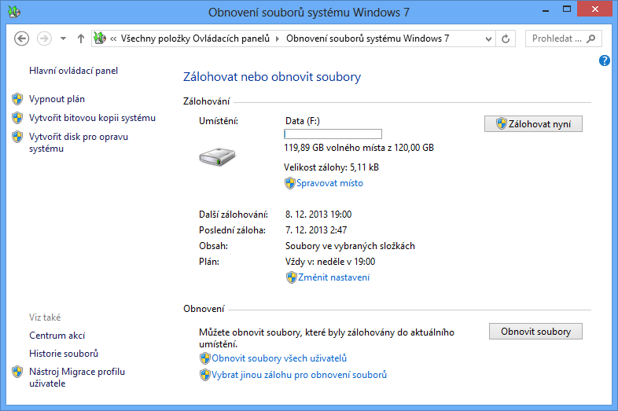
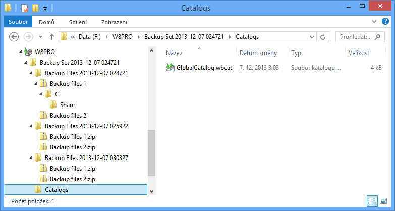
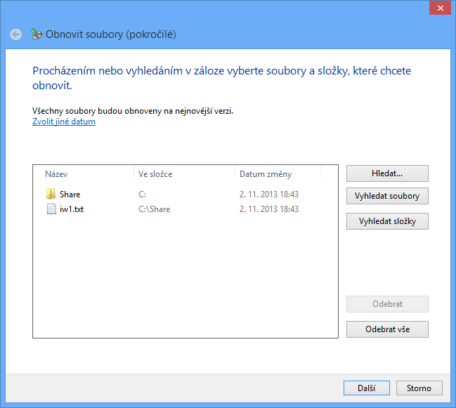
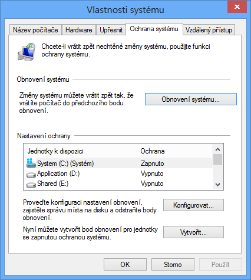
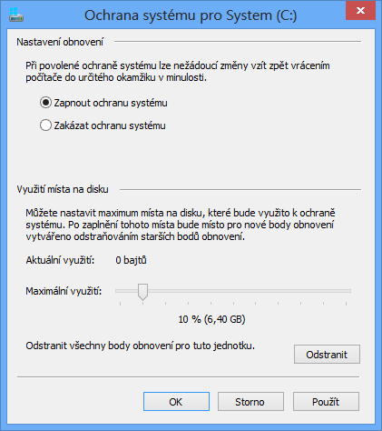
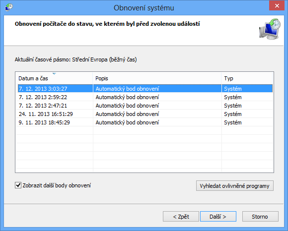
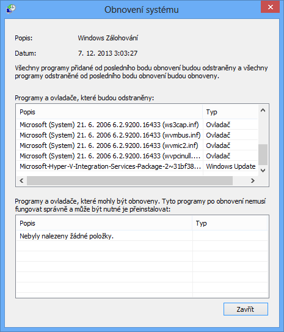
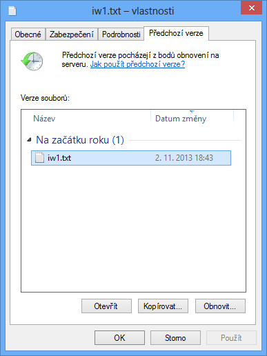
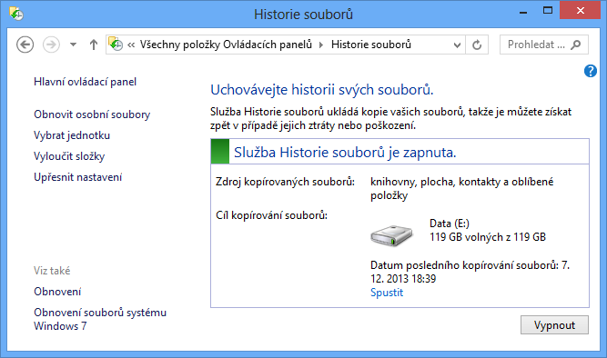
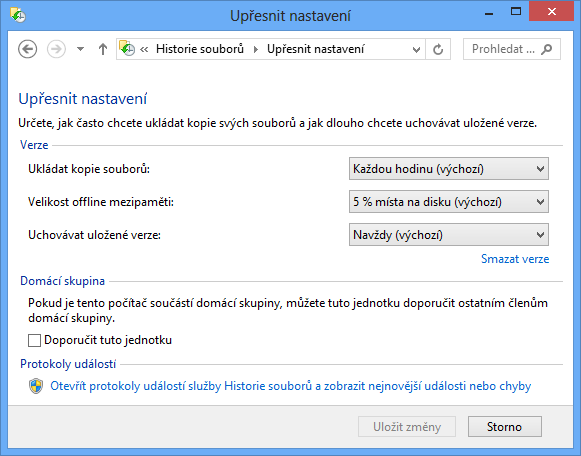

<!-- _class: title -->
<!-- _header: '' -->

# Desktop systémy Microsoft Windows

## IW1

Jan Pluskal\
pluskal@vut.cz

Fakulta informačních technologií\
Vysoké učení technické v Brně\
Božetěchova 2, 612 66 Brno

---

<!-- _class: section -->

# Zálohování a obnova dat

<!-- header: 'Desktop systémy Microsoft Windows Zálohování a obnova dat' -->

---

<!-- header: 'Desktop systémy Microsoft Windows Stínové kopie (Shadow Copies)' -->

# Stínové kopie (Shadow Copies)

- Konzistentní záznamy dat určitých oddílů disků v konkrétních časech (tzv. point-in-time kopie dat)
  - Ukládány inkrementálně
- Vytvářeny službou Stínová kopie svazku (Volume Shadow Copy Service, VSS)
  - Při vytváření bodů obnovení
  - Při zálohování vybraných adresářů
- Pro uchování vyžadují souborový systém NTFS
  - U jiných souborových systémů vytvořeny jen dočasně

<!--
Omezení na NTFS souborový systém je dáno tím, že po výchozí instalaci obsahuje systém pouze jediného poskytovatele pro vytváření stínových kopií, jenž podporuje pouze NTFS souborový systém. Lze ale dodat i vlastní poskytovatele, jenž mohou pracovat i s jinými souborovými systémy.

https://docs.microsoft.com/cs-cz/windows-server/storage/file-server/volume-shadow-copy-service
-->

---

# Možnosti a omezení

- Určeny pouze pro čtení (nelze upravovat obsah)
- Každý oddíl disku může obsahovat maximálně 64 stínových kopií
  - Při dosažení limitu je nejstarší stínová kopie smazána
  - Počet uchovaných verzí souborů může být menší
- Povolovány na úrovni oddílů disků
  - Nelze povolit pro konkrétní soubory nebo adresáře
- Nejsou pořizovány stínové kopie souborů offline
- Lze explicitně vyloučit některé soubory a složky

<!--
Během vytváření lze stínové kopie ještě upravovat, jakmile se ale uloží na disk, tak žádné dodatečné úpravy již není možné provádět.

U Windows Server lze používat stínové kopie i nad sdílenými adresáři a také lze v registru navýšit počet uchovávaných stínových kopií (verzí souborů) až na 512.

Nemá smysl verzovat soubory offline, lepší je verzovat sdílený adresář, kde jsou tyto soubory uloženy.
-->

---

# Ilustrace vytváření stínových kopií

<!-- REVIEW: schéma bylo v pptx složeno z tvarů a šipek, zde překresleno jako SVG – zkontrolovat, že odpovídá originálu. -->

<svg viewBox="50 45 620 440" width="680" height="482" style="display:block;margin:0 auto;font-family:inherit" role="img" aria-label="Schéma vytváření stínové kopie: žadatel, VSS služba, zapisovatelé, poskytovatel a oddíly">
  <defs>
    <marker id="arr" markerWidth="8" markerHeight="8" refX="7" refY="4" orient="auto" markerUnits="userSpaceOnUse">
      <path d="M0,0 L8,4 L0,8 z" fill="#1f497d"/>
    </marker>
  </defs>
  <g fill="#dbe5f1" stroke="#4f81bd" stroke-width="1.5">
    <rect x="56" y="141" width="141" height="70" rx="10"/>
    <rect x="289" y="113" width="141" height="127" rx="10"/>
    <rect x="521" y="141" width="141" height="70" rx="10"/>
    <rect x="425" y="283" width="141" height="70" rx="10"/>
  </g>
  <g font-size="13" text-anchor="middle" fill="#000">
    <text x="126.5" y="172">Žadatel</text><text x="126.5" y="190" font-size="11" fill="#595959">(VSS requester)</text>
    <text x="359.5" y="172">VSS služba</text><text x="359.5" y="190" font-size="11" fill="#595959">(VSS service)</text>
    <text x="591.5" y="172">Zapisovatelé</text><text x="591.5" y="190" font-size="11" fill="#595959">(VSS writers)</text>
    <text x="495.5" y="314">Poskytovatel</text><text x="495.5" y="332" font-size="11" fill="#595959">(VSS provider)</text>
  </g>
  <!-- oddíly (disky) -->
  <g fill="#f2f2f2" stroke="#595959" stroke-width="1.2">
    <path d="M411,440 v28 a42.5,7 0 0 0 85,0 v-28"/><ellipse cx="453.5" cy="440" rx="42.5" ry="7"/>
    <path d="M496,440 v28 a42.5,7 0 0 0 85,0 v-28"/><ellipse cx="538.5" cy="440" rx="42.5" ry="7"/>
    <path d="M411,403 v28 a42.5,7 0 0 0 85,0 v-28"/><ellipse cx="453.5" cy="403" rx="42.5" ry="7"/>
    <path d="M496,403 v28 a42.5,7 0 0 0 85,0 v-28"/><ellipse cx="538.5" cy="403" rx="42.5" ry="7"/>
  </g>
  <g font-size="11" text-anchor="middle" fill="#000">
    <text x="453.5" y="426">Oddíl</text><text x="538.5" y="426">Oddíl</text>
    <text x="453.5" y="463">Oddíl</text><text x="538.5" y="463">Oddíl</text>
  </g>
  <!-- šipky -->
  <g fill="none" stroke="#1f497d" stroke-width="1.5" marker-end="url(#arr)">
    <path d="M126.5,141 V126 H288"/>
    <path d="M198,155 H288"/>
    <path d="M430,127 H591 V140"/>
    <path d="M430,153 H520"/>
    <path d="M521,177 H431"/>
    <path d="M430,201 H520"/>
    <path d="M430,226 H591 V212"/>
    <path d="M359.5,240 V261 H495.5 V282"/>
    <path d="M495.5,353 V375 H453.5 V394"/>
    <path d="M495.5,353 V375 H538.5 V394"/>
  </g>
  <!-- čísla kroků -->
  <g fill="#1f497d" stroke="#fff" stroke-width="1.5">
    <circle cx="206" cy="127" r="11"/><circle cx="243" cy="155" r="11"/><circle cx="512" cy="127" r="11"/>
    <circle cx="464" cy="152" r="11"/><circle cx="487" cy="176" r="11"/><circle cx="464" cy="200" r="11"/>
    <circle cx="427" cy="261" r="11"/><circle cx="512" cy="226" r="11"/>
  </g>
  <g font-size="12" font-weight="bold" text-anchor="middle" fill="#fff">
    <text x="206" y="131">1</text><text x="243" y="159">3</text><text x="512" y="131">2</text>
    <text x="464" y="156">4</text><text x="487" y="180">5</text><text x="464" y="204">6</text>
    <text x="427" y="265">7</text><text x="512" y="230">8</text>
  </g>
  <!-- legenda -->
  <g fill="#1f497d">
    <circle cx="81" cy="266" r="11"/><circle cx="81" cy="294" r="11"/><circle cx="81" cy="322" r="11"/><circle cx="81" cy="351" r="11"/>
    <circle cx="81" cy="379" r="11"/><circle cx="81" cy="407" r="11"/><circle cx="81" cy="436" r="11"/><circle cx="81" cy="464" r="11"/>
  </g>
  <g font-size="12" font-weight="bold" text-anchor="middle" fill="#fff">
    <text x="81" y="270">1</text><text x="81" y="298">2</text><text x="81" y="326">3</text><text x="81" y="355">4</text>
    <text x="81" y="383">5</text><text x="81" y="411">6</text><text x="81" y="440">7</text><text x="81" y="468">8</text>
  </g>
  <g font-size="13" fill="#000">
    <text x="99" y="270">Žádost o vytvoření</text>
    <text x="99" y="298">Získání seznamu komponent</text>
    <text x="99" y="326">Výběr komponent</text>
    <text x="99" y="355">Vyzvání k přípravě dat</text>
    <text x="99" y="383">Dokončení přípravy dat</text>
    <text x="99" y="411">Zmrazení zápisů</text>
    <text x="99" y="440">Vytvoření stínové kopie</text>
    <text x="99" y="468">Povolení zápisů</text>
  </g>
</svg>

<!--
Vytváření je složitý proces, hlavní problém je zachování konzistence dat, což je něco co se primárně řeší v databázích.

Žadatel může být např. program pro zálohování dat.

Zapisovatelé mohou být např. služby systému Windows (registru, protokolu událostí, WMI, AD), ale také kterákoliv aplikace.

Příprava dat může zahrnovat vyprázdnění vyrovnávacích pamětí (cache), zápis dat a metadat na disk, atd.

Uložení stínové kopie se musí provést do 10 sekund, ale většina dat se stejně ukládá již během vytváření stínové kopie a zde je tedy potřeba uložit pouze zbylou část změněných dat, což lze provést velice rychle (většinou to jsou data, jenž byla změněna během vytváření stínové kopie).
-->

---

<!-- _class: dense -->

# Postup vytváření stínových kopií

- Žadatel požádá VSS službu o vytvoření stínové kopie
- VSS služba získá od zapisovatelů seznam všech komponent a datových úložišť, jenž mohou být zachycena do stínové kopie
- Žadatel vybere komponenty, jenž mají být zachyceny
- VSS služba vyzve všechny zapisovatele, aby připravili svá data pro zachycení do stínové kopie
- Zapisovatelé oznámí VSS službě dokončení přípravy svých dat
- VSS služba nechá zapisovatele zmrazit požadavky na zápis (na maximálně 60 sekund), vyprázdní vyrovnávací paměti a úplně zmrazí celý souborový systém (pro zajištění konzistence)
- Poskytovatel vytvoří stínovou kopii (za maximálně 10 sekund)
- VSS služba povolí opětovné zpracování požadavků na zápis

---

# Metody vytváření stínových kopií

- Complete copy
  - Kompletní kopie (klon) dat oddílu disku
  - Časově náročné vytváření
- Copy-on-write
  - Ukládá (kopíruje) data před provedením jejich změny
  - Nevhodné při vysokém počtu operací zápisů
- Redirect-on-write
  - Ukládá (kopíruje) přímo změněná data
  - Nevhodné při vysokém počtu operací čtení

<!--
Copy-on-write a redirect-on-write jsou inkrementální metody.

U copy-on-write se při zápisu nejprve uloží aktuální data (z disku) do stínové kopie a pak se přepíší aktuální data (na disku) novou verzí (čtení je rychlé, jelikož čteme z disku, ale při vysokém počtu zápisů se pořád musí kopírovat data do stínové kopie).

U redirect-on-write se nová data ukládají přímo do stínové kopie a na disku zůstávají stará data (pomalé čtení, jelikož se musí číst data ze stínové kopie místo disku, ale při velkém počtu zápisů se nemusí nic kopírovat).
-->

---

# Poskytovatelé (Providers)

- Realizují vytváření stínových kopií a jejich správu
- Dva druhy poskytovatelů
  - Hardwaroví (vytváření a správa všech stínových kopií je zajišťována fyzickým úložištěm dat)
  - Softwaroví (vytváření a správu stínových kopií má na starosti speciální ovladač a sada knihoven)
- Systémový poskytovatel (System Provider)
  - Softwarový poskytovatel obsažený ve Windows
  - Využívá copy-on-write metodu pro vytváření kopií
  - Skládá se z ovladače `volsnap.sys` a knihovny `swprv.dll`

---

<!-- header: 'Desktop systémy Microsoft Windows Zálohování a obnova dat' -->

# Nástroje pro zálohování a obnovu dat

<!-- REVIEW: nástroj Zálohování a obnovení (Windows 7) je ve Windows 11 označen jako zastaralý (deprecated) a Microsoft tlačí aplikaci Zálohování Windows / OneDrive – rozhodnout, zda kapitolu ponechat jako je, nebo doplnit o nový nástroj. -->

- Zálohování systému Windows 7
  - Nástroj Zálohování a obnovení (Windows 7)
  - Vytváření a obnova Bitových kopií systému
- Ochrana a obnovení systému
- Předchozí verze a Historie souborů
- Nástroje pro obnovení počítače
  - Částečně obnovit počítač
  - Všechno smazat a přeinstalovat Windows
  - Windows Recovery Environment (Windows RE)

---

# Zálohování systému Windows 7

- Využívá stínové kopie (shadow copies)
  - Umožňuje zálohování i aktuálně otevřených souborů
  - Vyžaduje souborový systém NTFS
- Nastavení zálohování se provádí přes nástroj Zálohování a obnovení (Windows 7)
  - Vyžaduje oprávnění správce
- Provádění záloh
  - Automaticky (pomocí naplánované úlohy)
  - Manuálně (iniciované správcem)

<!--
Pro zálohování by mělo postačovat být členem Backup Operators, ovšem nástroj Obnovení souborů systému Windows 7 vyžaduje pro tuto akci oprávnění správce.

Pro spuštění manuálního zálohování je potřeba mít vytvořen (nastaven) plán.

Ve Windows 8.1 se nástroj Obnovení souborů systému Windows 7 jmenuje Záloha bitové kopie systému (System Image Backup).

Ve Windows 10 lze opět vytvářet i standardní zálohy a definovat plány jako tomu bylo ve Windows 8.
-->

---

<!-- header: 'Desktop systémy Microsoft Windows Zálohování systému Windows 7' -->

# Nastavení zálohování

---

# Typy úložišť

<!-- REVIEW: „Pouze u edicí Windows 10 Pro a Enterprise“ – Windows 10 skončil podporu v říjnu 2025; rozhodnout, zda uvádět Windows 11 (omezení na Pro/Enterprise platí i tam). -->

- Oddíl na pevném disku (interním, externím nebo virtuálním)
  - Nesmí být systémový ani obsahovat zálohovaná data
- Optické médium (CD nebo DVD)
- USB flash disk
  - Musí mít velikost minimálně 1 GB
- Sdílený adresář (nebo síťový disk)
  - Pouze u edicí Windows 10 Pro a Enterprise
  - Nutno zadat účet pro připojení s oprávněním zápisu

<!--
MS uvádí, že je potřeba mít oprávnění Úplné řízení, ale obecně by mělo postačovat oprávnění pro zápis (problémy by ale mohly nastat v případě, že by bylo potřeba modifikovat oprávnění na některém souboru s metadaty nebo adresáři, ve kterém je záloha uložena).
-->

---

# Záloha souborů ve vybraných složkách

- Data uložena do komprimovaných .zip souborů
  - Lze procházet v jakémkoliv správci souborů
- Inkrementální zálohování dat
  - Ukládají se pouze změny oproti poslední verzi zálohy
- Neukládají se (i když je lze vybrat pro zálohu)
  - Soubory registrované jako součást programů (obecně soubory v adresáři Program Files, ale mohou i jiné)
  - Soubory uložené na FAT/FAT32 oddílech disků
  - Soubory v koši a dočasné soubory

<!--
ZIP archívy jsou chráněny pouze NTFS oprávněními.

Změny oproti poslední záloze se určují na základě archivního bitu.

U Windows Vista nešlo explicitně vybírat konkrétní soubory a adresáře pro zálohování, pouze typy souborů.
-->

---

# Struktura záloh vybraných adresářů

<!--
Katalogy jsou na úrovni Backup Set i Backup Files.
-->

---

# Katalogy

- Globální katalog (soubor `GlobalCatalog.wbcat`)
  - Obsahuje index všech zálohovaných souborů spolu s informacemi, ve kterých ZIP souborech jsou uloženy
  - U bitových kopií systému obsahuje informace o verzi zachycené bitové kopie systému (system image)
- Souborové katalogy (soubory s příponou `.wbcat`)
  - Obsahují seznam oprávnění (ACL seznam) pro každý zálohovaný soubor
  - Při manuálním obnovení souborů (extrakci souborů ze ZIP souboru) nejsou obnovena jejich oprávnění

<!--
Globální katalog je uložen v Backup Set\Catalogs, souborové katalogy pak v Backup Files\Catalogs.

Formát .wbcat je binární.
-->

---

# Obnova souborů a složek

- Výběr souborů a složek přes nástroj Zálohování a obnovení (Windows 7)
  - Umožňuje obnovit všechny soubory, k nimž má daný uživatel oprávnění pro čtení
  - Správce může obnovit veškerá zálohovaná data

---

# Obnovení souborů a složek

---

# Bitová kopie systému (System Image)

- Obsahuje kopii všech oddílů disků potřebných ke spuštění systému Windows (záloha systému)
  - Obsahuje data systému Windows, programy, všechny ovladače a kompletní nastavení registru
- Lze uložit pouze na interní, externí nebo virtuální disky obsahující souborový systém NTFS nebo do sdíleného adresáře (jen poslední verze)
- Data uložena ve formě .vhd souboru
  - Lze připojit jako virtuální disk nebo nabootovat (v Hyper-V nebo přímo u edicí Pro a Enterprise)

<!--
Může se stát, že systém vyhodnotí, že i např. oddíl na externím disku je potřeba pro spuštění systému.

Při ukládání na disk se provádí verzování bitových kopií, u sdíleného adresáře ne (stará bitová kopie se maže před vytvářením nové, takže pokud vytváření nové bitové kopie selže, nebude mít uživatel ani starou, ani novou bitovou kopii).

První připojení bitové kopie systému nesmí být v režimu pouze pro čtení, až při druhém připojení ji lze takto připojit.
-->

---

# Obnovení bitové kopie systému

- Obnovení systému a veškerých uživatelských dat obsažených na systémovém (i jiných) oddílech
  - Přepisuje veškerý obsah cílových oddílů
- Nástroje pro obnovení jsou obsaženy v prostředí Windows RE (Windows Recovery Environment)
  - Lze spustit z bootovací nabídky (režim ladění) nebo z instalačního média systému Windows

<!--
Režim ladění nastartuje systém do Windows Recovery Environment (Windows RE) prostředí, které je k dispozici lokálně v adresáři C:\Recovery.
-->

---

# Zálohování přes příkazový řádek

- Umožňuje automatizaci vytváření bitových kopií systému (s pomocí naplánovaných úloh)
- Vytvoření bitové kopie oddílů
  - `wbadmin start backup -backupTarget:{<oddíl> | <sdílený-adresář>} -include:<oddíl> [,<oddíl> …]`
- Vypsání informací o bitových kopiích oddílů
  - `wbadmin get versions [-backupTarget:<oddíl/adr>]`
- Vypsání obsahu určité verze bitové kopie oddílů
  - `wbadmin get items -version:<identifikátor>`

<!--
V grafickém nástroji nelze automatizovat vytváření bitových kopií (v plánu zálohování lze zaškrtnout vytvoření bitové kopie, ale ta se vytvoří jen jednou při prvním zálohování a pak už se vytvářet nebude).
-->

---

<!-- header: 'Desktop systémy Microsoft Windows Zálohování a obnova dat' -->

# Ochrana a obnovení systému

- Ochrana systému (System Protection)
  - Zajišťuje vytváření bodů obnovení (restore points)
  - Umožňuje přístup k předchozím verzím souborů
  - Využívá stínové kopie (shadow copies)
- Obnovení systému (System Restore)
  - Navrací systém do dříve uloženého stavu (vybraného bodu obnovení)
  - Spuštění buď ze systému Windows nebo z prostředí Windows RE (Windows Recovery Environment)

---

<!-- header: 'Desktop systémy Microsoft Windows Ochrana a obnovení systému' -->

# Nastavení ochrany systému

<!--
U Windows 7 byla navíc možnost zapnout pouze ochranu souborů (a ne celého systému), jenž umožňovala přístup k předchozím verzím souborů, ale neumožňovala obnovit celý systém do předchozího stavu.
-->

---

# Body obnovení (Restore Points)

- Obsahují soubory a nastavení systému Windows, soubory programů a různé spustitelné soubory
  - Uloženy na stejném oddílu jako zálohovaná data
- Vytvářeny inkrementálně
  - Automaticky v pravidelných intervalech
  - Automaticky vždy před důležitými změnami systému (instalace aplikací, ovladačů, aktualizací, …)
  - Manuálně uživatelem
- Neovlivňují uživatelská data (v profilech i mimo)

<!--
Výchozí interval vytváření bodů obnovení je 1 týden.

O vytvoření bodu obnovení může zažádat jakákoliv aplikace (nejčastěji o to žádají instalační programy).
-->

---

# Nástroj Obnovení systému

---

<!-- header: 'Desktop systémy Microsoft Windows Zálohování a obnova dat' -->

# Předchozí verze (Previous Versions)

<!-- REVIEW: „Ve Windows 8 nahrazeny Historií souborů“ – ve Windows 10/11 je záložka Předchozí verze zpět (čerpá z Historie souborů i bodů obnovení); rozhodnout, jak formulovat. -->

- Umožňují přístup k stínovým kopiím jednotlivých souborů i celých adresářů
  - Možnost návratu k předchozím verzím souborů
- Je možné obnovovat i přejmenované a smazané soubory (včetně souborů vymazaných z koše)
  - Potřeba znát adresář, kde byly původně uloženy
  - Obnovení přes předchozí verze tohoto adresáře
- Ve Windows 8 nahrazeny Historií souborů
  - Lze použít bezplatný nástroj ShadowExplorer

<!--
Lze přistupovat k souborům a adresářům v bodech obnovení i zálohovaných datech (jelikož body obnovení i zálohování je založeno na stínových kopiích).

Nástroj ShadowExplorer umožňuje přistupovat k datům ve stínových kopiích, tedy stejnou věc jako Předchozí verze.
-->

---

<!-- _class: dense -->
<!-- header: 'Desktop systémy Microsoft Windows Předchozí verze (Previous Versions)' -->

# Obnovení předchozí verze souboru

- Ve Windows 8 byla záložka Předchozí verze viditelná pouze při přístupu ze sítě
  - Pro její zobrazení stačí jen otevřít vlastnosti souboru nebo složky ze sítě, tedy například namísto cesty ve formátu `<jednotka>:\` použít síťovou (UNC) cestu `\\localhost\<jednotka>$\`

---

<!-- header: 'Desktop systémy Microsoft Windows Zálohování a obnova dat' -->

# Historie souborů (File History)

- Kombinace předchozích verzí se zálohováním
  - Zálohování předchozích verzí souborů v pravidelných intervalech na cílový (interní nebo externí) disk nebo do sdíleného adresáře
  - Pokud je cílový disk / sdílený adresář nepřístupný
    - Soubory se uloží do lokální vyrovnávací paměti
    - Soubory jsou automaticky přesunuty na cílový disk / do sdíleného adresáře, jakmile je opět k dispozici
  - Ve Windows 8 nebylo možné používat se Zálohováním systému Windows 7

<!--
Historie souborů neumožňuje přístup k verzím souborů, jenž jsou obsaženy v bodech obnovení nebo ve standardních zálohách. Důvodem je, že body obnovení neobsahují žádná uživatelská data, takže je zbytečné k těmto datům přistupovat. A jelikož Historii souborů nelze používat se Zálohováním systému Windows 7, nelze podporovat ani standardní zálohy.

Ve Windows 10 lze používat Historii souborů zároveň se Zálohováním systému Windows 7.

Cílovým diskem nemůže být disk obsahující systémový oddíl.
-->

---

<!-- header: 'Desktop systémy Microsoft Windows Historie souborů (File History)' -->

# Nástroj Historie souborů

---

# Nastavení Historie souborů

<!--
Ve výchozím nastavení se zálohování provádí co 1 hodinu, nejmenší interval zálohování je 10 minut, nejvyšší 1 den.

Ve Windows 10 nelze nastavovat velikost offline mezipaměti, ve Win8 lze nastavit od 2 do 20% velikosti konkrétního oddílu disku.
-->

---

# Výběr souborů a složek

<!-- REVIEW: Windows 11 v Historii souborů opustil výběr přes knihovny (přidávání složek přímo) a složky synchronizované s OneDrive se nezálohují – ověřit a rozhodnout, jak aktualizovat. -->

- Automaticky zálohovány
  - Knihovny (libraries)
  - Soubory na ploše (obsah adresáře Desktop)
  - Kontakty (obsah adresáře Contacts)
  - Oblíbené položky (obsah adresáře Favorites)
  - Data synchronizovaná s Microsoft OneDrive
- Výběr dalších souborů a složek jejich umístěním do existující nebo vytvořením nové knihovny
- Možnost vyloučit konkrétní knihovny a složky

<!--
Důvodem, proč lze zálohovat pouze soubory v knihovnách, na ploše, kontakty, oblíbené položky a SkyDrive, je, že mimo tato úložiště by měly být uloženy již jen soubory systému a aplikací, které není nutné zálohovat.

Ve Windows 10 se data synchronizovaná s Microsoft OneDrive zahrnou do Historie Souborů jen tehdy, když jsou tato data v tzv. offline režimu, kdy se nesynchronizují s Microsoft OneDrive.
-->

---

# Obnovení souborů a složek

<!--
K předchozím verzím souborů se dá přistoupit také přes průzkumníka souborů (dříve průzkumník Windows), záložka Domů, sekce Otevřít, tlačítko Historie.
-->

---

<!-- header: 'Desktop systémy Microsoft Windows Zálohování a obnova dat' -->

# Nástroje pro obnovení počítače

<!-- REVIEW: ve Windows 10/11 jsou refresh/reset sloučeny do „Obnovit počítač do továrního nastavení“ (Zachovat moje soubory / Odebrat vše, volitelně stažení z cloudu), aplikace pro Modern UI se nezachovávají a recimg.exe neexistuje – rozhodnout, jak slide aktualizovat. -->

- Částečně obnovit počítač (refresh)
  - Provede reinstalaci systému
  - Zachovává
    - Uživatelská data
    - Aplikace pro Modern UI (apps)
    - Důležitá nastavení systému
- Všechno smazat a přeinstalovat Windows (reset)
  - Provede čistou instalaci systému
    - Odstraní uživatelská data, aplikace i nastavení systému
- K dispozici od Windows 8

<!--
Problémem Částečné obnovy počítače (refresh) je, že ne vždy se zachová nebo odstraní, co by bylo potřeba. Např. nastavení asociace souborů, zobrazení nebo pravidla brány Firewall se nezachovávají, stejně jako řada nainstalovaných ovladačů.

Lze také vytvořit bitovou kopii systému (.wim soubor), jenž bude sloužit jako základ pro Částečnou obnovu počítače (refresh) a kde mohou být nainstalovány aplikace, jenž mají být po provedení Částečné obnovy počítače k dispozici (využívá se k tomu nástroj recimg.exe).
-->

---

# Windows Recovery Environment

- Rozšíření prostředí Windows PE o sadu nástrojů pro obnovu systému Windows
  - Obnova systému (System Restore)
  - Obnovení bitové kopie systému (System Image)
  - Oprava spouštění systému (Startup Repair)
- Součást instalační bitové kopie systému Windows
  - Soubor `winre.wim` (umístěn v `install.wim` v adresáři `windows\system32\recovery`)
  - Vytvoření bootovatelné bitové kopie postupem jako u Windows PE, jen s `winre.wim` namísto `boot.wim`

---

<!-- header: 'Desktop systémy Microsoft Windows Windows Recovery Environment' -->

# Oprava spouštění systému

- Automatická analýza a oprava
  - Chyb v MBR, zaváděcím sektoru nebo tabulce oddílů
  - Poškozených dat v BCD (Boot Configuration Data)
  - Chybějících nebo poškozených systémových souborů nebo souborů ovladačů
  - Problematických nebo nekompatibilních ovladačů
  - Nekompatibilních servisních balíků nebo aktualizací
  - Chyb v metadatech souborového systému
  - Poškozených klíčů registru

---

# Nástroj Bootrec

- Od Windows Vista (nelze použít u Windows XP)
- Nalezení všech nainstalovaných systémů
  - `Bootrec /ScanOs`
- Přidání vybraných systémů do úložiště BCD
  - `Bootrec /RebuildBcd`
- Oprava MBR (Master Boot Record)
  - `Bootrec /FixMbr`
- Oprava zaváděcího sektoru systémového oddílu
  - `Bootrec /FixBoot`

<!--
Nástroj Bootrec zatím není moc zdokumentován (nahrazuje fixboot, fixmbr a listos příkazy).
-->
