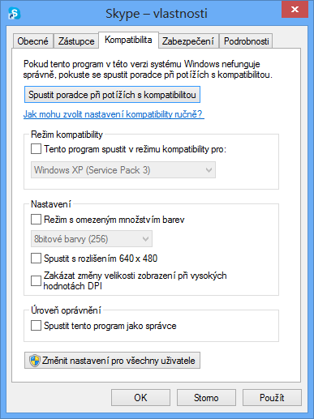
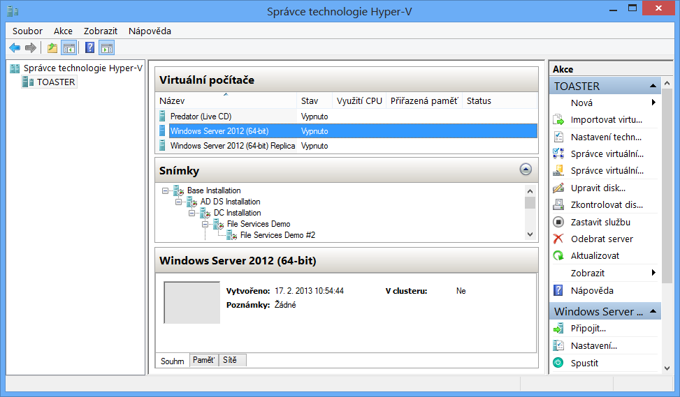
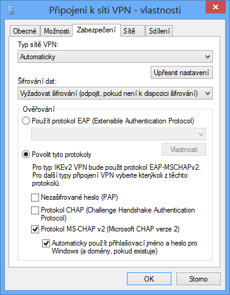
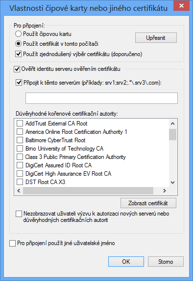
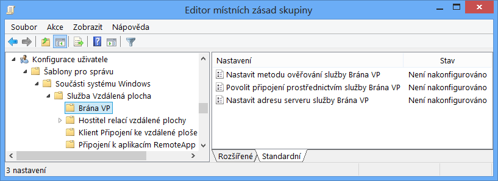
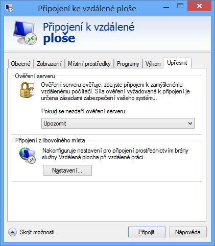
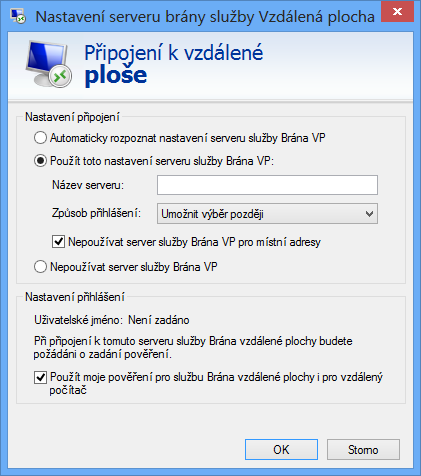
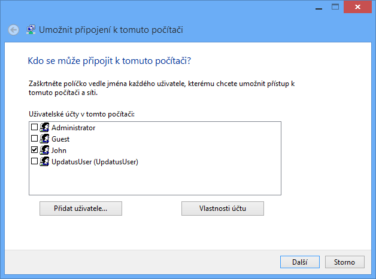

<!-- _class: title -->
<!-- _header: '' -->

# Desktop systémy Microsoft Windows

## IW1

Jan Pluskal\
pluskal@vut.cz

Fakulta informačních technologií\
Vysoké učení technické v Brně\
Božetěchova 2, 612 66 Brno

---

<!-- _class: section -->

# Kompatibilita aplikací

<!-- header: 'Desktop systémy Microsoft Windows Kompatibilita aplikací' -->

---

# Kompatibilita programů

- Řešení problémů s během starších programů
  - Neřeší problémy s instalací
- Simulace chování starších systémů Windows
  - Windows 95 až 8, NT 4.0 až Server 2012 (pro W7)
  - Windows Vista až W8 (pro W10/11)
- Konfigurace kompatibility programů
  - Přes záložku Kompatibilita ve vlastnostech programu
  - Pomocí nástroje Poradce při potížích s kompatibilitou programu (součást ovládacích panelů)
- Nelze nastavovat u programů systému Windows

---

# Nastavení kompatibility programu

<!-- REVIEW: snímky obrazovky v celé přednášce jsou z Windows 8/8.1 – zvážit pořízení nových z Windows 11. -->

- Pokud má být program spouštěn s oprávněními správce, musí uživatelé, jenž ho chtějí spouštět, sami disponovat těmito oprávněními

---

# Application Compatibility Toolkit (ACT)

<!-- REVIEW: ACM a Compatibility Monitor byly z Windows ADK odstraněny (od ADK pro Windows 10 1607); v ADK zůstal jen Compatibility Administrator a SUA – rozhodnout, zda slidy 5–9 ponechat jako historii, nebo zkrátit na CA/SUA. -->

- Sada nástrojů pro usnadnění řešení problémů týkajících se kompatibility aplikací
  - Součást Windows ADK
- Obsahuje
  - Application Compatibility Manager (ACM)
  - Compatibility Administrator (CA)
    - Potřeba používat 32-bitovou verzi pro práci s 32-bitovými aplikacemi a 64-bitovou verzi pro práci s 64-bitovými
  - Compatibility Monitor
  - Standard User Analyzer (SUA)

<!--
Dříve bylo ACT k dispozici ve formě samostatného instalátoru, od verze 6.0 (aktuální verze) je již součástí Windows ADK a nelze jej získat samostatně (lze ovšem nainstalovat ACT bez ostatních nástrojů z Windows ADK).
-->

---

# Application Compatibility Manager

- Umožňuje sběr a následnou analýzu dat
- Sběr dat zajišťují balíky typu Inventory collection nebo Runtime analysis
  - Vytvářeny jako .msi balíky (pomocí průvodce v ACM)
    - Nasazovány manuálně (instalací balíku) nebo automaticky pomocí zásad skupiny, logon skriptů nebo nástroje SCCM
  - Uložení dat v lokální Microsoft SQL Server databázi
    - Data lze synchronizovat s databází společnosti Microsoft
- Analýzou dat lze dopředu určit možné problémy s kompatibilitou používaných aplikací

---

# Balíky pro sběr dat

- Inventory collection
  - Sbírá informace o systému a obsažených aplikacích
- Runtime analysis
  - Sbírá informace o běhu (všech) aplikací
  - Identifikuje problémy s např.
    - Řízením uživatelských účtů (UAC)
    - Používáním (starých) komponent či dynamických knihoven
    - Ochranou prostředků Windows (WRP)
    - Emulací 32-bitových aplikací na 64-bitovém systému
    - Chráněným režimem nástroje Internet Explorer

---

# Compatibility Administrator (CA)

- Spravuje a poskytuje řešení problémů týkajících se kompatibility aplikací
  - Umožňuje vytvářet opravy (tzv. compatibility fixy)
- Compatibility fix (také označován jako Shim)
  - Speciální software odchytávající API volání z aplikací a modifikující tato volání tak, aby se chovala stejně jako v předchozích verzích systému Windows
  - Aplikace instalací databáze, jenž obsahuje (povolené) compatibility fixy (přes CA nebo nástroj `sdbinst.exe`)
    - Řada oprav v již obsažené System Application Fix databázi

---

<!-- _class: dense -->

# Další nástroje

- Compatibility Monitor
  - Řídí monitorování běhu aplikací a umožňuje hodnotit a připomínkovat kompatibilitu jednotlivých aplikací
  - Součást Runtime analysis balíku
- Standard User Analyzer
  - Analyzuje problémy s Řízením uživatelských účtů
    - Možnosti vypnout/zapnout virtualizaci (prostředků)
    - Spouštění aplikace jako standardní uživatel nebo správce
  - Umožňuje generovat opravy ve formě .msi balíku

---

# Virtualizace aplikací pomocí Hyper-V

<!-- REVIEW: Windows XP Mode existoval jen pro Windows 7 a App-V/MED-V (v poznámce) jsou ukončené – zvážit náhradu odkazem na Windows Sandbox / Azure Virtual Desktop. -->

- Spuštění aplikace ve virtuálním počítači Hyper-V
- Odpadají problémy s kompatibilitou
  - Aplikace může běžet ve verzi systému, v níž funguje
- Vyšší nároky na prostředky počítače
  - Pro spuštění aplikace musí běžet virtuální počítač
- Částečná náhrada za Windows XP Mode
  - Nemožnost integrace aplikací do nabídky Start
  - Systém ve virtuálním počítači musí mít vlastní licenční klíč (samostatná instalace Windows)

<!--
Pro virtualizaci aplikací lze také použít App-V (zapouzdření aplikace, stažení ze serveru a spuštění v sandbox prostředí) nebo MED-V (obdoba App-V, jen spustí zapouzdřenou aplikaci v prostředí podobném Windows XP).

Aplikace lze také spouštět vzdáleně ve formě RemoteApp (aplikace běží na serveru, ale zobrazí se na klientském počítači).
-->

---

# Správce technologie Hyper-V

---

# Požadavky pro běh Hyper-V

<!-- REVIEW: požadavky jsou z doby Windows 8 – dnes edice Pro/Enterprise/Education (Windows 11), údaj o 2,2 GB rezervy pro hostitele už Microsoft neuvádí. -->

- K dispozici pouze v edicích Pro a Enterprise
  - Podporován pouze u 64-bitové verze systému
- Procesor s podporou SLAT
  - Zda je SLAT k dispozici lze zjistit pomocí `coreinfo -v` (Sysinternals)
- Alespoň 4 GB RAM
  - 2,2 GB RAM je rezervováno pro hostitelský systém

<!--
Nástroj coreinfo lze zdarma stáhnout ze stránek společnosti Microsoft.
-->

---

<!-- _class: section -->

# VPN spojení

<!-- header: 'Desktop systémy Microsoft Windows VPN spojení' -->

---

# Virtuální privátní sítě (VPNs)

<!-- REVIEW: ve Windows 10/11 se VPN vytváří v Nastavení > Síť a internet > VPN, Centrum síťových připojení a sdílení je jen starší cesta – rozhodnout, kterou uvádět. -->

- Zabezpečené tunely zpřístupňující obsah firemní sítě (intranetu) autorizovaným uživatelům
  - Umožňují přístup k prostředkům firemní sítě (sdílené složky, tiskárny, firemní servery, …) přes síť internet
- Vytváření přes Nastavit nové připojení nebo síť v Centru síťových připojení a sdílení
  - Podpora 4 VPN protokolů, lze vybrat manuálně nebo nechat systém zvolit protokol automaticky
  - Při automatickém výběru se volí protokoly postupně podle úrovně zabezpečení, jenž poskytují

---

<!-- _class: dense -->

# VPN protokoly (1)

<!-- REVIEW: PPTP je zastaralý (RRAS ve Windows Server 2025 už PPTP/L2TP příchozí spojení nepřijímá) a GRE není UDP (IP protokol 47) – opravit formulaci datového kanálu a rozhodnout, zda PPTP ponechat jen jako historii. -->

- PPTP (Point-to-Point Tunneling Protocol)
  - TCP kontrolní (signalizační) kanál – port 1723
  - UDP datový tok využívá Generic Routing Encapsulation (GRE)
  - Problematické pro průchod Firewall
  - Standard nespecifikuje autentizační ani autorizační mechanismus
  - Microsoft implementace používá:
    - Password authentication (PAP),
    - Challenge-Handshake Authentication Protocol (CHAP),
    - MS-CHAP v1 v2 (Microsoft Challenge Handshake Authentication Protocol verze 2)
    - EAP-TLS

---

<!-- _class: dense -->

# VPN protokoly (2)

- L2TP/IPSec (Layer 2 Tunneling Protocol)
  - L2TP
    - UDP port 1701 (interní komunikace, netřeba otevírat na FW mezi endpointy)
    - Negarantuje důvěrnost, autentizaci
    - Navazují se dva jednosměrné tunely
  - IPSec
    - UDP port 500
    - Garantuje důvěrnost, autentizaci, integritu
    - Autentizace pomocí certifikátů nebo sdíleného hesla
    - IKEv2 pro sestavení Security-Association (SA), X.509 cert

---

# VPN protokoly (3)

- SSTP (Secure Socket Tunneling Protocol)
  - Tuneluje data přes SSL/TLS kanál
    - Port TCP 443
    - Umožňuje jednoduše procházet skrz většinu brán Firewall
    - Vyžaduje použití certifikátů
  - Vytváří Point-to-Point (PPP) kanál skrz HTTPS
  - Zajišťuje autentizaci, důvěrnost, integritu
  - Autentizace
    - PEAP; EAP-TLS; EAP-MSCHAPv2; MSCHAPv2; CHAP; PAP

---

<!-- _class: dense -->

# VPN protokoly pro autentizaci (1)

- Založené na heslech (password-based)
  - PAP (Password Authentication Protocol)
    - Zasílaná hesla nejsou šifrována
    - Nepodporován u VPN serverů od Windows Server 2008
  - CHAP (Challenge Authentication Protocol)
    - Je zasílán pouze hash hesla s náhodným textem (challenge)
    - Nepodporován u VPN serverů od Windows Server 2008
  - MS-CHAPv2 (Microsoft Challenge Handshake Authentication Protocol version 2)
    - Umožňuje použít pověření aktuálně přihlášeného uživatele

---

<!-- _class: dense -->

# VPN protokoly pro autentizaci (2)

- Založené na certifikátech (certificate-based)
  - PEAP/PEAP-TLS (Protected Extensible Authentication Protocol with Transport Layer Security)
    - Uživatelé se autentizují certifikáty uživatelů
    - Vyžaduje instalaci certifikátu počítače na VPN server
  - EAP-MS-CHAPv2/PEAP-MS-CHAPv2
    - Uživatelé se autentizují heslem
    - Vyžaduje instalaci certifikátu počítače na VPN server
  - Čipová karta nebo jiný certifikát
    - Uživatelé i server se autentizují vybranými certifikáty

<!--
Protokol PEAP (Protected EAP) řeší nedostatek protokolu EAP, jenž předpokládá, že komunikace (přenos klíčů) bude probíhat přes zabezpečený kanál. PEAP pro komunikaci využívá TLS tunel.
-->

---

# Nastavení VPN protokolů a ověřování

---

# VPN Reconnect

- Automatické opětovné připojení k přerušenému VPN sezení
  - Vyžaduje použití VPN protokolu IKEv2
  - Přerušení VPN spojení může trvat až 8 hodin
  - Nenarušuje běh operací probíhajících přes VPN (tisk, kopírování souborů, stahování pošty, …)
  - Umožňuje změny IP adres VPN klientů bez toho, aby bylo nutné se opětovně autentizovat u VPN serveru
- Vyžaduje alespoň Windows 7 a Windows Server 2008 R2 (podpora ve všech dostupných edicích)

---

# NAP (Network Access Protection)

<!-- REVIEW: NAP je od Windows Server 2016 odstraněn (deprecated od 2012 R2) – rozhodnout, zda slidy 22–23 ponechat jako historii, vypustit, nebo nahradit Conditional Access / Intune compliance. -->

- Omezení přístupu k (firemní) síti na základě
  - Přítomnosti aktualizovaného antiviru a antispywaru
  - Stavu Windows Firewall a Windows Update
  - Nainstalovaných bezpečnostních aktualizací
- Rozdělení klientů na vyhovující a nevyhovující
  - Vyhovující klienti získají plný přístup do (firemní) sítě
  - Nevyhovující klienti nemají žádný nebo jen omezený přístup do (firemní) sítě
- Lze použít i např. u DirectAccess klientů

---

# NAP Remediation

- Proces nápravy nevyhovujících klientů
  - Nápravu lze provést manuálně nebo automaticky
- Automatická náprava nevyhovujících klientů
  - Klienti jsou přesměrováni do speciální části sítě, tzv. nápravné sítě (remediation network)
  - Klienti mohou komunikovat jen s počítači z této sítě
  - Počítače z této sítě poskytují různé služby potřebné pro nápravu počítače (např. server Windows Server Update Services (WSUS) pro aktualizace apod.)

---

# Brána vzdálené plochy (RD Gateway)

- Umožňuje připojení k serverům vzdálené plochy umístěným ve firemní síti (intranetu) z internetu
  - Přístup pouze ke konkrétním serverům na síti
  - Připojení k aplikacím RemoteApp z internetu
- Aplikace RemoteApp
  - Aplikace tunelované skrz protokol vzdálené plochy
  - Zobrazení aplikace na straně klienta vzdálené plochy
  - Integrace do systému (jeví se jako lokální aplikace)
  - Nutno nejprve publikovat na straně serveru

<!--
Publikováním aplikace se vytvoří .rdp soubor, jenž lze potom spouštět na klientech, jenž se chtějí k aplikaci připojit.

RemoteApp lze považovat za obdobu ssh -X nebo ssh -Y.
-->

---

# Nastavení brány vzdálené plochy

- Manuálně v nástroji Připojení ke vzdálené ploše
- Pomocí zásad skupiny
  - Lze aplikovat na jednotlivé uživatele (uzel konfigurace uživatele)

---

# Manuální nastavení brány VP

---

# Možnosti nastavení brány VP

- Možné metody ověřování
  - Zadáním pověření uživatelem
    - Ověřování pomocí protokolů NTLM nebo Basic (nevhodné)
  - Použitím pověření přihlášeného uživatele
  - Pomocí čipové karty (smart card)
- Pro připojení k bráně vzdálené plochy se používá protokol HTTPS zapouzdřující protokol RDP
  - Adresa serveru brány vzdálené plochy musí odpovídat názvu uvedeném v použitém SSL/TLS certifikátu

<!--
Protokol Basic posílá heslo nešifrovaně.
-->

---

# Příchozí spojení

<!-- REVIEW: Windows 10 skončil podporu 10/2025 – uvést Windows 11; funkce (jen PPTP) je zastaralá, zvážit označení jako historickou. -->

- Povolují VPN a vytáčená připojení k počítači, jenž není VPN ani dial-up server (např. Windows 10)
  - Podpora pouze VPN protokolu PPTP
  - Maximálně jedno příchozí spojení současně
  - Připojovat se mohou pouze vybraní uživatelé
- IP adresa přidělena přes DHCP nebo ze zadaného rozsahu IP adres
  - Připojujícímu se klientovi lze povolit nastavení vlastní IP adresy

---

# Nastavení příchozích spojení

