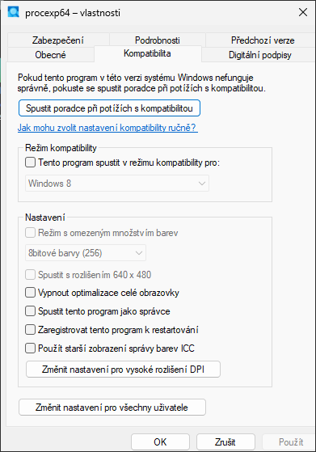
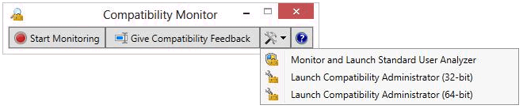
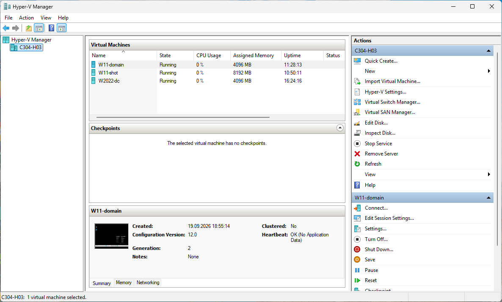
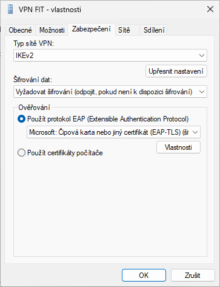
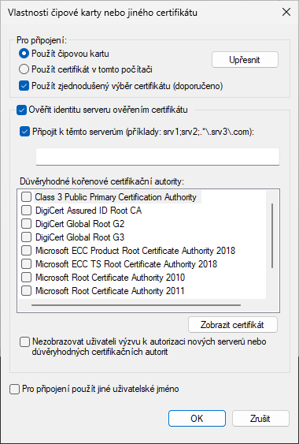
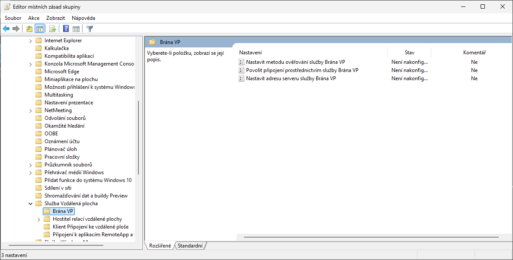
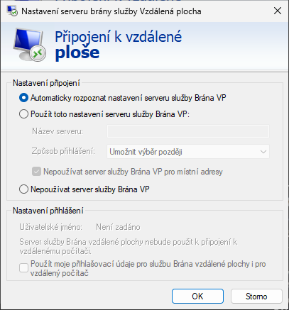
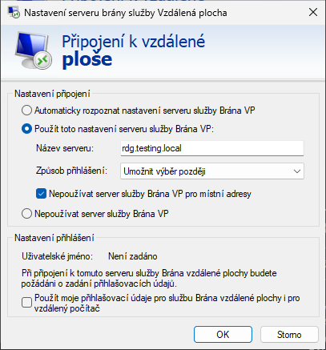
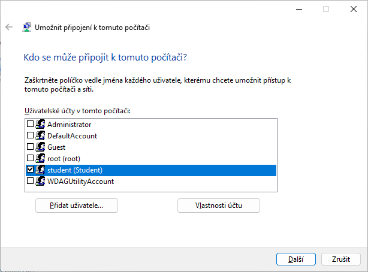
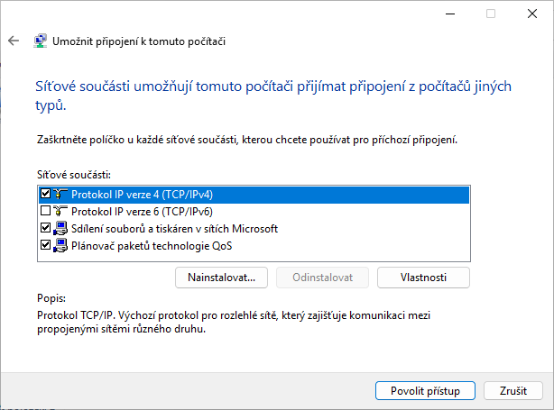

<!-- TODO-SCREENSHOT: snímek 5 ukazuje odstraněný Compatibility Monitor, ponechán jako historie – nelze pořídit znovu -->

<!-- _class: title -->
<!-- _header: '' -->

# Desktop systémy Microsoft Windows

## IW1

Jan Pluskal\
pluskal@vut.cz

Fakulta informačních technologií\
Vysoké učení technické v Brně\
Božetěchova 2, 612 66 Brno

---

<!-- _class: section -->

# Kompatibilita aplikací

<!-- header: 'Desktop systémy Microsoft Windows Kompatibilita aplikací' -->

---

<!-- _class: dense -->

# Kompatibilita programů

- Řešení problémů s **během starších programů** (desktopových, Win32)
  - Neřeší problémy s instalací; selhání instalátoru hlídá Pomocník s kompatibilitou programů (PCA) a nabídne opravu
- **Režim kompatibility** simuluje chování starší verze Windows
  - Windows 11 nabízí Windows Vista (SP1, SP2), Windows 7 a Windows 8
  - **Historie:** Windows 7 nabízel Windows 95 až Server 2008; XP Mode viz dále
- **Konfigurace** kompatibility programu
  - Záložka **Kompatibilita** ve vlastnostech `.exe` nebo zástupce
  - **Poradce při potížích** s kompatibilitou programu – tlačítko na téže záložce, nebo Nastavení › Systém › Poradce při potížích › *Další poradci při potížích*
  - Uloženo v **registru**: `HKCU\Software\Microsoft\Windows NT\CurrentVersion\AppCompatFlags\Layers`
- Nelze nastavit u **programů systému Windows** ani u aplikací z **Microsoft Store** (MSIX)
- **16-bitové programy** na 64-bitových Windows neběží vůbec → virtuální počítač

<!--
Režim kompatibility je ve skutečnosti sada „shimů“ (compatibility fixů) ze systémové databáze, které se aplikují při načtení programu – stejný mechanismus, jaký ručně používá Compatibility Administrator (viz dále).

Poradce při potížích s kompatibilitou programu (pcwrun.exe) zkusí doporučené nastavení a nechá uživatele ověřit výsledek. Většina ostatních klasických poradců (platforma MSDT) byla ve Windows 11 24H2 přesměrována do aplikace Získat nápovědu nebo odstraněna – před přednáškou ověřit na stanici, že cesta v Nastavení stále existuje.

Zdroj: https://support.microsoft.com/en-us/windows/make-older-apps-or-programs-compatible-with-windows-783d6dd7-b439-bdb0-0490-54eea0f45938
Zdroj: https://support.microsoft.com/en-us/windows/deprecation-of-microsoft-support-diagnostic-tool-msdt-and-msdt-troubleshooters-0c5ac9a2-1600-4539-b9d0-069e71f9040a
-->

---

<!-- _class: dense -->

# Nastavení kompatibility programu

- Záložka **Kompatibilita** ve Windows 11 nabízí
  - *Režim kompatibility* (Vista–8)
  - *Režim s omezeným množstvím barev*, rozlišení 640 × 480
  - *Zakázat optimalizace pro celou obrazovku*
  - *Změnit nastavení vysokého rozlišení DPI* (škálování)
  - *Spustit tento program jako správce*
- Program spouštěný s **oprávněními správce** vyžaduje, aby uživatel sám těmito oprávněními disponoval (výzva UAC)
- Změnit nastavení **pro všechny uživatele** → zápis do `HKLM`

<!--
Snímek je z Windows 11 24H2 (vlastnosti procexp64.exe): kratší seznam verzí v režimu kompatibility (Windows 8 a starší) a tlačítko „Změnit nastavení pro vysoké rozlišení DPI“.
-->

---

<!-- _class: dense -->

# Historie: Application Compatibility Toolkit (ACT)

- Sada nástrojů pro **hromadné řešení kompatibility** při migraci na novou verzi Windows
  - Samostatný instalátor, od verze 6.0 součást Windows ADK (Windows 8/8.1, Windows 10 do verze 1511)
- Obsahovala
  - **Application Compatibility Manager (ACM)** – sběr a analýza dat: balíky *Inventory collection* (soupis aplikací) a *Runtime analysis* (běh aplikací, problémy s UAC, WRP, 32-bitovou emulací, chráněným režimem IE) nasazované jako `.msi`, data v lokálním SQL Serveru se synchronizací s databází Microsoftu
  - **Compatibility Monitor** – hodnocení a připomínkování kompatibility na klientech (součást *Runtime analysis*)
  - **Compatibility Administrator (CA)** a **Standard User Analyzer (SUA)**
- Od ADK pro Windows 10 verze 1607 zůstaly jen **CA a SUA**; ACM, Compatibility Monitor a sběr dat byly odstraněny
  - Analýzu kompatibility dnes řeší telemetrie (Windows Update for Business reports, Intune) a program App Assure

<!--
Snímek ukazuje odstraněný Compatibility Monitor (ACT 6.1). Nástroj Test Base for Microsoft 365 (cloudové testování aplikací) byl v březnu 2024 označen za zastaralý, takže ani on není náhradou.

Zdroj: https://learn.microsoft.com/en-us/windows-hardware/get-started/adk-install (aktuální ADK obsahuje jen Compatibility Administrator a Standard User Analyzer)
Zdroj: https://learn.microsoft.com/en-us/windows/whats-new/deprecated-features (Test Base)
-->

---

# Compatibility Administrator (CA)

- Součást **Windows ADK** (10.1.26100.2454, prosinec 2024 + servisní patch KB5079391; pro Windows 11 24H2/25H2)
  - 32-bitová verze pro 32-bitové aplikace (i na 64-bitových Windows), 64-bitová pro 64-bitové
- Spravuje a poskytuje **řešení problémů s kompatibilitou** aplikací
  - Vytváří vlastní databáze `.sdb` s opravami (*compatibility fix*), režimy kompatibility a zprávami AppHelp
- **Compatibility fix** (také shim)
  - Knihovna odchytávající API volání aplikace a upravující jejich chování tak, jak se choval starší systém (např. `VirtualRegistry`, `RunAsInvoker`, `WinXPSP3` režim)
  - Řada oprav je již v systémové databázi (*System Application Fix*)
- **Nasazení**: instalace databáze přes CA nebo `sdbinst.exe soubor.sdb` (skript, GPO, Intune)

<!--
Shim engine (apphelp.dll) je součástí zavaděče programů – při spuštění se podle databáze rozhodne, které fixy do procesu vložit. Vlastní databázi lze hromadně nasadit stejným způsobem jako jakýkoli skript.
ADK: k verzi 10.1.26100.2454 Microsoft vyžaduje servisní patch KB5079391 (nebo novější; CVE-2026-25166 ve Windows SIM). Novější ADK 10.1.28000.1 (listopad 2025) je jen pro Windows 11 26H1 Arm64. Databáze .sdb pro 32-bitovou aplikaci se i na 64-bitových Windows vytváří 32-bitovou verzí CA – typická chyba „fix nefunguje“.

Zdroj: https://learn.microsoft.com/en-us/windows-hardware/get-started/adk-install
Zdroj: https://learn.microsoft.com/en-us/windows/deployment/planning/compatibility-administrator-users-guide
-->

---

# Standard User Analyzer (SUA)

- Součást **Windows ADK** vedle Compatibility Administratora
- Analyzuje problémy aplikace s **Řízením uživatelských účtů (UAC)**
  - Zápisy do `Program Files`, `HKLM`, systémových složek, práce s právy správce
  - Možnost vypnout/zapnout virtualizaci souborů a registru
  - Spouštění aplikace jako standardní uživatel nebo správce
- Umožňuje generovat **opravy** ve formě `.msi` balíku nebo `.sdb` databáze
- Dnes stejnou práci obvykle odvede **Process Monitor** (Sysinternals) – sledování odepřených přístupů

<!--
SUA staví na nástroji Application Verifier; spustí aplikaci pod dohledem a zaznamená operace, které by standardnímu uživateli selhaly.

Zdroj: https://learn.microsoft.com/en-us/windows-hardware/get-started/adk-install
-->

---

<!-- _class: dense -->

# Kompatibilita v roce 2026: App Assure, Prism

- **Příslib kompatibility** Microsoftu: aplikace fungující ve Windows 7/8.1/10 fungují i ve Windows 11
  - **App Assure** (FastTrack) – pro organizace se 150+ licencemi bezplatně vyřeší nahlášený problém s kompatibilitou (Windows 11, Windows 365, Azure Virtual Desktop, ARM64)
- Windows 11 existuje jen jako **64-bitový systém** (x64, ARM64)
  - **32-bitové** x86 aplikace běží přes WOW64 (přesměrování souborů a registru)
  - **16-bitové** aplikace nejsou podporovány
- Windows 11 na ARM64: emulátor **Prism** (od 24H2)
  - Emuluje x86 i x64 aplikace (Windows 10 na ARM jen x86)
  - JIT překlad bloků instrukcí do ARM64 s mezipamětí přeložených bloků
  - Emulace jen pro uživatelský režim – ovladače musí být nativní ARM64
- **Zbývající problémy**: ovladače, kernelové antiviry, aplikace vázané na IE (→ režim IE v Microsoft Edge)

<!--
Zdroj: https://learn.microsoft.com/en-us/windows/compatibility/app-assure
Zdroj (hranice 150 licencí – způsobilost FastTrack): https://learn.microsoft.com/en-us/microsoft-365/fasttrack/eligibility
Zdroj: https://learn.microsoft.com/en-us/windows/arm/apps-on-arm-x86-emulation
-->

---

<!-- _class: dense -->

# Virtualizace aplikací – náhrada Windows XP Mode

- **Historie:** Windows XP Mode (Windows Virtual PC) existoval jen pro Windows 7 – aplikace z virtuálního XP integrované do nabídky Start; skončil s Windows 7
- Virtuální počítač **Hyper-V**
  - Aplikace běží ve verzi systému, v níž funguje; odpadají problémy s kompatibilitou
  - Vyšší nároky na prostředky, systém ve VM potřebuje vlastní licenci
  - Bez integrace do Start; sdílení schránky a disků přes rozšířenou relaci
- **Windows Sandbox** – jednorázový odlehčený virtuální počítač
  - Edice Pro, Enterprise, Education (ne Home); kernel izolovaný hypervisorem
  - Při každém spuštění čistá kopie hostitelských Windows, po zavření se vše zahodí
  - Konfigurace `.wsb` (mapované složky, síť, GPU); od 24H2 aktualizován z Microsoft Store, příkaz `wsb`
  - Zapnutí: `Enable-WindowsOptionalFeature -Online -FeatureName Containers-DisposableClientVM`
- Aplikace lze také spouštět vzdáleně jako **RemoteApp** (běží na serveru, zobrazí se u klienta)

<!--
Windows Sandbox je určen pro testování neznámých souborů a instalátorů – jde o izolaci, ne o trvalé prostředí pro starou aplikaci; na to je Hyper-V VM. Od Windows 11 22H2 přežijí data restart vyvolaný zevnitř sandboxu (např. instalátor vyžadující reboot), po zavření okna se ale stále vše smaže.

Zdroj: https://learn.microsoft.com/en-us/windows/security/application-security/application-isolation/windows-sandbox/
Zdroj: https://learn.microsoft.com/en-us/windows/security/application-security/application-isolation/windows-sandbox/windows-sandbox-versions
-->

---

<!-- _class: dense -->

# Doručování aplikací z cloudu

- **Historie:** App-V (zapouzdření aplikace, streamování ze serveru, běh v izolaci) a MED-V (zapouzdřená aplikace v prostředí Windows XP) z balíku MDOP
  - **MED-V**: konec podpory 13. 4. 2021
  - **MDOP**: rozšířená podpora skončila 14. 4. 2026 (včetně serveru App-V); klient a sequencer App-V ve Windows 10/11 zůstávají v pevné rozšířené podpoře (od 11/2024 už nejsou *deprecated*) – jen opravy chyb
- **MSIX app attach / App attach** (Azure Virtual Desktop)
  - Aplikace v balíčcích MSIX/Appx (nebo `.appv`) uložené jako obraz VHDX/CimFS na sdílené složce
  - Připojí se do relace uživatele při přihlášení, nejsou instalované v obrazu hostitele
  - Doručení jako RemoteApp nebo součást plochy, více verzí téže aplikace současně
- **Azure Virtual Desktop** – vícerelační Windows 11 Enterprise v Azure
- **Windows 365** – Cloud PC (SaaS, edice Business/Enterprise), přístup přes Windows App či prohlížeč, zařízení Windows 365 Link
- Klient pro vše výše: **Windows App** (Windows, macOS, iOS, Android, web)

<!--
Microsoft doporučuje jako náhradu App-V právě Azure Virtual Desktop s MSIX app attach. Balíček MSIX lze z existujícího instalátoru vytvořit nástrojem MSIX Packaging Tool.
App-V: v listopadu 2024 Microsoft vyjmul klienta a sequencer z deprecation („no longer deprecated“) a převedl je do fixed extended support (žádné nové funkce, jen opravy); serverové komponenty App-V a ostatní nástroje MDOP skončily 14. 4. 2026. Stránka „What's new in the ADK“ přitom stále píše „App-V will be end-of-life in April 2026“ – rozpor v dokumentaci Microsoftu.
Zdroj: https://learn.microsoft.com/en-us/microsoft-desktop-optimization-pack/app-v/appv-support-policy

Zdroj: https://learn.microsoft.com/en-us/microsoft-desktop-optimization-pack/app-v/appv-for-windows
Zdroj: https://learn.microsoft.com/en-us/lifecycle/announcements/mdop-extended
Zdroj: https://learn.microsoft.com/en-us/azure/virtual-desktop/app-attach-overview
Zdroj: https://learn.microsoft.com/en-us/windows-365/overview
-->

---

<!-- _class: section -->

# Virtualizace pomocí Hyper-V

<!-- header: 'Desktop systémy Microsoft Windows Virtualizace pomocí Hyper-V' -->

---

# Klientský Hyper-V

- **Hypervisor typu 1** vestavěný ve Windows 11 Pro, Enterprise a Education (ne Home)
  - Po zapnutí běží i hostitelský systém jako (kořenová) partition nad hypervisorem
  - Stejný hypervisor používají VBS/Credential Guard, WSL 2 a Windows Sandbox
- **Volitelná součást** systému, nic se nestahuje
  - Ovládací panely › Programy › Zapnout nebo vypnout funkce systému Windows › *Hyper-V* (platforma + nástroje pro správu)
  - `Enable-WindowsOptionalFeature -Online -FeatureName Microsoft-Hyper-V -All`
  - `DISM /Online /Enable-Feature /All /FeatureName:Microsoft-Hyper-V`
- **V učebně**: Windows 11 Education 25H2, Hyper-V, VM a disky v `E:\AutomatedLab-VMs`, laboratoře staví AutomatedLab 5.61

<!--
VMware Workstation a VirtualBox dnes umí běžet vedle Hyper-V přes rozhraní Windows Hypervisor Platform, ale s nižším výkonem; dříve se vzájemně vylučovaly.

Dokumentace Microsoftu uvádí u klientského Hyper-V edice Pro a Enterprise; edice Education vychází z Enterprise a Hyper-V obsahuje (stanice v C304 běží na Windows 11 Education).

Zdroj: https://learn.microsoft.com/en-us/windows-server/virtualization/hyper-v/get-started/install-hyper-v?pivots=windows
-->

---

# Požadavky pro běh Hyper-V

- **64-bitový procesor** s podporou SLAT (Intel EPT, AMD NPT) a rozšíření VM Monitor Mode (Intel VT-x, AMD-V)
- **Hardwarové DEP** (Intel XD / AMD NX) a virtualizace zapnuté v UEFI
- Alespoň **4 GB RAM** – paměť pro hostitele i všechny běžící VM
  - Učebna: 64 GB, pro VM nejvýše 32 GB a 12 vCPU současně
- **Ověření**
  - `systeminfo` – oddíl *Požadavky pro technologii Hyper-V* (běží-li už hypervisor, vypíše jen „Byl zjištěn hypervisor“)
  - `Get-ComputerInfo -Property HyperV*`
  - `coreinfo64 -v` (Sysinternals)
- **Historie:** Windows 8 uváděl rezervu 2,2 GB RAM pro hostitele; dnes Microsoft konkrétní číslo neuvádí

<!--
Nástroj coreinfo je součástí Sysinternals Suite (zdarma ke stažení z learn.microsoft.com/sysinternals).

Zdroj: https://learn.microsoft.com/en-us/virtualization/hyper-v-on-windows/reference/hyper-v-requirements
-->

---

# Správce technologie Hyper-V

- `virtmgmt.msc`, správa **lokálního i vzdálených hostitelů**
- **Rychlé vytvoření** – galerie obrazů (Windows 11 dev environment, Ubuntu)
- **Kontrolní body** (dříve snímky): standardní a produkční (VSS)
- **Modul PowerShellu Hyper-V**: `Get-VM`, `New-VM`, `Start-VM`, `Checkpoint-VM`, `Set-VMProcessor`
- **Windows Admin Center** jako webová alternativa

<!--
Snímek je z hostitele Windows 11 Education 25H2 v učebně (anglická verze konzoly) s laboratorními VM W2022-dc, W11-domain a W11-shot; v české verzi: Virtual Machines = Virtuální počítače, Checkpoints = Kontrolní body, Actions = Akce.
-->

---

<!-- _class: dense -->

# Generace virtuálních počítačů

| | Generace 1 | Generace 2 |
| --- | --- | --- |
| Firmware | BIOS | UEFI, Secure Boot (výchozí), vTPM |
| Zaváděcí disk | IDE `.vhd`/`.vhdx` (max. 2 TB) | SCSI `.vhdx` (max. 64 TB), online změna velikosti |
| Síťové zavedení (PXE) | jen starší (emulovaný) adaptér | syntetický adaptér, IPv4 i IPv6 |
| Emulovaná zařízení | PS/2, S3 video, disketa, COM | jen softwarová, menší útočná plocha |
| Hosté Windows | 32- i 64-bitové, **ne Windows 11** | jen 64-bitové; Windows 11 vyžaduje Gen 2 + vTPM |

- Generaci nelze po vytvoření změnit – Microsoft doporučuje **Gen 2**, pokud host nevyžaduje BIOS
- **Fyzickou DVD mechaniku** lze připojit jen ke Gen 1; Gen 2 používá `.iso`

<!--
Windows 11 jako host potřebuje Secure Boot a TPM 2.0, které Hyper-V poskytuje jen v generaci 2 (virtuální TPM je vázán na hostitele – při přesunu VM je třeba klíče exportovat). Požadavek vynucuje instalační program Windows; VM v našich cvičeních (AutomatedLab, E01) jsou generace 2 se zapnutým vTPM (PowerShell: Set-VMKeyProtector -VMName <VM> -NewLocalKeyProtector; Enable-VMTPM -VMName <VM>), studenti tedy v Nastavení VM uvidí stav odpovídající tabulce.
Zdroj: https://learn.microsoft.com/en-us/powershell/module/hyper-v/enable-vmtpm

Zdroj: https://learn.microsoft.com/en-us/windows-server/virtualization/hyper-v/plan/should-i-create-a-generation-1-or-2-virtual-machine-in-hyper-v
-->

---

<!-- _class: dense -->

# Virtuální přepínače a Default Switch

- **Typy virtuálních přepínačů** (`New-VMSwitch`, *Správce virtuálních přepínačů*)
  - **Externí** – přemostěn na fyzický adaptér (převezme jeho vazby)
  - **Interní** – VM a hostitel; NAT lze doplnit pomocí `New-NetNat`
  - **Privátní** – pouze VM mezi sebou
- **Default Switch** (od Windows 10 1709)
  - Vestavěný interní přepínač s NAT, DHCP a DNS hostitele; VM má internet přes jakékoli připojení hostitele (Wi-Fi, VPN)
  - Nelze smazat ani přejmenovat, adresní rozsah se mění po restartu
- **V učebně**: pouze Default Switch (`LAN0`, DHCP, internet) a laboratorní interní přepínač `Private1` (`LAN1`, 192.168.0.0/24)
  - Externí přepínač se nevytváří – stanice má jediný fyzický adaptér a ztratila by připojení

<!--
Zdroj: https://techcommunity.microsoft.com/blog/virtualization/whats-new-in-hyper-v-for-windows-10-fall-creators-update/382399
Zdroj: exercises/README.md (Station contract)
-->

---

<!-- _class: dense -->

# Práce s virtuálním počítačem

- **Připojení k VM** (VMConnect, `vmconnect.exe`)
  - **Základní relace** – konzola VM (obraz, klávesnice, myš); Ctrl+Alt+End = Ctrl+Alt+Del, Ctrl+Alt+Pause = celá obrazovka
  - **Rozšířená relace** – RDP přes VMBus (bez sítě): schránka, disky, tiskárny, zvuk, USB, čipové karty, rozlišení
    - Hostitel: zásada i nastavení rozšířené relace zapnuty (výchozí u klientského Hyper-V)
    - Host: Windows 10/11 nebo Server 2016+ s povolenou Vzdálenou plochou (edice Home ji nemá → jen základní relace)
- **Kontrolní body** – standardní (včetně paměti) a produkční (VSS, konzistentní jako záloha)
- **Dynamická paměť**, **integrační služby** (čas, VSS, výměna dat, KVP)
- Hyper-V ve VM (**vnořená virtualizace**), Intel i AMD
  - `Set-VMProcessor -VMName W11 -ExposeVirtualizationExtensions $true` (VM vypnutá)
  - Ve VM s vnořeným Hyper-V nefunguje dynamická paměť za běhu
- **WSL 2** používá jen podmnožinu Hyper-V (Platforma virtuálních počítačů) – dostupná i v edici Home; uvnitř VM potřebuje vnořenou virtualizaci

<!--
Zdroj: https://learn.microsoft.com/en-us/windows-server/virtualization/hyper-v/learn-more/use-local-resources-on-hyper-v-virtual-machine-with-vmconnect
Zdroj: https://learn.microsoft.com/en-us/windows-server/virtualization/hyper-v/nested-virtualization
Zdroj: https://learn.microsoft.com/en-us/windows/wsl/faq
-->

---

<!-- _class: section -->

# VPN spojení

<!-- header: 'Desktop systémy Microsoft Windows VPN spojení' -->

---

# Virtuální privátní sítě (VPN)

- **Zabezpečené tunely** zpřístupňující obsah firemní sítě (intranetu) autorizovaným uživatelům přes internet
  - Přístup k prostředkům firemní sítě (sdílené složky, tiskárny, interní servery, …)
  - Vzdálený přístup uživatelů (*remote access*) nebo propojení lokalit (*site-to-site*)
  - **Split tunnel** (do VPN jen firemní provoz) vs. **force tunnel** (veškerý provoz)
- **Vestavěný VPN klient** Windows 11 (služba `RasMan`)
  - Typy: **IKEv2**, **SSTP**, L2TP/IPsec (certifikát nebo předsdílený klíč), PPTP, *Automaticky*
  - Při automatickém výběru se protokoly zkouší postupně podle úrovně zabezpečení
- **Alternativy**: VPN doplňky třetích stran (UWP plug-in), Always On VPN, Microsoft Entra Global Secure Access

---

# Vytvoření VPN připojení ve Windows 11

- **Nastavení** › Síť a internet › VPN › *Přidat síť VPN*
  - Poskytovatel VPN: *Windows (integrované)*; název, adresa serveru, typ sítě VPN, typ přihlašovacích údajů
  - Připojení a odpojení také z Rychlých nastavení (Win+A)
  - *Upřesnit možnosti* – proxy, vlastnosti připojení
- **Historie:** Centrum síťových připojení a sdílení › *Nastavit nové připojení nebo síť*; dialog *Vlastnosti připojení* (`ncpa.cpl`, `rasphone.exe`) stále existuje pro podrobná nastavení
- **PowerShell** (modul VpnClient)
  - `Add-VpnConnection -Name Firma -ServerAddress vpn.example.com -TunnelType Ikev2 -AuthenticationMethod Eap -EncryptionLevel Required`
  - `Get-VpnConnection`, `rasdial Firma`
- Hromadně: profil VPN v **Intune / MDM** (VPNv2 CSP, ProfileXML)

<!--
Zdroj: https://support.microsoft.com/en-us/windows/connect-to-a-vpn-in-windows-3d29aeb1-f497-f6b7-7633-115722c1009c
-->

---

<!-- _class: dense -->

# VPN protokoly (1): IKEv2 a SSTP

- **IKEv2** (Internet Key Exchange v2, IPsec) – doporučený protokol
  - `UDP 500` (IKE), `UDP 4500` (NAT-T), datový kanál ESP (IP protokol 50)
  - Sestaví Security Association, důvěrnost, integrita, autentizace; certifikáty X.509 nebo EAP
  - Mobilita MOBIKE – změna IP adresy klienta bez nové autentizace (VPN Reconnect)
  - Interoperabilní s bránami třetích stran; jediný protokol pro Always On VPN device tunnel
- **SSTP** (Secure Socket Tunneling Protocol)
  - PPP rámce tunelované přes TLS na `TCP 443` (HTTPS) – projde téměř všemi bránami firewall a proxy
  - Vyžaduje certifikát serveru, klient ověřuje jeho název a řetěz důvěry
  - Zajišťuje autentizaci (PPP/EAP), důvěrnost a integritu (TLS)
  - Server: Windows Server RRAS; v Always On VPN slouží jako záloha, když IKEv2 neprojde

<!--
Zdroj: https://learn.microsoft.com/en-us/windows-server/remote/remote-access/configure-vpn-protocols
Zdroj: https://learn.microsoft.com/en-us/windows-server/remote/remote-access/overview-always-on-vpn
-->

---

<!-- _class: dense -->

# VPN protokoly (2): L2TP/IPsec a PPTP – zastaralé

- **L2TP/IPsec** (Layer 2 Tunneling Protocol)
  - L2TP (`UDP 1701`) sám nezajišťuje důvěrnost ani autentizaci → celý zabalen do IPsec ESP
  - IPsec SA sestavuje IKE (v1): `UDP 500/4500`; autentizace certifikáty nebo předsdíleným klíčem
  - Nové instalace RRAS ve Windows Server 2025 L2TP nepřijímají (lze ručně povolit)
- **PPTP** (Point-to-Point Tunneling Protocol) – **Historie**
  - `TCP 1723` řídicí kanál, data v GRE (IP protokol 47, nikoli UDP) → problémy s firewally a NAT
  - Standard nedefinuje autentizaci; Microsoft používá PAP, CHAP, MS-CHAP v1/v2, EAP-TLS
  - Šifrování MPPE (RC4) s MS-CHAPv2 je prolomeno – nepovažovat za bezpečné
  - Nové instalace RRAS ve Windows Server 2025 PPTP nepřijímají; klient Windows 11 typ stále nabízí
- **Windows Server 2025**: SSTP a IKEv2 beze změny; in-place upgrade zachová stávající nastavení

<!--
Zdroj: https://learn.microsoft.com/en-us/windows-server/remote/remote-access/configure-vpn-protocols („Beginning with Windows Server 2025, new RRAS setups don't accept VPN connections based on PPTP and L2TP protocols. … This change doesn't affect Windows clients operating systems.“)
-->

---

<!-- _class: dense -->

# Autentizace VPN (1): metody EAP

- Vestavěný klient používá **EAP** (Extensible Authentication Protocol) – rámec pro různé metody
  - **EAP-MSCHAPv2** – jméno a heslo; možnost použít pověření přihlášeného uživatele (Winlogon)
  - **EAP-TLS** – certifikáty: software KSP, klíč v TPM, čipová karta, certifikát Windows Hello for Business; filtrování podle vydavatele/EKU, ověření serveru
  - **PEAP** – TLS tunel chránící vnitřní metodu (EAP-MSCHAPv2 nebo EAP-TLS); Fast Reconnect, cryptobinding proti MITM
  - **EAP-TTLS** – TLS tunel s vnitřní metodou EAP i starší (PAP, CHAP, MS-CHAPv2)
- **Historie:** metody založené jen na heslech (bez EAP)
  - **PAP** – heslo v otevřené podobě; **CHAP** – hash hesla s výzvou; **MS-CHAPv2** – pověření přihlášeného uživatele
  - Microsoft je označuje za méně bezpečné a doporučuje se jim vyhnout

<!--
Protokol PEAP řeší nedostatek EAP, který předpokládá zabezpečený kanál pro přenos klíčů – PEAP nejprve sestaví TLS tunel a teprve v něm proběhne vlastní autentizace.

Zdroj: https://learn.microsoft.com/en-us/windows/security/identity-protection/vpn/vpn-authentication
-->

---

<!-- _class: dense -->

# Autentizace VPN (2): certifikáty a Microsoft Entra

- **Certifikáty** uživatele a počítače
  - Vydává interní CA (AD CS) nebo Intune (profily SCEP/PKCS); klíč chráněný TPM (TPM key attestation)
  - Čipová karta nebo jiný certifikát – server i uživatel se ověřují vybranými certifikáty
- **Windows Hello for Business** – EAP-TLS s certifikátem Hello → jednotné přihlášení k počítači i VPN bez hesla
- Microsoft Entra ID – **podmíněný přístup pro VPN**
  - Klient si po splnění zásad (MFA, vyhovující zařízení dle Intune) vyžádá krátkodobý IPsec certifikát (výchozí platnost 60 minut) s OID `1.3.6.1.4.1.311.87`
  - Server (NPS/RRAS) přijme jen připojení s tímto certifikátem
- **MFA** přes RADIUS: NPS extension for Microsoft Entra multifactor authentication
- Server **NPS** (RADIUS) na Windows Server 2022/2025 řeší autorizaci (kdo se smí připojit, skupiny, čas)

<!--
Zdroj: https://learn.microsoft.com/en-us/windows-server/remote/remote-access/overview-always-on-vpn
Zdroj: https://learn.microsoft.com/en-us/windows/security/identity-protection/vpn/vpn-authentication
-->

---

<!-- _class: dense -->

# Nastavení VPN protokolů a ověřování

- **Vlastnosti připojení** › *Zabezpečení* (`ncpa.cpl`): typ sítě VPN, šifrování dat, EAP vs. povolené protokoly; vlastnosti EAP: výběr certifikátu, ověření identity serveru, důvěryhodné kořenové CA

<!--
Snímky jsou z Windows 11 24H2 (ncpa.cpl › Vlastnosti připojení VPN FIT › Zabezpečení a vlastnosti EAP-TLS); Nastavení › VPN nabízí jen zjednodušenou podobu.
-->

---

# VPN Reconnect

- **Automatické opětovné připojení** k přerušenému VPN sezení
  - Vyžaduje VPN protokol IKEv2 (rozšíření MOBIKE)
  - Přerušení VPN spojení může trvat až 8 hodin (doba výpadku sítě je nastavitelná)
  - Nenarušuje běh operací probíhajících přes VPN (tisk, kopírování souborů, stahování pošty, …)
  - Umožňuje změny IP adres VPN klientů bez nutnosti opětovné autentizace u VPN serveru (přechod mezi Wi-Fi a mobilní sítí)
- **Historie:** zavedeno ve Windows 7 a Windows Server 2008 R2; dnes ve všech edicích Windows 11 a základ Always On VPN

---

<!-- _class: dense -->

# Always On VPN

- Nástupce **DirectAccess** (zastaralý od června 2024, Microsoft doporučuje migraci)
- **Vestavěný VPN klient** Windows 10/11 ve všech edicích řízený profilem (ProfileXML, VPNv2 CSP)
  - Nasazení přes Intune / MDM, PowerShell, Windows Configuration Designer – bez zásad skupiny
  - Funguje pro zařízení v doméně, v Microsoft Entra ID i mimo doménu (BYOD)
- **User tunnel** – po přihlášení uživatele; IKEv2 s záložním SSTP; EAP (heslo, certifikát, čipová karta, Windows Hello for Business, MFA přes RADIUS)
- **Device tunnel** – před přihlášením (správa, GPO, reset hesla); jen IKEv2 s certifikátem počítače; zařízení v doméně s Windows Enterprise/Education
- **Automatické spouštění** (aplikace, DNS název), detekce důvěryhodné sítě, filtry provozu a aplikací, per-app VPN, dual-stack IPv4/IPv6
- **Serverová strana**: RRAS (Windows Server 2022/2025) + NPS, nebo brána IKEv2 třetí strany

<!--
Zdroj: https://learn.microsoft.com/en-us/windows-server/remote/remote-access/overview-always-on-vpn
Zdroj: https://learn.microsoft.com/en-us/windows/whats-new/deprecated-features (DirectAccess, červen 2024)
-->

---

<!-- _class: dense -->

# Microsoft Entra Global Secure Access a další možnosti

- **Global Secure Access** – Security Service Edge (SSE) Microsoftu, řízený identitou a podmíněným přístupem
  - **Microsoft Entra Private Access** – Zero Trust přístup (ZTNA) k interním aplikacím po jednotlivých aplikacích (TCP/UDP, Quick Access), SSO přes Kerberos – náhrada klasické VPN
  - **Microsoft Entra Internet Access** – Secure Web Gateway: filtrování webu podle kategorií a FQDN, TLS inspekce, ochrana před hrozbami
  - **Profil provozu Microsoft** (*Microsoft traffic profile*; jako *Internet Access for Microsoft services* součást Entra ID P1/P2) – kontrola „vyhovující sítě“ v podmíněném přístupu
  - Klient Global Secure Access pro Windows, macOS, iOS a Android; provoz jde přes síť Microsoftu
  - Licence: Microsoft Entra Suite nebo samostatně; vyžaduje Entra ID P1/P2
- **Řešení třetích stran**
  - **WireGuard**, **OpenVPN** – Windows nemají vestavěný klient, instaluje se aplikace výrobce
  - **Brány** (Cisco, Fortinet, Palo Alto, Check Point, …) – vlastní klient nebo UWP VPN plug-in; mnohé přijmou i vestavěný klient Windows přes IKEv2

<!--
Zdroj: https://learn.microsoft.com/en-us/entra/global-secure-access/overview-what-is-global-secure-access
-->

---

<!-- _class: dense -->

# Historie: NAP (Network Access Protection)

- Windows Server 2008–2012 R2: **omezení přístupu** do firemní sítě podle „zdraví“ klienta
  - Aktualizovaný antivirus a antispyware, zapnutý Windows Firewall a Windows Update, nainstalované bezpečnostní aktualizace
  - Vyhovující klienti získali plný přístup, nevyhovující žádný nebo omezený
  - Vynucení přes DHCP, IPsec, 802.1X, VPN, RD Gateway; použitelné i pro DirectAccess klienty
- **NAP Remediation** – náprava nevyhovujících klientů
  - Klient přesměrován do nápravné sítě (*remediation network*) jen se servery pro nápravu (např. WSUS)
  - Po nápravě nová kontrola a plný přístup
- Zastaralý od Windows Server 2012 R2, odstraněn ve **Windows Server 2016** (NAP, HRA, HCAP, NAP v DHCP)
  - Server NPS zůstává jako RADIUS pro 802.1X a VPN, bez kontroly zdraví

<!--
Zdroj: https://learn.microsoft.com/en-us/windows-server/networking/technologies/nps/nps-top („NAP, HRA, and HCAP were deprecated in Windows Server 2012 R2, and aren't available in Windows Server 2016 or later.“)
-->

---

<!-- _class: dense -->

# Náhrada NAP: podmíněný přístup a compliance zařízení

- **Zásady dodržování předpisů** v Microsoft Intune hodnotí zařízení
  - Minimální verze Windows, BitLocker, Secure Boot, TPM, integrita kódu, Microsoft Defender Antivirus a firewall, úroveň rizika z Microsoft Defender for Endpoint, heslo/PIN
  - Výsledek (vyhovuje / nevyhovuje) se zapíše k zařízení v Microsoft Entra ID; odklad, upozornění, vyřazení zařízení
- **Podmíněný přístup Microsoft Entra** rozhoduje při každém přihlášení
  - Podmínky: uživatel, aplikace, platforma, umístění, riziko přihlášení
  - Udělení: vyžadovat vyhovující zařízení, zařízení v hybridním připojení, MFA, vyhovující síť (Global Secure Access)
  - Platí pro cloudové aplikace, Always On VPN (krátkodobý certifikát), Azure Virtual Desktop i Windows 365
- **Náprava** místo nápravné sítě: Windows Update for Business / Windows Autopatch, Intune remediation skripty
- Na drátové/Wi-Fi síti zůstává **802.1X s NPS** (RADIUS) – bez kontroly zdraví klienta

<!--
Zdroj: https://learn.microsoft.com/en-us/intune/intune-service/protect/device-compliance-get-started
Zdroj: https://learn.microsoft.com/en-us/entra/identity/conditional-access/overview
-->

---

# Brána vzdálené plochy (RD Gateway)

- Služba role **Vzdálená plocha (RDS)** na Windows Server 2022/2025
  - Připojení z internetu k hostitelům relací a počítačům ve firemní síti bez VPN
  - RDP zapouzdřené v HTTPS (`TCP 443`), volitelně `UDP 3391` pro rychlejší přenos
  - Zásady **CAP** (kdo se smí připojit, skupiny, MFA) a **RAP** (ke kterým prostředkům)
  - Veřejný TLS certifikát, jehož název odpovídá adrese brány
- Aplikace **RemoteApp**
  - Aplikace tunelované skrz protokol vzdálené plochy, zobrazené u klienta jako lokální okno
  - Nutno publikovat na serveru (RD Web Access nebo `.rdp` soubor)
- **Alternativa** bez veřejných portů: Azure Virtual Desktop a Windows 365 (reverse connect přes službu Microsoftu)

<!--
Publikováním aplikace se vytvoří .rdp soubor, jenž lze potom spouštět na klientech. RemoteApp lze považovat za obdobu ssh -X / ssh -Y.

Zdroj: https://learn.microsoft.com/en-us/windows-server/remote/remote-desktop-services/remote-desktop-gateway-role
Zdroj: https://learn.microsoft.com/en-us/troubleshoot/windows-server/remote/ports-used-by-rds
-->

---

<!-- _class: dense -->

# Klienti vzdálené plochy v roce 2026

- **Připojení ke vzdálené ploše** (`mstsc.exe`) – součást Windows, podporuje bránu VP, zůstává
- **Windows App** (od 2024) – jednotný klient pro Windows 365, Azure Virtual Desktop, Microsoft Dev Box, RDS a vzdálené počítače
  - Windows, macOS, iOS/iPadOS, Android, webový prohlížeč
  - Na Windows zatím nepřipojuje k RDS a připojení ke vzdálenému počítači je ve verzi preview → pro bránu VP na Windows dál `mstsc`
  - Přihlášení pracovním nebo školním účtem (Entra ID), ne osobním účtem Microsoft
- **Historie**
  - Aplikace Vzdálená plocha z Microsoft Store – konec podpory 27. 5. 2025, od 30. 9. 2025 blokována připojení k AVD / Windows 365 / Dev Box (RDS a vzdálený počítač fungují dál)
  - Klient Remote Desktop pro Windows (MSI, `msrdc`) – od 27. 3. 2026 nepodporován pro veřejný cloud
- Zařízení **Windows 365 Link** – tenký klient připojující rovnou ke Cloud PC

<!--
Zdroj: https://learn.microsoft.com/en-us/windows-app/overview
Zdroj: https://learn.microsoft.com/en-us/previous-versions/remote-desktop-client/whats-new-windows (data konce podpory)
-->

---

# Nastavení brány vzdálené plochy

- **Manuálně** v nástroji Připojení ke vzdálené ploše (`mstsc` › Upřesnit › *Nastavení*)
- **Zásadami skupiny** – uzel Konfigurace uživatele › Šablony pro správu › Součásti systému Windows › Služba Vzdálená plocha › *Brána VP*
- Stejné zásady (ADMX) nabízí **katalog nastavení Intune**

<!--
Snímek Editoru místních zásad skupiny je z Windows 11 24H2; složka Brána VP obsahuje stále tři nastavení (metoda ověřování, povolit připojení přes bránu, adresa serveru).
-->

---

# Manuální nastavení brány VP

<!--
Snímky dialogu Připojení ke vzdálené ploše jsou z Windows 11 24H2 (mstsc › Zobrazit možnosti › Upřesnit › Nastavení): automatické rozpoznání a ruční zadání serveru brány.
-->

---

# Možnosti nastavení brány VP

- Možné **metody ověřování**
  - **Zadáním pověření** uživatelem – protokoly NTLM nebo Basic (heslo v otevřené podobě uvnitř TLS, nevhodné)
  - Použitím **pověření přihlášeného uživatele**
  - Pomocí **čipové karty** (*smart card*)
  - **Druhý faktor**: Microsoft Entra MFA přes NPS extension na straně brány
- Připojení k bráně: **HTTPS** zapouzdřující RDP
  - Adresa brány musí odpovídat názvu v TLS certifikátu
  - „Nepoužívat server brány pro místní adresy“ – ve firemní síti přímé RDP
- **NTLM** je zastaralé (NTLMv1 odstraněno v Windows 11 24H2 / Server 2025) – preferovat Kerberos, u brány je NTLMv2 zatím běžné

<!--
Zdroj: https://learn.microsoft.com/en-us/entra/identity/authentication/howto-mfa-nps-extension-rdg
Zdroj: https://learn.microsoft.com/en-us/windows/whats-new/deprecated-features (NTLM)
-->

---

# Historie: Příchozí spojení

- Windows 11 stále umožňuje **přijímat VPN spojení** na počítači, jenž není VPN server
  - `ncpa.cpl` › Soubor › *Nové příchozí připojení*
  - Podpora pouze VPN protokolu PPTP
  - Maximálně jedno příchozí spojení současně; připojovat se mohou pouze vybraní uživatelé
  - IP adresa přidělena přes DHCP nebo ze zadaného rozsahu; klientovi lze povolit vlastní adresu
- **Zastaralá** a nezabezpečená funkce (PPTP) – dnes jen k demonstraci
- **Náhrady**: RRAS na Windows Server (IKEv2/SSTP), VPN na routeru (IKEv2, WireGuard), Microsoft Entra Private Access; pro vzdálenou pomoc Rychlá pomoc a Vzdálená plocha

---

# Nastavení příchozích spojení

<!--
Snímky z Windows 11 24H2: první a třetí stránka průvodce Umožnit připojení k tomuto počítači (výběr účtů, které se smějí připojit; síťové součásti příchozího připojení – ve Vlastnostech protokolu IPv4 se nastavuje přidělování adres přes DHCP nebo ze zadaného rozsahu). Průvodce se ve Windows 11 spouští ze složky Síťová připojení (ncpa.cpl): řádek nabídek Soubor už není zobrazen, ale po kliknutí do okna jej klávesa Alt (nebo Alt+S) otevře jako místní nabídku s položkou Nové příchozí připojení.
-->
