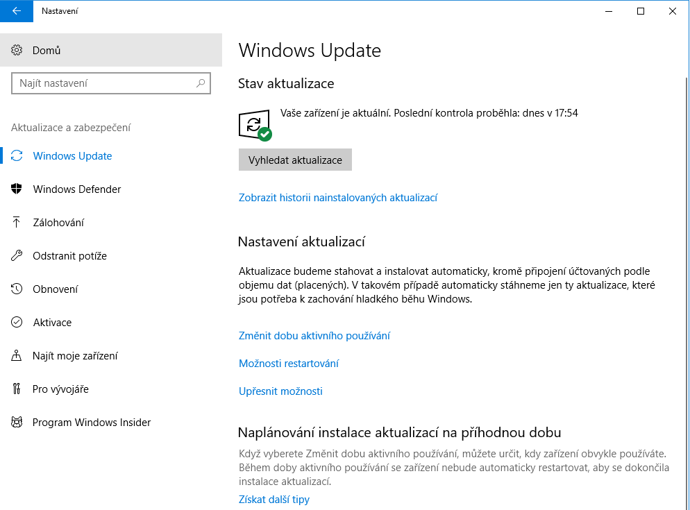
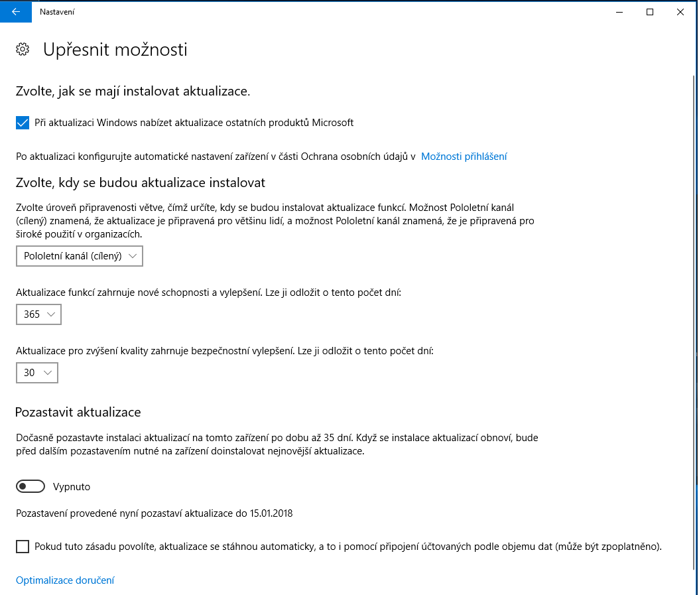
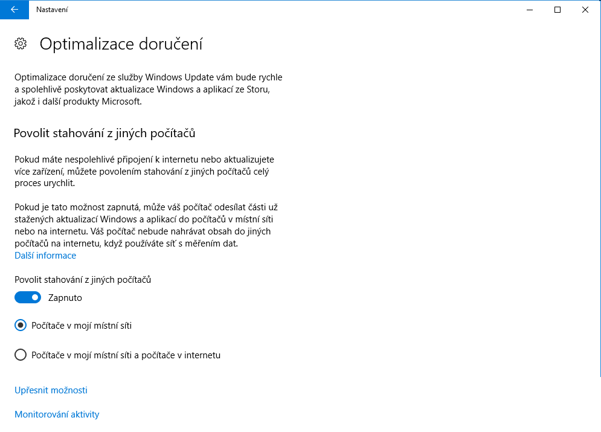
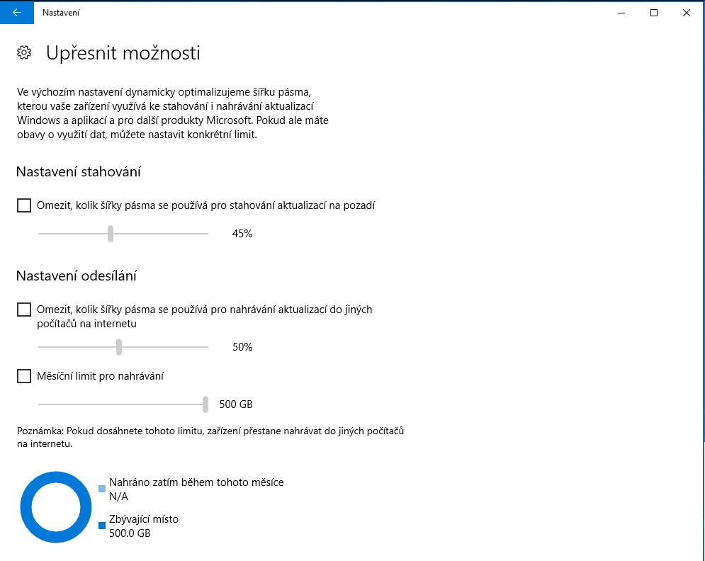
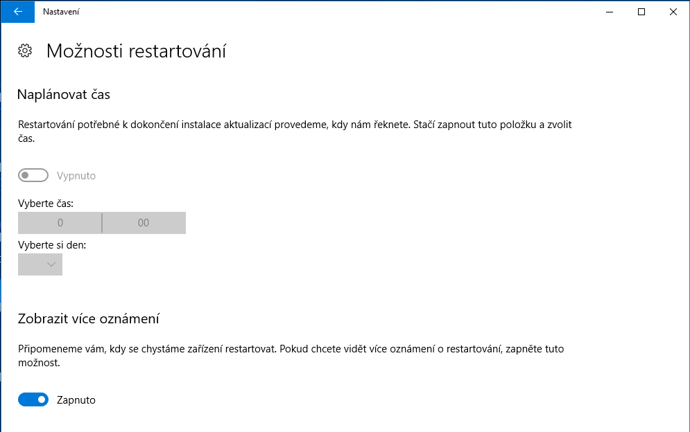
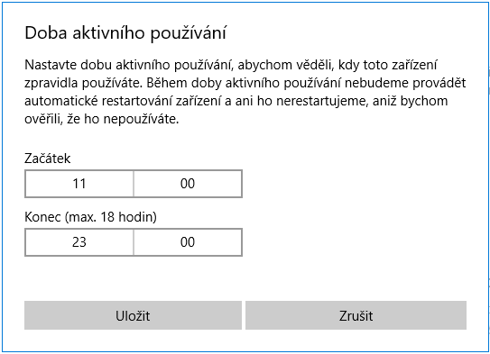
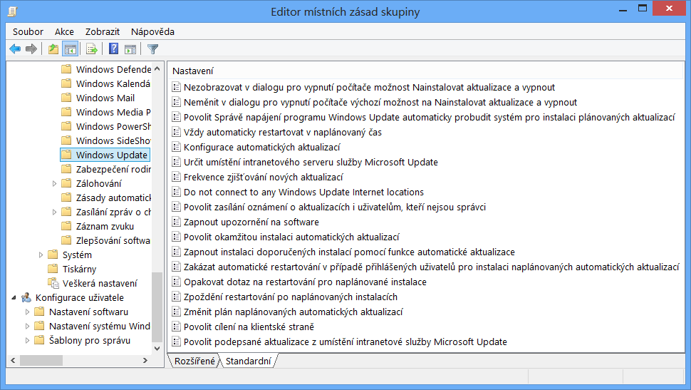
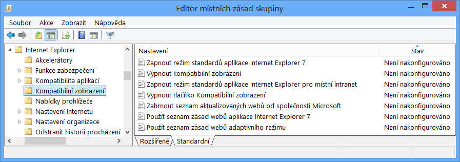
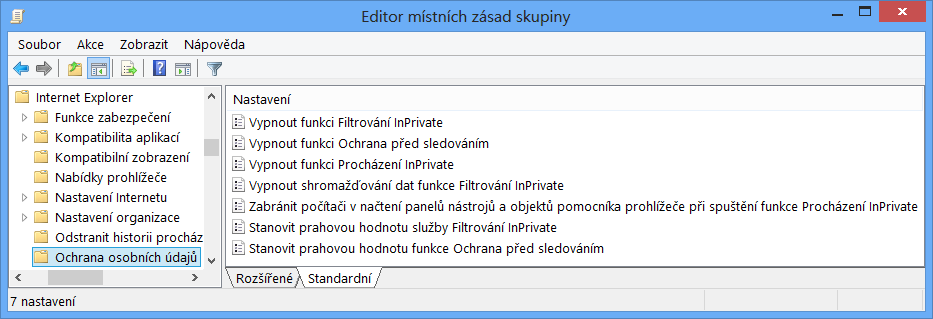

<!-- TODO-SCREENSHOT: snímky 4, 10, 12, 14, 23, 29, 30 – pořídit znovu z Windows 11 25H2
     (4, 10, 12, 14 = Nastavení > Windows Update z Windows 10 1709; 23 = Editor místních zásad
     skupiny z Windows 8; 29, 30 = zásady Internet Exploreru z Windows 8 – ve Windows 11 ukázat
     Konfigurace počítače > Šablony pro správu > Součásti Windows > Internet Explorer, resp.
     Microsoft Edge po instalaci ADMX) -->

<!-- _class: title -->
<!-- _header: '' -->

# Desktop systémy Microsoft Windows

## IW1

Jan Pluskal\
pluskal@vut.cz

Fakulta informačních technologií\
Vysoké učení technické v Brně\
Božetěchova 2, 612 66 Brno

---

<!-- _class: section -->

# Windows Update

<!-- header: 'Desktop systémy Microsoft Windows Windows Update' -->

---

<!-- _class: dense -->

# Windows Update

- Nástroj pro správu aktualizací systému Windows
  - Zajišťují ho služby **Windows Update** (`wuauserv`) a **Update Orchestrator** (`UsoSvc`)
  - Uživatelské rozhraní: Nastavení > **Windows Update**
- Poskytuje
  - Vyhledání, stažení a instalaci aktualizací, plánování restartu
  - Historii aktualizací a odkaz na podrobnosti (KB článek) každé aktualizace
  - Odinstalaci aktualizací (Historie aktualizací > Odinstalovat aktualizace)
- Možné zdroje aktualizací
  - Windows Update / Microsoft Update na internetu (i s řízením přes zásady klienta Windows Update – Intune, zásady skupiny)
  - WSUS nebo Configuration Manager ve firemní síti (intranetu)
  - Části obsahu od jiných počítačů – Optimalizace doručení (peer-to-peer)
- Historie: skrývání aktualizací bylo ve Windows 7/8 součástí nástroje; ve Windows 10/11 jen přes nástroj *Show or hide updates* (wushowhide.diagcab; stojí na zastaralém MSDT, Microsoft ho už nenabízí) nebo PowerShell (`Hide-WindowsUpdate` z modulu PSWindowsUpdate)

<!--
Windows Update ve Windows 11 už není samostatná aplikace ani applet Ovládacích panelů – je to stránka Nastavení. Vlastní práci dělá služba Windows Update (Windows Update Agent, wuaueng.dll) a nad ní Update Orchestrator (USO), který plánuje skenování, stahování a restart.

Zdroj: https://learn.microsoft.com/en-us/windows/deployment/update/waas-overview
Zdroj: https://learn.microsoft.com/en-us/troubleshoot/windows-client/installing-updates-features-roles/windows-update-issues-troubleshooting (služby Update Orchestrator a Windows Update)
Zdroj: https://learn.microsoft.com/en-us/windows/whats-new/deprecated-features (MSDT zastaralý od ledna 2023)
-->

---

# Nástroj Windows Update

<!--
Snímek je z Windows 10 (Nastavení > Aktualizace a zabezpečení > Windows Update). Ve Windows 11 je Windows Update samostatná položka v levém menu Nastavení; obsahuje stejné prvky: Vyhledat aktualizace, Pozastavit aktualizace, Historie aktualizací, Upřesnit možnosti, Program Windows Insider.
-->

---

<!-- _class: dense -->

# Typy aktualizací (Windows 11)

- **Aktualizace funkcí** (feature update) – 1× ročně (2. pololetí), mění verzi (24H2, 25H2)
  - Zahajuje běh podpory verze: 24 měsíců Home/Pro, 36 měsíců Enterprise/Education
  - 25H2 je *enablement package* – malý balíček, který zapne funkce už doručené do 24H2 (stejný build 26200)
- **Měsíční bezpečnostní aktualizace** („B“, Patch Tuesday) – 2. úterý v měsíci, 10:00 pacifického času
  - Kumulativní (LCU – Latest Cumulative Update): bezpečnostní i nebezpečnostní obsah, nahrazuje předchozí měsíc
  - Od 24H2 mohou být vydávány jako **checkpoint cumulative updates** – další LCU obsahují jen rozdíl proti poslednímu checkpointu (menší balíčky; Windows Update a WSUS to řeší samy, ručně z katalogu je nutný checkpoint jako prerekvizita)
- **Volitelná nebezpečnostní aktualizace (preview)** („D“) – 4. úterý v měsíci
  - Předběžná validace obsahu, který přijde v příští „B“ aktualizaci; jen pro nejnovější podporované verze
  - Nese i „continuous innovation“ – nové funkce, u spravovaných zařízení zpravidla dočasně vypnuté (*temporary enterprise feature control*) až do další aktualizace funkcí
- **Out-of-band (OOB)** – mimo plán při kritické chybě/zranitelnosti; kritické jdou do WU/WSUS, nekritické jen do katalogu
- **Ovladače a firmware**, **aktualizace ostatních produktů Microsoft** (Microsoft Update), definice Defenderu
- Historie: Windows 7/8 dělily aktualizace na Důležité, Doporučené a Volitelné a nebyly kumulativní

<!--
Kumulativnost: instalace jediné poslední LCU stačí, obsahuje všechny předchozí opravy. Proto se ve Windows 11 nedají „vybírat“ jednotlivé opravy, jak to znali správci ve Windows 7. Odinstalace LCU vrátí celý měsíc.

Enablement package: soubory verze 25H2 přicházejí do 24H2 měsíčními LCU v neaktivním stavu; enablement package (KB) je jen přepínač, instalace trvá minuty a vyžaduje jeden restart. Stejným způsobem se dříve řešily 1909, 20H2, 21H1, 22H2→23H2.

Zdroj: https://learn.microsoft.com/en-us/windows/deployment/update/release-cycle
Zdroj: https://learn.microsoft.com/en-us/windows/whats-new/whats-new-windows-11-version-25h2
Zdroj: https://learn.microsoft.com/en-us/windows/deployment/update/catalog-checkpoint-cumulative-updates
Zdroj: https://learn.microsoft.com/en-us/lifecycle/faq/windows
-->

---

<!-- _class: dense -->

# Instalace a odinstalace aktualizací

- Instalace aktualizací
  - Může provádět správce i standardní uživatel
  - Automaticky (výchozí chování; zásada *Configure Automatic Updates*), mimo dobu aktivního používání
  - Manuálně: Nastavení > Windows Update > **Vyhledat aktualizace**
  - Volitelné aktualizace (ovladače, preview) je nutné potvrdit ručně, pokud není zapnuto *Nejnovější aktualizace získáte hned, jak budou k dispozici*
- Odinstalace aktualizací
  - Vyžaduje oprávnění správce
  - Nastavení > Windows Update > Historie aktualizací > **Odinstalovat aktualizace** (identifikace přes KB číslo)
  - Kumulativní aktualizaci lze odinstalovat jen celou; aktualizace funkcí se vrací funkcí *Vrátit se zpět* (Obnovení, výchozí lhůta 10 dní)
  - Bezpečnostní opravy jádra/servicing stacku jsou trvalé a odinstalovat nejdou

<!--
Ve Windows 11 22H2 a novějších se odinstalace aktualizací přesunula z Ovládacích panelů (Programy a funkce > Zobrazit nainstalované aktualizace) do Nastavení.

Zdroj: https://learn.microsoft.com/en-us/windows/deployment/update/waas-wu-settings (Configure Automatic Updates)
Zdroj: https://learn.microsoft.com/en-us/windows/deployment/update/waas-configure-wufb (Enable optional updates, volba „Get the latest updates as soon as they're available“)
-->

---

<!-- _class: dense -->

# Správa aktualizací z příkazového řádku a PowerShellu

- `Wuauclt.exe /detectnow` **už nefunguje** – odstraněno ve Windows 10 / Windows Server 2016
  - Náhrada: `(New-Object -ComObject Microsoft.Update.AutoUpdate).DetectNow()` (Windows Update Agent API)
  - Nedokumentovaný klient orchestrátoru: `UsoClient.exe StartScan` / `StartDownload` / `StartInstall`
- Modul **PSWindowsUpdate** (komunitní, PowerShell Gallery, autor Michal Gajda)
  - `Install-Module PSWindowsUpdate`; `Get-WindowsUpdate`, `Install-WindowsUpdate -AcceptAll -AutoReboot`, `Hide-WindowsUpdate`, `Get-WUHistory`, `Remove-WindowsUpdate -KBArticleID KB…`
- Vestavěné nástroje
  - `Get-HotFix` – seznam nainstalovaných aktualizací (jen ty s KB číslem)
  - `Get-WindowsUpdateLog` – sloučí ETL soubory z `C:\Windows\Logs\WindowsUpdate` do čitelného `WindowsUpdate.log` na ploše (`-IncludeAllLogs` přidá USO a UX logy)
  - `DISM /Online /Get-Packages`, `Get-WindowsPackage -Online` – balíčky včetně LCU
  - Zdroj aktualizací zařízení: `(New-Object -ComObject Microsoft.Update.ServiceManager).Services` (Windows Update / Microsoft Update / WSUS)
- Vzdáleně: PowerShell remoting, Intune skripty/remediace, Configuration Manager

<!--
UsoClient.exe není oficiálně dokumentovaný; Microsoft ho zmiňuje jen v blozích podpory, přepínače se mohou změnit. Pro skripty je bezpečnější COM API (Microsoft.Update.Session / Microsoft.Update.AutoUpdate), na kterém stojí i PSWindowsUpdate.

Get-WindowsUpdateLog od Windows 10 1709 nepotřebuje symbol server; WindowsUpdate.log jako textový soubor služba přímo nezapisuje.

Zdroj: https://learn.microsoft.com/en-us/windows-server/get-started/removed-deprecated-features-windows-server (Windows Server 2016 – wuauclt /detectnow removed)
Zdroj: https://learn.microsoft.com/en-us/powershell/module/windowsupdate/get-windowsupdatelog
Zdroj: https://www.powershellgallery.com/packages/PSWindowsUpdate
Zdroj: https://learn.microsoft.com/en-us/troubleshoot/windows-client/installing-updates-features-roles/windows-update-issues-troubleshooting (Microsoft.Update.ServiceManager)
-->

---

<!-- _class: dense -->

# Distribuční kanály (servicing channels)

- **General Availability Channel** (GA Channel; od 21H2)
  - Aktualizace funkcí 1× ročně (2. pololetí); podpora 24 měsíců Home/Pro, 36 měsíců Enterprise/Education
  - Bez nastaveného odložení (defer) zařízení instalují aktualizaci funkcí, jakmile je jim nabídnuta (postupný rollout)
  - Odložení až 365 dní zásadami klienta Windows Update, nebo schvalování ve WSUS / Configuration Manageru
- **Long-Term Servicing Channel (LTSC)** – jen edice Enterprise LTSC / IoT Enterprise LTSC
  - Specializovaná zařízení (zdravotnická technika, bankomaty, řídicí systémy) – žádné aktualizace funkcí přes Windows Update, jen kvalitativní
  - Nová verze každé 2–3 roky: Windows 11 Enterprise LTSC 2024 (podpora 5 let, do října 2029), IoT Enterprise LTSC 2024 (10 let, do října 2034)
  - Není určen pro běžné kancelářské stanice (chybí Store, Edge se instaluje zvlášť)
- **Windows Insider Program** (pro firmy Windows Insider Program for Business)
  - Od dubna 2026 kanály **Experimental** (nahradil Canary a Dev; tracky 26H1 a Future Platforms), **Beta** (buildy, které jdou v následujících týdnech do ostrého vydání) a **Release Preview**
  - Volba kanálu: Nastavení > Windows Update > Program Windows Insider, nebo zásada *Manage preview builds*
- Historie: Windows 10 do 21H1 vydával aktualizace funkcí 2× ročně v Semi-Annual Channel (Targeted) a Semi-Annual Channel (dříve Current Branch / Current Branch for Business), s podporou 18, resp. 30 měsíců

<!--
Přehled verzí a konců podpory: https://learn.microsoft.com/en-us/windows/release-health/release-information

Zdroj: https://learn.microsoft.com/en-us/windows/deployment/update/waas-overview
Zdroj: https://learn.microsoft.com/en-us/lifecycle/faq/windows
Zdroj: https://learn.microsoft.com/en-us/lifecycle/products/windows-11-enterprise-ltsc-2024
Zdroj: https://learn.microsoft.com/en-us/lifecycle/products/windows-11-iot-enterprise-ltsc-2024
Zdroj: https://blogs.windows.com/windows-insider/2026/04/24/were-moving-to-experimental-and-beta-announcing-new-builds/
Zdroj: https://learn.microsoft.com/en-us/windows/deployment/update/windows-update-client-policies (kanály Experimental / Beta / Release Preview v zásadách)
-->

---

<!-- _class: dense -->

# Nastavení Windows Update ve Windows 11

- Nastavení > **Windows Update**
  - *Vyhledat aktualizace*, *Pozastavit aktualizace* – až 35 dní (v Nastavení volba 1–5 týdnů, prodloužitelná), *Historie aktualizací*
  - *Nejnovější aktualizace získáte hned, jak budou k dispozici* – zapne volitelné nebezpečnostní preview i postupně zaváděné funkce (CFR); bezpečnostní aktualizace chodí vždy
- **Upřesnit možnosti**
  - Přijímat aktualizace ostatních produktů Microsoft
  - Stahovat i přes připojení účtovaná podle objemu dat
  - Upozornit na nutný restart
  - **Doba aktivního používání** – automaticky podle používání, nebo ručně (max. 18 h); mimo ni systém restartuje sám
  - **Optimalizace doručení**, **Volitelné aktualizace** (ovladače, preview), Obnovení, Nakonfigurované zásady aktualizací
- **Program Windows Insider** – zápis do kanálů Experimental / Beta / Release Preview
- Historie: volba kanálu a odložení aktualizací funkcí (365 dní) a kvality (30 dní) byly ve Windows 10 1703–1909 přímo v Nastavení (snímek na dalším snímku, 1709); ve Windows 11 jen zásadami

<!--
Pauza: v Nastavení si uživatel volí délku pauzy (po týdnech) až do 35 dní od dnešního dne a může ji prodloužit; po uplynutí se aktualizace automaticky obnoví, zařízení doinstaluje dostupné aktualizace a pauzu lze použít znovu. Zásady (GPO/Intune) umožňují pauzu 35 dní od zadaného data začátku a mohou uživateli pauzu zakázat (od Windows 10 1809).

České názvy položek Nastavení pocházejí z české podpory Microsoftu (Windows Update: časté otázky); přesné znění pro Upřesnit možnosti / Volitelné aktualizace / Nakonfigurované zásady aktualizací ověřit na stanici C304.

Zdroj: https://support.microsoft.com/cs-cz/windows/windows-update-faq-8a903416-6f45-0718-f5c7-375e92dddeb2
Zdroj: https://support.microsoft.com/en-us/windows/deployment/updates-lifecycle/pause-updates-in-windows (pauza až 35 dní, automatické obnovení)
Zdroj: https://support.microsoft.com/en-us/windows/deployment/updates-lifecycle/get-windows-updates-as-soon-as-they-re-available-for-your-device
Zdroj: https://support.microsoft.com/en-us/windows/deployment/updates-lifecycle/keep-your-pc-up-to-date-with-active-hours
Zdroj: https://learn.microsoft.com/en-us/windows/deployment/update/waas-configure-wufb (pauza 35 dní, Enable optional updates)
-->

---

# Upřesnit možnosti ve Windows 10 1709 (historie)

<!--
Historický snímek (prosinec 2017): volba Pololetní kanál (cílený) / Pololetní kanál a odložení o 365 / 30 dní. Ve Windows 11 tyto prvky v Nastavení nejsou; zůstaly „aktualizace ostatních produktů Microsoft“, pauza a Optimalizace doručení.
-->

---

# Optimalizace doručení (Delivery Optimization)

- Spolehlivý HTTP downloader Windows s peer-to-peer cache
  - Části stažených balíčků sdílí s počítači v místní síti (za stejným NAT), volitelně i na internetu
  - Ve Windows Pro/Enterprise/Education je sdílení v LAN zapnuté ve výchozím stavu
- Režimy stahování (zásada *Download Mode*): HTTP only (0), LAN (1), Group (2 – podle domény/AD site/GroupID), Internet (3), Simple (99), Bypass (100 – zastaralý)
- Co doručuje: aktualizace Windows (funkcí, kvality, ovladače), aplikace Store, definice Defenderu, Microsoft Edge, Microsoft 365 Apps, Win32 aplikace z Intune, Teams
- **Microsoft Connected Cache** – lokální cache server (na Windows Serveru, Configuration Manager DP nebo Linuxu) pro pobočky
- Nastavení > Windows Update > Upřesnit možnosti > Optimalizace doručení; podrobněji zásadami skupiny / Intune (limity šířky pásma, měsíční limit uploadu, velikost cache)

<!--
Optimalizaci doručení lze použít s Windows Update, WSUS, Intune i Configuration Managerem; pokud jsou zároveň zapnuté BranchCache a DO, použije se DO. Sledování: Nastavení > … > Optimalizace doručení > Monitorování aktivity, PowerShell Get-DeliveryOptimizationStatus / Get-DeliveryOptimizationPerfSnap.

Zdroj: https://learn.microsoft.com/en-us/windows/deployment/do/waas-delivery-optimization
Zdroj: https://learn.microsoft.com/en-us/windows/deployment/do/waas-delivery-optimization-reference (Download Mode)
-->

---

# Nastavení Windows Update – Optimalizace doručení

<!--
Snímky z Windows 10: vlevo zapnutí stahování z jiných počítačů (místní síť / místní síť a internet), vpravo Upřesnit možnosti – limity šířky pásma pro stahování, nahrávání a měsíční limit uploadu. Ve Windows 11 stejná stránka pod Nastavení > Windows Update > Upřesnit možnosti > Optimalizace doručení.
-->

---

# Restart po aktualizaci a doba aktivního používání

- **Doba aktivního používání** – v tomto rozmezí (max. 18 h) se zařízení automaticky nerestartuje
  - Windows 11 ji ve výchozím stavu nastaví automaticky podle skutečného používání
- Restart lze naplánovat na konkrétní čas, oznámení o restartu lze zesílit
- Ve firmě: zásada **Specify deadlines for automatic updates and restarts**
  - Počet dní od vydání aktualizace, do kterých musí být nainstalovaná, + doba odkladu (grace period) před vynuceným restartem
  - Doporučení Microsoftu: nechat výchozí automatické stahování/instalaci, výchozí notifikace a nastavit jen termíny
- U zařízení připojených k Microsoft Entra ID se v oznámeních zobrazuje název organizace („Contoso vyžaduje instalaci důležitých aktualizací“)

<!--
Zdroj: https://support.microsoft.com/en-us/windows/deployment/updates-lifecycle/keep-your-pc-up-to-date-with-active-hours
Zdroj: https://learn.microsoft.com/en-us/windows/deployment/update/windows-update-client-policies (Setting deadlines, doporučené nastavení)
Zdroj: https://learn.microsoft.com/en-us/windows/deployment/update/waas-wu-settings (název organizace v oznámeních)
Zdroj: https://learn.microsoft.com/en-us/windows/deployment/update/waas-restart
-->

---

# Nastavení Windows Update – restart

<!--
Snímky z Windows 10: Možnosti restartování (naplánovat čas, více oznámení) a dialog Doba aktivního používání (max. 18 hodin). Ve Windows 11 je doba aktivního používání pod Upřesnit možnosti a má navíc volbu Automaticky.
-->

---

<!-- _class: dense -->

# Zásady klienta Windows Update (dříve Windows Update for Business)

- Bezplatná funkce edic Pro (i for Workstations), Education, Enterprise (i LTSC, IoT) – zařízení zůstává připojené přímo k Windows Update, správce řídí *co* a *kdy* dostane
- Konfigurace: zásady skupiny (Windows Update > *Manage updates offered from Windows Update*, *Manage end user experience*), MDM Update CSP – Intune **Update rings for Windows 10 and later**, **Feature updates policy**, Windows quality update policy
- **Odložení (deferral)** od vydání: aktualizace funkcí až 365 dní, kvality až 30 dní; **Pauza** 35 dní od zadaného data
- **Nasazovací kruhy (rings)** – skupiny zařízení s různým odložením: pilot → široké nasazení; k tomu zařízení v Insider Release Preview
- **Termíny (deadlines)** a doba odkladu pro vynucený restart; cílení na konkrétní verzi (*Select the target Feature Update version* – zůstat např. na 24H2)
- Ovladače: *Do not include drivers with Windows Updates*; volitelné aktualizace: *Enable optional updates*; nové funkce: *Enable features introduced via servicing that are off by default*
- Vestavěná ochrana: safeguard holds (blokování aktualizace funkcí na zařízeních se známým problémem)
- Reporting: **Windows Update for Business reports** (Azure portál, nahradily Update Compliance)

<!--
Microsoft přejmenoval funkci Windows Update for Business (WUfB) na „Windows Update client policies“ (dokumentace uvádí „formerly known as Windows Update for Business“); v ADMX i v Intune se ale starý název ještě objevuje (složka „Windows Update for Business“ je dnes v Legacy Policies). Zkouška MD-102 používá oba názvy.

Legacy zásady „Select when feature updates are received“ / „Defer Upgrades and Updates“ pro Windows 11 neplatí.

Zdroj: https://learn.microsoft.com/en-us/windows/deployment/update/windows-update-client-policies
Zdroj: https://learn.microsoft.com/en-us/windows/deployment/update/waas-configure-wufb
Zdroj: https://learn.microsoft.com/en-us/windows/deployment/update/waas-wu-settings
Zdroj: https://learn.microsoft.com/en-us/windows/deployment/update/wufb-reports-overview
-->

---

<!-- _class: dense -->

# Windows Autopatch

- Cloudová služba v **Microsoft Intune admin center**, která automatizuje aktualizace Windows, Microsoft 365 Apps for enterprise, Microsoft Edge a Teams
- Postavená nad zásadami klienta Windows Update – přidává schvalování, plánování a ochranné mechanismy
  - **Autopatch groups** – logické skupiny zařízení (Entra ID skupiny) s automaticky vytvořenými kruhy (Test → First → Fast → Broad)
  - Kvalitativní aktualizace: cíl ≥ 95 % zařízení na poslední aktualizaci; možnost zrychlení (expedite) kritické opravy
  - Aktualizace funkcí ve fázích (multi-phase release), správa ovladačů a firmwaru (automaticky / schvalování), hotpatch
  - Reporty a výstrahy (device alerts), role-based access control
- Licence: Windows/Microsoft 365 **E3/E5**, **F3**, Education **A3/A5**, **Business Premium** (od dubna 2025 bez zvláštní aktivace); podpora Autopatch týmu jen pro E3+/F3

<!--
Autopatch vznikl v roce 2022 jako služba „Microsoft patchuje za vás“ pro E3/E5; v dubnu 2025 Microsoft zrušil zvláštní aktivaci a otevřel ho pro Business Premium a A3+ (podpora Autopatch týmu přes support requesty zůstává jen pro E3+/F3). Dnes je to hlavní doporučená cesta správy aktualizací klientů bez WSUS.

Zdroj: https://learn.microsoft.com/en-us/windows/deployment/windows-autopatch/overview/windows-autopatch-overview
Zdroj: https://learn.microsoft.com/en-us/windows/deployment/windows-autopatch/deploy/windows-autopatch-groups-overview
-->

---

<!-- _class: dense -->

# Hotpatching – bezpečnostní aktualizace bez restartu

- Měsíční „B“ bezpečnostní aktualizace, které se aplikují za běhu (patch kódu v paměti) – **bez restartu**
- Cyklus: **čtvrtletní baseline** (leden, duben, červenec, říjen – běžná kumulativní aktualizace, restart nutný) + 2 hotpatch měsíce v každém čtvrtletí → 4 restarty ročně místo 12
- Požadavky
  - **Windows 11 Enterprise 24H2** nebo novější (obecně dostupné od 2025), zařízení na poslední baseline
  - Licence Windows 11 Enterprise E3/E5, Microsoft 365 F3, Education A3/A5, Business Premium nebo Windows 365 Enterprise
  - Zapnuté **VBS** (Virtualization-based security); na Arm64 vypnutý CHPE (`HotPatchRestrictions=1`)
  - Správa přes Intune / Windows Autopatch: *Windows quality update policy* → „When available, apply without restarting the device (Hotpatch)“ = Allow
- Nezpůsobilá zařízení dostanou automaticky běžnou LCU (s restartem); hotpatch lze odinstalovat (s restartem)
- Kontrola: Nastavení > Windows Update > Upřesnit možnosti > Nakonfigurované zásady aktualizací – *Enable hotpatching when available*; Prohlížeč událostí (`AllowRebootlessUpdates`)
- Stejný kalendář platí i pro Windows Server 2025 (Azure Edition, resp. přes Azure Arc + Azure Update Manager)

<!--
Hotpatch balíčky jsou výrazně menší než LCU. Pokud zařízení v hotpatch měsíci není na aktuální baseline, dostane baseline (restart) i hotpatch. Upgrade verze (24H2 → 25H2) je vhodné dělat v baseline měsíci, jinak zařízení do další baseline přejde na běžné LCU.

Zdroj: https://learn.microsoft.com/en-us/windows/deployment/windows-autopatch/manage/windows-autopatch-hotpatch-updates
Zdroj: https://techcommunity.microsoft.com/blog/windows-itpro-blog/hotpatch-for-windows-client-now-available/4399808
Zdroj: https://support.microsoft.com/en-us/topic/release-notes-for-hotpatch-on-windows-11-enterprise-version-25h2-0bbaa1c7-5070-41ca-a7c9-4ead79602dbf
-->

---

<!-- _class: dense -->

# Ovladače, firmware a další produkty přes WU

- **Ovladače** – Windows Update nabízí ovladače od výrobců (Windows Hardware Compatibility Program)
  - Automaticky s kvalitativními aktualizacemi (kategorie Drivers), další ručně v Nastavení > Windows Update > Upřesnit možnosti > **Volitelné aktualizace**
  - Vypnutí zásadou *Do not include drivers with Windows Updates*; pořadí hledání ovladače zásadou *Specify search order for device driver source locations*
  - Firma: Windows Autopatch / Intune *Driver updates for Windows 10 and later* – schvalování jednotlivých ovladačů a firmwaru
- **Firmware** (UEFI, řadiče) – výrobci ho distribuují jako balíčky ovladačů přes stejný kanál
- **Ostatní produkty Microsoft** – volba v Upřesnit možnosti = registrace k Microsoft Update (Office MSI, SQL Server, Visual Studio…); Microsoft 365 Apps (Click-to-Run) se aktualizují vlastním mechanismem
- **Microsoft Edge** – vlastní služba Microsoft Edge Update (i přes WSUS/ConfigMgr), aplikace Microsoft Store a `winget` – Store, definice Defenderu – Windows Update/Defender

<!--
Ovladače z Windows Update jsou často starší „inbox“ verze než ty z webu výrobce; OEM ale pro firemní modely (Surface, Dell, HP, Lenovo) publikují právě přes WU, což využívá Autopatch.

Zdroj: https://learn.microsoft.com/en-us/windows/deployment/update/windows-update-client-policies (Driver updates, Microsoft product updates)
Zdroj: https://learn.microsoft.com/en-us/windows/deployment/windows-autopatch/manage/windows-autopatch-manage-driver-and-firmware-updates
Zdroj: https://learn.microsoft.com/en-us/windows/deployment/update/waas-configure-wufb (Exclude drivers from quality updates)
-->

---

<!-- _class: dense -->

# Proxy servery a manuální instalace

- Windows Update stahuje přes **WinHTTP** (systémový proxy) s HTTP Range požadavky (RFC 7233) – proxy je musí podporovat
  - Automaticky **WPAD** (Web Proxy Auto-Discovery) – adresa PAC skriptu z DHCP (option 252) nebo DNS (`wpad.<doména>`)
  - Ruční nastavení: `netsh winhttp set proxy proxy:8080` nebo převzetí z uživatelského nastavení `netsh winhttp import proxy source=ie` (Nastavení > Síť a internet > Proxy / Možnosti Internetu)
  - Optimalizace doručení a Nastavení mohou používat i uživatelský (WinINET) proxy
- Manuální instalace aktualizací
  - **Microsoft Update Catalog** – <https://www.catalog.update.microsoft.com> (`.msu`, `.cab`; u 24H2+ pozor na checkpoint prerekvizity)
  - `Wusa.exe <soubor.msu> [/quiet] [/norestart]` – Windows Update Standalone Installer (používá Windows Update Agent API)
  - `Wusa.exe /uninstall /kb:5065789` – odinstalace; tichá odinstalace (`/quiet`) je od Windows 10 zablokovaná (event ID 8)
  - `DISM /Online /Add-Package /PackagePath:<soubor.msu|.cab>` nebo `Add-WindowsPackage -Online -PackagePath …` – i pro offline obraz (`/Image:`)

<!--
Přepínač /quiet u instalace znamená režim bez interakce uživatele; s /norestart se restart odloží (kód návratu 3010). Wusa i DISM lze skriptovat; ve firmě se ale ruční instalace používá jen pro laboratoře, izolované sítě a odstraňování problémů – běžnou cestou je WU/WSUS/Intune.

Zdroj: https://learn.microsoft.com/en-us/troubleshoot/windows-client/installing-updates-features-roles/windows-update-issues-troubleshooting (WinHTTP, Range, netsh winhttp)
Zdroj: https://support.microsoft.com/en-us/topic/description-of-the-windows-update-standalone-installer-in-windows-799ba3df-ec7e-b05e-ee13-1cdae8f23b19
Zdroj: https://learn.microsoft.com/en-us/windows/whats-new/deprecated-features (wusa /uninstall /quiet zastaralé)
Zdroj: https://learn.microsoft.com/en-us/windows/deployment/update/catalog-checkpoint-cumulative-updates
-->

---

<!-- _class: section -->

# Windows Server Update Services

<!-- header: 'Desktop systémy Microsoft Windows WSUS' -->

---

<!-- _class: dense -->

# Windows Server Update Services (WSUS)

- Role Windows Serveru (stále i ve **Windows Server 2025**) poskytující aktualizace Microsoft klientům ve firemní síti (intranetu)
  - Snižuje vytížení internetového připojení, aktualizace se stáhnou jednou a distribuují lokálně
  - Nejméně jeden server (upstream) se synchronizuje s Microsoft Update, další (downstream/replika) z něj
  - Databáze: Windows Internal Database (WID – zastaralá) nebo SQL Server; správa konzolí a PowerShellem (`Get-WsusUpdate`, `Approve-WsusUpdate`)
- Umožňuje centrální správu aktualizací
  - Organizace počítačů do skupin (v konzoli nebo *client-side targeting* zásadou skupiny)
  - Schvalování aktualizací pro konkrétní skupiny, termíny instalace, hromadná odinstalace (schválení pro odebrání)
  - Výběr produktů a klasifikací, automatická pravidla schvalování, reporty
- Windows 11: od března 2023 podpora balíčků **UUP** (Unified Update Platform) – WSUS potřebuje aktualizaci nebo ruční MIME typy v IIS; Windows 11 25H2 ve WSUS od 14. 10. 2025
- **Microsoft Configuration Manager** používá WSUS jako Software Update Point
- Historie: Windows 10 vyžadovaly WSUS 4.0 (Server 2012), Windows 7 WSUS 3.0 SP1, Windows 8 WSUS 3.0 SP2

<!--
WSUS je pořád jediný způsob, jak aktualizovat Windows v síti bez přístupu na internet (air-gapped) – export/import metadat i obsahu (wsusutil export/import).

Zdroj: https://learn.microsoft.com/en-us/windows-server/administration/windows-server-update-services/get-started/windows-server-update-services-wsus
Zdroj: https://learn.microsoft.com/en-us/windows/whats-new/whats-new-windows-11-version-25h2 (25H2 ve WSUS od 14. 10. 2025)
Zdroj: https://learn.microsoft.com/en-us/windows-server/get-started/removed-deprecated-features-windows-server (WID zastaralá)
-->

---

<!-- _class: dense -->

# WSUS je zastaralý (deprecated, září 2024)

- Dne 20\. 9. 2024 Microsoft oznámil **deprecation** WSUS
  - Žádné nové funkce ani přijímání požadavků; stávající funkce zůstávají, aktualizace se přes WSUS publikují dál
  - Role je ve **Windows Server 2025** a je podporovaná po celý životní cyklus serveru (opravy zabezpečení a kvality)
  - Plánovaný konec synchronizace ovladačů (18. 4. 2025) Microsoft **7. 4. 2025 odvolal** – synchronizace ovladačů pokračuje
- Doporučené cesty do budoucna
  - Klienti: **Microsoft Intune** + zásady klienta Windows Update, **Windows Autopatch**
  - Servery: **Azure Update Manager** (Azure VM i on-premises přes Azure Arc; umí použít i aktualizace publikované ve WSUS)
  - Configuration Manager dál používá WSUS API a databázi – bez změny
- Kdy WSUS zůstává: izolované sítě bez internetu, prostředí bez cloudových licencí, distribuce vlastních balíčků (WSUS Package Publisher)

<!--
Deprecation = feature není aktivně vyvíjená a může být v budoucí verzi odebrána; do té doby zůstává podporovaná. Microsoft zatím neoznámil žádné datum odebrání WSUS z Windows Serveru.

Zdroj: https://techcommunity.microsoft.com/blog/windows-itpro-blog/windows-server-update-services-wsus-deprecation/4250436
Zdroj: https://techcommunity.microsoft.com/blog/windows-itpro-blog/continuing-wsus-support-for-driver-synchronization/4401042
Zdroj: https://learn.microsoft.com/en-us/windows-server/get-started/removed-deprecated-features-windows-server
Zdroj: https://learn.microsoft.com/en-us/azure/update-manager/overview
-->

---

# Nastavení pomocí zásad skupiny

<!--
Snímek z Windows 8. Ve Windows 11 (aktuální ADMX) jsou zásady Windows Update rozdělené do podsložek: Manage end user experience (restarty, notifikace, termíny), Manage updates offered from Windows Server Update Service (WSUS server, cílení, frekvence), Manage updates offered from Windows Update (odložení, pauza, volitelné aktualizace, cílová verze) a Legacy Policies. Cesta: Konfigurace počítače > Šablony pro správu > Součásti Windows > Windows Update.

Zhruba třetina zásad odpovídá tomu, co jde nastavit v Nastavení; třetina řídí chování restartu a oznámení; zbytek určuje zdroj aktualizací (WSUS) a chování klienta.

Zdroj: https://learn.microsoft.com/en-us/windows/deployment/update/waas-wu-settings
Zdroj: https://learn.microsoft.com/en-us/windows/deployment/update/waas-configure-wufb
-->

---

<!-- _class: dense -->

# Některé zásady Windows Update

- **Určit umístění intranetového serveru služby Microsoft Update** (*Specify intranet Microsoft update service location*)
  - Adresa WSUS serveru pro detekci/stahování a pro hlášení statistik (`WUServer`, `WUStatusServer`), volitelně alternativní download server
- **Frekvence zjišťování nových aktualizací** (*Automatic Updates detection frequency*) – interval v hodinách (výchozí 22 h, náhodně −20 %); jen pro intranetový server
- **Povolit cílení na klientské straně** (*Enable client-side targeting*) – jméno skupiny (skupin, oddělených `;`) ve WSUS
- **Konfigurace automatických aktualizací** (*Configure Automatic Updates*) – 2 upozornit před stažením, 3 stáhnout a upozornit, 4 stáhnout a naplánovat instalaci, 7 upozornit na instalaci i restart (Server)
- *Do not connect to any Windows Update Internet locations* – jen intranet (vypne i Store a Optimalizaci doručení)
- *Remove access to use all Windows Update features* – uživatel nemůže ručně vyhledat aktualizace
- *Specify deadlines for automatic updates and restarts*, *Select the target Feature Update version*, *Enable optional updates*
- MDM ekvivalenty v Update CSP (`UpdateServiceUrl`, `DetectionFrequency`, `AllowAutoUpdate`, …)

<!--
Umístění WSUS serveru nelze nastavit jinde než zásadou (GPO nebo registr HKLM\SOFTWARE\Policies\Microsoft\Windows\WindowsUpdate). Nemusí to být jen WSUS – používá ho i Configuration Manager (Software Update Point) a některé produkty třetích stran, které pod tím stejně WSUS mají.

Cílení na klientské straně je Client-Side Targeting; ve WSUS musí být přepnuto z „Use the Update Services console“ na „Use Group Policy or registry settings on computers“.

Zdroj: https://learn.microsoft.com/en-us/windows/deployment/update/waas-wu-settings
Zdroj: https://learn.microsoft.com/en-us/windows/deployment/update/waas-configure-wufb
Zdroj: https://learn.microsoft.com/en-us/windows/client-management/mdm/policy-csp-update
-->

---

<!-- _class: section -->

# Microsoft Edge (místo Internet Exploreru)

<!-- header: 'Desktop systémy Microsoft Windows Microsoft Edge' -->

<!--
Původní kapitola se věnovala Internet Exploreru (kompatibilní zobrazení, zóny zabezpečení, SmartScreen, InPrivate, certifikáty). IE je ukončený, proto kapitola popisuje jeho konec a totéž ve firemním prohlížeči Windows 11 – Microsoft Edge s režimem IE.
-->

---

<!-- _class: dense -->

# Konec Internet Exploreru

- **15. 6. 2022** – aplikace Internet Explorer 11 ukončena na Windows 10 (Semi-Annual Channel, IoT)
- **14. 2. 2023** – IE 11 trvale zakázán aktualizací Microsoft Edge (přesměrování do Edge); ikony odstraněny červnovou aktualizací 2023
- **Windows 11** IE jako aplikaci nikdy neobsahovaly; vykreslovací jádro MSHTML (Trident) v systému zůstává pro **režim IE v Edge**
- IE 11 zůstává komponentou Windows 10 LTSC, Windows Server 2016–2022; z Windows Server 2025 byl odstraněn
- Náhrada: **Microsoft Edge** (Chromium) + **režim IE** pro starší intranetové aplikace – podporován nejméně do roku **2029**, konec bude oznámen minimálně rok dopředu
- Historie: IE nabízel kompatibilní zobrazení (emulace IE 7), zóny zabezpečení (Místní intranet, Důvěryhodné servery, Servery s omezeným přístupem, Internet), Chráněný režim (nízká úroveň integrity), filtr SmartScreen, Procházení a Filtrování InPrivate – zóny a Chráněný režim platí dál v režimu IE

<!--
Zdroj: https://learn.microsoft.com/en-us/lifecycle/faq/internet-explorer-microsoft-edge
Zdroj: https://learn.microsoft.com/en-us/windows/whats-new/removed-features (Internet Explorer 11, June 15, 2022)
Zdroj: https://learn.microsoft.com/en-us/windows-server/get-started/removed-deprecated-features-windows-server (IE odstraněn z Windows Server 2025)
Zdroj: https://techcommunity.microsoft.com/blog/windows-itpro-blog/internet-explorer-11-desktop-app-retirement-faq/2366549 (14. 2. 2023)
-->

---

<!-- _class: dense -->

# Microsoft Edge

- Prohlížeč Windows 11 založený na **Chromium** (od roku 2020; starý Edge s jádrem EdgeHTML skončil 9. 3. 2021)
  - Součást Windows 10/11, ale aktualizuje se **nezávisle na Windows** – služba Microsoft Edge Update (i přes WSUS/ConfigMgr/Autopatch)
  - Stejný kód i na macOS, Linuxu, iOS/Android; rozšíření z Edge Add-ons i Chrome Web Store
- Bezpečnostní funkce, které nahradily funkce IE
  - **Microsoft Defender SmartScreen** – blokování phishingových/malware stránek, kontrola stahovaných souborů, blokování potenciálně nežádoucích aplikací (PUA)
  - **Okno InPrivate** – po zavření se nezachovají historie, cookies ani data webů; **Ochrana před sledováním** (Základní / Vyvážená / Přísná)
  - **Režim zvýšeného zabezpečení** (Enhanced security mode) – bez JIT kompilace JavaScriptu na neznámých webech
  - Izolace procesů (sandbox, site isolation), Správce hesel s kontrolou úniků, Zabezpečené DNS (DNS over HTTPS)
- Správa: stovky zásad (ADMX/Intune), profily (pracovní vs. osobní), **Edge for Business**

<!--
Defender Application Guard pro Edge (izolace neznámých webů v Hyper-V kontejneru) byl v prosinci 2023 označen za zastaralý a od Windows 11 24H2 není dostupný; doporučenou náhradou je Edge for Business + zásady AppLocker/Microsoft Edge management service.

Zdroj: https://learn.microsoft.com/en-us/lifecycle/faq/internet-explorer-microsoft-edge (konec Edge Legacy 9. 3. 2021)
Zdroj: https://learn.microsoft.com/en-us/deployedge/microsoft-edge-security-smartscreen
Zdroj: https://learn.microsoft.com/en-us/deployedge/microsoft-edge-security-browse-safer
Zdroj: https://learn.microsoft.com/en-us/windows/whats-new/deprecated-features (Application Guard for Edge)
-->

---

<!-- _class: dense -->

# Režim IE (Internet Explorer mode) v Edge

- Jeden prohlížeč pro moderní i starší weby: moderní stránky vykresluje Chromium, stránky ze seznamu jádro **MSHTML/Trident z IE 11** (v kartě je ikona IE)
- Podporuje: všechny document modes a Enterprise Mode, **ActiveX** (Java, Silverlight), Browser Helper Objects, nastavení a zásady **zón zabezpečení a Chráněného režimu** z IE, F12 pro IE přes IEChooser; nepodporuje panely nástrojů IE a zásady nabídek IE
- Které stránky pojedou v režimu IE, určuje správce
  - **Enterprise Mode Site List** (XML, schéma v2; nástroj Enterprise Mode Site List Manager) – zásada *Configure the Enterprise Mode Site List* (`InternetExplorerIntegrationSiteList`), seznam na sdílené složce/webu
  - **Cloud Site List Management** – seznamy spravované v Microsoft 365 admin center (Nastavení > Nastavení organizace > Microsoft Edge site lists), zásada `InternetExplorerIntegrationCloudSiteList`; klient se musí přihlásit Entra ID, obnova každé 2 h
  - *Send all intranet sites to Internet Explorer* – všechny intranetové stránky do režimu IE
  - Zásada `InternetExplorerIntegrationLevel` = *Internet Explorer mode*; volitelně uživatel může stránku znovu načíst v režimu IE (lokální seznam na 30 dní)
- Kontrola stavu: `edge://compat/enterprise`, ladění přes IEChooser (F12 pro IE)
- Podpora režimu IE nejméně do 2029 na podporovaných verzích Windows

<!--
Enterprise Mode a seznam webů existovaly už pro IE 11 (zásada „Use the Enterprise Mode IE website list“); Edge umí zpracovat jen jeden seznam – přednost má zásada Edge. Prerekvizity: aktuální Edge a Windows; na Windows 10 musí být IE 11 zapnutý ve Funkcích Windows (na Windows 11 se nic nezapíná – aplikace tam není, jádro ano).

Zdroj: https://learn.microsoft.com/en-us/deployedge/edge-ie-mode
Zdroj: https://learn.microsoft.com/en-us/deployedge/edge-ie-mode-cloud-site-list-mgmt
Zdroj: https://learn.microsoft.com/en-us/deployedge/edge-ie-mode-policies
Zdroj: https://learn.microsoft.com/en-us/lifecycle/faq/internet-explorer-microsoft-edge
-->

---

# Historie: zásady IE – Kompatibilní zobrazení

- Zásady Internet Exploreru zůstávají v ADMX (Konfigurace počítače i uživatele > Šablony pro správu > Součásti Windows > Internet Explorer)
- Zóny zabezpečení, Chráněný režim a Enterprise Mode Site List z nich režim IE v Edge dál respektuje; kompatibilní zobrazení a nabídky IE už na Windows 11 nemají na co působit

<!--
Snímek z Windows 8 (Editor místních zásad skupiny > Internet Explorer > Kompatibilní zobrazení). Kompatibilní zobrazení simulovalo chování IE 7 pro stránky psané pro starší IE: pro všechny stránky, pro intranet, podle seznamu od Microsoftu (compatibility list přes Windows Update) nebo pro stránky zadané uživatelem. V režimu IE tuto roli hraje document mode zadaný v Enterprise Mode Site List (atribut docMode).

Zdroj: https://learn.microsoft.com/en-us/deployedge/edge-ie-mode
-->

---

# Historie: zásady IE – Ochrana osobních údajů (InPrivate)

- Procházení InPrivate (bez ukládání historie a dat) a Filtrování InPrivate / Ochrana před sledováním (blokování obsahu třetích stran)
- Ve Windows 11 tomu odpovídá okno InPrivate a Ochrana před sledováním v Edge – zásady `InPrivateModeAvailability`, `TrackingPrevention`, `ClearBrowsingDataOnExit`

<!--
Snímek z Windows 8 (Internet Explorer > Ochrana osobních údajů; před Windows 8 se sekce jmenovala InPrivate). Zásady lze nastavit na úrovni počítače i uživatele; IE umožňoval import/export filtrovaných poskytovatelů.

Zdroj: https://learn.microsoft.com/en-us/deployedge/microsoft-edge-policies (InPrivateModeAvailability, TrackingPrevention)
-->

---

<!-- _class: dense -->

# Správa Microsoft Edge – zásady a aktualizace

- **Zásady skupiny**: ADMX šablony `msedge.admx` a `msedgeupdate.admx` (<https://aka.ms/EdgeEnterprise>) → Konfigurace počítače/uživatele > Šablony pro správu > **Microsoft Edge**, **Microsoft Edge Update**
- **Intune**: Settings catalog (Microsoft Edge), šablony pro správu, Edge for Business; **Microsoft Edge management service** v Microsoft 365 admin center; kontrola na klientu `edge://policy`
- **Kanály vydání**: **Stable** (nové funkce ~každé 2 týdny, pro nasazení), **Extended Stable** (funkce každých 8 týdnů, bezpečnostní opravy průběžně; jen přepínač Stable), **Beta** (pilotní uživatelé), **Dev** (týdně), **Canary** (denně) – preview kanály jsou samostatné aplikace, lze je mít vedle sebe
- **Zásady Microsoft Edge Update** (Microsoft Edge Update > Applications > Microsoft Edge)
  - *Update policy override* – Always allow / Automatic silent updates only / Manual updates only / Updates disabled
  - *Target Channel override* – přepnutí Stable na Extended Stable nebo pilot na Beta bez druhé instalace
  - *Target version override* + *Rollback to Target version* – přidržení/vrácení verze (MSI s rollbackem)
  - *Auto-update check period override*, *Let users update on metered connections*
- Alternativně aktualizace přes WSUS/Configuration Manager (produkt „Microsoft Edge“) nebo Windows Autopatch (progresivní rollout Stable)

<!--
Extended Stable není samostatná aplikace – jen Stable, který přijímá funkce každou čtvrtou verzi (např. 152 → 156 → 160); bezpečnostní opravy chodí stejně jako do Stable. Přechod se projeví až s další vyšší verzí Extended Stable; Edge se sám nikdy nedowngraduje.

Zdroj: https://learn.microsoft.com/en-us/deployedge/microsoft-edge-channels
Zdroj: https://learn.microsoft.com/en-us/deployedge/microsoft-edge-update-policies
Zdroj: https://learn.microsoft.com/en-us/deployedge/configure-microsoft-edge
Zdroj: https://learn.microsoft.com/en-us/deployedge/microsoft-edge-management-service
-->

---

<!-- _class: dense -->

# Edge for Business a bezpečnostní základna

- **Microsoft Edge for Business** (od verze 116, 2023) – pracovní prohlížeč aktivovaný přihlášením účtem **Microsoft Entra ID**
  - Automaticky oddělená **pracovní a osobní okna** (vlastní oblíbené, cache, úložiště), automatické přepínání pracovních webů do pracovního okna
  - Branding organizace; na nespravovaných zařízeních ochrana dat přes Intune **MAM for Windows** (Application Protection Policies)
  - Osobní okno je „lehce spravované“ – bezpečnostní a aktualizační zásady platí i v něm
- **Security baseline pro Microsoft Edge** – doporučená sada zásad od Microsoftu
  - Intune: Endpoint security > Security baselines > *Microsoft Edge baseline*
  - Zásady skupiny: GPO zálohy v **Microsoft Security Compliance Toolkit** (spolu s baseline pro Windows 11)
  - Typicky vynucuje SmartScreen, blokování nebezpečných stahování, TLS minimum, zákaz ukládání hesel do nespravovaných profilů…
- **Certifikáty TLS**: Edge používá úložiště certifikátů Windows (distribuce kořenových CA zásadami skupiny/Intune); blokuje weby s neshodným názvem, odvolaným, prošlým nebo nedůvěryhodným certifikátem; volba *Automatické HTTPS*

<!--
Historie: původní snímek „SSL certifikáty“ platí beze změny i pro Edge – ověření serveru a šifrování, úložiště certifikátů uživatele/počítače, blokování při neshodě názvu, odvolání, propadnutí nebo nedůvěryhodnosti.

Zdroj: https://learn.microsoft.com/en-us/deployedge/microsoft-edge-for-business
Zdroj: https://learn.microsoft.com/en-us/intune/device-security/security-baselines/overview
Zdroj: https://learn.microsoft.com/en-us/intune/device-security/security-baselines/ref-edge-settings
Zdroj: https://learn.microsoft.com/en-us/windows/security/operating-system-security/device-management/windows-security-configuration-framework/security-compliance-toolkit-10
-->
